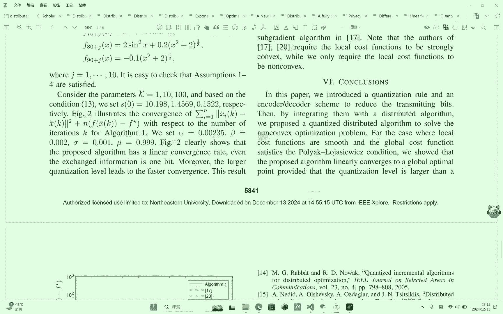
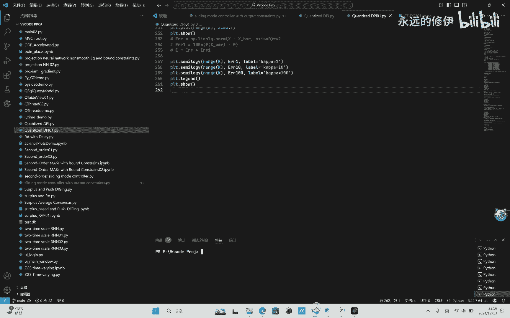
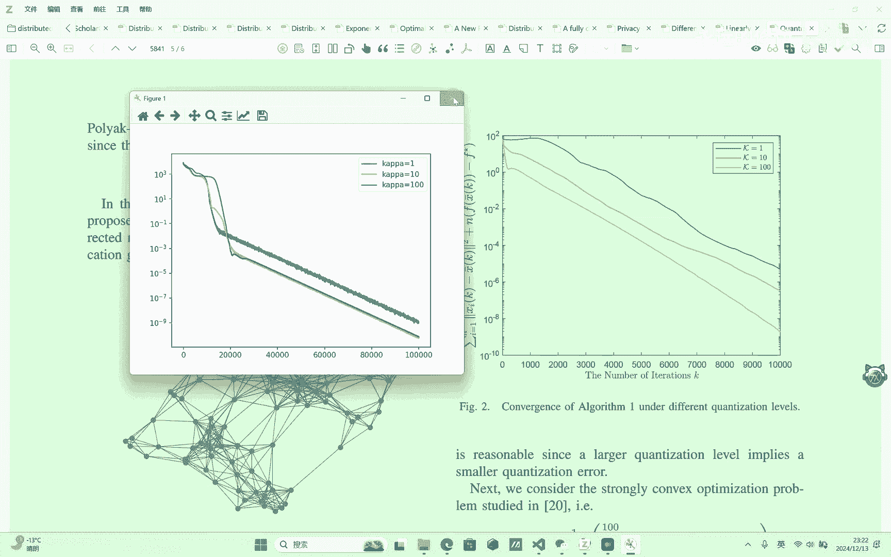

# 线性收敛的量化分布式非凸优化／Python科学计算 - P1 - 永远的修伊 - BV1YyBuYEExo

我们继续来分享这篇文章，这篇文章标题是叫做量化分布式非凸优化，代为线性收敛速的啊，我之前已经讲过了，就是在分布式优化里面考虑通信，是一个很啊经常考虑的一个点，包括之前考虑通讯拓扑，比如说考虑无向图。

有向图嗯，固定图，固定拓扑和实变拓扑或者是切换拓扑等等，还要考虑通信嗯，事件处罚，量化压缩或者是事件触发加量化等等，然后第三个考考虑安全隐私，安全的话，比如说如果你考虑你这个是一个控制里面。

叫做最优一致性，这里面的考虑安全就多了，比如考虑考虑拒绝服务攻击，如果还涉及到一些状态的话，可以涉及到一些呃虚假虚假数据注入等等很多，包括考虑差分隐私等等，啊我们还是按照之前的思路先看一下摘要。

这篇文章考虑了一个分布式分U问题来求解，最小化化，由局部代价函数的平均，通过使用局部信息交换，在有向在无向图里面，这个通讯信道经常是，因为通讯信道经常是有限的，带宽或者是通信容量有限。

我们首先引入了一个量化规则，是一个边加编解码的方案来减少传输比特数据，通过集成他们一个分布式优化分布式算法，我们提出的一种分布式量化飞出优化算法，然后再考虑全局大减函数，满足pr条件的时候呃。

它并不需要局部额全局函数输出的，或者说全局最小值是唯一的，然后我们所提的算法，可以线性收敛到一个全局最优点，同时一个低数据的，条件提供了来保证我们算法的线性收敛，然后通过一个数值仿真来验证它算法的核心。

然后也是这篇文章的一些背景知识和啊，relate related work相关工作文献综述以及contribution，然后再是符号说明，然后再是一些预设知识和问题描述啊，无向图，这是无向图的描述。

很经典的无向图，然后考虑的是这样一个分布式优化问题，并且采用了以下假设，无向图是联通的，每个代价函数是光滑，带有常数是LF有LF光滑，然后最小最小值最优值集合最优解集非空，且最优值有界。

全局代价函数满足P的条件就是四个假设，然后假设1~3是文献中常用的假设，假设四比现有文献中考虑代价函数会强，突要更弱，然后这是，无向图里面经常能用到的一些预设知识，关于矩阵里面。

这个拉普拉斯矩阵满足什么样的性质啊，比如说它有一个简单的特征值，零他零相关的一个特征向量是权益的向量，然后这个KNKN这个很有意思，KN其实这个他相当，它可以表示一个，表示一个完全连通的一个。

无向图的一个拉普拉斯矩阵，就是L和KN有一有一定的关系，就是它的一个特征值里面有一定的关系，然后这篇文章主要考虑了一个在飞度场景下的，一个特殊飞度场景下的一个量化方案。

量化的是采用的是一个编解码的一个量化方案，简单来说你可以认为他是个阶梯信号一样，就是在超出我这个量化水平，就是比如说我这个最大量化水平是K，超出K的时候，比如超出K他就会量化到K的这个范围内，小于负K。

也为量化成负K，然后在负K和K之间满足四舍五入，就简单来理解的话，比如说3。2在量化水平为四的时候，它就会舍入到33。5，3。6，他会被，圆整到四，然后4。04。14。2，他都会被量化器饱和。

就会被限制到四，就这个意思，然后编解码的方案，我们来看我们使用的这个量化器的话，它的量化误差是满足这样一个关系的，在量化器非饱和的情况下，量化误差有决定他满足这样的关系，它量化值与它的原信号是满足。

一个小于等于1/2的，就我刚才说的满足这样一个阶梯状的关系，编码我们看他怎么描述的，就是我每个智能题，它能够迭代产生的一个MV的一个量化数，量化输出，Z和一个内部状态，Bj。

也就是说BJ这个信号是我每个智能体私有的，它它自自带的一个内部状态，所谓内部状态，也就是说他不会把这个信息发送给他的邻居，就这个意思，然后BJ会变，然后XJ变变变是在编码编码之后的。

Z是要发送给他的邻居的，然后在第二个智能体就是I的正能体，属于J的邻居的时候，就是假如说J的邻居，I是J的邻居，他就能接受到来自于I编码，来自于J编码的型号，你看这把这个信号发出去了，就是量化的输出。

发出去给他邻居爱捕获到这个信息，然后他要解码叫编码，解码解码就采用这套方案去解码，所以你这里就注意到了，实际上每个智能体在迭代的时候，他是用他已经解码后的信息去进行update更新的。

就这样额他这里有个remark，注意到BJ是个预测器，SK是一个伸缩函数，用来调整这个预测的误差和初值，S0是可以足够大，来保证我们的量化器不饱和，这表明我们的量化误差是有界的，也就刚才这个关系。

然后在这个基础上，我们就可以得到这个关系，我们可以得到这个关系，我们来看一下我们的算法，这里面是一个pi算法，pi算法叫量化分布式pi算法，如果你把把这个换成X，这个U减去梯度，然后，嗯需要注意的是。

这里是个离散的算法，他跟那个连续的算法的话，其实也一样，其实也一样，只不过连续算法的话就变成X导，然后等于负的LXX减去YFY，减去兰姆达FX，然后Y导等于等于Y导，直接等于LLX。

这时候这个这个pi算法的一个特点，就是它只通信一个变量，只交换x HT，这个这个就是要通信的嘛，只有x HT在通信啊，准确来说应该是Z在通信啊，Z在通信，就是他只会把Z就刚才说的这个地方的Z。

但运算的时候还是用解码后的信息，反正你就理解这个之间的关系就可以了，然后又加了这，Originason is motivated by the discrete time。

Proportion in your control，Stress strstructure，嗯从模式飞通通过，这应该是事件触发的，把别的奥特曼卡上的，这个就是pi算法的连续版本。

这个应该是我看看哪篇文章，这个应该是鼻祖级的工作，就是control approach to dispute amazation，另外就是PS了，他把那个控制框图都画出来了。

然后之后的工作就是分析了分析分析，分析完之后最后是仿真，然后这边仿真的话，这个结果应该是用MATLAB做的嗯，在这一章我们嗯来演示我们那个算法的效果，考虑了一个无线连，无线网络，包括100个智能体。

然后通信拓扑是随机连通的，随机产生的费个一，这是个随机图随机产生的，然后考虑的是100个非to代价函数，这每个函数都是非凸的，那确实有100个函数，然后分别考虑了卡帕等于一十。

是130种量化水平下的一个算法，然后它相应的那个伸缩函数，删除函数的那个初值不一样，刚才说了这个深度函数，它的初值要保证它是量化器，不保额，三个初值描述我们的算法啊，图二描述我们的算法的这个收敛性。

他是个线性收敛的，然后算法参数是这样的，六等于0。9999，主要是这两个图，额他总共是做了两个两个例子的仿真，第一个是数值方针，第二个是一个数据的方针，而且与其他算法对比了。

这里的话我只实现了其中第一个，第二个的话就是这种数据方面的话，说实话我现在还不太会，就是这种数据一般是考虑一个线性，你可以认为是一个线性回归，还有一个L正则化，而且他这种的话一般都会比较高维。

每个F都是一个矩阵，这种数据处理起来会比较麻烦，你不太好把这个算法写成一个紧凑形式去写，它代码不是好，不是不是那么容易写，应该是不是那么方便些，所以这个这个数据的例子，包括你在看其他的很多文章里面。

他的那个算力都是用的是一个那个，比如就是考虑X减B的这种范数的这种情况，你相当于是求一个线性方程的解吗，然后这个A的位数会很高，然后智力的个数又很多，你这个不太好，不太好写。

而且我感觉如果你用MATLAB跑的话，这个时间是不是会更长一点，嗯这个也不好说，我感觉你现在骂他玩也挺快的，啊我们来看一下这个仿真结果吧。

首先第一个是他的这个通信top，我这是用Python得到的一个100个节点的一个，随机拓扑，然后这里面考虑了三种情况吧，就是量化量化水平为一时比特数，一一十和100的情况，可能要稍微等一会。

我先把这个擦掉，对了，这个图，这个仿真里面，他没有去把他那个一致性的那个结果给画出来，也就是每个状态的那个轨迹没画出来，画出，不过现在一般跑这个分布优化的结果里面，他一般都不放这个。

除非你这个结果有很大问题，一般都只会放他那个收敛速度，和以不同的算法之间的对比，可能是我电脑没有插上电源的原因，跑的跑的有点慢，我稍微暂停一下吧，好了出来了，这是那我水平为一的时候，卡八等于一的时候。

他这个所有状态都收敛到最右，这里应该收敛速度还比较快吧，这是等于十的时候，这是等于100的时候，这是三个结果的一个比较收敛速度，可以看看，看到后期呈现的是一个线性收敛。

但我这个结果感觉跟他这个实现的误差，还是有点大的，他这个在按照理论来讲，应该是在量化水平越高的时候，他的收敛性越好，因为他能够你想想他那个偏差就会小，特别是在初始的时候，第二个例子还没有实现。

