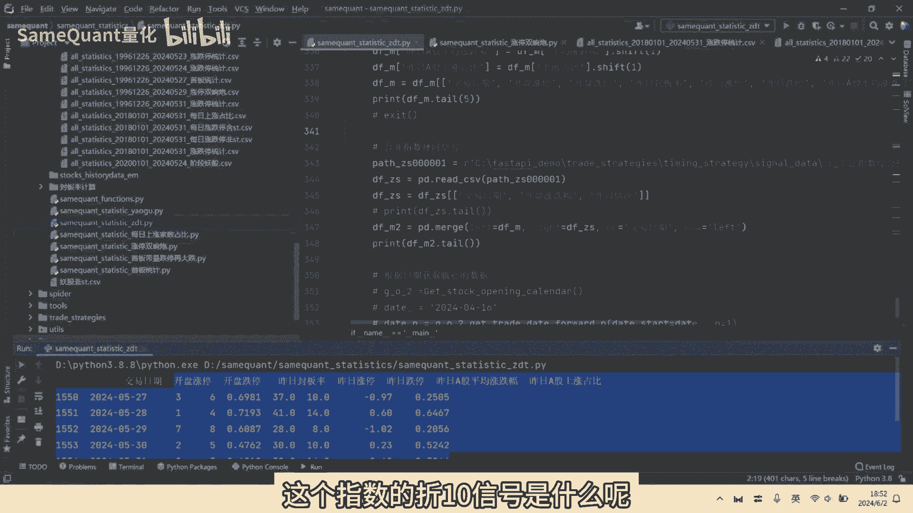
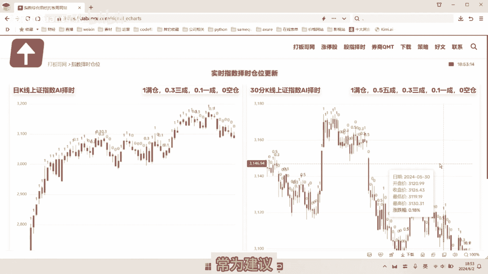
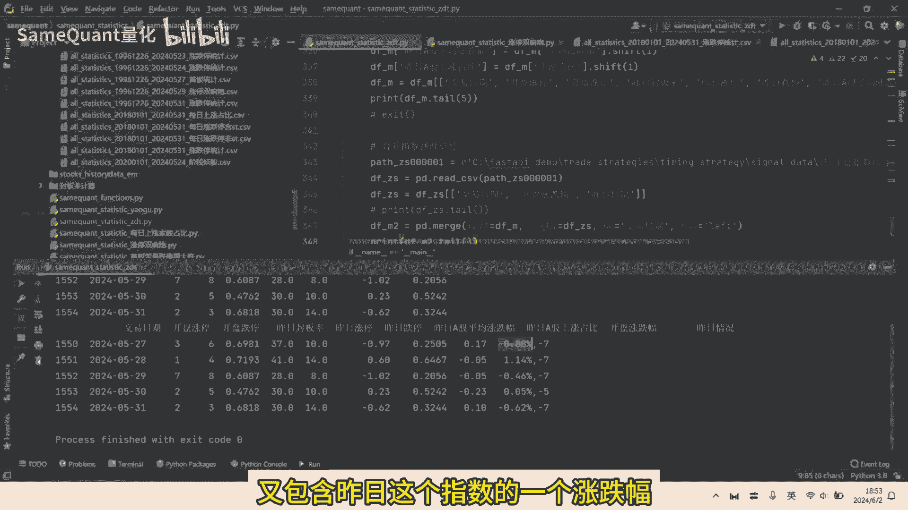
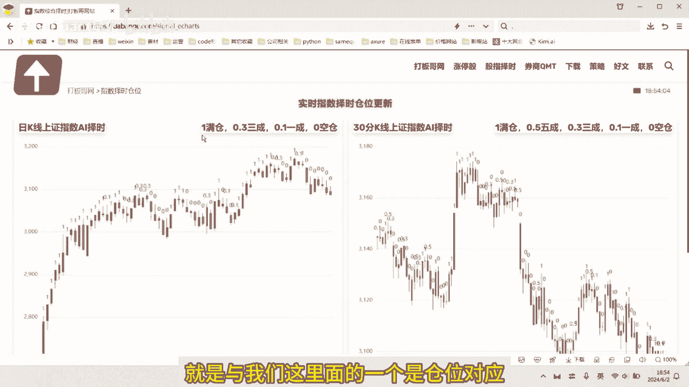
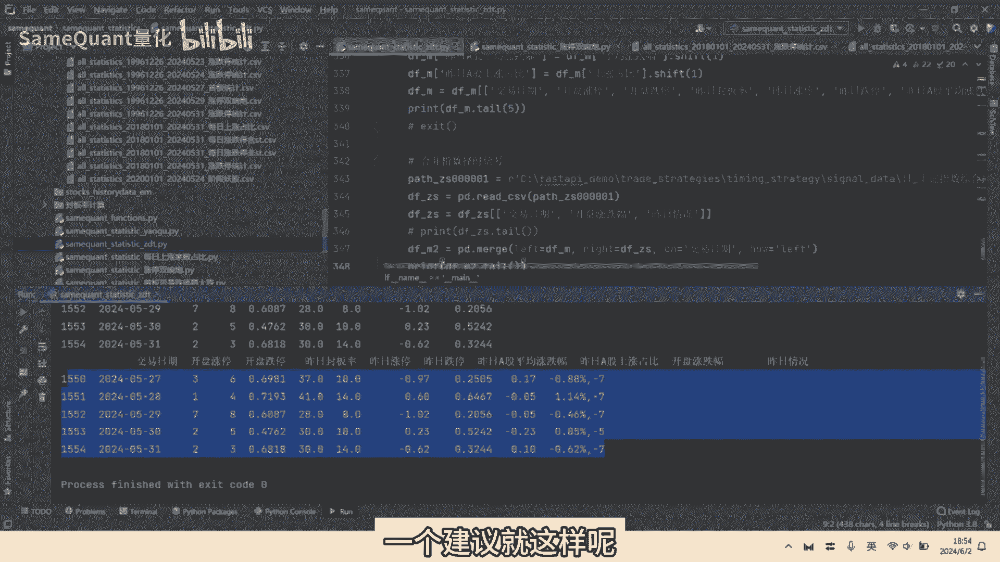

# 统计历史每日涨跌停家数、开盘涨跌停家数、上涨占比等，作为量化因子 - P1 - SameQuant量化 - BV1jy411b7d2

无论是实盘还是回撤时啊，短线有几个数据是很重要的啊，比如说昨日的一个涨停，跌停加速封板率，昨日的一个上涨加速占比，那昨日上证指数的择时信号和仓位建议，那当日早盘的均价后的一个开盘，一字涨停的加速。

一直跌停的加速，那指数开盘的一个涨跌幅，那这些数据呢在量化交易里，我们叫做因子或特征，各位学员好，这里是sim矿上量化，只讲干货，适合理性的人观看，本期就分享如何计算以上因子，历史上每一天的数值。

接下来呢我们来到Python代码环节，首先呢我们运行单只个股的涨跌停统计啊，可以看到这是筛选出了历史上啊三只个股，它历史上有涨停，跌停或者是炸板，或者是一直把等数据的，所有的一个日期给列出来。

这是单只个股的，接着呢就计算全这个方法，就是计算全量个股的历史上的一个，涨跌停信号啊，由于我们之前呢已经运行过，我们这里就不再重复运行了，那运行计算全量个股的涨停信号之后呢，就会得到几个CSV文件。

一个是涨跌停统计的一个文件，这个文件历史上的所有的啊，有涨停或有有跌停的这个个股的啊，这个涨停的一个明细数据，这个表是根据交易日期统计的啊，我们整个A股的它每一个交易日的一个涨停，出版加速啊。

一直跌停加速可以开盘跌停涨停炸板啊，非一涨停非一炸板啊，非一跌停，封板率，一字涨停，封板率非一封板率等数据好，这个是只包含s st股的统计数据，那还有一个表呢是这个表，排除掉ST后的。

历史上每一个交日的各种涨跌停啊，炸板啊，开盘涨跌停的一个数据好，还有一个表，历史上每一个交易日的，一个是一个我们A股的一个当日的一个，交易的股票数量，另外当日的一个平均涨跌幅，还有是当天上涨的加速。

还有以及当天的一个上涨占比好，有了这些文件之后，我们接下来进行进一步的一个计算，接下来呢，我们是先将历史上每一个交易日的一个啊，开盘跌停，昨日封板率涨停，昨日跌停，这个数据与什么呢，与上涨占比进行合并。

好我们运行看一下，合并完之后呢，就得到了这样一个表啊，我们取这个表的最后五行数据，那这个表的数据有哪些列呢，第一个是交易日期，另外是开盘涨停加速，开盘跌停加速，昨日的一个封板率，昨日的涨停，昨日跌停。

昨日A股的平均涨跌幅，昨日A股的上涨占比，那这里要特别注意，为什么我们只取这些列的数据啊，因为我们在回撤的时候，你在盘中选股的时候啊，历史上那首先这几个数以上的这些数据，我们都是可以提前知道的。

因为第一昨日的一个数据肯定是可以提前知道，另外开盘的涨停，跌停加速也是可以知道的，这样就避免一个过拟合，所以说我们在回撤的时候啊，尽量要用，我们就说我们回撤当时那个时点。

我们可以明确知道的一个数据去回撤，那才没有未来的一个函数，这才是逻辑上才是自洽的好，接下来呢在与什么合并呢，在与指数的一个择时信号合并，这个指数的择时信号是什么呢。

我们来到我们的一个打板哥网，这个就是指数择时的一个仓位信号，简单的说说一下是什么意思啊，我们可以看到这是上证指数再折时，这是上证指数的日K线图，左边的每一个K线图上面有几个数字，有一啊，0。32，0。

10，那代表什么意思呢，一代表是当时啊给的一个周盘之后或者盘中啊，它是实时变动的，它是给了一个仓位，近一代表是满仓，0。1呢代表是一成仓，零代表是空仓啊，比如说最近都是持续的零空仓的一个提示。

那右侧呢就是30分钟K线图，叠加了一个指数仓位建议啊。

两者呢呃结合使用效果更佳，好，接下来呢我们再合并历史上每一天的择时指数，择时的一个仓位建议信号，那最后就得到了这样一个表，交易日期开盘涨停，开盘跌停，昨日封板率啊，昨日昨日跌停，昨日A股平均涨跌幅。

昨日A股上涨占比，那开盘指数的一个涨跌幅啊，它是高开还是低开的，这个是开盘指数的涨跌幅，昨日的情况里面，又包含昨日这个指数的一个涨跌幅啊。

主要是上证指数，当然你也可以是其他的数，后期就是与我们这里面的一个是仓位对应。

那七就是零啊，代表的就是零空仓的一个零空仓的一个建议啊，你看最近七负五负五负五也是零的一个建议，就这样呢。

就形成了我们在回撤当中所需要的一个，因子和特征收益率，当我们有了这些因子的数据之后呢，我们通过机器学习对这些因子的数据进行统计，分析，计算后找出规律，以期呢规避掉啊容易亏损的交易日期。

捕捉到啊容易盈利的交易日期，来提升我们量化交易策略，的一个稳定性和收益率，量化交易是工具也是趋势，建议积极拥抱，如果您也对量化交易感兴趣。

