# 网红可转债策略能赚钱吗？｜附Python量化代码【量化交易邢不行啊】 - P1 - 量化交易邢不行啊 - BV12Z421M7kq

提到可转债啊。

一般都避不开集思路这个论坛，这是一个相对小众的投资论坛。

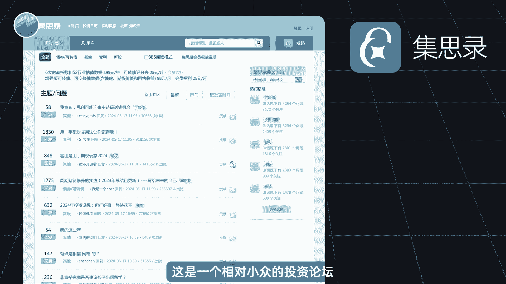

上面的用户呢更偏向于低风险的投资方式，以讨论新股可转债ETF为主，很多当下比较热门的可转债策略。

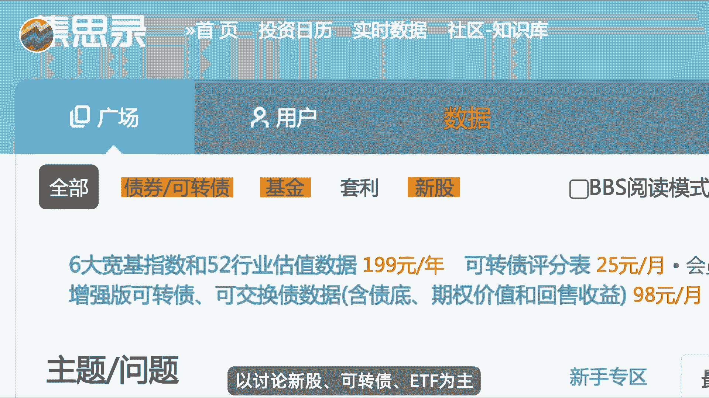

最早也是来源于此，比如这几年大家讨论了很多的可转债双低策略，这个策略就是在2018年的时候，由集思路用户YYB凌波提出并开始实盘的。

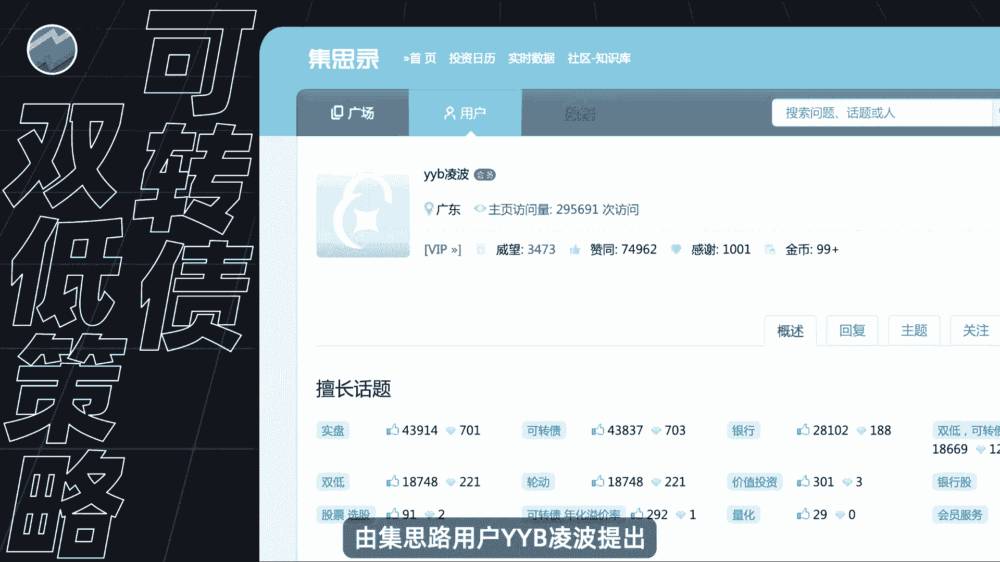

后来呢在2020年牛市中，被各类理财博主推荐，变成了最适合小白的理财策略。

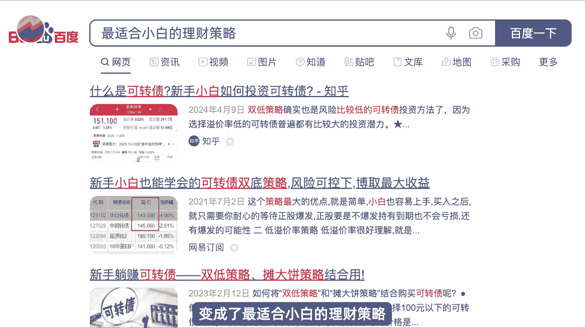

那这个转债策略真的那么神奇吗，我们来看一下这个策略，可转债的价格和它的转股溢价率都是越低越好，所以呢凌波他设计的双一策略当中，就是很简单的把转债价格和转股溢价率相加，得到一个双低值指标。

然后呢根据这个双值来进行选债，这个指标哪个低我就选择哪个，这样选出来的债券呢，保证这两个指标相对来说都是比较低的。

当然通过这样的指标来选债，到底有没有效果呢，这个我们肯定要自己去验证的，我们可以尝试着构建如下一个量化交易策略。

比如说在每周最后一个交易结束之后，比如某个周六周日你比较空了，那你拉出所有可转债的数据，计算出他们所有的双低值，然后按照双一直呢从小到大进行排序，并且删除了当时那些正股已经是s st。

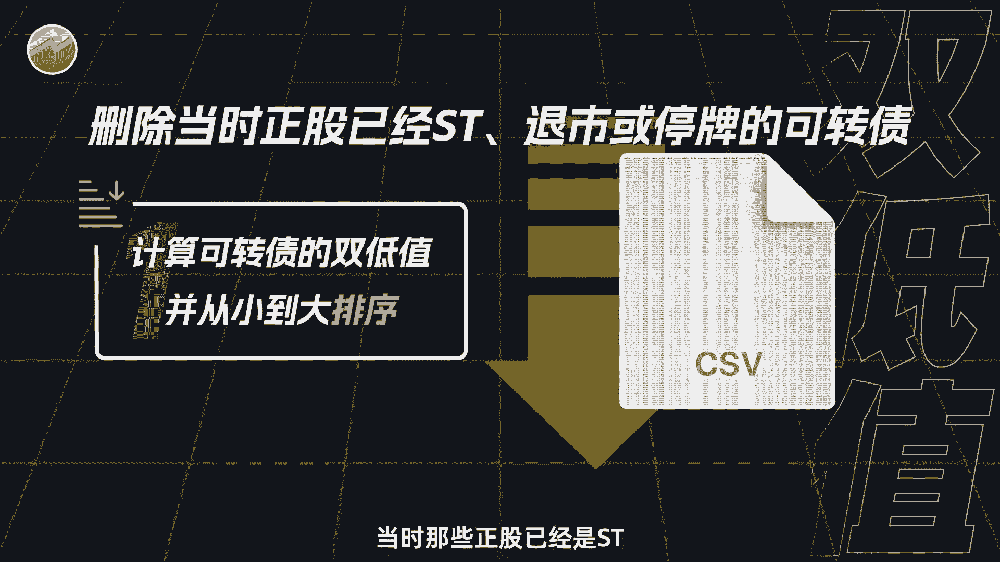

或者退市或者停牌的可转债，挑选出此时双低值最小的五只可转债，然后呢我们就在下周的第一个交易的开盘，去均仓买入这五只可转债，并且呢会一直持有到下周一整周，下周一整周你都非常用心的工作，没有去看盘。

它涨和跌你都不管它，直到下周最后一个交易日收盘的时候，你把它全部卖掉，不管赚钱还是，然后呢再重新去选择双地值最小的五只可转债，并且呢在下下周的第一个交易日去买入，如此循环往复。

比如说途中我在24年3月1号这一天，就在所有可转债当中选出了这五只转债，因为他们是此时双低值最低的，那么我就在下周的第一个交易日，也就是3月3日，我去买入他们，然后一直持有到3月8日这一天出之后呢。

再重新选择符合条件的可转债，那么这样就是一个简单的量化选策略。

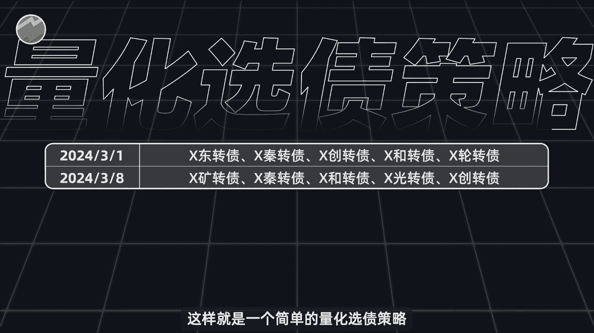

假设我一开始投入一笔钱去交易这个策略，那最终是会赚钱呢。

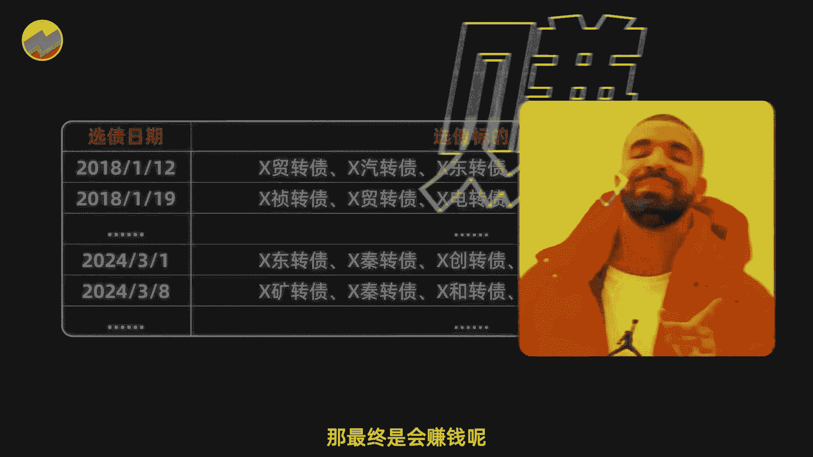

还是会亏前呢，要验证我们这个实验的想法，就需要借助全部的可转载体的数据和Python代码，来验证它具体的数据和代码，我这已经帮大家准备好了，这里面包含了A股历史上所有的可转债，甚至是那些已经退可转债。

你可以打开其中任意一个文件。

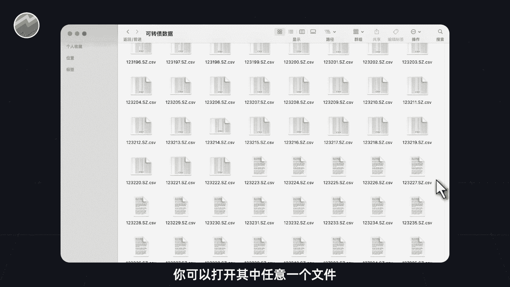

包含了这只转债从上市第一天至今，每天的开高收低的价格，甚至还有它的转股价格，转股溢价率等等指标，非常的完备啊，有心的同学应该知道，这份数据获取并不是那么容易，有了这个数据之后呢。

你只需要打开这个PY后缀的文件，点击运就可以看到结果，如果你也需要这个数据和代码的话，大家可以在评论区留言。

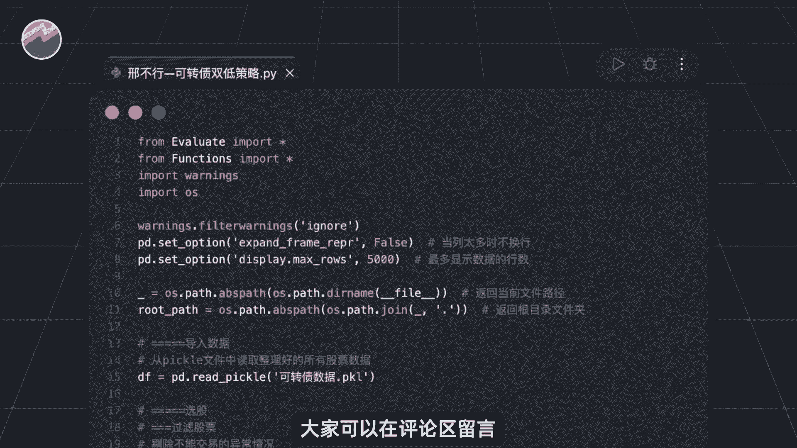

都是可以直接发给你的好，那么我们来运行一下程序，看看结果如何，结果呢，如图所示，代表策略的蓝色曲线，从一开始的一块钱涨到了最后的1。5亿元，跑赢了图中的橙色曲线，那是代表大盘的沪深300指数。

但是并不能说明这个策略收益有多好，因为它的年化收益只有6。85%，最大回撤呢高达51%，并且目前你可以看到还在回撤当中，这样的结果并不是很让人满意。

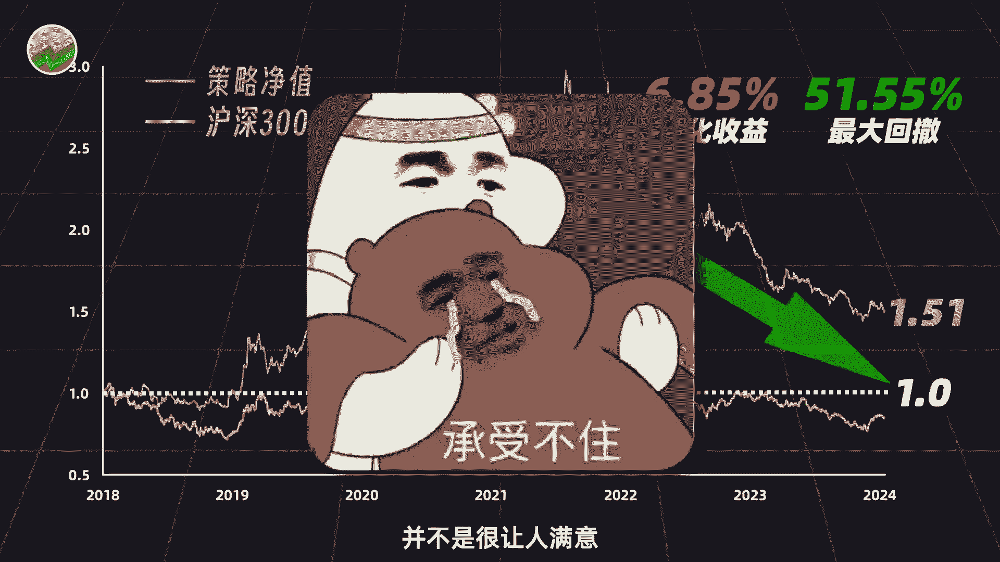

而且可以很明显的发现啊，这个策略从18年的21年年底。

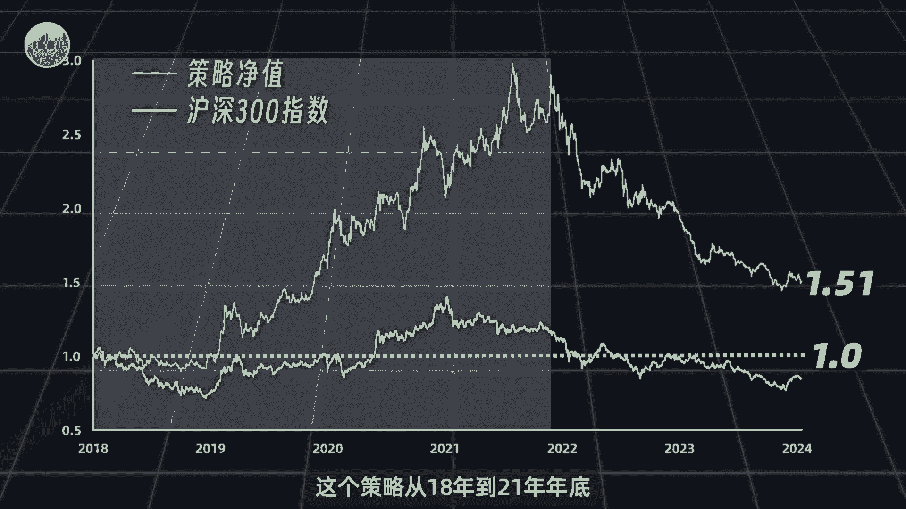

都是非常有效的，这几年大概最多的时候翻了三倍，但是21年之后呢，就一路向南，一直处于回撤当中，那么这个转折点21年啊其实也是挺有意思的，如果我没有记错的话。

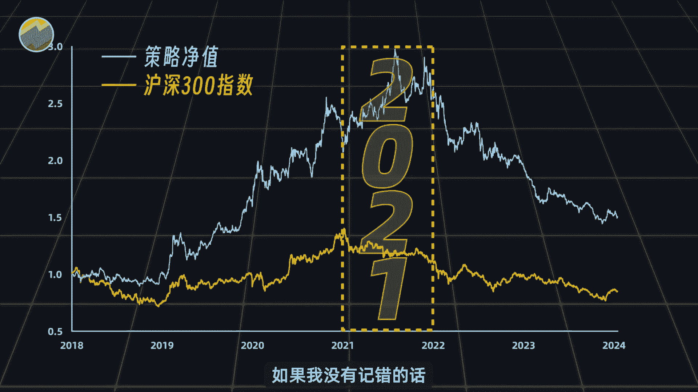

2020年左右，可转债市场逐渐火热，连最简单的打新也能获得很高的收益，也正是在这个时候，很多人开始推荐双低策略之类的，甚至有人说啊，这是最适合新手散户最稳定，收益最高的策略，但随着最近两年的回撤。

你就发现很少再听人说起了，其实啊金融市场就是这个样子，人越多的地方越不能去，越多人吹捧的事物越要远离你，也可以回忆一下自己炒股亏钱的经历，很多时候都是看到朋友甚至是群友赚钱了。

也就投了点小小钱跟着冲进去，一开始确实赚了点猪脚饭的钱，等到又赚了一顿疯狂星期四的钱之后，你就再也忍不住了，放了很多的钱进去，这个时候呢就开始亏，再然后就没有然后了，很多人自己亲身体会过后面的经历。

其实啊相关经历啊，我们也出过很多期视频，用数据去证明了类似的观点。

感兴趣的朋友可以去看一看，加深下印象，我是行不行，关注我。

