# 2024年金融大神老师讲解量化金融分析师.AQF—量化金融专业知识与实务 - P15：《实盘交易模拟_基于优矿平台的面向对象策略》03.优矿框架_Context对象用法 - 量化沿前 - BV1oU411U7QM

好各位同学大家好，那么接下来的话呢我们要跟大家讲，我们优矿里面的一些重要的一些API啊，那么呃在这个里面的话呢，我们先会把这些API啊逐个跟大家一一介绍一下，那么因为如果说是没有接触过任何的呃。

有矿的同学的话呢，大家可能会对这个API的不是特别熟啊，没关系，你先大致把我们的这个介绍呃，先在脑子里有一个印象，完了之后的话，那我还会去跟大家讲，各种各样的，在我们优矿上面实现的一些strategy。

那么呃我们在讲strategy的时候呢，再会回过头来带着大家去参考我这个里面的呃，API里面的一个介绍，那么这样的话呢先学一遍，知道这个不同的函数，不同的方法是用来干嘛的，完了之后呢。

再呃在真实的策略里面碰到的话呢，大家就可以看到了，好大家就会学会了，而且这里部分的这个part three啊，大家可以把它当成一个工具听明白吧，哎或者说大家把它可以当成是这样的一个工具，模块。

并不是一个课程模块啊，也就是说呃我想实现一个什么样的一个功能，哎你不知道怎么干了，你不知道怎么做了，可以来我们这个里面的PPT来去查一下，能理解意思吧，当然了，这个优框里面基本上八九十%的。

最常用的那些内容啊，我们已经都在呃，我们这个PPT里面给大家整理好了呃。

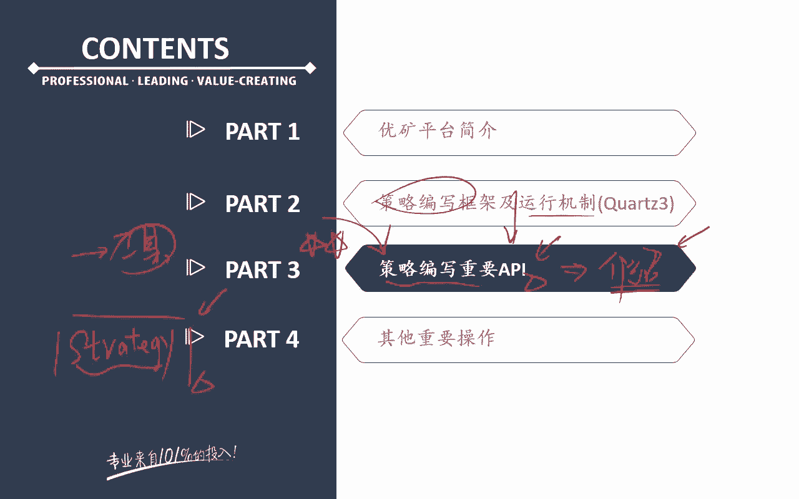

呃可能还会剩下一个10%左右的一个内容，对吧，那怎么办呢，就在这个里面，优矿的官方的这个介绍就是帮助呃。

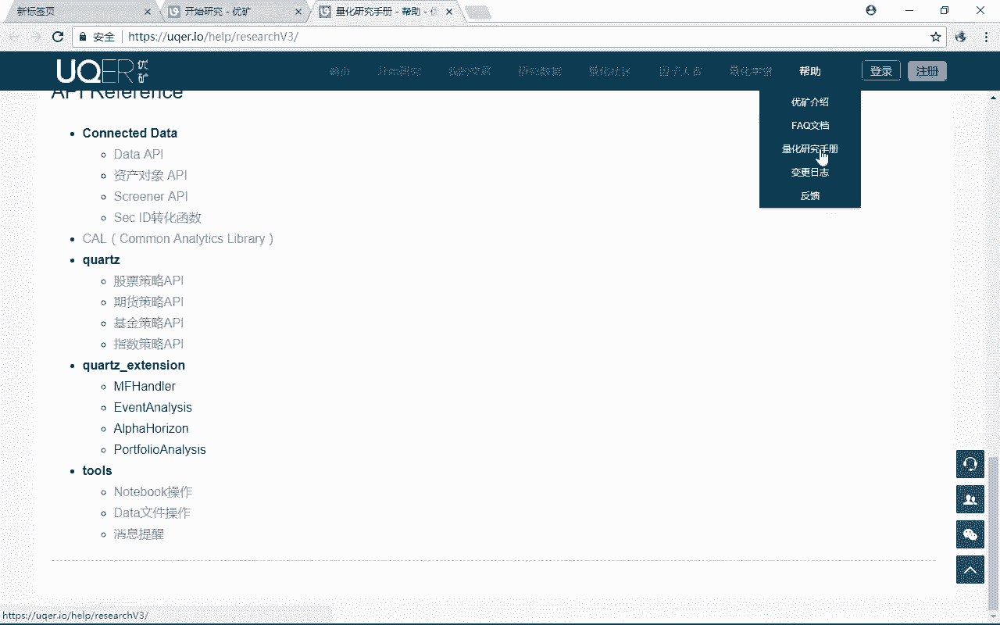

量化研究手册和股票策略的API，这个里面没题吧，哎因为我们不可能把所有的东西全都给你，弄进去啊，这就不是讲课的一个意义了啊，那么先自己在写策略的时候，碰到要用的一个东西了，怎么办，先来查我们这个PPT。

我们PPT是逻辑都是梳理好的，完了之后的话呢啊如果PPT里面没有，那你再到呃油矿的这个官方网站上去查一下，没题吧，哎好那么额。

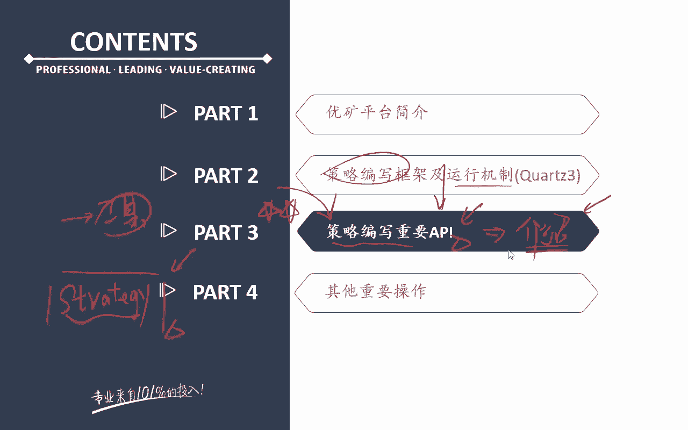

接下来的话呢我们就来看这个里面，到首先来看最重要的一个东西啊，叫做context这样的一个运行环境，这个context的这个它其实是我们优矿里面的，非常大的一个这样的一个大环境啊，是这个大的一个类额。

所以呢对我们来说，这个context其实我们之前跟大家讲过啊，他是一个大的环境，这个环境里面有行情数据，有各种各样的其他的一些数据对吧，那么包括零额在整个策略的调度过程当中。

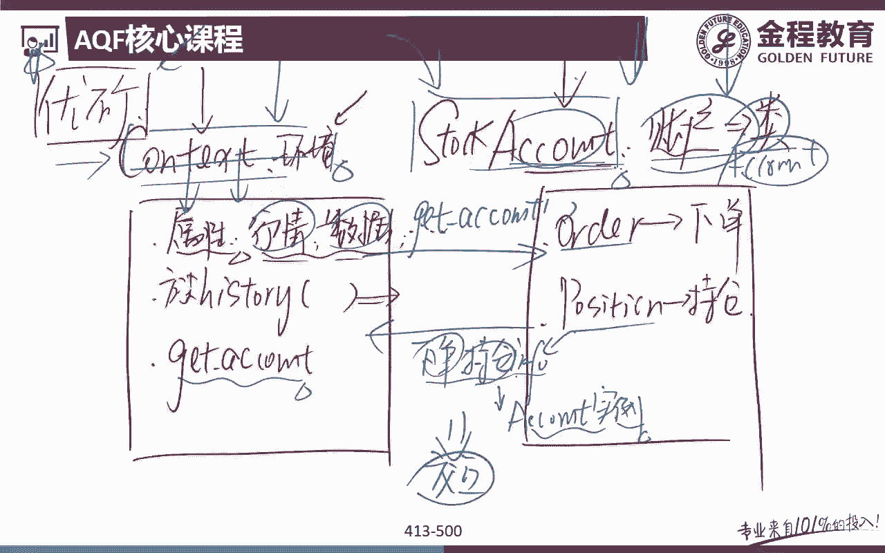

产生的一些临时数据，也都会在我们这个context里面，那么这个context的话呢，它其实要跟我后面要跟大家讲的一个东西，叫做account这个账户，这个账户这个类啊去进行一个呃沟通完了之后。

那么账户这个里面负责的是下单啊，持仓啊，那么context的这个类呢，就负责的是策略的一个调度，整个行情的策略的逻辑，那么对我们来说，这两个之间进行啊一个有机的一个沟通的话。

那就可以完整的把我们这个策略，把它给走下来了啊，好所以呢对我们来说，我们可以给大家看到啊，context它表示的是策略的一个运行环境，那么它里面有策略的运行时间，行情数据等内容对吧。

它还可以去呃存储的是一个策略呃，生成的时候的一些临时数据，那么对于我们来说的话呢，策略框架会在启动的时候，创建这个context类的一个实例，那么它会以参数的形式传递给这两个东西。

一个是initialize，一个是handle data，那么这个的话呢在前面跟大家讲的里面，已经跟大家讲过啊，Reactionalize，就是我们一些初始化我们的策略的参数。

handle data的话呢，里面写的就是我们策略的一个整呃，完整的一个逻辑，那么对我们来说，这两个啊你都要把context作为参数传递进去啊，那么这两个东西的话呢不写也没关系。

因为呃我们直接在呃我们的优矿里面啊，来看一下优框里面有这样一个嗯，我们跟大家讲过啊，他有这样一个呃唱呃啊工作业对吧，工作业里面你可以新建一个策略，或者说新建一个notebook。

那么在我们这个里面新建这个策略的话呢，我们会发现它会自动帮我们这一个部分，是不是出策略的回测设置啊对吧，然后呢这是一个什么额账户的一个设置，这是ANANCIALIZE，这是handle data。

他是不是都已经帮你写好了对吧，哎所以呢对我们来说，而且包括后面啊，你要自己写代码，你就在后面直接加一行写代码就好了，那么我们再写一个策略的话呢，那么在这个里面再点一个加策略，在这个里面就可以都有了。

而且呢在这个里面默认的这个值，他都已经跟大家说好了，写好了没对吧，所以呢在这个里面是股票账户，那么他这个里面账户的名字也可以随便改啊，那在这里叫fantasy account对吧。

我们前面的那个例子里面叫做什么呃，self account啊，都一样的东西啊，那么大家知道一下啊，好那么我们来看一下context的这个大的这个类。

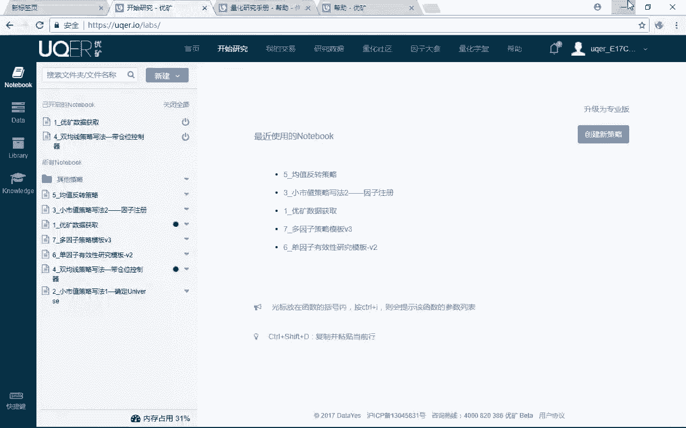

或者说它的一个呃，大的对象里面有些什么属性和方法，注意属性是静态的一个东西对吧，方法的话呢是怎么样动态的一个功能，那么讲到这里，大家有没有感觉啊，怎么去区分我的属性和方法，哎，属性的话。

那就是这个类或者这个对象点一点，是不是就出来了对吧，哎后面没有括号的，是方法的话呢，一般来说是这个对象或者这个类点一下哎，后面是一个方法名字，是不是后面还要加一个括号啊，哎就类似于我这个怎么样哎。

函数的一个操作手法，没地吧好，那么我们先来看一下，在这个里面有几个重要的一个属性和方法啊，基本上我们把context里面最重要的一些函数额，首先和方法都跟大家讲了，第一个context点now很简单。

它就是啊顾名思义，我们就可以知道额返回的是什么，我们策略运行时候的，现在这个时间点，那么current data呢，就是这个策略运行的当前的时期日期，Conromani，当前的一个什么分中值没题吧。

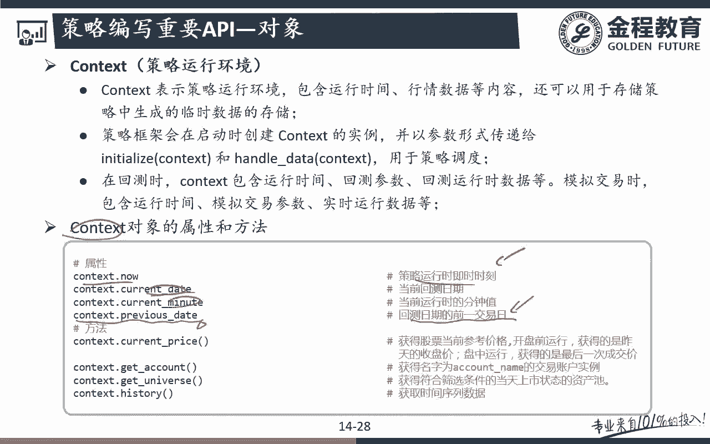

哎这几个用的不多啊，但是这个用的很多，context等previous data，这个用的很多，因为什么，比如说我们之前跟大家讲过啊，通过data API去调数据的时候呃，这个函数这个接口它会问你啊。

我的date是什么，我的日期是什么，那么一般来说我们不能拿到当天的一个呃，在回测的时候啊，这个当天还没收盘，我是拿不到当天那个数据的，所以呢我要拿的什么current contest，怎么样。

previous state这个方法没呃，这个属性听明白吧，我应该拿到的是上一天的我的一个因子值，听明白吧，哎好，那么接下去的话呢这是呃我contact类的一个属性啊，那么接下去再看它的一个方法。

他的这个实例呃，他的一个对象的这个方法的话呢，contest点current怎么样price，现在当前时间点上，我的这支股票的这个价格，这个也用的不太多啊，但是注意后面这三个用的非常非常多啊。

大量扣五角星呃，对我们来说，第一个context的点get account，注意啊，这个函数的话呢也不用大家去写，因为呃在我们这个里面，我们新建的这个策略的这个模板诶，新建的这个策略的这个模板里面。

额已经带着大家写好了，你看account，点get account fantasy account，注意这个其实就是在干嘛呢，这个其实就是在说我拿到的是account。

以account name为交易账户的，这样一个账户的一个实例，所以对我们来说，还是回到我们前面那张空白PPT上来，也就是说在我们这个里面跟大家讲过，我们通过get account的话呢。

是不是就可以拿到account这个账户类的，具体的一个实例啊，这个实例里面就是你现在的持仓情况下，单一些情况是不是都有啊，所以get account这个方法一定要注意啊。

context点get account，方法其实就是拿到我的一个账户类的一个实例，拿到account类的一个什么实例，那么这个实例的话呢，我们这里面存储的就是我当前这个策略里面，我所买的股票。

我的持仓情况问题吧，哎好那么下面这一个也是用的非常非常多的啊，这个context点点get universe，它指的什么意思啊，universe是不是我们之前在策略刚开始的时候，定义过啊。

来我们现在的universe是什么，但是注意啊，这个universe是不是一个可变的一个证券池啊，比如说如果我的universe是dynamic，沪深300的话。

那么今年的universe和明年的universe，是不是不一样，能理解意思吧，哎那么后面我们还会跟大家去讲啊，这个的universe还可以是什么呢，我这个universe可以是额。

比如说我的策策略每个月运行一次，那么我这个UNIVERS可以是吗，每个月月底那一天的，比如说我市值最小的200只股票，能理解是吧，哎市值最小的200只股票，那么这是我的一个universe。

那么大家想想看，这个原点反思，是不是也是一个可变的这样一个过环境啊，对吧，哎因为什么，因为对于我们来说，在这个月可能市值最小的200只股票，是这200只股票，再过一个月的呢。

下下一个月的市值最小的200只股票，那就是另外一只怎么样，另外两呃，另外一批200只股票能理解意思吧，所以universe它可能也是一个动态变化的一个，什么过程，所以呢顿麻说我在策略的执行的过程当中。

我是不是也有可能每次执行策略我都要看一下，现在我的universe是哪个，能理解意思吧，哎所以呢一般来说在策略的运行的开始的，但是并不是所有的策略都会有啊，所以呢他就这个universe并不像这个账户。

因为账户你要有策略的话，这个账户一定要有一个的对吧，所以呢在我们这个里面，它就作为默认了这个账户，就直接给你写好了对吧，那么这个get universe呢，他认为并不一定所有的策略里面都有。

但是绝大多数策略里面都有啊，因为一般来说我们在策略呃开始的之前，进行编写策略逻辑之前，我要看一下我整个PFOO。

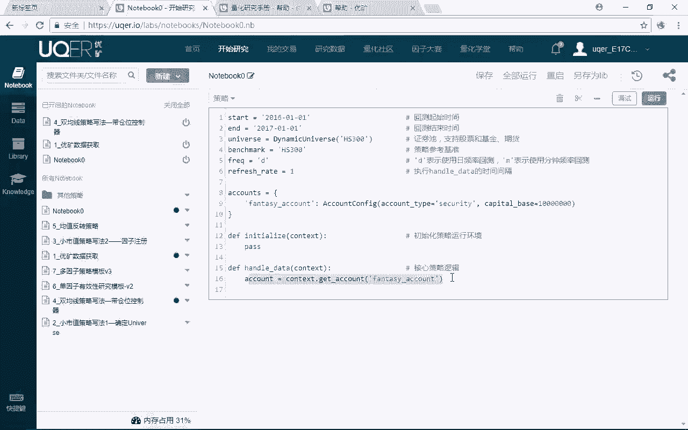

我整个能买的证券池是什么，能理解是吧，哎那么我要看一下，我能所购买的这个证券池的这个大的破，是里面有哪些股票，哪些股票是我的一个候选池，那么在我们这个里面，我们就可以要用到这个里面的。

get to univer能力吧，哎好，那么呃就是获得符合当前上市情况状态的，一个资产值，没问题吧，哎后面这个我们也是用的非常非常多啊，后面这个的话呢，其实直接掉的就是我的一个行情数据呃。

contest history直接拿的就是行情数据，当然它也可以去掉一些因子数据啊，那么这是我们用的最多的一个接口了吧，可以说是啊，但我们策略里面基本上也是，每个策略里面都会有好，他其实我们就知道一下。

他获得的是我们的一些呃行情数据没问题吧，好那么接下去我们一个个来讲啊，额，首先嗯这个get account这个方法我们就不说了对吧，前面已经跟大家看过了啊，在我们策略的演示里面都已经见过。

有这个get account这个方法了，好，那么接下来的话呢，我们来看一下这个get universe这个方法，get universe这个方法的话呢，就获取我在回测当天的。

满足我这个universe状态的一个什么破，这个资产池没问题吧，好那么这个资产池下面的话呢，它有额两个参数啊，第一个参数叫做asset type，Asset type，它指的是获得指定类型的资产。

类型的一个universe，那么这个一般来说我们不用啊，因为在之前我们在定义账户，在定义universe的时候，我们已经定义好了，那么对我们来说，你看一般来说我要获得当前的这个universe。

我就是我要获得当前我可投资呃，古股票对象一共有哪些股票的话呢，很简单，注意啊，也在我的handle data下面，我让我的universe等于context，点对吧，Get real universe。

我就可以获得当前我回测这个时间点上，我可投资的，整个的投资的这个破到底是哪些股票，我就可以调过来了，能理解意思吧，还是前面那句话，我要比如说我们的策略每个月每个月执行一次，唉注意每个月执行一次。

这个频率我们是怎么写的啊，前面一节课刚跟大家讲过，不要忘了怎么去写我的frequent就是什么哎，frequent就是我的一个d daily对吧，完了之后呢。

我的一个refresh date的就是怎么样哎，monthly monthly这个一这没题吧，哎所以每这个是每个月的开始，你要每个月结束的话，那就是monthly-1，是不是这样哎。

所以他妈说这个月月底呃，我的universe可以是每个月月底的时候，我市值最小的200只股票，所以呢在执行handle data的时候，注意handle data是多久执行一次啊。

是不是根据这两个我定义的一个频率来看的，哎所以呢对我们来说呃，如果每个月执行一次的话呢，我们这个handle da就会每个月执行一次好，那么这个月执行的时候的话呢，他就会拿到这个月的时候。

我可以投资的这个universe市值最强能量，买支股票，我就可以动态的获得了，完了之后呢，到下一个月在我执行这个handle data的时候，我再去执行一下这个操作，那么我就可以拿到在下面一个月。

市值最小的200只股票了，没问题吧，哎那么这个函数这个方法的用法啊，应该是非常非常简单的什么题吧，哎指那么在有一个地方啊，大家需要注意的是，这个嗯这个参数是比较重要的。

exclude hot额等于false，或者说exclude hot等于true，那么注意这代表什么意思呢，这个代表的时候，是要是否要剔除我的一个什么哎，是否要剔除我这个呃停牌的股票。

那么在这个里面呢是否要剔除的话呢，你可以选出或者false对吧，因为选true的话呢，就是我剔除我的对吧，你经停牌的这些股票了对吧，那么这可能更跟我的实际更make sense1些。

因为呃在这个环境当中，如果说我这只股票，虽然我市值最小的200只股票满足条件，但我停牌了我也没法买啊对吧，哎所以呢一般来说在这个这个参数啊，我们要也要加以去应用，我看看要不要去这个剔除我的这个停牌股票。

没问题吧，哎那么要不要T你就可以通过true和false来去考虑，听明白意思吧，哎好那么这一个部分啊就非常简单，那么接下去再来看下面这个方法，下面这个方法你打两颗五角星啊。

下面这个方法的话呢是非常非常重要的，而且对我们能读懂我们程序啊，会有一个特别大的一个嗯作用，那么呃补充一下啊，有一点我们要补充一下啊，在这个里面universe我的返回值是什么呢，注意啊。

在这个里面写了universe，我们这个里面的返回值它是一个list啊，呃返回的是list，所以呢对码数如果就像我们前面跟大家讲过，我的universe是市值最小的200只股票的话呢，在我们这个里面。

这个list里面，返回的就是这市值最小的200只股票，比如说000001呃，这可能市值最小啊，比如说300149等等等，但是后面有些同学可能会看到啊，这两个有两个后缀啊，这两个后缀没关系啊。

是那个六矿内部的自己的，再去定义了这个股票上市的一个交易所啊，一个是XHHE，还有一个是XH什么HG啊，这个我也搞不太清楚啊，一个是呃这个应该是深士的对吧，因为是00001嘛，这个应该是护士啊。

就是呃这是两个不同的，两个交易所的一个代码名啊，那没关系啊，这个在这个里面知道一下，看到呃看到的话呢不要觉得奇怪就好了，那么呃对于我们来说的话呢，我们在这里要跟大家讲的是什么呢。

我这里的get universe，它其实就是一个list list，是不是我们一个可迭代一个对象啊，所以呢对于我们来说，这个策略，我们就可以写一个最最简单的一个策略了，什么策略大家想看。

比如说我的universe是什么呢，呃我的universe，当然了，你这个后面我们会教大家怎么去写啊，我的universe就是什么，比如说市值最小的怎么市值，每一段期间市值最小的怎么样呃。

20只股票好了，那么对马来说，我知道了这个universe，我呃我在进行这个handle data的时候怎么样，我是不是每次我是不是要都要从我的这个context，下面。

我要通过get universe，怎么样把我当前的市值最小的20只股票，把它给调过来对吧，好比如说我让universe等于我这里的get universe，那么对我们来说，我接下来可以怎么做呃。

对我们来说，接下来的话呢就很简单了，因为这个universe它其实就是一个list，所以呢接下来我就可以说什么，比如说for i或者说for stock in什么，哎。

in universe完了之后怎么样冒号，我这呢每只股票，比如说每只股票额市值最小的20只股票嘛，每只股票比如说买1万股好了，所以呢对马说，这就是一个什么非常典型的，怎么样小事池的一个策略。

能理解意思吧，哎你看在优酷上面写一个小市值的策略，是不可能几行我就写完了，但是如果你在纯Python下面，你要写一个小市值的策略，可能起码要一两百，100多行，几十行至少的对吧，可能要100多行。

我们自己写过啊，那么对我们来说的话呢，这种就是在优矿的一个好处啊，他大量的一个数据的整理处理的一个工作，他都在后台帮你已经处理好了，完了之后我需要搞，用他的直接处理好的这个数据，哎是不是完了对吧。

哎所以呢跟我们说这个universe啊，这种用法的话呢，呃呃大家是需要掌握的，因为通过universe，我就可以拿到当前的这个可投资的资产了，然后呢我就可以通过一个for循环。

for什么什么in universe，完了之后的话呢，接下来呃我要买的股票是不是就可以买了对吧。

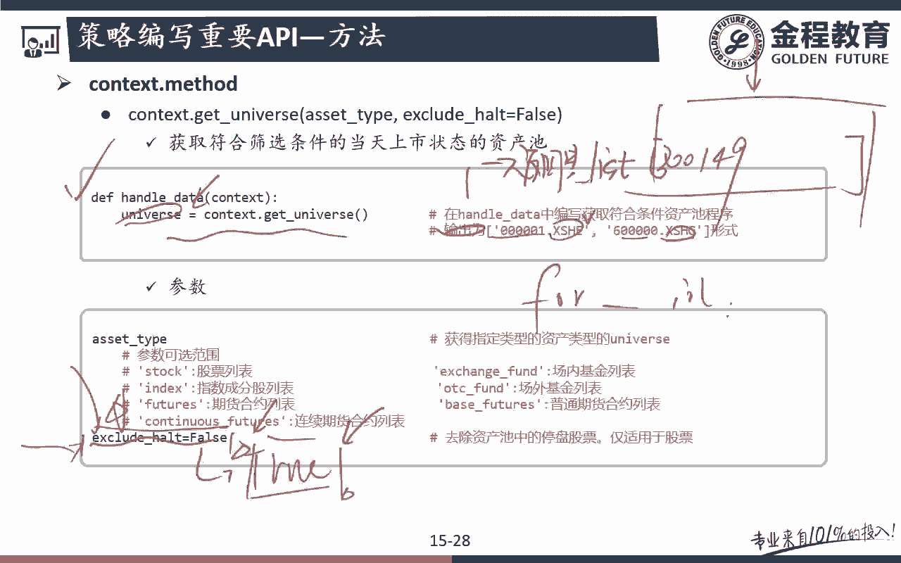

哎，这其实通过这种啊，就是一个最最简单的一个小市值策略，我们就可以写出来了，对吧好，那么我们来看一下啊，就既然讲到这里的话，那我们就把嗯这个策略。

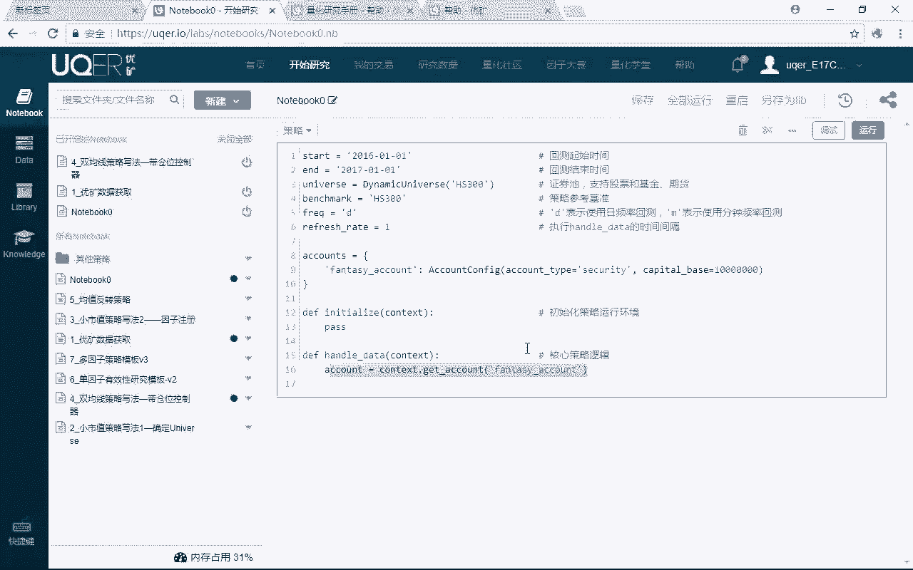

小市值的这个策略的这个写法，带着大家来看一下啊，嗯看看我们看看有没有大家看不懂的啊，这个还是还是把AP还是有点东西，大家可能看不懂啊，那么还是把整个呃API的这些介绍介绍完了之后，再回过头来带大家看啊。

下单这个东西讲完了之后呢，大家就可以能看懂了，好，那么接下来的话呢就是我们要用的是context的，下面的这个history这个方法，这个方法很难搞明白啊，而且的话呢用起来是有点复杂的啊。

这个方法一定要搞懂，因为这个方法对于我们额后面能不能看懂，我们写的这个项目的话呢，写写的这个策略啊，会有一个非常重要的一个关系啊，好来看下呃，Get history，我们前面跟大家讲过啊。

他就是可以拿到我各种各样的行情数据的，这样的一个呃函数对吧好，那么首先第一个叫做symbol simple，很简单，symbol的话呢就是我们的什么股票代码对吧，好。

后面的话呢attribute attribute，注意就是我要拿的是行情的什么数据，能理解意思吧，比如说在这个里面，我可以拿行情的一个什么close price，比如说我可以拿这个attribute。

下面我可以拿一个我的一个行情，那个什么收盘价对吧，当然我也可以拿这个行情里面的一个turn over value，就是我们的一个什么成交额对吧，比如说我们的有些呃额成交额或者成交量呃。

比如说我们有些策略是基于放量的，我我这支股票没有放量，那么在我们这个里面我要拿到成交量的话，那我就可以通过这个attribute这个属性，这个参数去掉我们想要的这些属性能理解是吧。

那么time range的话那就很简单了，time range的话呢，就是我要拿多久的，对不对，哎咳咳呃，我要拿几根，就是呃我要拿额多少根，我这个里面的嗯K线，比如说你的日期。

你的策略是十额累累的一个策略的话呢，你这个里面写十就代表我可以往前拿怎么样，十天的，我这个呃历史上的一个比如说收盘价没问题吧，哎好后面的话呢frequency。

frequency就是呃它这个里面就是daily呃一天，那你也可以是一分钟，5分钟，15分钟，60分钟都可以拿啊，呃所以对我们来说的话呢，在这个里面控制的就是，我拿到的这个行情的一个周期。

到底是呃日线级别的一个数据，还是分钟级别分时级别的一个数据问题吧，好那么下面这个非常重要啊，下面这个呃r type就是我的一个数据类型，那么这个数据类型的话呢，一般来说有两种可选啊，第一种是frame。

第二个是array，那么呃我们用的可能更多的是这里的frame啊，因为frame代表就是我返回这个数据类型，就是默认是一个什么data frame问题吧，pandas下的data frame。

那么array的话呢，默认返回的是一个囊派下的一个nd array，那么从实际效果来看的话呢，还是frame我们用的更多啊，data frame用的更多，NDARA的话呢。

比如说我们在用ta lib的时候啊，我们之前是不是跟大家讲过，ta lib在计算的时候，它它所支持的那个数据格式，必须是nd arr的哈，所以如果说我们拿回来的数据，我们要进行用。

通过这个ta lib再进行一个呃，这样一个处理的话呢，你可以直接返回的是这个array问题吧，当然了，就算我拿回来的是data frame，通过NP点或者number派点SARRAY。

我就可以把它转换成也是非常简单的，没问题吧，哎所以多玛说嗯，后面哎后面这个style是一个关键啊，style里面居然来了一个叫做SAT对吧，那你这个style你可以自己组合啊，你可以是什么SAT。

你也可以是AST，你也可以是ta as都可以两两组合啊，那么这很多同学就晕了对吧，这代表什么意思啊，好那么这个代表的意思呢，就是在这个里面我们跟大家写好了，所以啊这个优矿大家上手难的一个原因。

就在于他的那个投资者的基础的这个教育啊，真的做的特别特别差的，这个都没有任何的一个解释，说明都要让你自己看的啊，所以呃这个但是大家听我们这个课之后啊，优矿里面的这些东西啊。

应该就没有一个太大的一个问题了，好那么我们先把前面的那些东西啊，再跟大家复习一遍，再来跟大家讲这个比较恶心的什么act，at这种东西啊，来看一下，首先第一个你要知道symbol。

就是我们能拿到的是单只股票或者证券列表，都是可以的，第二个的话呢我们是拿到的是attribute，那么我同样的我们是可以支持单个属性的获得，或者说是我的属性列表，比如说我既想拿到开盘价，收盘价和成交量。

你通过一个list传递给他就可以了，问题吧，time range的话呢，前面也跟大家讲过啊，我就拿到几天的这样一个数据对吧好，那么frequency的话呢，就是我的一个周期，那一般来说。

这个周期就跟我们之前在定义这个策略的时候，那个frequency的那个周期，其实应该是同一个对吧，那么style我们先放一下，那么r type的话呢，就是你要返回的是data frame。

还是一个n d array问题吧，好那么关键我们来看这里的style啊，这个style一定要看仔细，一定要看清楚啊，呃不然的话呢，你这个策略可能这行代码出来了之后，你也不知道人家返回的是什么东西对吧。

好来看一下style代表什么意思，S代表什么呢，S注意了，代表就是我这里的什么symbol，A代表的是什么呢，A代表的是我这里的attribute t代表什么呢，T代表的就是我的一个时间。

是我的一个time，能理解意思吧，所以呢分别SATASTTAS代表什么意思，就代表着我返回的这个数这些东西啊，我的一个排序范围，听明白意思吧，也就是说A代表的是attribute。

S代表的是symbol，完了之后的话呢，T代表的是什么时间，所以如果说是as st这样的话呢，注意首先第一个你要记住啊，这个context点history，它其实返回的外面都是一个什么东西啊。

哎外面都是一个方括号，所以呢它的返回值，它其实返回的都是一个什么dictionary，它的返回值啊是一个字典，没题吧，好那么来看一下字典的键是什么，键，就是我第一个东西，字典的键就是我这里的AST也好。

ST也好，TS也好，就是最外面的那个东西没问题吧，哎好那么也就是说大家来看啊，AST代表什么意思啊，我A是在最前面的，也就是说我的A是吧，Attribute。

这是我的一个我要从这个context点history里面，所要获得的一个什么属性，Attribute，那么在我们前面这个例子里面来看啊，这几条看一下贝塔等于contest history，600000。

我要获得这支股票的close price，close price是不是这支股票的一个，我要从这个contest里面拿到的一个属性啊，唉往前追的是十天那个十天那个数据，然后的话呢我频率是日线的。

然后呢返回的是data frame style是SAT，所以呢对我们来说什么在最前面啊，呃symbol在最前面，那如果说我们在这个里面，把这个style变成a at的话呢。

什么就是在最前面我要返回的这个attribute，这个什么这个，Close price，这是我要返回的这个属性，是不是在最前面啊，能理解意思吧，哎好那么接着再来看属性，在最前面第一排名第二的是吗。

symbol对吧，symbol的话呢，也就是说下面这个怎么样，DA分什么注意啊，这个是非常非常恶心的一个东西啊，你看我get history返回的是一个字典，字典的key是这里的属性。

字典的value是一个什么东西啊，哎字典的value才是我们这样的一个DA怎么样。

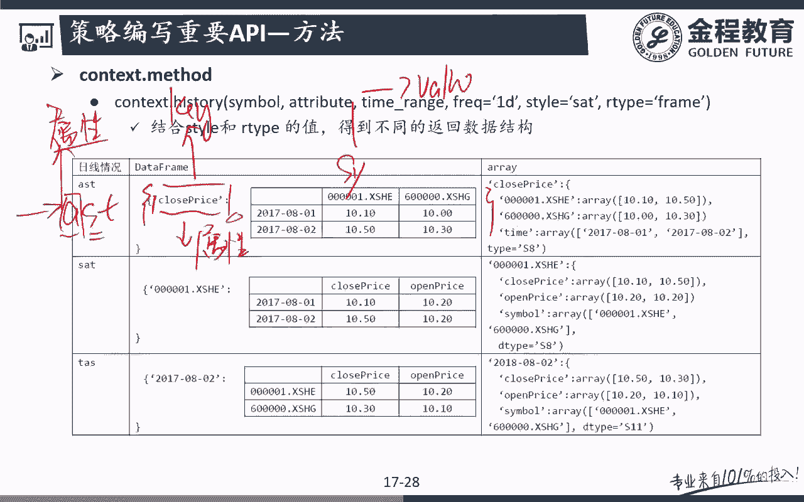

frame听没意思吧，哎那如果说你返回的是呃，我在前面的数据控制的这个数据类型里面，控制的是一个array的话，那么你返回的就是一个什么哎，返回的就是一个NDARRAY，在这个里面我们是可以自己通呃。

加一来去控制的，没地吧，哎好那么这个array就是这也是我们的一个啊，你看后面返回的就是一个呃一个key，后面对应的就是我们的一个nda ray对吧，哎那么这个东西的话呢，我们用的不太多啊。

我们一般来说返回的用的是呃data frame，用的很多没对吧，所以在这个data frame里面，接着我的这个列名是什么，哎我的列名就是这里的symbol，最后的time的话呢就是什么。

按时间8月1号，8月1号，8881下子一个个下来吧，呃你要回十天嘛，就从8月1号开始到8月10号结束，能理解意思吧，哎所以呢AST也好，SAT也好，就代表的是我返回的这个大字典里面，到底什么是key。

到底我的data frame里面我的列名和我的行名，我的索引名到底是什么东西，听明白意思吧，哎好现在可能还有点不是特别清楚啊，那么再来看一下这里SAT大家就可以知道了，SATS代表什么single对吧。

所以呢我返回了这个大的字典里面，我的key就什么哎，key就是我的symbol，就是我的股票代码吗，后面的话呢A就什么哎，排名第二的就是AA就是这里的什么，哎我的列名对吧，哎我的列的名字呃。

在这个里面是不是cross price啊，完了之后的话呢，最后我的索引这个还是我的一个日期没问题吧，哎所以呢对我们来说这个有一个什么好处啊，比如说我们通过AST这种写法的话呢。

怎么样我拿到了这样一个大字典，这个大字典里面怎么可以通过我的key去选择，比如说这是我们前面返回的这样一个大字典，大字典里面，比如说我们再选一个怎么样close price。

然后呢相当于通过字典的key去选择，那么我们返这个返回的就是什么东西啊，哎得到的是不就是我这个股票和这个股票的额，对应时间的这个，symbol的一个时间序列的一个data frame嘛对吧。

哎所以呢它的用法是非常非常灵活的啊，可能大家现在还不太有感觉，我们后面会跟大家举一个例子，大家就会有感觉了，问题吧，好那么在这个里面的话呢，这是额这个应该就能看懂了对吧。

那么TAS呢TS就是我的个字典的key是吗，哎这个字典的key是时间完了之后的话呢，A就是这里的就是我的一个什么attribute，对吧，我这里的额，我这里的列名就是我的一个attribute。

那么S的话呢就是我的symbol，比如说我有几只股票，我要获得这几只股票，所以他们来说你要任意形式的一个排列，不同的排列一个顺序的话，我就可以通过在这里的ASTSTT。

你自己在这个里面去进行控制就可以了，那么一定要记住啊，我这个里面返回的是一个怎么dict，返回的一个DC的话呢，我们在这个里面就可以通过这个dict的这个key。

我就可以返我就我是不是就可以拿到它的value啊，这个value是不是就是我们想要的知道的，存储数据的这个什么da frame，明白意思吧，如果说是AST这种返回的话呢，就是一个什么列名。

就是我的一个股票名字，然后呢额我的行名就是我的一个日期，那么相当于这个属性这样的这个属性，我这两只不同的股票，在这过去一年里面所有的啊，这个值我是不是就可以拿到了，那么第二种写法的话呢。

我拿到的是这只股票，那么这只股票的话呢，我可能是两个属性，两个属性的不同时间的范围里面的这个值，我们是不是也可以拿到了，所以呢我们是想看以这个属性为基础，还是以股票为基础，以为单位。

还是以我的日期为单位，听明白意思吧，哎这是我这个context点history的一个核心的一个，意义所在啊，这是非常非常重要的一个函数接口问题吧，好可能这么去讲啊，大家还是比较抽象啊。

我们看看有没有一些呃，我们这个策略里面有个例子肯定有啊，我们看一下哪个例子里面有这一个东西嗯，啊这个均值反转策略main reverting的这个策略里面，我们就用到了这个啊，来大家看一下啊。

在这个里面我们获得通过context点history，我们就要获得嗯它的一个数据，那么这个数据的话呢，我获得了simple，simple等于universe，universe是什么。

universe是dynamic，Universe，A全A股的动态A股的这样一个universe对吧，相当于我要把全A股所有的什么东西拿过来呢，Close price，所有的全A股下的收盘价。

统统的把它给拿过来，然后呢我要拿几天的呢，context点window，那么在这个里面，我们设定了这样的一个全局变量啊，window就是我这里的20没问题吧，呃是日线数据返回的是data frame。

能听吧，注意sell是什么哎，style是AST，AST是哪一种形式啊，就是我们这里跟大家讲的这种形式没问题吧，AST就是我的返回的是个字典，字典的key是他的注意啊，忘了字典的同学啊。

回去一定要把我们Python基础多看个几遍啊，你如果第一次接触编程的同学啊，Python基础你我觉得你看个345遍啊，都无所谓啊对吧，你可以第一遍可以看第二遍，你可以加速去看对吧。

不断的去refresh你的这个印象啊，那么字典的key是不是就是我的这里的属性啊，字典的value的话，那就是什么列名是股票名称的呃，行名是日期的，就AST这个排序排下来了，没题吧，好。

那么完了之后注意再来看这个这个DA等于DA，点close price，这什么意思啊，这很多东西看不懂的啊，我这是在我们普通的纯Python的编程里面啊，是没有这句话的啊，不会有这个东西的。

哎这个什么东西啊，注意啊，这是我的额优框下面才有的，一种特殊的一种写法，因为什么我返回的这个data前面跟大家讲过，我返回了个DA是个什么东西啊，是不是一个字典啊对吧，字典的key是什么呀。

请问字典的key是不是这个attribute，是不是这个属性啊，因为A是不是排在最前面，所以DA点这个方块，一个close press代表什么意思啊，我我让他再等于data。

这个data其实就是一个data frame对吧。

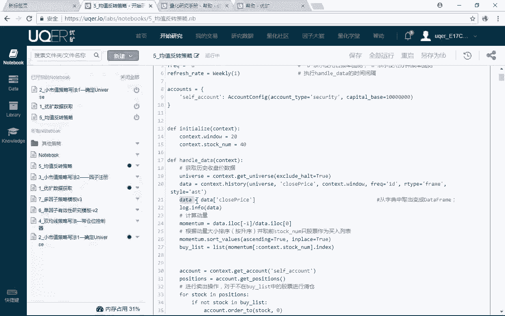

也就是说它相当于是把这个字典里面怎么样，唉这个key是不是就是这个cross price啊，唉我以这个key作为选值选出来的，是不是就是它的value啊，它的value就是我这里的这个什么symbol。

里面的这个data frame，所以呢我的列名应该是股票名，我的行名是不是应该是我的日期啊，所以我们打印出来了啊，给大家看一下，你看我打印出来的这个东西，我的列名是什么，我的列名是不是全A股的。

所有的股票完了之后呢，怎么样拿到的，这个值是不是就是后面是不是每一天的这样，一个交易日日啊，哎能理解意思吧，唉所以通常说用矿最大的好处是，数据不用我们自己去管了，是不是他这个平台都已经帮我们去认。

都已经处理好了，我们只要会调用就好了啊，那么context点，history是最为重要的一个数据的，一个调用的一个接口，一定要掌握问题吧，后面我们还会不断的跟大家说好。

那么context这个最重要的类我们就讲到这里，那么接下来这个课，我们来会跟大家去讲这个账户。

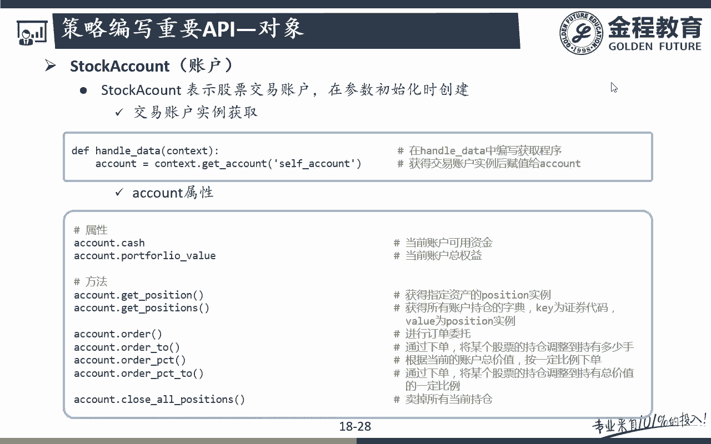

