# 2024年金融大神老师讲解量化金融分析师.AQF—量化金融专业知识与实务 - P21：《实盘交易模拟_基于优矿的进阶学习》04.量化投资策略回测之择时策略举例（双均线） - 量化沿前 - BV1oU411U7QM

好各位同学，我们来继续学习第一个模板，也就是说我们所谓的这个择时策略的模板，然后为了讲解清楚这个主题呢，我们选择了一个比较简单的策略，来帮助大家理解我们要讲的这个模板，我们用的什么呢。

就是简单的双均线策略，大家知道，一般来说我推崇的一种方式，就是写的量化策略的方式是什么呢，先找到规律，然后找步骤，最后来说去写程序，所以说我们这里面的过程，也是基本上按照这个套路走。

那么首先对于双均线策略，我们先看看它的基本原理，然后看看如果你作为一个人，就是我不是机器了，我是人一个交易者，我去交易的时候，我的一些操作步骤，最后我们来看一下它的代码，当然在讲代码的时候。

我会进行注释，这个代码的注释往往会做到语句及，帮助大家做一个理解，最后我们看一下这个回测的结果。

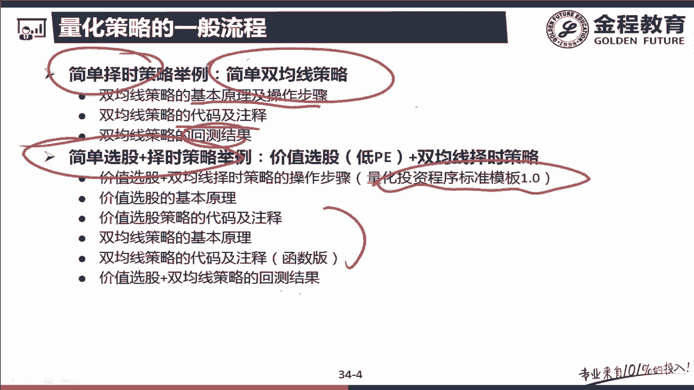

就是这个策略到底有没有效果，那好了，我们一个一个跟大家做交流，首先我们看一下这个双均线策略，的一个基本思路，就是讲这个之前呢我们要说一下什么叫做均线，而这里面所谓的均线啊指的叫做移动平均。

也就是说移动平均线这种方式，我们一般来说是有什么就叫做移动平均，这是我们要第一个讲的主题，这里面有一段定义啊，这里看啊，什么常见，利用股价回报或者交易量的数据算出一顿平，均可以补平短期波动。

反映长期趋势及周期，然后你们简单的看看这句话就可以了，然后我们呢用举个例子，帮助大家理解一下这个移动平均的意思，这里边也有一个简单的说明啊，比如说他说5日均线就是什么，用5日的收盘价除以五。

那么我们其实这里面要跟大家讲一讲，什么叫做移动平均来看。

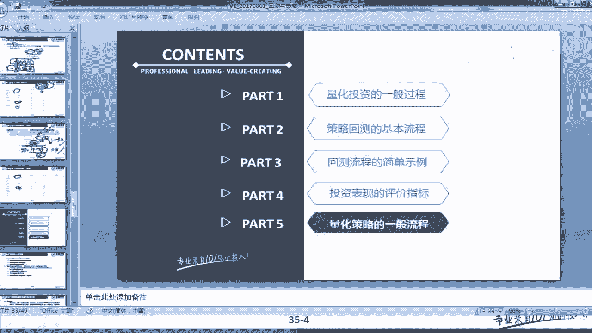

好我们看一下啊，还是以5日为例，然后我们逐步扩展，然后再来讲一下这个主题，大家看我们现在有这么一个，时间这个时间点我们代表的是零点，然后呢我们从零开始，第一个点代表的是五天以前，那就是五，第二代表四。

第三代表三，这个代表二，这代表一，这就是各个我们要考察的时点，但注意我们要算的是什么呢，要算的是这个0。10的5日平均，或者叫0。10的10日平均等等，注意我们站在的是零点这个点。

那么这里面你要有个问题啊，我要算这个临时点的这个5日平均价格，我到底能不能用临时点的价格来做，那你其实我给了你五个数，你应该基本上可以看出我的含义是不能，这个原因是什么。

注意你是在零时点对利于投资进行考察，那么也就是说其实你并不知道零时点的价格，这个点你是要注意的，也就是说我们用于数据的话，你不能用在当前时点，不可以获得的数据来进行计划，这是一个比较基本的原则。

要不然的话如果你用当前的价格做投资的话，也就是说你可以提前知道下一秒的价格的话，那这个投资其实你可以100%赚到，是不是工具，所以这个一般情况下你要注意一下，那么这个在临时点的5日均线应该怎么做呢。

我们看一下它等于这一点，我们的价格我们叫p-5好，是不是，然后一直加到什么，加到p-1是不是，然后再除以五，这个是我们算出的5日平均，注意我们这里不是P0，而是p-1，我讲了，因为零是点。

是你当天要考察的实验，这个数据你是不知道的，那相应的我问你10日平均怎么做，是不是应该十平均等于什么，等于P的十是吧，一直加到什么P的一吧，然后怎么的估值吧，也就是说从现在开始为当前时点往前数一个天。

然后这一天为开始往前数十天的平均值，就是10日移动平均，如果五天就是5日移动平均，这就是他们的一个第一，首先把这个事情学会，这是这一段给大家讲的这个问题，包括说的这句话，我们不再给大家念一念了。

我通过刚才的例子，我相信大家应该可以很好的掌握，那么我们接下来看啊，第二步我们掌握什么，是不是我们现在讲原理啊，现在我只是说什么叫做什么叫做实时平均，那么我们想啊下一个问题，我为什么要做这个线。

这个线有什么样的一个作用，就是这个他说移动平均可以抚平短期波动，反映长期的趋势或周期，注意这个东西是什么，由于我做了一个平均，那么这里面的一些极端值，它的占的权重就会比较小。

比如说我这里面第三天的值比较极端，比如说一下子这个价格一下涨了10%，这是个很极端的值，但一平均之后有5日平均，他这个影响只有1/5，这样的一个影响就会去掉，那你注意了，而且你注意这个短期波动啊。

其实是相对于我移动平均的这段时间段来说的，比如说我们看这里面我们有五天，你其中只有第三天是波动比较大，那么这个时候它就可以抚平，我们所谓的第三天的波动，因为什么他乘了个1/5是吧，那十天就更明显了。

十天中比如说也是第三天，我这个价格突然涨的非常高，那这个时候我除以1/10会怎么样，是不是把这个波动一下降下来了，因为它影响只剩1/10了，这是这句话说的含义，但是你注意这里面。

我们下面说的这个也会带一个中期，短期和长期的概念，和这个所谓的短期就有所区别了，注意我们下面这个短期更多的是什么，是时间，也说我考虑是5日移动平均还是10日移动平均。

而不是指上面的什么对某一天对整体的影响了，那这里面你看啊，我们要说短期，那一般考虑五天的情况，然后什么如果说长期，那可以考虑240天的情况啊等等，是有一系列的题，正在说的。

这一下在这里面讲的是到底几日的移动平均，可以代表转期，中期和长期的一种规律，那我们总结一下看一下啊，你不用看书上这个文字，我们直接就在这边写了，这一般来说我们认为你做事的日的平均值。

这个代表的是一个短期现象，那如果用做出来的是20日的，30日的自动，10日的，我们认为这个代表的是，中期的现象，这个写的不太好使啊，我们下面再来，这个中期的现象，如果说我们这里面认为ma移动。

平均就是120天，已经进军240天，包括ma无穷这个东西，代表的也是一种长期的趋势，注意这里面说一下啊，这个什么叫做ma无穷，因为后面那个120天也好，240天也好，你其实理解起来会比较方便。

但是这里面这个所谓的ma无穷指的是什么，这个股票存直到现在也不是无穷天，它指的是从股票这支股票，比如你随便选了一只股票，那么从这个股票上市那一天开始，到今天算起来的前一天，这中间所有的股价的平均值。

认为它是一个最长期的情况，也就是说5日和10日我代表的是一个短期情况，然后20日和30日，60日代表中期情况，二十一百二十二百四和无穷，代表的是一种长期规律，这是我们所说的。

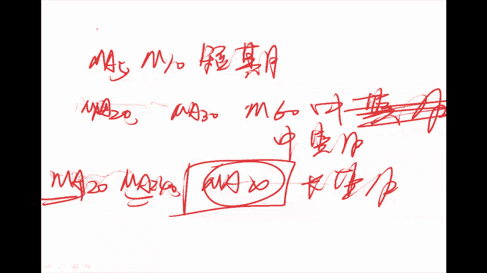

那么我们现在知道的这种代表性，我们就要想一想怎么用这个东西来进行投资的。

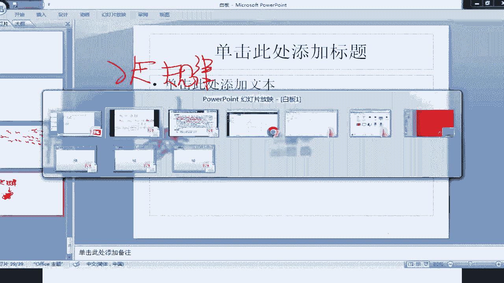

也就是说我们所谓的这个规律啊，这里面说什么，就是下面这句话，注意是最后这句话这一段定义了什么叫做中期，长期以及短期，下面这个是指的是这几种期限的规律是什么，你看他怎么说的，他说短期均线上穿长期均线。

这种买入信号是强势的特点，称为金叉，如果反之，短期由上下穿长期，一般意味着是一种卖出信号，叫做死叉，这个东西一般来说大家都是比较熟悉的，叫金叉买死叉卖网，但作为我们比较来专业的量化投资。

其实你要理解一下这里面的原因是什么，或者是假设是什么，来大家看，首先我们知道一点，我们如果是一个短期限的话，比如说就是ma我们考虑两个，比如说我们考虑一个ma10，这个作为短期的一个代表各位。

然后我们再考虑一个ma，比如说这个就叫做额30吧，这个叫做长中期的代表，那你下面考虑一个问题啊，注意如果现在这个股价怎么了，是一直有短期的这个移动平均线一直高于长期，这代表什么问题，那么是不是代表的话。

我短期一直都要比长期的价格要高啊，那么相应的，如果是我中期的这个线一直高于短期的线，一直在处于短期上的什么，说明中期的移动平均值，一平均值比短期的移动平均值要大，这说明什么，短期在进行下降。

那其实跟大家说，我们所谓看一下啊，那书上所说的金叉和死叉是怎么回事，来我们通过图形的方式帮助大家做一个理解，金叉死叉金叉我说了，这是短期，从下面穿出长中长期啊，所以说你注意这个东西。

哎我们换一下写这个写的有点下面这东西，什么是金叉呢，看按照他的说法，我这是比如说是MA刚才说30，这个叫做MA10，是不是就是所谓的金叉，然后我们再接着看啊，注意注意4+2是什么，这是MA，还没事。

然后这个比如说是30行不行，这个稍微有点乱啊，我擦一下，看啊四片，然后我们看啊，注意我刚才是说这样一种情况，ma10是在ma30的上，是不是，然后我们比较一下这几种情况，说明一个问题啊。

然后这是我们所说的MH30样式，ma10是不是各位学是这么回事，你注意看啊，如果10日一直处于30日，是上午，说也就是短长短期之内的强势，然后下面是30日和10日日上呢，那这就说明短期比较弱势。

它处于一种比较不好的这个状态，但是你要注意，我不能用这样的情况来指导投资，其原因就是我当前一直持续这种状态，那么代表是它已经持续了一段时间了是吧，就是短期以已经持续了强势了一段时间。

那么这个时候你会发现哦，基本上来说我要如果保持这种状态的话，当然未来一直保持的比较好，那么我这个时候，未来有可能出现会一些反转的特性，就是说我这个10日在一直持续的增长，高于长期的话。

这个其实我们认为是不太可能出现的一种现象，所以大家保持一定时间之后，他一定会怎么样，一定会出现一种下跌的趋势，所以说你也不好说下一个时点是涨还是跌，那么这个情况就是一个不是合适合适，作为一个策略的指标。

那么我们什么时候会作为策略比较合适呢，就是上面种情况，如果是RA在下面穿过ma30，代表什么短期强势的第一个时点是吧，也就是说这个趋势刚形成的时候，那么此时我可能会还会持续一段时间。

这是按照我们趋势的理论，是不是，那么后面这一点我们短期从上下穿ma30，那么这代又代表什么，代表说我们开始变坏是吧，那这个时候我认为它下降的趋势，也会再持续一段时间，那么我们就要把它卖出。

这两种情况要比单独的形成，这种情况要持续性要更加强一些，这一点希望大家知道，这是我们技术分析中的一些基础理论。

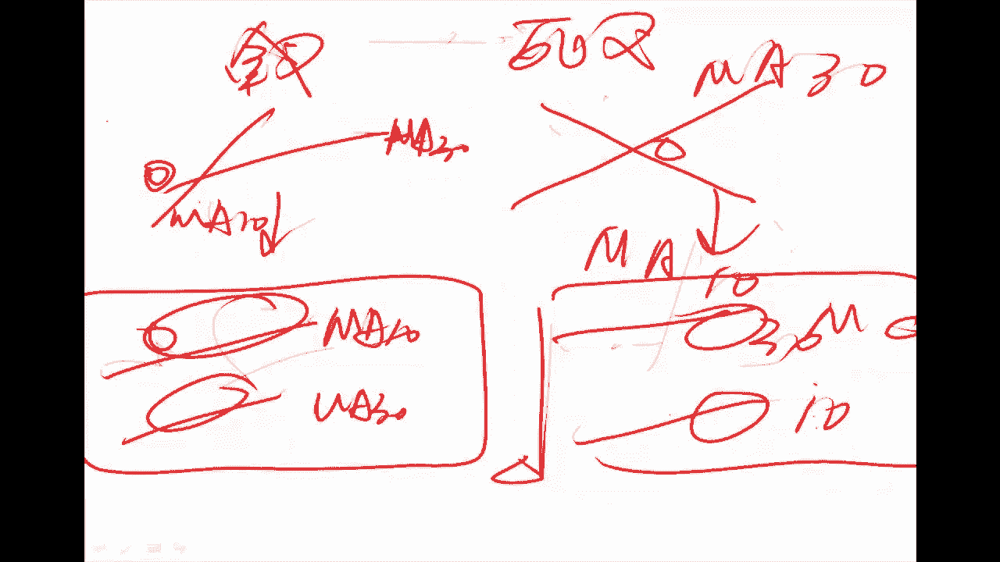

那基于这个理论，我们就提出了金叉和死叉的方案，也就是说我们下面这句话。

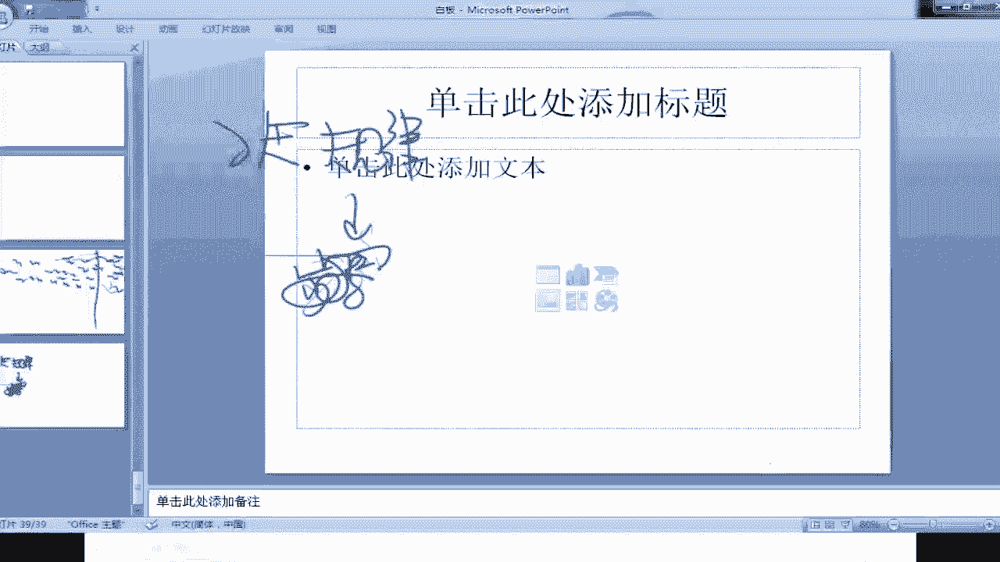

下面是什么，当收盘价5日上穿收盘价20日均线的时候，我们买入，当收盘价均线下穿收盘价20日均线的时候，我卖出，那其实也就是说上面这个是一个金叉，下面是什么，是不是就是一个撕开了，这里面我们别的几句话。

首先我们讲一下什么叫移动平均是吧，然后我们讲一下这里面移动平均是5日十日，二十三十六十一百二十二百四，已知于无穷，代表分别代表什么，就是短期，中期和长期是吧，然后我后面又解释了一下它们的原理在哪里。

为什么这个经差会有一定的增长效率，而死叉会有一定的下跌效率，这其实里面有一个假设，就是趋势理论，而后我们讲下操盘策略，就是步骤，实际上也就是说什么，我们上面这一段其实讲的是规律是吧。

然后这一段是不是讲的是步骤啊，这一段讲的步骤按照我们这个想法，是不是下面应该讲什么呢，同学是不是应该进入到，我们一个程序的讲解中去了，那么这个程序的讲解啊，我跟一开始跟大家讲过是吧。

就刚才前讲规律的时候，就是我们一般来说这个规律怎么分呢，各位还记得吗，我们大家来简单的回顾一下。

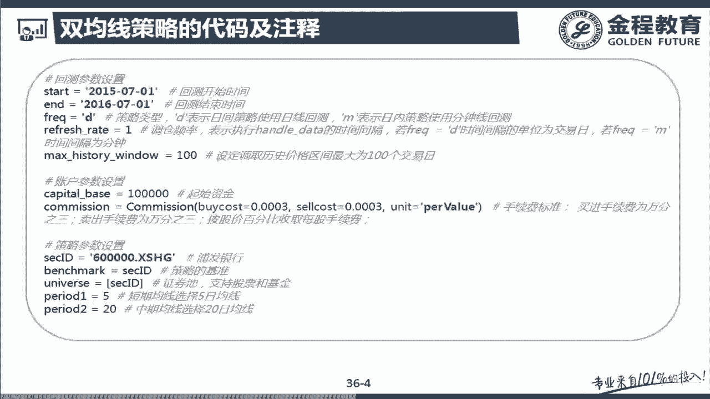

看这个编程我们干什么来编，是不是你看一下往上看啊，这是我们实际上的按了一个什么，分为初始化和策略模块，然后我们一一个看啊，用这个例子你来看一看我们这个整体的过程，初始化分为环境和投资者的一个初始化。

而策略分为什么分为这个投资类别，选股择时是不是把数量只写择时，然后不管任何一个策略都分为数据获取，数据处理，逻辑检验和交易什么策略，我说过这两个部分是必有的，因为你必须先获有数据，然后基于数据进行交易。

这其中的这个数据处理和逻辑检验，不一定是一定存在的吧，那么我一个对应一下，看看我们这个程序的编写怎么样标准化，按这个流程去做的，我也希望大家以后编程尽量标准化，这样的话就显得你很专业，好。

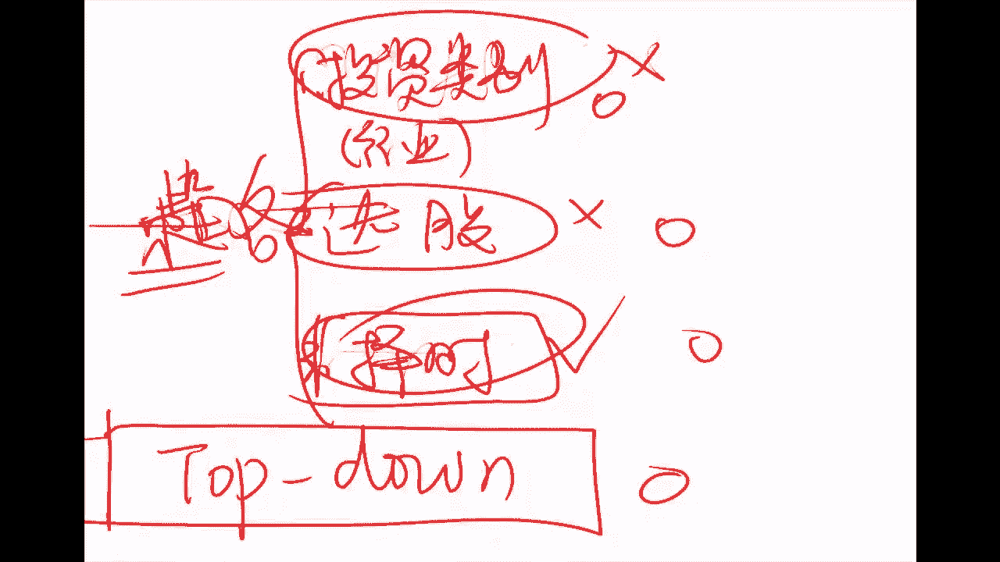

那我们接着看回到我们的这个首先我说了啊，第一步看啊，我们首先是不是分为两个阶段，一个是初始化，一个是这个策略处理啊，初始化我说了分为几种类别是吧，基本什么基本上就是关于投资者的一些初始化。

还有一个关于环境的初始化，是不是关于环境的初始化，是不是这几句啊，这里面都讲过环境初始化的什么，开始结束频率是吧，这两个数相乘是多少时间，即执行一次频率是吧，然后账户初始化，其实这个里面就根据投资者了。

因为每一个投资者都会怎么做，都会有一些数据在放在这里吧，那都有哪些呢，首先是这个账户，这投资者多少钱是吧，还有一点就是，这个投资者到底能谈到一个什么样的佣金，还记不记得第一次我们讲这个回到策略的时候。

没有再跟大家在交流这个佣金的问题，因为我们这里面会有一个默认值，然后这里面我们设了一个值叫做万分之三是吧，这个佣金其实是略微显得高了一点，因为现在来说我们一般能达到多少一个用期，是不是应该万分之2。5。

这是一般我们散户就是散户同学们能达到的，然后机构这个数据在1。5到万分之一，点五到万分之二之间，看你盘的这个情况，如果你交易量比较大的话，是有可能盘到外面是1。5的，但是2/8是绝对没问题的。

所以这个里面一般来说，我们设值设的比较高一点，显得会比较什么把握一些，然后这是什么，它是按照什么收取的，按照股价的百分比收取啊，这里面这个per value就是股价百分比的含义，然后你注意一般而言啊。

一般而言就是我们的一个账户的情况，这里面有一个叫做策略参数设置，因为对于某一个账户而言，代表了一个投资者，他不是要要会提出一个策略吗，这个东西也是每一个人是因人人而异的。

也就是说其实投资者的参数设置分两部分，一个是账户，就是它自身的一些特点，还有一个是他用什么参数来进行交易的，这种策略都设置哪些啊，首先我们设置了一下这个我们投资的标的，就叫做6600000XSHT。

这代表的是浦发银行，然后你注意一点啊，由于我们这里面只讲了择时策略，而没有讲选股策略，选股策略的方式，是不是确定我们要选哪些或者哪个股票啊，那由于我们这里面只有其中一部，就只讲择时策略。

而我们为了减少我们的计算量，如果其实不设置这个单只股票，比如说我把这个范围设置为沪深300，这个完全没有影响啊，下面就等于多跑一些遍而已，完了我们这里面是由于没有选股策略，所以说我只定一条股票。

那这个时候其实就是人为的完成了这个选股，是不是同学这里面我们做的是普发银行，然后我们在这里面大家看在浦发银行，我们设什么呢，就是既然是Y银行，那么我们看我的btch map，由于我是择时啊。

我提前你选好了股票，所有的班级bug就是什么，只持有这只股票不变，一直持有下去，那这支股票就是我们的基准，那么我们可以投资的范围是是不是，就仍然是什么，我们的证券值就是这个呃不发银行。

然后这里面还设了一下，我们用的是5日均线和10日均线，这都是一些策略参数，然后往往注意一点，如果说这个策略的话，你用的是一个辅辅杂策略，这个时候你注意你的策略参数，很有可能是写在下面函数里面的。

而不是写在上面，这里面，我们由于下面只使了一个简单的双均线策略，所以说我们把这个什么写在了这个上面，好我们接着往下看，接着往下看，我们这个参数，首先是账户初始化，这个我们不动。

下面我们看这个是每期的一个交易策略，也就是说每一期的时候你获得的情况，然后我进行这个东西进行处理，那你说一点，按照我们刚才写的这个策略是什么，先是获取数据，然后进行数据处理，然后进行什么逻辑检验。

最后进行交易吧，那这里面我说了，这个数据处理和数据的逻辑检验，可能是当你数据质量比较好的时候，或者说你要的数据比较简单，这样的话保证了准确率的情况下，你是可以不做的，那么我们看啊，那我们分为几个步骤。

也就是说我们首先要获取一个数据，是不是各位呀，那我们首先做了第一点啊，我们要想算出这个，什么呢，算出这个叫做呃，5日均值和十到20日均值的话，首先有一点你是非常需要明确的，是。

就是你要知道过去五天的什么收盘价，以及过去20天的收盘价，这个其实是你货出的基本数据，那你说前两句话，其实相当于我们的模板中的这个基本数据的，部分基本数据，基本数据的部分。

那注意那你拿到了这个基本数据之后，你会怎么做呢，你又会做一点，把所有可投资范围内的股票我都变了一遍，然后怎么做，分别计算每一只股票的什么，每一只股票的叫做这个5日均线和20日均线。

注意你这里面是有一个for的过程，所以说像我刚才说的，如果你的universe并不是这一只股票，比如我只值300只股票，注意这个时候我这个for k共会循环340，那么这里面其实而言。

对于我的程序并不会有任何的不同，你只是把这里面改成什么，改成沪深300，但这300只股票我都给你做一遍测试，但是为什么这里面设置着一支股票，一是我们这里做一个示例，所以说你这么设不会有任何的影响。

你直接做最后的修正，这个东西就可以熟练的替换，而我们这么做主要原因是什么，主要是我们为了适应大家，对大家来说，我希望大家还是不要去花额外的钱，去买这个软件啊，那你这个时候我们只能用优酷的免费版。

然后免费版如果你可以试一下，不是300的话，这个内存可能是不够的，所以说这个时候你就需要让消费升级为专业版，这就不值得了，就完全就是为了学习嘛，我们如果有兴趣啊，你们自己也可以做一些内存升级的工作。

然后这个时候你会看到好多，这个只要改成沪深300，就是其他东西都是不需要做任意的调整的，这一点我觉得是跟大家说一下，那好了，你注意在对于每一只股票，我这个ma5和mi20是什么，注意了。

我说HST1和HST2代表什么，ST1代表什么，是过去五天的交易价了，然后那个SST2呢，是代表过去20天的交易价吧，那这个时候我把它分别求出均值来，是不是，就是我们所谓的5日均线和20日局限了。

所以这个一部分你可以认为它其实是数据处理，是一个数据处理的过程啊，是一个数据处理的过程，那做完这一步，我们没有进行逻辑检验，因为相对而言我获得的就是交易价，这个时候来说是一个比较简单的数据。

所以它的准确率往往比较高，那么这个时候你并不需要再做逻辑验验了，那么下一部分，这个部分就相当于我们的一个策略部分，那么我们看看这个策略部分是怎么做的啊，我这个基本上帮助大家都已经。

把这个注释做到了余聚集，但是我还是把大家再仔细的解释一遍，帮助大家理解啊，首先看啊，首先我们是不是金叉买入啊，首先有两点，你看啊，什么叫做金叉买入，先看第一点，而5日均线的取值大于20日均线的时候。

这个时候是代表的是五天在20天之上吧，那么注意我还得是交叉，什么叫做交叉啊，我不但要在它之上，那还要代表什么，前一天他没在那上面，那前一天怎么代表没在那上面呢，他没在那上面，就是后面那句话。

注意这句话叫is not in account security position，这个什么叫做account security position，这个里面要简单的做一个解释啊。

这个account security position的时候，代表的是其实是是否持有的这个含义，如果你在这个account security position的时候会代表什么呢。

代表你已经持有了一个函数，如果这个是s not in是true的话，代表非持有这种函数，那也就是说我在当前的试点ma5大于了M20，说明我的均线哪个大啊，是不是MA5日均线大，并且我前一天还没买呢。

那代表什么，前一天并不是ma5大于ma28，这就表现了D刚做过金叉，是不是初始的金叉试点，这时候趋势刚形成，那么我买入的时候是不是上涨的概率大一些，这就是我们所谓的这个情况好，那么我们确定了这一点之后。

下面讲我需要买多少，这里面就是一个技巧性的问题，大家看啊，我是怎么买的这个account态势，这句话代表什么呢，是指是我这个账户，就是代表这个投资者的这个账户，在当前时点有多少现金。

然后什么叫做reference price，是你要买的这个目标股票的什么，当前的价格是吧，如果你cat account catch除以account reference price就等于什么。

是不是你可以买多少股啊，也就是说这两句话其实是股数吧，但是你有一点注意，我们在A股市场上进行交易，是以100股，也就是一首为最低单位的，所以说你只能买100的整倍数，所以下面我们再除以100得到什么。

就说我能买几个100股，但你注意这个值往往可能不是一个整数，比如说我得的是33。3，就是33。3首，那前面我再取一个整形，你就把前面那33得到了，也就实际上而言，你也只能买33首。

你再乘100是不是就回到你能买多少补了，那你确定了数量之后，我们用order这个指令，这个指令其实我刚才是不是已经讲过了，在一开始讲回测这个模型的时候讲过，我说up order一般是两个参数。

第一个参数S代表什么，是哪只股票吧，然后amount是后面的这个数量，也就是说其实是一个100的整数倍的手数，对不对，然后我们接着看啊，这个a live这个这个词相当于这词相当于else if，是不是。

这一点我相信季老师也有给大家讲过，那这里面跟大家说，MA5小于ma20的时候代表什么，是说5日均线已经低于20日均线吧，那么我们看啊，注意这里面又加了一句话是什么。

这个里面代表的是S1account security position，刚才讲过account secure position其实代表了什么，就说我是否持有吧，你注意一点，我是ma5小于ma20。

而且我还持有着说明什么问题，就是说我这个问题是第一次，ma5小于MA20了，就是当出现死叉，这个时候我把它进行卖出吧，然后这里面就讲了一个指令叫order to。

注意这个指令跟上面这个order是有一点不同的，第一个参数它们相同，都是指我操作哪只股票，而后面这个指标不同，上面那个amount是一个动量的概念，说我买卖多少的概念，而这个零代表什么。

是指我买卖之后我剩多少股的概念，这时候零股代表什么，我不再持有任何股票了吧，这里面就是我给大家做了一个程序，做了一个全面而详细的这个讲解，那好了，讲完这个呢，我们看一下什么东西呢。

看一个东西就是我这里面要解释几个参数，就是我们相对来说学习啊，你怎么学这个东西，一个是我给大家代码，大家去自己改一改，那么再有一点就是对于这个代码，一些特殊的函数和指令，我们再做一个学习。

那有哪几个指令大家需要特殊的学习的呃，是这个需要解释一下，就是这个叫account get attribution history，然后大家注意，这里面往往会有一个什么样的参数呢，就是我们有两个参数。

一个是指的是我到底去几天的历史，第二点是这一个期间我取什么样的数据，这个里面要是close price代表收盘价，如果open price呢，这时候你给定就代表的是什么开盘价了吧，这个指令你要会。

也就是说这里面account代表的其实是一个账户，就是投资者，然后我得到他的attribute history，得到close price和我们相应的区间，这是第一个函数，你要会用。

第二个就是后面这个东西就是在这里，就是这个这个是in或者not in account，security position这一条质量，你要会他的这个作用啊，实际上指的是什么呢。

指的是我们是否持有某只股票的这一点，你在日常生活中也会经常用到，因为我获取过去的这个数据，像是这个前面那个叫做get app的history，你经常用。

那你下面这点accoon security position呢是否持有，这个也是不经常用到的一个语句，然后最后就是这个order to，就说我买卖之后剩多少，这一点也要会在这一页上，这三个命令你要学会。

我希望大家，你不需要一遍一遍的去看他的那个注释啊，我希望你就是跟着我去学习，每讲到一个这样的函数或者叫做一个算法之后，这里面涉及到一些某些新的这种函数的应用，我都会给大家做一个讲解。

然后你这样一边用着一边积累，我相信在不久的将来，你会把所有的这些都学会，如果你这个直接去翻的话，基本上是没有办法掌握的很好的，这是关于这里面要跟大家说的一点，也就是说其实你看啊我们的思路还是讲完规律。

讲操作，操作之后我讲的是这个算法，然后这个算法基本就是按照，我们刚才给大家去一个一个步骤来进行讲解的，实际上我希望大家做编程的时候，也需要注意这些步骤，不要出错，然后最后呢我讲了一些这里面的意义。

一些特殊的函数，也就是优化提供的特殊函数，比如说这里面得到过去的历史是否持有，以及买卖之后我胜券，而股这一系列的特点，都是需要大家再自己再积极的，也就是说你在做这个时候，不但要掌握我们所说的规律操作。

以及我们整体的框架，还要再去记一下这个页上，每一个给大家写到的这个具体函数，能解决什么问题，这是你要学会的东西，那我们看了这个之后，我们可以看看这个策略啊，这个策略是什么呢，看啊我们年化收益率是10。

5%呃，基准是6。4%，也就是说其实这个择时创造了多少的策略呢，就是这个10。5%减去6。4%，因为我们这个基准策略是什么，就持有着不变是吧，那我择时怎么做，是不是我们要挑一个十点的。

所以这两者之差上4。1，年化是不是4。1，就是我择时这个策略所带来的一个收益，当然这里面也有一些叫什么，一些这个详细的指标啊，那么我们大家我们要是有兴趣的话，也可以看在这个代码上看一下。

这个我们再运行一下，看看这个结果会怎样，帮你点一下，这里面好跑出来了，然后大家如果有兴趣可以看看这个回测详情啊，一般情况下我基本是还是要喜欢看的，像这里面的这些赋值，你看啊，这个跟趋势就完全不一样了。

尤其是这个负的最多的呃，是哪个值，2016年01月，这个时候你注意我们其实是有一个7。5，这是你需要看的，还有下面这个它是零，它这个里面是负的，9。16，像这种比较反常的，同样也包含这种就是最大的。

我说了最大最小一些反常的，你都要需要看一下，比如这个阿尔法也是一样的，然后这个贝塔值，然后这个下注比例12比率，信息比率最大回撤百人，这种就是我说了几点，你要会的一个是什么。

就是异常值最大最小反趋势的找找原因，然后就知道它什么时候适用，什么不适用，以及算法怎么改进了，而这个点我也说过后，未来我们可能会开一个高级的包，专门讲讲这个结果的分析与改进。

这个其实是一个相当相当重要的一个主题啊，但是这个我希望在于，大家对于各种算法有一个比较好的理解，然后再去看那个高级课程，可能你会想到的比较多好，这是关于这一部分的一个讲解。

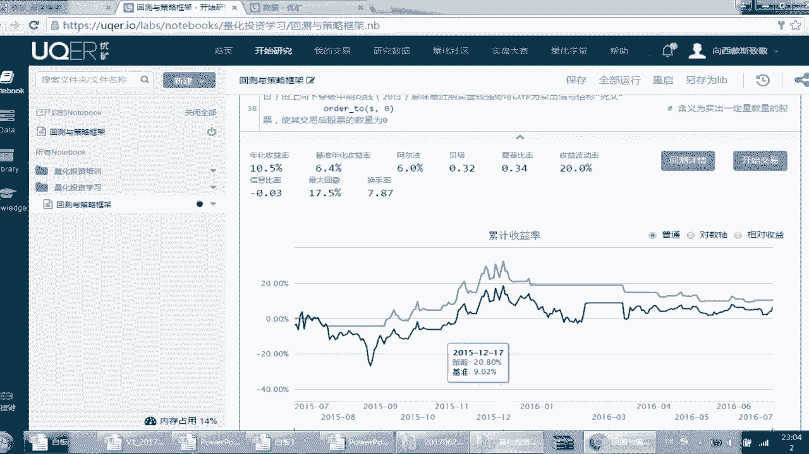

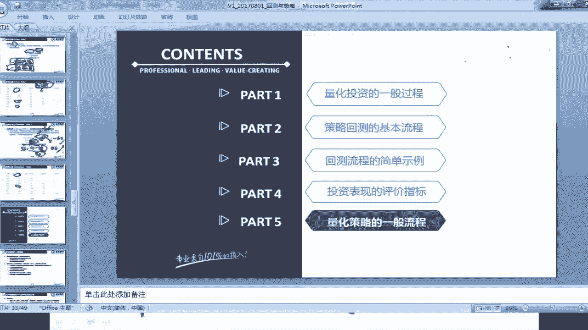

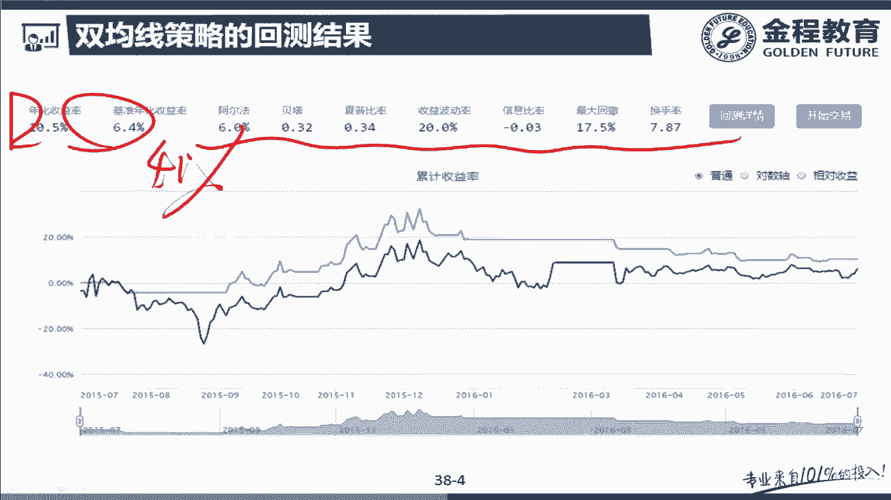

