# 股票收益预测的特征工程-量化金融与机器学习2024 - P1 - 背包2004 - BV1qb421B79L

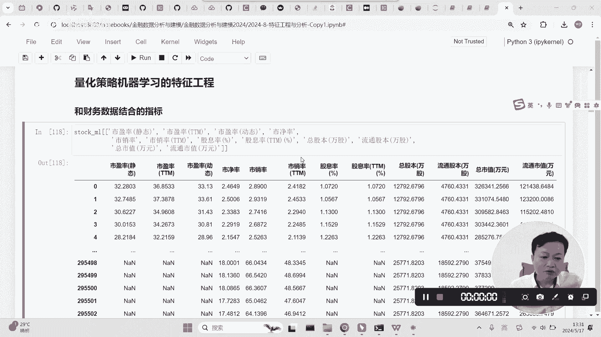

继续啊，呃这节课的话，我们来，就是之前呢，我们其实是把机器学习用到我们的量化策略。

这个流程啊。

我们基本上是过了一遍，过了一遍。

其实是没有在乎额，就是仅仅是把流程过了一遍呃。

特征呢都是选的最简单的就两三个特征是吧啊，虽然说那那那两三个特征，通通过我们之前的分析应该是比较精选的，但是但是实际上预测效果并不好啊，并不好啊，比起我们通过直接通过因子来做策略，效果似乎要差很多啊。

差很多呃，接下来呢，我们一起来把这个流程走的更加更加，扎实一点啊，走得更加扎实一点，就是我们先大概了解整个机器学习在量化策略，应用的一些流程的环节，然后呢我们现在在走的慢一点。

然后看能不能呃有一些正面的作用啊，啊不管有没有，但是我们把这个过程的走的更详细一点啊，了解一下要走好应该做哪些方面的内容啊，哪些方面的内容好吧，我们呃。

我们今天就不通过这个函数来获取数据了啊。

这个函数获取5年的数据啊，有点多，因为什么呢，因为我们如果待会那个因子数量比较多的话，维度一多起来，90多万的数据，其实是就就就不太适合在课堂上来搞了啊，所以我们就不不获取这么多数据了。

我们只获取一年的数据啊。

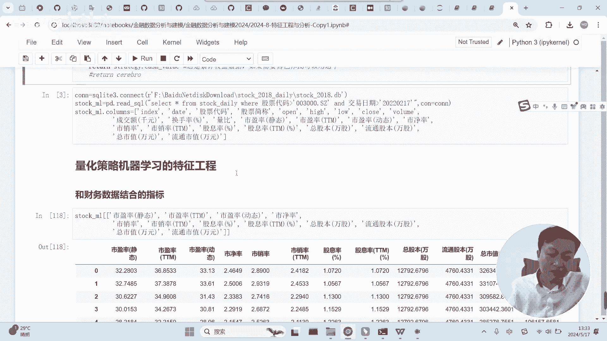

你看我们把交易日期设定大于2月，2022年的2月17号，因为我们这个数据是到，2023年的2月份的啊，所以说这样的话，我们大概拿到的是一年的数据啊，当然一年的部分数据啊，这也应该是有一半吧。

一年的一半的股票啊，一半的股票把这个数据拿到啊，所以同学们运行一下这个啊，运行一下这个拿到了之后呢。

我们呃这里先做一下相关的特征工程，手动做一下特征工程，呃做我们量化策略相关的特征工程的话，我们首先得了解一下，我们的基础的特征有哪些类。

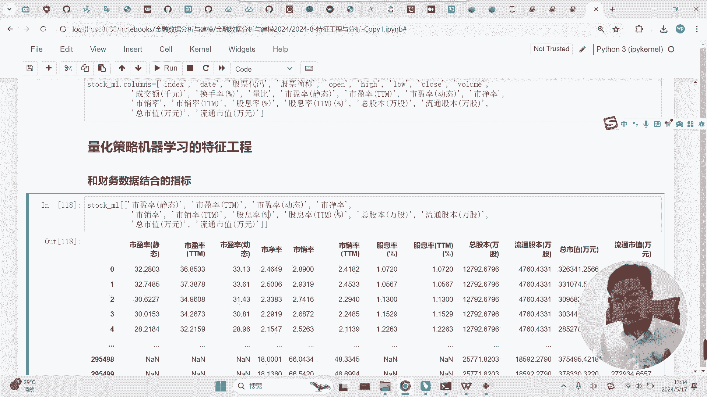

然后我们怎么来基于这些类来进行展开，来把这个特征做的更多一点，首先呢呃证券市场或者股票市场的数据。

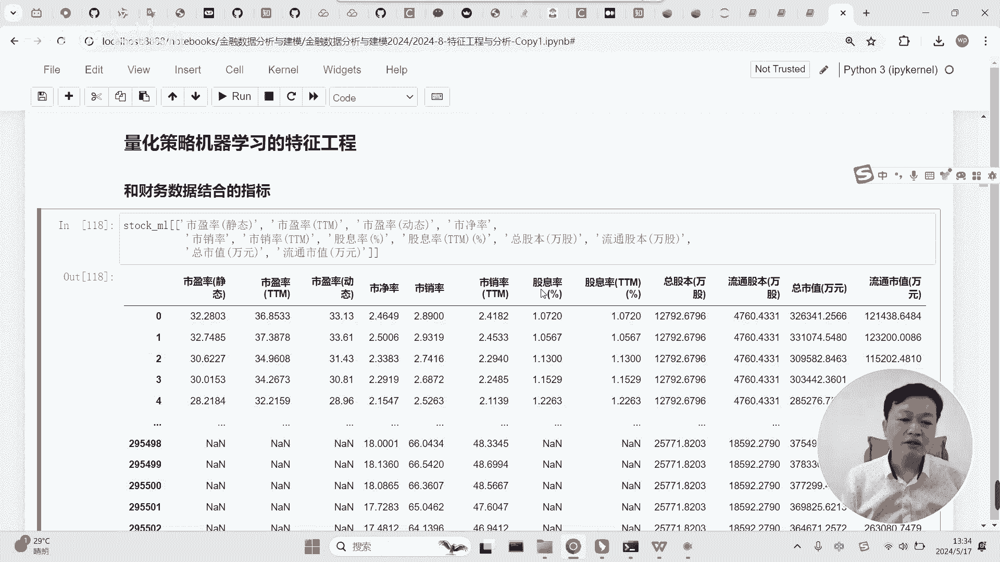

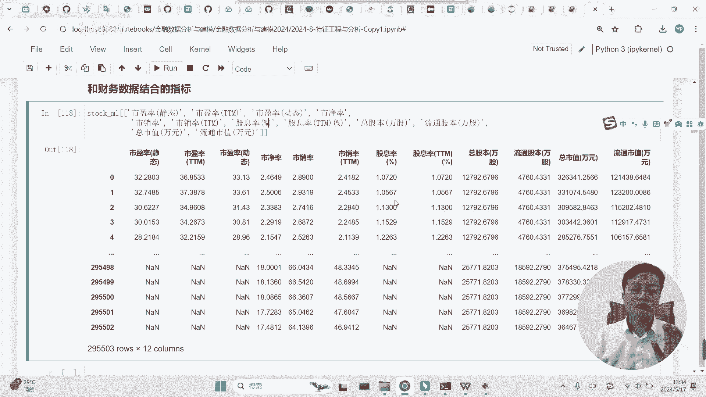

通常其实就两类啊，数据通常就两类，一个就是财务数据，还有一个呢是行情数据，大家能理解吧，行情数据是啥呢。

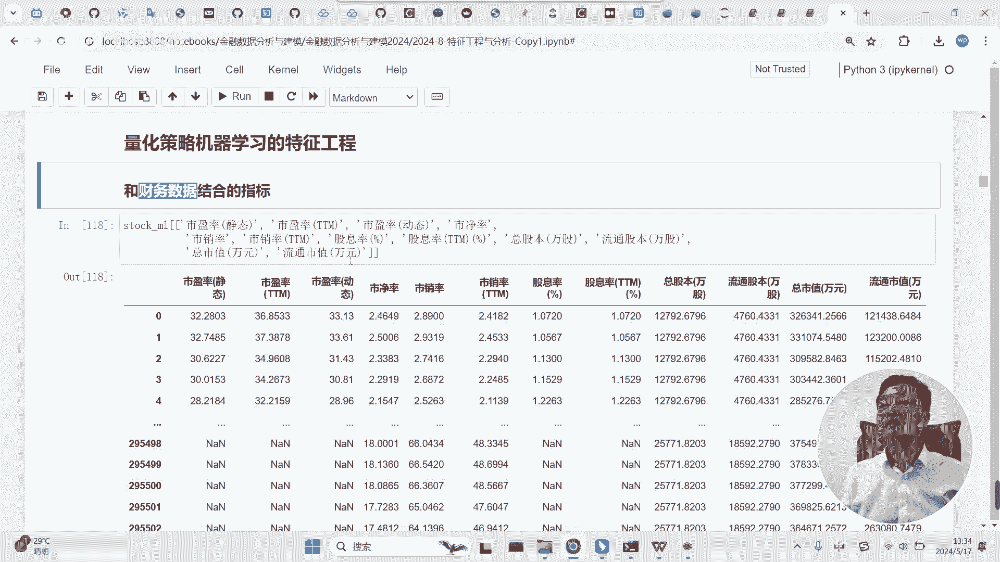

行情数据显然就是我们的这些啊，所谓的呃收盘开盘，还有成交量等等，这些这些是在每天都会发生的啊，就是大家在这个股票炒股票市场的这些数据，就是所谓的行情数据，还有一类呢就是我们的财务数据啊。

财务数据显然就是公司的一个基本面啊，这两类数据是我我们这个量化学，就是这个金融这一块里面最核心的两大数据啊，最核心的两大数据，当然除此之外，还有一些别的数据，比如说宏观经济数据其实也有用也有用。

是不是包括什么呢，宏观除了除了经济经济数据以外呃，你还可以从一些特殊的渠道，比如说我们有同学做那个论文，毕业论文，他从那个他获取对应股票的论坛的贴纸，把这个贴纸爬到，然后去分析这个贴纸的数量也好。

情感倾向也好，那这也是跟股票有关的数据，当然这就是另外的一些另类数据了啊，额也就是主要的核心的两大类，主要还是行情和财务数据啊。

财务数据，额财务数据的话不太方便直接用到量化里面啊。

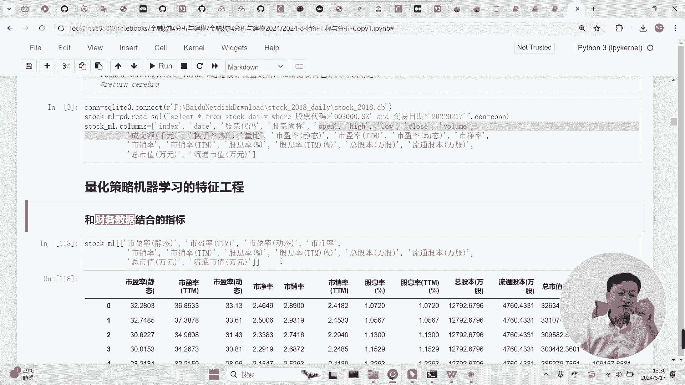

为啥呢，财务数据其实是很多的啊。

很多的啊，你看额我们的那个我们的这个这个数据里面啧。

就是我们的这张表里面是有财务数据的啊，同学们回头自己看看啊，因为我们去，我去年讲了很多关于关于财务数据的东西，但是今年可能来不及讲这么多啊。

财务数据有很多特征啊。

有很多特征，这都是通过这是什么呢，这都是呃所谓的会计师，通过审计他们公司的运营情况啊，获得的一些数据，这里面也非常多啊，核心的就是什么呢，核心的无非就是那几类啊，哪几类呢，也就是所谓的负债情况。

利润情况和现金流情况啊。

好几张表啊，好几张表，我们这里其实有，而且然后通过每张表呢有很多衍生的量啊。

有很多衍生的量，然后这些衍生的量和股票价格，又做了很多衍生量，所以说这是非常多的，但是财务数据有一个问题，什么问题呢，他这个数据的额公布啊，时间是不一不一致的懂吗，时间是不一致的，而且往往是滞后的啊。

往往是滞后的，所以说你要直接把它用来做我们的，作为我们的股票特征呢是要做一些处理的啊，是要做一些处理的，所以说呃不好直接来用，当然额比较幸运的是呢，我们现有的这个数据啊。

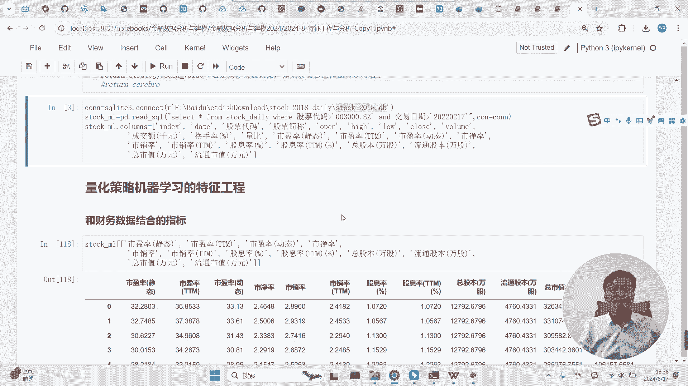

是包含一些财务数据的，我们现有的这个数据，他们别人帮我们处理好了啊，他当他处理好了，是他是呃认为比较核心的一些特征。

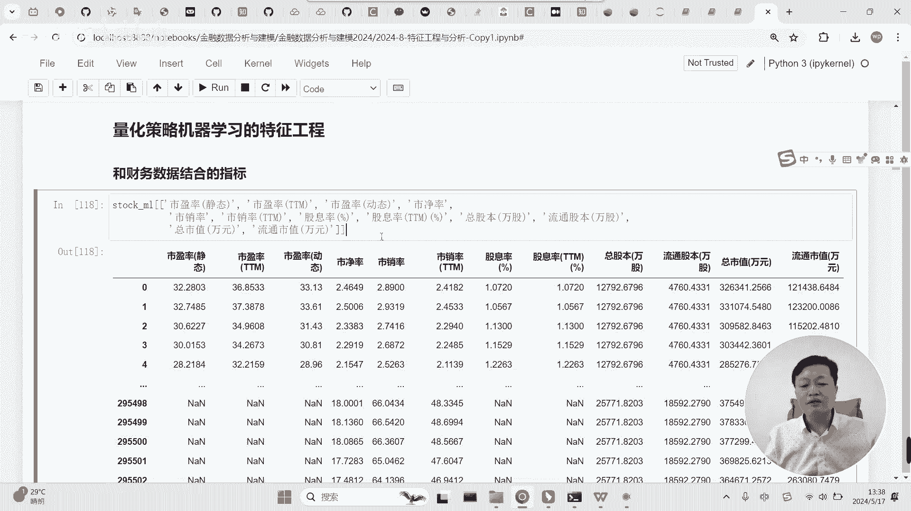

已经放到我们这张表里面了啊。

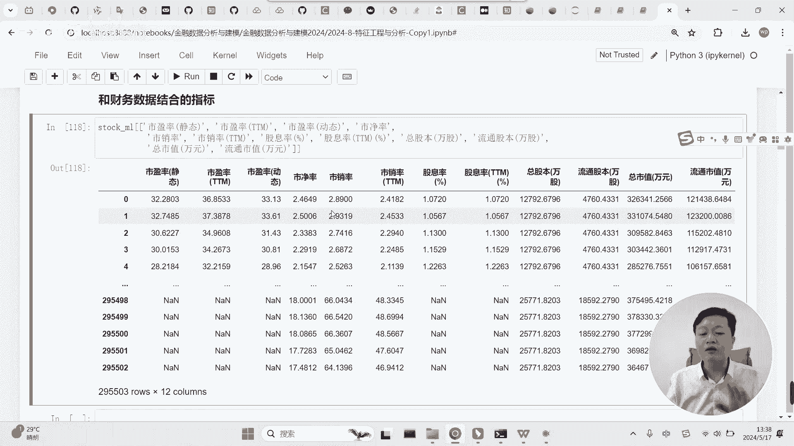

所以这些这些特征我们是可以直接用的，因为他已经弄好了嘛是吧，这包含哪些呢啊一个是你看主要是这些，这些包含什么呢，一个是市盈率是这些东西或是金缕是销率，股息啊，其实就是这几类。

而这几类呢它它不是纯粹的财务数据，它是啊，额他是行情数据和财务数据相基因结合，做出来的一些东西啊，它里面包含了财务数据的信息，比如说市盈率包含了什么，大家还记得吗，士就是市值银就是什么盈利情况能理解吗。

是市盈利是指的市值除以啊，公司的一个营收盈利懂吗，所以说他这个市盈率肯定是包含了，公司年度的一个啊季度的营收的啊，季度的营收情况的，所以说市盈率是净利的话也也很好理解，但是市值除以什么净资产懂吗。

企业净资产，所以这个里面这个值，它是包含了企业净资产的信息的啊，企业净资产，那视效率呢这个也很好理解，是不是市值除以什么销售啊，经营经营销售的一个销售额，销售量啊，销售量。

所以他这个这个量是肯定是包含了，企业的销售量啊，企业的销售量，啊股息的话啊，大家也能听到，就是我哈我也不知道具体的哈，没看他具体的公式，但是我们应该能理解大概的意思啊，企业的一个股息率啊，股息率啊。

所以这些其实是包含财务数据的啊，当然他是行情数据和财务相结合，而且它已经我们在数据里面已经做好了，所以说我们可以直接把它用上去。

这是我们数据里面一个很大的一类所谓的呃，和财务数据相结合的指标啊。

我们之前就用了，一个是市盈率和一个是总市值啊。

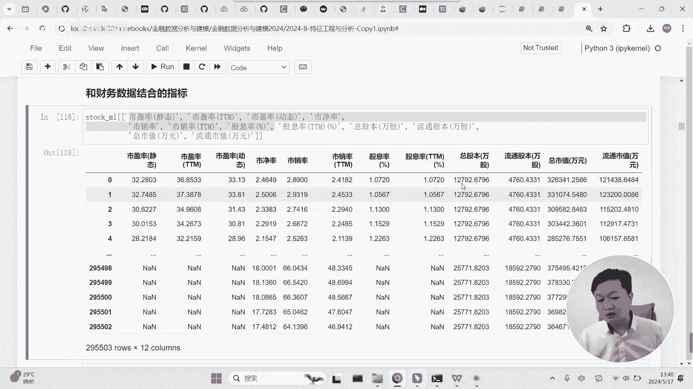

总市值算是行情数据吧，嗯好这是这一类。

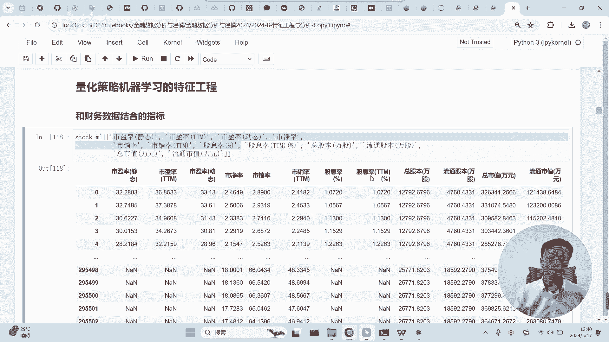

我们在我们的这个数据里面直接用就行了。

我们现在不引入额外的财务数据，但实际上我们这个其实确实是不够的，因为我们有盈利，有营收，有净资产，但是缺了一些啊，缺了什么呢，缺了企业的债务和企业的现金流，其实这两点也是衡量企业呃健康状况的。

一个很重要的一个评判标准吧，但是我们这里没有啊，需要的话，同学们可以把它自己搞进去啊，自己搞进去。

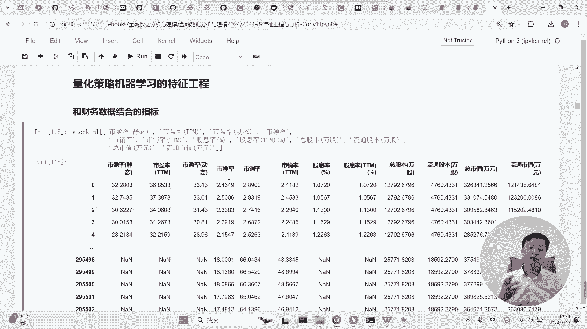

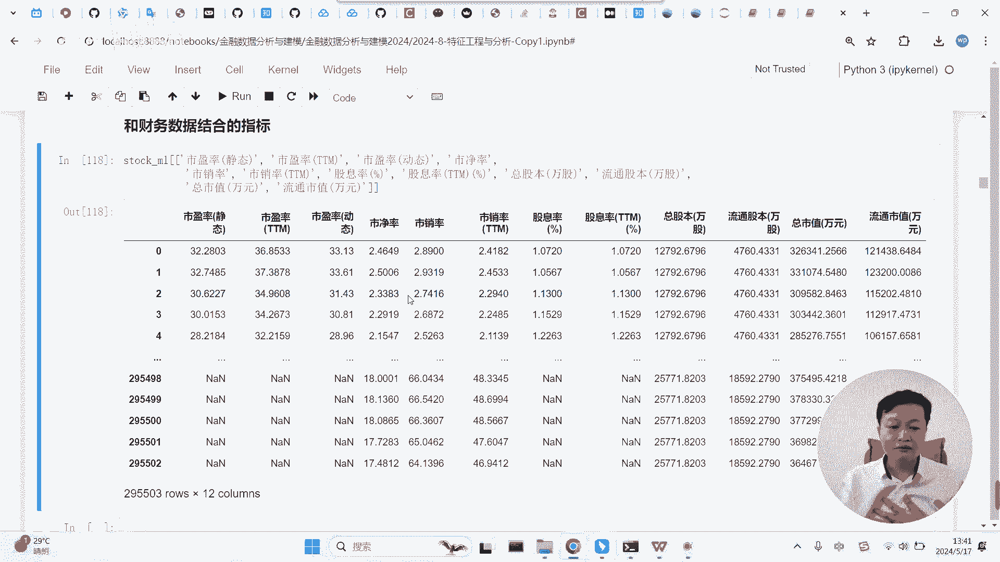

然后是行情指标以及简单的一些衍生行情指标。

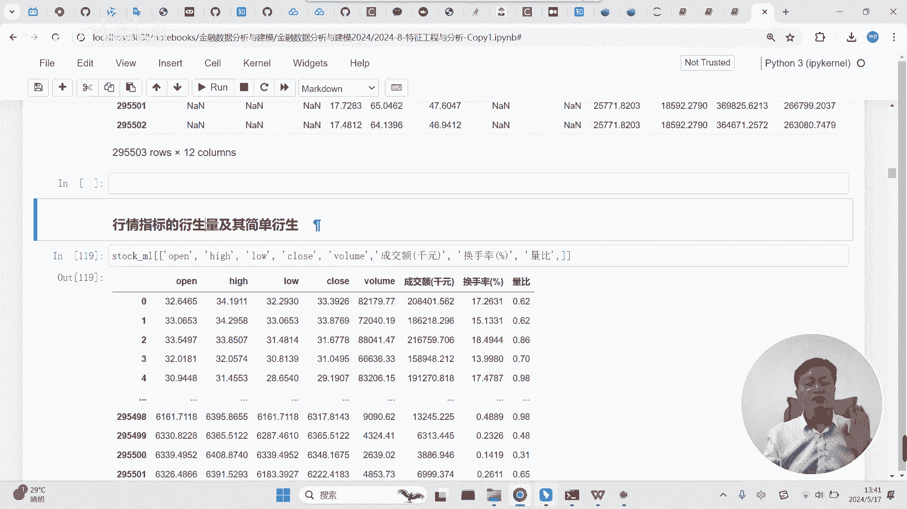

显然就这些嘛，就这些嘛啊显然就这些额价格呀，额成交量啊，换手率啊等等啊。

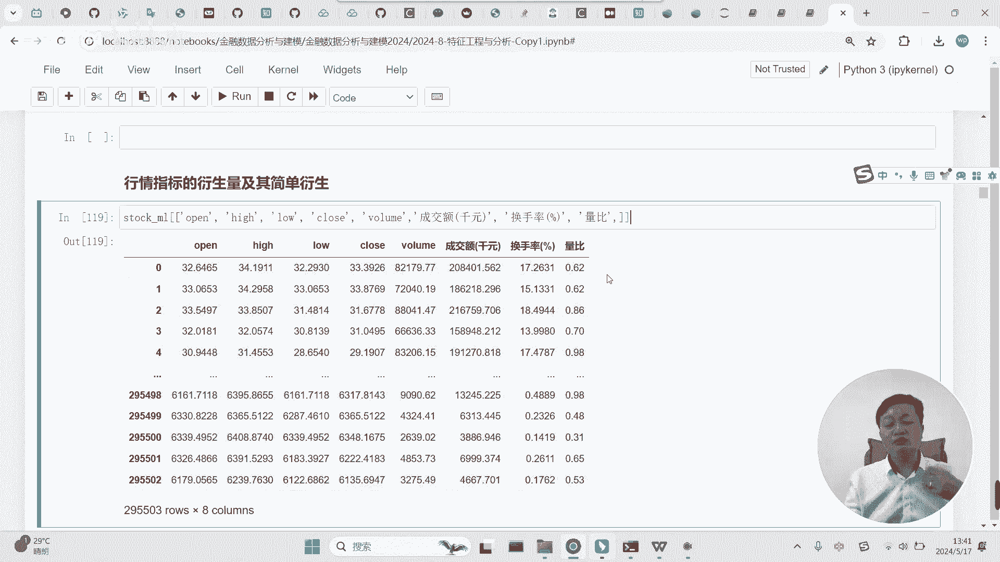

这些都是后面就是它衍生出来的呃，所谓的简单延伸是什么呢。

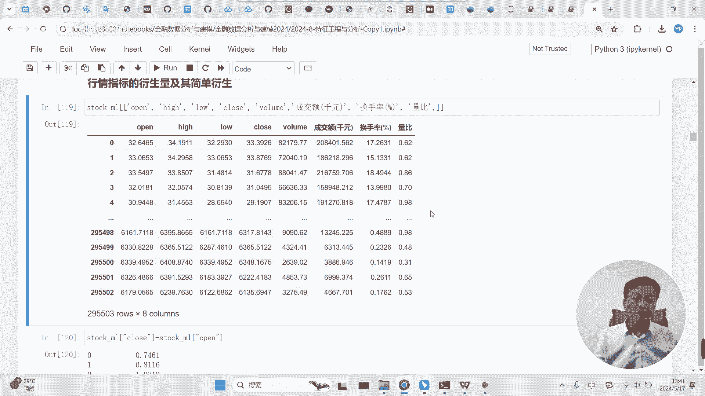

就是说呃因为机器学习还是很很有赖于什么呢，有赖于特征的量的啊，就是有些特征呃，你可以互相作用一下，很可能会有一些比较有意思的效果。

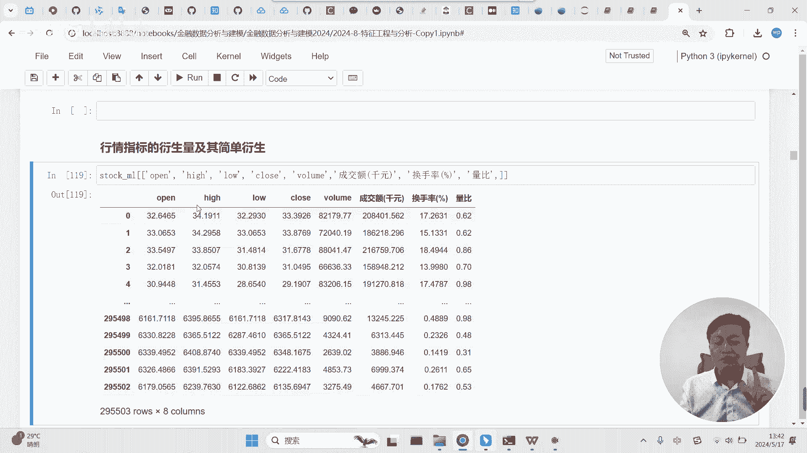

比如说这里看这里做了一个新的特征，就是基于上面的衍生的这种衍生飞机，非常简单，也非常容易，就是把收盘价减去开盘价，是不是，然后把最高价减去最低价是吧，把这个值作为我们一个衍生特征啊，作为一个新特征。

可以可以用来拿进来啊，可以拿进来啊。

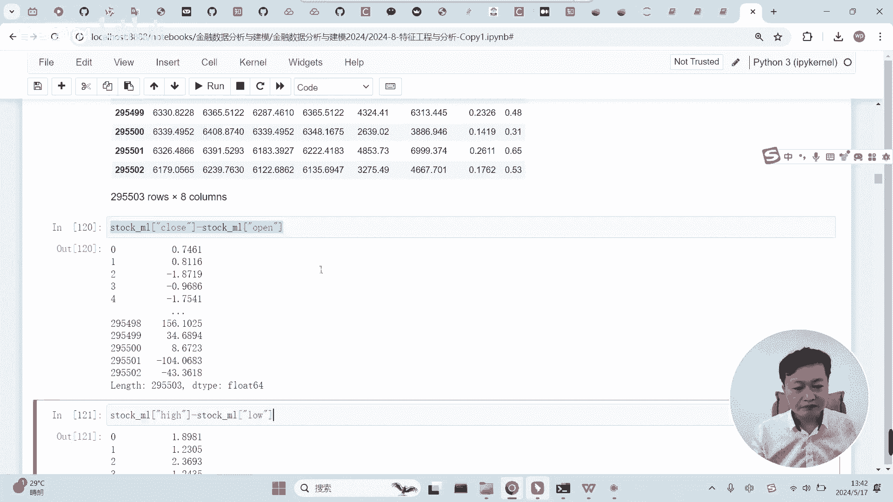

好这是所谓的财务和行情，以及他简单的衍生，除此之外呢。

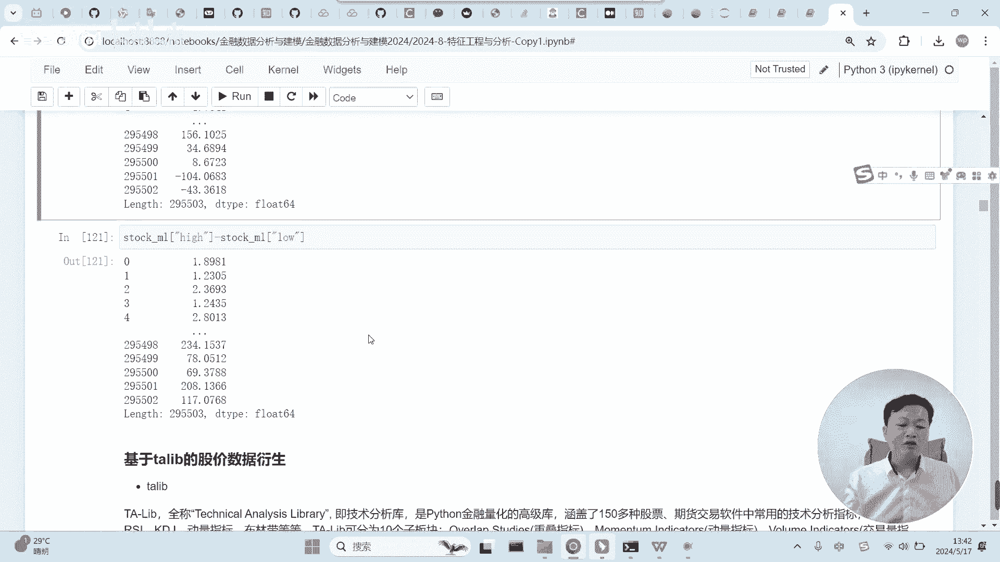

我们的行情数据还可以做更丰富的衍生，而这个更丰富的衍生呢。

我们最好是借助于这个这个库来实现啊，当我们借助于这个库的时候，这意味着我们用了很多的衍生方式啊，这个库提供了多少个指标，200多个吗，估计有好三四百吧，三四反，反正好几百个。

基于行情数据衍生出来的一些指标，这些指标都是这么大半个世纪以来啊，很多的金融科学家哈发发论文发出来的哈，发论文发出来的，也算是我们这个一个重要的一个一个资产呢，呃很多时候可以用一用啊。

很多时候可以用一用。

就它它的构建，它的它的处理，就它对它基于行情数据进行构建特征的方式。

比我们这种哈肯定是要复杂一些啊。

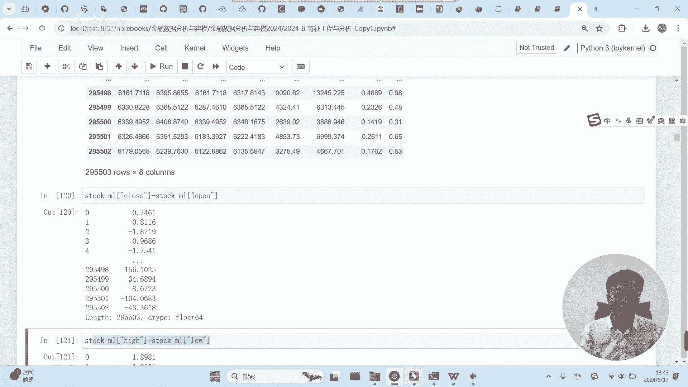

肯定是要复杂一些呃，我们呃可以直接通过调它的函数来进行使用啊。

来进行使用，好接下来我们就来做一下这个事情啊，接下来我们就要做做一下这个事情，做这个事情之前呢，我们得得干嘛呢。

学习一下什么呢，首先啊我们基于行情数据来做做做新的特征，我们肯定是要处理什么呢，处理股票的时间序列的是吧，股票价格的时间序列要把它做一些变换，是不是呃我们处理股票价格的时间序列，这就涉及到和我们上节课。

面临着一个一样的问题。

什么意思呢，我们上节课大家同学们不知道还记不记得啊，呃上节课的课件呢，呃我我们拿到的数据。

我们拿到的这个数据啊。

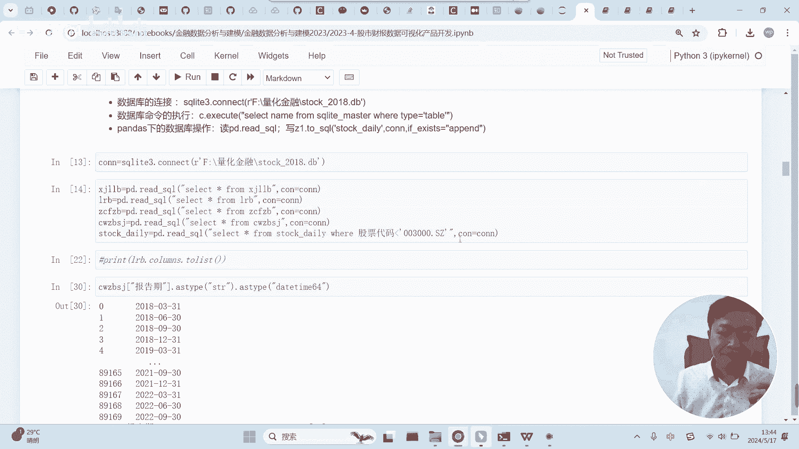

哇我我我搞错了，在这里啊。

啊我们拿到的数据是所有股票的数据。

但是我们在做特征的时候，通常都是聚焦到某一个股票的价格序列。

能理解吗，啊我们我们拿到的这个数据啊。

我们拿到的。

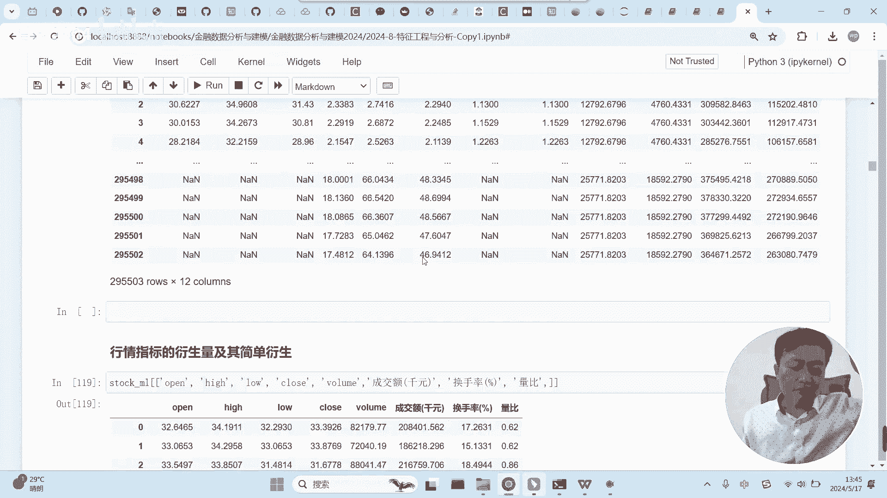

这个我们拿到的这个数据啊，它是包含了多个股票的额数据的。

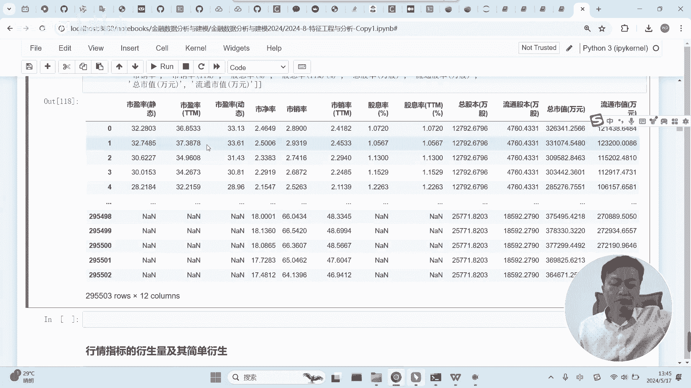

但是我们做特征的时候啊。

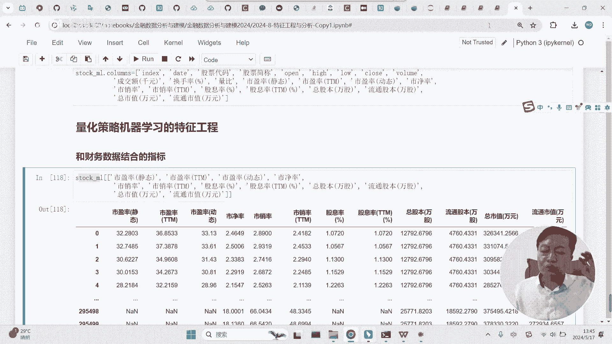

则是期望聚焦于某一只股票。

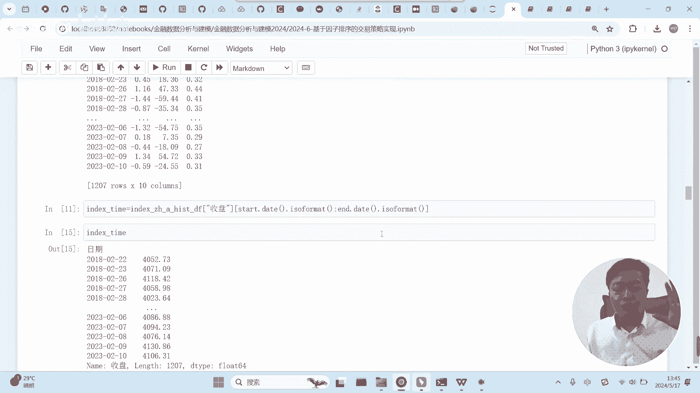

某一只股票，这就意味着什么呢，这就意味着。

我们其实是面临和之前一样的。

哎我我开错了吗，我上上节课是在哪里啊。

这里。

和上节课一样，上节课什么一样呢，和这个一样，还记得吗，上节课我们是想求想求什么呢，想求相邻的额多少天之间的一个额收益情况，是不是啊是个收益情况呢，这个所谓的相邻多少天，他必必须得是一单某一个股票的。

是不是你不能把呃，第一天股票A和第第30天，股票B之间的这个股价来做收益，这个不存在的啊，肯定是同一只股票啊，一旦涉及到这这种东西的话，必然是要他必他必然是要先group败，对股票价格。

对股票代码进行咕噜拜，这个大家大家能理解吗啊，首先GROU败之后，然后再做这个呃这个函数的一个处理啊，就拿到了每基于每个股票代码的小那个小组，然后对那个小组的序列啊做相关的操作啊，所以这么搞是必须的啊。

这么搞是必须的，但是这里面临一个一个问题，什么问题呢。

我们的ta lab这个啊就是这个。

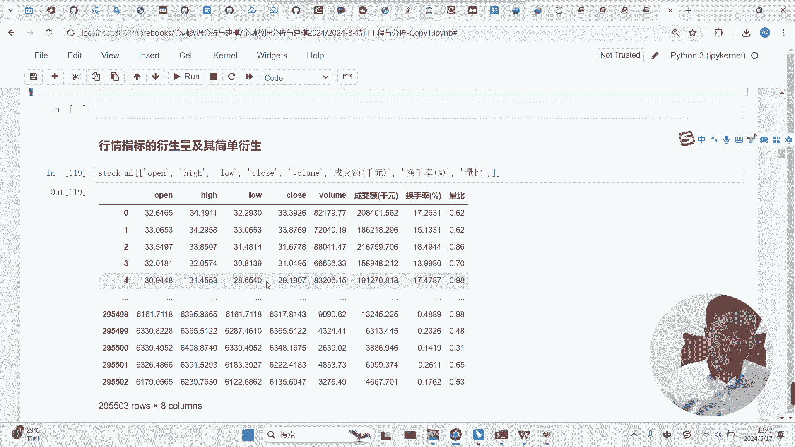

这个里面的这个里面的所有的函数啊。

它是什么形式呢。

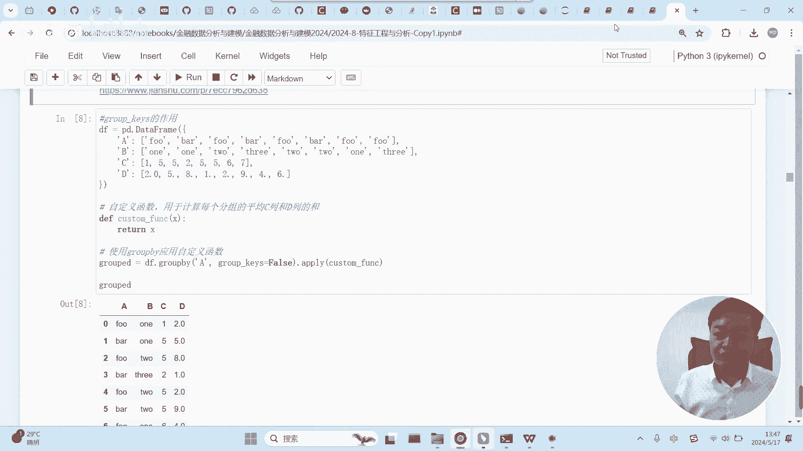

它是以它是以这个形式啊，它并不不能点。

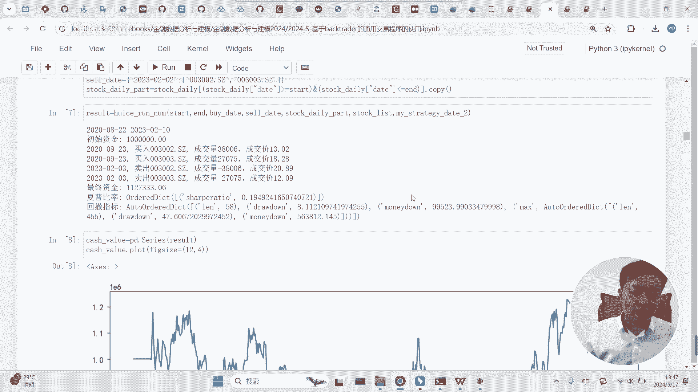

不不是我们的，不是数据框的方法。

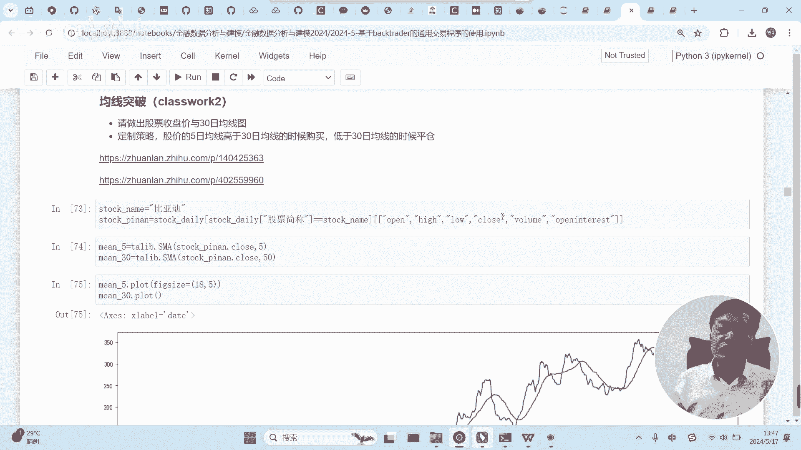

而是，而是什么呢啊我举个例子举个例子。

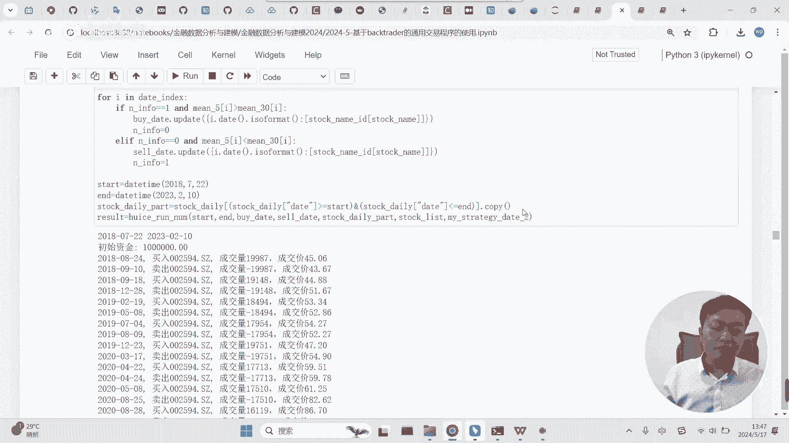

你看他是得把数据放在里面，不是说什么呢，不是以这个形式来做的，不是以什么形式呢，我给你举个例子啊，不是以这个形式来做的，它不像那个percent person on，他只可以点在后面，这个不能点在后面。

他这个他只能是扩在外面，它是一个函数啊，它不是一个方法。

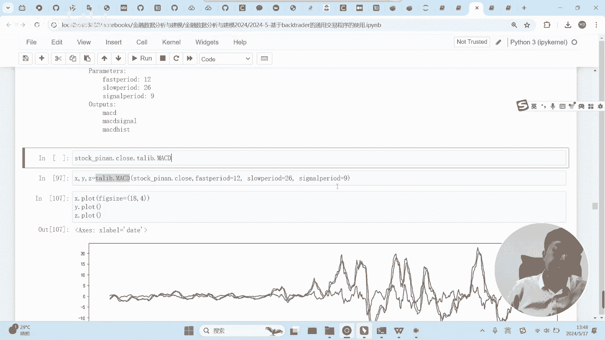

这个时候因此呢像我们上节课这种的话，直接点在后面就不太行了，我们需要干嘛呢。

我们需要使用啊，apply需要使用这个来让他作用上作用上去，使用这个东西来把它作用上去，这个大家还记得吗啊，这一套方法老师先讲讲啊，再详细先讲讲。

就是我们先了解一下这个背景，然后才知道他为什么这么处理啊。

现在很明显我们是要借用什么呢，来生成新的特征，这些函数需要作用到某一只股票的时间序列，上面去啊，某一只股票的时间序列，因此呢我们肯定是需要啊做group by的啊。

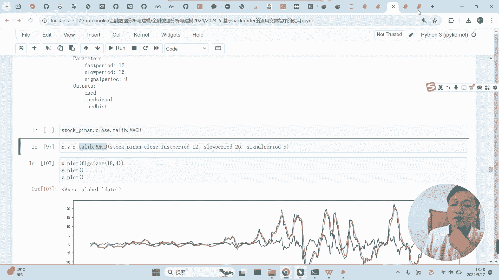

然后呢，通过apply把这些ta lab这里面的那些函数啊，作用上去啊，作用上去，作用上去之后呢，我们来看看这里这个机制啊，这个机制啧嘶apply啊，它是一个相当于是个什么呢。

他就是把这个把这个函数看见没有，这个函数作用上去啊，啊这个DF是什么呢，DF我们我们运行一下啊。

DF就是一个简单的，啊就是这样一个数据框啊，就这样一个数据框额，如果我们这样子我们求和的话，我们可以看一下它的效果啊，求和的话，你看求和的话，他是要搞成这样，但是大家注意点呃，作用到这个求和。

是作用到了分组后的每一个小组上面，所以说他这里是这个样子，大家能理解吗啊，作用到每一个小组上面的啊，呃大家注意一点，apply作用上去的函数啊，它有两类，一类是什么呢，一类是会把这个小组变成一个值。

能理解吗，什么叫变成一个值。

你看啊，我们基于A进行分组之后啊，基于A进行分组之后啊，每一个小组是有若干行的是吧，当我们用求和的时候，是不是这若干行的数就变成了一个数是吧，这是一类，还有一种呢，他并没有把这若干行变成一个数。

它若干行通过一些作用之后，还是若干行，能理解吗，最简单的就是什么呢。

就是我们的这个percent，是不是它作用上去若干行，还是若干行，能理解吗，他除非就你他你看他是要，比如他是要求相邻的两个价格的收益的话，是不是它它不会让这个行若干行变成一行，它还是若干行。

无非就是前面几个是空值吗，能不能理解这个这种操作呢。

会产生什么情况呢，我们可以给大家看看啊，就是假设我们没有刚才这个东东西的话，假如我们就只输出X啊，你看它会形成这样子形成这样子一个东西，相比这样的一个东西呢，它的索引其实是会发生变化的，懂吗。

就是你假设这里有一个这里有一个方法，这个方法能够啊，这个方法呢它不不会把把这个分组三，这三个三行变成一行，它依然是三行啊，那么它就会是一，它会是形成这样一个形式，这样一个形式是有问题的啊，不好用的。

为什么不好用呢，因为大家想想，我们通过这个方式做成的新的一个，做成的新的一个特征，我们希望它的索引依然保持之前的索引结构，因为我们要直接和之前的特征要合并的啊，大家知道了，所以说这个形式是不行的。

我们要干嘛呢，要加上这个大家看一下，加上这个有什么变化啊，加上这个有什么变化，加上这个之后呢，你看他变成这样子了，这样子是什么意思呢，这样子实际上是这样的，就是他虽然分组分组之后呢。

虽然把这个函数作用到每个小组里面，这个没问题。

但是呢它不会改变原有的这个，数据框的索引结构，能理解吗，能理解这个吗，这两个是一样的懂吗，它不改改变原有的索引结构的好处在于什么呢，你想想。

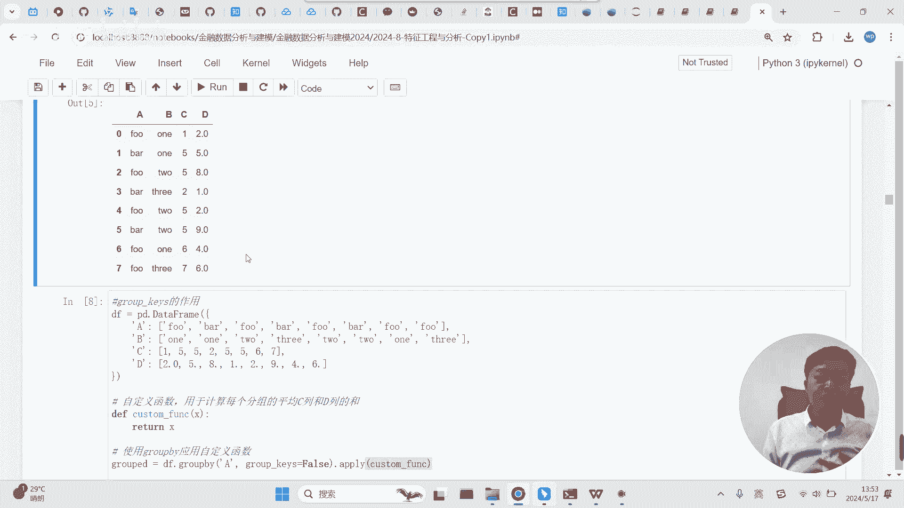

比如说动量啊这些东西或者均值啊。

那么他这个值直接就可以加在后面啊，直接加在后面，而且直接可以append进去，这是我不知道大家能不能理解这一点啊，就能直接把把我们拿到的这个特征，直接和原来的特征合并就行了，就不需要重新去校对索引。

大家能理解这一点吗啊就不需要重新校对索引，因为一旦没有这个的话，我们把ta lab的一些函数作用上去，它的索引结构会发生变化，发生变化之后，我们还得重新校对，然后重新再拼上去，就非常麻烦啊，非常麻烦好。

这是呃这个前置的知识，我跟他同学们讲一下，讲好了之后呢，我们来做实际的一个一个操作啊，我们来做实际的操作，我们定义一个函数，F函数什么呢，呃，啊X额，我们定义一个函数，定义一个这个定义这个函数。

这个函数干嘛呢，这个函数我们看一下，我们就用ti lab做一些事情啊。

呃我们最简单的应该是啥呢。

最简单的是不是均值啊，对我们用铅做均值吧，先做君子吧，呃这个课件是我们的那个第五次的课件，同学们有吧，不许这个代码都不用考了，我们啊大家自己翻一下以前的课件好不好，拷贝一下就行了啊。

老师也是翻以前的课件拷贝的，因为我也不会不记得这些东西啊，我们把这个弄西弄过来嘛。

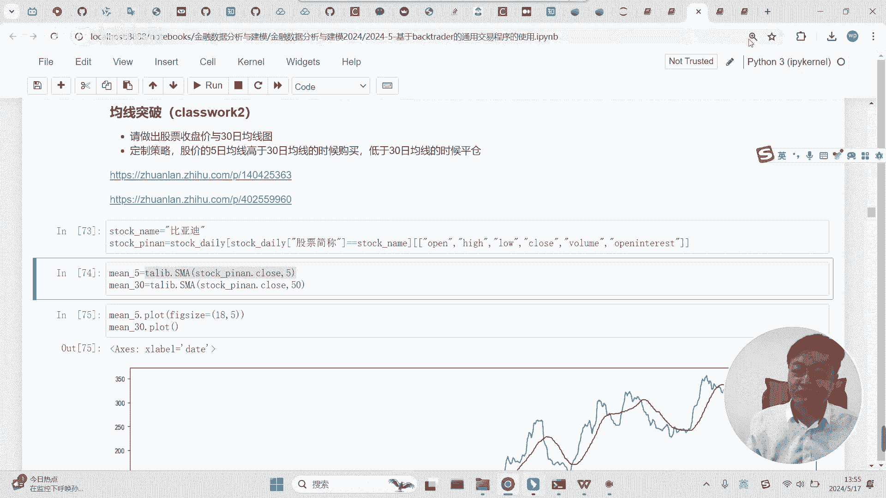

啊弄过来均值，我们做一下它的均值，然后呢我们这里是什么呢，是这个X，X这是5日均值，那我们是不是还可以做一下，做一下做一下什么呢，注意一下十的，是吧，那我先做一个吧啊先做一个呃，待会儿再做多个啊。

先做一个呃，什么意思呢，然后我们就可以，对称这个东西，啊V称这个东西，我们把这个东西弄好，这个这个函数我们是要放在group by之后的，这里面的X是每一个分组好的，分组好的小组。

对小组里面的东西做均值啊，然后我们再做一个什么呢，我们做额，做这个啊，做他的腐败腐败什么呢，股票代码我们可以看一下它的扩容是吧，省得我们点，我们不派股票代码就行了，我们其余每个股票做分组啊。

每个股票做分组，然后呢点哎我们的这个函数，是不是。

然后我们看一下，看一下它的效果啊，看一下它的效果。

你看到没，这样的话，他对每一个小组做了啊，对每个小组做了一个求求几日的均值，大家能理解吗啊，我们可以看一下图，我们可以看一下，我们可以去看一下他到底是个什么情况，好我们去去到。

因为老是把它保存到本地了吗，保存到本地之后，我们去去去。

可以去看看，可以去看看。

好在这里。

呐好大呀，光一电就有九九兆拿是吧。

他他是对每一个小组啊，每一个小组做了额5日的移动平均，所以说前面都是空值是吧，你看对每一个小组做的做的是5日，你看到这里，你看他就没做了，然后再看这里又是又是又是四个空值，然后这里才才会有5日平均。

是不是啊。

所以大家可以了解一下啊，但是呢这个是有问题的，为什么呢，我刚刚讲了我们的这个啊。

他的索引结构是这样的啊。

我们的索引结构是这样的一个索引，他刚才的索引结构是是那样的形式，他们两个不配。

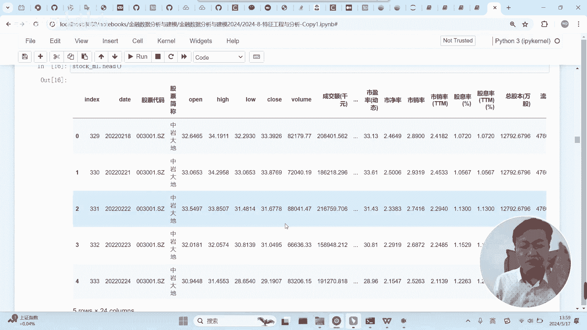

这样意味着什么呢，意味着我们不能直接把这里获得的这个。

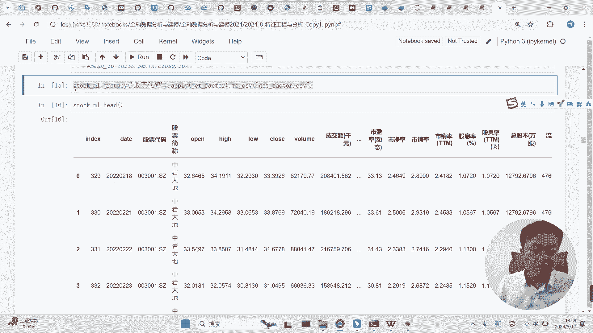

这个特征啊，直接把它纵向合并过来，能理解吗，因为我们我们还需要这里的这些特征的啊，所以他肯定是要合并过来的。

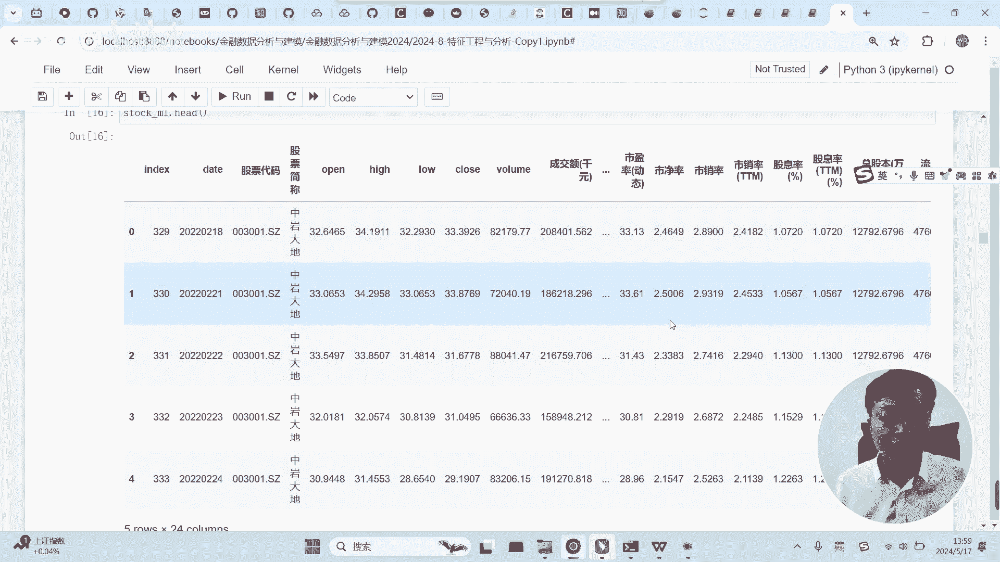

那么所以说我们要干嘛呢，我们要加一个东西。

加这个，加到加到group by里面，不要让他就让他不要像刚才那样啊，要还是按照原来的这个索引，这个时候我们再看一下啊，看一下区别啊。

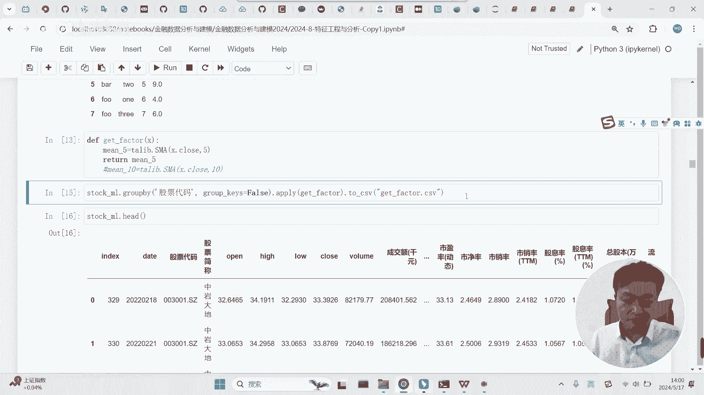

好我们再看一下区别。

你看这个时候他就再没有之前的那个股票，ID的索引呢，它它还保持了原来的从0~1231234，看见没有，看见没啊，它依然保持的是原来原来的那个。

数字编号的索引，就是我们原始的呀，我们原始的这个呃这个数据它就是这样。

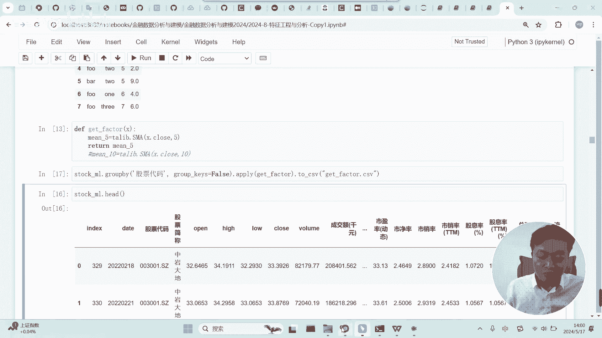

从01234的这样数字编号索引。

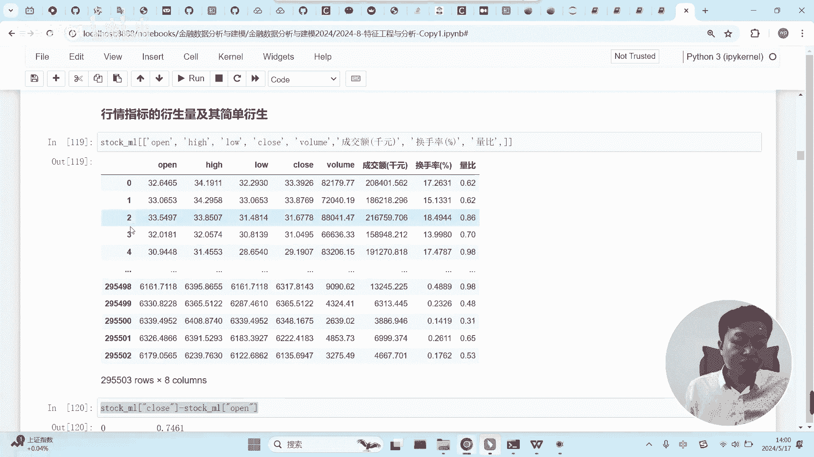

这就这个时候他既做了我们想要的移动平均对。

每个股票啊，呃同时呢它由又保持了和这个一致的索引，这个时候我们就能够直接直接干嘛呢，直接把这个把什么呢，直接把这个东西呀，join过来。

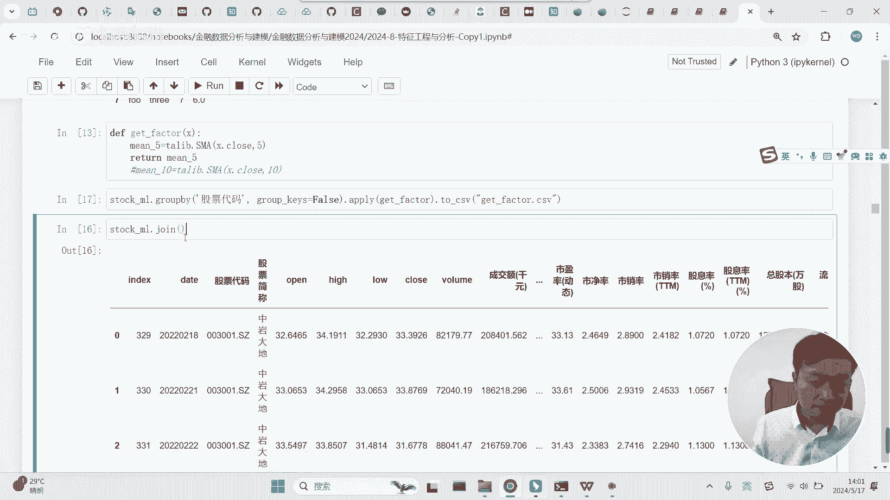

能理解吗，直接join过来之后，大家可以看到它其实就可以直接放到后面。

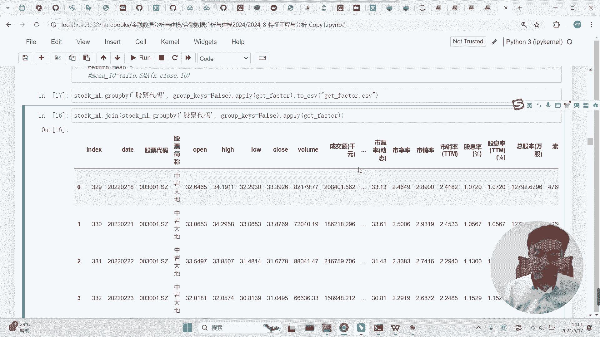

哦他需要有一个名字啊，求Z1等于，然后Z1点。

我随便取一个啊。

因为我们待会还要做别的事情呢啊，然后呢。

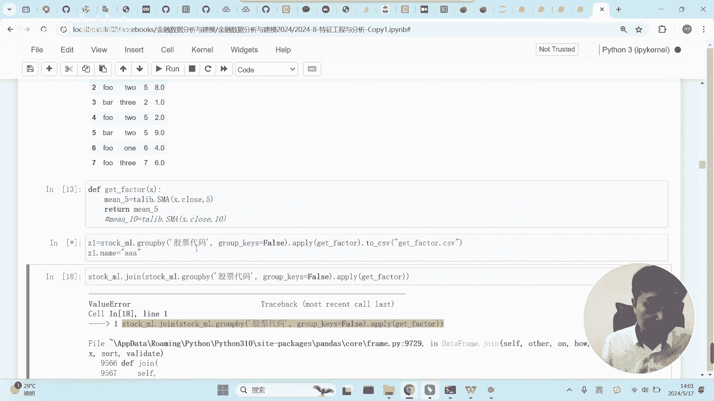

啊这个这个就不那个了啊。

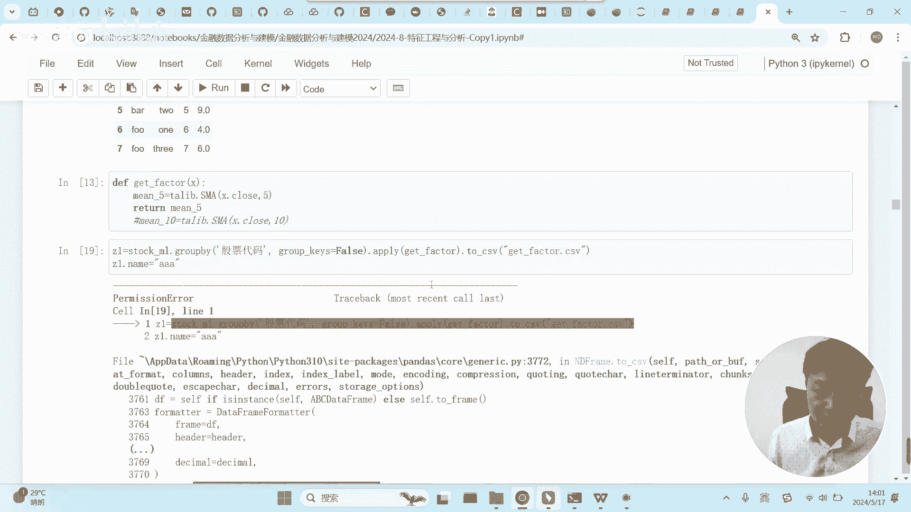

这样的话我们就能把把它直接join过来。

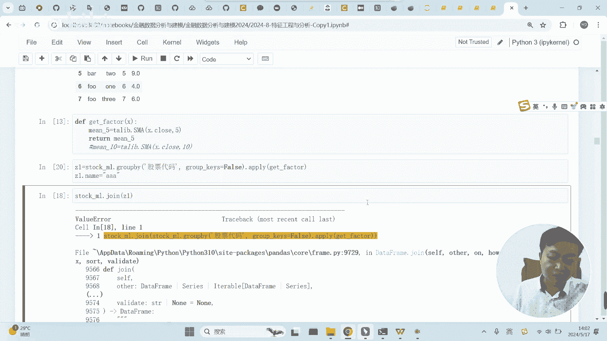

看到没有，它join过来之后呢，他就可以作为一个新的新的特征。

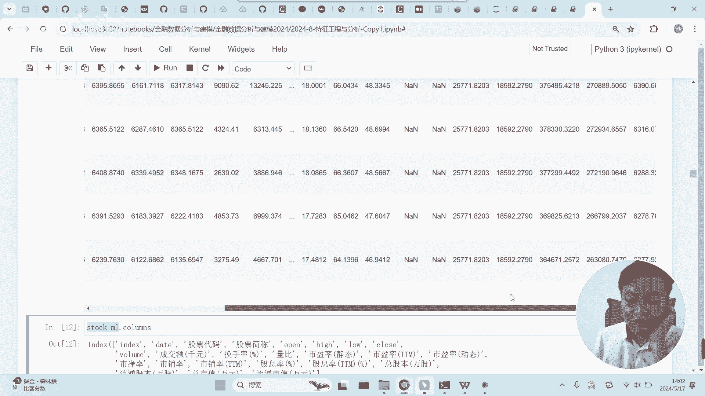

放到我们的这个表的后面了。

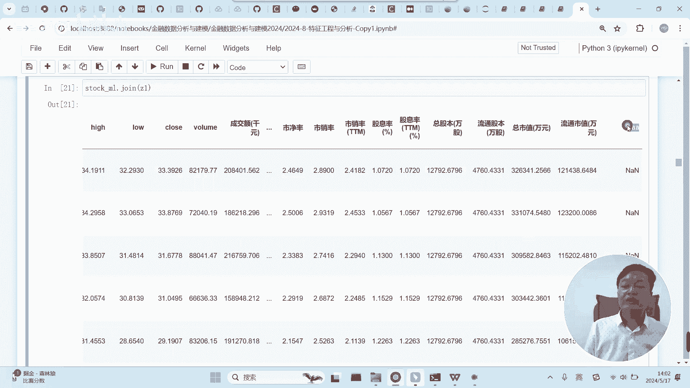

大家能理解这个过程吗，啊，这就是为什么我们要加入这个东西，的一个关键啊，一个关键好了，想通了，这个的话，我们来，来来大量的搞特征也不大量。

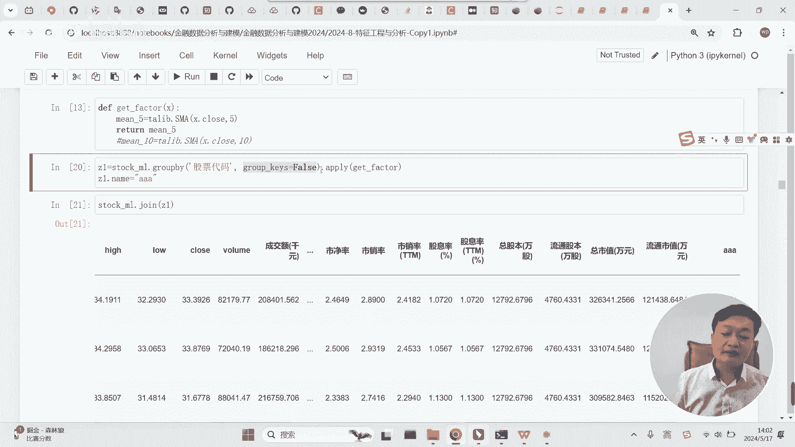

我们就多搞几个吧啊多搞几个啊，多搞几个，多搞几个，怎么怎么搞呢，我们依然放在这里面，这是，我们做做十吧，是不是这是10号的啊，10号的，然后呢这是均值。

然后呢我们再搞搞点什么呢，呃同学们也可以看一下自己原来的，就是我们把这这里的都搞上去吧，这是我们在第五个课件里面。

我们搞过一些一些东西的啊，搞过一些东西啊。

我们把这个也搞过来吧。

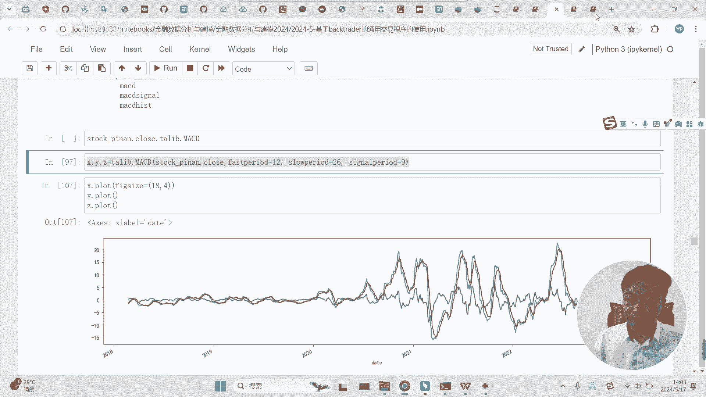

大家也可以直接呃，是吧，我们把这个也搞过来这个，但是这个时候他是X，啊这是这个这是MACD线。

然后呢还有还有啥。


还有动量，动量也搞一个搞一个意思一下。


动量，动冻死，然后这个也是要X是不是。

这是动量，然后呢我们看看啊。


还有别的没RSRSI，这这也是我们之前搞过一个的。

我们也搞过来吧，是吧。


RSI还有啥，其实都是顺手弄过来就行了啊。


唐奇安唐奇安通道。


也是一样啊。


然后布林带这样是不是就差不多了。


布林带，是吧，我们，啊这样的话至少把我们课课程上提过的啊，这些量我们都搞过来了啊，都搞过来了啊，这个要要那个一下，额然后再把上面的也加过来。


下面还有什么呢，我们之前不是简单的构造过几个吗。


简单的还有。


这个肯定是额肯定是X啊，X，哦其实这个这个不需要搞搞搞在这里搞，因为这里这里搞也可以，但是他其实是直接弄就行了啊，嗯放在这里有点杀鸡用牛刀的感觉啊，杀鸡用牛刀的感觉，但是呢呃之前的那几个可以。

就是那我们的什么呢，我们的收益率是可以的啊，我们的收益率啊，UX点close点percent和我们一个是5日，是不是，还有一个是什么呢，还有一个是10日的，还有一个是时日，就可以啊。

因为我们这次就搞十十天的吧，不搞三四天了，我觉得三天太长太长了，搞两个就行了，然后，这些都到这里了，都到这里了啊，还要对，还得加个shift，我们我们主要是待会要干嘛呢，要，十，我们待会就用这个这个做。

我们作为我们的什么呢，作为我们的目标向量就行啦，用这个做处理一下作文，就是我们用这些特征来预测十天，十个交易日之后的啊，十个交易日之后的一个股票收益啊，啧应该这样就差不多了，这样差不多了之后呢。

我们需要干嘛呢，我们需要把它给，呃contact at到一起，把它慷慨的到一起。

啊我们需要把这个contact到一起，而且这些都是序列啊，contact是可以呃，可以同时搞多个序列的啊，搞多个序列的，啧然后呢定义一下，我们是要合纵向的，合并啊。


把它搞成一列一列的，所以说AXX等于一，这个也需要这么定义，定义好了之后呢。


我们最好是干嘛呢，最好是给这些列啊，给重新定义一个名字，因为它这么慷慨，到一起之后，他的每一列式就是用的01234这种序号，这种的话我们觉得不太合适，我们给它定义一个名字啊。

所以columns等于什么呢，等于这些这些东西，但是这个时候这些东西不能不能直接搞啊，我们给他加上引号，他要成为列名的啊，要成为列名的，好，这样的话就OK了，我们把这整个这个东西return出来。

return出来啧。

然后我们看看效果，看看效果啊，看看效果。


我们先运行一下这个，然后再运行这个。

啊这个我看看啊，这个是我哪里引用错了。


哎对等一下啊。

啊是这个啊。


是我是我这个搞错了啊，少了一个change，啊少了一个change percent的change。


这下就可以啦就可以啦。


看见没有。


这样我们就做了这么多特征啊。

做了这些特征啊，做了这些特征。


做了16个吧，做了16个特征，然后呢。


就像刚才讲的，我们可以把这些特征join进去。

这一定义一个中间变量吧。


然后呢然后把它做一个到确认到这里，对应到这里之后呢，我们呃给它定义一个名称。


你看这样的话，我们新的得到的这个东西啊。

就是一个有有40列，40列的一个一个新的东西。


你看是吧，前面的这些呃。


呃这些空值很很显然，因为我们很多时候是啊，是要是要是做的移动。


类似于移动平均这种啊，他前面几个肯定是空值的。


这个很正常，啊那我们就把这个事情搞完了啊。


这个事情搞完了之后呢，还不太够，我们还记得吗。


我们之前这里搞了搞了一些事啊，这个是不是。

我们还还把这两个特征忘了，这两个特征我们取个名字吧，取个clove减O减O，然后呢还有一个是什么。


还有一个是开收盘减，开盘是不是最高减最低。


额我们最好是用同一个东西啊，啊最好是用同一个东西，这个是什么最高，减去最低L是不是，这样的话，我们又可以多两个特征啊，这个特征会因为它就是额列的一个相相减，就非常简单，我们直接直接弄进去就行了啊。

这些都不需要了啊，然后呢我们就得到了一个，有。

有这么多特征的一个新的啊。

新的一个类特征取证吧啊类特征取证呃。

最后的话我们当然希望希望把它干嘛呢，我们还还得干嘛。

还得构建我们的目标向量，目标向量的话，我们上节课其实做过类似的事情的啊。

做过类似的事情的这个构建的话，额我们其实已经有了。

这个就相当于我们的目标目标向量，但是我们可以再做一些处理啊，可以再做一些处理。

做一些什么处理呢。

一个是，我们。

好啧，我们再把这个我们的那个目标向量。

再做一点小小的处理啊，我们的目标向量是这个东西是吧。

是这个我们做一点小小的处理，这个做什么处理呢，首先我们可以apply，然后呢我们只要定义一个函数，还记得吗，上节课的一个拉姆达是不是。

嗯在在哪里。


你看这里看到没有，这上节课的一个一个事情，就是定义一个可以让它变成一个二值化啊，就大于零，我们就让它是一一，然后小于零的话。

我们就让它是呃，让他是零啊，就二字画一下，二组画一下，这个其实是有用的，虽然说我们最终可能不不用二分类的方式来做，但是额这么二字一二字画一下，是可以方便我们做一些简单的分析的，待会大家也可以看到啊。

待会大家可以看到啊，然后另外一点呢就是我们可以rank一下啊，可以干嘛呢，可以，点我们可以把我们的这个词，这个具体的收益值转换成排名啊，goodbye by什么呢，这个时候我们要基于date。

就不再是基于，因为排名的话是基于每天的市场，所有的股票进行排名，所以说我们PROVIDATE，然后呢点，点这个，然后点rank，哦这个是个什么。

我忘了。

好像还得有个参数是吧。


是这个PCT等于true，对啊。

得有这个参数啊，这样的话我们把具体的收益值的大小转换了啊，转换成转换成了我们的排名，好，然后呢我们可以看一下。

这样的话我们就有了这些这些东西了，有了这些东西了，有了这些东西额。

最终我们要形成我们的特征矩阵，我们形成我们特征矩阵这个东西额。

形成这个东西的话，我们要从里面塞一些东西出来啊。

要形成特征矩阵的话，我们要要干嘛呢，要把一些东西去掉啊，一把要把一些东西去掉，什么东西去掉呢，像我们的股票代码，啊这些日期股票简称。

这些是不需要的，我们只需要这些东西是吧，这些东西是我们做机器学习需要的东西。

我把它都拿过来啊，这些是我们做机器学习需要的，前面的这个股票代码和日期，机器学习嗯，不搞这个东西，这个拿到了之后呢，我们把一些有空值的。

因为这里有很多空值啊，因为我们做了那个嘛是吧，我们我们做了那个移动平均之类的东西啊，把空值去掉啊。

把有空值的去掉，好，这样就形成了我们比较纯粹的这个。

这就是我们可以用来直接搞特征的，一个一个东西啦，比较纯粹的啊。


比较纯粹的，呃注意一下啊。


这一切待会再说吧，就是呃我们这一次我们不需要做标准化了，因为我们老师用的，基本基本上都是决策树相关的呃模型啊，决策树相关的模型是不需要做标准化好，所以其实我们这个数据可以不做标准化。

就直接往这个往模型里面塞就行了啊，就如果你用的是和决策树相关的一些，就基于决策树做的一些模型呃。


你可以是是可以不对这些数字做标准化的啊。


好吧额，这是特征矩阵就生成好了，同学们自己搞一搞。


好不好，自己把这个过程搞一搞，有点长啊。

