# 26集全！B站目前唯一能将【量化交易】讲清楚的教程！用AI从零开始打造你的交易机器人！大数据量化交易／机器学习／Python金融分析 - P10：10策略优化与课程总结 - 机器学习教程 - BV1w4421S7Zx

好，那么今天是我们的这个最后一课，大家一路啊坚持过来很不容易啊。大清早的起来专门嗯。非常不容易。那么我们今天来回顾一下我们这呃十字课学了些什么东西，然后带着大家再做一下。

再再做2到3个这个case review。然后再跟大家说一下呃，接下来。应该学一些什么东西，还有一些关于如果你要找这个关于量化方面的这个工作求职的啊准备啊，就是大概是讲这么几件事情。嗯。O。

OK那么那么那么我们回顾一下我们这十字课都学了些什么。诶。大家现在可以啊闭上眼睛想一下，我们从第一节课呃一路走到现在，我们大概讲了哪些内容。我们第一个我们学了这个怎么样的这个爬举数据啊，对吧？

学会了排取数据之后，我们学的什么？是关于啊数据。是关于数据的。清洗。She。然后我们就直接跳到了这个关于机器学习的这个方法啊。和传统的这个传统的这个技术。啊。技术指标的量化啊。Bo。

的量化方法就包括了均线啊、momentum啊，还有这个。然后在机器学习跟技术指标的量化之前，我们做了一点这个。一些关于金融的最简单的知识看看。没哒。然后第四个呢，就是我们把这些东西都结合起来。

其实他都能够给他抱歉，我这手机有点。杂音就是然后我们把这些东西都给它归结成了一个统一的一个frameeework。一个统一的一个框架，一个。就是你会发现。

如果你从这个统计学习tatistical learning这个角度来看这些事情，他们其实是其实都可以用这个统计学的方法来表示。不管你是啊金融。金融的模型还是这个呃机器学习的模型。

还是基于传统的技术指标的这个量化的方法，你都能给它归结成为。你要么是呃呃做分类，要要么是做回归，只不过你基于的这个呃。决策原则就是这个deciion入是不一样的。

同时呢我们这个机器学习这块是因为我们的这个课是机器学习与量化交易。所以我在机器学习上给大家嗯多讲了不少，包括了这个机器学习的这个特征提取啊。特征提取是我们有了这个数据之后的第一步啊，有了数据之后。

不管你从哪儿拿的数据，有了数据之后，要干的第一步是特特征提取。然后呢就是建立模型啊，建立一个model啊。建立这个model之后，我们要做这个model evaluation就是。

和这个selection。就是模型的评估与选择到底这个模型好还是不好？如果。就是说这个怎么样的选择这些模模模型的参数啊，超呃超参数。这个建立模型是学习出来模型的参数。就是比如说你啊它那些W。

就是比如说SVM里头的这些W，而超参数呢是是啊这个C值啊，就就是一些啊模型学不出来的，需要你提前设定的这些参数。然后最后呢，我们有了这个呃从数据到特征到模型啊，很多人就停在这儿了。

但是不啊我们还要回测啊。不。然后基于回测呢，我们还要做这个啊这个风控啊。这个就是啊呃。我们这个初级班嗯。最重要的整个的拍 plan。

然后我们又把所有的这个东西放到了一套的这个小的一个啊一个小的stem里头去啊。嗯，差不多用了一共用了嗯。99我讲了18个小时，然后大概大家成了。3到5倍左右，所以大概是啊100个小时的时间啊。

掌握了这个整个的pa的每一个流程。但是啊很明显，里头有很多的事情是需要做细化的。也就是希望就是这个结课之后，我今天会推荐一些阅读的列表，嗯，大家嗯基于这个流程，对于每一个环节。

你都可以要不不仅是可以都应该做的更坚呃更深一点。尤其是啊嗯就是说我们在建立机器学习模型的时候，最好要跟金融学的一些呃领域知识做结合。这样的话呢，能够让你建立的模型更加的精准有效。

就是说嗯懂金融的人做的机器学习模型，明显的比只会机器学习的人做的这个量化的模型要好啊，这个是。这个是必必然的。但是呢懂金融的人做的机器学习模型容易有硬伤。就是说嗯。明显不适合用这个RBF，他用个RBF。

然后他也不知道调超参数，或者说他也没有处理类别不平衡的问题，他也不知道政策化该怎么做。但是他前面的那些东西做的不错。所以说这个是一个非常啊需要领域知识融合的一个一个事情。

希望大家在这个方面要要多下一点这个这个功夫。有问题没有？O。那么就是说接下来其实呃我没有讲什么，我没有讲期权啊，期权的定价和怎么样基于期权来呃做的呃，所有跟期权有关的交易。

因为这个是一个比较相对独立的一个问题啊。嗯，就是说呃。这个没有讲啊。啊，还没有讲的，就是一些基于嗯嗯就是嗯。这个目前的比如说这个强强化学习在这个自动交易领域的这个应用，这个是没有讲的。

然后还有一个是这个期权option。其实因为如果要讲option，我嗯。And。给大家就是说嗯说一下吧，如果嗯如果这个嗯以后我们不能再建的话，如果这个你们要做期权的话，一定要把这个啊优化理论学好。

因为其实期权的定价嗯能够完全的就是因为因为我我先说一下，我为什么不讲期权嘛。因为如果要讲讲这个期权定价的话，目前嗯大家都在用的方法呃，其实就是用的就是机地学习中的优化理论来算的。但是嗯。

如果对于作为一个初级班的话，大家没有啊看太多的嗯这个关于优化方面的。先先修知识的话呢嗯。会比较麻烦。所以说嗯如果大家想，但是嗯有这么一点，就就是其实如。只要你的优化的方式是对的。

这个通过期权盈利是是必然的一个事情。嗯。这个是一个，然后强化学习最近1月2号go弄的很火，很多私募都在试但是。很多事的都。都是在嗯，就是说都是在属于一种呃尝试阶段，就是试的不是大对啊，他们做的。嗯。

就是说还就是现在的呃量化领域需要。从集学这边再过去点人，因为我感觉他们现在呃搞金融的，做的这个强化学习实在是有点呃不。不大对劲，大概是嗯。嗯，这个是一个，然后嗯就是嗯。对。

差不多嗯差不多把该总结的呃都总结完了。然后需要做的就是大家要对这一定要走通每一个流程。如果比如说呃你的编程功底不是特别好的话呢，那么从这节课结课之后，你就可以去选择用这个。嗯。

各种的网上的在线的一些平台。然后因为那些平台它是能够能够把整个的这个系统，就是呃后台的这些部分都帮你做好，包括了数据，包括了这个回测。那么你要做的就是从数据，你要做的就是中间这个。最最值钱的这一部分。

这个是你要做的。那么这节课之后呢，呃你可以呃。比如说你没有很多的时间去搭建自己的平台，但是你又很想说嗯手上有两个闲钱玩玩吧。那么嗯你可以通过这个网上的这些这些个平台啊来做一些做一些实验，但是一定要嗯。

待会我会说到这个个别的平台，他们发的一些帖子的问题啊，第一啊，你不要写出那种质量的帖子。第二呢，关于那种帖子呢呃不要。太当真啊，但是可以看看啊，当做娱乐吧啊。嗯。这个嗯。那么我们先看一些呃再看几个。

再看几个论文啊，先看先看看这个论文啊。就是相当于一个case study。啊。OK这篇论文其实做的也很简单，它是用了一个叫啊。呃，这个。呃，2013大家把那个zip文件都下载了吗？

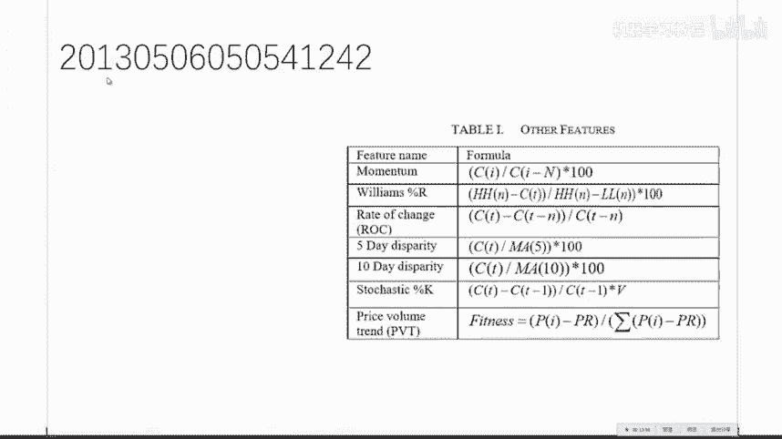

他这个用了就是用了一个这个叫啊。

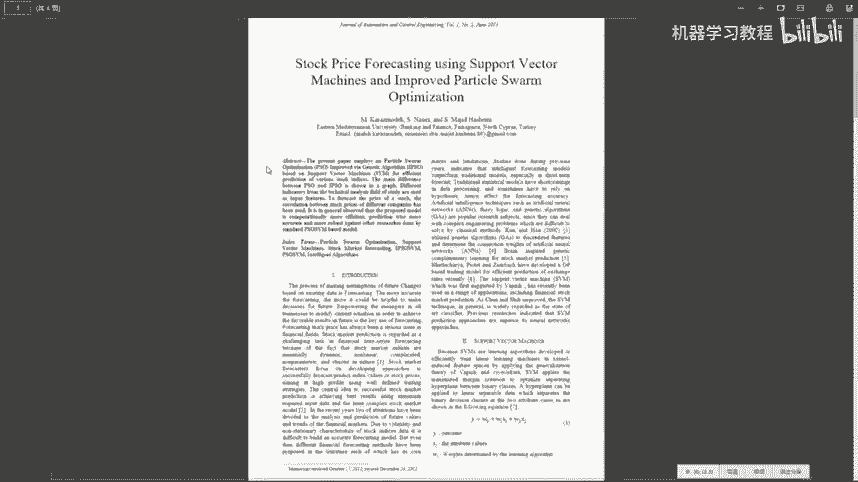

好吧。用了个。SVM加这个粒子滤波啊，这个是非常常见的。绿啊。这个是非常常见的一种基于专算法的这个啊滤波方式啊，它对于时间序列尤其有用啊。他对于持续数据在很多情况下是比这个卡曼滤波要好的。

当然这篇文章的呃这个弱点就是还是他们后面的这些回测跟这个策略的评估做的一塌糊涂啊，但是他前面这个建模你是可以就是说啊因为在市面上这种论文呃是成千上万的，你呃你要干的事情就是啊看看它的闪光点。

然后觉得不行的地方，你就跳过去就就行了。那么这个你就可以知道啊，我用SSVM加例子绿波啊，大致大概是一个什么级别的事情，前提你还得假设这个论文没有造假。不过一般来说啊。在CS领域倒倒还好倒还你不用太。

反正你就大致心里清楚，有人大概这么做了。然后他的这个方法做的还可以，比这个比这个benchmark大致能高个啊7到8个点。高了7%到8%个点。🤧那么呃它的这个features啊，你你就可以看到啊。

其实很多东西呃，尤其是这种在网上公开出来的一些东西，你比较重要的是一个是看看它的模型。另外一个比较重要，就是看看他都选了哪些features，看看自己。你自己的这个啊特征提取库里头有没有实现？

如果没有实现的话，你研究一下值不值得去实现啊。不过大部分来说，对于这些公开的啊公开的数据来说，他们的这些feature都没有什么起因技巧，都是啊比较中规中矩的。也就是说你应该啊嗯。

至少你应该很快的基于你的那些特征提取的方法，实现一个新的出来。比如说做一些组合之类的。这个是这篇文章。差不多，如果你们自己回去看的话，这个大概用个呃。15分钟左右顶多了，就是你在一篇。

普通的文章上花费的时间顶多不要超过。不要超过这个时间，你要看的再细，就说明啊。你的方法出了问题。除非你是打算真的觉得这这个论文你要打算重现，或者说要研究它的很多细节。对于这种啊。

几页纸的这种的论问你就不用看的那么细了。顶多的。嗯。顶多的看一下这个。他用了一些什么模型啊，解决了一个什么问题啊，你看因为这种就是说基于持续的传统的。这个历史数据纯粹根据价格信息来做的这个事情呢。

就他再怎么地也跳不出这个圈啊，就是嗯。如果他没有再用一些其他外部的一些信息的话啊，什么样的论文值得多看一看。当他的这个特征是，比如说他的这个特征选的比较齐全的时候，就是它有基本面的，有这个技术指标的啊。

什么都有的哎那那这个论文你值得多看一下。因为啊它里头一定一定会有一些其他的细节啊，是需要考虑的。那么如果是就这种啊特征题的大陆货，它往上面再加你。有的叫啊no free lunch serum。

就是说你不会啊在同样的特征下，你不会明显的比别人强特别多。所以。基本上。大差不差都是那么一个死德行啊，到最后其实归根结底还是第一啊，你的代码有没有bug。第二呢你这个模型跑的是。是否能吃进去比较大的树？

就是说比如说你用SAM或者你撑死也就那几万个点。那么你其实你还不如啊你用个几百万个点，你用一个线性模型啊，就是说啊其实到最后拼的还是这些个玩意儿，或者说你用GPU走了一个深度学习。

并不是说深度学习有多牛，而是因为深度学习，它吃进去的数据量比较大。当数据量比较大的时候，各种奇奇怪怪的一些现象，它都能被detect到。所以说不管是你SVM加了个滤子滤波呀，还是个随机森林。

加了一个卡曼滤波呀，还是直接上了1个XGboos呀，还是什么。其实这些东西嗯一点新意都没有，你只你就是就只不过是一个非常嗯白开水一样的实验啊。这个没有什么没没有什么值得值得你去再耗费精力的。

因为这课大家已经听到现在了嗯。嗯，对这些东西不会感到很神奇。当然如果有一些文章写的是啊根据十几年的这个经验啊，当他这样的时候啊，再根据一些。什么五行八卦呀，什么周易啊什么，这个你们就啊尽量的不要去看了。

就啊因个这个毕竟是咱们是要有一点这个呃有一点底线啊，就是毕毕竟是搞量化的，你就尤其是要搞这个大数据时代下的这个量化的，你在在在在搞这些个嗯那什么就是。周易呀什么的，这个这个就不好了啊，大家不要开倒车啊。

不仅不具有重复性，它跟现代的科学思想是完全背道而驰的他。没有嗯。嗯，他没有任何嗯。就是他他从方法论上讲是完全站不住脚的。你你没有任何理由去相信他。就是。对。因为量化的本质是什么？

量化的本质就是请你给我一个能。可推理可推理演绎的一个策略。就是说到底是买你能告诉我基于什么样的假设在多大的信心内我能买。就是说你做决策是要求你的决策行为是被啊假设跟公式和定理所约束的。而在这种情况下。

人们认为如果这样做的话，从长远的角度来看，它是比较理性跟合理的。如果你相信这一点的话呢，别人告诉你，今天扔了个鞋，协冲上就是买斜冲下就是卖啊，我扔了时。扔了十年都挣啊。

那么你如果仅仅基于这个就要相信一个别人的话的话，那么这个事情就跟这个量化的核心假设是背道而驰的。所以嗯。也是正是因为基于这一点，我个人不是我个人不是很嗯推崇一些太过琴技巧的技术分析嗯。嗯。

就是说啊也许你啊挣了，但是是这是因为你的一个运气的问题，或者说因为市场的问题，就是在这个市场下你怎么拧。怎么地，你也证。或者说你没有有效的一个把握自己风控，就是有有效的一个这个风控的策略。

让你赔的时候不会赔那么惨啊。那么呃这些事就是说啊大家一定要建立一个。良好的一个啊呃。有有有个科学思维的一个方法吧，嗯，这样说会好一点。我们再看再看一个。啊，这个这个博客写的蛮好啊，就是说他是介绍自己。

就是这个是主要是给这个嗯不在机构啊想自己干的一个。嗯。同学们的这个。一个例子就是他是他介绍了一下自己嗯，在这个他就是相当于做做这个嗯嗯嗯。零售交易员radio trader。就是说嗯。嗯。高级散户啊。

他自己做的这个一个呃这个呃期货的自动交易系统呢，挣的还不错。那么主要的他的总结的这个呃原因就是呃。自自己的系统要有一定的鲁莽性，然后在这个自己的系统上尝试各种各样的模型啊，是稳赚不赔的一个事情。

这个文章我建议大家可以看一下。再看啊好。O。来，咱们看看啊。看看有不好的例子啊。ok给嗯，我我就现在咱们就上去看一下。上看一下他这个。嗯。对，这个例子就是某啊。把这名给人摘了吧。好啊。啊，好，就是说呃。

这个。现在的网上它有非常多的这种啊做量化的一些呃交易的一些呃帖子。不知道是因为个人的嗯对于策略的保保密因素的这个考虑呢，还是因为呃自身的这个啊水平有限啊。发了很多帖子呢给网上的这个量化这个社区。

当然是对对呃呃他好的方面是促进了交流，大家一块来聊一聊这个事情。但是呃就是我今天早上啊给大家截的几个屏啊，我就是上来看了看逛逛了一圈，发现大量充斥的是啊这种样子的东西。

那么我是希望咱们的学员呢不要受他们的这个影响，就是不要看了之后啊，就是你现在的水平肯定是要比呃发帖的这些人的平均水平要高很多的。那么嗯。可以跟他们呃积极的交流，然后呃呃批评指正吧啊。

那么当然呃别人好的地方呢也可以啊学习。比如说没事看看他们的这些策略的代码，分析一下他们的这个编程的这个这个风格啊等等的，这些是啊蛮好的事情。但是从他们的这个建模方法来看呢啊很明显会啊有一些错误啊。

你们现在应该已经有能力啊发现了。然后如果你们自己要写的话呢，啊一定啊我相信水平会比呃我举的这几个。呃，例子要高的啊，那么比如说这个吧，他是这个同学呢，他用的是这个SVR，就是SVM的这个回归版本啊。

他其实是1个SVM预测这个股票开盘价啊，然后他就说了一下。啊，他就是嗯。OK那就说了一下这个呃呃用前天的数据。预测啊当天的他只是往前看一天，刚开始啊，这明显不对啊，然后他就往前看这个N减2天啊。

然后来预测这个股市的这个开盘价啊。然后但是啊他用的这个。他用的这个feature呢，就这么简单的这么几个，也没有做什么规化，然后就跑了跑，跑了跑之后，好像在哪说到了一个。啊。我看看。啊。

他这个性能表现比这个比这个大盘灯稍微好一点，大盘能稍微好一点。但是有很多的问题。就是首先他做这个嗯。其实问题挺多的嗯，大家先说说几个吧，你们你们现在发现这个问题在哪儿？一个feature非常需要规一化。

规划的原原因就是在于你都给它压压缩到了一个就是说嗯对于一个feature的规一化的原因是当他看到一个比较异类的一个数据的时候，比如说你一直看到的是啊。98到1110，然后突然看到个300的时候。

这个模型的性能就不会很好了。但是你如果规划到一个比较小的区间的时候，它这个scale它的这个波动会比较小。所以它一它比如说在0。2到0。6，它表现不错，突然来个0。7啊，它表现也还也会还可以。

就是说规划是任何时间，任何维度都应该干的一个事情。放大点啊，在这个链接你们看哦操。现在没有PPT。啊对。好。首先就是说它的这个数据啊数据量比较小啊，这是第一个啊。第二个呢就是说他用了SVR。

他没有仔细的这个调参啊，当然这些都是小事。最大的问题就是啊如果要用SVR的话，最好要用这个dtaY，就是说你的这个呃priice的 differencefference，而不要直接预测这个这个这个呃。

开盘的这个价格。同时呢你的这个呃。只看往前前面一天的这个啊这这个数据没有加入一些嗯。相关的技术指标的话，那么这个是一个肯定不会很好的一个模型。然后当你看到这儿的时候，它底下不管这个性能有多好。

你就不用看了，那基本上都是假阳性啊。如果好的话，就都是假阳性了。然后这个训练的回归模型，他直接用了一个默认的参数啊，什么都没变啊。也就也就也也就出去了，那么这种事情。就是这种事情。

你只能在测试你的程序能跑通的这么一一个任务上。就是你你你写完了所有东西。因为你要做cose validation的时候是蛮耗时的啊，你就先把默认模型啊，默认参数先撂进去，看你程序啊，别别别别。

就是出出bug啊啊。嗯，好，那么这个是一个。你们一定不能呃写出这种质量的文章的一个例子啊，当然你也可以大概你放点烟雾弹啊，想想害害别人。不过我个人强烈反对这种，如果是憋着劲想使坏的。

而且我相信肯定这个同学他不是出于这个目的啊，再看一个啊。这个会稍微好一点的一个例子，稍微好一点，待会儿我还有，我还会给你再好一点的。啊，我不认为是这样啊。当然你自己就是咱们的学生在写的时候。

你肯定啊你要考虑的要多一点啊，什么说什么不说啊，这个你自己想好啊啊，待会儿我会说到怎么样建立你个人的品牌。其实有的时候你说其实没关系啊，这个是。关系不大的一个事情啊。啊，这个是呃也是一个基于SVM的啊。

这个呃呃评论稍微多一点啊，地址啊地址我发给大家。是。看这个。啊。给大家呃3分钟的时间先看一下吧，看完之后嗯。你们你你们提提呃，你你你对你们提提意见。啊。3分钟足够了啊，他这个没有什么，就几句话啊。啊。

完全不是说这个平台不好啊，这个平台蛮好，这这些个平台我感觉都挺好都挺好啊，就是你们。嗯。就是啊只不过这个我们是在说他这个写。写的这个这个东西啊，这这么做是哪里做的不对了啊，就是关于这个量化的这个方式。

啊，有的有的狂topian啊，这个是。呃，他们的祖宗啊。而狂透片里头的这个例子其实质量要稍微高一点，而且狂透片的这个架构也合理一点。同时狂透片的这个教程写的也好一点。就相当于嗯。啊。

facebook跟人人网的区别吧，目前这个目前的这些量化的这个平台的质量。嗯。そ这。这个网站。是。我发一下。对啊，交叉验证是一个啊，大家再提啊再提一个啊。啊，狂头片没有A股的数嗯，哎哎等等我想想。

狂头片好像狂头片是雅虎金融的，都有啊。这个你得查一下。对。再提一个啊。所以他这个策略就很。哦。再提一个啊。大家说的很对，不能随意打乱啊。还有这个买入股票的资金是剩余cash的5分之1啊。

这个事情呃如果呃嗯。昨天的课大家听明白了的话，一个有效的资产配置的方案能够让你的收益嗯有的时候会提升3到5倍都不止。然后嗯。还有一个事情是是这个事情。提了46个指标啊，这件事情蛮好啊，嗯不容易啊。

那么如果3030天后上涨15%或者以上则为一，那么在这种情况下，大家的直觉会。会知道会有一个什么样的问题呢？你的训练机。对嗯，我知道大家想说的。我已经明白大家想说的事情了，是这样。如果是这样的话。

你的这个分类的类别会极端的不平衡。那么如果在这种情况下，你要用SVM的话，你要干的第一件事就是比如说。房老师已经不。不在了，然后嗯你自己在做。

那么你要干的第一件事是你就需要查一下怎么样的利用SVM处理类别不平衡的问题。因为这个是需要调整呃，就是要有额外的一个处理，对数据重新加权再做的。对。呃，而他的这个他的这个代码的话。早上看了一下。

应该是就是直接嗯。就就就直就直接用了。那么这样做是肯定。肯定不合理了啊。但是也还大致做的嗯。先不说这个代码的可读性啊，大致做的还可以知道数据的一些清洗的一些常见的步骤啊，如果有难的话。

怎么办啊等等的一些事情啊，他用了一个这个SSVM的这个线性盒，然后C是1。0，就是那么这个情况它。很不适合处理啊类别不平衡的一个数据。同时他又把数据进行了一个打散。那么在这这几种情况下呢嗯。

跑出来的这个结果啊，不具备。这个所谓的这个这个credit。嗯，他的这个就是这个的这个credit就会就会打折。所以说如果大家自己要做的话，嗯，这个这个问题其实是可以做的很好的嗯。还有问题没有？啊。

数据不平衡有非常多的处理的方法。我在课上说过一些啊，一个其实就是对数据加权啊，呃这是往上提。另外一个是可以把你就你不平衡，你给它造成平衡。就比如说你百分之。你砍掉一些嗯，比如说零一分类的话，零类特别多。

你砍掉一些零类啊，那么这个是一个很不好的一个方法，但是是一个非常直接的一个方法。另外一个呢就是调整阈值。比如说。比如说对于。一个老jasson回归。我们当时预测的时候。大于0。5，我预测为一类，小于0。

5，预测为零类，对不对？那么如果数据不平衡，我把这个阈值调高，我大于0。7的时候，我才预测为一类。这样的话一下子就把这个数据就是这个是最嗯所谓的quiick and dirty way of doing it。

就是说非常的。非常的有效跟简单的一种处理方法，就是说我提升一些决决策边界的阈值啊。如果一类特别少的话，我要求呢特别大的。都可以都可以，有专门的大家，你嗯稍微你。呃，你编一下或者百度一下，或者谷歌一下。

你你查这个经器学习类别不平衡，有专门的一张嗯，就来解决这个问题。因为这个问题是一个非常重要的一个问题。啊，反复往模型未重复数据是这样，你反复未重复数据其实还不如加权。同时为了重复数据，它不会嗯。就是说。

你们回去看我给你们讲这个adada boost的那一节怎么样加权。其实就是说啊反复问数据就是想加权，但但是你还不如把你的los函数啊改一下。嗯，都应该都应该啊，如果写呃那么这个就是模型的超参数了。

你需要嗯。需要调啊。就是怎么选这个0。8还是0。7，这个是一个你的一个超参数的一个问题。还有一个嗯就是说嗯如果要假阴性假阴性的话，一定要画的一个东西是之前说的这个rock就是ROC啊。这个是。

大家一定要熟练掌握的。呃，一个技巧，一个分析模型性能的一个一个方式。对。他用5分之1的剩余资金的问题就在于他没有利用到金融学的领域知识来做这个啊投资组合的这个这个管理啊。嗯，比较简单的一个方式。

当然作为一个帖子，他他没有义务把所有东西都写了。我只不过是在分析，就是如果你要真正干这件事情的时候啊，肯定是啊不要干的这么糙啊，我并不是说这么写不好，但是。你要干的时候呢，一定别照着这样干法来干啊。

再看。这个就很好啊。链接先发给大家啊。啊，有。就是主动投资组合管理那本小红书啊，传说中的红宝书。叫做啊。他有一个中文版叫做主动。投资组合管理。然后那么我们看看这个很好的一个例子，他们是怎么玩的这个事情。

这个我也建议大家一定要好好啊，就是我也非常希望大家能写出来这样的东西。他首先他自己自己有一个这个项目的Gt，他用spark吧整个的项目啊能够以非常高的这个性能啊，呃就是相当于它给开源出来了啊。

这是第一啊。是用spark写的啊。五脏俱全的一个小系统。第二呢嗯。他有一篇专门的一个博客来详细介绍一下他的一些关键思想。但是啊他也提到了，因为park的skML里头啊有随机森林。

所以它的实现其实是呃偏重呃实现了这个啊它开源出来的是实现了这个随机森林的这个版本啊啊因为SVM你在这个分布式它的这个性能。他这个他也很难做到实时啊，要不不不。

就是说他的这个你的这个训练级的这个大小也会受到严重的一个瓶颈啊，他干的一个什么事儿呢？他干的是这个事。

大家看一下。啊，出身也还行啊，这个。Zheng。正经学校的非野鸡论文啊，只能这么说。那么。就是说他前面的介绍里这篇论文，我是希望大家细细看一遍的，就是他前面它这个主要是嗯基于嗯比较高频的数据。

就是说相当于他用的是市场深度的这个数据就有他把这个买一卖一买二卖二买三卖三的这个数据啊给放进去了啊，当然呃这个是非常有用的。

你仅仅通过这个撮合价来判断这个市呃接下来这个价格的走动肯定不如这个呃把市场深度的信息放进去来的要准。因为啊这个是显而易见的一个事情那么。他前面的因为这个是给一些金融学的人看，他前面还要介绍一下SVM啊。

他用了这么多的篇幅介绍。那么这个其实就是你。对于如果你会SAM人的，你这块，你就什么都不用看，全跳过去。然后主要看一下。

你看他用了一个这个alor book跟这个message book这两个呃深度的这个信息。然后啊。提取了一些啊，这个是整个的他它的这个流流程啊，能够进行这个自动交易。同时他的这个策略也选了。嗯。

并不外行啊啊它的这个它的这个它这个特征啊特征在这啊。他的他这个t是多少，我都忘了。

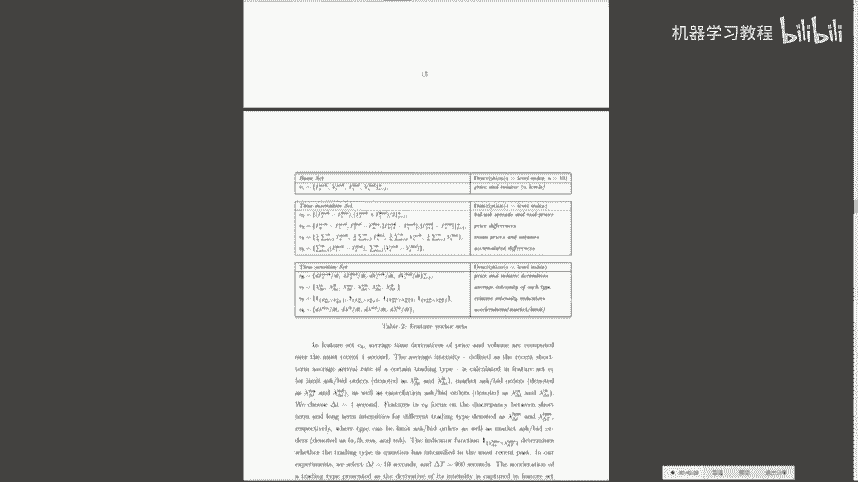

就是他选出来的所有的这个特征。同时还有原因，一个是啊跟时间对于时间不是很敏感的一组，还有一组是对时间比较敏感的一组，以及最基本的这个深度信息啊，呃蛮好呃这个应该作为一个大家呃值得去学习参考那个流程。

那么这篇文章里头啊，基本没有呃就是说呃藏着掖着点什么，就是他做的事情，他都以以一个比较清晰的方式介绍出来了。那么这个是值得你去看看的论文之一吧，就是。就是大概的吧。而我们这堂呃这个学期学完的课啊。

他的这里头的每一个环节你都可以明白。对，所以这个这篇文章啊值得啊就相当于一个比较好的一个案例啊，比那个就是他的这篇博客呢比那个那个。一些比较随意的一些帖子，要啊更有营养。但是其实你看完这个之后。

你也立马就知道，其实呃基于时间呢也大差不差，基本上都是。都是这德行了啊，然后顶多你要再加的就是嗯。再加进去的话呢，就是加加一点不不同的模型，做短三，然后再把你的这个风控跟这个策略写进去。

基本上就就起活了。A。这个是希望大家回去。啊，看一看的一个东西嗯，有问题没有？不会导致模模型复杂。加进去，只要你的模型能够处理这个信息多一点没没有什么关系。交易价格。

这个因为这个权重是用机器学习学出来的权重，就是说呃并不是你人为定的。哦。好的好的论文。第一啊从顶会上找，就是首先会议的质量越高，他的论文的质量就会越高嗯。嗯。去年在机器学习顶会里头跟金融有关的。

大概有4篇文章左右吧，我回头都会发给大家。呃。我个人比较相信。这个应该不会赔吧。狂头片不会，这帖子一般来说就是说是你休闲用的，就是嗯相当于啊简陋，就是你去。文玩市场看一看，今天基本上满眼方去。

基本上都是质量不高的。但是偶尔会让你觉得哎这点我之前还没想过，这个是你要从广头片。学到的唯一的一个知识。OK哪些模型可以吃大量数据，吃重量。是大量数据的模型。第一啊第一类是简单的模型，就是线性模型。

比如说loggistic regression，因为它。只需要一个点乘在。做E的这个N次方就行，这个计算量其实很小，而它能吃进去。嗯，非常大的数据，它在海量规模下的呃数据集上，它的性能已经非常好了。

是因为它它并不是靠模型干上去的，它是靠大量的数据干干上去的这是第一类的吃数据的方法。第二类吃数据的方法是你的模型的复杂度可以高。但是呢你一定要非常有效的并行的训练。

而神经网络是一个非常合适的一个天然的一个能够并行的一个一个训练的方法。这也是深度学习。目前一统天下的原因是我数据又大，我又想要又想要模型复杂度高。目前你能干的就是神经网络，还能干的是一个事是什么呢？

是这个随意森林，因为随意森林也是一个天然的可并行的一个东西。当你可并行的时候，你就能吃进去比较大大规模的一个一个数据了。那么是重量的数据的话呢，就是普通的传统的这些呃能够拿来用模型以SVM为代表。

当然还有一些其他的。这个基于嗯基于贝尔斯方法和概率图模型的一些方法，他们吃进去的数据也很难大掉。那么他其实它的这个数据体量也在也在中度规模。密万嗰点啊。算法进展哪里可以了解？

OK算法进展是第一是跟踪一些顶会。那么这个对大家来说是有点难有点难。那么我建议大家看这个有。这么一个地方叫做。新浪微博。爱生活，这个是北邮的一个老师啊。他是一个数据搜集狂。

然后如果你有twitter的话。一个这个machine learning啊，goot就是一个转发机器人啊。那么如果在国内，我你们就看这个这个就行，就是爱可爱生活。

他每天会会分会转发大量的跟机器学习有关的方方面面。这个这个老师的内容每天都看过呃。这个老师的啊我会断句了，这个老师的内容每天都看不过来，其实你是能看过来的，他的他的东西我基本上每天全看了。呃。

而且大概花耗时在十几分钟左右吧，就是你每天起来之后呢，你就要把他的东西都浏览一遍。因为它已经非常人性化。对，是新浪微博。他已经非常人性化的，就是说啊他把一篇论文的abstract跟这个模型。

还有这个跑的这个实验结果，以截图的方式出来了。那么当你有了自己的体育结构之后呢，你要看的其实最重要的就是看他这个abstract。看他这个摘要，看摘要看什么，要看他提他解决了一个什么问题。

提出问题比解决问题要重要的多重要。他解决了一个什么样的问题？啊，那么。比如说这篇文章是提出一种更有效的。这个是神经网络的训练方法。那么然后他怎么解决的呢？

他他就说啊通过啊啊固定一层的这个权重啊来训练这一层，然后迭代的来啊。然后呢，同时这是解决的方法记录细节，就是具体怎么固定的。然后以及一些证明，为什么这个有效和一些实验结果，就是我跑出来之后，我这么搞。

确实loss一直在减效。那么我们要看的其实一第一看问题，记住有这么一个问题就行啊。以后你就知道啊，如果遇到这个问题，前人有人干过，你再回过头来找，就相当于给你自己建立一个这个索引库。

一个你一定要给自己建立一个非常大的一个索引知识索引库，就是你自己脑子里的。这样的话，你在日常使用中，你遇到这个问题，你就想啊，我之前在哪看过人，你就能找。那么这样的话呢就会让你非常有效。

而不需要把它所转发的所有玩意儿全看了。但是他有时候也转发一些比较好的一些经验之谈的一些博客啊的文章啊，这个我也是希望大家啊至至少有所关注。这个是目前我能认为最适合大家的。

同时还有一个叫做啊好东西传传传送门，这这是一个网站，你能每天收到一个邮件，它来给你推送一些他从。呃，微博上摘出来的每日推荐大概有10条左右啊就好。东西传送门。啊，记不住你至少最好要记住有一个什么样。

解决了一个什么样的问题。因为当如果你的这个啊。积器学习的这个嗯。这个知识比较齐全之后，解决了一个什么问题，这个东西你很难忘。但是怎么解决的，你很容易就忘了啊。这个微博是啊非常值得大家推荐的每日。嗯。

更新你自己的知识的这么一个。一个东西。嗯。有什么问题吗？好，那么我们呃现在休呃休息3分钟，然后我们接接。就是开始这个下半场啊。有没有好的索引？啊，好的资资料索引思路啊。首先呃好记性不如烂笔头。

自己比如说你用这个嗯ever note这个。啊，叫什么？ever note它中文叫什么？印象笔记。对你用这个印象笔记做一些这个分门别类的一些一些记录。啊，这个是第一。第二的话。

我觉得还是建立一个合适的这个学习的这个方法。然后就是我最希望大家就是至少他的60%的文章就是这个老师他拿出来的这个这个东西啊，你要做到看懂这个问题是个什么，就明白他他他的问题是什么。

就他解决了一个什么样的一个一个一个一个一个这个问题，这个problem。就是啊在没有学习机忆学习这个之前，他提了个问题，你也许都看不明白他。这问题是什么？那么怎么解决的是完全完全不要求大家。去掌握的。

那么也不是说完全不要就是说呃不强求大家掌握。那么怎么样掌握呃怎么样解决的？因为它这个是包含了机器学习的方方面面，你肯定不会啊尤其是作为一个你不是呃专门要要要要做机器学习的。

你肯定不需要完全不需要知道他是怎么解决的，你只需要记住。什么人能够解决什么样的问题啊啊，这类人这这这帮搞计算机的，他们能把这事干。你记住这点，当你积累到一定量的时候，你就知道在解决什么样的问题。

至少找谁问，或者从哪看。那么这个知识就是说其实知识的这个搜集跟。这个能力是比你解决，尤其是在这个目前团队合作的这个呃大背景下，这个能力是最重要。就是你知道从哪儿去从哪去寻求帮助。

这一点是比怎么解决这个问题更重要。因为嗯。你怎么地都能把这问题解决了。但是你要知道的是，从找对的人问对的问题，这个这个能力是比解决一个问题要更加重要啊的一个事情。对。

那个一天能写几篇的是我跟大家分享的前面的那些。而这个嗯他呃非常适合初学者来学习这种结构啊，就是嗯我前面说的你看。这种玩意儿你这个玩意儿你闭着眼睛一天就能写很多啊。啊。这个东西呢你你你你用左手。

你一天也能写很多啊。但是呢这个就是说这个就相当于我的意思就是说这个就相当于它g并不是说我是说这个东西有多棒，而这个是相当于就是这一类文章中啊做的呃最详尽的一个啊。

比其他的跟其他的呃方法比它的这个呃缺点是。啊，可以说是最少的，而且也是比较呃非常适呃非常适合一个啊基于价格信息跟市场真度的策略研究的一个样板文章。呃，有我回头会给大家呃几个PDF啊。而他呃而这篇文章又。

嗯。蛮不错的公布了它的一些原码。所以说一天写几篇，我觉得比较难这个。啊。比较难，大概至少你得。我觉得得。等一周吧。当然如果你要自己要做呃一些量化的实实践工作的话，呃，它这个框架是这个框架是正确的。

你可以基于这这个框架来做一些你自己想做的一些实验。就是说你你你你的。你的这些特征可以把一些非呃价格跟市场深度的一些指标加进去。这个是我一再强调的，就是嗯。有些情绪指标跟一些嗯。就是啊。对。

就是一些嗯市场情绪的指标跟嗯主要是NLP那边的啊一些东西和一再加上一些这个啊基本面的这个数据啊。这两个指标加进去的话嗯。性能会更好。然后另外一条路就是你可以。另外一条路就是你可以跟这个。嗯。就是说你。

你可以跟这个金融的。呃，你可以再再把这个。这个任务做的更偏呃金融口，然后把这个贝S思优化的方法加进去，会提高你风控的。这个就是说会会让你的风控更加容易。因为任何贝S方法。

它可以给你加上一个每一个点的这个后延概率，整个一个diisttribution会给你。这样的话，你在做你这个风控计算的时候呢，会更加方便。嗯。当然这个就是啊如果你知道啊。听到了就就明白了。如果听不懂。

没没关系，不要着急啊，你可以先把嗯一些啊非结构化的一些数据啊考虑进去，对模型肯定是有帮助的。舆情分析跟事件推进值得看的东西，我觉得就是啊一些比较好的自然语言处理的课程都可以。嗯。呃，大家还有问题没有？

没问题，那么接下来说几个嗯，对于嗯。嗯，就是啊大家嗯反映呃。就是。有些基础知识需要补的，因为嗯。这个主要是对于一些需要补基础知识的同学，我给大家推荐几门课啊。稍等一下。哎，这门课是嗯。

我能呃在网上给大家找到的一个非常好的一个课，他的官网官网在这儿就是耶鲁做的一个公开课。官网在这儿，这个里头有它相关的PPT。跟建议的这个reading list。如果你要是觉得嗯。就是想要点这个。

中文的翻译的话，直接上网易公开课这个链接里头，他只但是他只是把视频给你做了一下。这课。嗯，如果你听完的话，你会。就是如果你没听过，就是你没有接受过这方面的啊教育的话，这文课对你的影响会是。啊。

极其深远的。当然如果你已经。学过了相关知识的话呢，呃你从他的这个呃就是说你就相当于从嗯。一个比较正确的一个呃。正确的一个思考方式来看待问题啊，就是你受受益会会有，但不会特别大。但是不管是学过还是没学过。

如果你没看过这个课的话，我依然强烈推荐啊。无论如何要看一下啊，讲的是很好的。嗯。我不是很确定啊，有可能是有的。嗯，但是呃因为他这相当于这个相当于一个镇校名课了。那么每个学校会有一些镇校名课，我恰巧还都。

嗯，对，就是我待会跟大家慢慢说吧。呃，这个是你能够最快速的嗯。获得。因为呃考试我不知道是不是他这个现在是如果他没有就是说他没有开放的时候，你是没法看的。就是说他课程是比如说9月到11月开放。

在非开放期间，你不能看。那么我。今天没有选考试院上的课，就是怕大家。比如今天晚上回去要看，然后回来找我说冯老师这课没开，所以我今天找的都是你随时能看的课。而且另外就是考C院上的课。

它有一个问题就在于它是极端缩水的。而这个课呢就是说尤其是比如说安住印的机器学习啊，他这个课堂实录版，就是他在呃斯坦福大学教授里的那个呃不是教室里的那个实录版跟这个考C院上放出来的这两个基本上就是嗯。

你可以看成两门完全不一样的课了。所以嗯尽量的看这个底下坐着人，自己学校学生的这个课，他东西会多一点。好，这个是一个大家要看啊。啊，这个是概率啊，这个这个我强烈推荐啊。就这个啊如因为嗯。

因为我过一会儿会收到面试啊。这课是嗯。阿外那非常著名的呃呃呃。一个数学家啊。T什么嗯，应该是嗯应该是一个苏联的一个人，但是他的LA应该是法国的一个人他讲的特别好。嗯，网易公开课上应该也有就是呃。

就是叫什么概率。就是。概概概什么写概率。就是呃嗯。嗯。有可能有有有可能，但是大家一定要啊找这个人讲的啊，因为同样的这种基础知识，不同的人能给你讲出完全不一样的东西嗯。并不是说这个背后的知识有多重要。

而是尤其是数学课，他会教给你一个怎么样思考问题的方式。嗯，因为嗯。数学是嗯。这么说吧，呃，真正的教育。我非常赞同这句话，他他的意思就是说真正的教育是你从学校学完之后忘掉的。之后剩下的那些东西。

而一个好的具体的推导跟公式全忘了。之后，你留下来的数学修养，这个是最重要的啊一个东西。就是说比如说我已经忘了这个泰勒展开了，但是呢就是我比如说已经把这个危积分钟的很多的什么泰勒展开什么都忘了。

但是你仍然能留下一种处理啊。建模的时候，你知道啊要。要通过求导的方式啊来干一些事情。就是说这些基本的这个这个数学直觉跟跟数学修养，这个是啊最重要的。因为具体的这个公式你求一个矩阵的行列式啊。

你忘了没关系，有网络，你查一查就知道。但是你知道啊这个问题我要用求行列式的方法来干。而这个这个修养是最重要的。而一个数学的好的教授。他会教给你的全是这种东西，就是而一个烂的教授，他就说啊。

今天我们来学这个求行列式啊，这么求这么求这么求啊，再做上十道。你是只会在考试中用到的这么难的这些个习题，这个是烂的教授，就是他告诉你怎么做。而好的教授会告诉你为什么要这么做和什么情况下你要这么做。

我再强调一遍，好的数学的课程是会教给你在什么情况下用什么方法。就是建模的能力，而坏的教数学教授呢只会告诉你。有了这个问题，我怎么解决？有这个问题我怎么解决，这个是不好的。因为这个问题你这么解决。

你学会了，你这问题变一下，你你你你用哪个工具来解决，而这个是很多教授没有交给你的一个东西。所以说大家一定要啊。不管是你用EDX还是这个网易公开课，还是哪，你要找这个老老头讲的数学啊呃的概率。

不要听其他人的。好，然后啊。这个好，这个是多变量微积分啊，这个大家一请请当美剧看啊。因为我相信大家这个多变量微微积分都都学的差不多了嗯。这个是一个法法国人啊，讲的非常好啊，就是说嗯不紧不慢的。

就是什么慢条斯理的就是把。你需要掌握的。跟微基分有关的数学知识基本上在这就够了。呃，这个是在这个链接是啊啊，我给你们找的是这个带中文字幕的。我今天啊我今天给你们说的所有课程都有中文字幕。因为嗯。

要考虑到有些同学的这个。呃，这个因素啊，所以说我推荐的课都不是为了装逼，我都是非常。诚恳的给大家推荐的一些课程。啊，多变量微基分，而且要这个链接的。好。啊。

这个也是因为呃这这个是这个是MIT的前任数学教授讲的，特别好啊，讲的是微分方程。虽然也许你这辈子用不到微分方程，因为呃其实你会用到。因为在金融中偏微分方程是一个极其常见的一个事情。

但是呢最重要的还是我强调过了。你的数学修养，而微N方程是一个嗯。你学完微积分之后，能够立竿见影，知道微积分到底有什么样的应用的一个一个地方，就培养了你的数学建模的能力。也许你。永远用不到这个东西。

微积分呃，微分方程是肯定会用到。就是说呃你培养的更多的是一个遇到一个新问题怎么解决的一个方式。也许你在另外的问题中，他没有用到微N方程，但是你用到的微分方程中啊，思考问题的方式。而这种能力是最值钱的。

而这种能力呢也是别人任何人都拿不走的。就是说你哪怕你忘了所有细节，但是你人具备了啊数学建模的整个的这个。这个这个框架的基本素养啊，你在解决非数学问题的时候。都会很有帮助，会让你变得更聪明。

所以说啊也推荐大家啊看一下，一点也不难。他不他我今天推荐的所有课程的先修知识差不多就是。高中数学就能看吗，我觉得。好，我们再看。啊，这个是嗯。这个是给这个。给这个编程还不是特别好的，就是编程有困难的。

因为这个是最最基本的一门课就是。啊。

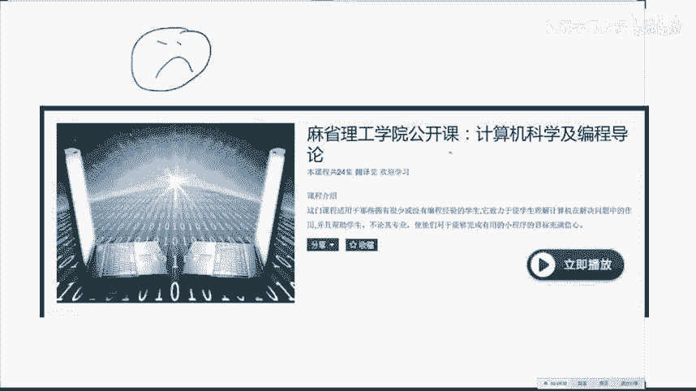

6。001啊，他以前就是他以前是用这个用lisp讲的，讲了很多年啊，然后后来就改为了用python，就是相当于他们大学新生的第一门编程课啊，但是讲的还蛮不错的啊。这个也是我当年的入门学习的一个课程。

N年前了，但是他这个科科序号一直没变。嗯。如果你觉得你的编程还是有问题的话，当然我非常不希望到第十课了啊，大家还需要学这门课程。哦。但是也不排除有的同学实在跟不上了。哎呀，不行不行，实在是。不行的话。

你用这个它是讲用python来讲。来讲这个跟编这纯马龙的应该是介绍给你怎么样的一个computational thinking。就是说你怎么样的用计算机科学的方式来看待问题。因为如果你没有学过编程的话。

你你你大概这个比如说动态规划呀，这个这个递归呀和数据结构的重要性，你大概是很难理解到的。你就说这玩意儿不就存进就行了吗？但是一个。呃。

合理的数据结构会让你的时间复杂度跟空间复杂度等等的这些概念是很多没有学过计算机的人很难建立的。比如说你跟呃如果只只做纯数学的这帮人跟他们聊的时候，他们对这个时间复杂度，空间复杂度这个事情非常的不敏感。

就他们遇到一个问题，他们哎这个不就做了吗？但是他们想不出来这个问题，他是。指数级别复杂度的。你你这搞数学的，你们就是。很不实际啊。啊，当然做金融的也有一样的问题，就是他对数据不敏感。

就是随时不会问自己啊，这个东西它的复杂度是多少？这个事情啊。是需要培养的。而而这门课啊比较好的培养呢怎么样想，就是所有的这这些东西都是怎么样的。就是thinking什么什么。

就是说你永远要就是说思维的方式永远比知识本身重要。你已经有了谷歌这么。美妙的一个搜索引擎，任何的知识你都是能查到的。啊，好，我知道。啊，这个是对于入门更差一点的学生，就是如果你嗯。

这门歌看着还有问题的话，你看这个哈佛的CS50啊。也是一个震校神客啊，就是。计算机的最基本的一个。一个东西。

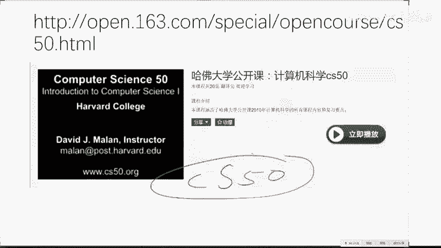

Hao。那么啊这个是对于一个比较你如果编程已经编的比较溜之后，你们我强烈推荐这门课，它是。就是说教给你了编程中怎么样的写比较高效的这个程绩啊。他讲了一些最，讲了一些python。

还讲了一些这个一些这个啊。functional programming的一些基本的一些东西，就你能写出来比较高效的跟合理的这个代码。那么你也许会说你说你我我我我一写pyython的。我学碎有毛用的。

你学碎是为了写更好的python，这个我相信大家。嗯。都能理解就是。学一个语言，你并不是要用这个语言，但是你会帮助你在其他语言的使用中啊。第二次啊。呃，思考问题的一些方式。这个是斯坦福的一门研究生课程。

是三大。啊，计算机系的三大。三大课容之一啊。啊，当然这个是。大家所有人都知道的非常重要的性应代数，这个是一定要看啊。常看诚信啊。那么啊这门课啊这门课是一定。极其重要的跟咱们金融有关的一个课程。

我把链接发出来。对。对，就是这个是呃非常好的一门课程。呃，他讲了嗯我这门课里没有讲的一些东西，但是我也讲了一些他没讲的东西。就是说呃他最好的地方是啊被强了，不会吧。这个我早上我还试了一下，是可以上去的。

这课极极端好啊，非常非常重要啊。啊，那么那么。一定要大家一定要做的是他留的这些个作业啊，非常棒的呃各种的程序的编程的一些一些东西。他他有这个他有每一每一次作业的详细的这个要求啊。嗯。

就是他的这个呃设计思路呃也蛮合理的。然后他每一年都不一样。有从啊14年、13年、12年、11年、10年。好像到11年吧，我忘了，就是说呃有前几年的每一次作业都不大一样。

然后同时他还呃呃他们他们自己还开发了一套啊非常好的一个啊量化交易的一个平台的这么一套系统，就是你直接在他那个上面用也行，我没有用用用咱们这门课没有用他的原因，就因为他们的他这个文档已经写的非常棒了。啊。

你们自学就行。我没有必要花上课的时间，用他他的这个东西啊。就是我发的这个我刚才发的这个这个链接啊。对，那么这门课是希望大家自己再再再走一遍。它里头因为他这个呃上课这个时间的，他这个时间是呃课时比较多。

所以他把一些东西讲的就又能往深入的又多讲一点嗯。尤其是大家要关注的，他对对也就是嗯他对这个一些嗯。啊。嗯，就是啊。看盘model这个就是一些比较偏金融的一些东西。他啊讲的比我讲的要多一些。

同时他对这个pandadas的这个。呃，使用啊等等一些就是python那些基础的使用的这些应该是在homework一还是这个project一里头，我都忘了。

就是说呃也是一个蛮好的一个嗯自成体系的一套啊打怪升级的方法。这个大家是回去可以看的。对，还有一些书啊。就是。嗯。这句话送给大家哈。如果你跟一个。咱群里有女性学员吗？啊，我不知道哈啊如果你回家啊。

跟一个人回家了啊，如果他们家没有书的话啊，不要啊不要这个啊不要跟他们发生什么关系啊。舒口好。书的话就是啊。这个是真的，这个我我我个人是很同意这个话的。如果你到一个人家里，他一本书都没有的话。Don't。

Don't after。有人还专门把它做做成了T恤啊，非常棒的一个治理名言啊。好，那么书的话是这样。高性能pyython，这个是呃非常适合你们想把代码写的比香港地子还快的一个一本书，很不幸。

好像没有人翻译过它，但是很好的一本书啊，我说这些书我都有，而且我都翻过在京东上你应该都能买到。同时呢跟机器学习有关的，我强烈推荐这一本，这本更好一点。这本呢是相当于是把每一个机器学习算法。

他给你手撸了一遍，他比较强调某一个算法的具体实现。而机器学习系统设计呢，它它基本上用的都是第三方的库，所以说它的代码比较简洁啊，但是他要给你讲更多的一些遇到问题，怎么样解决的一些一些一一些事情。

个人来来看这本书会比这本书稍微好一些。当然都是这些都是这个entry levelvel，就是说level。来报林的，但是啊。一一本入入入门书籍吧啊，那么然后跟金融有关的这这三本书啊都还可以。嗯。

这本书是很好，这本书也是。你就是下。大神跳大绳派的圣经啊，这个是啊量化的圣经啊，这本书是主要是呃就是把一些金融学的知识。当你上完耶鲁那门课之后，这本书你可以翻一翻。

看看他们是怎么样的用这个数据的报表的形式来给你pl一些除处图出来。而这个python金融大数据分析呢，这个我跟大家推荐过，就是说前面的这些事情你就是。

前面的这些事情你怎么样的用一个用一个python这个语言来来进行实现啊，底下这三本书啊，是我刚才说到的所谓的没用的书，就是你要学能力的一个书，它并不够他。并不会告诉你，你自己。所面临的问题怎么解决？

而是会相当于修炼内功的这三本书写的都很好啊，代码之髓啊强烈推荐呢。然后当然这个是就相当于一个python的一些非机器学习，就是一些脏货累活一些。所谓的脏活，那会儿怎么样的用程序来做啊。干脏活的书。

然后如果你这个也。看的很很困难的话，那就只好退回到这个level。负一，那么就是啊。最最基础的这个我给。很多同学推荐过的这个啊笨伴法学python，这个应该是有中中文版的。

这个应该叫笨伴法学python啊，京东上应该是有卖的。这些书京东上。都应该有卖的。啊，然后如果你想深入做一点这个。继续学习的话，这两本书比较适合你学完这本书之后，就是这两本书属于level one的书。

这个名字叫图解机忆学习，但是他一他名字很谦虚哈，这个是啊日本的山山将苏之亚米，他写的这个是日本的上届的Nps的主席啊，就是日本的机忆学习界的老大，类似于国内。哦。周志华老师的一个地位啊。啊。

写的不错啊啊他是用m labb作为语言，但是讲的还不错。但是呃。我要警告你的地方就是啊还是蛮深的，写的还是蛮不错的。

他的难度跟这个introduction to statistical learning。这个是斯坦福大学那几科们，就是他们发明了R语言啊，同时他们还。啊，是马素的发明人啊。啊，就是非常重要的。

就统一学习派的。绝对的权威人士写了一个呃初级的书，他们的一个这个书的升级版叫做element of statistical learning。这个难啊，这个是嗯每一个。PHD需要读的入门的书啊。

那这个就是。level2到level3的一个级别。所以说如果你们啊会来SK learn之后呢，最好在这两本书中挑一本，然后然后再再看这个啊。这个书要稍微深一点，这个大家啊台大的机学基识蛮不错啊。

可以看看。就是他说话有有有点容易催人入入入眠。但是啊我翻过他写的这个PPT的，内容很干货很多。一个是机学习基石，那个其实啊还好，然后还有一个叫机器学习技法，他比较多的。

强调一些呃一些一些模型的具体使用都挺好都挺好。啊，没看兴去，没兴就再看一遍吧啊。😊，因为这个东西它本身就嗯。哎，这个东西本身就就挺。😔，啊，我建议大家是什么？手上有一两个实战的项目来在看。

或者说当一个索引，这样吧，你别你也别从头看，当一个索引吧。比如说你今天突然想看一下关于这个迁移学习的知识，你就把这个图解机学习拿出来看一下那一张啊。这样好一点。好，那么现在说okK现在呃关于书的问题啊。

大家有没有问题？因为接下来啊大概会稍微拖一会儿场，跟大家说一下关于求职怎么办的一些事情。这个事情是我非常想说的。风控的书有一个呃有专门的一个。

risk呃呃呃呃呃instment and riskk management，但是哈不着急，你们先把那个红宝书看了。OK系统的扩展就你就你就扩就嗯嗯。呃。这样关于系统的扩展，嗯，大家可以嗯。

就是首首先呃。需要把这个系统跟你自己的系统进行一个集成啊，这是第一啊。第二的话呢，你基于这个你再找到一个比较合适的你自己的一个啊你要做的这个方向。然后这个是一个非常case by case的一个事情。

回溯框架怎么用啊？这个问题嗯。嗯，就是说你得先呃。你得先把框架读明白，先先先跑起来吧。好，那么我们现在看一下这个这个这个这个简历，简历现在。招顾一些人。奖励的话是这样。两个东西啊。

一个东西是你的嗯你要准备一个叫做所谓的master resume。就是说你的这个主简历。主简历是什么意思呢？就是相当于你个人的一个小型数据库。有很多列。

我给大家已经提到了这个啊在附件中有这个主简历需要需要你记录的一个点，就是这个主简历并不是给给别人看的，是你自己的关于你个人的一个。用户画像啊，你对自己的一个画像。而针对于不同的。岗位的时候。

你随时能根据你的主简历来造出来一个具有针对意义性的这个这个这个re me啊。比如说你你要今天你要申一个这个量化开发岗，明天要申一个这个量化啊这个这个研究岗。

那么这个不同的岗位之间的这个resume啊一定要不一样，这样的话才会比较有针对性。那么。平时呢一定啊每隔几个月就要对自己的这个主简历进行一次更新。就是这个是一个很重要的一个一个事情。

比如说我今天随时别人跟你说，你把简历发给我，你大概能在半小时之内啊。就能给发给发给别人。同时这个质量能呃是呃是其实是积累了你之前的很多个小时的心血的一个一个东西。那么这个是一个非常重要的一个啊。

不管你是求职期间还是在职期间，都需要更新你的。如果你不打算开公司的话啊，都都都需要更新的一个一个东西，这是第一啊。第二的话呢。第二的话呢就是说简历的这个outoutlook这个也是。嗯，大家如果。就是。

你也可以把就是。你们如果觉得嗯有问题的话。可以私信私信我，我我给你说简历中的一些问题啊，就是说一1一些简历，它这个视觉感是非常重要的，一定要在一夜之内啊。同时呢呃基本上呃长的就长的就是大差不差。

基本上都是这个样子。你们不用看具体的内容，主要要看这个它这个outlook啊，一般来说这样的简历是啊比较合适跟正常的啊。哦。这个简历的这个outlook，我下一页具体的说。

那么还有就是每个人需要有自己的一个Gt。这个其实是只要跟编程有关的东西。目前啊比较靠谱的招人都会先看这个东西，看这个东西，你你的这个Gt账号呢。有这么几点需要注意。第一，照片最好是你本人啊。

同时呢呃要呃好看一点啊，然后呢你的这个名字最好你就你就你就正儿八经起你自自己的名字就行，不要起一个呃。比较。奇怪的艺名。同时呢你要在这个里头留下你的连。联系方式跟你的微博跟你的这个呃如果有个人网站呃。

也好，就是说你所有的能够。看你其他的你的这些东西的一个一个地址。然后同时呢呃HHR现在看人第一步先看这个，看你这个活跃程度啊。每一个格代表你今天是否活跃了啊，绿色的颜色越深。

代表你这个activity越多啊，你的这个东西，所以说嗯。最好要这个玩意儿是要至少大概要提前个一年，你就要开始维护你的。比如说你要明年9月份开始找比较严肃的量化交易的这个这个岗位的话。

你从今天就需要开始准备起来了。就是比如说你对差不多你差不多提前跟大半年就要需要开始准备你自己的所有的一个一个一个一个一个outlook了。嗯，那么同时呢你要嗯。

保证自己有一些比较popular的一些这个。这个。这个东西同时最好是对一些比较重要的开源项目，你有所贡献。哪怕。我就不说一些不好的方，就是说你哪怕就是你你一定要参与进去。这点是很重要的。

然后这个是一个很不好的一个简历，涨涨的样子啊，大概我总结了这么几点啊，间距用的不好啊，太拥挤啊，不要居中，一定要这个左对齐啊。然后这个字号有些问题。

同时这个你一定要用有效的用这个 bullet point。玻璃 point比如说。我实现了一套系统，一定。如如果用这个所谓的这个这个银弹，就是这个 bulletlet。point的话呢。

简历中什么我实现了一套系统，就是实现了一套系统啊就行了，不要有主语，直接就是动词跟呃呃呃直接就是谓语跟宾语就行。越简短越好。同时呢你的所有的关于你项目的陈述，最好要有一定的数字。

就是说呃一定要量化你的一些11。一些东西就是嗯。性能提升了百分之多少，你就要把就是性能有所提升，性能有较大提升，这些都不好，最好要量化到一个具体的一个数啊。包括了就是啊。呃，项目名称标题啊。

如果有这个呃。一个Gt的地址的话，或者说呃能够嗯公开的一个地地地地址的话啊，要提供啊一些要点描述和你用到的技术和技能和呃要比较的简明扼要，这个是啊很多人的项目看上去写了。

但是看完之后呃很难得出一些呃什么结论出来，这个是不好的一件事情啊。那么啊。在面在面一11一般来说框的框的岗招一般是首先啊这个这个网深啊。网深问那些问题都是一些很。有点这个。跟这个。呃。

非专业领域的一些问题。然后是店面啊。店面一般来说会有两轮，一轮是HR问你一一轮是这个。技术员工问你，然后就是这个啊真正的这个outite interview啊。

一般HR问你的一些问题和一些呃和最后的一些老板问你的一些问问问题，有一些问题是属于非技术的问题，就是说关于技术的面试啊嗯。这个我待会儿说我我我先说一下一些非技术的一些面试，就非常没屁眼的一些问题啊。

但是又很重要。就是说作因为作为一个招聘的人来说，他他就是想了解你就是。他想了解你，他也没他也他也没有什么一个呃。合适的一个话题，他就会问你一个问你一些听上去很没屁眼的一些问题，让你回答。

通过你的回答的方式来判断你这个人怎么样啊，就是说你要呃所以说你要准备你的面试问题的时候，一定要换位思考，一定要想，如果我是对方的话，我希望听到对方是怎么样回答这个问题的。那么一般来说最常见的。呃。

我不认为有什么年龄的限制。那么一般来说呃嗯。常见的这就是这四种肯定会问到的，就是请举一个例子说明你的领导能力，或者请举一个例子说明你的团队合作能力啊，听上去很没撇眼的问题。还有一个请请举一个例子。

说明你在工作中的主动性跟你你工作的一些动机。还有请举一个例子，告诉我你解决了一个什么样的问题。嗯，还有一次就是请解决一个呃请举一个例子告诉告诉你呃，你怎么样的这个嗯。呃，遭遇了一次困难或者失败啊。

这种问题呢大家一定啊一定要有这个一定要讲一个开头中间跟结尾，一定要很清楚。同时，按照一个这个store方法，就是你要介绍你的situation，你的taskk，你的action跟reult。

同时呢同时一定要呃一般来说店面或者说这个 interview。他这个这个问题，前一问是请介绍你自己三分钟。那么我强烈建议的是你一定要有意无意的，就是你介绍你自己，你一定要非常有意无意的提到自己引着别人。

就相当于你你要给对方下套，你要提到呃就是留一些地方有意识就等着对方问，比如说你你认为自己的一些强项，你有意无意的在介绍自己的这个过程中，这三分钟环节先提到，这样的话呢，就面面试官就非常的想，哎。

他既然提到这个事，那我就多问几句。而且你。

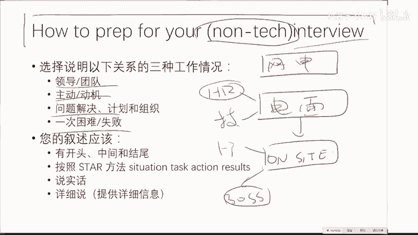

在做自我介绍中的每一句话都要做好对方会。详细问的这个准备，这个是非常重要的。而如果你有这种思维的话呢，你在做介绍你自己的时候，你就会有意识的给对方去设置一些。他有可能问的这些点。这样的话呢。

你在啊回答的时候就会非常的从容不迫，并且是有组织，有纪律的来干这件事情。这是前面的自我介绍。你自我介绍的过程中呢，其实就应该埋下一些暗线来回答这种很。啊，好。啊。必问的这些问题，就比如说嗯。呃。

你在前面自我介绍的过程中，你就会提到你曾经完成过的某一个项目。然后这样的话呢，在举这个例子的时候，你就说我刚才说到了呃，我曾经做过这个项目，你就会接着这个项目再往下说。同时比一个比较难的。

我觉得这个问题大概。很难回答，就是说请举一个例子说明你遭遇的一次失败啊。怎么回答要有技巧，你不要就就就直接说啊，我干了一个事儿给傻逼了啊，就完了。那么作为面试官来说。我听我得不到任何的营养。

我只会听到你说一次你有多傻逼的这件事情，这个是不好的。你一定要回答的是啊一个比。比较经典的一个套路就是。你遭遇了一个啊这个。这个问题啊不不一次一次困难或者失败。一般来说。

比如说你在一次工作中或者一个某一个项目中都可以。你这个困难最好是一个啊正常人都很难预测到的一个随机性的一个因素啊，比如说你干的这个事情，它体量突然一下增大了啊。

比如说你做了一个这个APP本来你是按照呃日均3万个访问流量的，突然一下突然干到了10万个一下让你的程序啊，就他的这个鲁帮性遭遇了重大的危机啊。嗯你作为这个负责人啊，你是有有有责任的啊。

同时你一定要提到的是其实你的百分之。60的时间要提你遇到这个困难之后啊，一定要提到你第一时间做了哪些的补救措施啊，你向谁求助了，你怎么样的进行了止损。最后你怎么样的把这个困难遏制住和怎么样解题的啊。

这样说的话呢，别人就会说啊，因为毕竟困难，每个人都会遇到，你怎么样面对这个困难，跟怎么样解决这个困难的啊，这个是最重要的而很多人作为面试官来说，他其实问的是他不问他不问你怎么解决，他直接他只问啊。

你遭遇的最大一次失败是什么，但是你一定要把遭遇的失败跟你怎么解决的这个失败啊，都都要答进去啊，这这个是一个比较常见的一个。一个技巧。嗯。然后对于技术性的interview嗯。

对于一个技术性的一个ininterview来说，这个嗯就比较简单了。我跟大家在这个书里头啊，当然第一是关于程呃编程的这个呃interview。那么这个有大量的这个网上有大量的各种各样的资料。

包括这个出来的这个课程，他也提供了这个程序员面试的相关的课程啊，这个我就不多说了。你们。非常多的资料你能学到。那么关于这个count的关于count重要的这个东西，我有这么几本书。这个是神书啊。

这个一般人我是肯定不会说的啊。

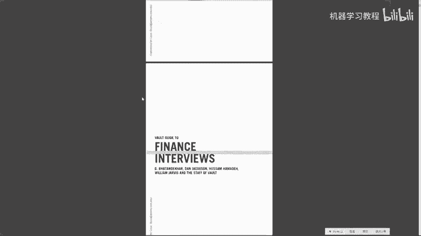

Wt。这个相当于国外的。极其重要的一个职业发展规划的一个一个公司。他每年会对各种的岗位的这个interview提出一个相当于一个呃作弊的小册子的这么样一一个东西。

那么我今天在这个呃附件里头给大家的是关于这个金融学的interview，这个是纯粹，就是这个是所有的金融学知识。因为呃你在做框ta的interview的时候，呃，针对于部分岗位。

他会要求你掌握一些比较基本的这个金融学的知识。而这个里头呢，他就会把所有你有可能遇到的问题。

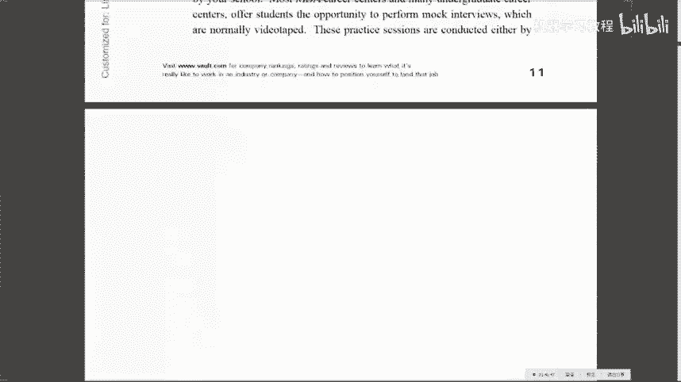

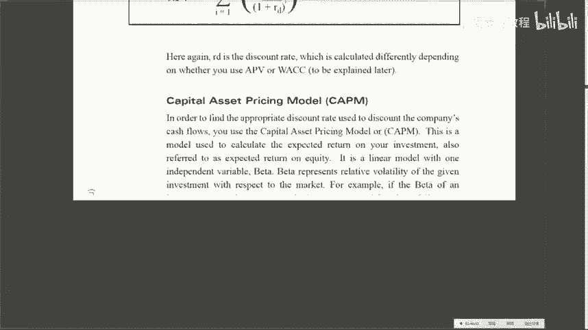

来进行怎么样回答，同时解释一些原理。比如说什么是呃看看 model啊，他就会以最简简简短的方式告诉你这个模型的本身的意义和怎么样回答这些呃各种奇奇怪怪的问题。

这个是目前呃市面上最棒的就是质量最高的一个面试的小黑资料啊，这个。国内很少有人知道啊，这个给大家，这个是一个啊。这个说实话嗯。大部分的。跟金融领域有关的这个外企的HR他们是有的。你没有。好。

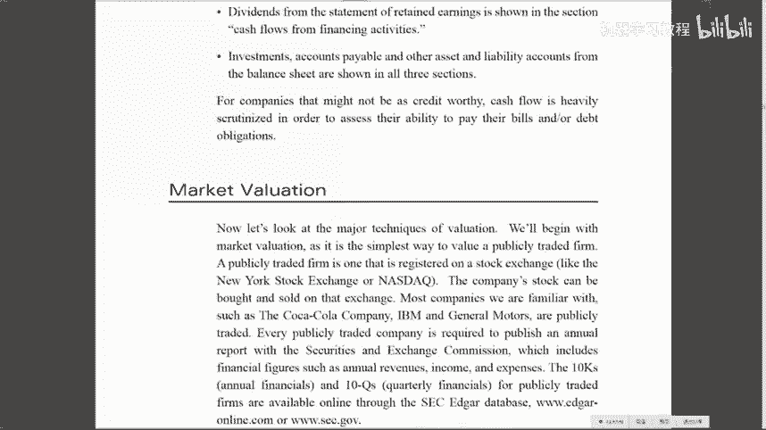

然后。这个这个是一个比较老的一个count的一个面试。这个是在机济学习呃前机济学习时代啊，而且是它是各种各样岗位的，从前台的框到这个research框。

各种各样岗位到这个IT supportport就是跟count有关的所有岗的所有面试的一个习题集，而，不是一个面试的问题集。所以它包括了一些极其详细的一些呃一些编程的问题。

还有一些呃金融期权定价的一些问题和一些呃就是说它方方面面的都会有这个是一个典型的外典型的这个外企的这个面试的这个宝典，就相当于他把呃外企会问到的所有的问题都给你收进去了。大家挑着看。

尤其是最好这个书是结合这个。

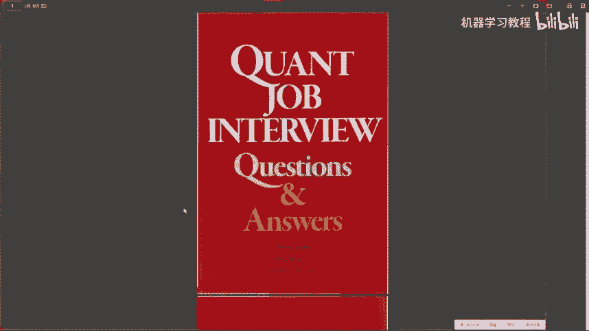

跟大家推荐的这个耶鲁公开课的这个课看完之后再看。效果会比较好啊。同时比如说现在已经被人诟病了很多年的这个所谓的这个呃bent问题，就是说。他就会呃考，就是他就会问你各种各样的。

比如说呃把播音计速器里头都放成乒乓球，你要塞满，需要放几个乒乓球，这种没P眼的问题，他就看你怎么样的快速建模分析。其实你最终的答案是不重要的。它是重要的是我刚才强调过的那个数学修养。

你是怎么样来想这个问题的，而不是拍着脑袋说啊，大概几万个吧，你这几万个是怎么来的，你不能拍拍脑袋说呀，就是说各种各样的这种。啊，这种的问题啊，在一度在90年代的时候，在华尔街极其流行。

但是后来大家都厌倦了这种觉得这。但是仍然在目前中国国内呢还会还会有人问啊，所以说呃你也要准备到啊啊包括这个概率啊和一些这个期权定价和这个利率啊，还有一些这个数学的一些问题啊，这本书搜集的比较全。

一个是这本书，一个是我刚才说的那本书。这两本书结合起来，再加上呃这个跟机器学系有关的面试的问题啊，这三个加起来啊基本上就全了啊，跟机器学习面试有关的问题。目前来说呃。目前来说的话，我会。因为我之前是。

好，就是说我会问的话，我肯定会问的。我百分之百会问的是这么一个问题啊，机器学习中你怎么解决过拟合这个现象？这个问题我希望大家要印在你的脑子里，你学任何的基于学习问题，只要跟这个相关的一定要看一看。呃。

一定要就是你回答这个问题的水平，就是你回答这个问题的长短，能够直接看出来你的继续学习的修养跟水平。啊，大家一定要把这个问题牢牢的掌握好，并且准一定要准备好啊，而且呢你回答尤尤其是技术性面试哈。

你回答的每一步，一定要做好，别人会follow up问你的这个准备。如果你没有。没有百分之百的把握能够呃。解答出来别人的fo off，你甚至提都不要提。

比如说你说你只用过SVM的这个呃调过SVM的函数的话，你就你就你就尽量的就你就不要太提SVM。因为他们就肯定会接着往下问的，尤其是比较常见的模型，他们会会问到极其变态的这个这个地步。

所以说当你没有做好充分准备之前，你。不要瞎吹啊，我对于这个呃技术型面试。那么呃技术型面试的一个非常好的一个起点，就是啊请你谈谈你对过拟河的看法。那么你不管谈你肯定是有的谈。

你谈的每一个事儿呢都会接着往下问。所以说这个事情这个问题是一个我最爱问的一个一个事情。啊，同时呢呃它的一个等价的一个命题，就是请谈谈你对政政策化的一个理解和它的意义是什么？

因为这个是机忆学习的另外一个呃。角度来看这个问题，你你对政策化的理解。那么怎么怎么回答这些问题呢？首先要从呃要要把这个名词本身进行一个比较专业的解释。

同时呢要以一些呃具体的模型跟具体的呃数据为例来介绍说啊来来介绍啊这个呃这这个现象和怎么样的避免这个现象。啊，我希望大家一定要啊好好准备这个问题。对，过拟合跟政策化，这个是非常常见。因为比如说呃。

有人是搞深度学习的，所以说我就不好问SVM了，有的人是对吧？但是这两个问题是任何啊相当于一个非常 commonmon的一个一个地方。你不管做什么都都需要问。然后那么再再follow up回一点。

就是根据你个人的特色，比如说看你理论懂一点，那么或者说搞搞过点深度学习。那么我肯定会问的就是这个这个随机梯度下降的一些原理啊，你有没有写过。这个是百分之百能看出来一个人是真的懂了，还是。不大懂啊。

或者说你这个loggistic回归你怎么训练的，就是这个也是我最爱问的，就是loggistic回归。他这个权重是怎么学出来的？嗯。需要首先数学公式推导，其次要具体的实现。因为这个是一个非常简单的模型。

但是同时是一个五五脏俱全的模型。嗯。我敢打保票，你在跟经济学习有关的岗位的话，这几个问题都会有。那么再传统一点的就是谈谈你对SVM的理解啊，这个support vectorctor是什么啊。

这个max matching呃，它是怎么样跟优化相结合的。那么这个就比较老的一些问题了。呃，这么几个是你你你百分之百会遇到的呃，也希望大家需要。呃，有所这个准备。好。

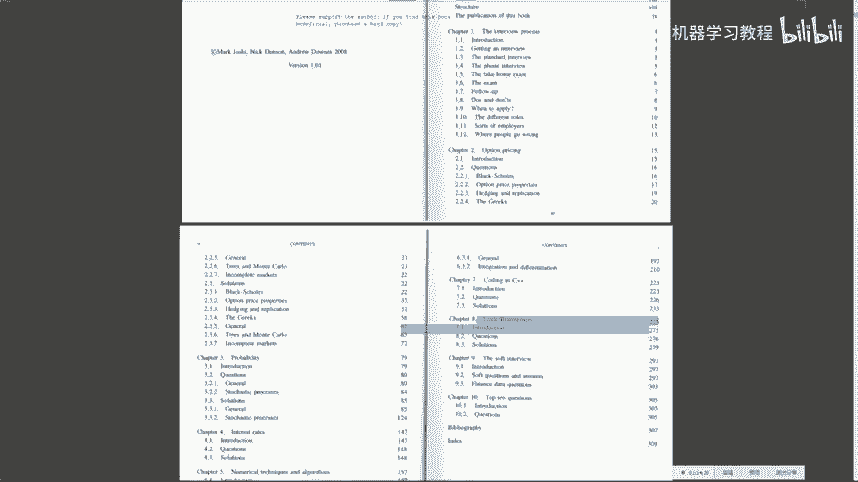

再往下看。我们再看。呃。啊，对啊，那么差不多呃说到的就是这些呃时间有限啊，能力有限，用了十字课的时间嗯，给大家尽我最大的能力让大家从零起步，像承诺的那样，从零起步啊一路走到现在。那么这个课结束了。

但是你要干的事情是远远没有结束的。呃，我希望大家用差不多用6个月左右的时间啊，我希望大家用6个月左右的时间。嗯，把我说到的这些东西嗯再进行进一步的这个巩固。同时一定要建立自己的一个profile。

就是一定要建立自己的。自己的一个个人形象啊。形象问题。就是说你要有一个你的这自己的G top，要有一个。粉丝在22000以上的一个新浪微博账号，要有一个比较日均访问量比较大的一个一个个人网站。

这三个都要有啊，并不是全职6个月。这个这个事情是所有事情都是都是兼职的，都是你part time要做的，而你维护你的jitopub，维护你的微博，维护你的个人博客，这个事情是一个终身的一个事情。嗯。

就是你就要建从现在开始就要需要建立你个人的这个品牌的这个影响力的这个事情嗯。并不是这个是每个人都需要做的，并不是呃你说是要出去出头露露面嗯，才需要干的一个事情。每1个HR都需要看。你如果开公司。

每一个潜在的合伙人都需要看你的潜在的投资人都需要看哪个东西，这个是一个终身性的一个行为。不管你是从事什么样的职位，这个东西都是需要做的。嗯。要写一些比较高质量的别人愿意分享的一些东西。

比如说你写了一篇博客之后，你可以艾特一下爱客可爱爱生活，让他转发。那么这样的话呢就会提高啊你的影响力，然后尽量的少转发别人的，尽量的发自己一些原创性的东西。

同时要维护一个看上去比较体面的gtub的这么一个账号，以及最好是有着自己的一个个人网站，写一些分享性的东西啊，坚持写啊，同时看看别人写的好。就是说当你一旦开始写的时候。

你就会下意识的去关注写的好的人是什么样的，我能不能写的跟他一样好啊，那么这样的话呢，也就会反而逼着你去啊，不断的学习跟进步啊这个事情。这个事情是非常重要的。这个事情是极端重要的。

对于你想找一个比较好的岗位跟找一个比较好的，就是当你。找一个比较好的一个合作的伙伴的时候，这个是你的个人形象。别人一个不了解的人了解你的唯一途径。就是先看看你的社交账户，看看你的这个Gtop。

看看你的个人博客，以及所谓的这个领营网的你的这个职业信息。这些是需要用一定要花大力气去打理的一个事情，而不是觉得啊就是要走过上。因为我要是申请一个岗位，我赶紧弄一弄。不是，这个是这个跟你个人。

你每天你穿衣服洗脸是一样重要的一个东西啊，大家一定要。就是只要你有这个重视度的话，你肯定会做好的。这个我是相信的。而我今天要做的事情就是给大家强调一下这三件事情啊在。尤其是在金融这么一个。

这么一个非常强调这个这个这个presentation的这么一个领域的地方，他们非常重视你的啊这些的事情。啊，所以大家回去从今天开始要维护一个比较好的一个微博，维护一个比较好的Gt和尽量的建立一个自己的。

因为你其实你Gtub它有一个Gtub page啊，pages它会给你一个免费的一个Gt的这个域名的这么一个游呃空间，你就能在Gt上建立你自己的个人网站啊，非非常简单，叫Gt gt呃 pages。

大家可以学一下，这你不用花钱就能搞的一个事情啊，全是免费的啊。嗯，有了这些之后呢，你就会呃再用这个。嗯，嗯再用大概啊再用大概6个月左右的时间，把前面的知识巩固一下，建立自己的知识体系。

然后争取在明年9月份的时候，你就会以一个非常跟现在不一样的角色来呃进行一个职业的申请也好，创业的这个阶段也好。同时你用这。6个月的时间自己要做一些实盘交易或者一些呃比较成功的回测。

并且把你的这个经验分享出去。啊，一定别担心说啊，我是不是把一个成为百万富翁的机会给放弃了。并不是你在初期的时候，这是你要交的投名状。这是别人要相信你的一个基础。

是你分享过一些比较高质量的量化的东西和你对量化的见解，这个是赢取别人信任的一个事情。啊，这个薪资水平这个我们还是不要在这个这个咱们在微信群里头说嗯。呃，写博客建议的平繁，我觉得一般来说。

现在大家写的都是一些静态的分享。你最简单的word price稍微好一点的就是这个这个 pages，但是它会稍微复杂一些。我我我非常喜欢呃纯静态的。干净整洁的，甚至互动都不要有很多的。

而且你还要注意是手机登录比较好看的。因为现在有很多wordpress，它手机登录上去很很复杂，很字很小。因为现在大部分人看都是通过手机看，你还要考虑到用手机能看的，主要就是什么呢？啊，对mark亮啊。

对，主要就是说你静态的能够嗯把你的一些知识分享出去，这个是你个人的技术博客最重要的地方，就是你你分享出去了一个知识点。而这个知识点，别人以前分享的不够好，这是你要做的事情。啊，微博是这样。

微博分享的知识。一般是碎片化的，或者说是呃几句话就行的。我建议大家自己的微博要时不时的。比如说你写了一篇博客，你说我今天写了一篇关于什么什么什么什么的文章，文章地址在，然后你再艾特一个比较。

有影响力的人让别人转，就是说你微博是一个公布消息的一个地方，但你真正的一些大干货要放在一个啊静态页面里头去，因为肯定一个博客是写不完的。1个1个110144字的东西是分享不完的。

但你在微博里头要比较积极的评论一些，最好是原创评论一些事情。让就是你一定要让你的微博让别人看上去有营养，而不是你天天转一些哈哈哈哈或者666之类的东西，别人没有任何动机去当你的粉丝啊，这个是本质的不同。

就是你微博是写给谁看的这么一个事情，是写给自己看的，还是写给别人看的？如果写给别人看的话，你尽量的呃少转发这个哈哈哈这种东西，你自己哈哈哈就行了啊。或者你自己弄一个小号，偷偷哈哈哈啊。

然后再建立一个具有影响力的一个一个东西。这个大家每个人都需要做相关的尝试。同时呢比如说有一些比较好的国外的一些，你今天看了一个国外的在广头片上面看了一个比较好的技术分享。

你可以给他呃translate翻译回这个国内版，在国内的数据上跑一跑，然后这也是一个蛮蛮有意义的一个事情啊，就是各种各样的，你觉得啊别人没做的，或者别人做了，做的不够好的，一定要精心的打理啊。

它的这个质量其实是质量跟数量都很有关。就是一个你要发个琴，另外一个你发的质量最好要好一些啊。这样的话，你的影响力起来之后，你什么都来了，尤其是在网络时代，个人的影响力跟话话语权是占据了。

非常大的一个权重的一个事情。另外就是说最好在知乎上当一个比较积极的问题回答者啊，比如说。这个王博二啊，我的好哥们儿啊。他是做高品那个。在知乎上他就就是说你你当别人都关注你的时候，你做事情就顺多了。

你想求职，你也方便多了嗯。这个是。并不是少数人的特权，只要你努力，只要你有这个意识，每个人都可以都可以的。哦，你你你你你认识他是吧？那下次争取。嗯。下次聚会的时候，我把他拉上嘛。他其实是个做高频的字是。

他在知乎上天天扯他。好，那么我们这个课程就到这里。

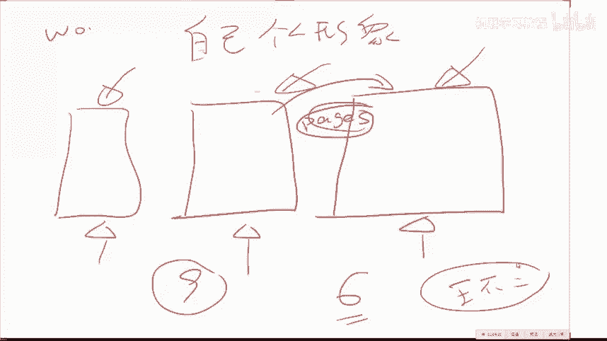