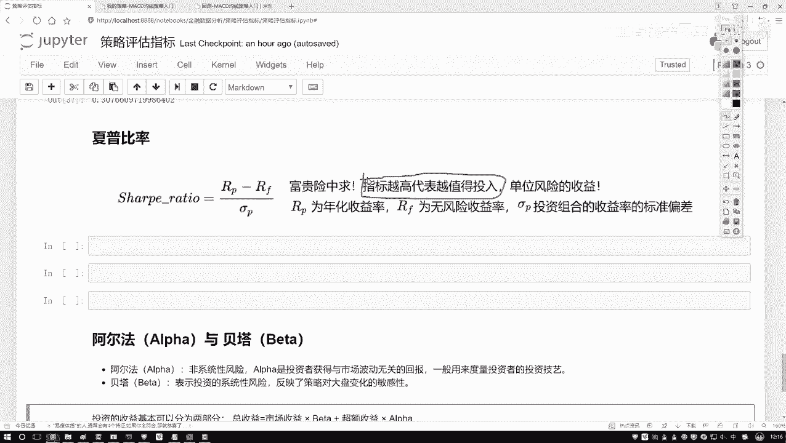
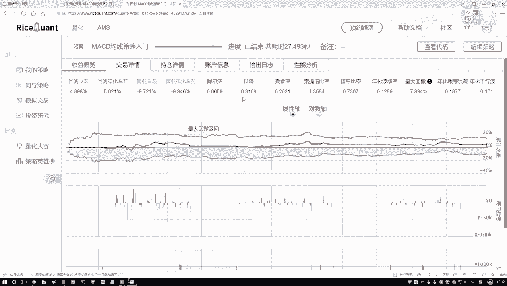
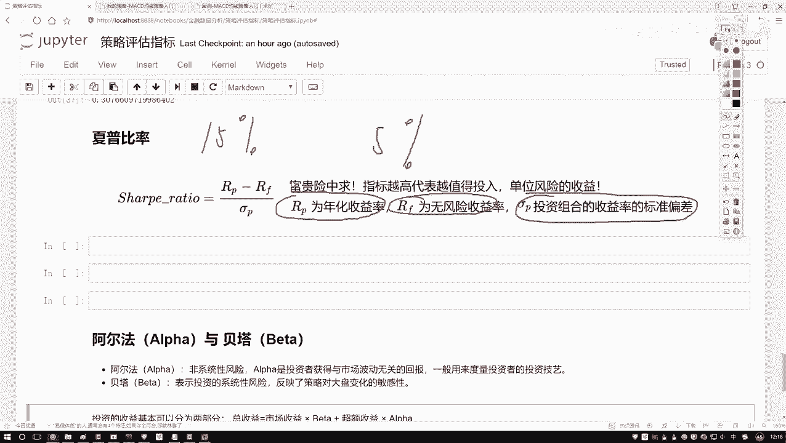
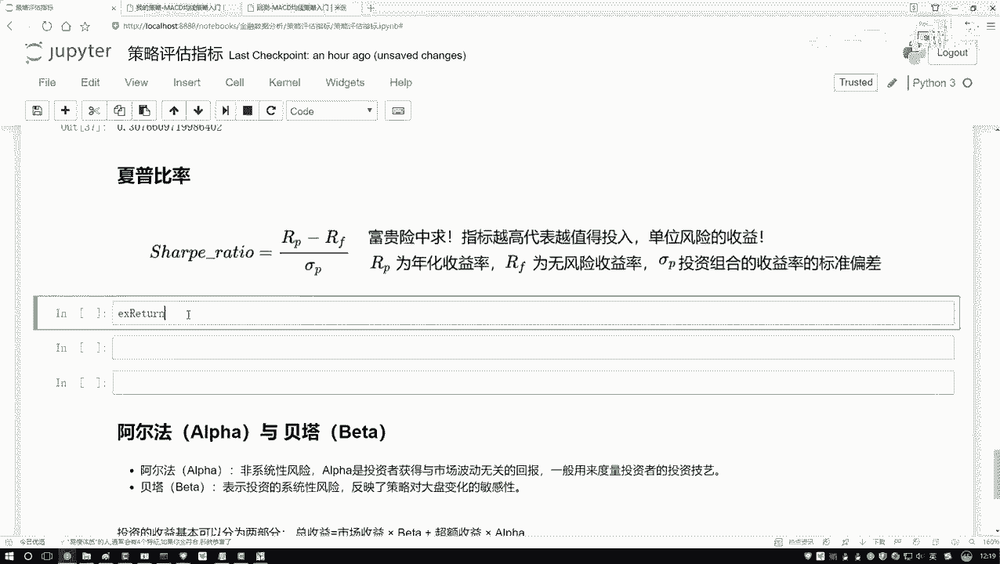
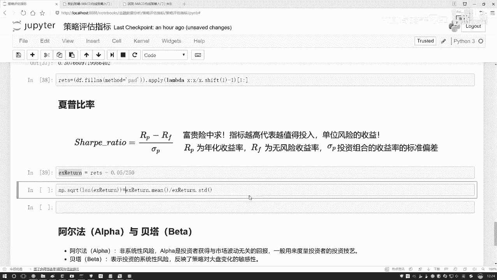
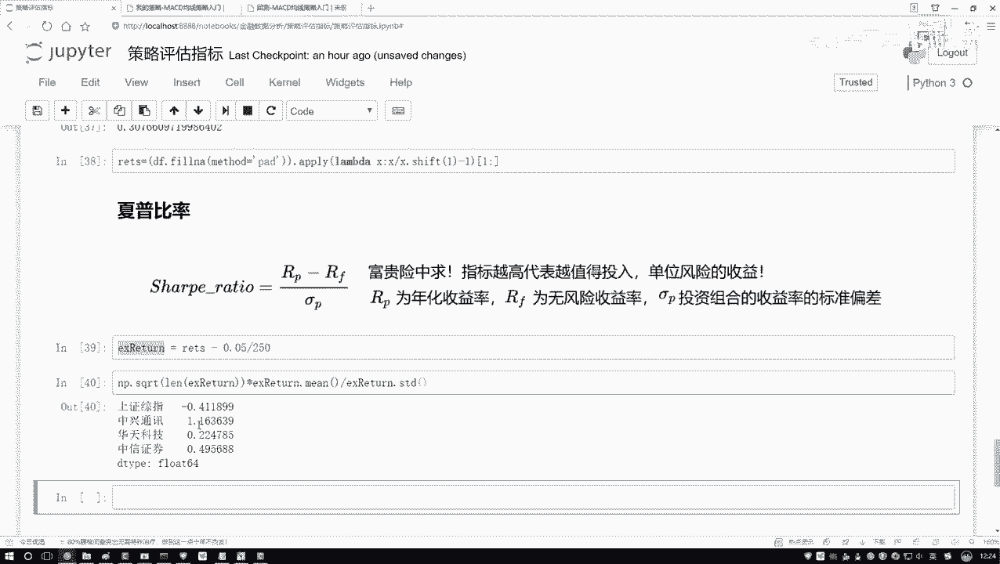
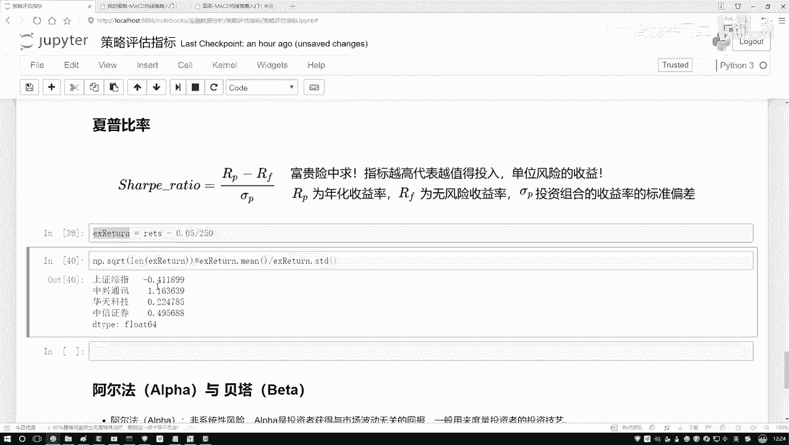
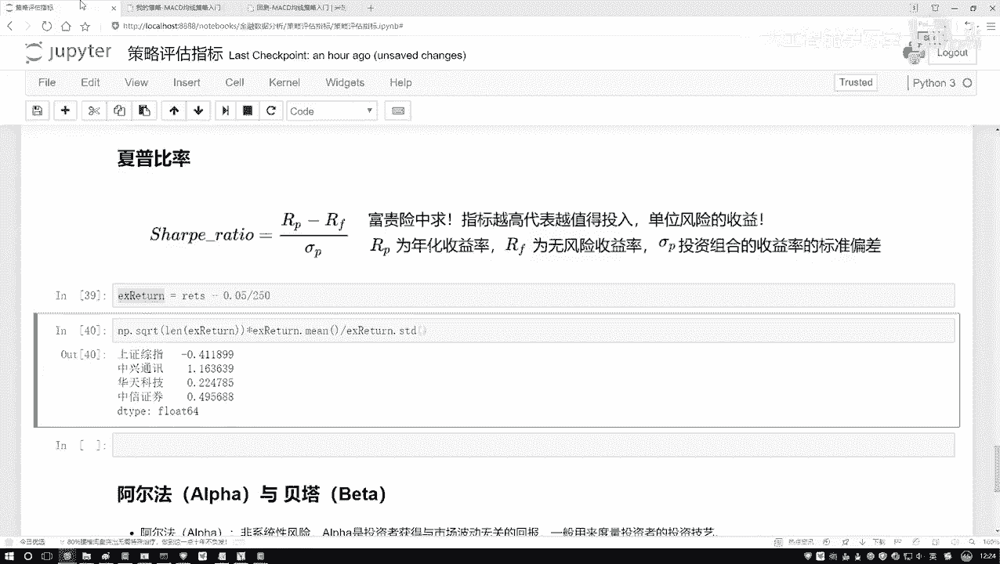

# 菜鸟狂喜！研究生宝藏【Python金融量化分析】人工智能数据挖掘实战教程，翻遍全网找不到比这更实用的了！！！ - P19：19-夏普比率的作用 - 账号已注销 - BV1fBxWesEHV

接下来啊咱们来说一下这个下坡比率啊，那先解释一下它是描述什么的，咱们之前是不是提到一个风险啊，诶那我给大家先举一个比较好玩的事啊，咱们在那个朋友圈当中啊，是不是经常看到一些搞笑的东西，哎。

比如说之前我看到说那个叙利亚招那个雇佣兵，然后只要会扛火箭筒就行，然后会怎么样就行，然后工资日结一天工资就3万，就5万，就10万的数还挺高的呀，那他的工资日结为什么这么高啊，叙利亚那块因为他们怎么样。

风险非常大吧，那这个消耗比率它是描述了这样一件事啊，那我干什么都有风险，那相对来说我这个风险跟我的一个收入来说，它是值不值当的呢，相当于啊我们要算一下，对于单位这个双眼来说，哎我的一个收益是怎么样的。

其实这个小比率啊，它描述这样一个指标指标越高，表示什么单位风险来说，哎对于单位风险，我的一个收益会怎么样越高吧，那其实我们也要去做这样一件事，比如说现在我要去选股，那有可能有好多股票。

那好多股票算完之后，我算一下，看谁啊啊咱们如果说单从一个指标来看，就刚看这个销售指标，我要看什么，那肯定是它高的呀，因为越高代表着A对于单位的方向来说。

我的收益也会越高吧，所以说啊这个指标就描述的是哎，在这里你看也有啊。

这块咱们的一个哎这个项目项目指标是吧，这指标当中啊，咱们就可以计算一下，对于单位风险来说，我到底哎是值得呢还是不值得呢。

当然我们希望这个指标怎么样越高越好呀，单位风险我的收益要越大才是越合适的，然后咱们来说一说吧，那这个哎呀风险这个事儿，或者说风险跟收益这个指标这个事儿啊，咱们该怎么去算啊，那其实是这样。

你说咱们现在啊就平时存钱的时候啊，可能大家听过两种存钱方式啊，一种就是到银行里边，他会先去呃，看一下你的一个人的承受能力，你的一个风险等级，看一看是不是适合买这个理财产品，如果你是个老年人去的啊。

就七八十岁啊，像我爷爷之前还买理财，买理财的时候去了，那人家肯定要让你买什么，就是那种就是没有风险的，就是固定收益，比如说一年啊就给你个3%，反正就是不会亏本，一年到了就给你3%，这叫什么。

就叫做一个固定的吧，或者你买一些国债啊，相当于到就是时间到了就给你这钱，不可能有点风险的，那比如咱说这样吧，我就说咱这个保本的固定的，我说他是一个5%哎，整得高点行吧，然后呢，然后就比如我去了，我去了。

他看我哎呀，这个中年人去了，然后他有一定收入能力，然后他有点抗压能力，我说给你介绍一款我们理财产品吧，然后咱们这款理财产品啊，它是可能是一个组合的，不可能不一定，光是一个可能给你介绍一堆投资组合。

我就拿一个值来说了，比如说给你算了算啊，当前的一个收益可能是一个15%的，那相对来说你看我说我买固定收益才5%，是不是太少了，那我买点风险的是不是15%啊，那此时我可以算什么，它们之间怎么样。

是不是有一个差异呀，啊相当于就是啊我们只是两个指标，一个呢就是你的一个投资的哎，你的一些组合产品啊，这样一个收益率，以及呢你的一个市场来说啊，一些无风险的一个收益率，我们要算它们之间的一个差值啊。

是要算这样一个指标，然后呢再用这个差值比较什么，比上就是当前你不是选了这个投资组合吗，比上一下你投资组合的一个标准差啊，咱们要做这样一件事，大家可能觉着这个公式，计算起来稍微麻烦一点啊，没关系。

我们重点什么，你只要去理解这个下午比例啊，这个real值表示什么意思啊，就行了。

然后呢给大家来算一下吧，就是刚才解释了就是单位风险，哎，你的一个收益到底能有多大，那怎么算呢，按照咱们刚才这个来说吧，比如说啊我说我现在买了一款理财产品。

然后呢我的一个returns这块我在算的过程当中。

我得把之前我的一个回报率拿过来啊，之前哎对之前在我们做这个回报率的时候，还做了额外一件事啊，就是呃对数据当中啊缺失值做了一个填充，因为数据当中啊可能有一些哎就是停盘了，或者是有一些其他因素。

或者读取数据当中因素，导致了咱这个指标它是有缺失的，我们在这块就是全部用它前一天的值，如果一个数据缺失了，当做它缺失的那个值啊，多做一步，然后呢用我当前我的一个啊我的一个回报率。

然后呢减去咱们刚才说的是一个呃，0。05是吧，要不不要忘记啊，就是咱们得按照这个年来去做的，所以这里我再比上了一个250，然后接下来咱们来去计算一下这个消耗比例啊，消耗比例做的过程当中啊，其实挺麻烦的。

在这个return当中啊，你要去算他的这个标准差是吧，你得有一个均值，然后再比上什么，再比上他的一个STD，然后呢前面前面这过程当中啊，这里呃它只是一个形象的表示，然后他少了一步，少了一步就是蓝派点。

然后我去呃，得把当前这个结果再给它去开个根号，开根号就是你加上一共咱们的数据，它是有多少天的啊，就这里把这个数据一共是有多少天的写进来，然后呢接下来再去乘上我们当前的哎。

刚才算的这个呃这个标准的一个偏差就可以了，然后我想想就没有什么问题，没什么问题。

看下结果吧啊看结果咱们算出来了，就是对于啊我的每一个指标来说。

咱们当前的一个销售指标是不是全算出来了，哪个最合适啊，肯定中兴吧，为什么，因为当前这个指标值它是一个最大的吧，啊单位的一个风险能够使得我的收益是最大的，然后这个都是负的，负的咱就不看了。

我们希望当前我们指标肯定哎，我们要是一个越大越好的。

这个就是在这个策略当中啊，咱们提到了啊，有这样一个夏普率啊。

