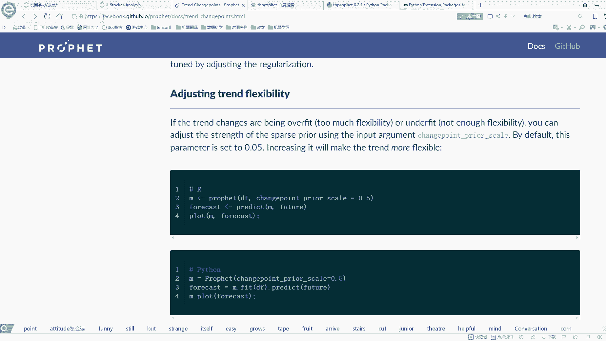
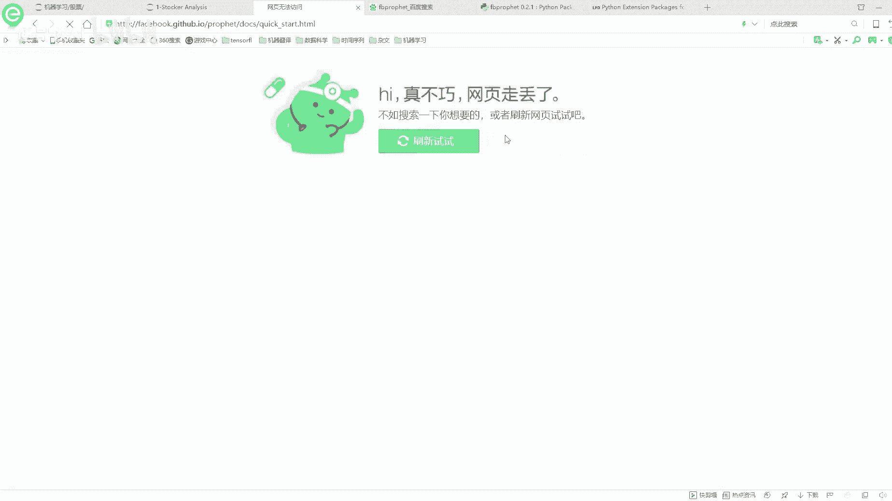
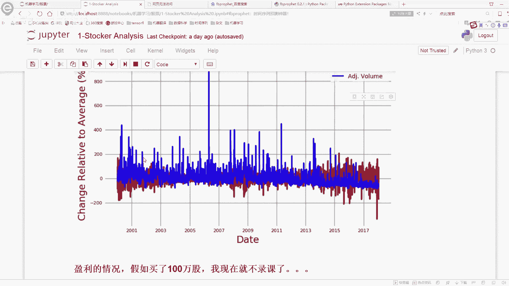
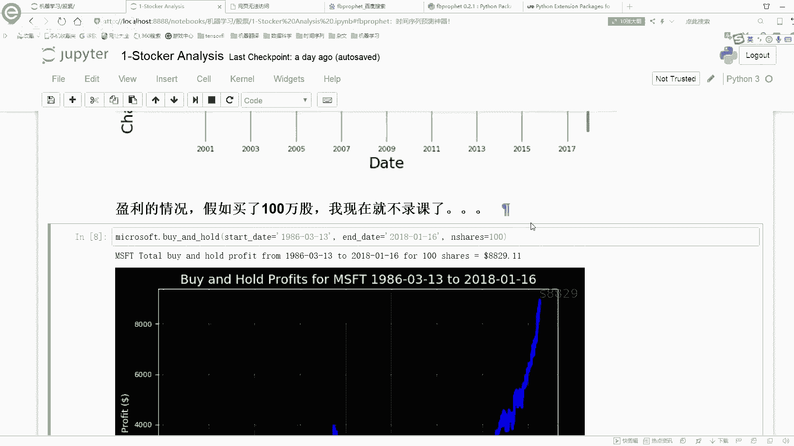
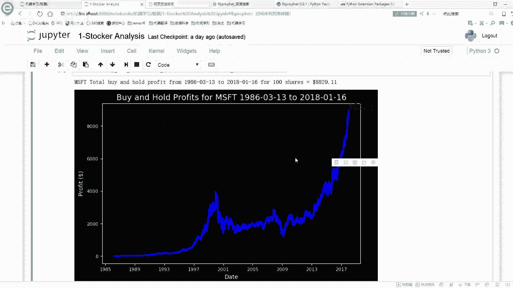
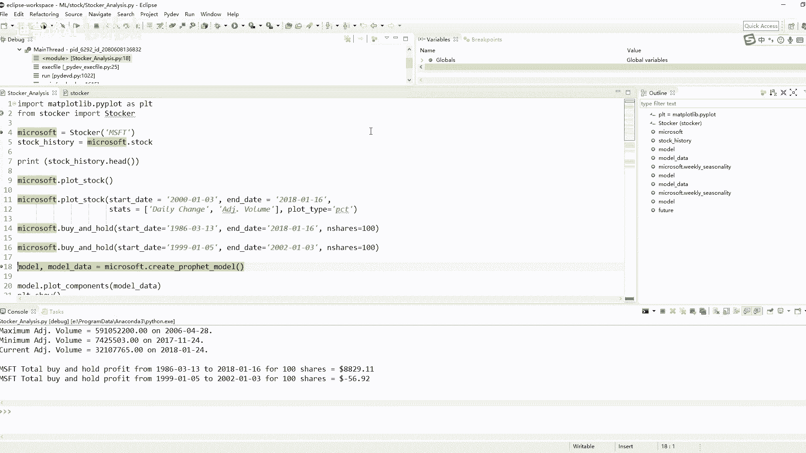
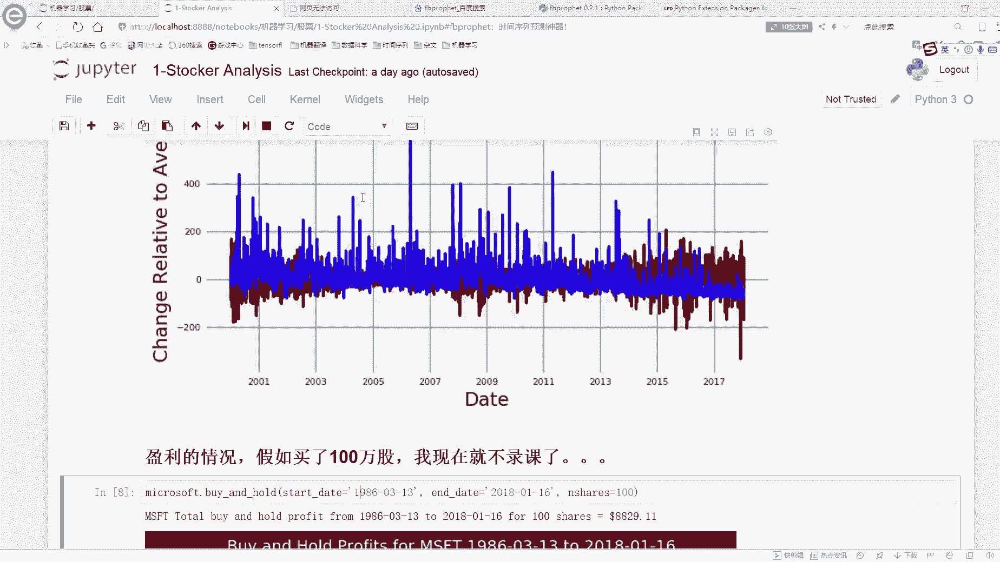
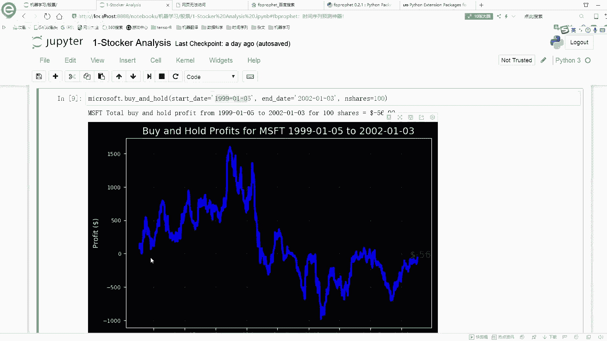
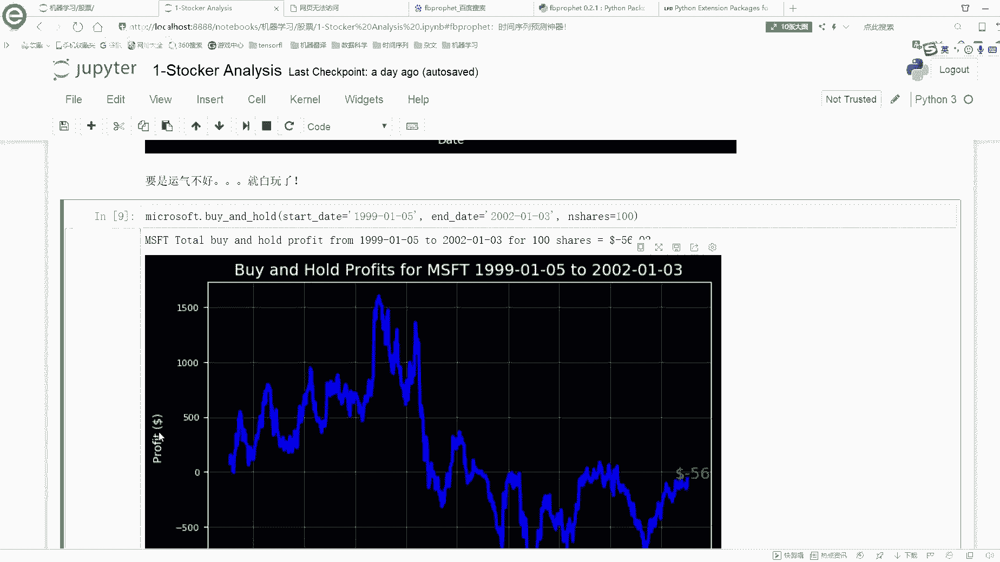
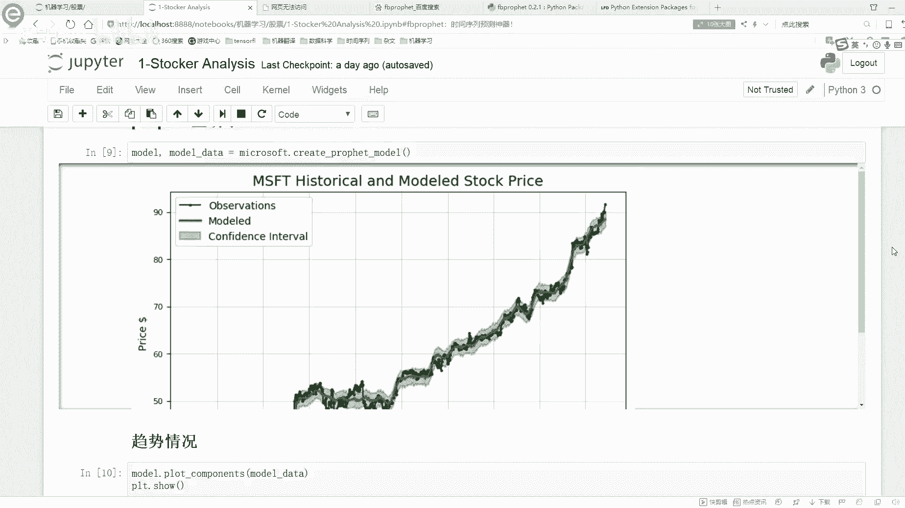

# 【2024版金融量化】AI结合金融如何做落地项目？迪哥手把手教你3天从入门到项目实战，学完即可做项目，少走99%的弯路，学量化交易看这套！人工智能／计算机视觉 - P35：2-时间序列分析 - 迪哥谈AI - BV1NW421R7d7

首先呢咱们先看第一步啊，第一步干什么，第一步啊去读取我的一个数据。在这里呢就是我们选择一个股票啊，这里选的股票是一个微软的一个股票。我们可以拿到它就是它的股票的一个到今天为止。

它的一个历史情况是等于什么的。然后这块呢我们先来看一下，再艾一下，看一下我当前的数据啊，它是长什么样子。这块呢它有个data，就是它的一个时间。😊，然后呢，我们一会儿关心呢。

我们一会儿要预测的就是这个就是它的一个呃收盘的一个价格。就是我们要关注的是它的一个价格。就是你看这些东西还是很多的。我们观察到最后的就是它的一个价格。然后呢。

这个DS就是我们一会儿要的这个Y也是我们一会儿要要用的这就是我们当前的几个指标。这几个指标啊，哎我们先再来执行一下，我先把这个东西啊重新导入，重新执行一下来看一下。哦，在这里。

这块啊第一次执行的时候啊可能会稍慢一些。因为在第一次执行的时候，他会去先去导这些库。然后你观察就是这个这行代码它有没有报错啊。这行代码如果说报错了，那你就是这这三个库，那肯定是估计你是没有装好。

你需要把这个三个库装好之后，我们才能去得到下面下面的结果的。然后这块我们就显示出来当前的结果了吧。那接下来呢咱们来看一下吧，我的一个数据它是怎么读进来的。在这里呢我们还是debug去做，哎，在哪去了哦。

在这里我就是啊把这个note book当中的代码啊直接的给它复制过来了。然后呢在这里咱们就是先debug吧，你看在这打个断点啊。😊，一步一步跟大家说一下这块呢你打1个MSFT啊，它是一个微软的一个股票。

然后一会儿呢咱们预测的时啊，再看一下亚马逊的一个股票啊，这些股票啊都是你可以通过自己的名字来进行一个指定的。你想看什么股票，咱们就看什么股票。这也要推荐大家就是当我们拿到一份代码啊。

你不熟悉的时候怎么办？你不学不熟悉的时候啊，你去看这样一个类。比如说F5跳进去，你去看这样一个类啊，你就是瞪着眼睛看这东西啊，看看你就乱了，看看你就混了，这东西看起来太麻烦了。我建议大家怎么办啊。

你就不如啊把这个东西跑通了，然后debug一遍debug看一遍这东西啊做一件什么事啊，它就一目了然了。😊，首先呢来看吧，一开始啊传什么，传的是咱咱们这个MSFT吧，这是我一个股票的名字。

然后呢把它变成一个Upper变成大写。然后呢这里就是去读这个数据，这个呢就是咱们刚才的那个那什么刚才咱们指定的嗯安装读数据的那个工具包吧，去get一下咱们的数据。这块呢，可能之前说稍微得等那么一小会儿。

你看我现在摁了一个F6，他再读的时候，可能得稍微等一会儿，然后呢，他就会帮我帮我把这个股票数据给它返回回来了。😊，你看股票数据先我读完了，你看这个是我读建数据啊，它是从这个1986年3月13号开始。

然后后面有一系列指标。咱啊这个里就是关于具体的一个股票，咱就不分析了。咱给大家讲的还是这个时间序列，这个东西该怎么去做啊。至于这个股票啊什么涨了跌了，它这个开盘价收盘价是多少。

这些啊我我对这些对咱们来说是无所谓的，也不用管，反正一个明显趋势啊，一会儿咱会看吧，一会儿看整体的一个趋势，看一下这个股票，然后呢，第一步啊，我把这个股票进行resit一下它的值，这是我当前的一个股票。

然后呢，股票当中啊，我把它的一个YS这个YS啊就是。😊，我需要指定，你看咱之前啊就是说的这个时候，我哪去了，这里呢他给咱介绍的时候怎么说的，他说你这里哎这个该这个qui start。

你看这个国外网站就这点不好，他这里啊经常会经常啊会有这样的一个问题，就是它会给你找不到，就是有时候刷不出来，咱不看了，刷出来不看了，我我我懒得翻墙了。然后这里呢就是我们先把一个DS做出来。

我们指定DS就是我的一个时间，我指定一个d里边呢本身就是一个转换好的一个时间格式。然后这个Y就是我们要预测的一个指标。这里啊咱们先把这些指标都拿到手。然后呢还有什么这个d changege。

就是我的一个就是呃收盘的一个价格和咱们的一个开盘价格，它的一个差异。这就是一个change的一个指标。😊。

然后呢，接下来就是我们需要指定我们的一个呃起始时间和一个终止时间。这里呢因为这个date数据啊，你看它本身就是一个时间类型的数据吧。你看它本身就是时间类型数据，所以说对时间类型数据啊。

我们直接用一个命值，那就能求出来它最小的一个时间。你看最小时间是1986年3月13号。那最大时间呢咱直接就用max就能求出来啊，这是就是一个标准的时间格式啊。

这个比较好的一点是咱们直接用一个命一个max就可以把它指标求出来了。然后最大时间啊，因为就是。😊，这个股票啊是嗯到现在为止，按照咱们今天的时间点，1月24号吧。然后我们当前最新的一个数据。

它就是1月24号。反正等大家疫情的时候啊，不一定你们有哪天了，咱们就是拿你那天数据拿就可以了。可能啊就是你拿到的一个结果指标跟我肯定是不一样的。😊。

因为你肯定之后你肯定在我之后来看这个课程的那看这个课程同时啊，就是你是哪天，那你就看到这天就可以了。😊，然后呢，在这里啊我们拿这个拿一些价格啊，这个max price啊，还有这个min price啊。

这些啊我们是都可以给它拿出来的。😊，然后呢，这个最低价格的时间，最低价格时间我可以拿手吧，最高价格时间也可以拿手。你把这个时间啊进去进行一个判断，然后找这个时间就可以了。

所以说呢现在啊就是当我们拿到股票数据之后，我可以把它所有的一个股票信息啊都可以拿得出来。然后这是你看起始的一个价格，这块也写了起始的一个价格。然后呢，最近的一个价格。

最近的价格啊也不就是今天的一个价格嘛，然后这块就是一会儿呢一会儿用到时候，咱们咱们来说这个东西啊，这个就是我训练的时候，我要指定一个年限。这个咱们现在用不到，先不说这个东西。😊，然后下面下面这个东西啊。

就是我一会儿要去看一下，咱当前啊要不要去统计一下，按按照一个天，按照一个月，按照一个年去看一下它的一个那个什么，它的那个就是随着天的一个变化，随着年的一个变化，随着咱们的一个呃就是月份它的一个变化。

这下咱们现在没看，等咱们看到时候再说。然后最后呢是一个ch points，这个哦不是ch points。我说这个ch points说说说的太多了，这是什么ch points，就是我们的一个突变点。

突变点，等咱们一会儿飘差的时候，咱们再来详细去说这个东西。😊，所以说在现在啊数已经有了，数据这边给你打印出来了。当前的一个数据从1986年3月13到这个呃2018年1月24，这是我当前的一个指标。

然后呢把我数据拿到手，这个不就是我现在的数据嘛？你看它是一个de frame格式，然后它有这么多个指标，这都是我的一个数据量。然后print一下，主要print一下它的h值，这个咱们不看了。

然后呢接下来咱们在这里啊接着回去这块呢我们就是先把我的数据拿到手了吧。先把数据拿到手之后啊，接下来就是我们可以一般情况下拿到一个时间序列之后啊，我先都是画一下这个时间序列啊，它是长什么样子。😊。

下面呢就是这个微软的股票。微软这个股票从这个86年开始到这个18年初啊，它这个趋势啊就是哎呀一路标横是吧？然后中间啊就是哎这块我就是因为我我没炒过。

但我听说就是当年有一个就是2000年9几年9982还99还有2000年的时候，有什么股灾，是不是啊？我对这个事情不太清楚啊，因为我自己从来没炒过股啊，我只是把这个东西拿过来当做一个时间序列啊。

估计大家能感兴趣些，所以说就选了一个股票的数据集要。😊，那这里就是你看它有一些下降趋势，还有些上升，对吧？觉但但是整体的趋势啊还是都是往上去走的这样的一个情况。然后呢。

在这里去prote一下它的个stock，就是我去画了一下，但这个图它会帮我打印出来，当前啊就是最高价最低价，然后还有当前当前今天的一个价格，今天价格应该是历史的最高点啊，因为现在它是持续上升的。😊。

然后呢，咱往下走，这块就是去画这个图嘛。F进去，咱看这个图咋画的，这个图画的很简单啊。就是如果说你没有指定一个起始日期和一个终止日期，你看我这里参数传能传什么参数啊可以传进来很多啊。

就是你可以告诉我当前那个图，你想从哪天画，然后画到哪天，你要想这么指定，你就传一个star date，还有这样一个under date，这样呢它就会按照你指定的这两个日期啊，把这个区间上的信息画出来。

那不在区间上的信息啊，它就不会去画的。😊，然后这个呢就是指定的是你想画哪个指标。如果说你画一个指标，你在这里有写一个，你看我这画了一个close它的一个价格。如果说你想指定多指标，那你写个逗号。

然后指定多指标就可以了。然后这个，就是咱们先看这个basic就是一个基本的一个画图方法。然后呢咱们来看吧，在这里就是指定起止日期。我看一下起止日期啊，它是没有指定。你看这里默认都是个乱指。

默认乱指就是拿我最小的是最小的日期，默认你看按 data也是乱指，那就是默认拿它的最大的日期，分别是2018年1月24和这个1986年3月13。😊，然后呢，首先啊就是我去呃make一下d frame。

然后把我的个日期传进去。再来看这里啊，其实上它又做了这样一件事儿啊，因为我们现在是可以指定日期的，它就要在这个日期当中啊进行一个选择。你看这里它会在我日期当中啊进行一个选择。😊，学欢说传说什么呢？

选择出来一个star date，这是我的一个起止日期，把它转换成一个pandaas的d data time格式，按d，然后张样给也给拿出来。然后拿出来之后呢，然后我们就在这里进行一个指定。指定完之后啊。

我们就是去取数据，哎，要看到哪去取数据了。😊，哦，在这里就是返回个日期，我看一下在这里啊，它是返回了一个日期。然后返回日期之后呢，然后我看一下在这里它是在那去取数据的，还有地往下跳啊。

在这里它就取数据了是吧？在这里你看就是在我da frame当中啊，我指定的一个date，它要干什么？它要大于等于起始时间小于等于终止时间，这样呢就返回去了。这个就是我们怎么样去取数据。

根据我的一个起始时间和终止时间，在这数据当中啊进行了一个切分，只选你就是在这个时间片段之内的数据。😊，指定colscols咱先指定多点，一会儿背部要画很多条线，反正咱们先指定出来。

然后呢在这里就是去你看这块写了复循环啊，它这个负循环的意思啊，就是看你要画几个指标啊，咱这里就是只画了它的一个close指标。所以说这个复循环只是执行一次。但是当你往里传参的时候，这一块呢。

你想去统计多指标。比如说我想看收盘价我也画，然后开盘价我也画，那你传建两个指标，传建两个指标，它会分别的帮你去画这个事情的，就是复循环当中会画两个图。😊，然后呢。把我当前的一个就是最小值啊，这是最小值。

这是最大值拿出来。然后呢拿完之后啊，这里就是我去找最大最小日期。因为我这这里我先打印了一下最大日期最小日期，然后分别它的一个指标值在哪天，这些比较好统计吧。很简单啊。

就统计出来了最大值最小值以及呢它是在哪天。然后呢他又来画这个图啊调这里了画这个图啊，首先他去你自己指定一个t的方式啊。这个我按这种tyle方式去算啊。然后你愿意用什么tyle方式，就是m cloud啊。

你不可以自己进行设置嘛。但是我觉得没必要，咱们就用当前这个p方式就可以了。😊，然后呢画图啊就是你画什么，你把日期也传进去，这是我要画的日期吧。横轴Y轴什么Y轴就是在这里你取某一个指标嘛。

当前咱取是close这个指标，然后颜色你选其中的一种颜色，这个什么颜色红色吧，这个颜色红色，所以说画出颜色红色红色，然后呢你的一个线条的一个宽度，你的一个label的一个指定，你的一个透明程度。

这些呢都指定好之后，咱把啊就是X轴叫什么？Y轴叫什么，主题叫什么？整完之后这就完事了。接下来呢咱们再画一个格子，因为看有格子之后是更清晰的。接下来做完这之后，然后p哎完完事了，收一下收一下完之后呢。

咱就把这个图啊给它画完了。😊，你看画完之后就这个图吧，这个就是咱们现在画出来的我的一个股票的一个情况，它是长什么样子。这呢咱们就画完了当前的一个微软股票啊，从这个86年到这个18年，它的一个情况。

然后这个不看了，因为这个情况基本上就是一路标红啊，这个东西很牛逼啊，现在盖到这么高的价格，然后再往下看吧。😊，再往下看，比如说在这里我给大家举个例子，比如说你想看这个01年到这个18年。

你就自己指定一个日期，然后你想看哪个指标，你就是看哪个指标一个指标，比如说它是一个d changege，一个指标是交易量。然后呢，在这里我们就都可以去按照这个指标。

然后pro type你可以按照一个百分比的格式。这里它就是一个百分比的一个格式。然后呢，咱家执行一下，看一下它的结果啊。😊，这里呢你看我就是把两个就是把这两个都画出来了吧，蓝色代表什么？

蓝色代表一个交易量。我这个我看这哪天啊，这是16年16年大概是个16年的一个呃中旬吧，一模年或者上旬。然后这天不知道发生件什么事啊，这一天这个交易量是突增啊，我也不知道那天发生一件什么事。

然后红色的就是它这个股票它这个浮动，它就是每天价格的一个浮动，蓝色呢就是它这个交易量，这些就是你都可以通过指标画出来，其实啊给大家准备的这个类啊，相当于什么？这个类里啊。

也给大家封装好了很多个画图的函数。在这里呢如果说你有一个时间序列任务，跟咱们今天这个任务啊是差不多的。那你也可以啊就是把这个任务把代码改一改，应用到你的时间序列当中啊，也是没问题的。

我觉得啊反正时间序列来说，画图啊可能来说都是差不多的这个意思。😊，然后呢，咱再来看这里啊，这里就是我画了当前的这样一个图。在这里呢我们可以先玩一个比较好玩的一个事儿啊，这里有这样一个函数啊。

band hold它的意思就是说嗯在这里。😊。

如果说你去买一个股票，你有一个基止日期，你有一个终止日期，然后去买这个股票。在这里呢你可以填一个你买几百股，然后他就会帮你算一下你会赚多少钱这么一个事儿。

这里啊咱们来看吧，他会给你画出来这样一个盈利情况啊。就是如果说你是这个86年买的股票。然后呢，你现在在这个18年，然后1月16号他要现在去卖。假设说这样是这样一个情况，你会赚多少钱，这里呢他会算了一下。

你会赚啊大概8000多块钱吧，这个样子，然后呢这里就是那你想就是这里是买了100股。那假如说你要买了100万股呢。那这个东西啊，前面再后面再加上一个万字是吧？那有有这些钱之后啊。

基本上你也啥也思不用干了。而且它是什么还是一个dollar吧，这个就是我们可以有这样一个函数啊，蛮好玩的，给大家往里进去看一下吧。😊。

简单说一下吧，这个ban hold就是去计算一下当前你的一个嗯收益。如果说是股票来说，你就可能买也能卖嘛，能买能卖赚个差价这个意思。然后首先它会resit下 plot。

就是把你之前设置的一个画图的方法都还原到一个默认值，先把我的一个star date和我的一个end date给拿到手。😊，starpri还有underpri照样给他拿到手吧。

然后呢咱们去make一下d frame，这就是去把这些天的一个数据拿到手。然后呢，我的一个获利等于什么？我的获利啊其实来说啊就是很简单的，就是等于我当前的一个。😊。

我当前的什么等于我当前的一个就是收盘价减去我的一个买入的一个价格，这是不是就完事儿了。然后呢，有了这样的一个价格之后啊，然后我可以算一下我所有的一个总的一个收益是等于多少的。然后呢，你有这些收益之后啊。

你就把这个图画出来，这就完事了。这个就不给大家一个去演示了。这个比较简单啊，也是比较好玩的一件事儿。然后我就直接往下跳了，直接跳到后面。😊。

那你看啊把这个图关了吧，这个图跟咱这里是一样的。这里呢就是呃我们可以指定日期。在指定日期的时候啊，假设说你是86年买的那你可能赚了。但是呢你看就是在这里我看了一下，如果说你是99年买的99年的时候。

你看什么样无五下跌是吧？那时99年买的时候，它可能就跌破了一个发行，就是那个时候就是比你买入个价格还要跌到这个1年时候，如果说你恰好99年买，然后12年002年你就给它卖了。这个时候呢你就得亏了是吧？

就是不像之前还能赚，这时候你就亏了，比之前那个开盘价格还要低一些。那你这些钱啊就当相当于白玩的吧，就是我们可以看一下，我们有一个买入价格，还有这样的一个就是就是star date，还有 date。

我可自己来看一下当前我们的一个。😊。

销售的一个情况，它是长什么样子。那接下来呢我们要来看的就是给大家简单看了一下我们的一个数据啊，下面我们就来给大家说一下facebook啊它的这个框架啊，我们该怎么去用了。😊。

