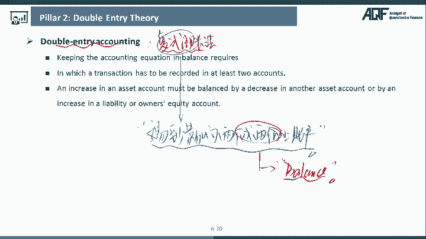
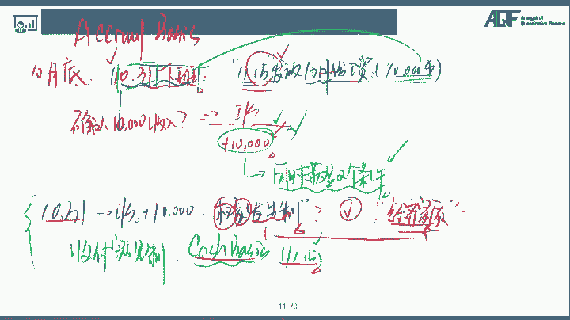
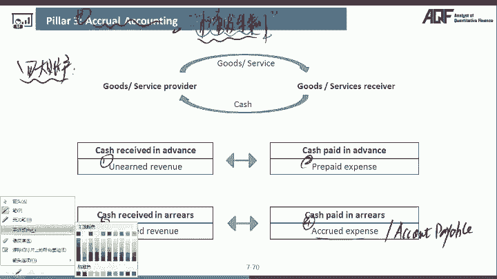
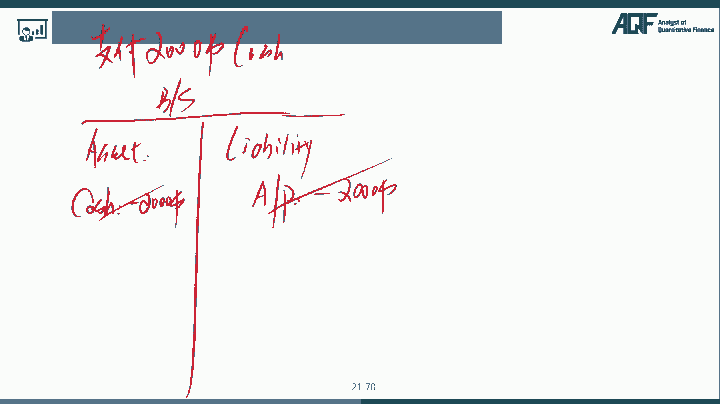
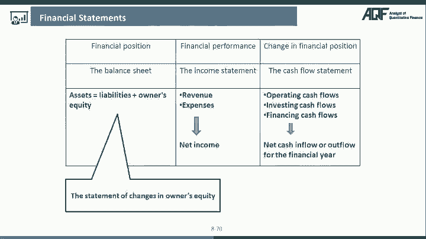
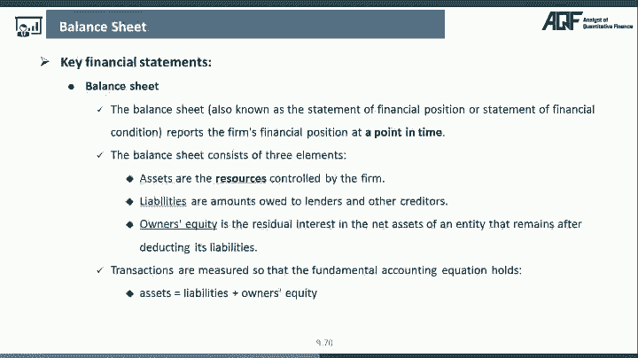
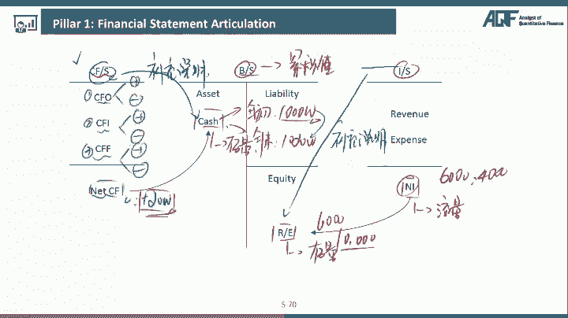
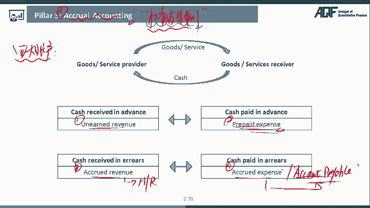

# 2024年金融大神老师讲解量化金融分析师.AQF—量化金融基础知识（完整版课程） - P10：+威❤hhh427501  了解获取全套课程 10.财务分析-2财务分析原理2：2大支柱 - 量化沿前 - BV1ar421K7Mo

休息一下，最新全套完整版课程和讲义，请添加微信，935989104。

好那么接下来我们来看第二个啊，第二个的话呢我们把它叫做double enter accounting，这个的话呢我们把它叫做复式记账法好，那么复式记账法的话呢，其实本质上来说啊，是我们财务当中啊。

会计里面记账的一种方法啊，在我们的AKF里面的话，那我们显然不需要大家掌握，怎么会去记账，但是这个记账的原理啊，我们是需要了解一下的，因为只有你掌握了这个记账的原理，你才能看得明白这些财务报表的分析。

对不对，那么嗯才可以运用在我们的量化当中后，那么我们先来解释一下啊，什么叫做我们的一个复式记账法，复式记账法的一个定义，指的就是我呢现在一笔交易，他呢至少要怎么样呢，至少要影响我们说啊。

叫做两个或两个以上的这样的一个账户，那么我们把这种记账方法的话呢，就叫做复式记账法，也就是说一笔交易，至少要影响两个或两个以上的这样的一个账户，好，那么接下来啊我们来举个例子，咳咳来跟大家解释一下啊。

好，为什么一定要影响两个或两个以上的，一个账户呢，其实就是我呃回到我们一上来跟大家讲的是，因为我们要做一个东西叫做balance balanced，什么是我们的一个会计恒等式，对不对。

就是我们上一个知识点跟大家讲的内容啊，比如说我们在这里举个例子，假设说啊我们现在的话呢有一家公司好，他现在呢花了2000块钱去买了一台机器好，这是一个最简单的，非常非常容易的这样的一个啊公司的一笔交易。

对不对，好那么呃这个公司花了2000块钱买了一笔机，买了一台机器啊，怎么去影响我这个公司的账务呢，很简单，那么怎么去变化呢，我们还是要先画出，我们的资产负债表的一个结构，左边呢是我们的一个资产。

右边的话呢是我们的一个怎么liability，和我们的一个所有者权益好，花了2000块钱买了一台机器呃，很显然很多同学呃都会想到这个怎么做呢，怎么影响呢，第一很很简单。

现金现金是不是属于我企业的资产对吧，那现金就是这个企业啊，这个公司以现金存在的一个东西，那么现金减少2000，因为这个企业我现在花了2000块钱嘛，对不对好，那么买了一台机器，因为我们前面跟大家讲过啊。

我们有一个会计恒等式是asset，等于我的liability，再加上我这个里面的equity，如果我这笔交易啊只影响一个账户的话，你会发现在我这个里面，其实只有S卡艾特在下面的catch。

减少了我这个快减和等式是不是不平啊对吧，我们前面说过啊，资产负债表的左边会计等式，左边是我资金的存在形式，资产负债表的右边，或者说我们这个等式的右边，是我资金的来源来源。

是不是一定要等于我资金的这个存在形式，那么也就是说，我现在为要使得我这个会计恒等式要呃，让它再次配平，对不对，哎这是我们需要做的，那么怎么样去把这个会计恒等式再次配平呢，很简单，在我们这张图上。

我们可以看出来我们有这样几种方法，第一种方法的话呢在资产这里加2000，资产这里加2000的话是在等式的一边同增同减，是不是等式仍然保持不变对吧，还有一种的话呢是在liability这里减2000。

因为在等式的两边同增同减，等式仍然不变，第三种方法的话呢，在我们equity这里减2000，apple在这里减2000，跟LIBRITY的思路是一样的，在等式的两边同增同减，对不对好，那么这笔交易业务。

其实应该是我复试记账法里面的项，123当中的哪一种，唉很多同学应该都能反应过来了，我们应该选择的是这里的第一种，因为现金减少2000，但是对我企业来说，是不是我买了一台机器啊，所以呢在我们这个里面。

我asset也是机器，也是属于我们的asset，所以在我们这里机器加2000，所以这样的话呢线性减少2000，机器增加2000，在同式的同一边同增同减等式仍然怎么配平，没问题吧，所以我们把这种记账方法。

其实要把它叫做复式记账法，其实我们的最终的核心就是，如果一笔业务影响的是等式的两边的话，应该是同增对吧，同减等式仍然配平，如果一笔交易，一笔业务影响的是等式的，同一边的话应该一增一减。

那么这样的话等式仍然配平没问题吧，好那么这是一个最简单，最入门的复式记账法的一个例子啊，好，那么接下来的话呢我们再来看一个相对来说啊，难度更大一点的例子，会把我们嗯，他要把我们之前学到的那些要捏在一起。

我们一起来看一下，在这个时候的话呢，我们还有一个例子，这个例子就是前面，比如说我们11月底，11月份的时候呢，我们呢这个额我有1000块钱的收入，对吧啊，1万块钱收入4000块钱的费用。

那么最终的话那我净赚了6000块钱的利润，或者说我净赚了6000块钱的这个怎么样，现金好，如果说是这样的一笔这个记账的话，那么在我资产负债表里面怎么记呢，我赚钱了，净赚了6000块钱。

那么这个的话呢在我们资产负债表里里，很多同学都能想到了，首先第一我净赚了6000块钱，所以的话呢asset这个里面cash怎么样，应该增加，怎么是不是现金应该增加6000啊，因为现金增加6000的话呢。

对我因为我是实实在在拿到了现金嘛，对吧好，但是的话呢这里又面临了一个问题，什么问题呢，就是还是那句话，因为我们的资产asset等于我的一个liability，再加上我这里的equity好。

你现金这里增加了6000，你等式左边上升了，是不是这里的等式又补平了，那么在这个例子当中，我们应该怎么评呢，大家想想看，应该需要用到我们上一个视频给大家讲的，一个知识点，很简单。

因为这6000块钱的利润来自于哪里啊，是不是来自于我的这个这个利润表对吧，是1万块钱的收入减去4000块钱的费用，所以我拿到了这6000块钱的一个净利润，所以呢我们之前跟大家讲过啊，利润表里面的净利润。

跟资产负债表里面的哪一个科目，它是一个估计关系啊，联系起来的，是不是跟我资产负债表里面的return earning，它是勾结起来的对吧，资产负债表上。

equity return earning我们是共计起来的，所以呢return earning这个里面我们也增加了多少，哎我们也增加了6000块，因为你这净赚了6000块。

我要存在我这里的return earning了里面，哎是不是上节课给大家啊讲过的对吧，那么这样的话呢，在等式的两边同增同减，你会发现asset增加6000，equate增加六六千。

那么在我这个例子里面是不等式仍然配平啊，没问题吧，哎所以讲到这里的话呢，其实大家已经可以发现了，我可以说这个一个公司的利润表啊，相当于可以说是对资产负债表上，哪一个科目的一个补充说明啊。

就相当于是对我retain，earning这个科目的一个补充说明，大家的是不是因为如果没有利润表的话，理论上来说也可不可以啊，也是可以的，因为什么，因为利如果说没有利润表的话呢。

假如说啊第一个月月末十六千，第二个月月末是1万，那么其实我自己可以算出来，在第二个月其实我们总共赚了多少，总共赚了4000块，所以如果没有利润表示不，我也能知道我在第二个月里面净赚了4000块钱。

但是你想想看，如果说你是一个企业的老板，你是不是特别希望知道，这4000块钱来自于哪里啊，你想知道哎这次呃呃嗯嗯嗯对，这4000块钱来自于哪里，我是哪些地方赚了钱，哪些地方花了钱。

所以最终给我净赚了4万4000块钱，对不对，所以我可以把这个信息，是不是专门把它放一个这个这报表里面，放在我的利润表，因为利润表是我们企业的运营者也好，管理者也好，是不是非常重视的。

因为我想知道我这个利润来自于哪里，听明白了吧，哎所以说利润表其实简单来说，就是再详细的告诉我们，这一个月的6000块钱是哪赚来的，第二个月的4000块钱是哪里赚来的，没问题吧。

哎所以这个就是我们跟大家讲的，财报分析的第二个核心，我把叫做复式记账法，你要掌握这个额技巧额思路啊。

好那么接下来的话呢，我们再来看我们财报分析的呃，呃第三个啊核心啊，第一共三个核心嘛对吧，所以我们财报的原理的这些部分就快讲完了，好第三个核心的话呢，我们把它叫做accurl accounting。

这个叫做什么呢，这个叫做权责发生制，好来解释一下啊，什么叫做权责发生制，权责发生制指的是我们会计在记账的时候啊，它不是根据现金的收到与支付来记账的，它是根据权利和义务是否已经发生，来进行记账的。

那么这个的话那我们就把人做权责发生制好，怎么来理解呢，我们还是一样来跟大家解释一下，比如说我们有一个叫做accrual basis，这个呢我们把它叫做权责发生制，怎么去理解呢。

假如说啊我们现在是10月底，对不对，好在10月底了以后的话呢，我们嗯在10月31号好了，那么假设啊我们在11月31号，今天下班了，我们已经完成了当天所有的工作，我们已经完成，下班好。

那么对于我们来说的话呢，我们可能很多企业啊发工资是怎么发的呢，你10月份的工资啊，他可能要在11月份才发给我们，比如说他在11月15号开始，他才是会发放我们这个时候的，这里的10月份的这个工资没问题吧。

哎好那么现在我的一个问题是，我在11月31号我已经下班了，11月15号的话呢，虽然我才发放工资，也就是说这一个1万块钱的一个工资，我要在10月呃，11月15号才发放，也就是说对我们来说。

10月30号下班的，这个时候我是还没拿到这1万块钱的，对不对，那么请问一下大家，在我这个个人的利润表当中，我现在在10月1月31号的时候，我能不能确认这1万块钱的收入啊，确认这1万块钱的收入。

什么叫做确认这1万块钱收入呢，就是把这1万块钱的收入写在我的利润表里面，比如说我在20月31号的时候，我就说我在这一天我咳收到了这1万块钱，或者说我在这里面，在我的公司的利润表里面。

确认了这1万块钱的一个收入，我能不能这么干，大家想看，有同学说不行，很多同学会认为说不能这么做，因为这1万块钱还没收到，对不对，这是很多同学说的啊，呃可能第一的一个直觉，但是注意了，我告诉大家。

这1万块钱可不可以写呢，理论上来说是可以写的，但是的话呢你要写确认这1万块钱，在10月31号，你就确认这十一十一万块钱，也就是说你在钱还没拿到的时候，你就想确认这1万块钱的一个收入的话，大家注意。

我们必须要同时满足两个条件，同时满足两个条件好大家注意了，一旦我们同时满足了这两个条件的话，我们就算在钱还没拿到的情况下，我就可以确认这1万块钱的收入没问题吧，好那么我们来看一下。

同时满足这两个条件分别是哪两个条件呢，我们先来写啊，第一个条件叫做第一个条件叫做货物交割服务，提供跟该货物和服务有关的权利，义务已经发生转移，货物交给服务，提供跟该货物和服务有关的权利。

义务已经发生转移，这是我们可以确认这1万块钱的第一个条件，第二个条件的话呢叫做收回款项，可以确信，好好这是我们要嗯可以确认是1万块钱的，两个必须要满足的，同注意啊，不是满足一个就行了，必须要同时满足。

只有同时满足这两个条件，我们才可以确认这1万块钱的收入，好，那么来看一下啊，在我们的这个例子里面，我在11月10月31号的时候，到底有没有同时满足这两个条件呢，先来看第一个条件叫做货物交给服务。

提供跟该货物和服务有关的权利，义务已经发生转移，满足不满足哎，满足的，为什么，因为在这个里面，我这个月11月15号发放的工资是，10月31号是我支付的，是我们10月份的一个报酬。

那在10月31号下班的时候，相当于这一个月所有的工作我都已经完成了，所以对我们来说，跟该货物和服务有关的权利义务，是不是已经发生了转移啊，对吧好接再来看第二条，第二条叫做收回款项，可以确信满足不满足哎。

基本上我们认为也是可以满足的，因为怎么样，因为只要你这个公司不是皮包公司的话，那么我们在11月这个15号的时候，他就会给我们发放你上个月的那个工资吧对吧，所以在这种情况下。

我们其实是同时满足了这两个条件，所以呢我们把这种在10月31号，虽然我还没收到这1万块钱，但是我可以在利润表里面已经确认1万块钱的，这种做法，我们就把它叫做什么呢，我们就把它叫做权则发，甚至听明白吧。

所以这一种记账的思路的背后的核心就是，我能不能确认这个收入，不是看着我有没有收到这个钱，而是跟这个钱有关的权利和责任，是不是咳咳已经发生转移，听明白吧，哎那同学说还是假设啊，有些同学还是想不明白。

为什么11月31号我就可以确认，11月55号才发放的这个钱呢，你就这么想，假设啊，你在10月31号拿到钱之后，你就立刻啊，10月31号你下班之后，你就立刻辞职了，就算你立刻辞职的话。

你会发现这个公司在11月15号的时候，在发放工资的时候还会给你钱，因为这是对你上一个月工资的一个补偿制服吧，没问题吧，后我们把这种方法啊，这种记账方法叫做权责发生制好，那么当然了，对于我们来说。

额跟权责发生制相对应的一种方法，记账方法也有啊，叫做什么呢，我们把它叫做收付实现制，那么这种收付实现制的记账方法的话呢，英文名字啊叫做什么呢，这个叫做cash basis。

cash basis的核心就是你收到钱，你才能确认收入，所以在开始basis的情况下，那么我们就只能在11月15号这一天，才能确认收入，听明白吧，哎那么呃我的一个问题是，请问一下大家。

你感觉权责发生制和收付实现制，哪一种可额效果可能会更好一些，当然这两种方法各有各的优点啊，但是我们普遍认为权责发生制的效果更好，因为权责发生制更好的体现了对吧，这笔交易的一个叫做经济，实质。

它更好的体验体现了这笔交易的一个近期实质，因为这笔钱虽然我11月15号我才能拿到，但是这1万块钱我明明是这10月份的一个报酬，所以你把它确认在10月31号，是不是更符合我这笔交易的一个经济实质啊。

听明白哎，那么你把它确认在11月15号的话呢，就会有一个什么问题呢，感觉像是11份11月份出的，但其实本质它是在唉他是10月份转的，所以啊，呃这个就是在我们普遍进行记账的时候啊，绝大多数公司啊。

我们都是以这个权责发生制为主，没题吧，哎当然啦这两种方法其实还是有各有各的优点，所以一般我们在实务当中怎么做呢，实物当中，我们是发挥各自的一个优缺点的一个效果，在实务当中我告诉大家。

我们的资产负债表和我们的利润表，我们全都是通过权责发生制来进行记账的，那么我们这个里面的现金流量表，因为现金流量表本身就是衡量企业，什么时候收到现金，什么时候支出了现金嘛对吧，所以呢在我们这个里面。

我们的现金流量表，是按照我收付实现制来进行编制的，所以这两种方法英国一共三大报表吗，两个报表权责发生制，一个报表收付实现制，所以我们就可以把权责发生制和收付实现制，的优点统统捏在了一起，结合起来看。

就可以更好的去理解整个公司的业务了，问题好，那么这个权责发生制呃，了解了以后的话呢，我们就要跟大家讲解，权责发生制下面的四大账户，这四大账户的话呢，是我们非常非常重要的四大账户呃。

我们在分析企业的这个各种各样的交易啊，分析企业的一些啊表现的时候，这四大类的这个账户啊是我们要去重点分析的，也是我们作为我们的这个嗯，哼哎这个常见的财务因子啊，很多都是对吧。

好我们一起来看这四大账户的话呢，第一个叫做NA的revenue，第二个叫做prepared expense，第三个叫做accrued revenue。

第四个的话呢我们把它叫做accrude expense，或者其实它还另外一个有代表性的一个东西啊，叫做啊counter paleable hoo，那么我们一个来看哦，我们分别举几个例子来跟大家讲解啊。

这四个账户啊，好我们先来看第一个例子，第一个例子的话呢呃大家呢是一个什么嘞，大家是一个卖家好，你呢现在卖了一批货货2000块钱对吧，货款2000块钱好，你现在的话那就要货已发，货物已经发出去了。

但是注意了钱未收，什么意思啊，这个货物你已经发给别人了，你钱还没有收到好，请问一下大家，如果是这样的一笔交易，一笔业务的话，我们资产负债表上应该如何去进行记账呢，我们来看一下在我们这里的话呢。

资产负债表asset这里很多同学说哎额咳咳，这个这个货已经发了，那首先很多同学第一个问题就是请问一下大家，我能不能在我利润表里面，先确认2000块钱的这个收入啊，我能不能在利润表里面。

确认2000块钱的这个收入呢，有些同学说可以，有些同学说不行，哎大家还记得吧，我们说了，我想要去确认这个收入的话，根据我们权责发生制的原则，我们是不是要必须同时满足这两个条件啊，所以你接着再来判断一下。

有没有同时满足这两个条件呢，第一个条件，货物交割服务提供，跟该货物和服务有关的权利义务已经发生转移，满足不满足哎，其实是满足的，因为什么，因为我在这里特别明确说了，货已发，是不是货物交割服务提供啊对吧。

跟该货物和服务有关的权利物已经发生转移，第二个叫做收回款项，可以确信能不能满足啊，唉基本上也是可以满足的，因为你们可能已经做了很多年的生意了对吧，对双方相互来说都比较理解的，或者退一步讲啊。

如果你觉得啊这个，如果你觉得这这人这个收不太可能还你钱的，你也不会把这个货卖给他嘛对吧，所以基本上啊，我们可以认为收回款项可以确定是OK的，也就是说我可以在利润表当中，就算这2000块钱我还没有收到。

根据我权责发生制的一个原则，权利义务已经发生转移，我是可以在利润表里面确认2000块钱的，一个收入的，没问题吧，唉那利润表里面确认了2000块钱收入，我们说了跟资产负债表的所有者权益。

下面的这个什么return earning，我们是一个怎么样嗯这个联动的一个关系，所以额利润表里面这里呃钱增加2000，那么我这里的return earning，是不是也应该增加2000啊，问题吧好。

那么接下来又来了，我的asset应该等于我的liability加equity，现在equity增加了2000，是不是等式又不平了，对不对，那么现在在这个例子当中，等式又不平了，我如何通过什么方法。

可以让我这里的等式再次配平呢，有同学说哎这老师这很简单啊，在我这里现金增加2000不就配平了吗，因为你货款就是2000块钱嘛，所以现金增加2000，所以咱怎么能这么干，不能这么干，因为怎么样。

我在这里明确说了，这个货已发，但是什么哎或已发，但是钱没有收到啊，会计就是体现真实的一个情况的，你不能说我明明钱还没有收到，我就说这个这个呃我现金增加2000吧对吧，所以在我们这个里面的话呢。

我应该怎么做呢，注意啊，首先第一个你先要明确一下，我应该确认一个资产还是确认一个负债呢，注意啊，在这种情况下，额在我们圈子这笔业务当中啊，你到底是应该确认一个资产还是确认一个负债，你可以这么去理解。

如果说啊这笔这个这个嗯，在我们这个诶稍等一下啊，在我们这个里面啊，如果说你发现我做了一笔交易之后啊，给我们将来的企业带来的是一个权利的话，权利是不是相当于给我企业带来的一个好处啊，既然是好处的话。

我们就确认为一个怎么资产，这个很好理解啊，那如果说我做了一笔业务之后，给我企业将来带来的是一笔义务的话，那么义务是不是我要额外的留好，这个这个流出的现金，流出的这样一笔不好的一个情况对吧。

所以呢我们就应该确认为一个怎么负债好，那么在我这个例子里面，大家感觉一下我企业货已发，钱未收呃，这样的一笔交易完成了之后，给我企业带来的是一笔权，这个一个权利还是一个义务啊，很显然是一个权利。

什么权利啊，我将来可以收到2000块钱的一个权利，对不对，既然是权利，我们就定性就可以定出来，我们应该确认的是一个资产问题吧，好那么既然我们在这个里面啊，确认的是一个资产的话。

那么我们告诉大家这个资产叫做什么名字呢，这个资产啊，我们就给他取了一个名字叫做account r ceivable，注意啊，这个叫做什么呢，我们把这个叫做应收账款，好应收账款确认多少呢。

注意应收账款确认怎么样，2000块钱没问题吧，什么叫做应收账款，就是我应该收怎么样还没收到的钱，所以在我们这个里面，我return earning再加2000。

然后呢我这个account receivable，应收账款增加2000，那么在这种情况下，我们等式两边是不是仍然配平了对吧，哎所以大家会发现啊，我们的这个课其实都是经过精心设计的，对不对，那告诉大家嗯。

现先讲这个会计恒等式再讲嗯，这个这个复式记账法，再来跟大家讲，这里的这个权责发生制的这个账户，那么配平对吧，那你才能更好的理解，我们企业在做了一笔交易的时候，我们的这些报报上的这些呃科目。

它会发生一个什么样的一个变化，对不对，好，那么这个业务还没完啊，就比如说再过了两个月，过了两个月，人家打款了，把这2000块钱的钱打过来了，过了两个月之后打款了，你会发现我资产负债表怎么变呢。

这个时候啊，确实你可以在资产负债表i set在这里确认多少，确认2000块钱的怎么样现金了，对不对好，那么2000块钱的现金确认完之后，等式又补平了，现金又增加了咳，资产又多了，那怎么办。

原来在我们这个里面，我确认了2000块钱的应收账款，这个叫做account receivable，好，那么大家注意啊，这个应收账款的话呢，其实我们给它写一个名字啊，就是这里的A1杠R这种A1杠R的话。

那我们就把它叫做account是吧，ACCOUNTERRESTABLE对吧，那原来是应该收还没收到的钱，现在我们已经把这笔钱已经把他给收到了，所以还有没有这个应收账款，就没有这个应收账款了。

所以account receivable怎么样减2000，这个时候在等式的同一边一增一减，是不是等式仍然配平啊，对吧好，所以通过这个例子啊，我们是跟大家讲解了，什么是我们的一个应收账款，对不对好。

那么接下来的话呢我们再来看第二个例子，第二个例子当中啊，我们要跟大家讲的是一个什么呢，那你那还是一个卖家，但是呢你卖的不是一般的啊产品啊，你这个卖家是一个什么呢，你你卖的你这个卖家是一个杂志社。

你卖的是一本杂志啊，好大家知道啊，杂志舍卖杂志的时候，我们是怎么收钱的，假设他是一个月刊十块钱一本嗯，那12个个月，那这本杂志全年的费用是120块对吧，120块我们是不是在啊。

这个这个年初就是刚刚开始订阅的时候，我们就已经把这120块钱的这个杂志费，先给到了这个杂志社，相当于这个杂志社已经是先收到了，这120块钱的杂志费，这个大家同意吧对吧好，那么这个时候的话呢，我如果说啊。

我付了120块钱给到我们的这个杂志社，买了一本，就这个订阅了一年的这样一本杂志的话，我们来看一下他对我的资产负债表，有个什么样的一个印象，对我杂志社来说很明显，因为这120块钱，我现在呃现在我就收到了。

所以对他来说怎么样，现金就增加多少，现金增加120没问题吧，很很简单的，那有同学说，那接下来的话呢，还有呃，这个时候资产asset等于我的liability加equity，现金增加2000。

现在等式又不平了，那咋办呢，有同学说哎这老师这个套路我会啊，利润表里面确认120，完了之后呢，利润表确认120，所以呢return earning，这里面确认联动确认120等式。

两边同增120OOK等式配平，注意这里在这个情况下，我们能不能这么改，注意啊，在这里的话呢，我们就不能这么干了，为什么，因为我们前面跟大家讲过啊，如果你要在利润表里面确认，这120块钱的这个收入的话。

还是那句话，是不是必须同时满足两个条件，第一个条件，货物交割服务，提供跟该货物和服务有关的权利义务，已经发生转移，满足不满足啊，显然不满足，因为你年初收到了这个杂志费，杂志尚未交割吧对吧。

杂志是不是还没有给到你的客户啊，所以杂志尚未交割，我们认为跟该杂志有关的这个权利义务，是不是尚未发生转移啊，没问题吧，哎所以呢在我们这个里面的话呢，你就不能确认这个收入，当然你满足了第二个条件。

第二个条件叫做收回款项，可以确信，因为你120块钱已经收到了嘛对吧，当然收回款项可以确信了，当然我们前面说过啊，只满足一个条件是不行的啊，我们要同时满足上面这两个条件，对不对，好那么所以这条路走不通。

那怎么办呢，再回到我们前面跟大家讲呃，讲解的一个思路啊，首先第一个你感觉一下，我这个企业做了这笔交易业务以后，给我企业带来的是一个权利呢还是一个义务啊，在我这个例子里面，是不是显然带来的是一个义务啊。

在接下来的额12个月里面，每个月我都要给你交个一本杂志，这样我才能收到你的120块钱的钱，对不对，所以的话呢很明显我们可以判断出来，他应该是形成了一个负债，那这个负债叫做什么负债呢，注意啊。

这个负债的话呢，确认在我们的这个liability里面，这个负债我们给它取了一个名字叫做什么呢，叫做NA的呃，呃的revenue，这个叫做什么呢，哎我们把它叫做预收账款，好啊，这个预收账款的话呢。

注意啊，现在中国新的那个会计准则啊，他就把预售账款改了一个，这个原来预售账款的这个定义，给它变成了那个叫做什么呢，嗯嗯把预收账款这个啊，改成了一个叫做合同负债，他名字改了叫做合同负债。

原理其实还是这里的这种呃，预收账款的那个嗯名字啊，所以我们不知道APF的，他的那个里面他是怎么说，还是沿用原来的老的叫法，预收账款呢，还是沿用了我们新的那个叫法啊，叫做合同负债，没关系啊。

反正我就跟大家讲原理，道理是一个东西对吧，只是名字换了换啊，那么这个叫做应该收咳咳，预收账款就是事先我收到的那些钱对吧，那么这个钱我收到了之后啊，因为我的货还没交，所以呢我不能确认收入。

只能是我把它确认为一个负债，是我预预收的一个钱，听明白吗，那么什么时候我就可以确认这个收入了呢，注意啊，就比如说现在的话呢过了一个月，咱啊现在过了一个月之后，我们呢交割了，或者说递交了一本杂志。

交了一本杂志好，这个时候我一旦交了一本杂志，跟这本杂志有关的权利义务，是不是已经发生转移了，所以呢在这个时候我确实就可以，在一个月以后呃，我交了第一本杂志，在利润表里面，我是不是就可以确认十块钱的。

这样的一个收入了，所以利润表里面确认了十块钱的收入，同样的因为原来是货物尚未交割，我们不能确认收入，现在货物已经交割，钱，你也收到了，你就可以确认收入了，所以呢在我们这个里面的话呢，怎么样。

我的return earning是不是先增加十块钱啊，对吧好，return earning增加十块钱等式又不平了，asset等于liability加equity，那怎么办呢，大家注意。

前面我们是不是有了一个十块钱的，n a der revenue啊，预收账款或者合同负债是十块钱，现原来是预收的钱，不能确认收入，现在能确认收入了，那这个NA的revenue是不是就减少十块钱。

所以在等式的同一边一增一减等式仍然配平，看到没有哎，所以通过第二个，我们是一个杂志社的这个例子的话呢，其实我们就跟大家讲解了一个啊这个这个咳咳，an ada revenue预收账款的这样一个思路。

所以我们以后啊再去分析企业的时候，比如说我们在做多因子模型的时候，其实我们就可以有，我怎么去发现这个企业将来的这个咳咳额收入，会不会有一个比较大幅度的一个上升呢，我就可以去看这个企业的预收账款。

预收账款，相当于是企业将来利润的一个先行指标，或者说是现在的合同负债，如果预收账款先上涨了，而且涨了很多，就说明这个企业将来的利润是已经不错的，因为钱他都已经收到了嘛对吧，他只是还没发货对吧，哎。

这个就是我们去判断一个企业O，是否将来能持续增长的一个呃角度，听明白吧好那么前面我们通过两个例子啊，跟大家讲了两个东西，那么接下来的话呢我们再来看第三个嗯，第三个例子，第三个例子的话。

那我要跟大家讲的是第三个额特殊的一个账户，当然第三个例子额，包括和我们的那个最后一个例子啊，其实跟我们的那个嗯量化投资当中，我们就用的不相关了，这纯粹就是一个财务方面的一个概念了。

但是因为这个这个道理应该不讲了啊，但是因为这个这个呃一个体系性完整性嘛，既然讲了这个权责发生制的那些账户，我们就跟大家嗯把剩下两个，虽然考试AKF考试啊，基本上应该不太会考。

也跟我们量化没什么太大关系啊，但是我还是跟大家讲了一下这这这个东西啊，我们来看一下第三个的话呢，你就是一个什么嘞，第三个的话呢，你就是一个买家了，你买的是一个什么嘞，你买的是一个叫做宽身带服。

我好宽带费是怎么买的啊，就比如说一个月的宽带费200块钱，我买一年12块啊，12个月2400块钱的宽带费，注意宽带费是不是，我年初就付给了我们的电信公司啊对吧，年初我就付掉了，所以对于我们来说。

如果你是一个买家，你年初就附带了2400块钱的话，对于你来说，你的资产负债表应该怎么影响，很简单，cash怎么看时减少2400，因为钱已经付掉了嘛，对吧好，那这个时候asset等于liability。

加equity等式又不平了，那怎么办，我一样的可以在我的利润表里面，有同学说哎，教老师利润表里面有2400块钱的费用，所以2400块钱的费用的话呢，利润表里面这个利润减少2400。

所以呢return earning呢在这个里面也减少2400，好完了之后的话呢，我等式两边偏平，注意了，这条路走不走得通啊，注意这条路走不通，因为什么，因为费用跟收入一样，是要混全货物交给服务。

提供跟该货物和服务有关的权，利物已经发生转移，那么费用同样的原理啊，费用你的这个宽带费，是不是你要用了这个宽带服务，你使用了以后是不是才真的发生费用啊，你现在宽带服务有没有享受啊。

或者说你这个宽带费有没有使用啊，还没有使用，所以还没有使用，只是你交了这个钱，所以费用并没有发生，听明白吧，或者跟费用有关的这些权利义务，是不是咳并没有发生转移啊，你可以这么去理解，对不对。

好那么现在显然这条路走不通，那怎么办呢，好那么我们就回到前面的那个通过这笔业务啊，大家想看给我企业带来的是一个权利，还是一个义务啊，这个时候就带来的是一个义务了，什么义务啊，带来的是一个权利了。

什么权利啊，我在接下来的12个月，虽然我付了2400块钱，但是我在接下来的12个月里面，我都可以干嘛，享受宽带服务的这个权利吧对吧，既然是一个权利，我们先明确定性出来他是一个资产。

那么这个资产叫做什么呢，注意啊，这个资产我们把它叫做prepaid，Prepared expense，我们把这个资产叫做什么呢，叫做预付账款或者是预付费用，预付费用增加多少呢，预付费用增加2400块。

什么叫做预付账款，就是我先事先付给你的这笔钱，这个这个服务还没使用呢对吧，所以不能确认为费用，反而它是一个资产，因为它给我企业带来了，接下来12个月，我都可以享受宽带服务的这样一个额权利，没问题吧。

哎所以我们把它叫做预付账款，那么通过这样的一个例子的话呢，就是现金和我们这里的预付账款，在等式的同一边，一增1-10的等式仍然配平啊，对吧好，那么接下来比如说过了一个月，我们或者说我们认为现在的话呢。

我们只用了一个月的啊宽带服务，这个时候怎么办，使用了一个月的快餐服务，那这个时候利润表里面确认，可以确认200块钱的费用了，因为使用了费用已经发生了，所以在我们这个里面的话呢。

我们的这里的return earning就会减少，怎么减少200，那这里等式又不平了，那怎么办啊，原来是预付账款，你还没有使用，现在已经使用掉了，所以在我们这个里面PARATE怎么样。

prepaid expense就减少对呢，哎减少200，那么这样的话等式仍然配平的对吧好，那么我们再来看最后一个例子啊，最后一个例子的话呢，我们是你是一个谁呢，你还是一个买家，但是你啊你买了一个什么呢。

你买了一批存货，买了一批存货，存货是用于生产经营的嘛对吧，存货价值2000块，但是注意了，货已到，钱未付，因为在我们商业世世世界当中啊，基本上都是赊销的对吧，先给你货钱还没有付。

那这个时候怎么样去确认我的资产负债表呢，很简单，在我们这个里面的话呢，或存货是真真正正已经到了对吧，所以呢在我们这个里面存货啊，我们给他有一个英文名字叫做inventory对吧。

inventory增加2000好，那么这个时候啊asset又来了，asset等于liability加equity，现在等式是不是仍然不平啊对吧，那怎么平呢，咳咳有同学说。

那因为我是买了2000块钱的存货嘛，所以ca是减少2000，这么做行不行啊不行，因为题目当中明确告诉我们了钱怎么样，钱还没有付，对不对，那在我们这个时候，所以你不能开始减少2000，那怎么办呢。

还是要你判断一下，这样的一笔交易给我们产生的是一个权利，还是一个义务啊，接下来他是一个义务，什么义务啊，呃将来我要付钱的一个义务对吧，所以呢这个时候我们就可以明确，既然是义务。

他应该是一个liability，这个liability叫什么名字呢，注意啊，这个liability我们给它取了个名字，叫做account patable，注意这个名词的话呢叫做什么呢，叫做应付账款。

应付账款怎么样增加2000，什么叫做应付账款，就是我应该付还没付的钱，对不对，所以呢在我们这个里面，应付账款它也有一个简写啊，叫做A1杠P啊，Counter patable，应付账款增加2000。

那么这样等式两边同增同减是不等式，仍然配平啊，对吧好，那么所以呢通过这个例子，我们又跟大家介绍了一个，就是这里的这个应付账款的这个例子，对吧哎好，那么最后的话呢，这个呃比如说过了两个月你要打款了。

你支付了2000块钱好，你现在打款了，把货款打给人家了，支付了2000块钱的现金，所以对你的资产负债表有个什么影响呢，在这个时候确实asset这个里面，你的现金就可以减少。

怎么你的现金是不是就可以减少2000了，对吧好，那么因为你支付了2000块钱的现金啊，把这批货把它给卖掉了，所以对我们来说的话呢，这个这个咳支付了2000块钱的现金，不是把这批货卖掉了，确实你这个货款。

这个买存货的这笔业务是不是就结束了，所以liability，这里原来有一个liability叫做account pilable，你欠人人家2000块钱，你应该付还没付，对不对。

现在的话呢你把钱这个付掉了，所以呢account patable这里怎么就减少，怎么那counter patable这里就减少2000，相当于你欠别人的钱，现在就两清了对吧，所以这样的话等式仍然被平。

没问题吧，哎所以通过这里的话呢，通过这四个例子，我们就分别跟大家介绍了我们的n a revenue，Accord the revenue，就是我前面跟大家讲的那个account receive啊。

ACQUEXPENSE的话呢，简单来认为的话呢，你可以就是我们前面跟大家讲的啊，Accompatiable，那么prepared expense的话呢，就是我们之前跟大提到过的。

那个这个买宽带费的那个例子，还记得吧对吧，当然了，ACCOREXPENSE跟这里的account patable还是不一样的啊，那么只是原理方面是比较类似的，那么accrude expense的话呢。

反正在我们量化当中接触的不太多，所以后面这几个我们就没有重点，就是这里的proper expense和account pable啊，我们就没有重点展开去呃。

说太多，因为这也是体现，我们只是体现我们的一个完整性，来去跟大家说的。

没问题吧，好那么讲到这里的话呢，我们会计的三大支呃，三大的那个支柱啊。

我们就差不多跟大家讲完了，那么最后再回过头来看一下这里啊，我们之前嗯只是跟大家讲解了，我们的资产负债表和利润表的一个勾稽关系，对不对，那么资产负债表和利润表的勾稽关系是呃。

我今年净赚了net income，净利润以后是增加了我这里的return earning对吧，呃，或者说利润表和资产负债表是通过return learning，估计起来的，两者之间的区别。

我们前面也跟大家讲过了，利润表里面的净利润是一个流量表，是一个今年赚的钱对吧，那么return earning这个里面的话呢，它是一个存量的累积的，资产，负债表里面是不是都是存量的累积的一个概念。

对不对好，那么有同学说季老师，你讲那么多资产负债表和利润表之间的关系，你不是还有一张报表报表吗，这张报表是不是就是我们的现金流量表对吧，那么现金流量表跟我资产负债表的勾稽关系，或者说有没有关系呢。

显然他也是有关系的，那么对我们来说啊，一个企业的现金流量的话呢，我们可以把一个企业的现金流，分成三种类型的现金流，第一个叫做co CFO的话呢，我们把它叫做operating cash flow。

经营活动现金流，第二个现金流呢叫做cf i c f i呢，叫做投资活动现金流，第三个的话呢叫做CFFCFF的话，那我们就把它叫做融资活动现金流好，每一个企业它的CFO都有流入流出。

经营活动现金流有流入流出，投资活动现金流流流入流出，然后呢我融资活动现金流又流入流出，所以在每年年底我就可以算出一个net catch flow，现金流的净额，或者我们把它做净现金额，听明白吧。

假如说我今年算出来的净现金额是多了20万，什么意思吧，今年我企业通过一年的运营，我账上的现金流是不是比去年不额，做出来多了20万，就是通过我这一年的运营，我是不是现金流净流入了20万，对吧好。

那么这个净现金流跟资产负债表上，哪一个账户是勾结起来的呢，对资产负债表上有个账户叫做cash，那么大家注意开始是资产负债表上的账户，它也是一个存量的，还是一个流量的，哎他也是一个存量的。

比如说这个cash啊，他在年初的时候，他在年初的时候呢，他的账上假如说啊有1000万的这样一个现金，代表什么意思啊，代表着这个公司从开始运营到现在到今年年初，是不是账上总共的总现金是1000万，注意啊。

都是存量的，不是这个这个这一年我就有1000万，听明白吧，唉那然后呢在新的一年当中，我给我产生的净现金流是20万，那么在今年年末，我这个账上的现金，cash这个账户里面的钱就应该变成多少，幺零是吧。

201千零二十万没问题吧，是不是跟我的净利润的那个逻辑是一样的，净利润今年赚了第一年赚了6000，瑞才那个你里面是6000，第2年赚了4000，瑞泰的earning里面再加4000。

是不是react的RNING变成了1万，所以资产负债表上的所有的净值，它都是一个什么值啊，哎他都是一个累计值，没问题吧，所以讲到这里的话呢，大家其实就可以发现了，就是我们之前跟大家讲过现金流量利润表。

其实是对我return earning的一个补充，怎样说明，那么请问大家，现金流量表示对我什么哪一个账户的一个补，充说明啊，整个现金流量表示的是对我，cash这个账户的一个补充说明。

大家想想是不是因为你作为一个企业的老板，你除了关心企业的利润以外，你是不是还特别关注这个企业，账上的现金流的情况，所以我们专门为你编制了这样一个现金流量表，这是在告诉我们，我们的现金流。

从年初的1000万变到了年底的1020万，这些现金流来自于哪里。

听明白吗，好，所以讲到这里的话呢，整体的我们财务报表的三大核心逻辑，我们三大的这个支柱，我们就给大家讲完了好。

我们先休息一下。

休息一下，最新全套完整版课程和讲义，请添加微信。

