# 2024最值得学习的金融量化交易课程-第六讲：Practical Machine Learning Case Studies for Finance - P1 - CQF金融学姐Lisa - BV1pm411z7Wt

关于呃用监督式学习，晚上好用监督式学习在金融领域的呃case study，然后呢我们会建四个case，然后呢其实今天晚上涉及到的一些知识点，很多都是我们之前学过的。

然后我们只是呢就是简单的去看几个case，然后让大家去对这些理论有更深入的一些理解，然后呢这四个case呢其实都是配有这个代码的，然后呢这些代码应该都是，这是我之前有给大家发的那个压缩包。

里面应该都是有的对，就是之前给大家发了个压缩包，然后那个压缩包里面就是针对M4，L7的这个文件夹里面，它是有我们这四个case的代码的啊，所以如果说大家下来啊有兴趣的话。

你可以针对每个case你把他的代码拿出来，但它的代码都是R2代码，如果你有兴趣的话，你可以把他们的R代码拿出来跑一跑啊，或者是玩一玩什么的话好。

然后嗯我们今天晚上会介绍的这四个case嗯，就是这个机器学习使用的四个case，那么第一个呢就是这个宏观预测啊，就是去呃关于标普500指数跟BA，这个就是BA级的这个信用利差的一个预测好。

然后第二个呢是gradual causality，就是格兰杰因果关系啊，这个其实我们在M6会详细的去讲，那么格兰杰因果关系呢，我们会去看就是这个啊另类数据哈，这个另类数据结构的测试。

就是这个另类数据到底有没有给我们的，比如说量化投资带来这个价值啊，那么我会去使用这个格兰杰因果关系，去进行检验好，然后第三个呢是这个sharp style regression。

就是嗯就是夏普其实就是威廉夏普的那个夏普，就是夏普呃风格的回归方法啊，去针对共同基金，也就是我们会去看一些共同基金的啊，比如回报率，然后呢我们会去从他们的这个回报率背后呢，去挖掘一些呃。

可以解释他们回报率的一些因子啊，这个是会讲到这个substyle regression，然后还有最后一个是关于啊，Esg，就是ESG公司报告的这个情绪分析的，自然语言处理啊。

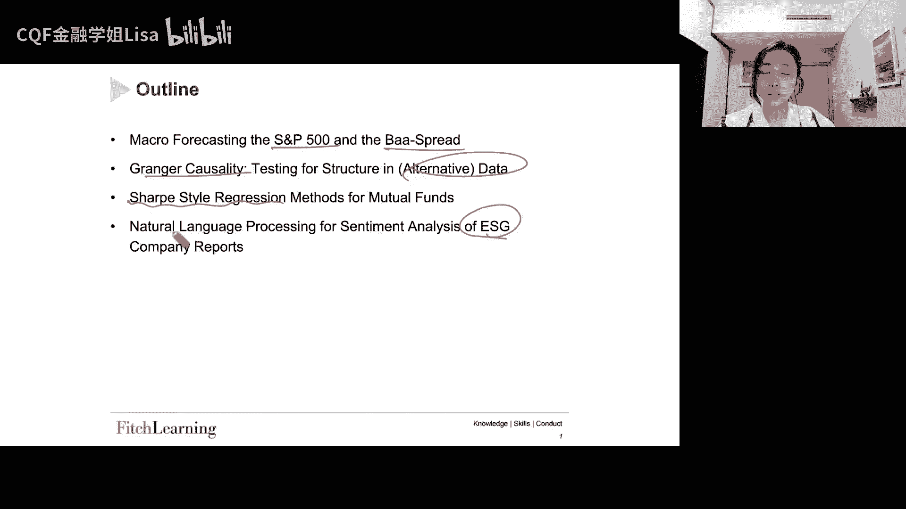

这个是我们今天晚上会看到的四个case嗯，然后首先呢先来看一下，就是嗯这个AI或者是ml哈，这个机器学习它在金融领域的一些典型的呃，这个应用好，那么第一个应用呢就是这个就是财务监控啊。

财务监控就是比如说嗯比如说网络安全啊，然后洗钱啊，然后这个欺诈识别啊哈欺诈检验啊，检测啊，那么对于这个欺诈检测呢，就是嗯应该来说是非监督式，非监督式学习，它其实也是适用的啊。

比如说我们可以去使用这个自组织映射啊，使用PCA啊，那么这个都是会在我们的就是下一个module哈，就是module five，然后去跟大家去介绍的好，然后还有包括我们也可以把我们的机器学习呢。

去用到这个信贷组合管理，比如说你可以去预测我们的一个损失率呀，也是可以去用的，然后包括像投资预测啊，那么我们其实今天晚上就会看的第一个case，就是宏观预测嘛，这个micro forecasting。

然后包括说我们的投资预测呢，其实也是可以用于这个呃智能投顾的对吧，就是我们可以从这个社交媒体，就是从这个客户的社交媒体的档案当中去啊，获取这个投资者的偏好，然后呢在基于投资者的偏好呢。

去给到为这个投资者量身定做的，一个最佳的投资组合选择，然后也为这个有战术资产配置，还有短期的这个战术资产配置，去提供回报的这个预测啊，这个也是可以用ml去实现的，然后还有包括像这个流程自动化。

就是比如说像chat bots对吧，聊天机器人它也是一个商业化的应用，然后包括像一些啊自动文档读取和存储啊，这些都是属于流程自动化，然后还有包括像算法交易对吧，你可以去啊这个读这个订单簿。

然后还有就是去做这个价格的短期预测好，然后呢，呃自然语言处理或者情绪分析也是可以去做的，比如说你可以从一个这个新闻哈，从这个新闻推送当中呢，去提取当前的一个市场情绪，然后并且把它用于这个股票交易。

然后啊我们就是有一个case啊，它其实就是我们会去试着去读一个，投资银行的报告，然后虽然说我们就是，其实就是那个ESG的那个case，但是我们去读他们这些投资银行的BS报告呢。

不是为了去做这个股票价格预测哈，但是他其实也是用到了这个自然语言处理好，还有包括说嗯这个辨别客户忠诚度，比如说你可以根据这个客户，就可以根据比如说用户的人口统计数据啊，然后根据这个客户的一个交易活动啊。

去预测这个用户行为，并且呢去给他提供个性化的产品哈哈等等等等，其实都是我们的这个机器学习，在金融领域的运用，所以呢其实我们的运用是非常广泛的好。

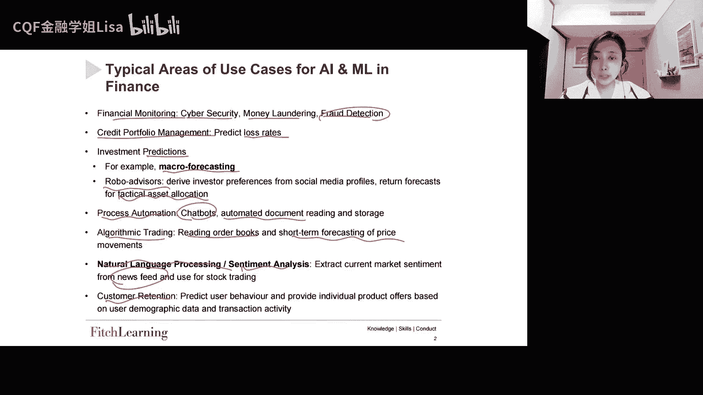

然后呢我们还是要回到说就什么是监督式学习，就是我们说监督式学习的话呢，它其实就是在尝试着去预测一个呃，叫做regression是吧，其实就是因变量哈，就是我们想要去预测的那个因子啊，回归因子。

然后呢我们其实使用的就是一些其他的变量，比如解释变量还REGRESSOR，就是解释变量X，我们就尝试用X或者是其他的一些变量，去解释这个Y，然后呢，因为这个映射就是X和Y之间的，这个函数关系哈。

这个是就是并不是就是并不准确嘛，我们并不知道，所以呢这里面其实有一个残差哈，然后呢这个函数FX是未知的，然后呢这个就是我们要预测所需要的东西，然后怎么去做呢，就是我们在这个呃预测时间序列的背景之下呢。

我们的第一个case就是，那我们就会去使用标普500去做宏观的预测，但我们有一个自变量，这个自变量自变量结合呢其实就是呃XT，然后呢它是T是作为它的一个时间索引的。

然后我们要去预测在T加一这个时间点的Y啊，这个是那我们在这个时间序列的这个背景之下。

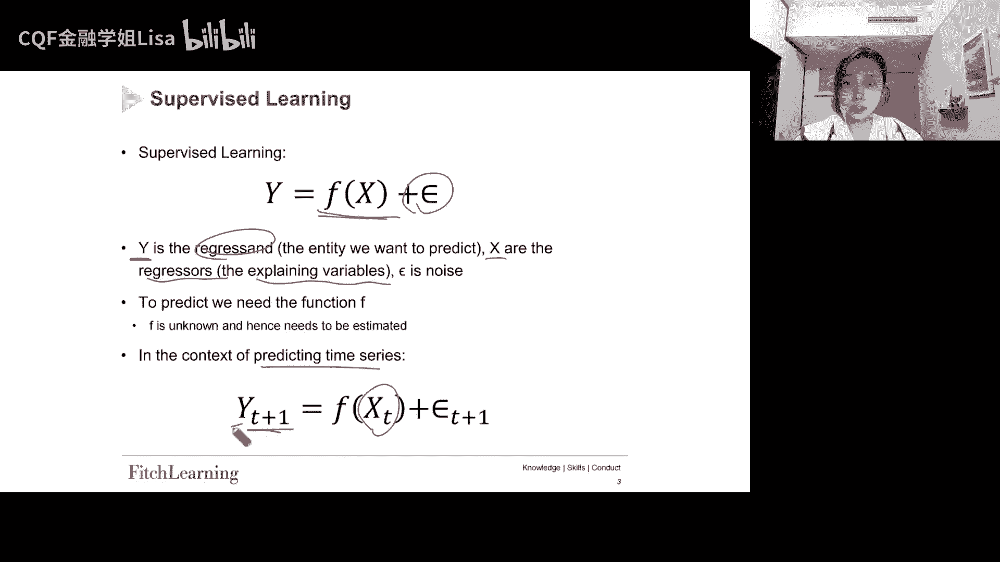

我们要做的事情好，然后呢我们来看一看，就是在金融领域的数据的特点哈，金融领域的数据到底有什么特别之处，那我们说呃金融领域的数据到底长什么样子，它跟其他学科啊的数据到底有什么不同，那我们说它的这些特点哈。

第一个就是它是一个叫做低信噪比对吧，signal to noise啊，低信噪比其实就是说我们的金融数据，它的噪音是很多的哈，就是noisy data它的噪音很多，然后呢它的数据当中的结构呢是比较弱的。

并且它会随着时间去发生变化，就是反复无常，然后呢影响数据的因素也很多，这是第一个特点，然后第二个呢就是这个反馈机制啊，反馈机制比如说就是这个A影响B，然后呢B又影响C，然后呢C又影响A。

它就是不断的这样反复反复啊，so on啊啊，所以呢我们其实有比较复杂的反馈机制，然后还有就是我们的这个数据的环境，是比较稀疏的，就是啊即使我们去看那种高频数据哈，即使是高频数据。

其实比如说你没几秒钟就有一个数据，就这种高频数据集其实也跟其他行业哈，跟很多其他行业比，我们的数据集依然是比较小的，比如说你跟像汽车行业相比啊，啊我们的这个数据集哈，就即使是高频数据，它提供的数据点。

也要比这个就是工业应用领域哈，工业应用程序要少得多啊，所以我们其实啊，这个我们的数据环境是非常的稀疏的好，还有就是我们的金融数据，应该很多都是时间序列数据，那么时间序列数据呢。

就是有字相关的一个特点对吧，还有就是它的一个这个时间序列的一个，趋势性的一个特性哈，那因为你是train的一个趋势性的话呢，就意味着你是非平稳的，然后呢但是呢你可能会有写整性对吧。

这个谐振后面会跟大家去讲，然后还有就是很多数据，它们会存在多重共线性呐，然后异常值啊，结构断裂啊，然后缺失值等等对吧，这些都是我们金融数据的一些特点好。

那我们来看第一个case，第一个case呢其实就是要去做宏观预测，那么这里呢我们使用的使用到的数据呢，其实都是从公开渠道下载的哈，其实就是yahoo finance去下载的，然后还有这个free啊。

freed就是美联储的经济数据库哈，是这个是federal reserve，然后这个是economic啊，这是data data set，这就是美联储的这个经济数据库，然后呢在这个case当中呢。

我们预测两个时间序列，就是标普500跟这个baa啊，就是DA利差，那么BA呢它是10年期的啊，就是40年期的，然后BA呢就是3B级嘛对吧，3B级的公司债的收益率，去减10年期的美国国债收益率。

这就是我们的BA利差，对BAB差，就是拿这个BA的这个33B级的，公司债的收益率去捡这个国债的，我就直接写TBD了哈，这个TBDYTM啊，得到的一个绿茶就是d a spread。

然后我们这边可以看到两幅图，就是它的时间都是从都是从1963到呃，呃1963~2019哈都是，然后嗯它是一个很长的一个时间序列，所以其实你可以看到左右两幅图的形态，其实差异是很大的。

左边这幅图呢它是一个趋势性对吧，就是我们的标普500，它是有一个很强的趋势性的向上的趋势，然后呢我们的BA的这个利差呢，它来利率嘛，毕竟它还是均值复归的好，所以呢这边是我们我们手上的是这个月度数据。

然后呢，我们就要试着去预测下一个月的一个情况。

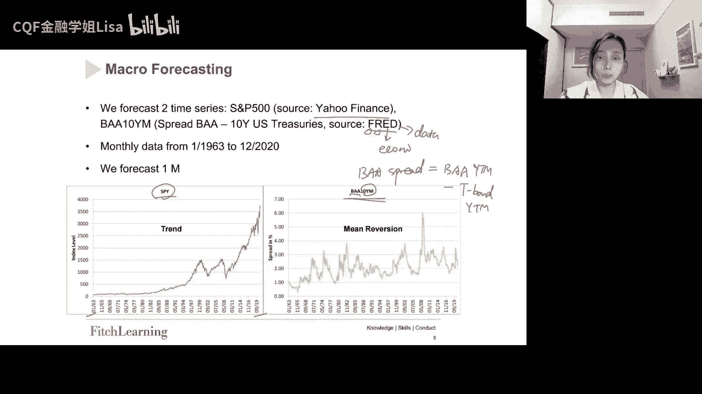

好，让我们说我们去使用这个机器学习方法，去做宏观预测，我们到底是在预期什么啊，到底是在就是我们管理预期，我们到底在预期什么，那我们说啊预期或者说预测哈，比如你要去预测GDP。

GDP就是一个这个宏观因子嘛，那你去预测GDP，还有包括说你去预测一些其他的宏观变量，的目的是什么，其实目的呢其实就是帮助我们去做资产配置，对不对啊，因为我们说的资产配置，就是你要把钱配置在股票上对吧。

或者说把钱配置在债券上，所以如果说我们把钱配置在股票上的话，我们是希望股票的环境好的，那如果说我们把钱配置在国债上的话，我们是希望这个就是国债的环境好，然后这两种环境哈可能不会同时出现。

一般来说一些资产类别，或者说就是一些风险比较大的，或者说一些就是风险溢价，他们其实是在繁荣时期效果比较好，比如说像大宗商品对吧，然后呢有一些资产类别它是在衰退时期哈，它的这个投资效果会比较好。

比如说就像国债，所以这就是为什么我们需要去预测宏观变量的，原因，就是为了去帮助我们去做资产配置好，这是第一点好，然后第二点呢呃第二点也很重要哈，就是这边呃引用了，其实我们全篇会引用很多很多的论文哈。

所以其实大家如果感兴趣也可以去看，然后这边的话呢是引用了这个KIMSWANSON的，2018年的这篇论文，然后还有包括这个COLLB啊，等人2020年的这篇论文，然后他们看了很多经济变量啊。

试着去做预测，好利用机器学习方法去做改进啊，然后他们的样本外的预测，就达到了平均3%到5%的一个，M s e，就他们的一个这个误差哈，其实还是比较小的，然后他们关注很多宏观变量，比如说失业率呀。

比如说M2增长啊啊等等，然后一方面呢用一个非常简单的模型，比如说就是一个ARE模型啊，这个一阶的自回归模型，然后去做了一个预测啊，算出一个MSE好，然后呢，又用这种就是相对来说比较复杂的机器学习。

去对同样的变量去做预测，然后发现呢就是他发现这个MSE呢是下降了，平均大概3%到5%的一个水平，就是如果你用这个ms用ml的话哈，你用ml的话呢，它的这个啊MC呢是平均下降了这个，3%到5%。

然后但是呢就是呃，其实这3%到5%也并不是很多哈，它其实并不是说30%，50%这个量级啊，但是呢就是还是有，还是能够能够给到我们一些启示的对吧，所以这个其实是对我们的预期管理是有帮助的，然后他们发现呢。

对于一些比较长的这个预测范围，比如说三个月的24个月啊，比如说三个月啊，然后12个月，然后18个月，然后24个月哈，比如这样的一些预测期间，就是ml的，就是我们的机器学习的改进幅度是更大的啊。

所以他这边是他们的这篇论文的一个啊，一个这个结论哈，然后呢他说我们说通过这个结论我们可以得到，我们可以去推测什么呢，我们说就这就意味着这种情况之下，数据越结构化吗，噪音越小吗。

当然这个是要去打一个问号的好，然后呢还有就是当我们去对变量去进行预处理，当我们去对变量进行预处理，比如说你要去用PCA，去对它进行预处理的时候，那么啊就是你预计会有非常显著的一些改进哈。

然后我们之后会跟大家去讲，PCA就是M5，然后我们这节课呢，先暂时先保持这些变量不变好。

然后我们来看一下它的这个宏观预测，就是这里能有一个相关系数矩阵哈，就是各个变量之间的一个相关系数，然后同样的，他用的是63年2月到，2020年10月的一个月度数据哈，Monthly data。

然后我们就我们用这两个滞后一个月的变量哈，好我们用这两个之后一个月的变量来预测，变量本身好，用之后一个月的变量来预测这个变量本身好，然后所有变量都反映了月度百分比的变化，然后这个表呢就是各个变量。

两两之间的相关系数矩阵，那如果说你看同期相关性哈，比如说好像这个变量就是US10Y减1Y啊，这个变量的话呢，它其实就是利率曲线的形状，拿10年期的利率去减一年期的利率。

然后你去看它跟其他变量的一个相关性哈，其实你会发现，它跟其他变量的相关性是非常低的，对怎么0。零点零一啊，0。08呀，零呀0。05对吧，它跟其他变量的相关性其实非常的低，像他跟这个好。

10年期的波动率的相关性是毫无相关性，然后呢和这个嗯就是BA10Y哈，就是10年期的，这个就是3B级的公司债的收益率呢，是相对来说这个相关性稍微高一点，因为他们都是利率嘛，所以这个也是可以理解的好。

就是先看一下各个变量之间的关系好，然后呢我们要去做这个预测，我们先来去看benchmark model。

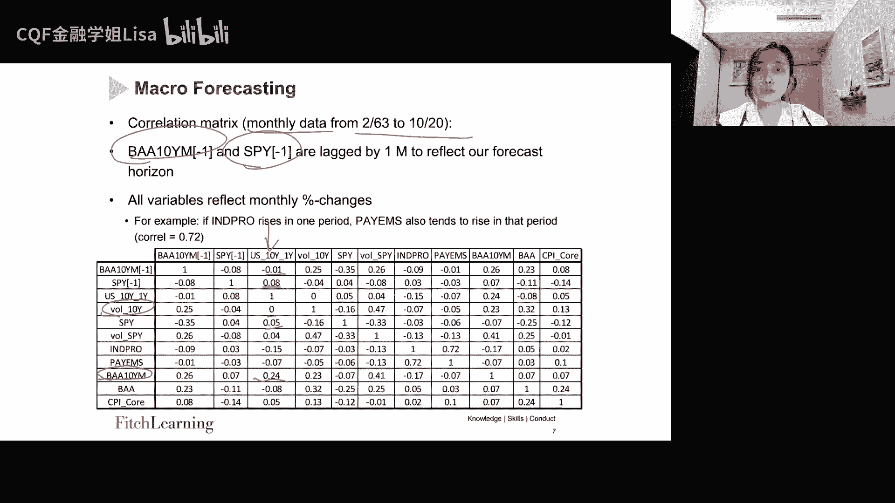

先去看基准模型啊，就是一个非常简单的一个基准模型，然后就是自回归模型，就是这个AR模型，它非常简单的自回归模型，它所以它用的是变量的N阶之后，N阶之后下来预测未来的Y，所以他是拿啊YTYT减一。

然后一直在Y1直到YT减N加一哈，这么多的之后项去预测YT加一啊，这样的一个啊AR模型，然后呢他要预测的这个因变量哈，就是时间T加一的Y，然后自变量呢就是在时间TT减一，然后一直到T减N加一的这个Y。

然后还有包括像这个常数项和残差项对吧，那这个模型很简单哈，好这个是，然后呢我们的benchmark其实就是用的ARE，就是一阶的自回归模型。

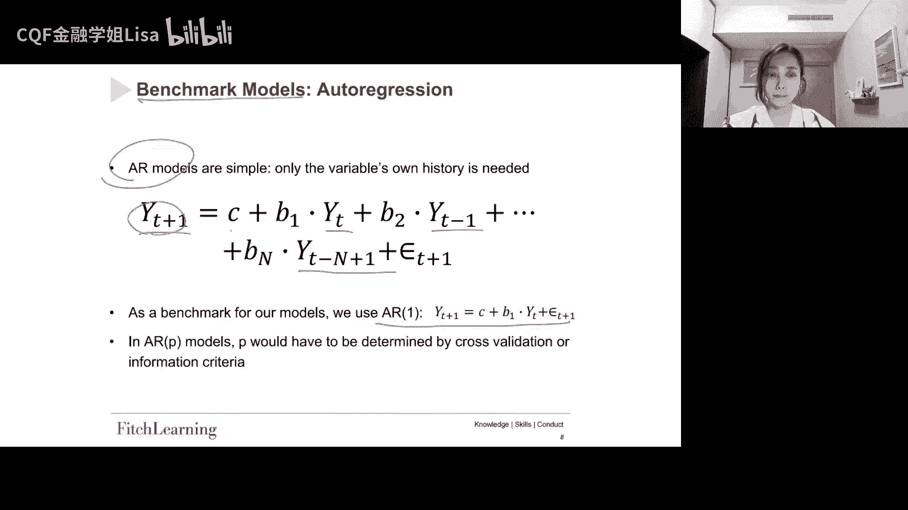

好，然后呢我们来看一下嗯，这个是benchmark model，然后接下来呢他来做了一个，就是机器学习模型好，我们接下来就来看去做宏观预测的ml的方法，那我们的ml方法就比较多哈，他选了好几个。

比如说线性回归，比如说决策树，比如说随机森林，比如说extreme gradient boosting啊，这个extreme gradient boosting，是我们明天会讲的Python lab。

所以我今天先就是大概的认识一下，所以我们会去展示这1234这四个模型，然后加上我们之前的那个benchmark a r1，就是一共有五个不同的模型。

所以我们其实是会做一个horse horse race啊，去做一个赛马，看到底哪一个模型，它是这个根据他的这个样本外的预测，当你看到OOS就是out of sample，它的样本外的预测啊。

根据它的样本外预测的表现，哪个模型是最好的啊，我们来我们回来看一看，然后呢我们去做这个滚动回归哈，滚动回归和这个样本外预测，然后呢，它的样本类呢，其实就是58个月的数据就滚动哈。

他们就不断的去滚动去做回归，然后第一个滚动的话呢就是前前60个月，然后前60个月当中呢，有58个月是in sample好，然后呢有一个月的gap啊，一个月的间隔，我们后面会跟大家讲。

为什么要有一个月的间隔，其实就是为了防止这个data leakage，就是叫所谓的数据泄露哈，好还有就是嗯这个一个月的out of sample哈，预测out of sample的一个月的数据好。

所以呢这个啊一次滚动回归呢，其实就是六个月的数据啊，所以这个是这个RR就是rolling regression，regression的意思哈，好所以根据这60位的数据点做一个滚动回归。

然后呢你再你再去就是移动你的时间窗口啊，你到下一个60个月啊，又去做一次滚动回归，所以你就有，其实有很多很多的这个滚动回归了好，所以我们这里给我们展示了就是第一次，第一次这个滚动回归的时间窗口。

就是它的in sample，就是63年2月份到67年12月，就是58个月，然后呢预测的就是68年2月out of sample，因为中间68年1月是get嘛好，然后呢呃这是第二次滚动回归。

然后到635次，这是最后一次out of sample预测，所以他的这个in sample，是16年1月到20年10月，然后gap一个月，然后20年12月去作为他的一个out of sample。

预测啊，这是他的一个这个这个情况哈，好像一共做了635次的滚动回归好。

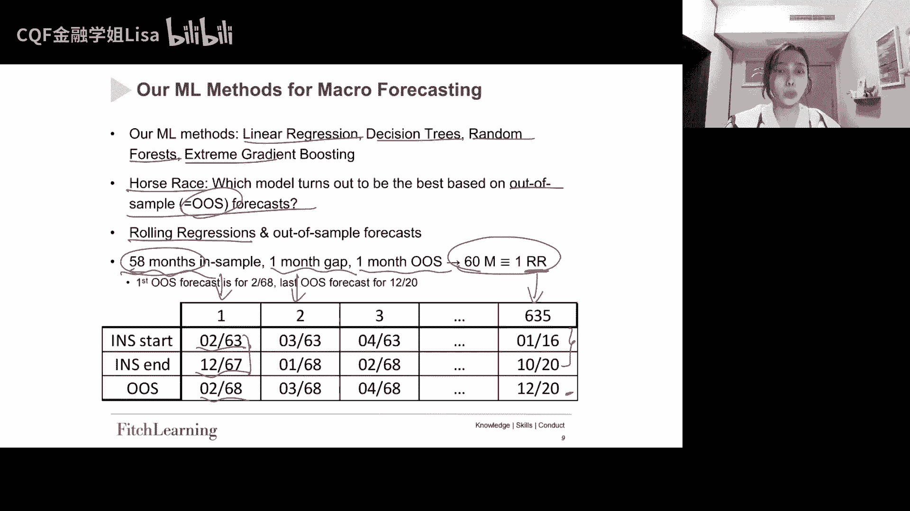

然后决策树就刚刚这个是回归，然后呢接下来决策树，决策树的话我们之前是讲过吗，我们之前学过，那么这里的话我们有第635次滚动回归，也就是啊这里哈他就是这个其实是最后一次嘛，Sample。

然后我们来看一下他的这个决策树，这个决策树呢就是基于这个数据去构建的，然后他最终得到了六个最终的节点，就是六个叶子嘛，然后我们解读一下这个决策树，这里的因变量是标普500对吧，我们要预测的是标普500。

然后我们可以看到它的这个就是第一次分割哈，first这个第一次分割呢，它的这个feature是pain，pain on是什么呢，patient是这个NO farm paros，就是美国的非农数据啊。

非农数据，然后他这边说啊，如果非农数据是大于等于0。092的，如果是yes的话呢，就直接到这个这个叶子这个note啊，如果不是的话，那就往这边走啊，所以我们可以看到如果它大于等于0。092。

它往左边这个节点，你看你可以看到这个节点，标普500是跌了很多的对吧，跌了70%啊，跌了70%，所以呢就是大家都觉得很奇怪对吧，为什么非农数据这么好，但是它的标普500会跌这么多呢，这个合理吗。

好其实你可以这样去想，就是如果说我们有一个强力上涨的经济，那是标普败为什么会大跌呢，那这边呢教授给到我们的一个解释呢，他是他说认为啊，因为这里所取的这个数据是，201616年到2020年。

然后这段时间呢是正好是处于，所以如果说这个payroll这个数字上升的话啊，那么市场参与者会认为，如果它数字上升的话，就说明可能市场过热嘛，那么大家可能就会预期，那么这个呢对标普500的影响是很大的啊。

所以这就是为什么当他的这个配乐这个数据，费用数据大的时候，这个标普白反而还跌了70%，这个是教授给到我们一个解释好，然后那我们还可以看这个节点啊，这个节点的话呢，就是如果我们的非农数据没有超过0。

092，然后并且呢第二个第二次分割的话呢，我们的feature是s spy嘛，就是s spy这个指数，然后它呢是就是大于等于-0。24，然后嗯如果说它是大于等于-0。24，应该是yes，这个应该是NO。

啊对如果它是NO的话，那就说明他这边NO的话，它本身就之前SPY应该是在大跌的，然后这个情况之下呢，我们会预测这个决策是预测出来，SP就是标普500，它会有一个82%的一个上涨。

那它其实就是他怎么去解释呢，他是这样解释的，他说因为你在这里，s spy是在一个大幅的下跌嘛对吧，这里呢s spy是在大幅下跌的，所以呢如果s spy在前一时期大幅下跌。

那么他接下来应该就会rebound就是触底反弹，所以接下来的话呢，我们的这个标普500应该会有一个强劲的上涨，他说他这样是这样去解释的，所以通过这个决策树，它给到我们的不同的节点哈，不同的情况之下。

我们的这个标500会有什么样的一个表现哈，他就给我们预测出来了啊。

好然后这里呢用了另外一个时间段的数据啊，这边就不详细讲了。

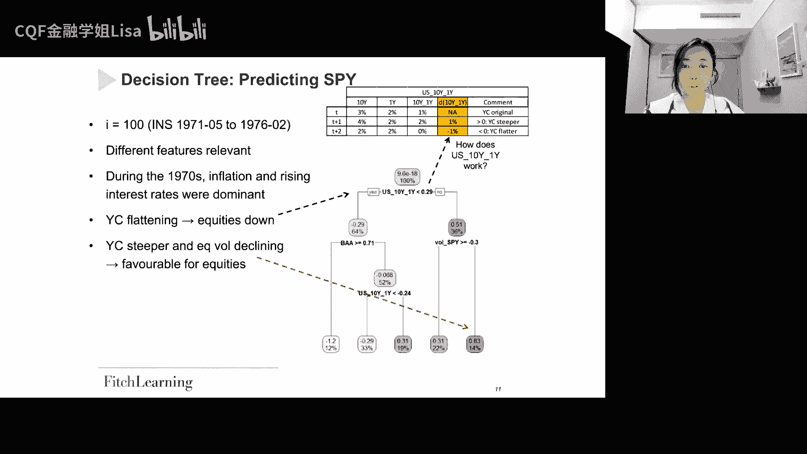

大家可以自己去看一看，好，那我们其实已经讨论了决策树，然后接下来我们来看这个随机森林，因为我们知道随机森林，随机森林它是生成大量的随机数，然后每一个数都使用不同的训练数据自己。

然后训练这个数据子集呢是通过随机抽样对吧，在我们的这个啊原始数据当中，随机抽样去选择的，那这边的话呢就是我们有一个数据集，然后呢它是一个就是六个月的，这个60个月的数据，然后呢这个是他的就是第一个啊。

60个月的数据，是他第一个滚动回归使用的时期，然后呢这是第一个这个就是决策树啊，第一个随机森林基于这些变量去构建，就这一坨，然后呢往下呢就得到了这些叶子好，然后呢就是你做这些不止做一次对吧。

你做很多次啊，很多次，然后呢你对这些决策树呢去取平均，然后呢就会得到这个随机分离，就是如果说你是去做回归的话，那么就是平均，如果你是去做分类的话，那么就是少数服从多数。

然后去得到我们的final result，关于这个随机森林，关于这个就是begging和boosting的话，其实我们下节Python还会详细去讲好。

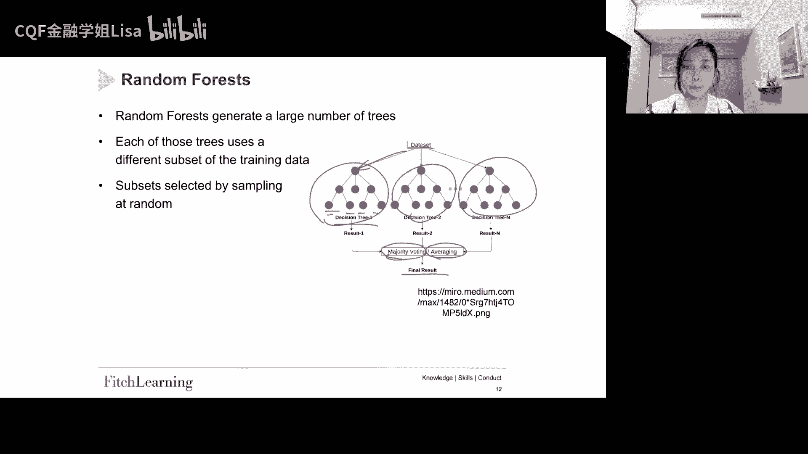

然后呢，我们如何去决定在这个机器学习模型当中，的参数呢，就我们说了，在ml这个模型当中有很多超参数嘛，比如说在随机森林当中，你可以选择有多少棵树，然后呢树的深度怎么样等等对吧。

那我们如何去决定这些参数呢，这个其实是我们之前学过的哈，我们的这个交叉验证，我们是通过交叉验证的表现来去做，这个就是超参数的调整的，对吧好，那这边的话呢就是到底我们应该挑哪个，这个超参数。

在我们的答案就是在这个交叉验证当中，那么交叉验证的目的，就是我们想要去确定一个稳健的模型，然后他在预测未知数据的时候表现的很好啊。

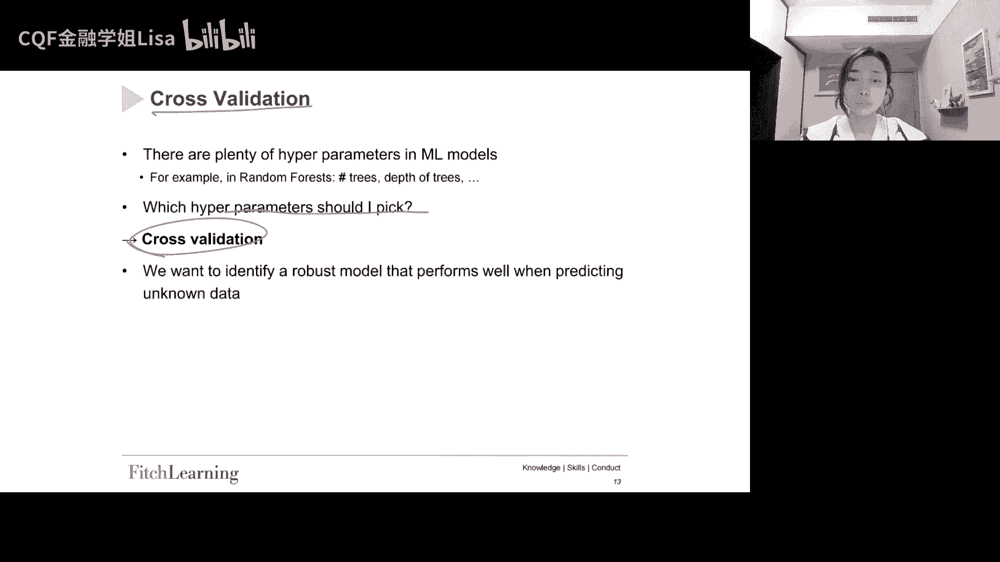

所以这些其实我们都讲过啊，这个交叉验证，然后我们来看一下，就是有不同的方法来做交叉验证，那么这里呢给我们展现两种方法，一种呢就叫做sole out of sample，然后也讲一种叫k fold。

其实k fold我们其实已经见过了对吧，那我们来看一个example，就是我们想要预测这个后一期的啊，就是one ahead哈，就是我一般会找后一期的，我们想预测后一期，然后呢我们有两个滚动平均啊。

滚动回归就是A和B这两个滚动回归好，然后呢如果说第一种就是Sol o o s啊，如果对Sol o s，我们其实就是对每个滚动回归，只有一个交叉验证，也就是这幅图你可以看到我们有滚动回归A。

然后呢有滚动回归B，我们可以看到滚滚动回归A，它是开始于数据点一，然后呢延伸到数据点七，这个是它的训练数据，然后我们就是利用这个训练数据，去构建模型对吧，然后呢再利用后面的啊，他这边gap了一下。

然后利用后面的这个九和十这两个数据点，来去做针对这个模型的交叉验证好，然后我们我们想要预测的是，第12个这个数据点，这个红色的第12个数据点，然后呢对于这个滚动回归B也是一样的啊。

只不过呢它的这个数据就是往前移了一期对吧，它是使用这个2~87的这个数据点，来去训练模型好，然后呢，用这个黄色的十十一的这个数据点，去做交叉验证好，然后呢找到最佳模型之后。

然后用这个模型去预测这个第13，这个这个数据点，这个就是sodo out of sample交叉验证的逻辑哈，也是我们最最基本的这个交叉验证的逻辑好。

但是呢你会发现这个soo out of sample呢，它其实有一个问题，就是它的数据没有被高效的使用对吧，这个数据能不能更高效的去使用呢，因为这里只能做一个交叉验证对吧。

它的这个数据并没有特别高效的使用，然后呢这个问题呢，它其实是可以被我们的k fold，交叉验证去解决的，那么这个我们其实之前讲过哈，那比如说现在呢我们假设我们的K等于二，那么这个K的话呢。

其实就是这个K就是你到底有几个fold，比如说你这个K等于二的话，就是两个fold好，那么两个fold的话，那么他的这个交叉验证我们回到这个case，我们有这个十个数据点啊，这里有十个数据点。

然后嗯就是我们的for的一，就是比如说嗯就是在这十个数据点当中，因为K等于二，K等于二的话呢，我们就分配五个数据点去给到每个fold，所以呢在这个rolling regression a当中。

我们的fold1就是它的数据点1~5，然后呢它的fold2就是数减6~10啊，它这个图呢它不是按照这个顺序去写的啊，所以你可以这样去想啊，就是这样就是我们这两个fold，这是fold，第一个fold。

这是第二个fold对吧，那么第一个fold呢就是1~5这个数据点，然后第二个fold就是6~10这个数据点好，然后呢我们的B的话也是两个这个fold啊，第一个fold是2。2。6。

然后呢第二个fold是7~11啊，所以以此以此类推嘛好，所以呢在这个嗯，就所以对于对于一个这种滚动回归的话呢，其实我们就不再只能做像这样的一个，交叉验证了对吧，我们就可以做四个。

就是像我们右边这个图这样子A可以做四个，B可以做四个，当然这边它不是按照我们这个，不是我们按照这个顺序来列的哈，但是它的逻辑是一样的好，所以呢就是同样的，就是我们的绿色的点是用来去训练这个模型的。

训练估计这个模型，然后黄色点呢是来去做交叉验证，然后呢我们要预测的就是红色的这个数据点，那么这个呢就是soo out of sample，跟k fold交叉验证的区别，那么如果你想看更多的细节的话。

那你就可以去看这个参考材料，好但是我们要知道哈，就是在k for当中，就是你把序列切割到fold当中的话，会失去时间序列的性质，对不对，所以其实我们上节课哈，上上节课吧也跟大家去讲过。

如果说你面对的是时间序列的话，你该怎么样去做这个交叉验证对吧，有一些不同的方法好。

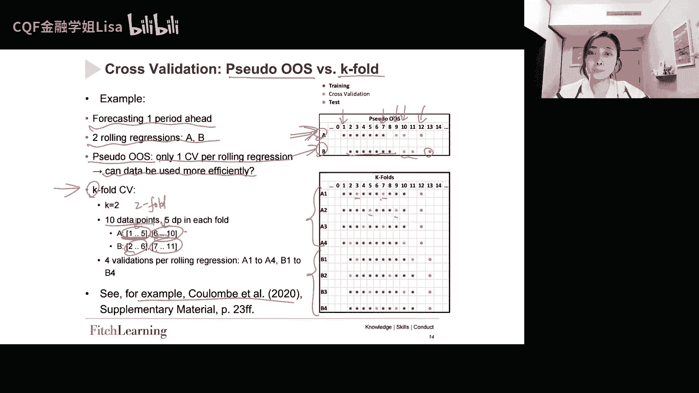

然后接下来我们来介绍一下data leakage，这个概念呢其实我们已经见过很多次了，但是一直都没有就是正经的去介绍过它，所以我们来看一下这套linkage到底是什么，就是这个模型。

它包含了做出预测的时候不可用的信息，对这个模型，它包含了做出预测的时候不可用的信息，那么它会有什么样的一个后果呢，它的后果就是它会带来过于乐观的模型，就是如果不是完全无效的话，那么它就是过于乐观的模型。

为什么，因为我们包含了一些信息，这个信息在模型实际建立的时候是不可得的，比如说你的训练数据对吧，这个训练数据虽然说你站在现在，你的训练数据和测试数据都是历史数据，你都是拿得到的，但是你站在那个当下。

对你站在数据的当下，可能你把一些未来不可知的数据也包含进来了，我们一会儿会看一个这个图，帮大家去理解好，所以呢就是这个你包含了一些，这个在模型实际建立的时候不可得的信息，所以呢它会带来增强的表现啊。

他会就是让你的模型好像表现的很好，但是实际上叫做就是感觉就是在作弊对吧，这样作弊，然后呢它会导致我们的这个模型，他在可能在训练数据上很好，但是呢在这个未知数据上，在测试数据上可能就没有用。

然后还有就是我们的这个数据泄露哈，在它的它一般都是发生在时间序列预测上，就时间序列啊，比如说一个常见的错误，就是我们错误的把这个因变量去包含为，具有相同时间点的自变量。

然后呢这个呢也会使得我们的模型完全无效啊，所以就是你的模型当中，可能你把一些X变量，就是本来应该是比如放在测试数据里面的，未知的，你把它放到我们的训练当中，训练数据里面当成一个已知的。

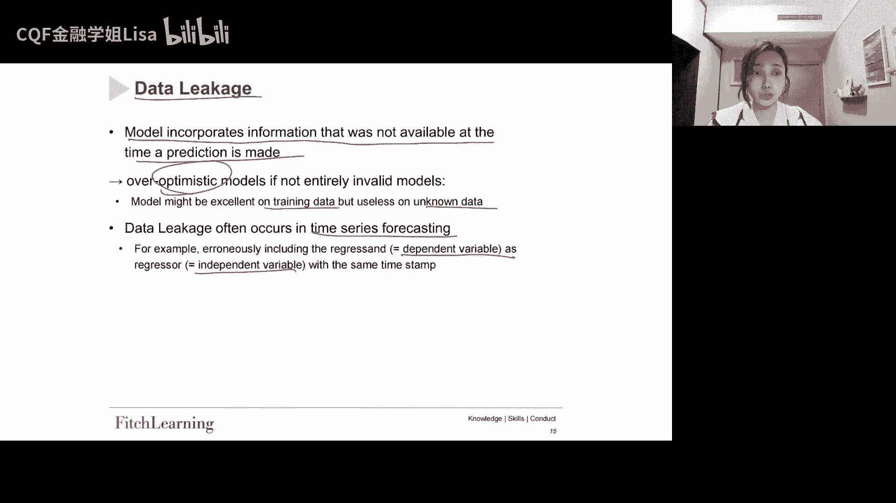

那么这样的话其实会有一个很严重的问题，所以我们来看一下这个图啊，这个图的话呢，其实就是要给我们详细的去解释一下，这个数据泄露，那假设我们有一个ARP的一个过程，就是这个P界的自回归。

然后呢我们的嗯就是自变量就是这个s RT，然后它呢是想去看SRT，然后影响SRT加一哈，这样一个就是自回归，就是所有的相关系数或者是顺序回归过程，它存在的这个情况之下。

然后呢我们说这个s reg t影响SRGT加一，所以呢这个rig，其实这个rig就是regression的意思，那就是regression好，然后呢在具有外生变量的过程当中呢，也是这个样子的哈。

就是如果你因为你这里都是一些内生的变量啊，如果有这个外生变量其实也是，比如说你的自变量是x RT，然后呢你的因变量是SDT加一对，就是外生变量，那么其实这个data data linkage啊。

它就是它这个也是会存在的，那我们说data liage到底是在哪里发生呢，我们来看一下这个表，那么在这个表呢我们可以看到哈，我们先看上面这个表，上面这个表呢就是leakage存在的时候。

然后下面这个表呢是没有这个leakage的情况好，所以呢在我们这个表当中，你可以看到这个是in sample，然后呢这个是out of sample，好然后我们想要用自变量。

就是这个SRGT来预测因变量SDET，也就是说你可以看到我们这里哈，有一些这个绿色的圈，也就是我们是利用T时间点的X来预测，T加一时间点的Y，然后呢我们把这两个时间点给联系起来。

那么这个呢它其实在in3破这个区域，是没有问题的对吧，你看你看这个完全在in3国当中是没有问题的，这个是没有问题的，这个也是没有问题的，但是如果我们接近这个分界点，你可以看到这个是我们的分界点。

好当我们接近这个分界点，我们用这个67年12月31日的数据，来构建模型，然后它的因变量的时间点是，68年1月31号，那么由于我们在这里砍一刀对吧，在这里砍一刀的话呢。

其实就会导致这个data leakage的发生，就是68年1月的这个信息，它会被分割给in sample，就是我们把这个68年1月31号的，这个信息，因为这个信息。

他要他是要在68年1月底才能已知的信息，但是我们把这个信息呢已经给他分，分割给这个in sample，所以这里其实就是data leakage发生的地方，所以怎么样去解决这个问题呢，其实就是看这个表好。

所以这个代表呢就是NO likage，我们就是简单的怎么样呢，把这部分的数据给它排除出去啊，所以这是为什么我们可以看到gap的原因哈，好所以呢像在这里在这里的话呢。

我们的in sample和out of side，out of sample有重合，所以呢我们就把这部分重合的数据给它排除掉，那么这样的话呢，我们其实啊in3pro就只有。

就是我们一共就只有58个数据点了，那你可以看到之前是有59个数据点，现在我们就只有这个58个数据点啊，所以我们就牺牲掉了一个数据点，但是我们避免了这个data linkage的问题啊。

所以要避免linkage的话，那我们就我们就需要把这个in sample跟out of sample，当中重合的时机给它排除出去，好这个就是什么是data leakage哈。

给大家讲清楚了好，然后呢对于这个时间序列的交叉验证，好在时间序列当中，我们知道序列是有相关性的好，那么我们的serial correlation序列相关性，所以呢如果说你直接去切割这个fold对吧。

你直接去切割这个fold的话呢，它是会破坏我们时间序列的这个特性的好，那么我们再拆分这个数据，就是我们在拆分我们拆分数据，并且保留就是这个数据的，就是earlier part这个数据的早期部分。

然后就意味着我们用未来数据去训练模型，以预测过去对吧，如果说你在follow的时候，它已经打破了我们的整个时间序列的这个顺序，你可能就是在用未来的数据训练模型，然后去预测过去，那么就是非常不合理的好。

但是呢有一个新的发现哈，有一个新的发现，就是如果啊这边也是来自于这个bug，mile等其他人，2018年的论文，就是如果我们的时间序列模型的残差，是序列不相关的啊，如果残差是序列不相关的，那么可以好。

并且应该在保持这个策略上面去使用k fold，交叉验证，所以这个是2018年的一个新的发现啊，一个非常重要的一个发现，所以呢就是如果有了这个发现的话，那你就还是可以去用k fold的一个交叉验证。

那么在这个发现之前，在这个发现之前呢，其实一个主要的建议是使用h block交叉验证，那是借鉴的是这篇论文，然后呢这个block的这个交叉验证的case当中呢，我们会拿出H歌观测值，拿出H的观测值啊。

其实就是我们会拿出观测值之前和之后的字，H1个观测值，我们后面有幅图啊，我们会拿出这个观测值，之前和之后的H1个观测值，比如H等于二，那么就是你这个观测值之前之后的两个观测值，然后把它给剔除掉。

然后呢结果就是会导致我们的训练数据，它会少了2H个这个数据点，所以这个其实是对可得数据的一个低效使用啊，就是在2018年之前，其实用的都是这个方法，然后2018年之后呢，用的是就是可以去使用这个好。

所以我们可以看一下，就是在这个啊交叉验证的这个背景之下，我们怎么去解决这个data的问题，好，那这边的话呢就是说如果我们使用k fold，交叉验证对时间序列的话。

那么这个就是这个linkage怎么办对吧，那么他的这个解释就是说存在这个leakage，但是呢这个信息增益，它是要高于我们从这个数据中删除H行的一个，有害的影响的，对也就是说啊。

虽然说它确实存在了这样的一个这个leakage，对吧，如果说你要去用k for的话，那它确实存在这样的LIKI，但是呢他肯定还是要比这个就是你在，就是你删除H个这种啊，就是H行这个数据的一个影响。

相比它的信息增益其实是更高的好。

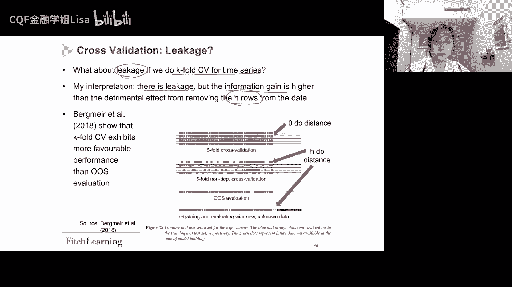

所以呢就是根据这个bug mile他们的一个建议。

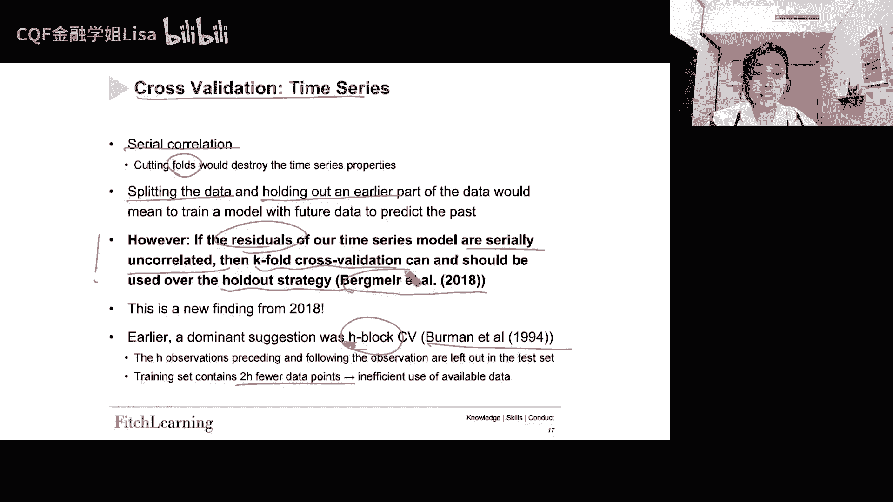

然后假设我们构建了一个模型，然后这个模型呢展示了残差之间的，残差之间的这个就是相关相关性是不存在的好，那这种这种情况之下，我们可以去使用k fold，然后我们可以看到右边这个图好，首先是这幅图。

这幅图呢其实就是k fold，然后它是一个5fold的一个交叉验证，所以呢我们在训练集就是蓝色点，就是我们的训练集，然后在这个训练集之间没有距离，就没有gap短，你会发现没有gap。

然后呢这个交叉验证集呢就是黄色的，所以呢这里呢，其实我们就是跟随了这个这个BGMAIL的，这个建议，我们做了这个5fold的这样的一个交叉验证，然后没有任何的gap，因为他说了吗。

他说了这个就是linkage的信息呃，他的信息增益其实更强嘛，所以没有关系好，然后呢根据他们的这个论文，他们的这个论文表明呢，就是这个k fold的这个交叉验证的表现。

其实要比这个out of sample，就是有更有力的一些性能，还是表现得更好好，然后另外的话呢，这个就是我们的out of sample的这个这个EVATION，好我们先来看这幅图，这幅图的话呢。

其实就是跟随了这个啊，波尔曼他们的这个这个建议哈，就他的这个brook的这个交叉验证，所以呢你可以看到它是把这个观测值，之前和之后的H个观测值拿出来了，所以你可以看到在这幅图里面。

我们是不是蓝色的点少了很多对吧，所以呢它其实是一个低效的处理数据的方式，好然后呢在下面这个就是我们的out of sample，一百六一审哈。

就是out of sample评估sole out of sample，然后呢他就是使用蓝色点来构建模型，然后使用橙色点来做交叉验证，然后呢这边我们就只有一个哈，就只做了一个交叉验证。

然后呢嗯对就不像这里，这里我们其实也是有五个fold的对吧，甚至你还可以有十个fold，就取决于你到底有多少个数据点啊，所以呢你从k fold可以得到很多交叉验证集。

相比这个soo out of sample估计来看，然后假设我们做完这个交叉验证好，然后呢我们嗯找到了我们的模型，然后我们要做的呢，就是呃我们要去拿我们的所有的这个，in sample的数据。

就是这里这里是INSIMPLE的数据，我们要去拿我们的INSIMPLE的数据，然后呢现在呢就是当你要去，就是假设我们做完了交叉验证了，我们找到我们的模型了，我们要做的就是要把我们的这个橙色的。

之前的是样本外的数据，把它呢去转换成这个蓝色的点，把它转换成这个in sample，然后重新去训练模型，然后得到模型的这个新的参数好，然后再用这个绿色的这个点，然后在模型构建的时候。

就是拿他的未来的数据，然后再去做估计啊，这个其实就是在时间序列当中的交叉验证。

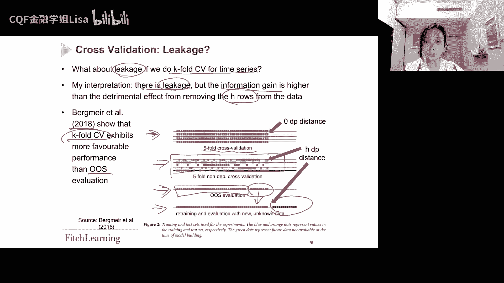

然后rolling window expanding window，这个其实也是我们之前见过的，就是这个滚动窗口啊，滚滚动窗口，比如说你要先做回归A，那么你用的呢就是这个1~5的数据点，去构建模型。

然后去做预测啊，预测这个七这个数据点好，然后呢再对B对吧，然后B的话呢，就是也是你把整个的这个in sample的数据点给它，就是往后移一期，然后同样去构建模型，做预测对吧，然后去做对。

然后不断的这样去，这个是rolling window，那么这个rolling window它的好处是什么呢，它的好处呢，就是它可以比较灵活的去考虑这个数据的变化，就是数据当中的任意结构。

可能在很久之前就发生了，然后呢这个旧的结构它也是最近数据的一部分，那这样的话我们就不会因为排除数据而犯错，对吧，因为你在不断的去滚动嘛，好比如说像我们1970年的结构啊。

它它的这个作用可能在2020年啊，依然有效啊，那么这个呢就是为什么滚动窗口，它总是被偏好的原因，所以他处理了非常旧的哈，因此可能不相关的数据，然后因此的话呢，其实对模型不稳定性的问题。

是会更加的稳健的好，然后它的缺点，他的缺点就是这个滚动窗口太短啊，滚动窗口太短，然后无法获取相关的一些信息，那么这个时候呢其实就会啊，就会出现expanding对吧。

expanding呢其实就会解决这个滚动窗口时间，这个窗口太短了这个问题啊，所以expanding的话那就长成这个样子哈，expanding窗口也是经常被使用的。

所以expanding的话呢就是比如说在A当中，我们的样本数据是1~5，然后接着呢在BB样本数据点当中就是1~6，不断的去扩展这个样本啊，所以就是rolling当中呢。

它的in sample这个样本量是固定的，但是expanding它是不断扩展的啊，这都是我们之前见过的。

然后这两个哪个更好好，rolling window还是expanding window，那这边的话呢也是根据啊，king benson他们在2018年的这个论文，就是说啊他再去这个构建往后一步。

这个对往后一步预测的时候，这个扩展窗口，它的这个估计策略主导了滚动窗口，好但是呢就是呃教授呢他个人认为哈，就是当你只预测往后一个月，那为什么很久以前的数据依然相关呢，就这其实是一个问题啊。

这个是教授的一个想法，另外的话呢就是啊短期的信号当中，是不是有更多的噪声，就是这个呢是这篇论文认为，expanding被偏好的原因，就是他觉得这个短期的信号里面有更多的噪音，但是呢就是教授呢他还是哈。

他他认为呢，就是他认为他们的这个发现是反常识的好，然后同样的也是他们的这个他们的这个发现哈，就是在较长的这个预测窗口当中，预测范围之内啊，这个啊rolling estimation。

methods是要比expanding window更可取的，所以就这个认为其实也是反常识的，就是教授认为预测长期期限的expanding，应该更好才对，但是反正尽管有这个发现吧。

我们还是使用滚动窗口来做宏观预测啊，采取一些就是前所未有的行动的时期，我们对一个月的预测感兴趣，因为在七十八十九十年代，这个就是空前的举措的啊。

所以其实这里呢我们还是使用的是rolling window啊，所以呢其实就是啊到底偏好expanding啊，还是偏好rolling啊，可能就是每个人有每个人不同的观点。

所以大家其实你也可以有你自己的观点好，然后呢关于这个模型稳定性的一些问题，然后大家可以去看这个，如果你感兴趣的话，有更多的细节。

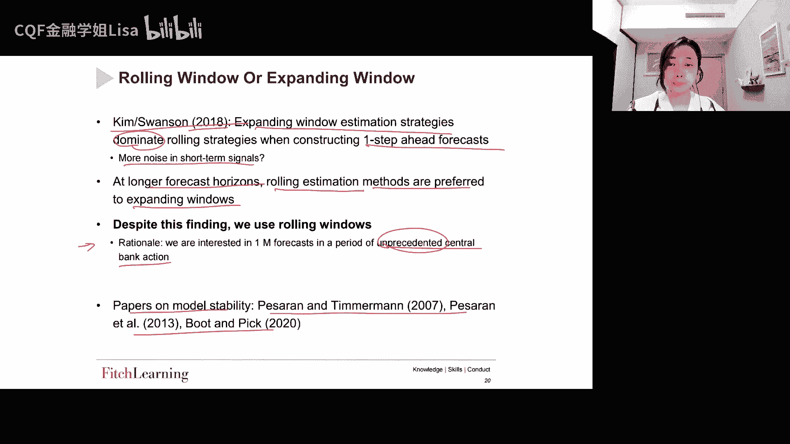

好然后另外一个艺术另外一个优秀的话呢，就是我们构建预测模型，需要去做这个数据的预处理啊，这个其实也是我们见过的哈，就是我们再去对数据去做预处理的时候呢，我们需不需要去做这个差分呢。

或者我们是不是要去计算回报率啊，好那这边的话呢就是嗯告诉我们说数据的性质，它需要不同的预处理的方法啊，就比如说你拿到价格啊，你拿到比如说SP500，你要不要去look一下，对不对。

所以不同的这个数据它有不同的这个处理方法，所以这边的话也是KIMDAON，他们给到我们的这样一张表，就是不同的这个这个时间序列，不同的时间序列，它的这个预处理的方式是不一样的，比如说针对失业率好。

针对失业率的话呢，我们的预处理的方式方式，其实就是就是差分对ZT加一减去ZT，对，因为嗯就是他这边其实是建议了，针对这种时间序列，合适的预处理方法来实现平稳性，就这个STATIONALITY哈平稳。

然后因为我们想要在模型有平稳的变量，我们不想去使用时间序列的这个趋势嗯，因为我们知道就是具有趋势性的时间序列，其实就是像我们之前看过的那个标普500，它是一个很明显的一个趋势性的对吧。

但是呢如果我们把趋势性的时间序列放入模型，它会给到我们嗯比较不有效的结果。

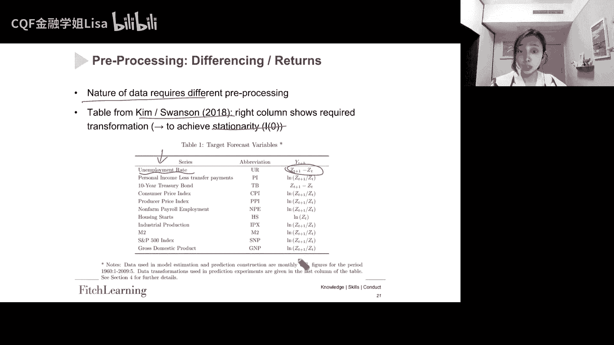