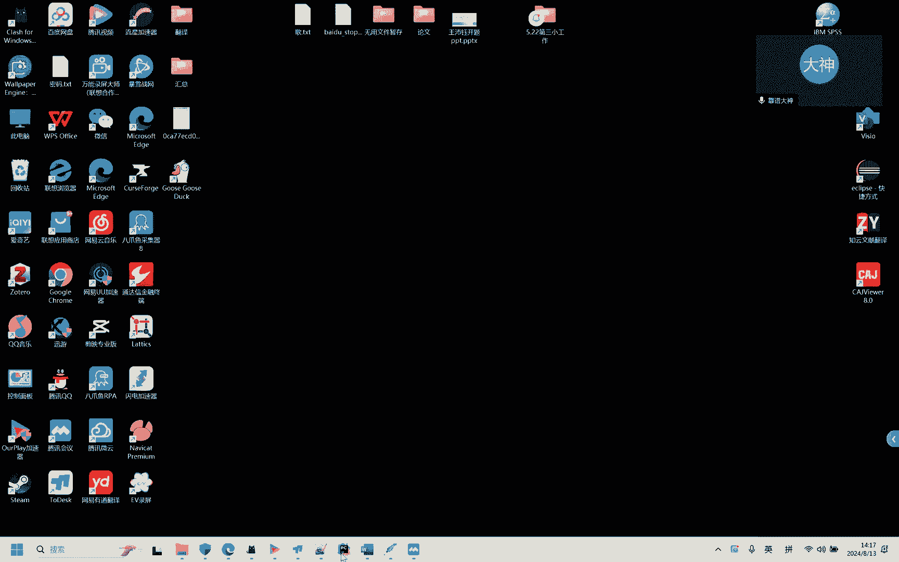
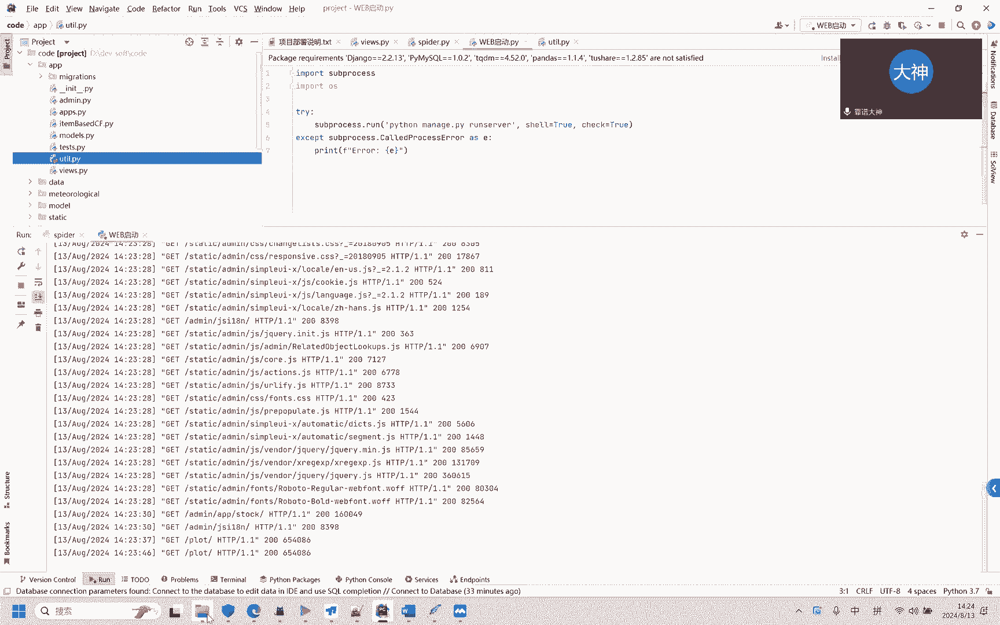

# 计算机毕业设计Python+Tensorflow股票推荐系统 股票预测系统 股票可视化 股票数据分析 量化交易系统 股票爬虫 股票K线图 大数据毕业设计 AI - P1 - 计算机毕业设计大学 - BV18x4y147Jp

这个系统是这样的，先是用爬虫把这个数据从这个spider看见，这个底下有个spider spider呢，它我们使用的是一个聚合接口，这个聚合接口是免费的，然后每天好像是能限制用5000次的。

然后这是它接口的地址，使用这个接口地址的话，能拿到爬虫数据，然后我们现在先启动爬虫，让它往这里面灌数据，我们看这个数据库里面的数据，有有24年6月26号的最新的嘛，然后我们现在看看他们能不能爬。

8月份的，我们让他爬，8月份的，我们试一下，我们现在先启动爬虫，你看它爬一条，我让它休眠八秒，主要是为了那个方方便后续使用，因为你爬的太快的话，接口容易死，你看好了，他又爬了一条。

然后我们现在的话是需要的话，我们是在这看一下2024杠零八有数据吗，你点这个过滤一下，看有的有的你看8号的数据已经有了两条了，这也是两条，哎呀三条了三条了，看见没有，这里面也进了好多条，不过得慢慢来。

因为两边的话会有点不一样，但是不影响你看1234条了，因为它进来的慢，你看见没有，它进来的慢，它关，然后呢我们现在然后打开那个叫啥，打开这个文件，这个是启动页面的。

然后所有的页面代码都在这个views里面，还有算法都在这个views里面和这个YOUTUS里面，看见没有预测什么算法之内，缺值不值都在youtube view和views里面。

所有的那个算法都和那个控制器都在vs youtube里面，然后推荐算法是在item base cf里面，然后我们现在需要的话是启动我们这个web端，我们去看一下，刚启动好了的话。

我们在这里复制一下这个八千八千是到哪了，我们再打开一个到这8000，然后他到了这个界面，到了这个界面，登录账号密码在哪呢，这边有一个app杠user，我们看一下这张表，然后点开这个数据。

我们在这看有个登录名叫阿的命斯，密码，也叫阿德命思，然后我们在这输入阿命斯阿命思，我们登进去，然后反应有点慢啊，可以不着急，我看看他哎，他报啥错呢，Data is look，数据库被锁。

主要是因为这有爬虫，你知道吧，所以我们先把爬虫关了一会，你再慢慢猜，采完你再运行这个web，一般都是采完运行web，要不然它数据库被锁住了，你看见没，然后我们现在再试试，不然他数据库锁住，我们就用不了。

我们再来一次嗯，然后这边的话能看股票股票的新闻，这些你看都能看到，现在最新的能看见了吧，这些都是从同花顺上爬的数据，然后我们看这个股票信息，现在7月份的6月份的都有看见没有，然后这边有股票价格。

股票价格看见没有，然后日期呢也有，看见没有，然后我们到最后一页去看看，我们到第一页再来看看他这有股票代码，股票代码，我们到股票信息，这我们随便搜一个股票代码，比如说这个我看这股票价格，然后我们输入一下。

他这能选，我们稍微选一下，我们再选一个，欧版的，然后我们看我们爬的是哪些，我们爬的有一个，有个有个601515点SH，601515点SHH，我看有没有6015，这个需要慢慢找的路，你，这还不好找。

我们再找一个别的吧，你再查一下，看见没有，这些都能查的，然后还有那个了，60153，我看看153的有没有，然后这边是推荐股票，然后他能给你推荐一些股票，然后通过这个链接，你能点到股票的那个位置，看见没。

同花顺，他在同花顺上的位置，然后呢我们在这可以看单只股票可视化，单只的话这些就是他股票的走势图呀，你看见没有走势，还有那些预测都在这上面看见没有，这是走势啊，预测啊，什么都在这，我们随便选一个1599。

我们再试试，看见没有，他都会有一定的预测的之类的在里面，然后呢，然后呢这边是股票可视化，整体的可视化，你看这是整体的可视化，每日的最高价最低价整体的，然后这边有个后台管理，后台管理怎么登呢。

我跟大家说一下啊，后台管理的账号密码也是ADD means，阿means，我们试试阿德米斯，我复制一下，在这阿命思，我们试一下，然后这边能进来了，然后我们能看到这边有一个用户信息，股票管理，看见没有。

这边是股票管理，然后这边是可视化可视化，跟刚才那个是一样的，你看见没有，也把刚才的页面是搬进来了，在这可以看，然后我们看单只股票可视化，指的就是这，今年没有，整体就是这样的，然后你需要自己熟悉。

然后整个项目启动过程就是先把爬虫运行完，然后再启动这个web，然后再输入这个127。0。1，冒号8000或者local post冒号8000，就是这样的，然后整体这个效果就出现了，然后启动的话就是这样。

然后算法代码的话是以item base cf点PY，还有YOUTUBE和vs里面都有算法代码，需要你慢慢研究，然后整个启动过程就是这样。

