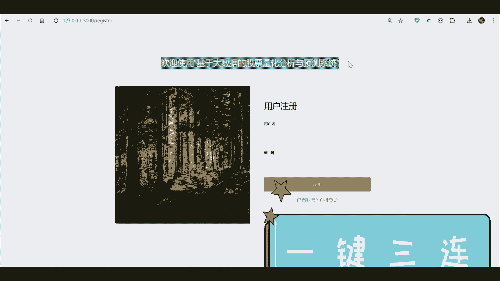

# 计算机毕业设计Python+LSTM模型股票分析预测 股票量化分析与预测系统 股票可视化 股票大数据 股票爬虫 Tensorflow PyTorch 深度学习 - P1 - 计算机毕业设计大学 - BV1fsmgYpEXi

♪ 全世界快乐唯一于这一个 ♪，♪ 让感冒无意识的感觉 ♪，♪ Salloon feet on i shi ♪，♪ Can't young kiss ♪，♪ I share ♪。

♪ Tommy tab is young ♪，♪ But once the star ♪，♪ The taffy zone ♪，♪ 何方如一颗星闪歌 ♪，♪ 忘记缤纷的灯 ♪，♪ 在日本书籍挂 ♪。

♪ 逃出心中斗争 ♪，♪ 没白字黑阿拉纳 ♪，♪ On the heart of my heart ♪，♪ Walk some monk by the cool eyes ♪。

♪ I love finish way down ♪，♪ I'll finish way that i ♪。

