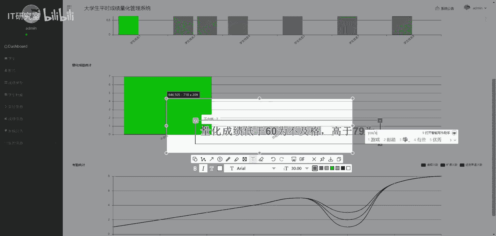
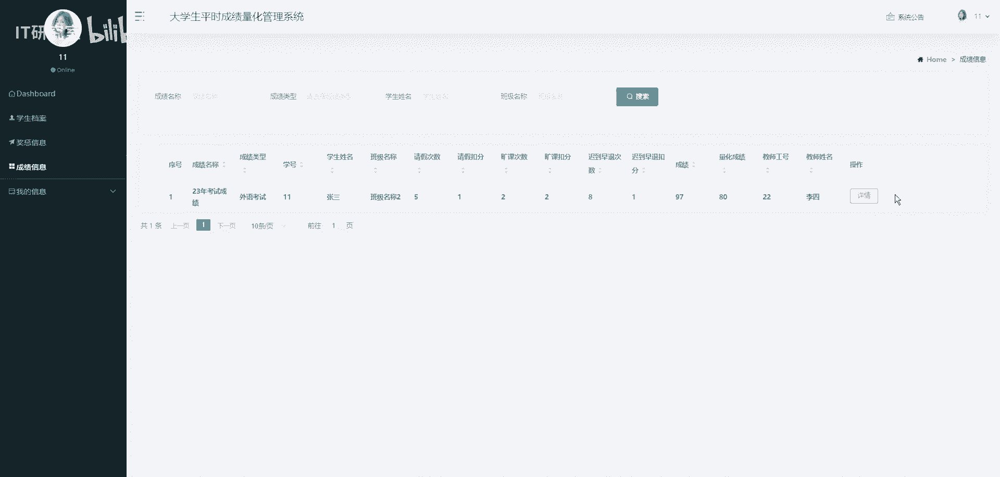
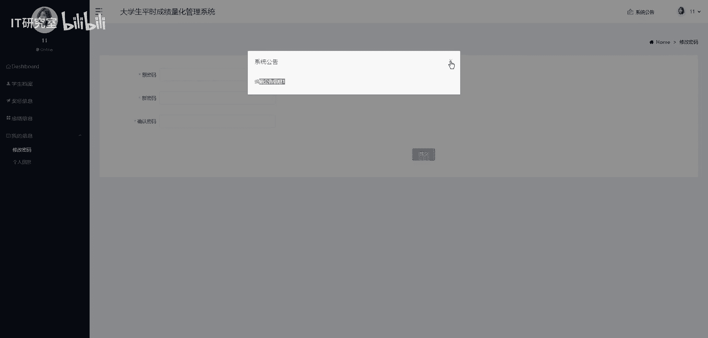
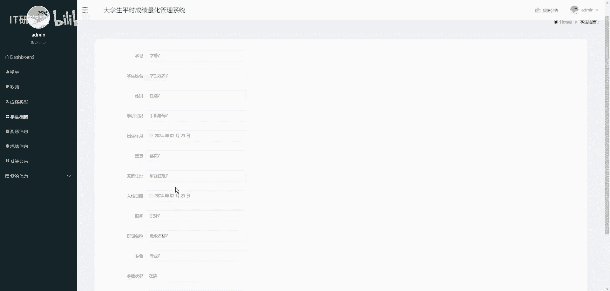
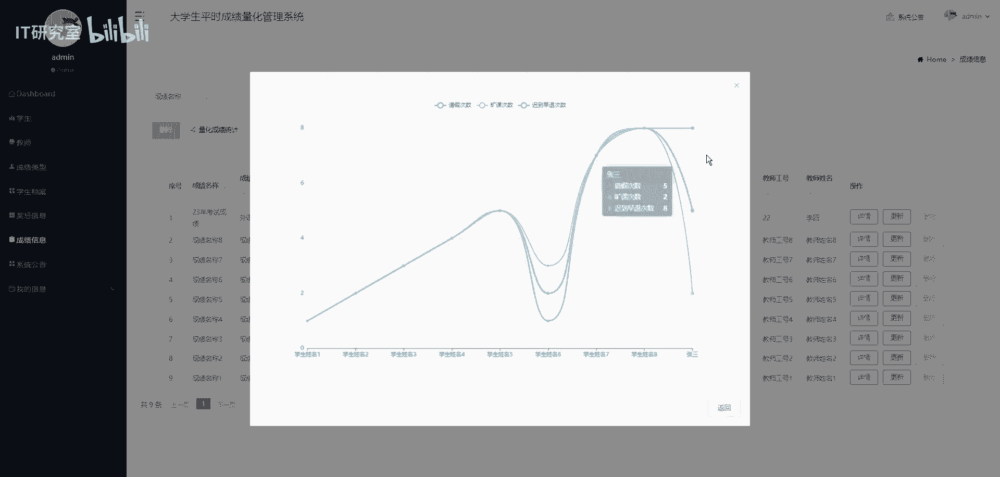

# 计算机毕业设计选题推荐-大学生平时成绩量化管理系统-Java／Python项目实战 - P1 - IT研究室 - BV1EAsMe3E1k

🎼传说浩瀚银河有颗新时代。🎼走出时间后，仍然选自留下记着中温柔的不像话，经守着他的遗憾啊。🎼旧的摇椅吱吱呀呀，停不下，风卷走了满园的落叶落花，邻居家小孩吵闹声好大。可为什么我总觉得那就是他。

🎼或许你也听过但说话低沉或嘶哑，那是他在倾诉他的牵挂。🎼他也许在此后的地点在你的身边，在你的梦眼，如果看见他，请别害怕。🎼可不可？🎼感受一下。🎼看在我们对彼此都奉心不下，就算一阵风一遍。

也一个眼神的触暴。🎼的方啊。🎼，🎼见你。🎼只有被。🎼也算走到终点。🎼就算有。🎼直到永远的。🎼在昨天。🎼My你。🎼就的摇椅吱吱呀呀停不下，风劝走得蔓延的落叶落花，年纪家小孩装聋声好大。

可为什么我总觉得那就是风虚你听过他说话低沉或嘶哑，有是他在倾诉他的牵挂。🎼他也许在最后的地点在你的身边，在你的梦魇，如果看见他请别爱。😊，🎼看树一下。🎼跟在我们。🎼这封信不下。🎼那一春风一。

🎼一个眼神的触碰。

🎼可以经。

🎼说到终点。🎼只能永远的留在昨。😊，🎼不圈可圈。

🎼会化作春。🎼爱终究。🎼再天。🎼雨中湮灭。🎼黄君搁浅，我们会化作春外，终将在。

🎼再姐。