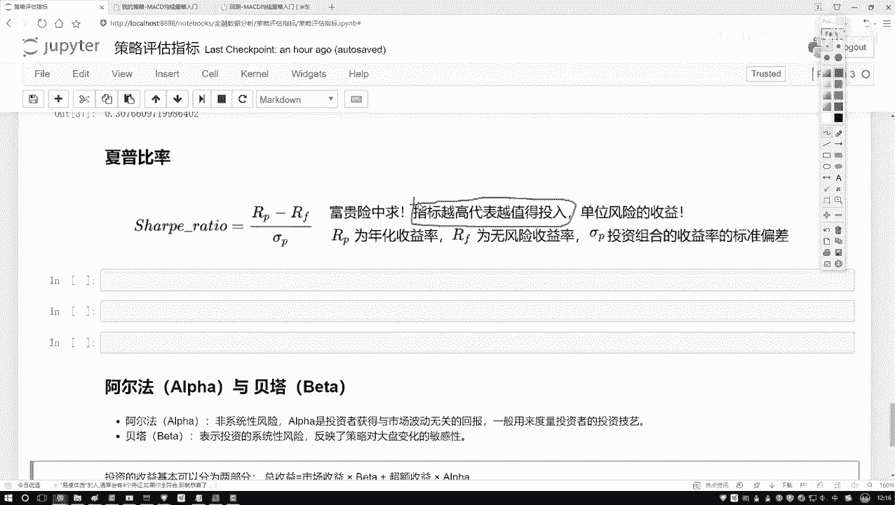
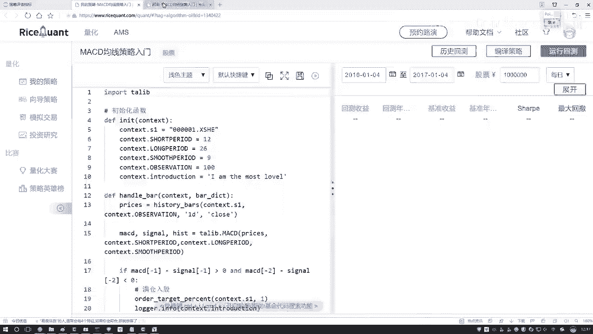
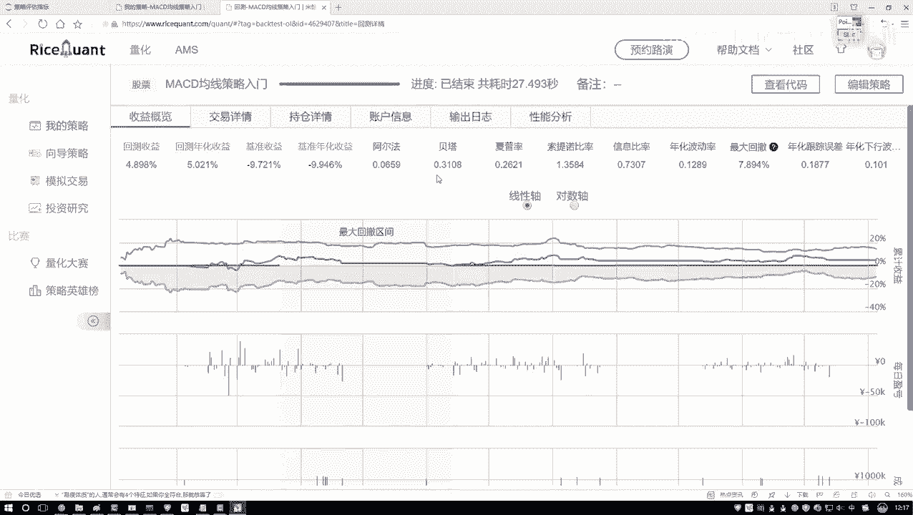
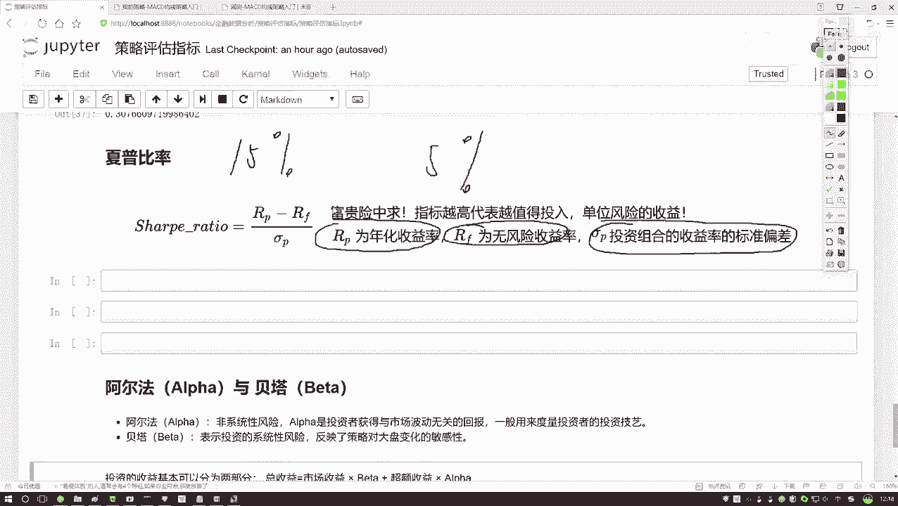
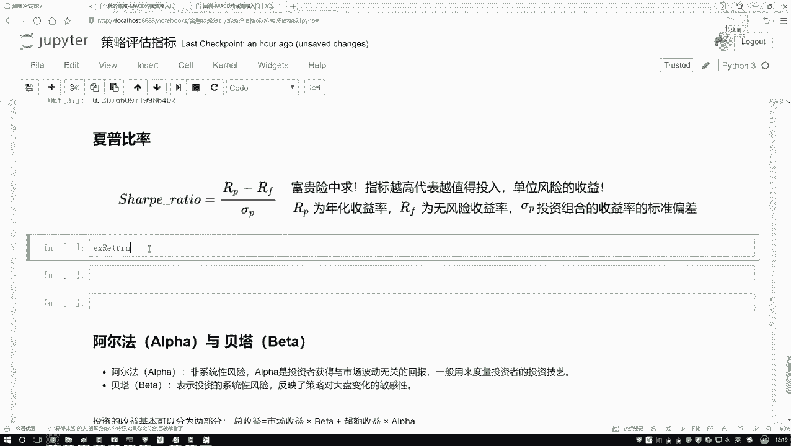
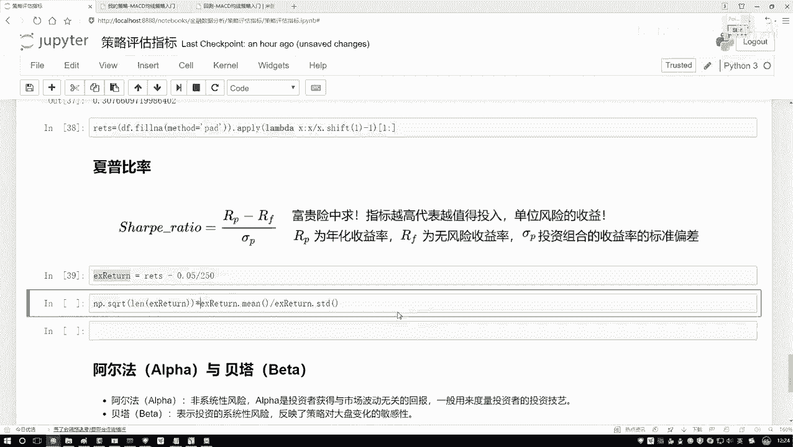
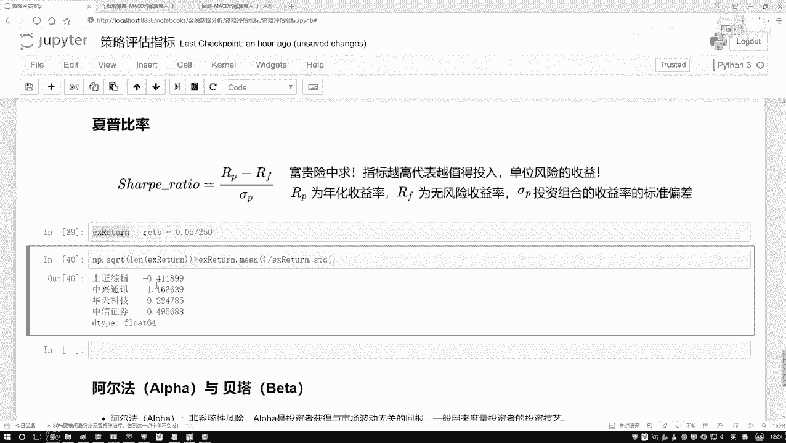
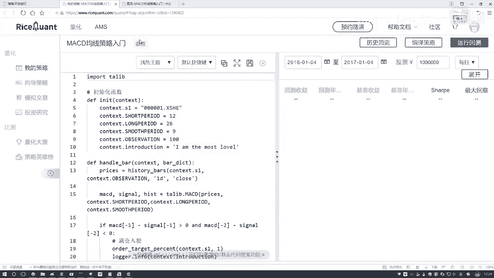
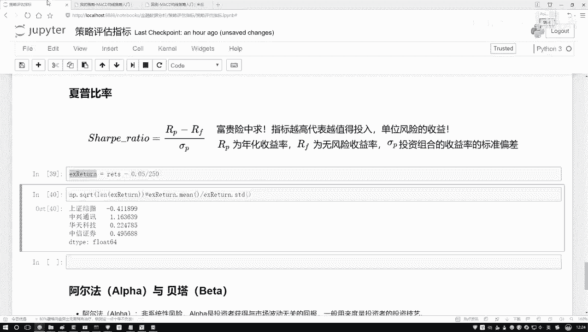

# 讲的太好了！2024最系统完整Python金融分析与量化交易实战教程，完整63个小节，附带配套代码数据集分享！ - P19：4-夏普比率的作用 - 默默无闻你路哥 - BV1izmqYZEMU

接下来啊咱们来说一下这个下浮比率啊。那先解释一下它是描述什么的。咱们之前是不是提到一个风险啊。哎，那我给大家先举一个比较好玩的事儿啊，咱们在那个朋友圈当中啊，是不是经常看到一些搞笑的东西。哎。

比如说只想看到说那个叙利亚招那个雇佣兵，然后只要会扛火箭筒就行，然后会怎么样就行。然后工资日结一天工资就3万就5万就十0万的，是不还挺高的呀，那他的工资日结为什么这么高啊，叙利亚那块，因为他们怎么样。

风险非常大吧，那这个下浮比率它是描述这样一件事儿啊，那我干什么都有风险，那相对来说我这个风险跟我的一个收入来说，它是值不值当的呢？相当于啊我们要算一下，对于单位的个风险来说，哎，我的一个收益是怎么样的。

其实这个下播比率啊，他描述这样一个指标，指标越高，表示什么单位风险来说，哎，对于单位风险，我的一个收益会怎么样越高吧。那其实我们想去做这样。😊，件事儿，比如说现在我要去选股，那有可能有好多股票。

那好多股票算完之后我算一下。看谁呀啊，咱们如果说单从一个指标来看，就刚看这个销售指标，我要看什么，那肯定是他高的呀，因为越高代表着哎，对于单位的分险来说，我的收益也会越高吧。

所以说啊这个指标就描述的是哎，在这里你看也有。

啊，这块咱们的一个哎这个项目项目指标是吧？这指标当中啊，咱们就可以计算一下。对于单位风险来说，我到底哎是值得呢还是不值得呢？当然我们希望这个指标怎么样越高越好呀。单位风险，我的收益要越大才是越合适的。

然后咱们来说一说吧，那这个哎呀风险这个事儿或者说风险跟收益这个指标这个事儿啊，咱们该怎么去算啊，那其实是这样，你说咱们现在啊就平时存钱的时候啊，可能大家听过有两种存钱方式啊，一种就是。😊。

到银行里边，他会先去呃看一下你的一个人的承受能力，你的一个风险等级，看一下适不是适合买这个理财产品。如果你是个老年人去的啊，就七八十岁，像我爷爷之前还买理财，买理财时候去了，那人家肯定要让你买什么。

就是那种就是没有风险的，就是固定收益。比如说一年啊就给你个3%，反正就是不会亏本，一年到了就给你3%，这叫什么，就叫做一个固定的吧，或者你买一些国债啊，相当于到就是时间到了，就给你这钱不可能有点风险的。

那比如咱说这样吧，我就说咱这个保本的固定的，我说他是一个5%哎涨得高点行吧。然后呢，然后就比如说我去了，我去了，他看我哎呀这个中年人去了，然后他有一定收入能力，然后他有点抗压能力。

我说给你介绍一款我们理财产品吧，然后咱们这款理财产品啊，它是可能是一个组合的，不可能不一定光是一个可能给你介绍一堆投资组合，我就拿一个直来说了，比如说他给你算了算啊。

当前的一个收益可能是一个15%的那相对。😊，说你看我说我买固定收益才5%，是不是太少了。那我买点风险的，是不是15%啊。那此时我可以算什么，他们之间怎么样是不是有一个差异呀啊。

相当于就是啊我们只是两个指标。一个呢就是你的一个投资的你的一些组合产品啊，这样一个收益率，以及呢你的一个市场来说啊，一些无风险的一个收益率。我们要算他们之间的一个差值啊，是要算这样一个指标然后呢。

再用这个差值比较什么？比上啊就是当前你不是选了这个投资组合嘛，比上一下你投资组合的一个。标准差啊，咱们要算这样一件事儿，大家可能觉着这个公式计算起来稍微麻烦一点啊。没关系，我们重点什么。

你只要去理解这个下比率啊，这个ra手值表示什么意思啊就行了。然后呢给大家来算一下吧，就是刚才解释了，就是单位风险，哎，你的一个收益到底能有多大，那怎么算呢？按照咱们刚才这个来说吧，比如说。

啊，我说我现在买了一款理财产品，然后呢，我的一个nce这块我在算过程当中，我得把之前我的一个回购率拿过来啊。之前哎对之前在我们做这个回调率的时候，还做了一额外一件事啊。

就是呃对数据当中啊缺失值做了一个填充。因为数据当中啊可能有一些呃就是停盘了，或者是有一些其他因素或者读取数据当中因素，导致了咱这个指标它是有缺失的。我在这块就是全部用它前一天的值，如果一个数据缺失了。

当做它缺失的那个值啊，多做一步。然后呢，用我当前我的一个。

啊，我的一个回报率，然后呢减去咱们刚才说的是1个0。05是吧？然后博鳌不要忘记啊，就是咱们得按照这个年来去做的。所以这里我再比上了1个250。然后接下来咱们来去计算一下这个销比率啊。

销比例做的过程当中啊，其实挺麻烦的。在这个return当中啊，你要去算它的这个标准差是吧，你得有一个均值，然后再比上什么，再比上它的1个STD。然后呢，前面前面这个过程当中啊，这里呃它只是一个形象表示。

然后呢少了一步，少了一步就是n派点。然后我去呃得把当前这个结果再给它去开一个根号，开根号就是你加上一共咱们的数据它是有多少天的啊，就这里把这个数据一共是有多少天的，写进来。

然后呢接下来再去乘上我们当前的哎刚才算的这个呃这个标准的一个偏差就可以了。然后我想想就没有什么问题，没什么问题，看下结果吧。啊，看结果咱们算出来了，就是对于啊我的每一个指标来说。

咱们当前的一个下目指标是不全算出来了，哪个最合适啊，肯定中兴吧，为什么，因为当前这个指标值它是一个最大的吧啊，单位的一个风险能够使得我的收益是最大的，然后这个都是负的负的，咱就不看了。

我们希望当前我们指标肯定哎我们要是一个越大越好的。这个就是在这个策略当中啊，咱们提到了啊，有这样一个下比率啊，我们希望它的结果要越大。

越好的。