# 讲的太好了！2024最系统完整Python金融分析与量化交易实战教程，完整63个小节，附带配套代码数据集分享！ - P18：3-最大回撤区间 - 默默无闻你路哥 - BV1izmqYZEMU

接下来啊咱们来说这个最大回撤啊，先给大家看一下，就是在我们的策略分析当中啊，最大回撤表示的是什么东西啊。你看这里啊它是有什么啊是有一这样的一个区间吧。这个区间什么意思啊？

好像说哎呀从哪儿到哪儿是持续了这样一个最大回撤，还有这个意思。其实啊这个最大回撤啊，呃，它不能从这个字面意义上来解释啊，它其实描述了什么啊，大家记住也行了，它描述的就是你炒股票啊，这个惨劲儿啊。

什么叫这个惨劲啊，它说这样一件事儿，就是当我们的炒股的过程当中啊，那肯定会有一些跌的时候吧，那最大的时候不是最大的时候，最跌的最惨的时候持续的那个区间，我们就叫做什么最大的回撤区间。

在这里啊我再给大家解释一下，通过公式，咱们再来看一下什么叫做这个惨劲啊，它是这个意思。这个PI啊表示的是。😊。

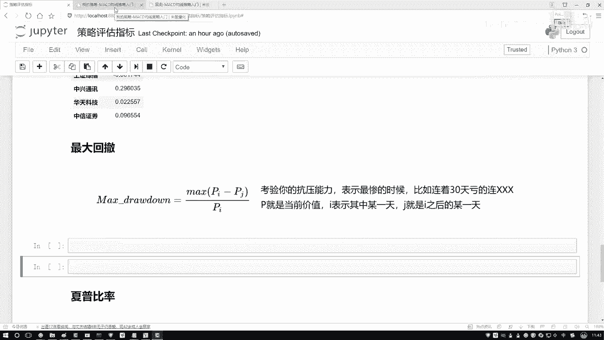

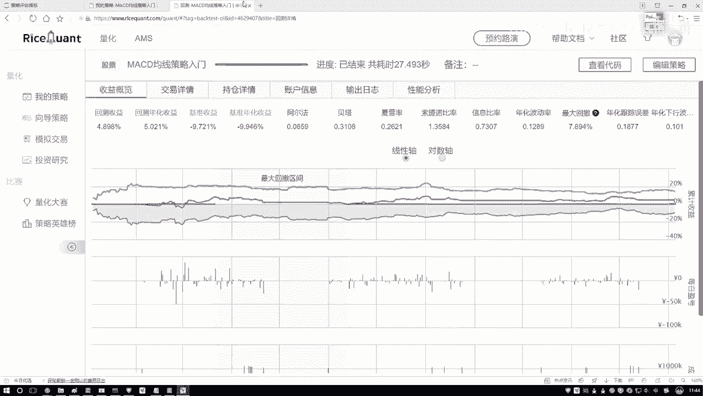

呃，你某一天的一个股价吧，可以吧？然后呢，PJ表示就是反正J啊就是都是挨后面的。比如说I是第10天那J就是第10天之后的啊，某一天。当然这个某一天，那你说怎么样找这个某一天啊，它叫做一个最大回撤吧。

哎呀就是有这样一件事儿，这个股票在下降的过程当中，哎，这一块可能有一个区间，那是连着5天，比如说从这个10块钱跌了5块钱啊，这是有这样一个5天，然后呢，后面还有一个更大的更狠的。

从这个比如说这块它涨上去了，怎么样的。然后这里它还有一个比如说从这个15块钱吧，跌到了1块钱，有这样一个更大的区间，相当于啊就是我们整个呀要便利一下，便利什么呢？便利在咱们的数据当中啊。

哪两点之间是下降最惨的，并且我们还要把这个天数给计算出来。比如说我说现在连着30天啊，反正可能中间中可能中间这块有一点。涨的这也没关系，有点涨的，但是整体还是往下去走的。反正我说连上30天。

我是经历了最惨的一次，从多少钱跌到少多少钱。但是这个描述的不是一个多少钱。因为你看下面有什么？别忘了还要比上什么，比上一下这个PI相当于啊就是你缩水了多少吧啊，大概是这样一个感觉。

这个我们叫做一个最大回撤，哦，它并不是一个评估啊，你的策略好不好的，而是评估什么？因为当我们在评估的过程当中啊，其实不光我们要看这个策略好不好，还要看什么你的一个风险吧，这是一个风险，什么叫风险。哎呦。

你说你炒一个股啊，然后你把全部加当都放里了，然后之后有一天你发现了，哎呀，这个最大回撤区间，连这1天呀要我命了，从这个15块钱一直是跌到多少了，是不是挺下一件事啊，当然可能啊它后面还涨起来。

是不是只是说哎它最大的一个啊，这样一个跌幅或者最大的这样一个回撤区间是多大的这个。😊，以及就是你的一个缩水成了多少。哎，这个是我们要去描述的一个指标。在这段时间当中，你的一个惨劲儿啊是有多惨的。

所以说啊再回撤啊，大家以后看到了，你就想这个是一个风险指标，描述的就是。你做这个策略啊，可能整体上来说还是赚了，但是中间会有那么一段时间让你非常惨啊，这个时间就是你最惨那段时间我们就叫做是一个最大回撤。

那你说股票当中啊，风险这么重要重要吧？08年的时候，多少人都跳楼了，是不是不是多不是多少人跳楼，个别暗调，有些人就跳楼了吧。08年的时候，那股市当时我记得好像从6000多点，直接的跌到了1000多点。

基本上就当时我我爸也炒股啊，当时08年的时候，然后那时候我们全家还去那个海南玩呢。然后当时可能就是哎呦也是电脑没有那么普及。然后也没实时的去看这些信息，然后在外面玩的时候压根没管股票。

然后走前走前我记着都是股票啊，我把那股它是16块钱的，然后回来的时候跌到多少了，剩4块多，然后赶紧都卖了，因为实在是挺不住了，这就是当年08年这个股市大盘直接就是我记得我可能记拜清，记好像是600多点。

直接跌到了。😊，1600多点还是多少点啊，基本上所有人都是亏了吧，而且都亏的差不多啊。人均当时说是人均亏10万，但是我觉得可能10万是不止了，大部分人都是几十万几十万的一个亏。

这个最大回撤区价就描述的是啊在某一段时间，你的一个惨劲是有多少。那你看在我们这个会策略当中啊，怎么样。😊。

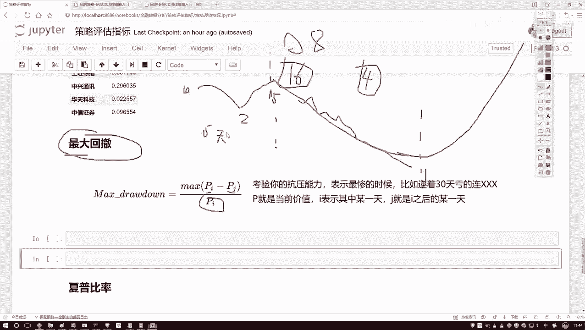

这一块他是不是会帮你做统计啊，统计出来，哎，你的一个回撤区间里边哪一块啊，它是什么？是有这样一个最大的吧啊，这是我们的一个最大回撤区间。然后呢咱们写一下吧，就是呃我们的一个呃计算该怎么样去算。

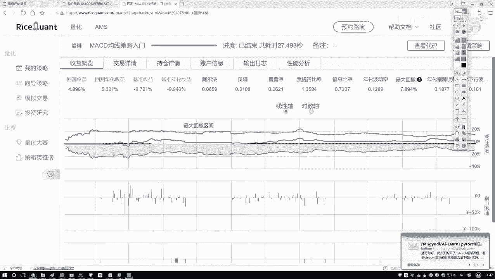

首先我们来想一想，这里边需要我们算什么，那算指标其实蛮多的，你得算最大的一个区间吧。哎呦，那你怎么知道一个区间它是一个大还是小啊，是不是我们都得一个一个去做计算，然后选择出来什么？其中那个最大的吧。

好了，现在大家看啊就是。😊，有这样一个函数，pas点啊serv，我先给大家举个例子啊，在这个serv当中啊，随便传一些值啊，就拿那个观有率来说吧，然后添上一个空值得了，空值不会参与到计算当中。

然后再填几个值，再给大家介绍一个函数，然后我们给大家讲怎么去写。

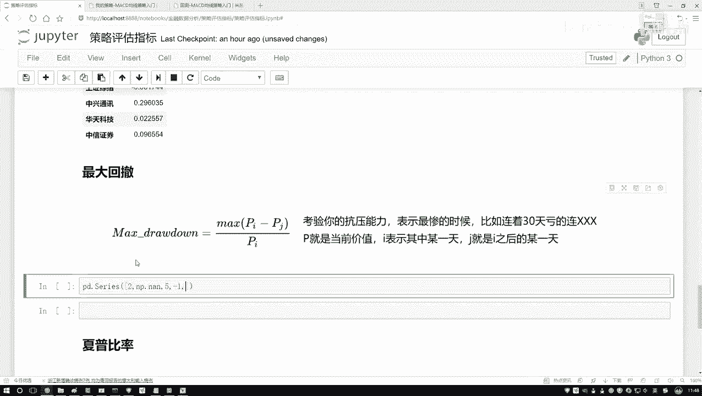

行，我就我现在就创建就创建一些数啊，然后我对这些数做一些操作。做这样一个操作就是一个啊不是com some，是com max。

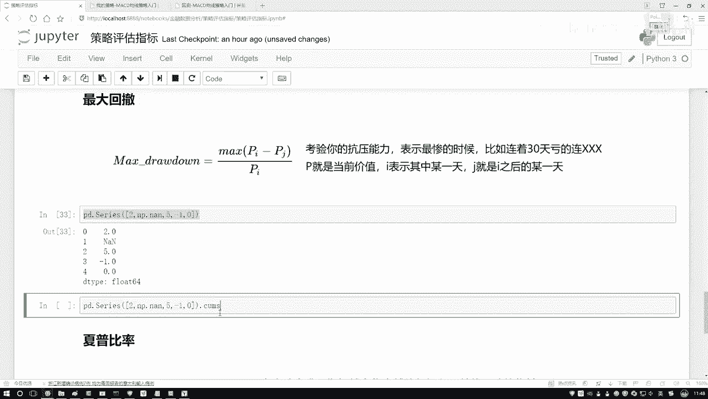

什么叫ca max呢？相当于啊就是。

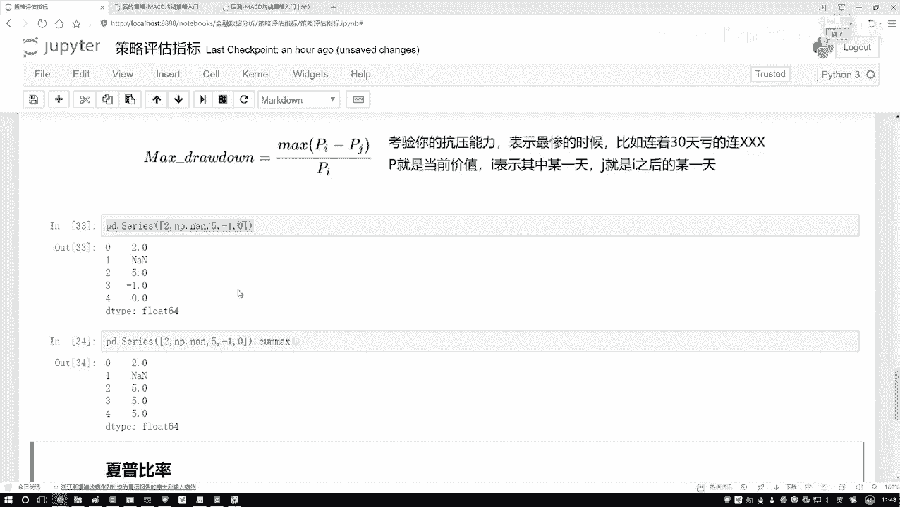

呃，对于第一个数来说啊，你前面所的最大多少。那对于前两个数来说，最大多少？对于前三个来说，最大多少，对于前四个前5个来说，最大的是多少是这样一件事啊，第一个就是自己。

然后这个AN值是是这个东西是会影响我们就就是不考虑的。然后接下来前三个得多少，然后这个多少这个多少啊，这就是一个com maxax操作，咱之前是不是说过一个come sum操作啊啊，跟那个操作是类似的。

只不过这里咱算的是一个max。

那这要算什么呢？我们不是要算从哪儿到哪最惨吗？那好了，我们先找个制高点吧。在这里比如啊不是找制高点，找这样一个累加的一个就是max盒吧。对我们数据来说呃，先拿到咱们数据。

对于我的daate frame来说，选择其中一个吧，我看看选哪一个。😊。

啊，随便选就得了，复制一个呃，咱们来举个例子，选一个数据，选完数据来说呢，然后我说对他呀做一这样一个commax操作，然后我去点head一下。好了，就是呃你看上面数据当中。

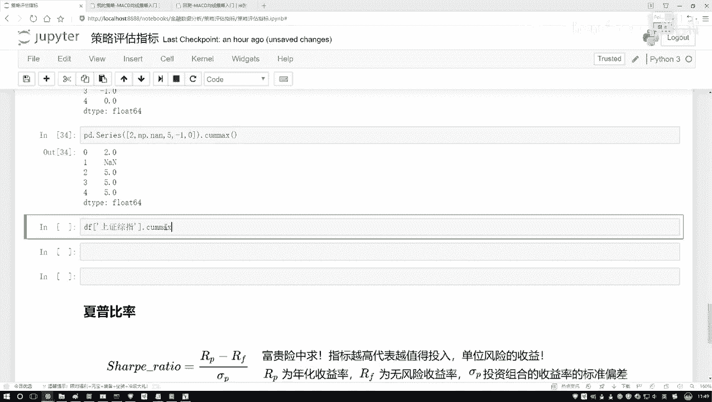

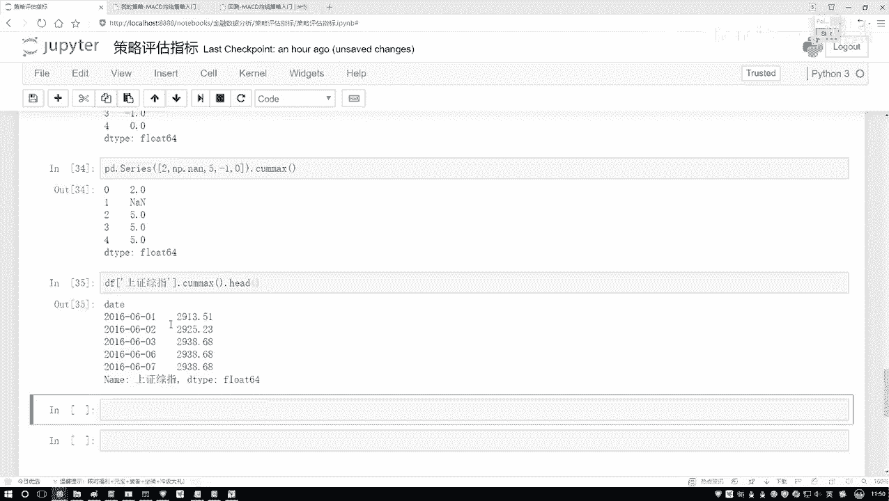

最开始的数据呢，最小数据当中这是2913，这是29252938是吧？然后注意看这个是2934吧。好了，6月6号是2934。然后呢，你看这里这里6月6号它是2934吗？不是吧，因为前面有比它更大的吧。

所以到这块就是还是2938，这始终啊会去帮他选它的一个那个那个最大的一个值啊，是等于多少的。然后我们来计算。😊。

怎么算呢？我把这个结果拿过来啊，就是还是对它做了这样一个comm操作，要算什么？你看这公式当中它是不是一个减法呀，相当于我这块我要再减去某一天吧。好了，那我说哎要减去某一天，那减去哪一天啊，那我不知道。

那我就是现在有这样一个指标。

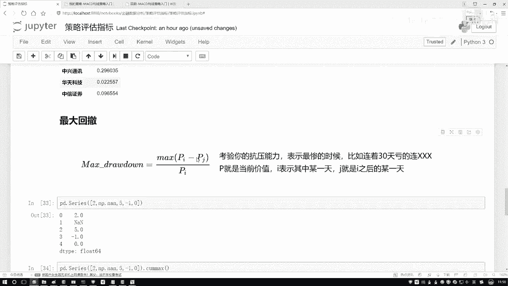

这指标什么意思呢？哎呦，从6月2号之前最大值，然后这个指标6月7号之前最大值，那我用每一个值减去我当天这个值行不行？咱现在算一下，这块可能稍微有点绕，大家简单看一下我写的这个过程就行了啊。

其实不用太注重咱们的一个具体的公式啊。因为后续咱们所有的计算方法，都是通过那个就是这里直接帮咱们计算出来的。这块只是帮大家先去熟悉一下啊，我们该怎么样去做这样一个操作。然后行，这块先给大家看下结果。

中间结果。😊。

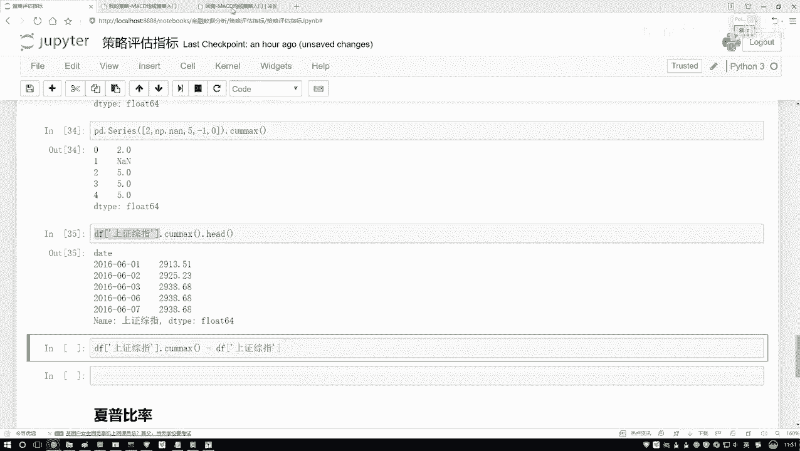

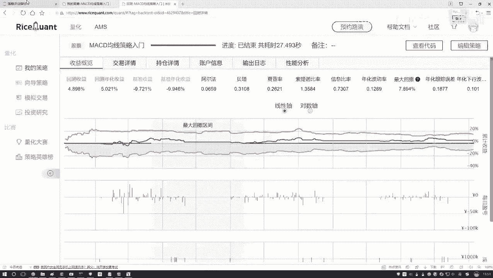

然后我说我点hi一下，那你看这什么意思啊？用前几天最大还值，然后减去当天它实际每一天的一个结果值吧。哎，这为什么是这为什么是零了？因为当前就是你看第一天最大值是第一天，第二天最大值，第二天。

第三天最大值，第三天恰好是跟它当天是相等的吧啊，是所以说会出现一些零，然后呢，你说我们现在算这个值之后。😊。

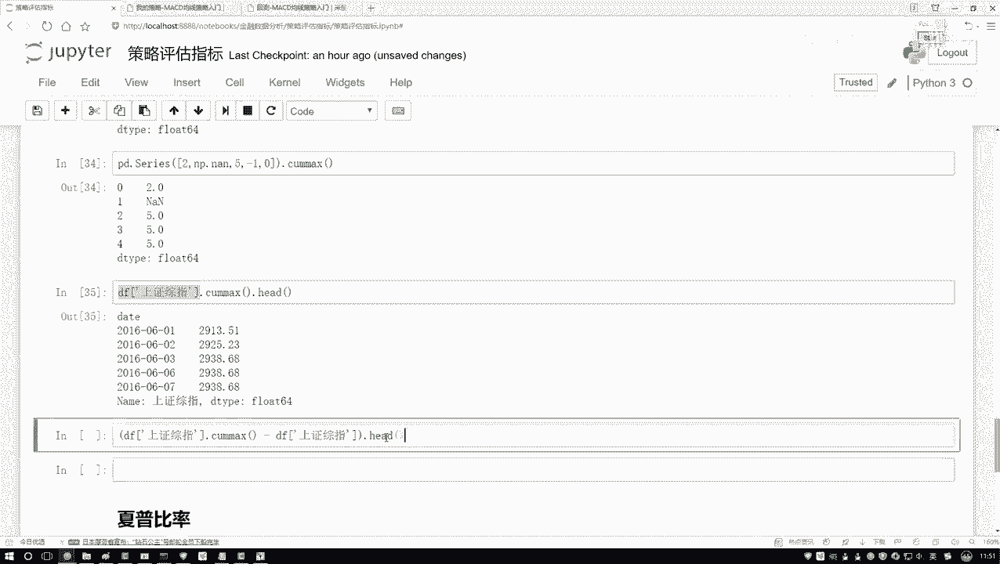

那你得到了一些咱计算的结果，这个计算结果是我想要的吗？这是每一个回撤区间吧，哎，是不是啊，是不是每一个区间啊？那我要算的是什么？是不是一个最大的呀？所以说这里接下来我们要算什么？

我还要去点上一个max吧，哦，还没点max这块还有这样一件事，还有什么，别忘了在做max之前，你还要比上一个PI是吧？好了，然后我说在比上这个东西，咱写一写。现在我们把这个呃减法，我们已经做了。😊。

减法做完之后呢，然后接下来我说呃在这里，然后做完减法之后再去做一个除法，除法就是比上当前这个结果值是不是就行了。比上我们当前结果值，哎，但是注意点，你比上这个结果值，要比上什么。

是不是也要去对它做一个com maxax操作啊，这步别忘了也要做一个com maxax操作，然后我把之前结果，我说我全括号起来，在这些我得到了这么多序列，做完这个结果，我找谁啊，咱是不是找最大的呀。

所以此时你别忘了你还要干什么，在点max一下是不是就行了。来直行一下吧，看一下我们的结果。得多少30。7是吧，这算什么最大的一个回撤区间啊。然后你想把每一个小区间算水形。

但是我们现在算什么是最大的一个回撤区间等于一个3%就是最大的一个回撤区间，这个区间，使得你的一个结果啊，然后变成了就是你的一个怎么说呢？就是一个跌幅吧，是有大概多少啊，大概这个意思。

这个是我们的一个回撤区间啊，咱们该怎么样哎去计算。其实说白了就是这个图当中啊，这块阴影部分，黄色淡黄阴影部分当中啊给你指定出来的。哎，我们当前的这一部分的结果，这个就是一个回撤区间。

说白了就是你那个惨劲儿啊，有多惨的意思。

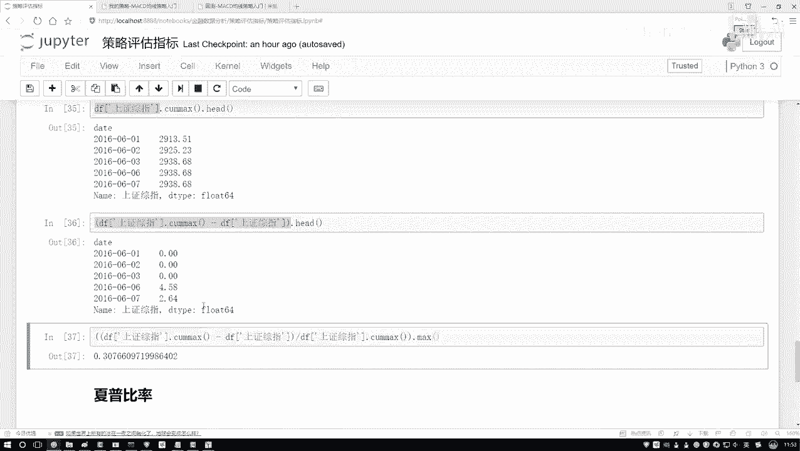

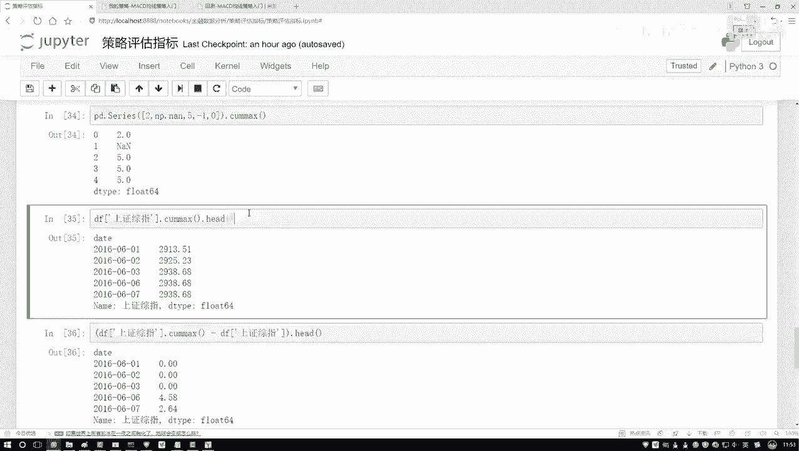

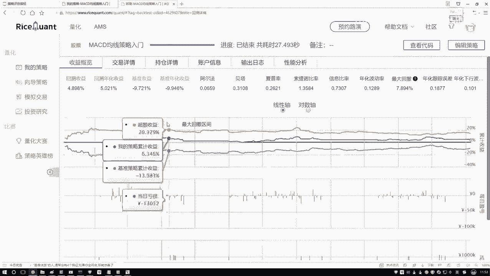

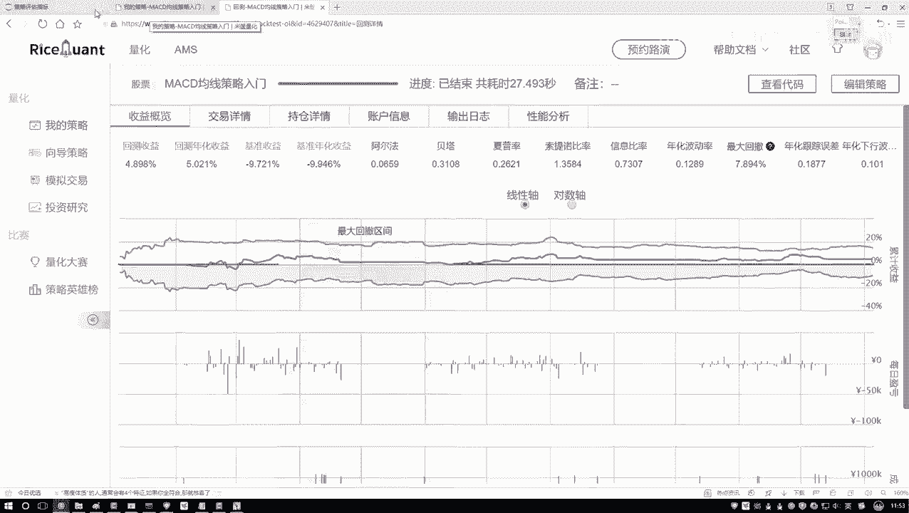