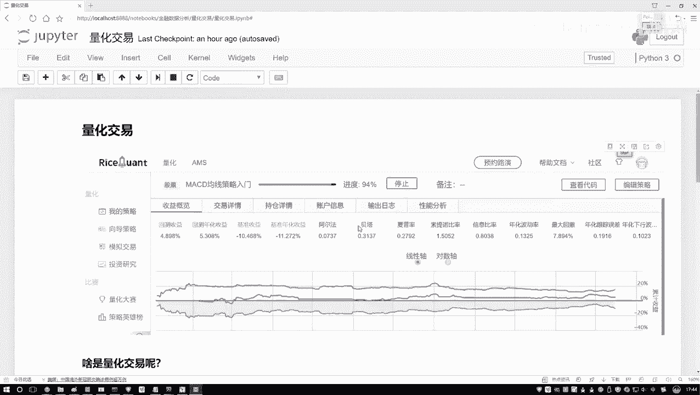
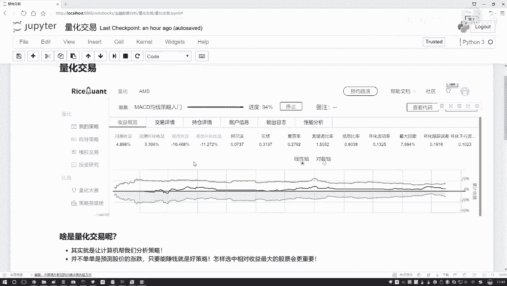
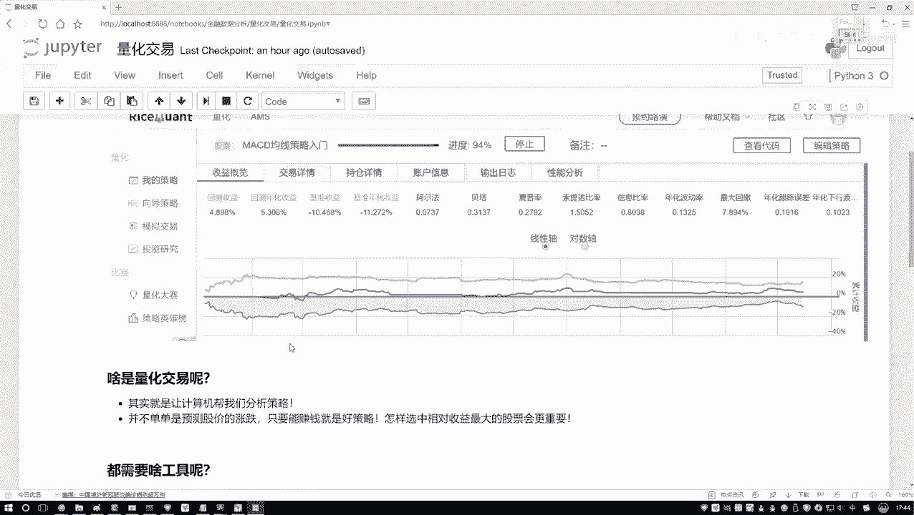
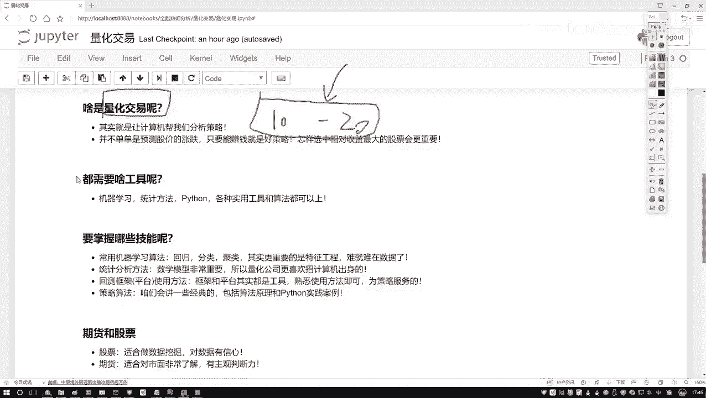
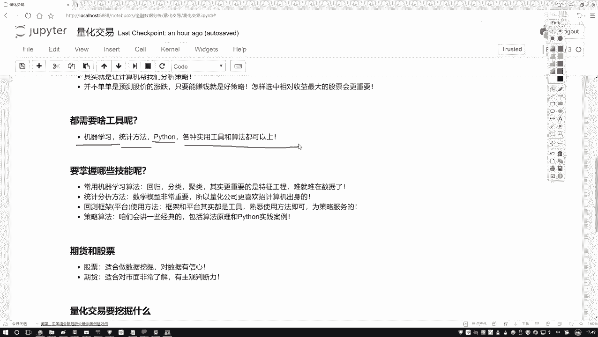

# 讲的太好了！2024最系统完整Python金融分析与量化交易实战教程，完整63个小节，附带配套代码数据集分享！ - P21：1-量化交易概述 - 默默无闻你路哥 - BV1izmqYZEMU

这节课啊咱们来说一下什么是量化交易，以及呢当我们在做的过程当中啊，有哪些个核心技能是我们所必须啊要掌握起来的。这张图啊它是啊截了一个平台交易框架当中啊，做了一个策略分析。等后续啊咱们会想给大家去看啊。

这里哎只是给大家放一张图，哎，大家先不用去关注啊。这节课我们主要来讲一讲量化交易啊，做了一件什么事儿。咱们讲的过程当中啊，就是所有的长篇大论，那些东西啊就通通去掉了，没必要知道那么多的一些历史啊概述啊。

还有一些发展前景啊，这些东西啊没什么价值，哎，咱们都不说，咱就来究其本质唠一唠量化交易啊到底做了一件什么事儿。

那以前啊你就说这个炒股吧，咱拿股票来说，以前咱说炒股都是谁去做啊，都我们自己去做吧。他在这个电脑面前是不是生怕发生什么事儿，生怕有一些指标变了，我们都不敢离开，一天一天盯着那瞅着呀。

以前咱要这么去做的那你说即便你瞅个3。5年的哎，你说你的水平特别高了吗？你就成为一个大神了吗？就能每次都赚钱吗？好像也不能，因为第一点啊，我们人都有什么一个主观性，哎呀。

我的一个主观性可能会使得我的判断有一些不准确吧。这是第一点。第二点呢。你即便看了3年5年，你才能分析多少个股票啊，也就撑死，那么十几个或者撑死哎再多一点，是不是你没法看一个全局吧。

甚至你不能从很早的一个时间段到问到现在吧，比如说间隔个十0年8年的，你分析这样一个历史数据，你能分析吗？好像也不能吧，经历时间计算地是不是都是有限的呀。那量化什么意思，还是要做这样一件事儿，什么事儿。

我们最终的目标就一个怎么样去赚钱吧，但是呢不是我们人类自己来去想哎，怎么去做，具体怎么赚钱这个策略交给计算机。哎，比如说我说告计算机，你就给我想一想，什么样的策略是合适的，或者说你就简单点来说。

你告诉我什么时候买，什么时候卖，能使得比如说咱们两年时间内我赚的钱最多，这就是一种策略吧。我们要做为目标就是要去赚钱。那怎么赚钱呢？究其本质，我们要设计出来一些策略吧。怎么设计策略呢？就是要通过什么？

我们拿到的这些股票的历史数据吧。比如现在我说股市当中啊，呃，咱们先不说20年，咱么说这个10年吧，比如说现在有10年到这个20年啊，有这么十来年这个数据。然后呢，某只股票的数据吧。

然后说啊把这十年数据拿出来，那都是历史的了，都是摆在那儿了，哎，定型了吧，它数据也不会去变了。然后呢，我说我想一想有什么样的方法，然后我想这个方法之后啊，我说应用到这个历史的或者说过去的数据当中吧。

看一看我的方法能不能让我去赚钱，或者说通过好多样指标，后续咱们会说啊有好多样指标能不能通过哪些指标去判断一下，当前我这个策略是好呢还是坏呢？这个就叫做量化交易了，什么意思。基于我们的历史数据啊。

已经过去的那些数据要干什么，要做分析了，经常说一个词啊，叫做一个回测回。😊，什么意思啊？就是去分析一下这些历史数据当中有哪些个价值的信息，我们该怎么样去设计策略，来使得怎么样收益嘴大吧啊。

这就是量化交易，让计算机针对历史数据，在数据当中做一个数据挖掘的任务，挖掘挖掘什么样的策略好，什么样策略能够使得我赚钱，这说白了就是量化交易，以前什么样？

可能我那个我小时候我小时候就是别人家孩子都是看动画片长大的，我小时什么样，我小时候都是看股票长大的，为什么？因为我爸非常爱炒股，从小时候啊就是家里啊，那在电视台上全是放股票，但凡开电视机。

那就听各个评论员讲这个股票咋地咋地，那股票咋地咋地，那方法论那个策略方法那家讲的哎我天就是神乎其迹一般吹的特别狠是吧？然后呢，我爸炒这么多点股，最后也没有赚钱，为什么？因为说白了都是人在去做吧。

主观性太强了，而且没有什么数据分析。😊，那你说现在呢现在什么样还真的需要人，我们死盯着死丑去做吗？好像不需要了。大数据时代，人工智能时代量化交易就来了。基于数据应用什么智能的一些算法吧。

来去帮我们让收益最大。哎，这就是量化交易。行了，该给大家简单的强调一下量化交易。哎，大家大概明白了，就是现在有一批历史数据来了。我说我现在想设计一些方法，设计策略，使得我的收益最大，那都需要什么呢？

在需要的过程当中啊，哎呀其实蛮多的，我觉着啊就是量化交易这个东西啊，它可能是一个交叉学科啊，这里边需要大家掌握的知识可能会偏多一些啊，大家可能觉着哎呀一些金融学的知识，我是不是都要去掌握呢？

其实我觉得这样在量化交易当中啊，一些金融方面知识，你只需要去了解就可以了。哎，就别人说什么事，你大家知道哎大概什么意思就行了，不需要把这个方当做重点，但是应该把什么当重点呢？

把我们跟计算机相关的什么意思啊，你看这里我列出来一些一些机器学习算法啊机器学习算法什么意思啊，现在拿数据了，我要去预测一些结果，我要去预测未来的一个走势，这是机器学习吧。

统计方法呢给我一批数据数据当中啊，哎呀，它是指标表示什么样信息呢？这些指标我该怎么去计算。😊。

能怎么样去做一些分析。哎，这是统计方法吧。那还有什么？刚才说的东西给我们感觉像是方法论似的，怎么去做呢？这里我是不是提了一个python吧，我们得编程自己去实践吧。其实说白了就是这样一件事儿。

当我们在做量化交易过程当中啊，也没有什么必备的工具。你能想到的，或者但凡你要用上的，只要你觉得好，只要能让你的收益最大，那就是好的，这一个就是我们常用的一些工具了，可能金融学的一些知识点。

一些知识不是特别重要，而什么最为重要，怎么样处理数据怎么样操纵数据怎么样让数据变钱吧，其实说白了就是数据挖掘啊，你可以把量化交易当做是数据挖掘领域当中啊，呃，现在来说比较吃香，比较热门的一个方向了。

