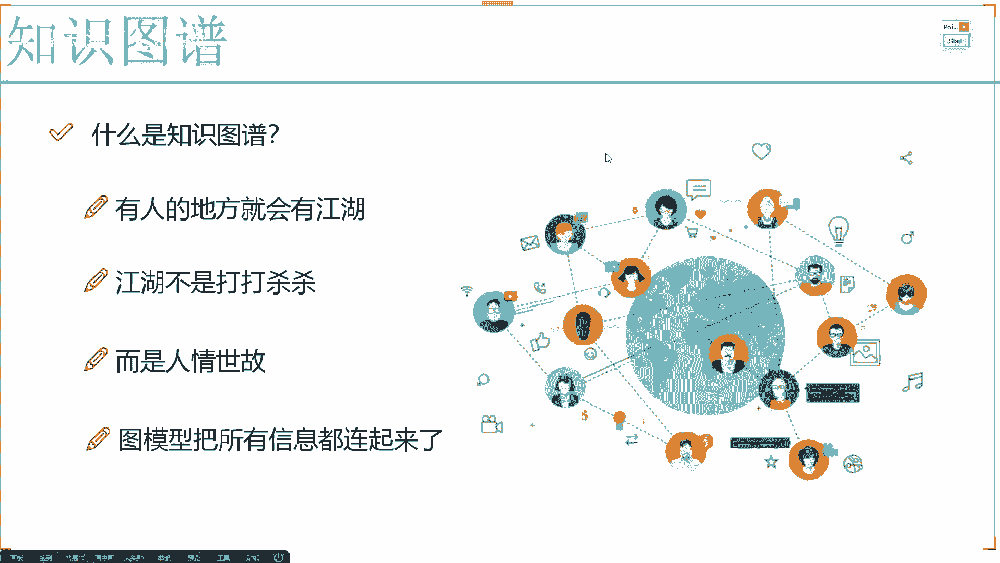
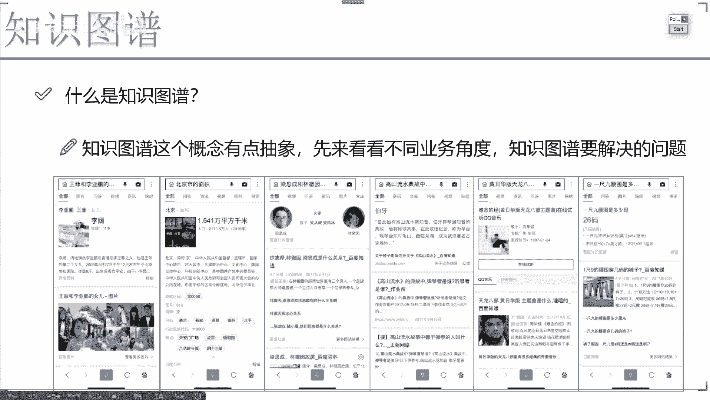

# 完全可自学！人工智能金融领域知识图谱+Python金融分析与量化交易实战全套课程！入门真的超级简单！——机器学习／深度学习／NLP自然语言处理 - P1：1-知识图谱通俗解读 - AI算法-漆漆 - BV1Wgz3YVEx1

好这节课咱们来说一说啊，知识图谱，那在我们讲知识图谱之前，我希望大家先来思考一个问题，哎就是知识图谱啊，它到底是什么，现在呢好像说啊在AI领域当中啊，哎各行各业里边我们都能听到啊。

跟知识图谱相关的一些概念，好的来说啊，是前几年的时候啊，在这个AI当中啊，我们经常说的是哎呦我们要做一个视觉，哎就让这个机器啊有个眼睛能看到诶，他所见到的东西，并且呢我说哎。

那还得有听觉去听到他听到的这些声音，并且呢他还得有个理解能力，把咱文字哎都能理解它是什么意思，但是现在来说啊，好像更火的确实这个知识图谱，那知识图谱啊，跟我们刚才说的这个视觉啊，还有一些文本，还有语音。

它们之间有什么区别啊，咱们先想这样一件事，我说之前啊AI当中啊，最重要的我说让计算机能看见，能听见，能读懂，大家感没感觉，说之前我们要做些事儿，好像说啊，只是让这个计算机。

让我们这个AI有哪方面的一个能力啊，具有这方面能力或者那方面能力，但是呢他没有把很多呀我们需要掌握的技术，掌握的这些知识所关联在一起吧，我们今天要讲这个知识图谱，它是这样一种感觉，不光我们是视觉。

也不光是听觉，还有一些文本，我们要尽可能的把所有咱们所掌握的这些知识，全部的融合在一起，融合在一起到哪去了，也就是得到了我们今天啊现在大家看到的诶，类似这样一个图模型，简单概述啊，是这样一种感觉。

哎我们经常说啊，就是有人的地方就会有江湖，那我们要让这个AI做的更好，你说我们这个人啊，咱们的一个特性是什么，我们不光能看见，能听见，能读懂，我们还有最重要的一个因素，咱们有关系吧，有这样一个社会啊。

很复杂的一个关系的网络，在这个关于网络当中啊，比如说每天做些事，哎，我说我去工作，工作过程当中会有跟我同事做一些交互，是不是，那比如我现在我先要再给大家去讲课呀，我讲课是我跟大家在进行一些交流吧。

也就是说啊我们现在要做的这个图谱，要做这个图模型，不简简单单的指一个能看见，能听见这样一个小的任务，而是说呢要把我们所有的知识，所有的任务可以说是融合到一起了，那我们还听过这样一句话啊，这样一句话。

我说这个江湖啊他不是打打杀杀，而是什么，而是一个人情世故吧，现在呢我们就想需要是创建一种技术，通过这个技术啊，能把我们这个人情世故，能把我们这个关系所全部的关联在一起，这个就是我们所谓的一个知识图谱。

在讲知识图谱之前啊，或者说在我们说什么是知识图谱之前，大家先来想一想，就是在我们实际生活当中啊，哎大家有没有看过一些这样的例子，我给大家举几个例子啊，哎比如现在啊，你之前啊在那个或者是京东或者淘宝当中。

哎你说你相中了某一款产品，哎你去看了看，去浏览了一下啊，但是当时没有去买，然后后来呢当你再去刷抖音的时候，哎突然你就发现抖音啊，就一个劲儿的给你推这些相关产品，推一些相关岗广告，有没有这样一种感觉。

是不是说你现在在玩的这些个app，在玩的这些个东西，它们之间是独立的吗，好来说是不是的吧，在现在这样一个大数据的时代，可以说我们的数据啊都是一个互通的呀，你这一块产生出来的一些行为。

一些浏览数据会在其他地方给你产生一些响应，哎比如说给你推荐一些广告，或者说去引导你去观看啊，一些视频，推荐一些你喜欢的东西，这个也就是说啊，我们现在我们已经不是一个个体了，我们在互联网当中。

或者说我们在这个大数据时代当中，已经形成了一个比较庞大的一个关系网了啊，这是一个小例子，还有我自身的例子，我其实之前啊经常去呃，就是前几年那时候啊说要去买房子，然后就看了一些房子啊。

然后每每每次看房子时候都留留一些电话，然后后来这些中介给我打电话，一开始啊还是指上海中介求我打电话，然后再过一段时间就上海周边了，什么昆山啊，什么江苏杭州之类的，也给我打电话，再过一段时间。

全国卖房子的都要给我打电话了，这也就是说啊，我是不是说诶我也是由这样一个实体，由这样一个点，慢慢我在扩大我跟上海之间房产中介的关系，然后上海房产中介呢，跟其他城市中介之间又有关系，通过这些关系。

本来离我非常远的人，青岛卖房子的啊，因为他认识上海这个中介，上海这中介又认识我，所以说基于这样的关系，人家就开始给我打电话来做这个推销了，这也就是说啊，我们所谓的一个人情世故啊。

是把我们所有的信息都通过了一个图模型，连到一起了，但大家可以想一想，哎你说这个图模型有什么作用啊，如果说现在我这个图模型当中啊，我能包括啊大家所日常生活当中所有的数据。

我说我想做任何一件事都变得非常容易，比如说我现在想去卖你一款商品，卖商品就是投其所好嘛，我会在你的官网当中看一看，你的购物车当中有什么东西，你淘宝上浏览什么东西了，你抖音里边点赞了什么。

你跟你的好友聊天记录，如果能拿到手，我看看你们在说什么，然后我再投其所好的去给你做一些推荐，去引导你做一些消费，这样是不是就更容易去成功啊，但是这个只是简单的一个小例子，后续呢我会给大家咱们来去说啊。

知识图谱我们能做的事是特别特别多的，但是经常有同学啊会跟我去讨论啊，哎说这个知识图谱啊，经常会说知识图谱啊，是自然语处理当中啊非常重要的领域，那它是不是只是自然语言处理呢，其实不是的，我们可以这么说啊。

知识图谱啊会用到很多啊跟NLP相关的技术，但是你不能说知识图谱它就是NLP，因为在整个图模型当中，我们会涉及到的技术，我们要做的东西远远不止文本数据，其实说白了，知识图谱像是一个非常综合的一个学科啊。

在这个学科当中，我们会把各行各业的数据，各种各样的就是有结构化的，有非结构化的文本图像，视频或者是一些数值数据，我们可以全部融入进来，最终呢其实我的目的达到什么，就是要达到诶，建立好这样一个图模型。

把我们的实体，也就是点和这些个就是实体和实体之间，我们要处理好他们的之间的关系，处理好它们之间有什么样的逻辑，好把这个图给他建立出来，一旦呢我们建立出来这样一个图之后，那接下来咱们可以想。

只要有了图模型，我们能干的事多不多，你是做推荐还是做搜索，还是做一些推理唉，还是做各种各样的任务，其实是不是就都能了，所以说啊知识图谱这个领域啊，我们最重要的一点，怎么样去基于我们现在已有的数据。

好把这个庞大的关系网络给它建立出来，有这个网络，咱能玩的事就多了，一会儿呢我会给大家咱们举几个例子啊，来好好看一看知识图谱啊，到底能够去帮我们诶能够解决哪些个任务好了，先让大家对知识图谱有了基本认识。

它就是一个图模型，在图形当中我们有很多个实体，你看这些有很多点，我们一般把这些点啊叫做实体，实体呢它不是单独的，而是有关系的吧，你看每个实体跟其他很多实体之间，我都会产生的关系，哎比如这是我的朋友。

然后这是我的妈妈，然后这一块呃，这个是我公司的老板啊，我们会有很多很多种，这样的关系基于实体和关系，我就能做呀很多任务了，那接下来呢我为大家来去介绍几系一，介绍一些啊。

就是知识图谱，在我们现在这个互联网当中。

