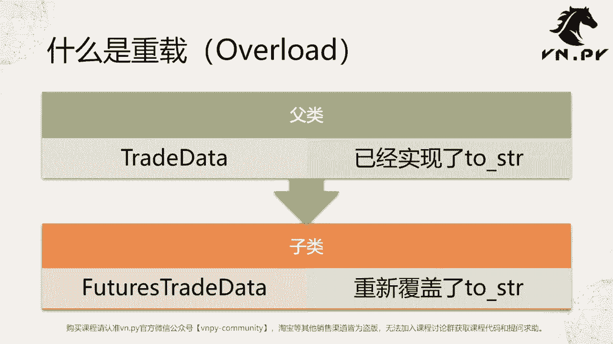
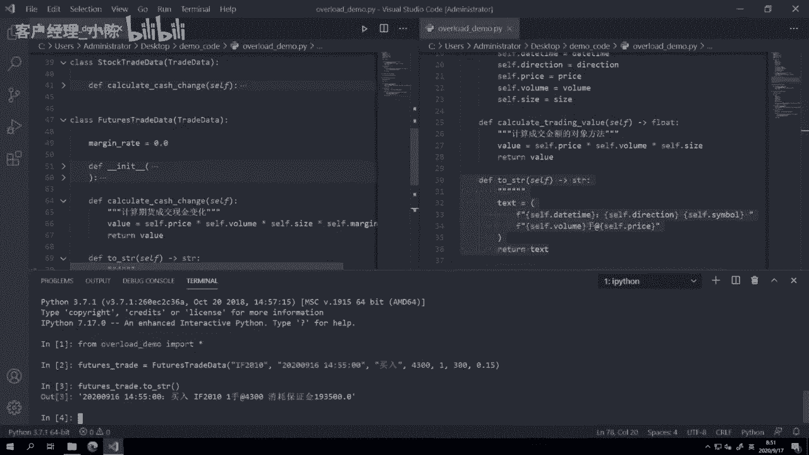
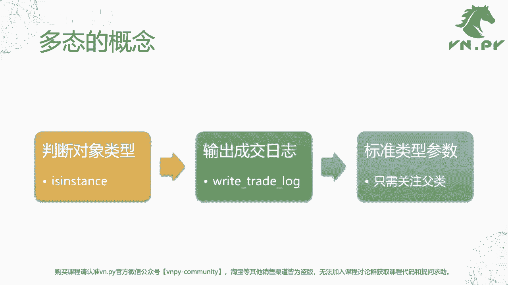
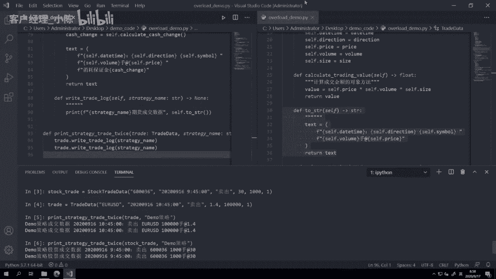
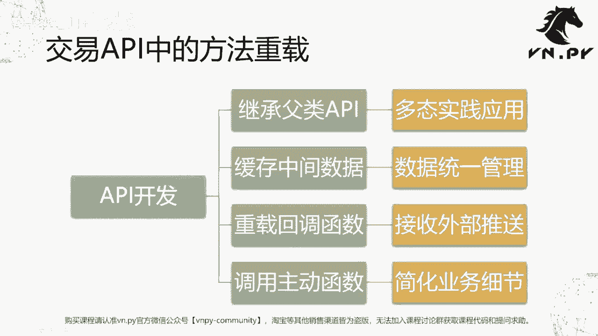

# 课时24 - 方法重载 - P1 - 客户经理_小陈 - BV1uX4jedEvM

OK欢迎来到量化交易零基础入门系列，30天解锁Python量化开发课程，那么今天呢是我们的第24节课，在上一节课里面呢，我们学习了类的继承的概念，那么在这节课里面呢，我们要来看一看诶，继承一个父类之后。

怎么样去通过方法重载来实现一个子类里面，特定的一个方法的行为，那首先第一个问题肯定是什么是重载啊，重载的英文是这个叫overload啊，重新去实现，重新去加载的意思，我们先来看啊，上截止到上一节课。

我们已经有了一个父类对吧，这个父类就是trade data，在trade data里面呢，我们实现了一个叫TOSTRING的方法，这个方法的作用呢是把trade data啊，这个内部的成交的细节数据。

转化成一个适合我们人类去看的，这么一个字符串，然后呢我们有了字符串，就可以对应的把它打印出来啊，或者说把它写到日志啊，或者说发邮件啊等等都比较方便了，否则的话光是trade data。

光是这么一个原始的类的话，或者说类实例化出来的这么一个对象的话，其实我们并对对于我这个啊人，或者说最终的用户来说，我并不是很好，能够直接去看它里面的数据，那我们用这个trade data啊作为一个父类。

继承出来一个子类之后啊，继承出来我们的这个叫做future trade data，那么此时呢我们future street data，自然就也继承了父类的这个two，string的这么一个方法。

当我们调用future street data的时候，诶它同样也会去输出对应的to string内容，但是呢我们今天要做的事情，就是重新覆盖在子类中的这么一个TOSTRING方法。

那么来实现一些诶我这个期货成交数据，如果我要把它转换成字符串的时候，我可能希望额外多输出一些内容啊，那么这么一件事情就叫做重载啊。

那还是来看我们的代码，这边呢我们今天创建一个新的代码叫overload，这个demo depi哈，中间有个下划线，然后我们把上节课中的内容都给复制了过来啊，就完全上节课结束了。

代码大家可以看到我已经复制过来了，然后我们要做的第一步啊，在这里，第一步把这些和调用相关的逻辑先给去掉啊，我只想保留和我们这个上面类定义相关的代码，我只想保留这些，那我现在想这个。

因为代码稍微也有一点差，大概60几行，至少我一页看不完了，但我有点想看一下整体结构，那我按住键盘上的CTRL键之后，按住CTRL键不放，先按K再紧接着很快的N2，实现这么一个代码折叠的功能啊。

这个是vs code提供的一个快捷键啊，就把代码折叠起来，你也可以按CTRLKCTRL1，那就全部折叠，就只留这个类级别的啊，这样的一个代码在外面，大家可以看到这地方有个箭头，你点一下它就可以展开了啊。

但一个个点无疑展开速度比较慢啊，所以我们用快捷键会更快一点，或者你想要全部展开的时候，按住CTRL键不放肯，然后紧接着很快的按K，再按J就可以全部展开啊，这是一个在我们阅读代码的时候。

非常常用的一个快捷键操作啊，那我现在在CTRLK2把它给折叠起来，那我们可以看到父类trade data下面我们实现了啊，除了这个构造函数INIT以外，有calculate确定value啊。

就是计算成交金额的方法，你可以看到vs code很方便，我一上去之后，自动就能有对应的这个啊一个方法的啊，说明信息的提示弹出来啊，TOSTRING这个因为我没有写它的注释字符串啊，所以就是什么都没有。

那TOSTRING的作用就是输出一个字符串，那这个字符串里面呢有相应的这些信息，接下来我们在两个子类里面，stock trade data和futures trade data里面。

我们可以看到我并没有实现TOSTRING这个方法，但基于我们上节课学习到的内容啊，这时候我打开一个terminal，同样先CRLS一下，然后CD desktop这个切到我们当前这个目录。

这个目录叫demo code啊，大家随便放在什么地方，你可以同样用CD的方法切过去啊，然后在这个时候呢，我们先来运行诶这个IPYTHON，来启动我们的交互式环境，或者你直接运行Python也行啊。

但看起来可能不是那么舒服，所以一般这种交互式研究的时候，我们推荐还是启动IPAON好了，然后from overload demo，import行哎，这个全部import，然后呢，我们第一步。

Futures，好我随便给他额这个输入一些信息啊，比如说这个IF2010对吧，成交日期是20200916啊，空格，下午14：55：00哈，接近收盘，我做了一笔，然后呢方向是买入price啊。

这个4300volume就是一啊，size是300啊，margin rate我就随便写个0。15，那这样呢我就创建一个future street，那同样因为我们继承自父类，所以呢啊。

我这个时候也可以用TOSTRING，方法来输出相应的信息，大家可以看到哎这个输出是没问题的，但是这里输出的这个TOSTRING的字符串，还是我们在上面啊，我们在这个trade data里面定义的逻辑。

那么我们知道啊，因为对于这个期货来说啊，他有一个额外的保证均率的概念，所以呢我可能对于这笔成交来说，我不只想要说诶，我只是知道你买了这么一个F20101手，艾特4300，我还想知道你花了多少保证金。

那我这个时候要怎么做呢，保证金这个逻辑因为只跟期货有关，所以我们不适合在trade data，就是父类里面去实现，同样的一在这个stock trade data啊，就股票成交数据里面。

那股票我们知道比较简单一点，它就是也没有杠杆，那就买一股，你就要付一股的钱，所以你直接用它去TOSTRING啊，这是合理的，但是对期货来说呢，我们可能想要实现一些特殊的行为，怎么做啊，也很简单。

那我一个可以这样直接复制，就在这手打啊，我这样这样复制手打也行啊，或者当然考虑到这个时候，我我我们节省点时间去直接把它复制过来啊，我刚刚已经复制过了，那大家注意我这边复制过来之后的这个TOSTRING。

它的整个函数的形态啊，就是diff或者说这个方法形态TOSTRING，然后括号里面的参数以及它的返回值，那么绝大部分情况下都不要去改它，就是在你重在一个方法的时候，一般情况下不要去改这个方法的参数啊。

如果你确实要额外提供一些啊可选的参数的话，那要注意这边的参数，你要提供一些额额这个默认值啊，这个概念我们后面再讲，我们先就讲今天的，和我们这个啊保证金相关的概念，那么原始的两行信息啊，日期方向。

代码数量和价格都有，那么我要的第三个信息，我在第三行再打好，那这个时候我要输出的是什么信息呢，消耗保证金，那消耗保证金我们大概知道之前的算法，他应该是等于这个。

就等于我们的这边的这个cash change对吧，那这个cash change，那我可以直接在这内部啊，我在这个类的内部去调用我们的calculate，Cash change。

除了可以在比如说下面我们这个啊，我们的这个命令行模式下，或者我们的IPAD里面由外部去调用啊，你看我们是一个外部对吧，我们创建future stray的对象，紧接着我们调用TOSTRING这个方法。

同时对象的所有方法，也都可以在对象的这些方法内部再去调用，那么这种调用呢，一般我们认为叫做所谓的主动调用啊，或者你用来纯粹给内部调用的，那你可以把它理解为叫主动函数啊，你给外部调用的。

或者说这个调用权不在你手上的，这个一般叫回调函数啊，这个概念呢我们下节课再啊，这个交易API的实现里面会更详细的来讲，我们现在这里反正你就理解这个cash change。

就是我调用了这个当前我这个类的calculate，cash change返回的这么一个结果，那我们也要记住这个calculate，cash change的这么一个逻辑啊。

在之前呢我们的这个父类里面是没有的，就这个方法是在子类里面实现的，在我们上节课里面实现的，然后此时呢我们这个TOSTRING里面，我们就用调用了一个哎，我们在子类里面才实现的这么一个方法。

计算出了我的catch change，然后呢此时我再把这个计算出的数值输到啊，这个我的要生成的字符串里面，然后return text，那么这样操作完了之后，我们其实就实现了这么一个叫做函数额方法。

重载的这么一个目的，那么下面我们就来看一下它的作用啊，为了让我们重载的代码生效，此时我们要先退出我们的交互式环境，再重新进来，因为一旦你加载了这个Python里面，某个文件的代码之后。

那这个时候如果你再去，我再次去from，比如我再次from overload加载啊，那我再创建一个futures对象，我然后to string，这个时候是不会生效的，一定记住这一点。

在Python里面加载什么模块之后，你重复去加载，并不会让Python去硬盘上再次读取那个文件里面，新的信息啊，新的这个代码来让它立即生效，而要正常情况下要退出才能生效啊，因为他这个时候重复加载的话。

它其实读的是内存里面已有的，那么一个啊代码的历史，所以呢此时都是以前的东西吗，他不会生效的，如果硬要生效呢，也也有办法哈，当然这个办法办法我们大概要到30呃，多节课后面讲的Python模块的时候啊。

有个import lab动态加载库啊，我们才会讲到它，在这里呢我们方便一点，就先直接exit退出啊，这个是IPAD的退出命令，然后我们再次运行IPON进来，那IPAD有个好处，就是哪怕你重复进来之前。

历史也还在，所以呢我直接哎我也不用手打了，就这样，然后再来个TOSTRING，大家可以看到这里，这个时候我们too string的时候啊，他就有了这么一个消耗保证金的啊，字符串的输出。

也就意味着这个时候我们调用这个TOSTRING，已经是在我们这个子类future street data里面实现的，这么一个two string。

那么这种叫做呃方法的重载，在用的时候有什么好处呢，就是我们这边要讲的一个例子，叫做多态多态的概念啊，我们整体要等会分三步来演示，第一步我们来判断类对象的类型，就还跟上节课一样。

我们用its instance来判断，第二步呢我们试着去输出一个成交的日志，write trade log啊，然后这个时候呢我们在retreated log的时候，我们只关注标准类型的参数啊。

就只要关注父类就行了，在每个子类里面我可以实现自己的逻辑啊，或者呃这个。

那我们这这边就开始来，在代码层给大家演示一下，第一步啊，我们在这个，那RETRILOG我这边就不再是一个说输出了，我们就直接是一个打印信息，Print seven two string。

我们在这里可以额外加一个入参啊，比如说这个嗯，我们就输出一个这个这个啊，当前这个成交的呃，或者说调用它者的名字吧，name啊，String，给它个名字叫strategy name嘛，策略名啊。

这是属于哪个策略的，然后我们就打印个信息，哎这个，好我们就这样叫某个策略的成交数据，然后呢，后面加上自身的这么一个TOSTRING的逻辑啊，那同时在retreat lag这个方法。

这这个方法是实现在父类里面的啊，我们同样在子类里面也来实现一个，啊除以简单啊，我我这边就不去加太多额外的东西啊，我就是把它输出一下不同的类型就行了，这个是属于啊股票成交数据。

然后呢这个是一个期货成交数据，我就很简单把它这个分一下不同的类型，将我们人看的时候呢清楚一点，所以我们可以看到第一步，我们在父类里面实现一个red lock的呃，trade lock的方法。

然后我们在两个子类里面，又分别去重载了这个方法啊，加上了当前你这个成交是哪个类型的，这么一个信息，那么接下来呢我们可以来看说啊，如果这个时候我定义一个额外的函数，叫做这个print trade log。

Twice，好这样吧，print strategy trade啊，打印某个策略的这么一个成交啊，他的这个唯一的一个参数就是一个trade啊，这个trade呢是我们父类的这么一个类型trade data。

那这时候这个trade啊我们就进来之后，就直接调用个这个right trade log啊，当然我还需要有额外的一个strategy name哦，还需要这个策略名，那我把它打两遍吧。

叫red print treated log twice，好打两遍，那这个时候呢我们进重新回到这个啊，哎Python里面先退出再启动，加载所有东西。

这个时候呢我们先来创建一个future street啊，那么我们再来创建一，Stock trade，600036，这个假设我们是早上成交的啊，卖出以30块钱卖出了1000股啊，这个和约乘数是一也。

他也没有注意，他没有这个后面的这个margin rate的字段啊，比起我们的这个features data少一个字段，这时候嗯回车创建它出来，然后可能我再创建一个最原始的trade。

这个trade我就创建一个外汇的好了，成交量大一点100万，好那这时候呢当我来调用print strategy，trade to twice这个函数，我可以按tab键自动补全额，来实现一个自动补全诶。

是死去多了一个，那首先我打印的是第一个，我的外汇的这么一个成交的对象，然后是哪个策略呢，我就给它起个名字叫做啊这个啊demo，Demo，大写吧好看一点，demo策略，那大家可以看到这时候输出的信息。

首先他输出了两遍对吧，因为我知道有两个调用在这个函数里面，因为我是twice，我调用了这个red log函呃，方法两次，然后这时候大家可以看到，我这原本身定义的trade的类型就是trade data。

所以我传trade data进去完全没问题啊，这个打出的结果都是对的，那如果我传我啊，继承父类之后实现出来的子类的实例，stock trade的话，同样也可以正确的打印出来。

大家可以看到这是策略股票的成交数据啊，最后再打印一个，比如说future trade，这个同样也可以正确的打印出来，而且future street里面还有额外，后面这个字符串消耗了多少保证金。

那么在这里啊，我们回到PPT啊。

代码演示其实不复杂，挺简单的，但是这个概念我们要回到PPT来讲，那这个时候我们输出成交日志，这个方法是一个叫做标准方法，它已经在父类里面定义好了，但是具体输出成交日志这个定义好的。

我们是是这个方法的形态以及它的这个参数，以及它默认的一个操作，其实就是所谓的print嘛，就打印一下，但是在我们每一个子类里面啊，我们保持这个方法本身的定义啊，它的方法名字，它的参数不变。

但是内部的这个打印的实现，或者说甚至你想做一些打印之外的事情，你都可以在子类里面继续去修改定义，那么对于我们那个print strategy，trade twice这么一个函数来说。

我并不需要去关注这个啊，具体你传进来的对象是父类，还是说是一个子类，只要这个这些类都是继承TRADATA实现的，那么我们都可以正确的把这个结果打出来啊，所以这个就是所谓的标准类型参数的好处。

那么在下节课里面，我们将会来结合上这节课讲的这个概念，我们来看一看交易API啊，其实我们会用的一个例子，就是一个CTP的API里面的方法重载啊，当然这个API的开发本身的内容，就有很多细节的内容。

但整体上它的原理，其实我们在这节课里面已经啊，就过去两节课里面已经讲完了，第一步，我们拿到一个，比如说上汽技术公司提供的这个CCTP的API接口，然后呢，那个API你可以把它想象成一个父类啊。

此时我们要先来继承父类，实现一个我们的子类，就继承父类API，这个是一个多态实践的应用，我们今天讲了，然后第二步在呃这个比如说很多操作啊，登录发单撤单的时候，中间有很多求所谓的中间数据啊。

这些数据我们需要在子类里面来实现它，来缓存它啊，这个是用到我们数据统一管理的这么一个逻辑，那这块呢你可以参考，比如说我们在实现future street data的时候。

加上的那个margin rate的这么一个额外的数据字段，第三步叫做重在回调函数，这个回调函数其实就啊第一个重载的概念，我们今天讲第二个回调函数啊，是一个由外部，由我们这个类外部来调用的这个函数。

或者说甚至不是我们内外部，而是我们写程序的人啊，外部就他不是我们写程序的人去控制的，而是比如说当CCTP的柜台，服务器发一个数据过来的时候，我这个API就会自动帮我去调用回调函数，所以他什么时候被调用。

我不知道啊，但是我知道那边有数据推过来了，他就会立即去调用，所以这种控制权不在我手上的函数，就叫做回调函数，英文叫call back啊，它用来接外部的推送，最后呢还有这个调用主动函数。

就比如说像我们今天在类里面做的一些操作，什么to string啊，这类函数往往是用，为了实现某些我要去操作的功能，比如说我要发单，我要撤单，我要查询合约信息，这些是我要做的事情。

所以这类函数呢叫做主动函数，当然了，接口提供给我们的主动函数，因为功能比较丰富，比较多，很多时候我们用不着那么复杂的，所以我们可以自己来把它进一步封装简化一下，把它实现成这个简化版的。

这个我们的主动函数啊，就是所谓的简化业务细节，那我刚刚讲的这个回调函数和主动函数啊，尽管我用函数这个词，但是你要有这么一个理解，就这里啊讲的同样是那个方法啊，就是这个啊是在那个API类上的回调。

方法和主动方法，当然一般有的时候，我们考虑到其他语言的一些兼容性。

我们就直接讲回调函数，主动函数了，OK那么这节课的内容呢就到这里，更多精华内容，还是请扫码关注我们的社区公众号。

