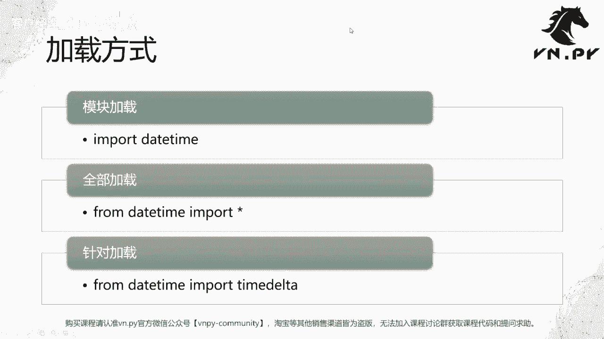
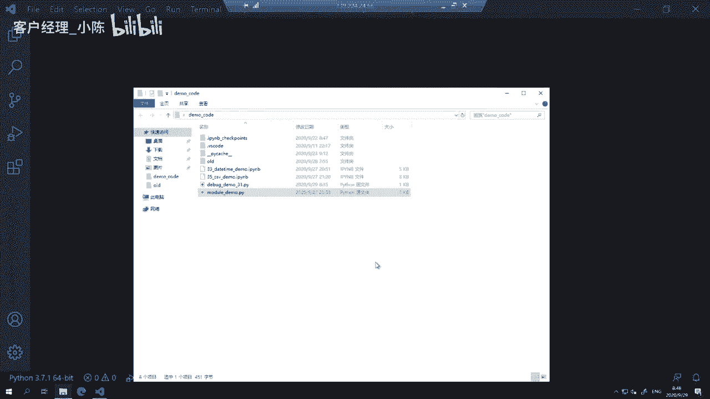
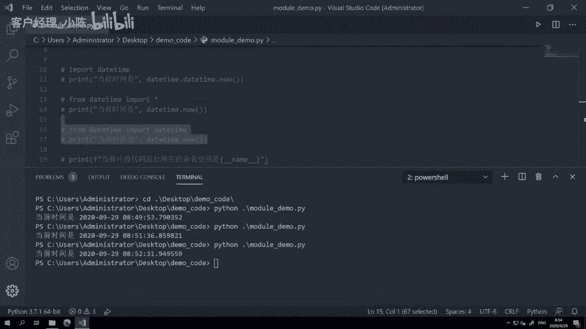
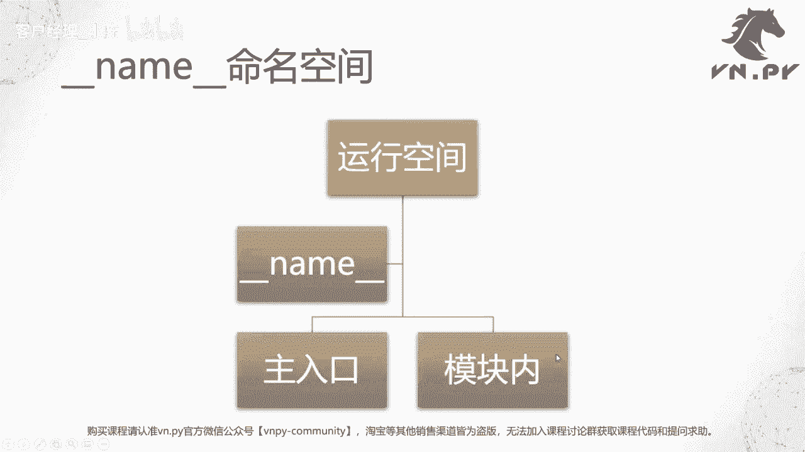
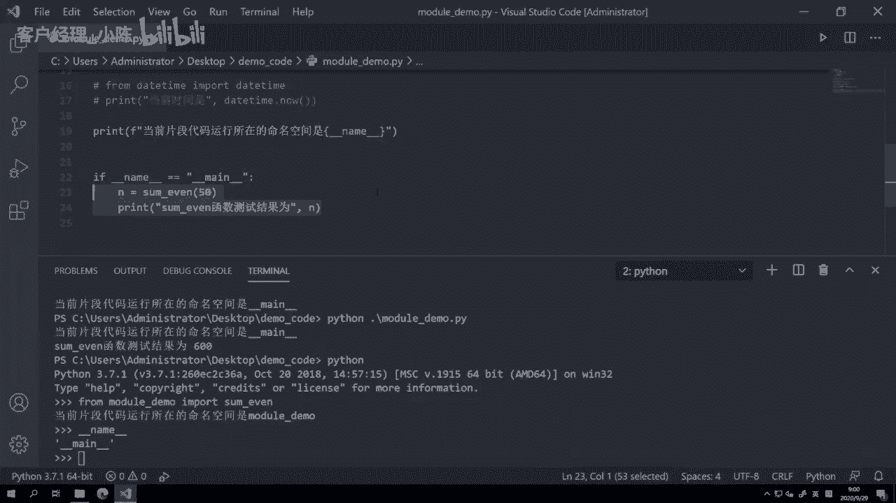
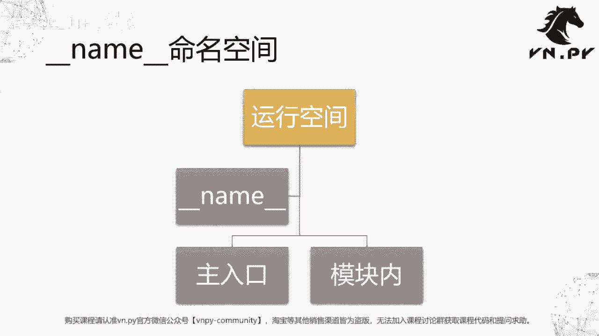

# 课时32 - Python模块 - P1 - 客户经理_小陈 - BV1A84te3Euv

量化交易零基础入门系列，30天解锁Python量化开发课程，那么今天呢是我们的第32节课啊，到上一节课，31节课我们讲完了IDE里面的单步调试，那么整体上我们对于这个Python里面异常处理。

这块的内容就告一段落，从这节课开始呢，我们要花接下来十几集的时间，都会集中在讲这个Python里面非常重要的一个话题，就是Python的模块，那么我们知道Python语言在过去10年里面。

可能发展是真的非常非常迅猛，先是占领了量化这个领域，后来呢到了大数据，然后呢就又到了这个最近几年比较火的啊，机器学习，那之所以能有这么迅猛的发展啊，我们总结除了最早我们就讲到了Python。

这个易学易用对吧，用起来特别方便，然后动态语言写代码也快，大家现在都感觉到了，最后还有个特别重要的一点，就叫做整个社区都在遵循一个精神，就叫做站在巨人的肩膀上，什么意思呢。

Python里面可以很方便的把你写好的某一块功能，打包成一个模块啊，这个模块的名字可以叫做modules，或者有的时候你也可能把它叫做packages啊，都可以，这个是他们的英文名字，反正都一个意思。

那么这些模块你可以未来在自己的代码里面，再去啊重复使用它们，这样就避免了每次啊这每每写一个功能代码，我都要把一些重复的部分给复制粘贴，弄来弄去的，那个特别麻烦，而且容易出错。

你直接把一个已经可以稳定运行的函数，放到一个文件里面，那未来其他的这些程序，都直接通过这个文件来加载这个函数，那这个就非常方便了，这种模式呢就叫做代码的复用，那么现阶段可能我们自己写出来的代码。

这个复用的价值呢不是特别的高，可能主要就是我们自己在用，但是对于整个全世界的开源呃，Python的开源社区来说，那真的是有很多很多的人花了这个啊，无数的精力和这个资金投入去。

写出了一个又一个强大的Python的模块啊，比如说NP这个最早其实是JPMORGAN这家银行啊，在在这个囊派的整个开发过程中，给了非常大的啊赞助，然后还有这个pandas啊。

pandas我们知道是从美国的那个对冲基金，AQR里面，被这个发明以及慢慢推广应用开来的，当然他现在已经成了一个大数据的啊，实际应用的标准啊，还有这个其他很多库啊，我们就不一一个一个讲。

那嗯这么多模块都是在网上非常方便的，我们可以直接拿来就用啊，你没有什么太麻呃，就像其他的CC加什么的，你可能要下载源代码，可能要编译什么，Python里面可能就是啊两行操作，一个pip install。

然后紧接import就能用了，所以接下来呢，我们就要一点一点来掌握这块知识，这个非常非常重要啊，因为Python本身的语法我们已经学完了，下面呢就是去掌握怎么样去用这些模块。

更快的呢把我们要做的事情给做出来，而不要每个功能都重复的自己去开发啊，这个没有意义的啊，所以一定要站在巨人的肩膀上，接下来呢我们要讲的这个模块啊，会包括三块内容，第一块叫做内置模块。

这个是所有的Python发行版都会提供的模块，说白了他们也是Python官方提供的这些哎，常用的模块，比如这个，可能我我个人觉得最常用的功能之一，就是date time啊，随时去获取一个时间。

随时去获取一个日期，然后有的时候围绕时间做一些计算啊，这个就date time模块，然后第二个长这个分类叫做三方模块，三方就是除了Python官方和你作为用户以外的，第三方提供的模块，那么很多啊。

我们这种比较偏应用功能方面的模块，比如说呃囊牌用来做矩阵运算的，比如METPC用来绘图的，比如VNPY啊，或者可能我作为作者，我更喜欢叫他边缘点派啊，用来做量化交易的，那么这些模块都属于三方模块啊。

就是别人开发的，但不是Python官方，也不是你最后一个叫做本地模块啊，module比如说我们这这节课里面，等会我们会啊用到一个啊demo的模块叫module demo啊。

就是我自己写的这个就叫本地模块，那整体上所以一共就三个方面，一共分为三种，官方写的叫内置模块啊，你别人就除了官方以外提供的叫三方模块啊，你自己写的就叫本地模块，分成分成这么三类。

那么下面我们要来看一下加载方式啊，就是模块的加载怎么样去加载呢，一共分三种不同的级别，第一种叫做模块级别加载，Import date time，就直接加载daytime这个模块，第二个级别叫做全部加载。

From date time，import新这个方法我们这边要先讲一句，就是它是Python官方社区，现在不推荐大家使用的方法，因为你一次把所有啊，不管你要用的还是不要用的功能都加载进来了。

这个呢有可能会诶某些不同模块里面，它有一些函数，它名字是一样的，你如果同时这么加载的话，是很有可能会发生冲突的，因为你不是一个一个自己把要用的函数名，打出来的，你真两个模块。

你from daytime import date，还有from data import date啊，你都看到有两个同名的东西，你人会意识到，但是你用这种import新的方法啊，很多时候你就意识不到了。

所以这种全部加载现在是Python官方所不推荐的，最后还有一个针对性加载，直接就从这个模块里面加载，对应的这我要用的那个功能啊，这个就叫做针对加载，那么我们这边呢就来看一下他们好。

我们就直接开一个解释环境，来看一看他们的效果。

那么这边啊就是module demo里面，还是其实我们上节课写的那个some even的函数啊，就就完全一样的内容，我也没改它，把它放在上面，然后我们这边呢，大家可以看到有下面这么多行内容。

第一行就是叫做模块及加载，然后我把取消注释，按住CTRLK再按U按住CTRLKU好，就可以取消注释，或者按住CTRLKC就可以快速注释啊，其实就是comment和UNCOMMENT的这个缩写。

那这地方怎么去啊，怎么去这个这个理解它，那我是加载了一个daytime这个级别的模板，就用import就加载的意思嘛，英文里面加载的意思，我一上去大家可以看到什么concrete。

Daytime and related types，就是Python里面专门用来啊去计算时间，计算日期相关的这么一个库啊，里面既有函数，也有类啊，也有各种对象等等，反正都放在一起，这样呢用起来会方便点。

我们就做一个特别简单的操作，叫做print当前时间是什么啊，为了去打印这个当前时间，我们要调用daytime下的一个DTTIME类，它对应的一个now函数啊，去获取当前时间啊，说起来有点绕啊。

但你可以理解就这个模块名字就叫date time，它里面又有一个类也叫date time啊，now是这个daytime类对应的那个函数，所以这样我们哎紧接着就在这里面来运行一下。

可以看到打印出来当前时间是得得得啊，9月29号啊，08：49：53，那么这是第一种最常用的就是呃模块级别加载，就是直接把date time这个模块里面，所有的类和函数全部import进来啊。

我所以所有的我就都可以直接用了嘛，然后date time点now啊，这么一个操作就行，那首先你看我们ID其实很聪明，他已经给我们提示了这个地方，你先把移上来哎。

下面红线叫做module level import not at top of fire，这是第一个，就是你加载东西的话，一般推荐把这个import的代码，都写在文件的最顶部啊。

但因为我们这节课的内容是为了来演示，我就把它写在下面了啊，第二个提示是from daytime，import这个star啊，就这个这个新used啊，这里有个报错。

叫做unable to detect undefine names，就无法帮你去识别这个加载进来的模块有哪些，所以flake8，接下来在这块的检查可能就会错误，出现错误的信息。

比如这里的date time点now，他就告诉我们date time may be undefined，有可能你压根就没加载它，或者也有可能是你用了这个叫STIMPORTS，就这个全部加载这么一个模式。

反正我我我为这个flag8，我没办法帮你判断啊，你要判断人自己去判断去啊，这个就是flag bgm的意思，所以这种加载方式呢并不推荐啊，有的时候我们可能自己很方便的写一个脚本啊，想随便跑一跑的时。

OK没问题，就像这样的简单的代码，你去写它没问题，但是在VA派里面，或者说在一些你自己写的比较体系化，打算的固化下来，打算未来给别人用啊，打算留着，可能未来长期用个45年的这种代码啊，重复用的。

不要这么写，所以这这也是一个我们要强调的点，然后把重新注释回去，最后是这个啊，就是对应的叫针对加载了，我就从date time这个模块里面加载，date time这么一个类啊。

加载完了之后打印这个时间啊，当前时间是得得得完全一样的，那你可以看到这么写的话呢，它就有一个提示啊，就是module level import not at top of file。

就是让我把这个import写到文件最上方去啊，这个没关系，反正我刚刚也讲了，只是为了演示嘛，我就把它放在这啊，运行的效果大家可以看到都一样的，就是输出当前时间是什么时候啊。

但是啊这三种import方式呢，我们是三种不同的import方式，那一般怎么去选啊，怎么选，最后面这种方法叫针对加载，是目前Python官方也好，还是我们自己VUE派团队啊，我们在写代码的时候。

我们感觉比较方便的一种写法，因为它第一个可以让你知道哦，我到底加载了哪些东西进来啊，我人就先判断一下，我有没有什么地方重复加载了，或者或者直接加载错了，第二个呢它对我们这个像flake8。

像我们的vs code检查一样啊，它也会比较友好一些，因为你已经把你要加载的，你要用的那个函数，名字或者类的名字都给打出来了嘛，所以他就可以帮你去智能提示了，反过来这种方法加载模块级别加载。

这个呢一般是当你要用到这个模块里面的，功能函数什么特别多的时候，你比如要用到几百个，那你一个个加载，那写的太有点太长了，所以有的时候就索性把这个模块，直接给加载进来啊，然后要用的时候。

就等于模块点什么什么什么变量就行了啊，这种方式呢也会有用啊，最后这个带新的这个加载，这种方式相对不怎么常用啊，这但但也看了，就是有的时候如果就像我们刚刚说的，哎，你写一个简短的脚本是吧。

那我知道反正不会出什么问题，我就加载一个star好了，这样写代码会快一点啊，这额所以所以Python官方也是比较自由吧，给了给我们推荐了，一共提供了这么三个不同的选择啊。

当然E3是比较推荐的。

OK嗯，然后我们要讲的呢是一个命名空间的问题了，命名空间啊，这个就就就就大家可以看到这是个name，然后前后带俩下划线啊，看到这个东西，你第一反应是什么，是Python的魔法函数啊。

那么name它稍微特殊一点，它它这个是在负极命名空间里面的一个存在，它不是魔法函数，它是魔法方法啊，什么叫魔法方法呢，啊不不不好意思，它不是魔法这个函数或者魔法方法，它是魔法变量，什么意思。

它是一个我们Python解释器自身在运行时用来啊，标识当前状态，一种特殊的变量，就它是Python解释器自己的啊，一般情况下不推荐你去用它，但是呢这个name和那个INIT一样。

都是非常非常常用的一个使用场景啊，我们等会就来看一下，它，主要作用呢，是标识出当前你这个代码所在的运行空间啊，有两种情况，第一个是主入口里面。

第二个是模块内啊，什么区别呢，我们来看一下，在这啊我们回到这个module demo里面，现在想象一个情景，就是我可能想要在某个地方用到some event这个函数，举个例子。

我可以直接在这Python啊，启动Python解释器，然后from module demo，啊然后就可以调用这个函数，Sum even，啊对11内求和等于20，然后这里这里我们可以看到啊，他有个提示。

叫当前片段代码运行所在的命名空间是module，1even啊，就是当我去加载some even这个函数的时候，some even这个函数它的运行空间啊，是在module demo这个模块里面的啊。

就它属于一个模块级的存在，另外一种情景呢，就是我直接去运行Python module demo的时候，它会显示当前代码运行所在命名空间是诶，这个啊它是一个字符串啊，这个前后俩下划线，然后中间是个man。

这个命名空间是最特殊的命名空间，Python整个运行环境内只有一个命名空间，那只有一个main的命名空间，就是我们程序的主入口，当你在cm在这个啊。

这个这个啊所谓的console或者terminal里面，用Python命令去运行后面的一个Python文件的时候，这个文件就是你整个Python代码的主入口，然后这个文件里面的命名空间。

只有它里面的命名空间是这个名字是main空间，其他所有它加载的模块的命名空间，都是对应的模块及命名空间，所以你可以看到我刚刚这个啊，在如果我是去加载这个module demo这个模块的时候。

因为它是作为一个模块被加载的，所以他会知道啊，自己现在是作为一个模块在运行，而不是主程序在运行，这个是一个很重要的一个区别，那有一些时候我们可能想要做一件事情，就是如果这个我直接运行这个函数啊。

这不好意思，直接运行这个Python文件，那我才去做一些事情，反过来如果我加载的话，我就不去做这些事情，举个例子，比如说哎我就如果直接运行，我就做个测试，sum1even啊，这个50就就N等于some。

因为print sum，故为，好这行代码这这个一个哎这么一个操作哈，一般情况下非常常见的，可能呢我在这个文件里面定义的一个函数，然后如果我直接这个运行这个文件，他就帮我去把这个测试结果打印一下。

哎我想看看说OK他能不能正常运行，反过来，如果我是在其他地方加载这个模块，或者这个文件的话，你就不要去帮我运行测试，因为那都是我加载的，我不要你帮我运行测试好，所以我们这边可以演示一下。

Python直接运行这个文件的时候，你会看到哎有这么一行信息，some event函数测试结果为600，但是如果你直接启动Python就import哎，这个就from modu demo。

import some even的时候，你会发现这一行这个是没有运行的，因为当前代码片段是module demo，它和这个刚刚main不一样啊，他不是这个这个字符串，所以它就不会运行了啊。

反过来我们在当前命名空间下，你去哎取这个name啊，就是我在交互式模式下去取这个name变量的时候，你会看到它是这个main啊，因为当前我是直接启动了Python的解释器。

所以这个时候主入口就是我们的这个解释器，环境啊，所以他就是一个man，所以这个也是一个啊Python里面比较啊，就是你有的时候写代码，初学的时候比较容易遇到的问题啊，就为什么这地方要这么写呢。

因为如果你不把它包在里面，像这个print这行代码，那就是你不管什么时候import，它都会有这么一个打印，只要你import这个模块就会有这个打印，这个打印啊，有的时候呃在我们这里是符合预期的。

因为我就是要给大家看当前命名空间嘛，但如果下面这个啊打印测试结果，你你可能就是直接运行它的时候，它你才想看一个测试结果，如果是加载的话，我不要你帮我去啊，把这个东西打出来啊。

所以呢就可以通过这么一个判断的方式啊，来决定到底要不要去运行某些逻辑。

那么OK啊，这节课的内容呢就啊也先到这。

然后更多精华内容，还是请扫码关注我们的社区公众号。