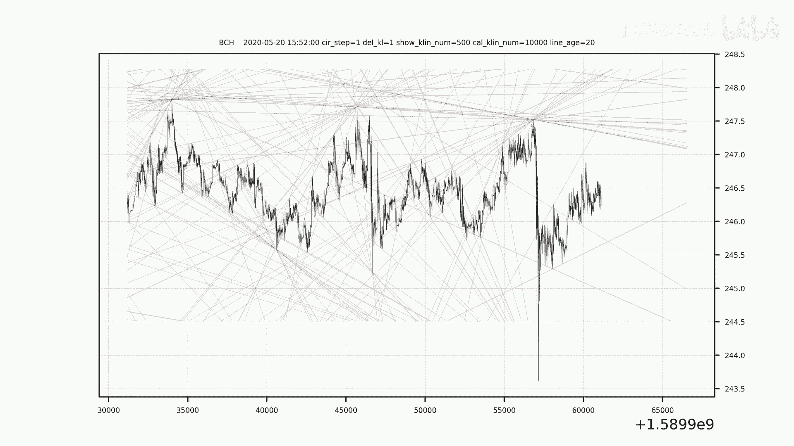
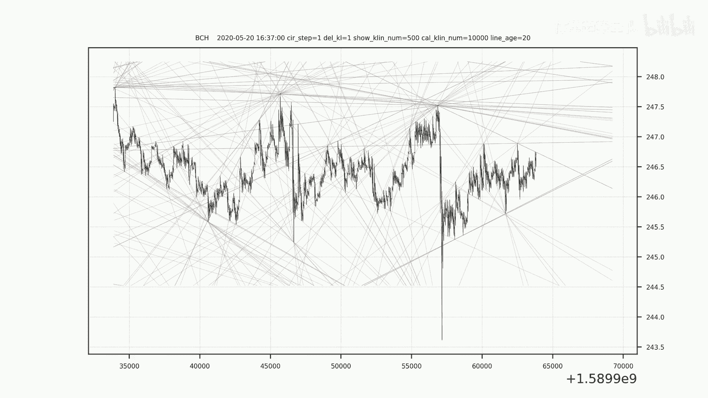
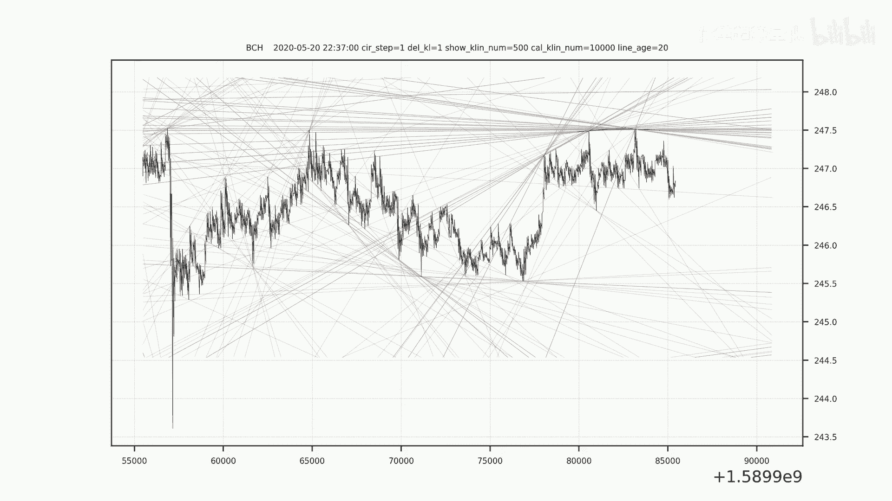

# 走向未来的交易方法：量化策略下的趋势分析 - P1 - 体重趋势量化 - BV1aZ421J7uH

🎼。🎼。🎼，🎼い旦？🎼。🎼一？🎼い？🎼，🎼，🎼，🎼，🎼あ。🎼，🎼，🎼，🎼。🎼，🎼，🎼，🎼，🎼，🎼。🎼，🎼，🎼。🎼，🎼，🎼，🎼，🎼，🎼，🎼，🎼，🎼The。🎼，🎼。🎼。🎼。🎼，い。🎼。🎼い？🎼き？🎼あ。🎼。

🎼。

🎼，🎼た。🎼，🎼，🎼，🎼。🎼。

🎼，🎼。🎼，🎼。🎼，🎼。🎼，🎼，🎼，🎼，🎼，🎼，🎼，🎼。🎼，🎼，🎼。🎼，🎼。🎼，🎼。🎼た。🎼。🎼，🎼い旦？🎼。🎼？🎼き？🎼，🎼，🎼，🎼，🎼，🎼，🎼。🎼，🎼，🎼The。

