# 趋势之王or虚有其表？Python量化25种均线用法，哪些有用，哪些没用？【量化投资邢不行啊】 - P1 - 量化投资邢不行啊 - BV1XT421v7iz

大家好。

我是专注于量化投资的，行不行，经常在A股赚钱的朋友，肯定听说过很多关于均线的传说，什么金叉买进，死叉卖出，均线联合行情将变，均线盘整行情待发等等等等。

甚至也大神说，他只看K线和均线就能够稳定盈利，当然传说归传说，均线到底有没有用，从来也是众说纷纭，那么本期视频我们就来聊一聊均线，并且啊这一期我花了很大的精力，帮大家测试了整整25种常见的均线用法。

并从中挑选出其中表现不错的形态，来分享给大家，本视频后续涉及到的数据和代码。

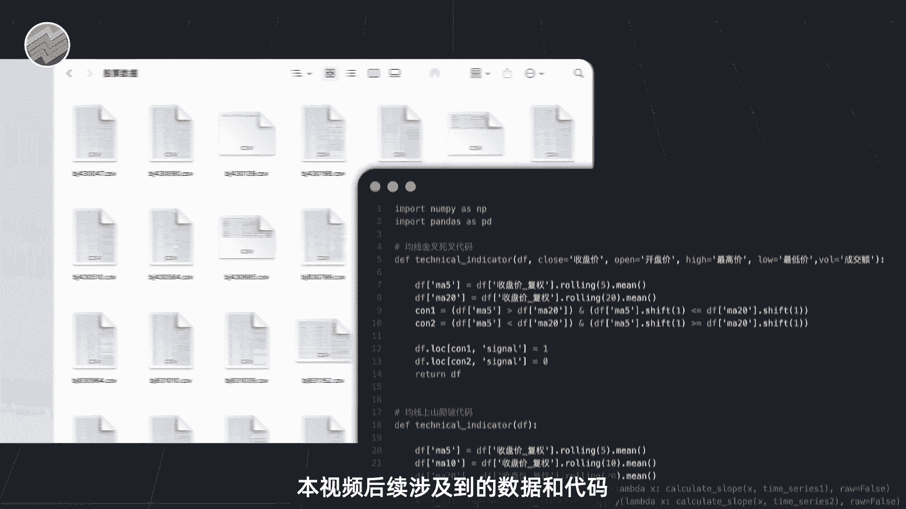

也都会发给大家，大家可以在评论区留言，这次真的很累啊，用一份免费的资料换一个免费的赞也不为过吧。

首先呢我们先介绍一下什么是均线，均线的全称是移动平均线，又叫做ma moving average，由美国投资专家葛兰维于20世纪中期，是通过将一定时期内的证券价格加以平均。

并把不同的时间的平均值连接起来，得到。

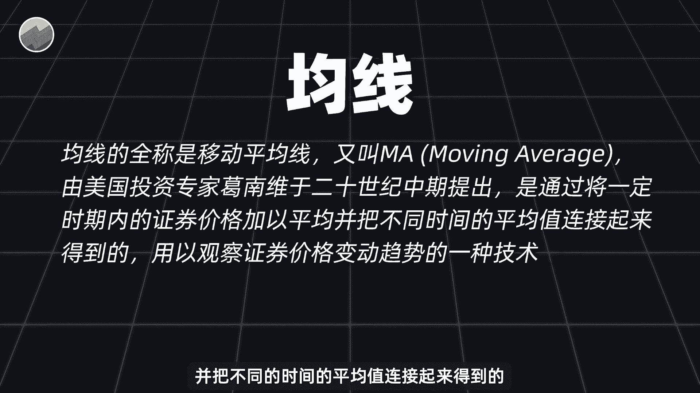

用以观察证券价格变动趋势的一种技术指标，以上这段说了等于没说的话呢，是GDP帮我写的。

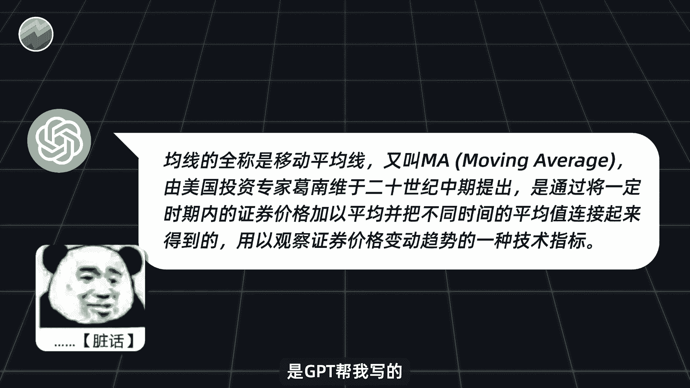

说人话版本呢，就是我们每天把过去N个交易日的收盘价，求它的平均值，然后呢把这些平均值连起来就能得到一根均线，我算过去五天收盘价的平均值。

那就是ma5，过去十天呢就是ma10，也就是我们行情软件上面，这个白色的和黄色的两根线，相信炒过股的朋友都见过吧，当然啊，软件上的这些均线我们自己也可以画出来，我曾经做过一期视频。

就是教大家用一行代码来画均线的。

感兴趣的可以去看一看，也可以问我要的数据和代码，自己把玩把玩，然后呢经过多年的时间，均线的队伍也不断壮大，出现了很多新型的均线，比如说f ma aw ma等等等等，时间关系我就不一一介绍了。

我把他们的概念都列了出来，感兴趣的可以自己截图查看，就我们自己实际使用的经验来说呢，这些衍生的均线即使有效，也不会比最简单的均线好太多，另外很多看似很复杂的技术指标，其实也包含了均线的理念。

这是由均线构成的，比如说一些交易者偏爱的布林带，它的计算公式呢就是这样的，其中的中国啊就是我们的20日均线，另外的两条线是由均线延伸而来的。

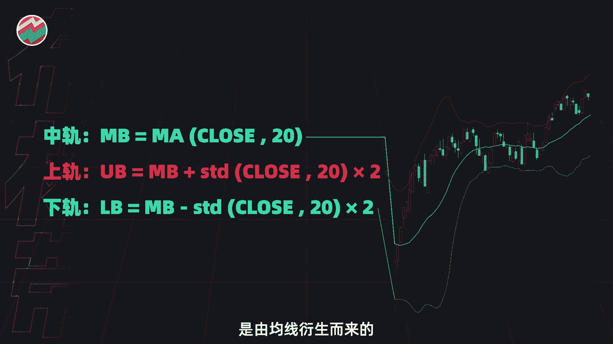

可以说时至今日，均线已经是一个极其常用的趋势性指标了。

甚至在所有的行情软件上面，你打开任意一个股票的K线图，我们都可以看到它，并且是默认自带，可以说，这一根线已经刻到每个A股股民的DNA里了，也正是因为低头不见抬头见，很多人自然而然会使用均线去辅助交易。

比如将均线作为国家的压力位或者支撑位等等。

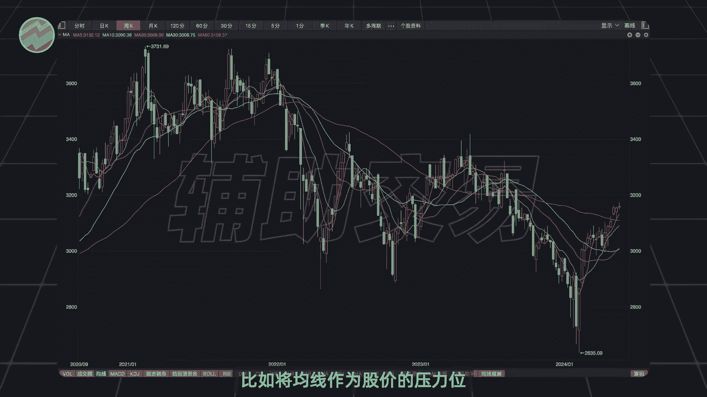

不仅如此，很多股民家也会在电视上面去用均线分析大盘。

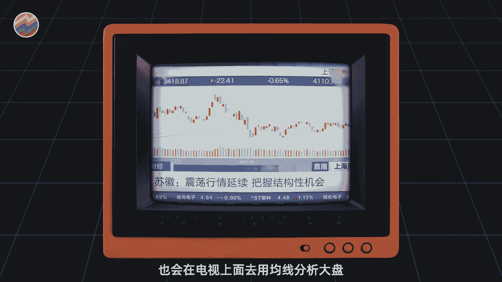

甚至一些官媒的报道当中也会用到均线，可以说，均线确实是最简单又最常见的技术指标了。

那么肯定有人会问，那均线到底怎么用呢，我均线帮他大家整理了25种，市场上最常见的均线用法，比如多头排列啊，金叉死叉啊之类的，大家感兴趣的话。

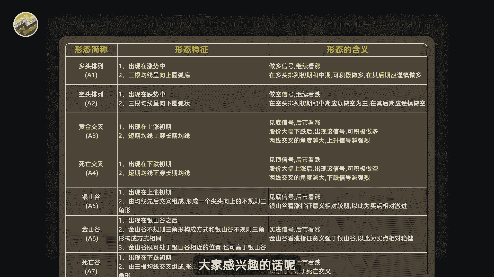

可以暂停截图观看，那以上的均线用法效果如何呢，或者说哪些好用，哪些不行呢，这个如果你自己不会编程，那就只能自己用亲自的钱去实验，亏过或者转过之后才能知道，那我们做量化交易的呢就可以用数据说话。

我只要借助全部A股历史数据和Python代码，就能去看看在历史上，这些均线的用法到底能不能帮我赚钱，快速的验证这些指标，具体的数据呢我已经帮大家准备好了，证明包含了A股历史上所有的5000多只股票。

甚至是那些已经退市的，你可以打开其中任意一个文件啊。

这个股票从上市第一天至今，每天的开高收低的价格，还有成交量，并且你还可以计算复权价，非常的完美，如果你需要这份数据的话，大家可以在评论区留言，都是可以免费直接发给你的，有了这些数据之后呢。

我们就可以做相应的测试了。

首先呢我们来验证最常见的均线用法，金叉和死叉，假设我们现在有两根均线，代表短期的5日均线和代表长期的20日均线，当5日均线从下往上穿过20日均线的时候，就会形成一个交叉，英文叫做，然后大师们说啊。

这是一个非常好的买点，此时应该去买入股票，所以呢就把这个交叉叫做黄金交叉。

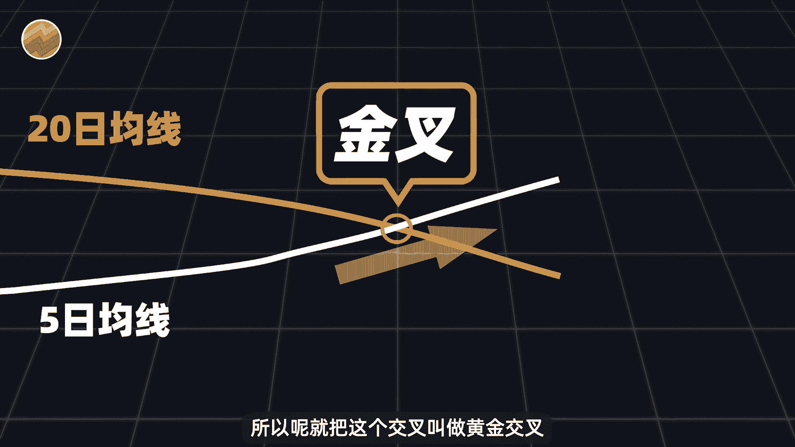

简称金叉，意思啊就是这个买点价值千金，我印象中，很早很早之前有一篇讲A读古诗的小说。

名字就叫做金叉，大家感兴趣可以找出来一读，回到我们这个金叉啊，比如说图中这个股票的K线在金叉发生，股价也确实一路上涨。

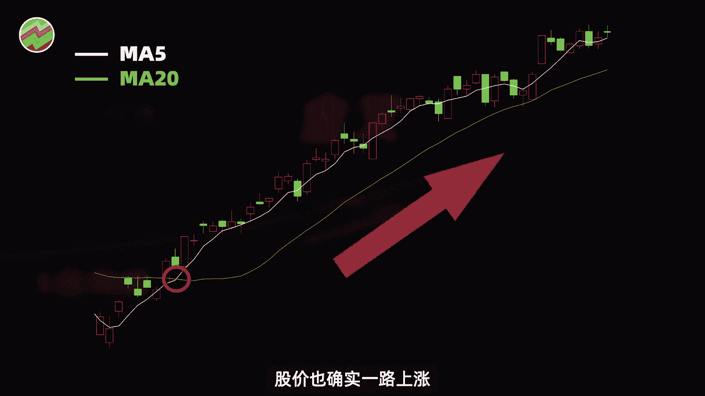

那么反过来，当5日均线从上往下穿过20均线的时候。

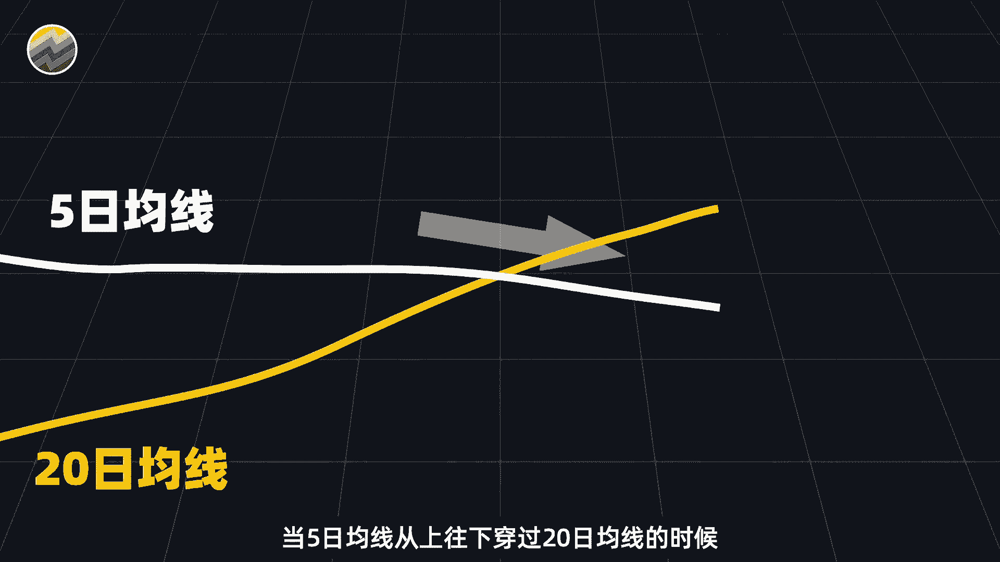

就会形成死亡交叉，此时被认为是股票的一个卖点，之后，股价大概率会下跌。

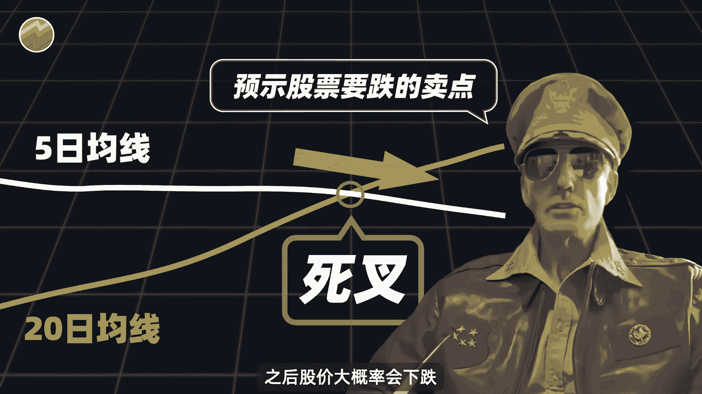

称之为差，比如说图中这个股票在死叉过后，股票呢就一直下跌，关于均线金叉查的案例还有很多啊，这边给大给大家展示几个，都是我们A股历史上确实发生过的，那么这么一看好像还是挺有用的啊。

确实金叉之后股价在涨幅差之后呢，股票又在跌，但我们不能只是像那些股评家一样，对着几张图就轻易的得出结论。

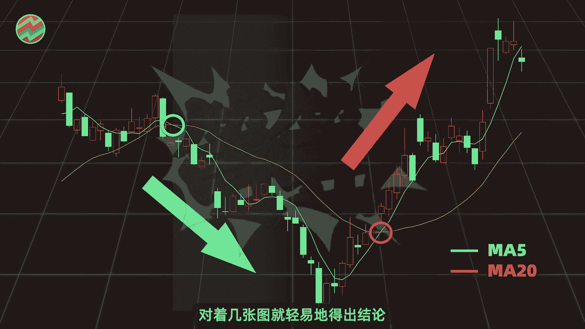

想要准确的得出结论呢，我们需要通过A股全部的历史数据，找出历史上所有的均线金叉和死叉，并且借助Python代码统计之后的上涨与下跌概率。

这样才有说服力，相关的数据和代码呢我们都已经准备好了，你只需要打打开这个PY后缀的文件，点击运行即可，如果你需要这个数据和代码的话呢，大家可以在评论区留言。

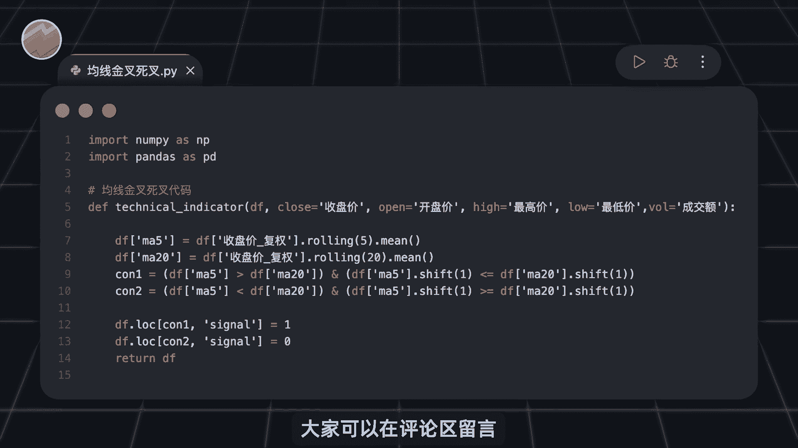

也都是可以直接发给大家的，在看程序运行结果之前，先插一个题外话，经常有人问我，某某技术指标的量化效果到底如何，或者能不能帮他验证某某指标的用法，为此我特意为大家准备了一个技术指标。

测试大礼包里，打开大礼包文件，它包含了非常多的内容，首先量化的基础就是准确的历史数据，我会送你一份股票历史交易数据，你可以用它来像我一样去测试所有的技术指标，看完了数据，我们再来看这个表格。

文件里面总共记载了125个技术指标，有他们的名，更详细的计算公式以及他们的中文描述，甚至关于这个指标到底如何使用，如何产生买卖信号，也帮大家整理好了，非常的全面，为了让小白也能自己写出指标代码呢。

我还为大家准备了一份技术指标编写说明，按照这个说明，就可以完全看懂技术指标的计算公式，并将它们都用编程实现。

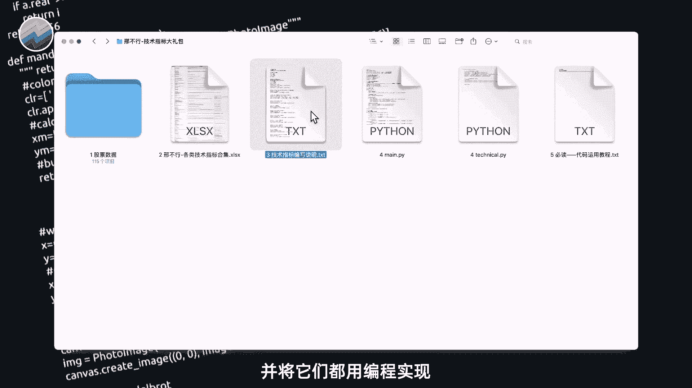

也推荐大家自己去尝试一下，再然后呢，就是我们用来计算技术指标，和验证它效果的Python代码了。

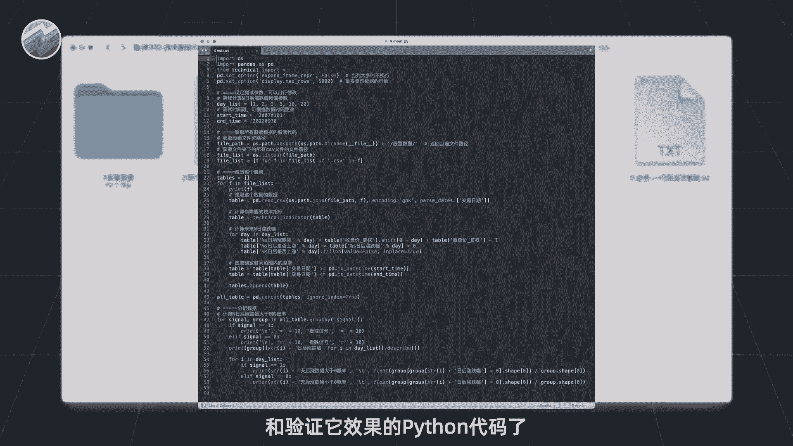

大家不要听到代码就害怕，不用担心这个代码是傻瓜式的教，哪怕你没有任何编程基础，参照我们的编写说明，也一定是可以搞定的，最后也是最关键的，我还为大家准备了相应的教程。

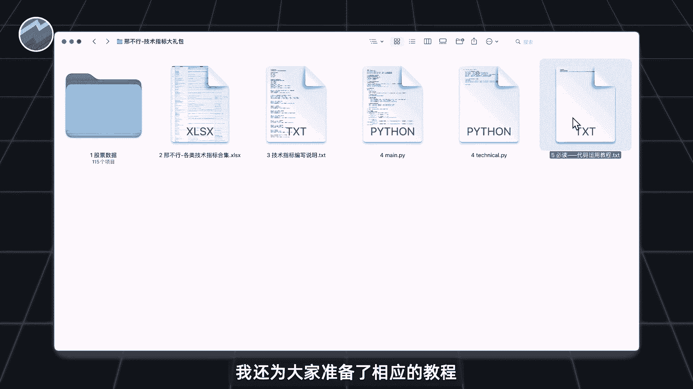

根据我准备的上述资料以及教程视频的讲解，你可以零基础的学会如何计算所有的技术指标。

并且测试它的效果，看看哪个更有效，所以这个大礼包的内容真的非常的丰富，如果你需要的话。

大家可以在评论区留言，也都是可以直接发给大家的，程序运行结果如图所示，从2007年至今，A股历史上，总共发生了37万次的均线金差额，经查发生之后呢，股票上涨的概率大概在50%左右，和抛硬币是差不多。

并且它的平均收益在短期内很小，基本上可以忽略不计，但是从中长期看，十天之后，它的平均收益率有0。66，20天之后有1。27，这个表现是非常不错的，也间接说明了金叉作为这样的一个买点。

虽然它的胜率是五五开的，但是赔率还是可以的，反观我们这个均线死叉发生之后，股票下跌的概率呢，同样是在50%附近，但是未来的平均收益啊基本都是正的，和子差会下跌的这个预期啊完全的相反。

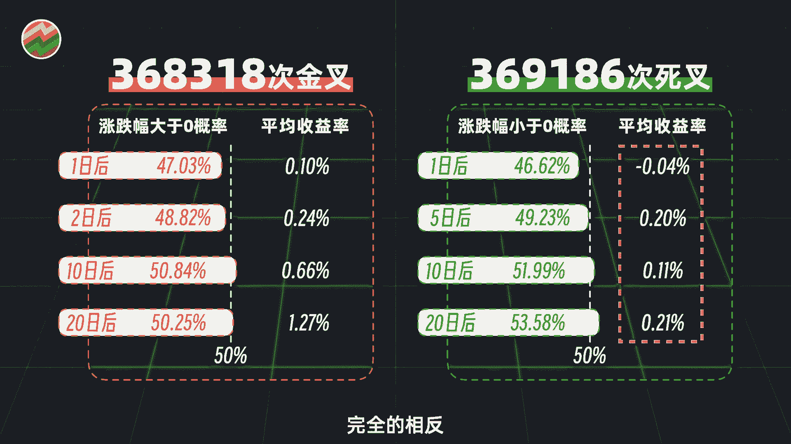

所以这确定是一个卖出信号吗，所以有了这个数据啊，就非常直观的证明，不管是金叉死叉，都是不能很简单的直接去运用的，但不管怎么说，我们也可以确定均线的金叉在A股上面。

不管怎么样，确实是有一些效果的，而死china则完全没有效果，然后呢由于时间关系，剩余的20多种均线用法，我们也无法一一给大家讲解，接下来呢我们就直接介绍两种测试，表现优异的用法，至于其他的呢。

大家想知道效果如何的话，可以问我要了相关的数据和代码，自己去做测试。

我们先来介绍蛟龙出海的用法，这霸气的名字一听就感觉不同凡响了，根据网上的描述呢，这个形一般出现在股票下跌或者横盘的时候。

当我们看到某一天一根较大的阳线自下而上，同时穿过了5日十日20日均线，并且呢最后收盘价在这几根均线之上，这就意味着交易出海，后续股票会不断的上涨，途中圈出来的地方就是蛟龙出海，形态，非常的霸气啊。

一根大阳线，千军万马来相见，那蛟龙出海这个均线形态实际效果又如何呢，我们同样借助全部A股历史数据和Python代码。

来帮助我们进行计算，你只需要打开这个PY后缀的代码。

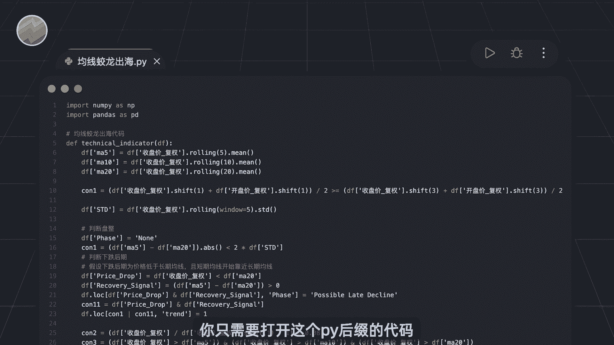

点击运行即可，程序运行结果如图所示，2007年至今啊，蛟龙出海形态总共出现过4万多次，在出现之后的短期内，未来股价上涨的概率都是在50%以上，平均收益率也很不错，有百分之一点。

但中长期看收益率会下降减缩，所以这是一个短线的指标，所以总体来看，这个均线形态更适合用于短期的交易，中长期持有，除此以外呢，还有上山爬坡型，也是我们测试后认为值得聊一聊的均线形态。

上山爬坡型一般会出现在涨势当中，5日十日20均线会沿着一定的坡度向上移动，坡度越小，上升时间越长呢，未来的上涨力度也就越强，比如这个图中的股票，在这段时间内，它的三根均线就像登山一样在不断的爬坡。

而且这座山呢也不是很陡峭，所以当这个形态确认之后，股价也在不断的温和上涨，我们也同样写好了上山爬坡形态的代码。

运行一下，看看结果如何，从07年至今呢，上山爬坡形态总共出现了61万次，这个形态出现之后啊，短期内，未来股价上涨的概率并没有超过50%，平均收益率虽然少，但是呢又稳步上升，出现20天之后啊。

平均收益率更是达到了2。58，相对于这样一个简单的均线指标来说，已经是很惊人的收益了，并且他在历史上出现的次数还那么多，所以总的来说啊。

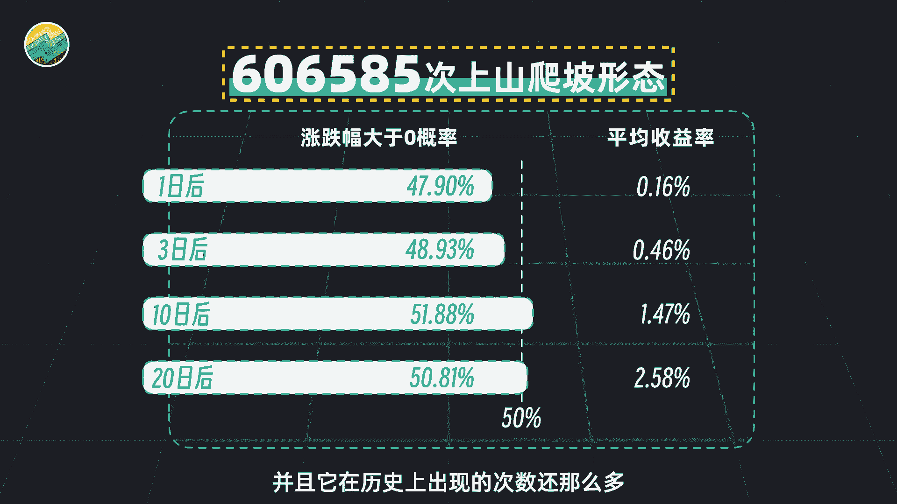

上山爬坡形态比较适合中长期的一个交易。

至此呢，我们从25种均线方法当中。

挑了最常见的金叉死叉进行测试，也介绍了两种，我们认为在不同情况下有效果的形态，当然其他的一些用法呢也有好的也有坏的，时间有限，我们就不一一介绍了。

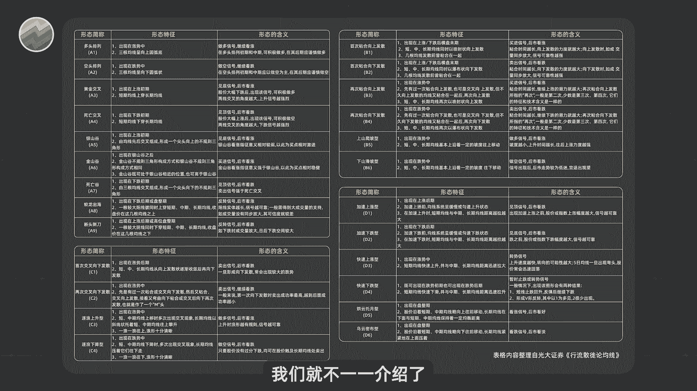

也可以问我要的数据和代码，打完一二亲自测试一番，虽然我们上面分享了几个不错的形态，看似跑跑代码就能得出结论，很简单的样子，但说实话背后花费的精力却一点都不少，比如说均线的联合趋势的确认。

各种模糊到无法量化的表达描述，这些都会让我们很头疼，最终研究出来确实花了很多的精力，并且呢25种形态当中，只挑了两个给大家分享介绍，性价比很低，所以非常需要大家的点赞支持，点赞之后呢。

这边可以再给大家透露一个小心得，虽然我们上面讲到了，均线在A股上面的部分用法是有效的，但就像我经常说的，与其花时间提高排气，我更愿意以花时间寻找对手更弱的牌局，这句话的意思是不要去高手扎堆的地方。

要更主动的去寻找一些竞争对手更弱的环境，其实不光是交易啊，在平时的工作生活当中，换一个对手个人的牌局会让你更加的轻松，那这句话放在均线上面也是一样的，比如说我们就用最简单的均线指标。

在某马赛克资产到四小时K线上面。

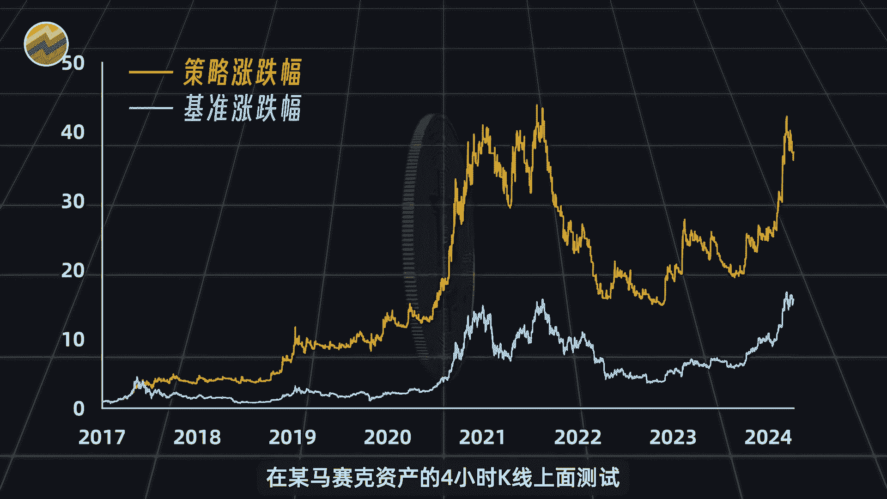

测试得到的数据，这个呢就是效果好，最后还是那句话，我们要科学的做投资，而不是仅仅主观的去拍脑袋，根据一些似是而非的经验去做决策，归根到底一句话，用数据说话好，那么本期视频就到此结束，最后感谢大家的点赞。

投币收藏和转发。

