# 吹爆！这可能是B站最完整的（Python＋机器学习＋量化交易）实战教程了，花3小时就能从入门到精通，看完不信你还学不到东西！ - P5：第05节-基本预测 - 凡人修AI - BV1Yx4y1E7LG

那接下来让我们介绍一下基本的预测的手法，那么我们有我们的算法呢，是来帮助我们预测金融时间序列的市场走向的，那么在Python中呢有一个已经开发好的报价，SK啊，Sk learn，那么呢这个包是统计学习。

机器学习的Python的库，那么它有很多我们常用的现成技术，比如说logistic啊，discriminate analysis啊，然后包包括这个SVM支持向量机，包括决策树。

包括random forest，包括各种boosting的树，那么像基本的神经元，它也有包括，但是如果像啊卷积神经系统，包括advanced的嗯，revolution neural network的话。

那么用KERAS会比较好一些，那么后面也会有深入的介绍，那么他的这个sk learn的包呢是使用，其实base是C加加写的，那么它与R呢跟C加加，包括java呢也有很好的嗯。

connection的interface，那我们先介绍基本的预测，预测方法的评估，然后介绍一下一些机器学习常用的一些函数，那么我们用标普500的价格走向，进行一个简单的小应用。

那么首先呢先介绍一个hit read，he read是最常见的一个错判率，包括正确率的一个啊统计量，那么顾名思义，它就是把我们的预测值跟真实值相等的，这些相加起来，并且呢对这个样本量做一个平均。

那么越接近于一，说明我们的啊training的效果呢就越好。

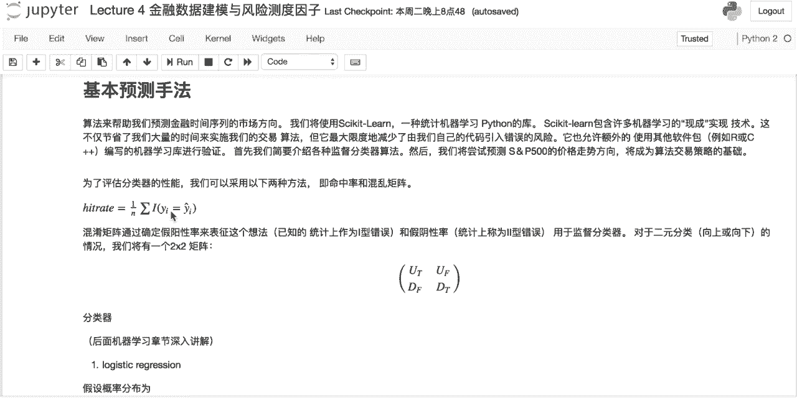

那么第二个呢是混沌矩阵，混沌矩阵是一个2×2的矩阵，那么它的对角圆UT跟DT分别代表了，就U假设是一，那么D是零的话，那也就是嗯真实情况是一，那么我们的预测也是一，也就是关于一的正确和这个真实情况是零。

我们预计也是零的一个正确，那么UF跟DF呢就是零一错错开了，也就是错判，那么两个错盘的量，那么我们当然希望这个主对角圆越大越好，那么嗯另外的这个UF跟DF的话。

当然是越接近于零是越好的，那么再提一句，这个UF呢也就是我们的称为的第一类错误，在我们做假设检验的时候，其实也有接触过这个名词，那么第一类错误是什么呢，就是说嗯真实情况呢是是真的。

就比如说这个关于这个信用卡，default的一个啊判别，那么他这个人本身呢其实不会default，但是我们把它预测为default了，那么这个称为第一类错误，那么第一类错误。

其实第一类错误我们在做假设检验的时候，是希望把第一类错误控制在某个值以下，Mini messa，但是呢如果它很大会有什么问题呢，其实也不是非常的重要，也就是说我们要尽量控制第一类错误嗯。

当把第一类错误控制到某个值以下就好了，因为这个UF跟DF两者之间是不可以兼得的，如果如果UF低了，那么DF一定会变高，那么相比较的话，UF不会那么的可怕，因为我们宁可错杀一个，也不能放过1万。

我们宁愿把这个客户从不default，predict到default，我们也不希望它本身是一个信用很差的，会default，但是我们预测嗯，他是一个信用很好的人来的损失来的高。

那么这个是这个混沌矩阵的定义。

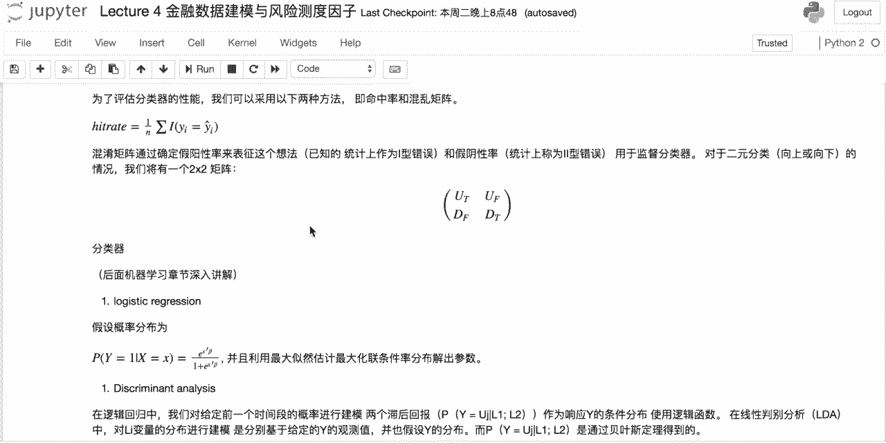

那么接下来我们简简单介绍一下，这几个分类器嗯，后相关的知识，我们理论知识，我们后面的机器学习的章节会有深入的了解。

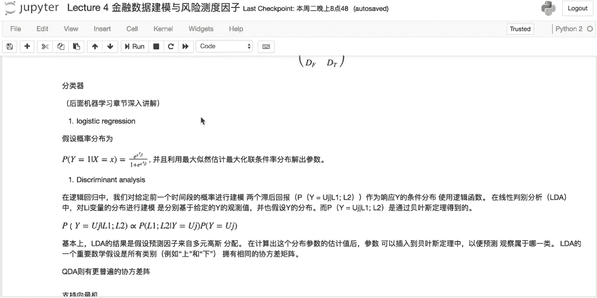

那么第一个是logistic回归，有建设违规的，最重要的中心思想是我们假设了这个后验分布，也就是当X取某个固定的值的时候，我这个Y这个分类分为一类，它满足一个这个指数的一个这个logistic函数。

那么这是我们的单个的条件概率分布，我们利用最大自然古迹这个最大化的联合条件，概率分布，也就是把所有的观测值的这个P乘连乘起来，然后取个log，并且把这个log函数最大化，来解除我们的分布参数。

这个是logistic regression。

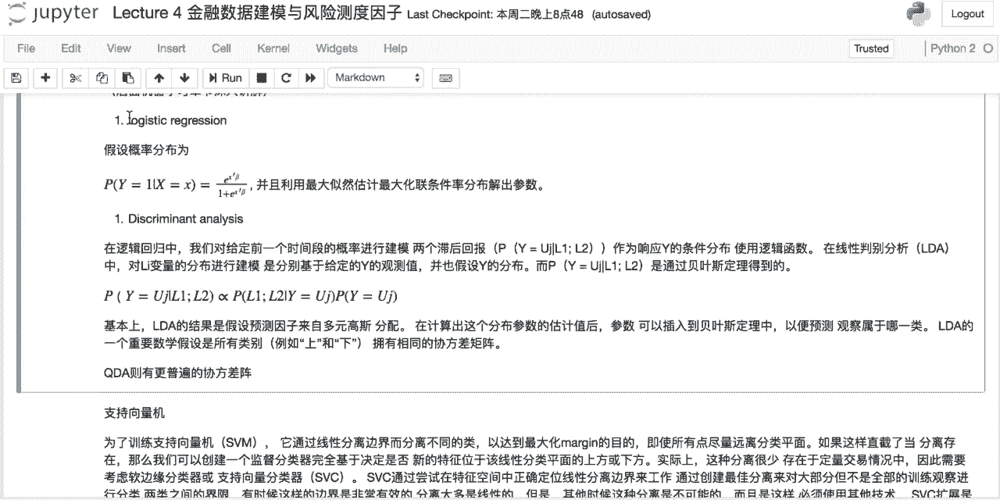

那么另呃discriminate analysis呢，跟上述不同的是上述的，这个是我们的一个模型假设，那么discriminate呢，是我们通过贝叶斯定理得到的，首先我们先假设啊。

这个分布呢是一个叫做嗯变量，就L1L2，其实就是上面这个X变量呢关于每一个类别，它都有一个特定的分布，那么还要乘以一个每一个类别的概率，那么这两个P呢都是我们事先对它的分布，预定好的。

我们基本上是预定前面的这个分布，为一个高多元的高斯分布，那么根据贝叶斯定理，我们是对后面的这个乘积，就是呃联合的一个叫join distribution。

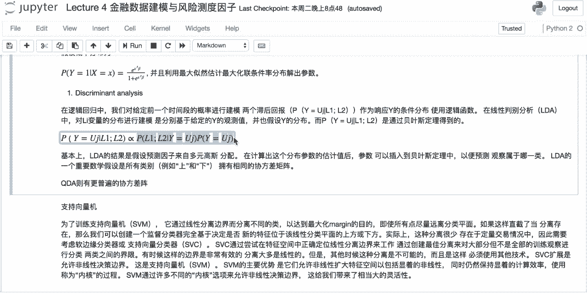

做一个MLE就是最大自然古迹，那么求嗯求出参数之后呢，当我们得到一个新的新的L1L2，把它plug in到后面这个式子中，嗯当这个P值达到最高的时候，也就是我们预测的这个Y，应该属于某哪一个类型。

那么LLDA的一个重要的数学假设呢，是嗯这个P的这个分布，我们提过是一个多元高斯，那么呢它每对于每一个UG，就是不同的Y的类别，它有相同的斜方差正，那么在做就在做中间这个理论推导的时候，由于这个假设。

那么嗯X方的这个二次项是会被消除的，那么如果没有此假设，也就是拥有更普遍的协方差阵的话，那么呢X2次项就不会被消除，所以是QDA也就是quadratic就是二次的意思，那么关于这个差别分析。

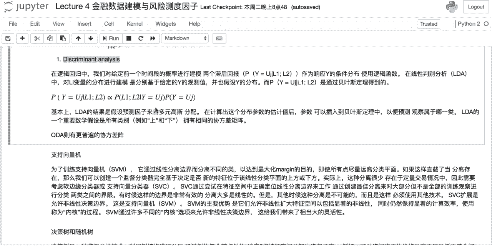

我们在后面也会深入的介绍，那么下一类是支持向量机，支持向量机，首先首先的问题是基于一个线性二分类，就是我们对于两个类别的点，我们想要找到一个最佳的分类的boundary，那么这个帮助有什么特点呢。

就是最大化margin，就是使所有的点尽量的远离这个分类平面，当然这种理想化是几乎是不存在的，那么有时候呢是本身就是无法可分的，那么我们采取支持向量机，采取的一个方法叫做软边缘分类器。

就是soft margin，那他的idea是对于我们的这一条decision boundary，两边各取两个等距平行的一个EPSENT管，那么在这个EPSENT管中，我们有很多我们的错分的。

包括是离边缘非常近的这些点，那么这些点就构成了一个知识向量，由这些点提供的information，我们来找到这条decision boundary，这是一个主要的最简单的这样的一个idea。

那么这个做完二分类之后呢，嗯还有一些问题是多分类，还有线性不可分问题，那么就需要扩展到SVM的呃，Kernel function，那么内核呢有这个多项式内核，那么就是比如多项式是N。

那么就可以扩展到N维，那么还有高斯内核，其实高斯是一个无穷维的，那么还有SIGMOID就是tan函数的和，那么呢嗯通过这个不同内核的选取，我们可以达到很多非线性的decision boundary。

那么就对我们的模型引入更大的灵活性，那么还有一块很大的类呢是决策树和随机数，决策树呢是一种树形分类，是一个最为直观并且最好做嗯，实际解释的一种分类器，他的想法呢是一开始大家都属于同一个类别。

比如呃然后每一层每一层数呢找到一个feature，找到一个特性，根据这个特性把它们的点分为两类，一直这样二分类，二分类拆分下去，直到我们满足了某个条件，或者是它已经不可分为止，那么这是决策树的一个想法。

那么每一层的feature如何找呢，是通过这个最大熵值理论，那嗯决策树的不足之处呢，是每一层找这个feature的时候都过于的贪婪，过于的greedy了，那么当这些树的feature。

本身的相关性非常高的时候，其实很难做决断，哪一层用哪一个feature来分类是比较好的，那么就引入了一种begging的想法，就是呢我构造非常非常多的，基于同一组data的这个分类数。

那么每一层呢是从我的这个feature中，随机的选出一个啊，sub class就是一个一个它的小子集，那么再从小子集中利用这个最大熵值理论，选出我的feature，所以每次的这个不同的数啊。

它每一层的feature最优feature都不一样，那么把这么多的数呢都aggregate起来，取一个平均值啊，就是我这个分类器的结果。

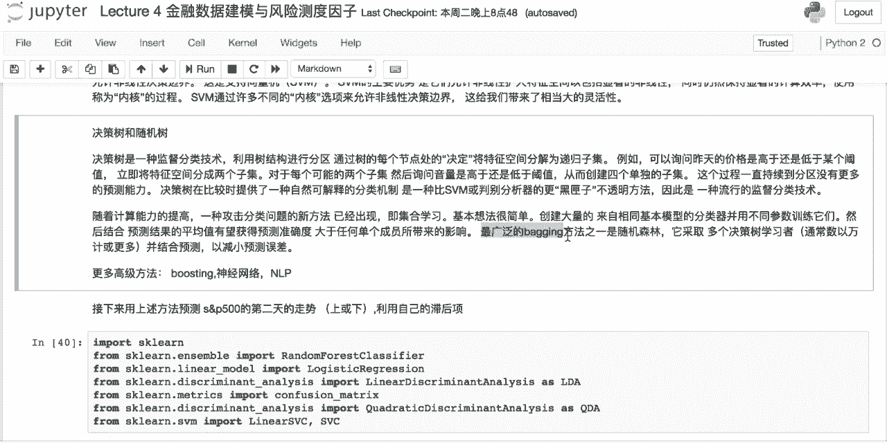

那么它主要呢，其实是应用于一些噪音比较多的data，并且它的feature之间的相关性很高，那么通过这个呢可以拆分，就是feature之间的相关性。

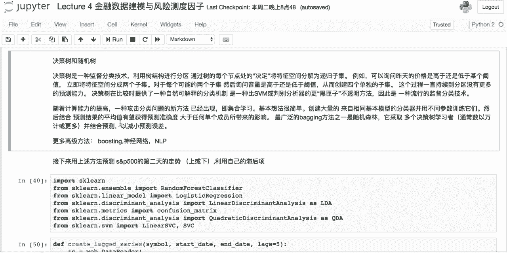

来导致这个减少误差的这样的一个结果，那还有更多的高级的方法，比如说像boosting呃，也是基于术的一种，还有这个神经网络系统，还有NOP，也就是自然语言学习，就一个非常最近很火热的一个话题。

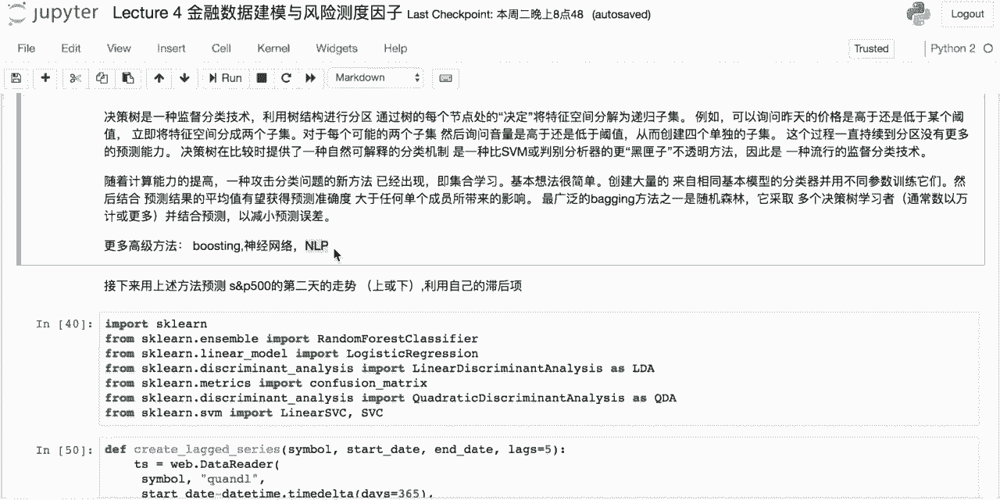

那么我们的课程是不会涉及到NLP的，那NLP的一个很有意思的例子呢，其实是这样的，就是我们大概在几年前也做过一个应用，简单的介绍一下，就是比如说这个大家知道这个马伊俐跟文章的。

这个这个当时的这个出轨事件呃，发生之后呢，过了几天之后，这个伊利牛奶的股票就暴涨了呃，虽然听起来非常的奇怪，但是这个是有人做过一个learning，他们存在一个呃潜在的相关性。

也就是马伊俐与伊利牛奶之间的关系，那么怎么learning呢，嗯国外呢就是twitter或者是FACEBOOK，那么国内呢就是微博了，或者是一些微信的公众号，那么首先我们先learning这个文章。

出轨马伊俐出轨这样的一个新闻呃，和大家的朋友圈，那么通过大家发的每一条状态呢，我们来读出这条状态，关于这个新闻的评价，到底是negative还是positive的，那么我们learning到之后呢。

把它转化为一种类型的feature，那么它的回归呢就是这个伊利股票的价格了，到底是up或者是down，那么通过通过这个互联网，大家发的这个朋友圈，包括大家发的所有的这个在各大媒体上的comment。

进行这种心情之间的learning，然后我们来判断大家对于马伊俐其实是同情的，那么同情之后呢，会导致伊利股票的暴涨，就是说这个NLP啊本身可能是很无厘头的。

你很难distinguish这两个东西之间居然有关系，但是它是一个O就是total里，由数据说话的一种东西，可能它存在着the chin或者是一些伪相关。

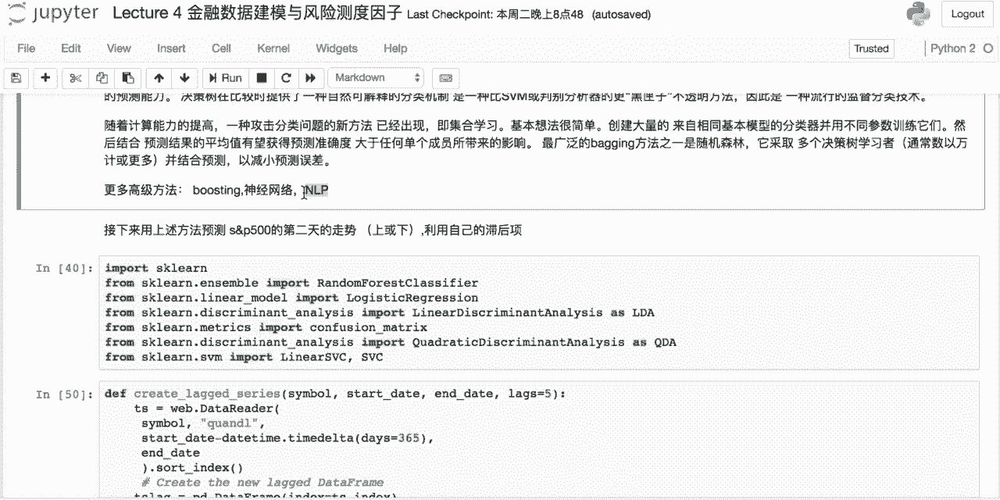

但是somehow他就能很好的predict嗯。

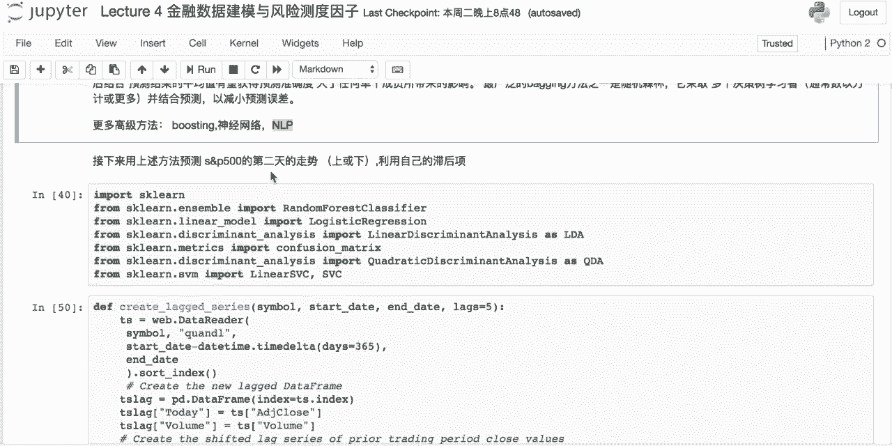

那么我们回归正题，接下来我们来解释一下，上述我们提到的这些基本的machine learning的方法，对于s m p five hundred。

就是第二天tomorrow的走势大概是up and down的预测。

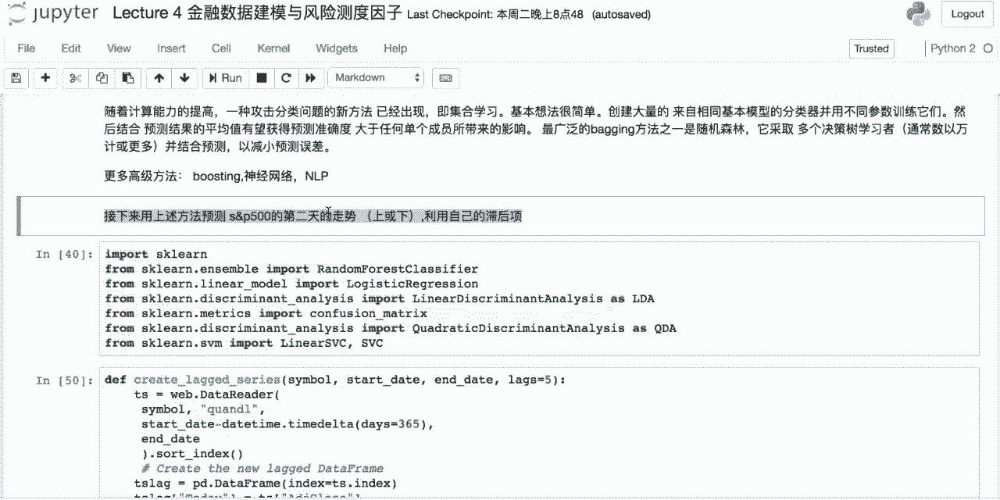

那么我们的ACTIVARIABLE呢，是利用它标普500本身自己的滞后项，那我们先define一个函数是create lack series。

那么就是我们从这个宽度下获取SMP的数据。

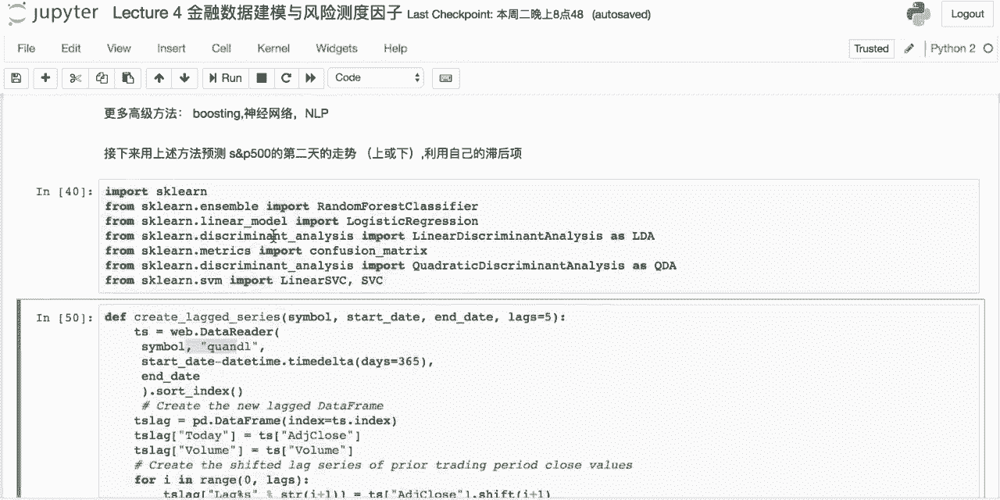

并且呢，嗯把他的字字后项排成这个column的形式。

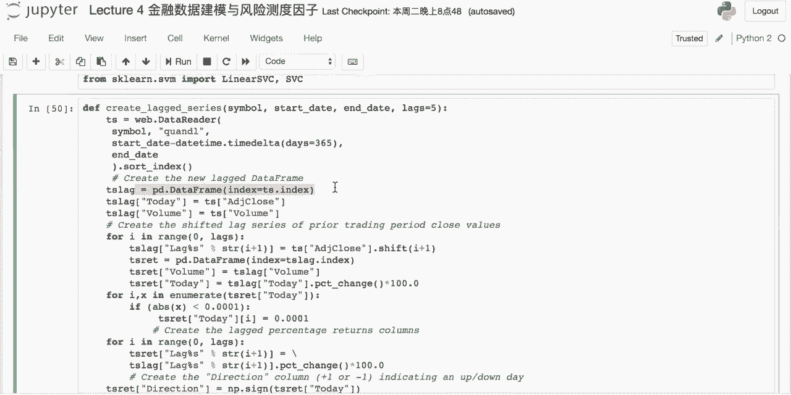

嗯主要是完成一个这样的任务。

那么接下来呢我们要调用我们的。

我们我们上面提到的这个random forest啊，logistic regression啊，然后LDAQDA包括我们的这个SVM。

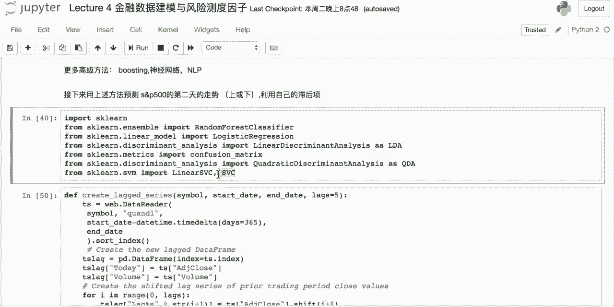

SIM可以用线性的，也可以用上面提到的非线性。

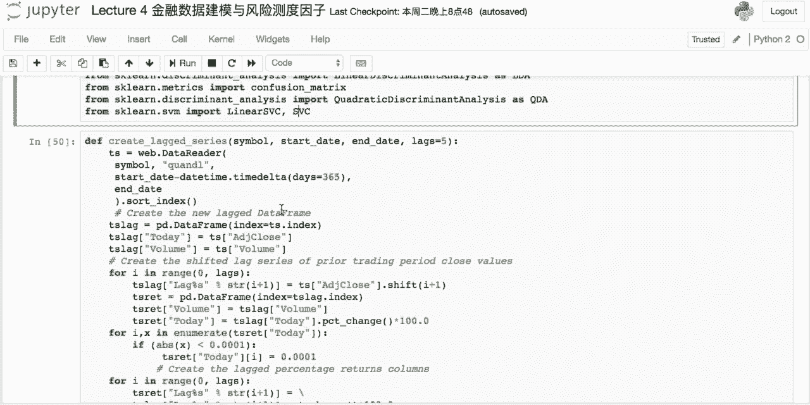

比如说高斯核，比如说啊ten整合，那么我们要调用的function呢。

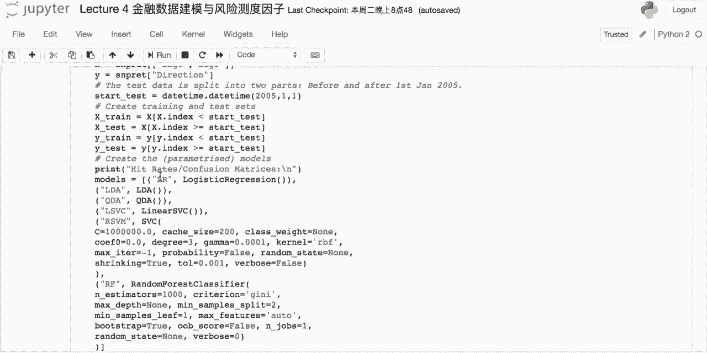

都放在放在这个models里面。

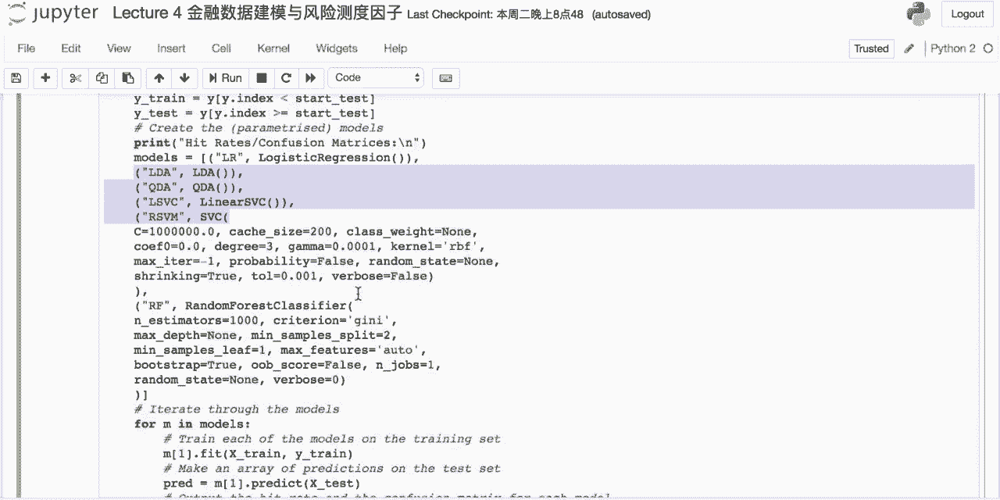

那么关于这个SBC也就是非线性的，我们需要做一些参数的设置。

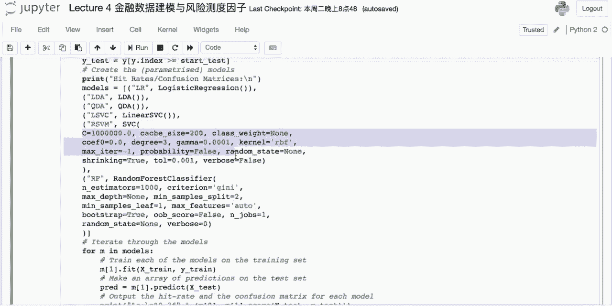

包括random forest，那么接下来把这个hit rate跟那个confusion matric，就是混沌矩阵打印出来，那我们可以看到不同的模型的performance的好坏。

那么在这里呢表现最好的是这个二次的，Discriminate analysis。

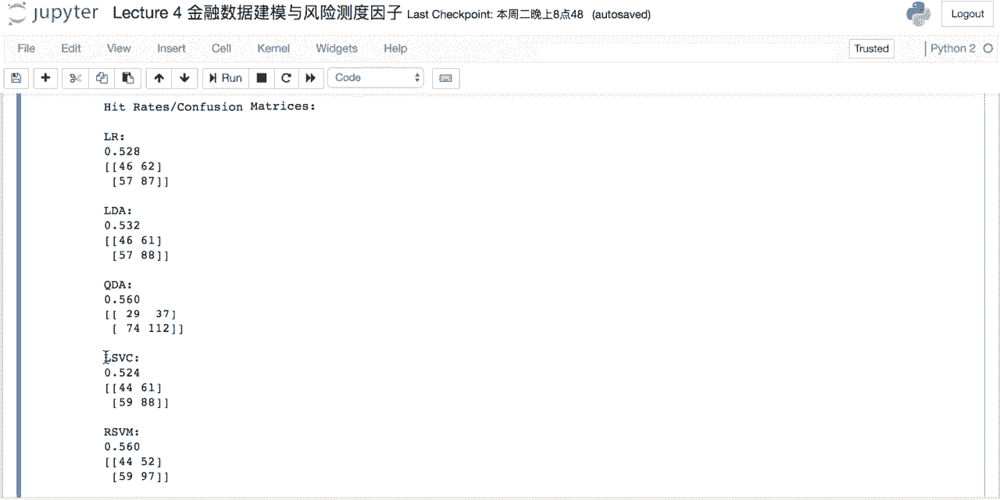

和这个呃带着高斯核的这个支持向量机。

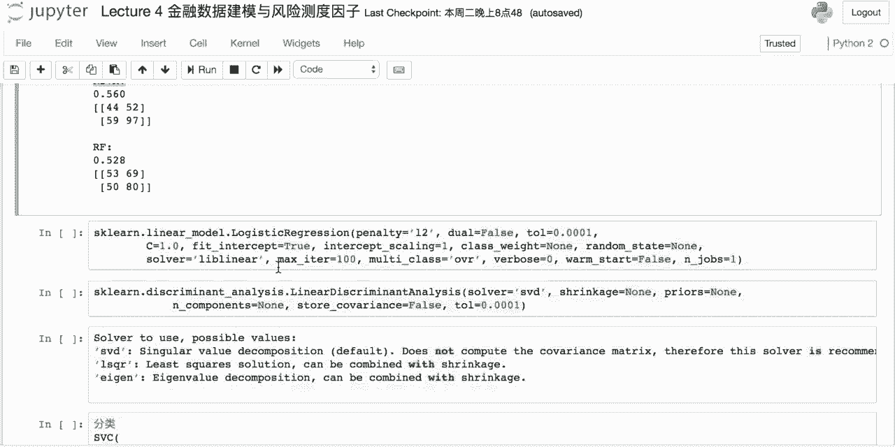

那么下面我们先简单的看一下这个每一个呃，函数是怎么调用的，包括一些参数怎么设置，像logistic regression里面的penalty呢，嗯如果是主要一般是是the词penalty。

如果没有一些特殊的原因的话，deal的话是做最优化的时候，是否要用这个对偶函数，那么TORREN呢就是做最优化，我们我们的B就是，当这个误差小于0。001的时候，我们就结束我们的迭代。

那么see呢是是否要用shrinkage，像logistic regression也可以使用像了，so跟vage regression，就是对于每一个参变量。

我们我们希望它的coefficient不要太大，因为太大，它的variance会比较高，那么把它们的和加起来，前面带一个乘法项，那么我我认为乘法项是1。0，或者也可以写二，或者也可以写0。01。

那是否要fit这个洁具项，包括SKILLING啊，Weight，后面这些就后面这些设置就不是太常用了。

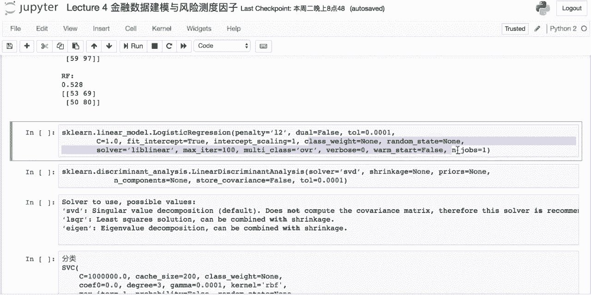

然后discriminate analysis的话，linear跟呃跟那个嗯CONTROLT是一样的。

就是关于这个sofa的设置。

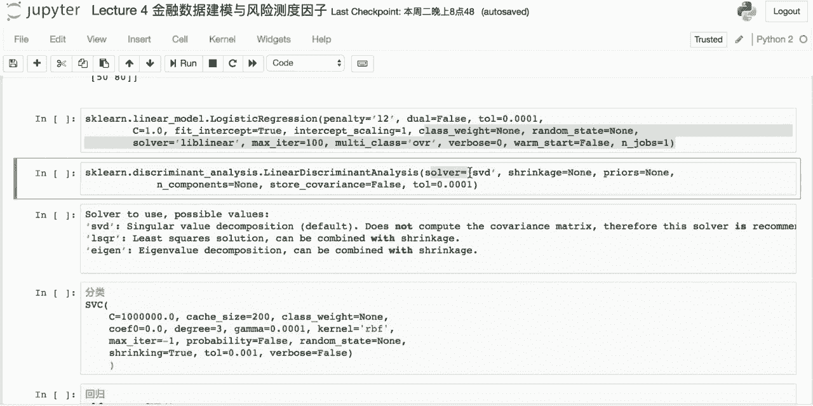

那SYKAGE呢跟上面的这个C其实是一样的，就是是否要做一个就是对于参数的这个。

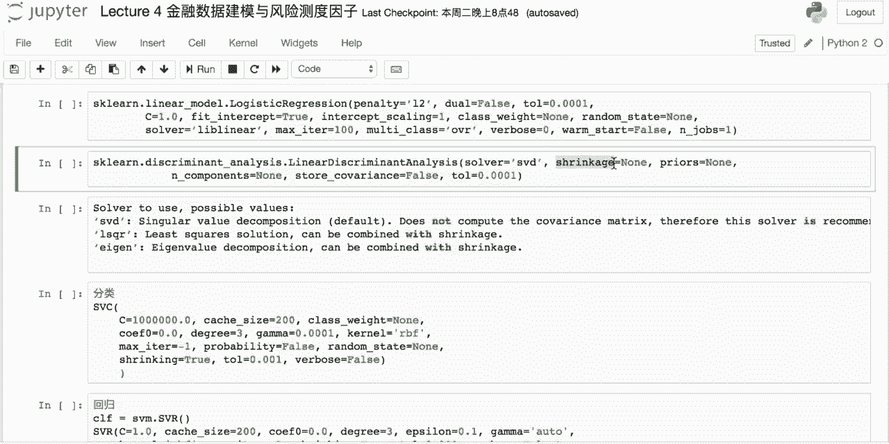

shrinkage to zero的这样的一个设置，那一般你选NN就好了，那sofa呢有下面这几个，还有一个是egon value的分解，还有一个是用那个LISQUARE。

那么default的话一般就是用single value求解。

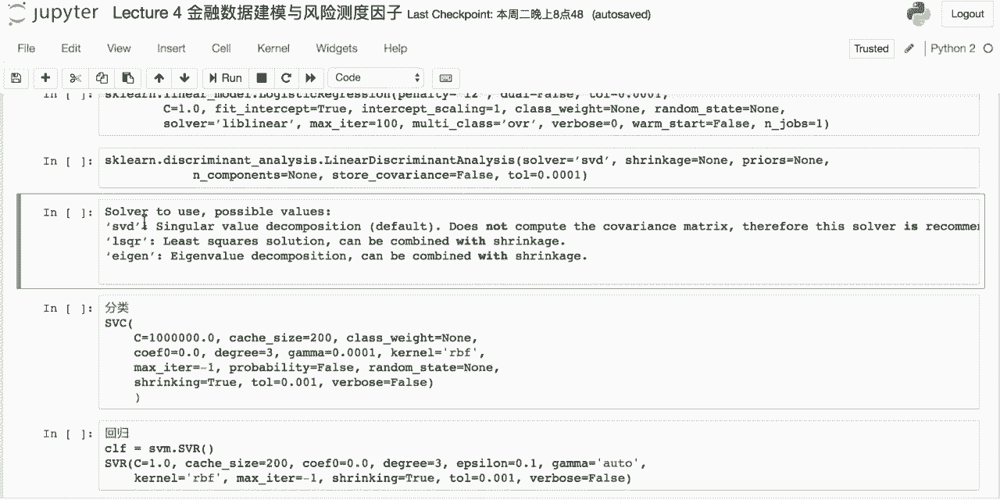

那关于分类的话，SVC是嗯，这是向量机关于分类的函数，那SBR呢是支持向量机关于回归的一个函数，那么支持向量机的C的penalty呢，就是我的这个em sno管，就我上面说过的错分类。

错分类到底能够容忍多少错分类，那么C越高呢，就是能够容忍的就越多，嗯然后还有是这个kernel，就是像这个线性的就不用选kernel了，那如果不是线性的话，kernel的RFB也就是高斯。

那么还有sigma，也就是T，那么伽马呢是就是这个呃正态分布，不是有个西格玛方嘛，除以西格玛方，那么这个伽马呢就是西格玛方的导数，那么越大的话呢，这个高斯和本身就在高维中它就越胖。

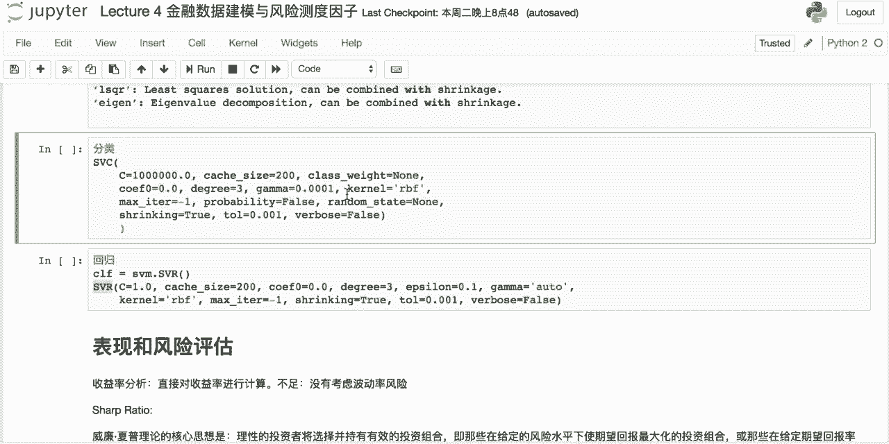

可以这么理解。

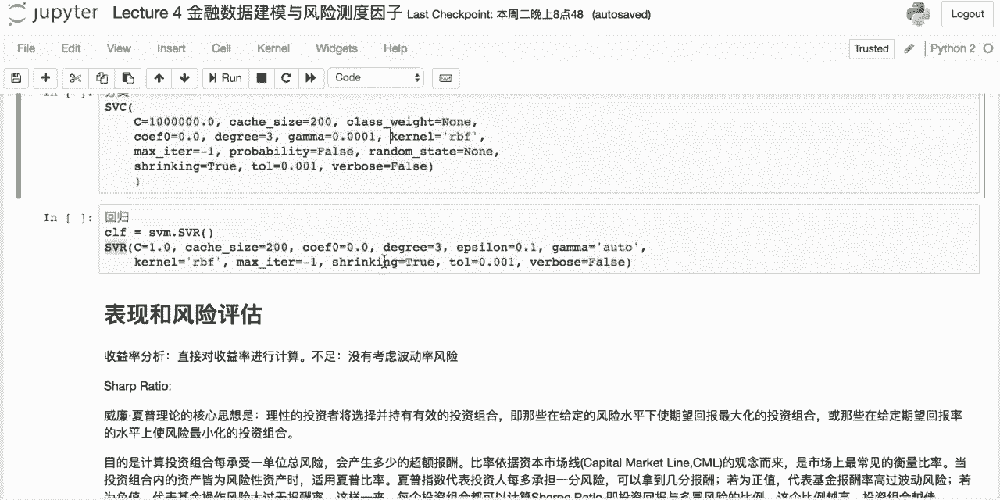

那这个就是主要的设置的一些参数。

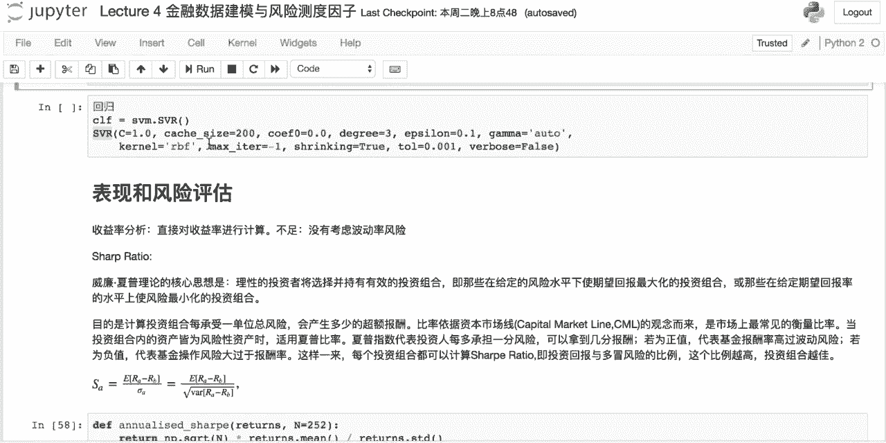