# 这可能是B站目前唯一能将量化交易讲清楚的教程了，不愧是计算机大佬！一天全面了解机器学习Python金融分析与量化交易实战，草覆虫都看懂了！ - P7：07模型评估与风险控制 - AI知识库 - BV1x1421871N

今天的大今天的课程咱们主要呃讲三件事啊讲三件事。第一件事就是关于嗯我们之前的这几次作业的一个点评啊，这是第一件事。第二件事呢是啊如果你的模型啊，怎么做？你说方老师这个实在是积极学习不专业呀。

弄的这个模型很一般，怎么样的能够让你呃你有10个很烂的模型，怎么样的把这10个很烂的。呃，化腐朽为神奇啊，让这10个很烂的嗯三个臭皮匠啊，顶个诸葛亮啊，把它弄上去。这第二件事情。第三件事情呢告诉大家啊。

当你会建模之后啊，量化交易往哪走和我们未来这三次课，我们要学的东西是什么？最后是啊如果你还是如果卡在了数据处理这块，但是又很想做建模怎么办？就是说相当于给大家一点这个呃补救的这个。啊。

措施啊大概呃争取啊两个小时把这些事情都搞定。OK呃，那么我们现在正式开始啊正式开始是这样。嗯，然后这个这个视频大家都看了吧，就是嗯我们上次讲这个遗传算法。

讲这个讲这个遗传算法的时候嗯。啊，我给大家展示的这么一个呃，通过一人算法有两个呃。比较有智能的这个人啊呃机器啊，他们来学习怎么样的抢食啊，这个相信大家都看了啊，那么我觉得大家的这个作业呢。

读的时候我就感觉啊看到大家这么努力的在做啊，但是感觉就是觉得大家在。很努力的在想获得一个食物，但是姿势呢不是很好啊，这个是主要的一个想法。这这这。又话嗯。觉得有点像这个图哈。

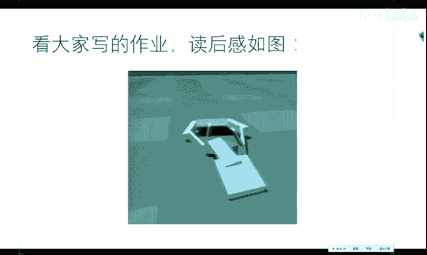

啊，那么但是呢也也有好的也有非常好的。那么今天呢咱们说一下基于这个嗯。他那名字我就先不说了，基于这个比较比较啊做的很好的一个同学，我给大家以他的这个作业的方式，我跟大家说一下啊。

我所期待的这个作业和怎么样的基于啊这个作业的结果，然后接着往下做。

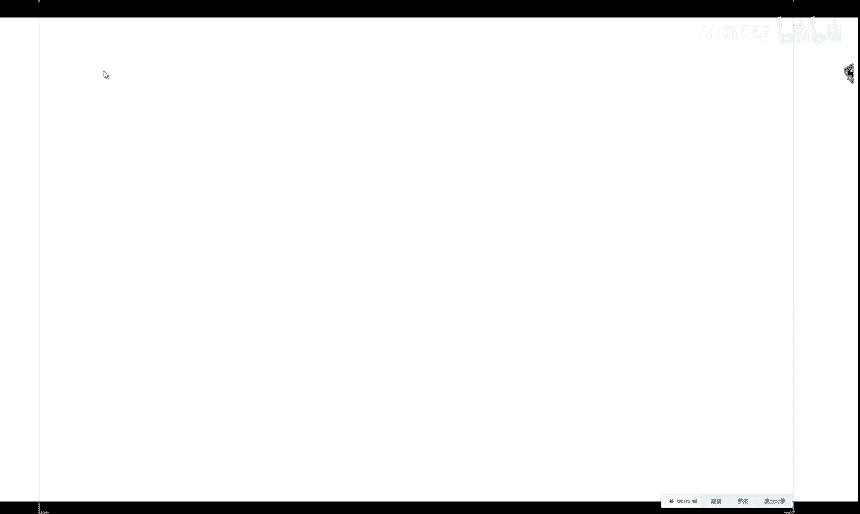

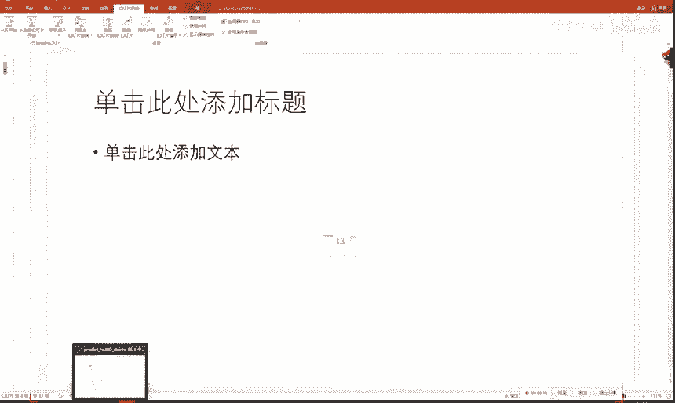

比如说这个沪深300这个咱们这个有一个作业是关于这个沪深300股指的一个预测和分类问题啊，那么我希望大家给我教的时候呢，就交这个因为你那个ipon notebook。

你能够储存为啊你能够储存为这个啊HTML格式，就说其实你不需要把这个啊其实你是不需要把你具体函数的实现给我的。比如说具体算某个indicator，这个这个是你放到你自己的这个库里头的。

或者说你任何的你这个项目里头的，你需要给我看呢是你做完这个模型建模的这个结果。然后根据你建模的结果我才能提出啊一些有建设性的一些意见。而不是说比如说哎这呃冯老师这个程序啊bug。怎么办啊？这种问题呢。

我建议大家你在tack overflow啊或者任何的一些呃呃python的些文档中，这个是你们自己可以解决的。而我能够我能够帮助你的呢，是你做完这个东西之后，你把结果返回给我。

然后我通过看你建模的这个逻辑。我来给你提出啊力所能及范围内的，我来给你提出我的一些想法和建议，这个是呃你很难通过呃网络或者论坛的形式得到的。那么所以说我希望大家呢，就是说到时候教的时候呢，就交这个。

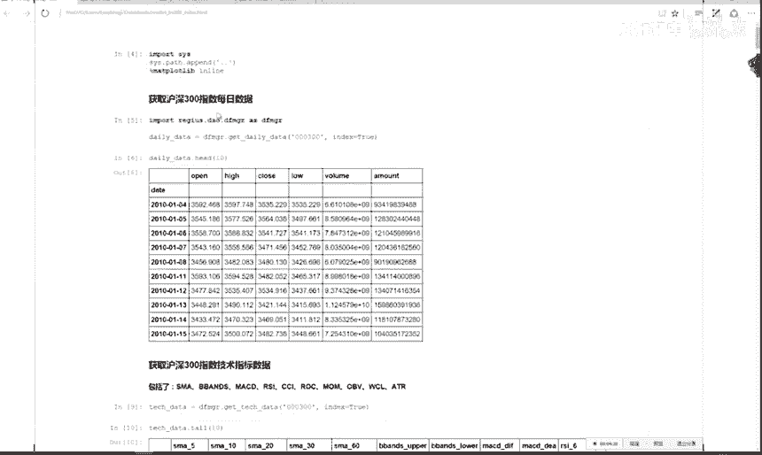

那教一个呃就是运行，就是你通过呃通过这个ipad book运运行之后的这么一个脚本就行。然后呢，比如说呃每一个函数你inport的你的这些各种各样的你自己的一些函数。

比如这个同学他inport的就是他自己的这这个函数的具体的实现，你不需要不需要交给我，除非你觉得哎这块啊觉得很比较啊比较得意或者怎么样，或者说是希望提出一些建议，这个时候你可以给我。

因为这样的话我能够以最大的效率来快速的给你个人来提出一些建议。那么比如说这个同学他做的就蛮好，他就是呃给的我就是这么一个啊点HTML的这么一个文件。然后呢啊你能够写一些这个title。

就是把它做成这个markdown的这个这个格式就行。大家自己查一下就行。那么拿到任何一个数据呢，我们要干的事情，第一件事情，就是说先看看这。

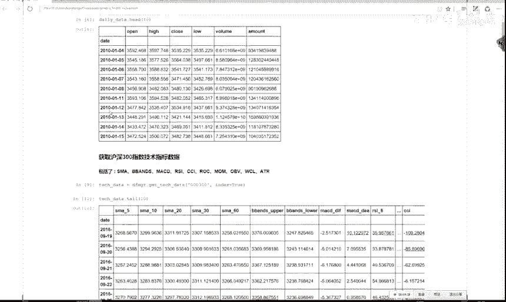

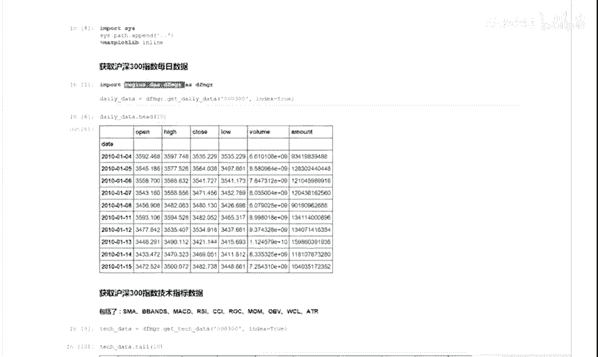

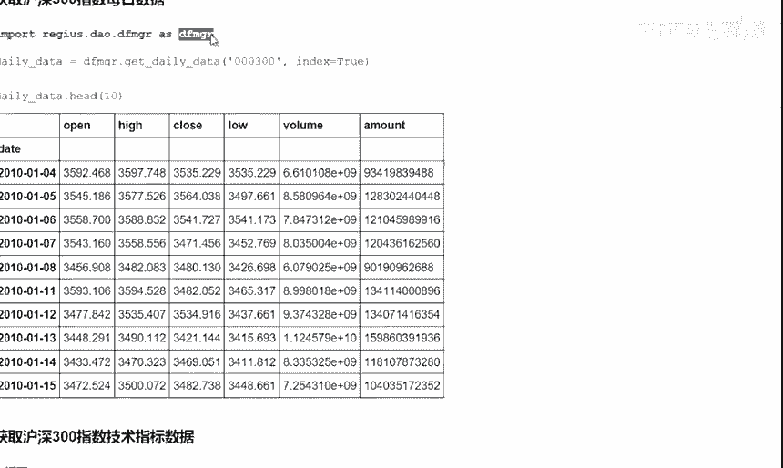

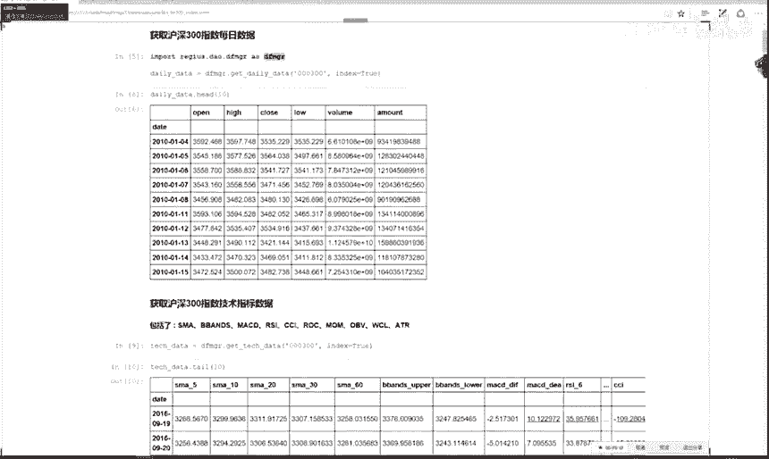

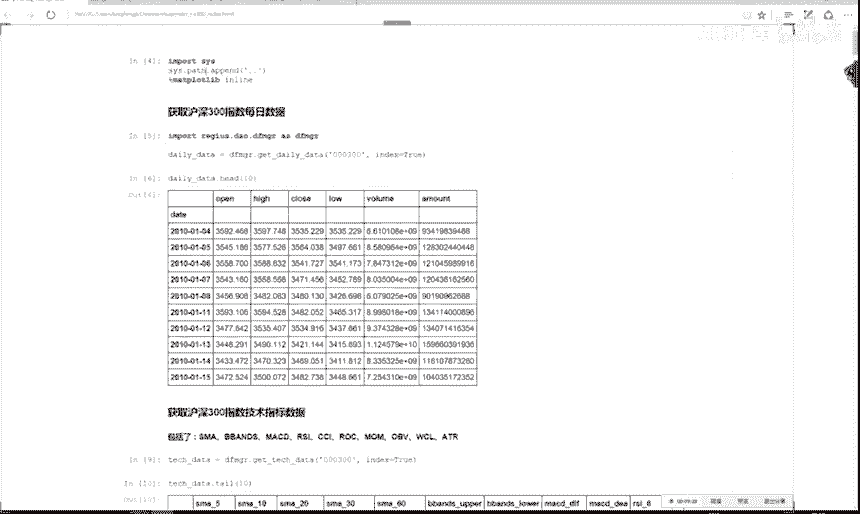

数据整的对不对？就是说我们先先要看一下这个数据是不是有问题啊，那么就是一些数据的在干任何事之前，先先先先先看看头啊，对吧？就是说然后再再做一点简单的可视化的工作。

让我们做模型的就是为下一步的做模型啊相当于先做一个热身的工作啊，这个同学他也做到了啊，那就是说他先拿到了他的数据，然后差不多呃把这头时行啊画一下。

就是通过这个呃padas的这个data frame的这个head这个这个函数，然后呢你就呃你就可以把你的计算的这些指标的这些函数全部给他给他进进行一个转化，然后画出来，画出来之后呢啊再建立这个。

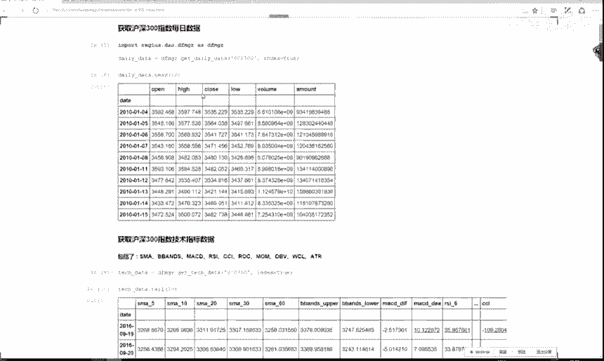

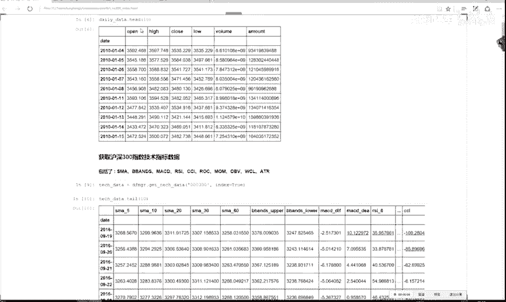

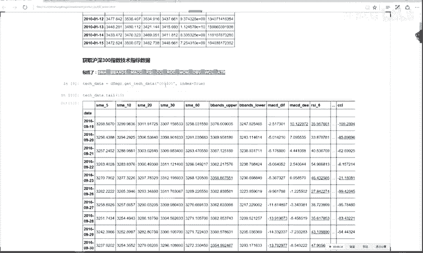

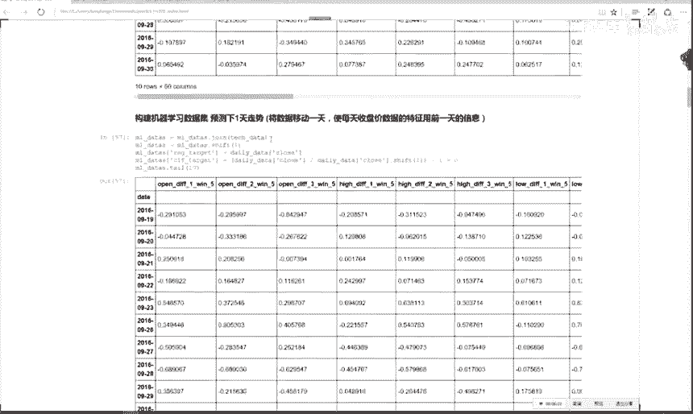

啊，训练集跟这个啊预测集同时定义好你的X跟Y，然后呢你就可以啊再做一些这个数据的一些啊清洗工作。比如说把空值啊什么的给它干掉。然后呢你就可以做我给你留的作业了。然后把这些作作业呢就以这种的方式啊。

进行一个呈现。比如说啊选选的前20个这个特征比较重要的特征，然后把它的这个importance啊画出来，然后再再做这个啊啊这个这个分类和回归的这个任务。比如说这个这个图就是啊沪深300股指的预测图啊。

蓝色是真实值，然后绿色是预测值。所以说啊那么其实啊这个也是对的。就是说如果你呃就这么硬做这个分类跟回归任务的话啊，回归任务的效果会好一点，分类的任务，你看也基本上都是在。

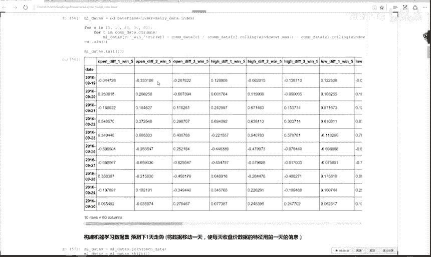

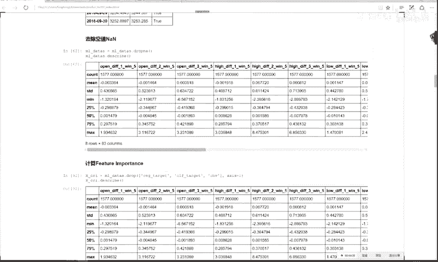

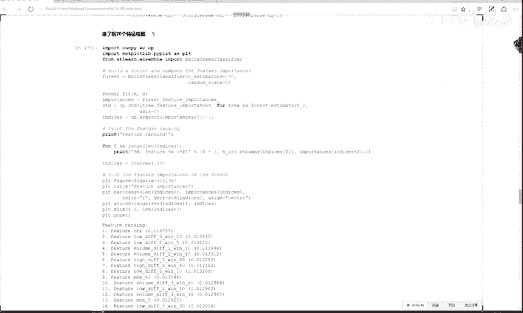

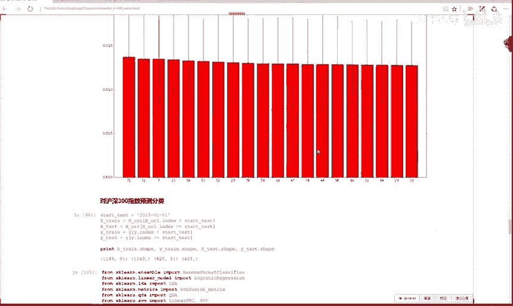

50%出头0。512。但是呢就是说啊做完这个比。

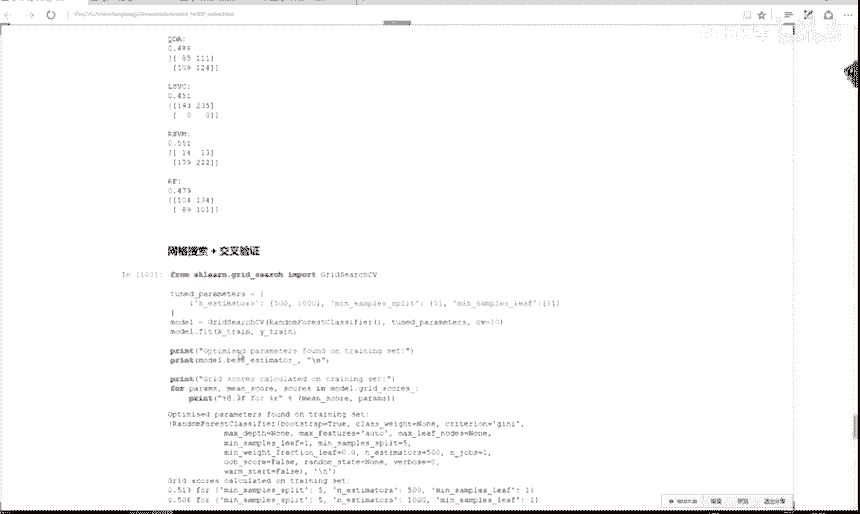

还是举例子吧，比如这个同学呢，他就是。

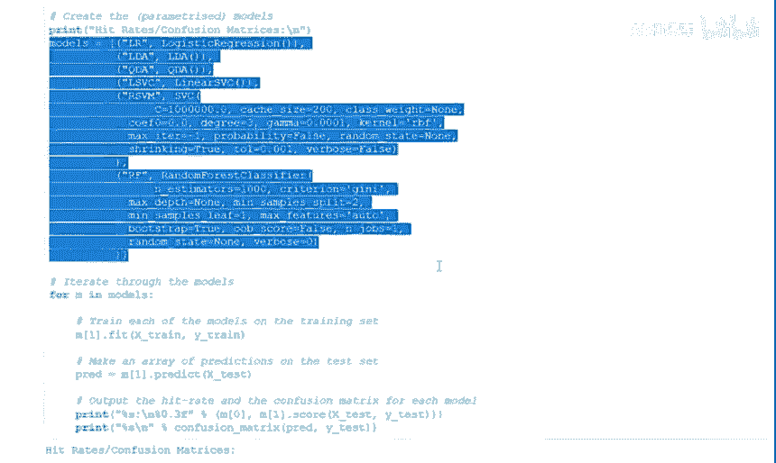

抱歉，这个东西他就是用了这么几个模型。一个是有线性回归，有LDAQDA啊，还有这个呃SVM，还有这个随机森林。然后呢，他就把这几个模型的这个结果。

就这个confusion matrix啊进行了一个一个汇报。那么其实真正好玩的和真正你你真正要做这个在平时做量化的过程中大概你百之啊80%的时间。当你把前面这些工作都做好了之后呢，你80%的时间。

是要在这个上面花时间的，而不是简单的写这么一个fo，然后print出来，然后说啊好或者不好啊，就完了。那么其实真正好玩的地方呢，也都是在这儿啊，举举个简单的例子吧。

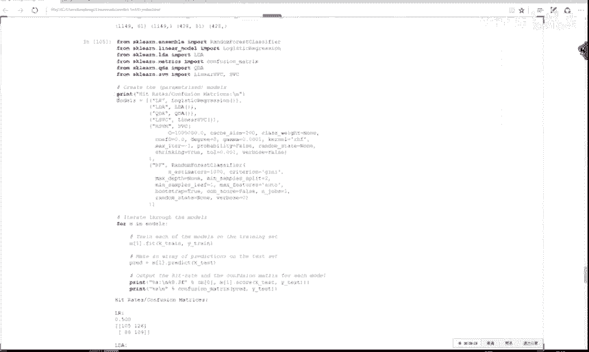

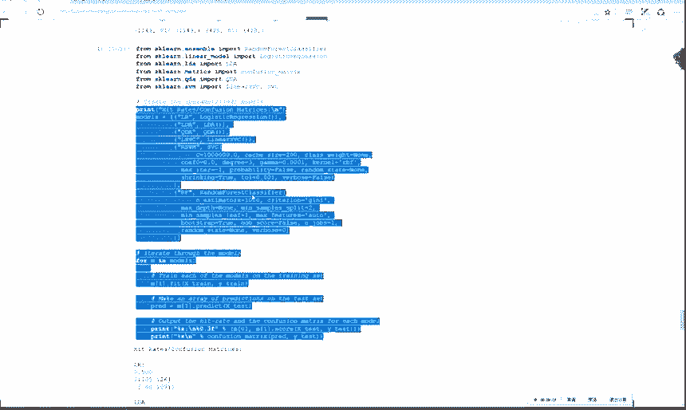

啊，比如说这个分类任务哈，首先呃嗯。

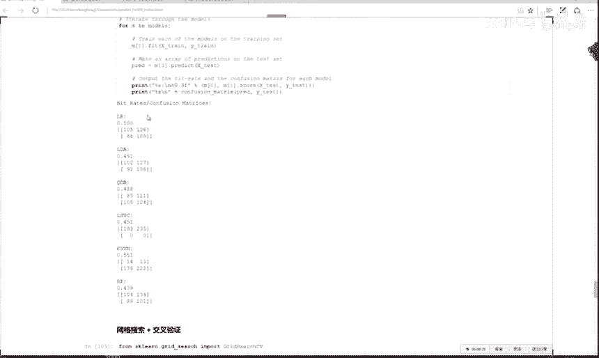

再看他这个以以我我的这个数据为例吧。因为我我这个数据已经我都帮你提取好了。嗯，对，以这个为例呃会说的更更有意义一些。就是呃咱们的最后最后一个作业，我给你的那个啊这个我给你的这个数据集。

就是我帮你把数据啊脏活类活我都给你干好了。然后一共是332维的啊这么一个向量，他要对应一个啊真实的这个 y值进行一个啊回归的这么一个任务。那么呃刚开始你先把数据读进来。然后呢啊这一步很重要。

就是说啊这个这个同学他也做了，就是说你要做任何的回归跟分类任务，你最好先把这个呃这些你要回归的这些呃结果，你进行一个pl，就是说比如说我们这里是一个。

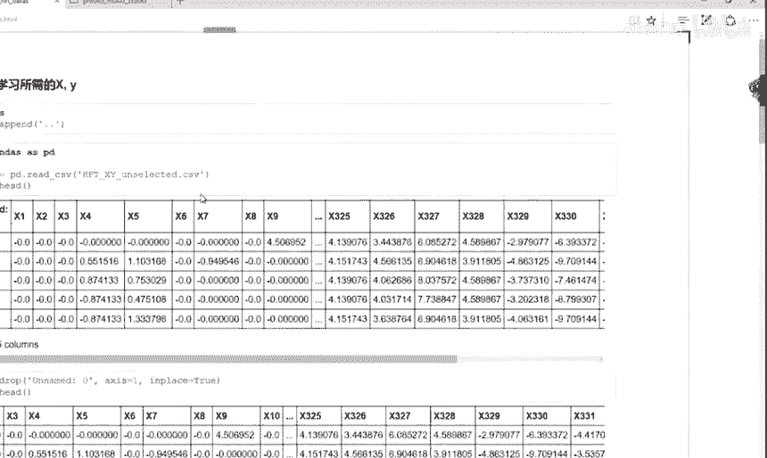

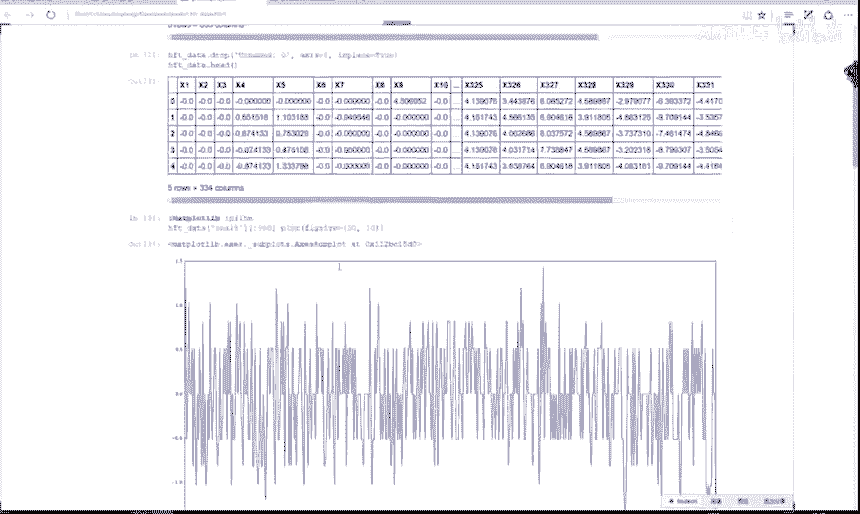

呃，回归任务，那我们就应该把这个Y值你画出来看一下。那么你话说看一下，你立马你就能得到啊。其实这个Y值它每一次的这个跳动是0。5，这是第一。第二的话呢，他们的每一次的这个这个波动不会超过一啊。

这是第二啊，然后呢最重要的一个是啊如果是分类任务的话，一定要把每一类的这个histtogram画出来。就是说你一定要把比如说比如说这个分三类的任务，涨跌或者不涨不跌。

那么你你要把这三类的这个嗯就是它的这个这个count要画出来。这样的话呢，比如说大部分情况下它都它都是不涨或者不跌的。那么这个就会你你就会立马意识到ok我现在的这个分类任务是一个类别不平衡的一个事情。

大家明白吗？就是说嗯而类别不平衡的事情呢，是你需要用一些类别不平衡的一些手段来做额外的处理的。举个例子，比如说我们在训练集中99%的啊这个样本它都是一类，另外1%的是另外一类。

那么我们如果建立了一个预测的模型，我们全部预测为就是我们闭着眼睛全部预测为啊一类的话，那么你也有99%的正确率。但是这是不是一件好事呢？这明显不是一件好事。是因为你把那些1%的，你全都不管了。

你就说啊OK那既然大家都是啊第一类，那我就全预测为第一类就完了。那么你你你你就把最值钱的那1%的啊所要预测的那一类呢，你就丢掉了。所以说当如果你拿到的这个数据集，它是一个非常类别不平衡的一个问题的话。

你一定要用类别不平衡的手段来做一些处理。😊，啊，这个是你就是说嗯大家一定要避免的是啊，我闭着眼睛啊，拿1个这个SVM，然后我这么废ate一下啊，好啊，很该很开心，坏呢啊就不知道该怎么办了啊。

然后又说机极学习没用啊，那么这个是这个是有问题的啊，字己大一些是吧啊？

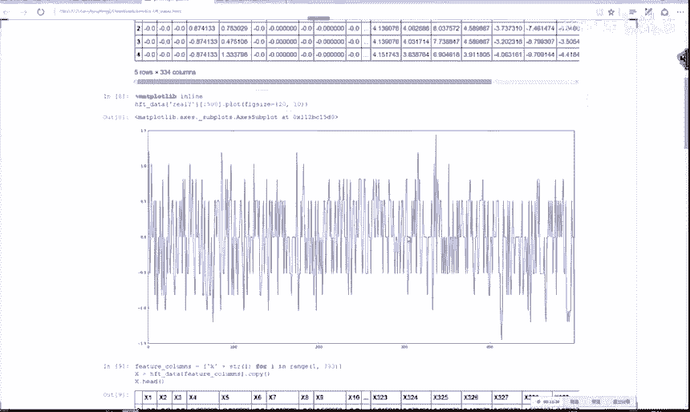

啊，其实不需要看字儿，就是说其实大家并不是太需要看到他在写什么啊嗯。

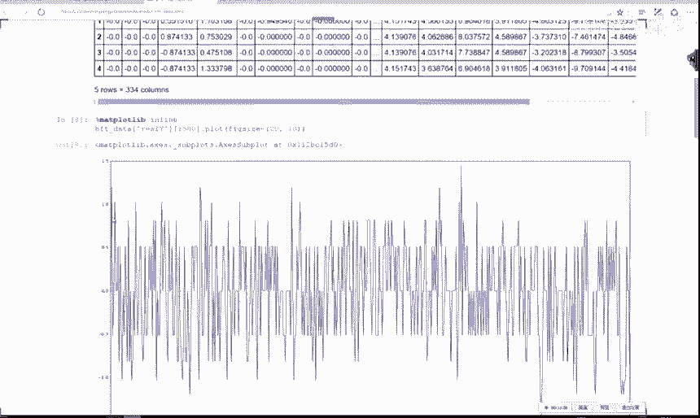

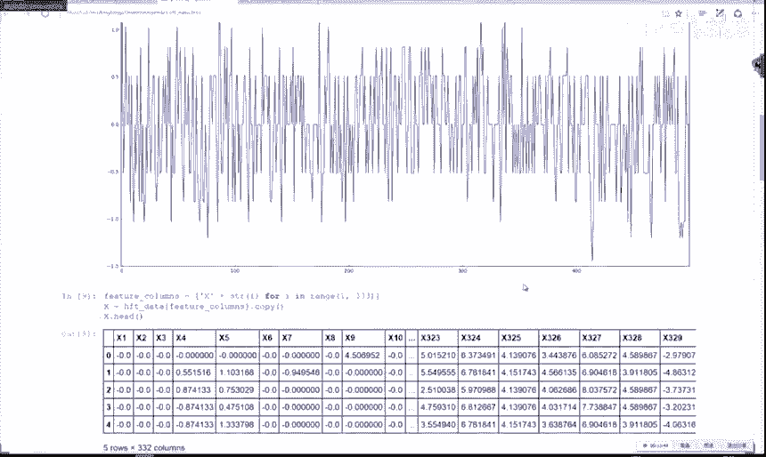

OK那么比如说这个同学在在我拿的这个我给大家这个数据集上，他就先做了这么一个呃可视化的这么一个工作。啊，画完之后呢，画完之后呢，他就开始啊他就开。他就开始建立这个训练集啊，X跟Y就是把Y那一列给拎出来。

然后把X拿出来，然后呢做一个这个标准化，然后再又做了一个回归测试。就是你先呃用这个线性回归先看看怎么样。做完之后呢，R方值是0。06啊，R方值这么低，大家心里一定别着急。其实在金融中你拿到的数据啊。

就是在其他的一些机器学习领域呢，你的R方值在百分之啊就就在0。9以上是很正常的啊，但是在尤其是在机器学习和一些基因工程的一些数据中，你R方值基本上都挺使啊，你要能到0。1就就相当不错了。

所以说这个R方值这么低没关系。然后另外这个啊一个是R方值的一个评价。另外一个你用MSE就是说这个minscreen air也可以做一个啊比较好的一个评价。然后这个同学呢他就啊说啊你看到这个线性回归。

它是0。064啊后他就又用了一个这个几个这个。啊。增进过的这个呃信息回归的问题，加了一些政策化，然后又用了一个随机森林，然后分别汇报了一下。那么其中有一个方法，比如说这块就做的比较糙了。

比如说这个随机森林，如果你用默认的随机森林的函数的话，如果没记错的话，它只是10克树。而你有300维300个维度，你用1棵树嗯，基本上你是不会嗯你是不会得到什么有意义的一些结果的。

所以甚至这个R方值会得赋啊，今天的一个思考题，既然R方值是一个从从从这个。从这个公式上来看，R方值应应该永远为正的。为什么我们在实间过程中R方值为负啊？这个问题啊很有意思，我希望大家回去查一下，嗯。

也是一个很经典的问题啊，网上你随随便找就就有很多解释给大家啊嗯。提呃给大家剧透一下，一共有一共有两两方面的原因造成二分值，有的时候会为负啊，当你为负的时候就就比较尴尬了啊，别人都考啊，别人最低考零分。

我怎么考了个负分呢啊，其实这个不是说这个公式坏了啊，而是啊我先不说，大家先去看一下啊，然后呢他就又呃发现这几个事呢，比如说这个领回归啊，0。06481啊，0。06481啊。

比这个480高了那么一丁点啊后又呃然后他他就觉得哎大概领回归啊，应该是一个值得啊zoom in的就是值得啊重点考察的一个对象，他就对领回归做了一个这个啊cro validation。

然后做完之后啊发现啊没什么结果，然后他又尝试了说300维，那我们降个维吧，降个维降完之后发现哎更差了，然后。啊，他就觉得不是很爽啊不是很爽。

但是这个同学的整个做作业的流程和呃这个方式以及编程的这个习惯是我们我在看到大家所有做作业里头最棒的一个嗯非常好。但是呢啊我要点评的是什么？啊。

我要点评的是这个我要点评的是这块需需要就是说当你做完奔nch mark，从这个测试一下其他方法到网格搜索领领回归的这个这个参数这块啊，这块做的太糙了。这块其实是来钱的地方啊啊。

你来钱的地方你做的是太糙了，太糙的意思是什么呢？啊，第一，当你看到这个随机森林，它的R峰值很低的时候，你应该进行一个思考，究竟是为什么？比如说我随森林干到1000棵树的时候，会不会啊比较好？

就是说先就是你在嗯。你在选一个事情的时候，你最好是先。啊，我看看还需不需要再看这个东西。呃，再看看他这个呃。

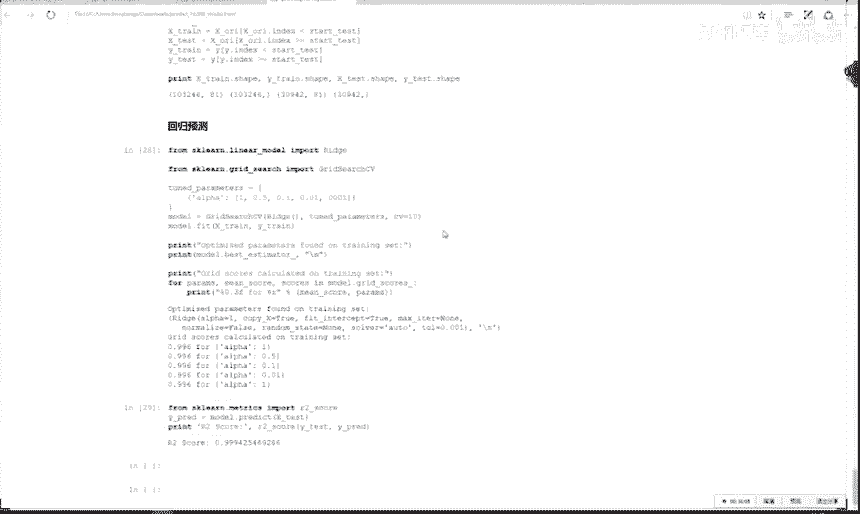

对，差不多这个这几个作业做的都都差不多啊。

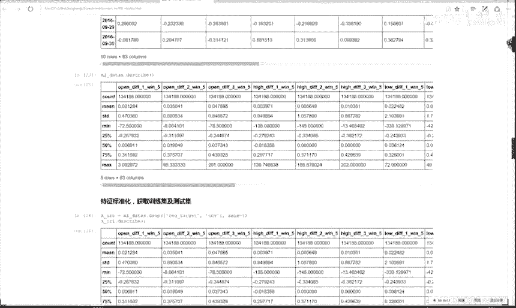

对，都是一样的。那么我们现在开始在白本上写吧嗯。

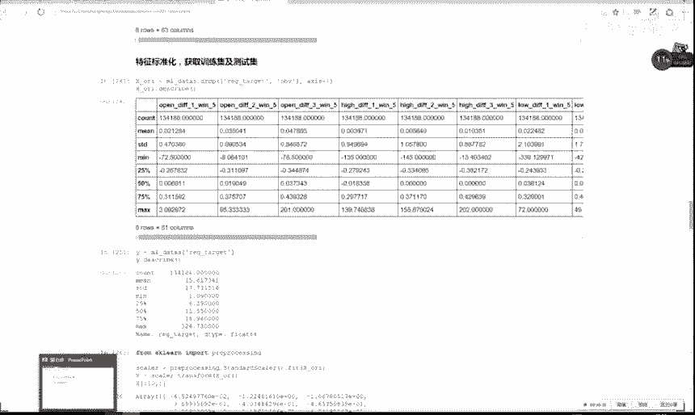

可以可以可以给大家做一个这个，反正因为这个也没有。对，好，没没有问题，就是说是。比如说比如说我们什么叫做比较细致的做这个事情哈，比较细致的做这个事情是首先第一个是数据的分析。

数据的分析是，比如说举举个例子，预计是否类别是否不平衡，是否它是class。而在金融数据中，其实大部分的这个问题它都是不平衡的啊，大部分都是不涨不跌，或者说是小涨小跌。你要有个大涨的呀。

或者大跌的这种异类。它有的时候也是噪声啊，它这个是比较少的。而要看根据你的这个任务呢，你要干的事情，其实恰恰是找一些呃比较少的地方，那么在我们才能在这些地方进行一些啊套利的一些行为。

所以说数据分析这一块，那么手段呢一般就是说计算一些就是通过通过计算一些这个这个比较基础的这个统计量tatistics。以及一些 visualization。

realization其实非就是说这个可可视化呀，就是它这个叫。哦。这口话其实很重要啊，因为有的时候你呃算了一些值之后，你发现啊其实我pl一下，我一眼就能看出来，立马我就能看出来问题在哪。或者说对。

就是说先先先把这一步要做好。刚才刚才那个同学的作业呢，这一步其实做的已经不错了。但是你做完之后你要动动脑子要要想，就是说比如说是否类别就是说你要有目的性的来画一些东西，就是我画这个图之前。

我最好先心里预设一些我画这个图，我想解决一个什么样的问题啊，把这个这个事情啊，要有就是这个意识是要有的。比如说你啊像我刚才反复强调的类别不平衡的问题啊等等。这是第一啊。第二第二之后呢。

就会根据你对这个数据的分析跟理解。

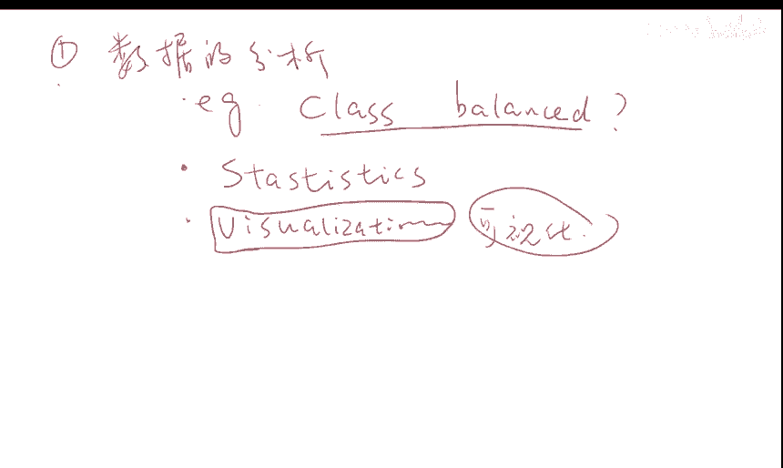

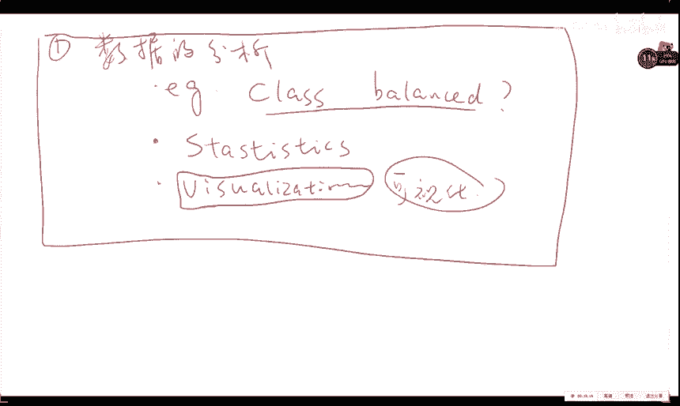

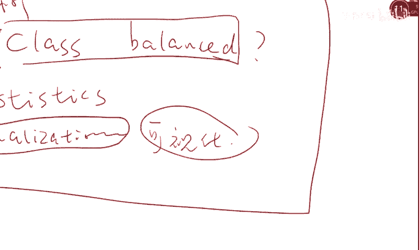

你来你来在第二步呢，你就再选择一些这个呃你重意的，就是根据这一步根据我数据分析的这个结果呢，我们来选择有目的性的。

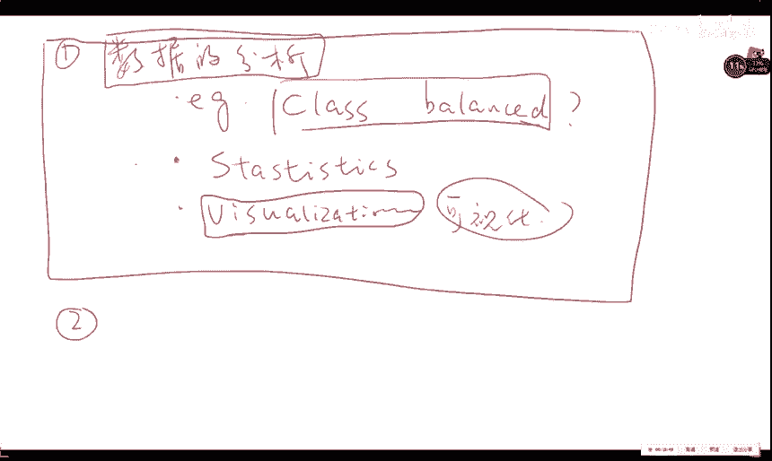

选择一些呢。选择一些这个分类器啊。一些分类器或者这个回归啊。

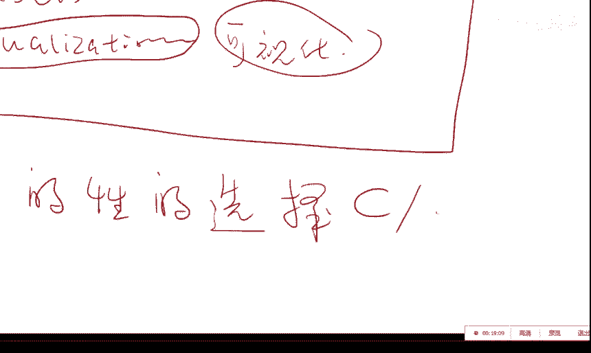

啊，一些啊啊回归器啊就是呃classify或者这个regressor。那么比如说我们要选的时候，那么像刚才那个同学他做的其实是呃嗯有一些瑕疵的。就是说比如说我们先先对每一个的这个分类器。

你比如说对于RF来说吧，你最好是要要要干，至少是你需要先要知道这个RF在什么时候，比如说这个是你的嗯。准确率吧。你最好是要有这么一个图啊，就准确率大概就比较低啊。然后你的横坐标应该是number of。

比如说number of trees。就是说你你你你你要有一些比较细致，对于每一个每一个这个模型，你要有一个比较细致的一些分析啊。比如说呃当我们的数涨到800的时候，我们的准确率啊。

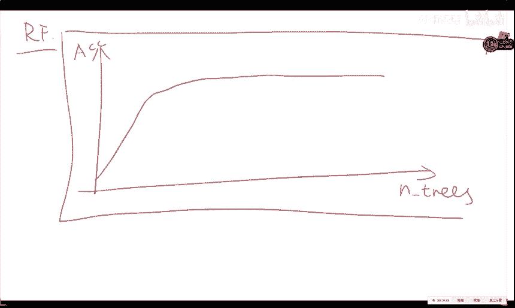

在这个呃这个验证集上，它就它就不大涨了啊。然后你基于这个事情啊，你再分析啊。具体是为什么？然后就是其实是相当于一个呃你先做一个不是很暴力的一种这个courseurse validation来把一些参数就是先你先粗筛一些一遍参数。

而不是比如说而不是。

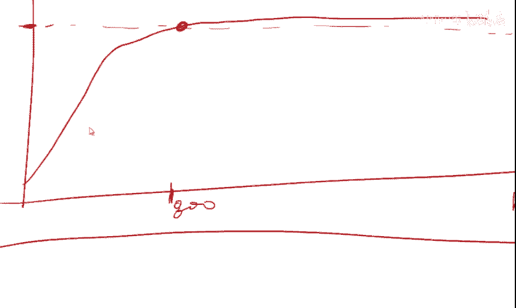

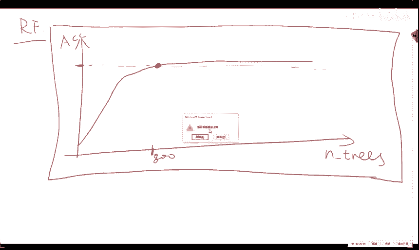

而不是这个同学嗯，他所做的。直接用一些默认的，然后用默认的选一个比较好的。比如说你看它是三个先用三先用了三个默认的，然后三个默认里头挑了一个呃不不为负值的感觉还有可能靠谱的。

然后把它呢再用了一个这个coursese validation。但是问题是什么呢？问题是当我没有得到这个结果之前，我就非常那就是说当当我得到这个当我看到它所给我的这个结果之前，我心里就会说这个领回归。

如果用默认参数的话，它肯定跟线性回归差别不是很大的。对吧那么就因为领回归其实它本质上就是一种加了这个。加了加了这个正正则化的这个线性回归。而且你再用默认参数的话，它肯定不会有一个比较好的一个表现。

而其他的一些这个参数呢，它是比较需要这个比较需要这个呃对这个超参数的一些理解的，尤其是比如说随机森林啊，随森林那呃呃你的这个数据的维度是300位。那么你十棵树，它每次只选啊。

根号根号个300个feature。那么你十棵树很难啊，这么把所有的这些feature都都cover到，而且它的那个数的那个深度，我忘了这个它是呃是五还是呃弄，就是说呃尽可能的先先先对每一个比较具有。

就是每一个比较具有高模型复杂度的这些模型，你自己心里头先再多一些试验，然后再跑。如果性能不好，首先要停下来看看为什么，究竟是类别不平衡。😊，的问题还是你的这些呃特征的一些问题。

还是你模型本身并不适合这个问题。那么呃进行一些一番分析之后，你再对这些事情做这个领回归的一些参数，一定就是说呃原则就是不要偷懒，然后然后要多想。

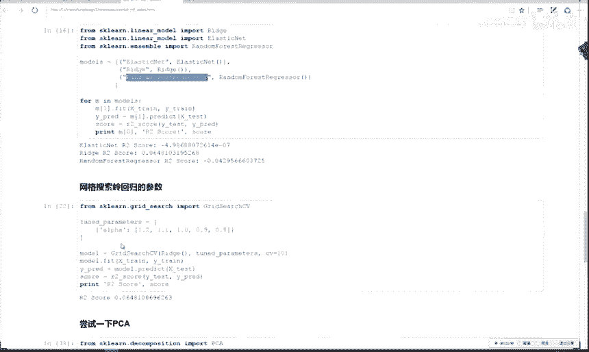

我写一下吧。不去。原则指导思想是什么呢？指导思想是第一啊，第一，不要偷懒啊。

哦。第二呢是要迭代的。叠就是说要。嗯，就是呃说嗯。就是说要迭代的这个呃多思考你的这个模型的结果。第三个呢就是说也许有的时候嗯。嗯。比如说我第一次我还没试过2000个数的时候。

我认为大概嗯200个肯定能搞定。然后有一天我就。就就觉得啊这个事情是不是我这个coursese validation，我并没有把这个模型嗯真正的给它探索完毕。然后我就把所有的可能的数啊我都试了一下。

然后突然发现其实啊在这一类数据上当我们的树在2000颗以上的时候，我们才刚开始呢，就是故事才刚刚开始，就说我们的这个。就是说这个呃参数的这个寻址空间。perrameter的这个这个呃space。嗯。

最好不要呃想当然的去呃去做啊，因为有的时候也许你忽略了一些问题啊，让你在一个很小的一个寻址空间里头。再找你怎么你怎么找，你也找不到一个比较好的一个结果。那么像刚才那个同学，他做的这个R方值是0。06X。

对吧？那么我希望大家嗯在下一次给我做呃，因为。

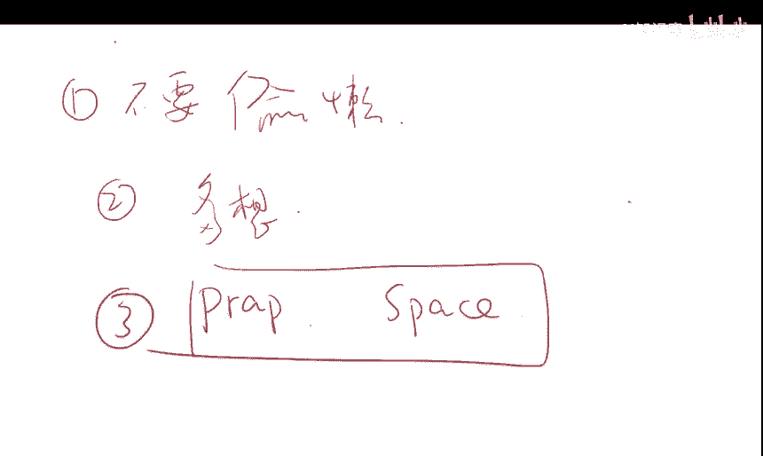

今天的这个作业啊，还是我给你的这个数据集，然后再加上我今天教你的方法。我希望大家呃在下一次的时候呃，就是接着这个往下做啊，啊能做到0。07加之后啊，那个这这个时候呢。

我们才刚刚开始才需啊才刚开始咱才能谈事儿啊，那么就是说希望大家接着我刚才的这几个主要的思路。啊后呢。

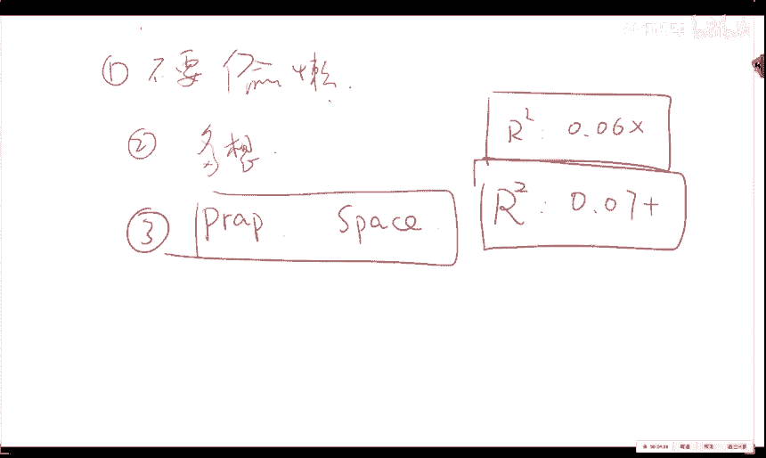

犀系。把这个模型往上提一下啊，做到0。07比才才才叫做啊OK。那么如果是0。06的这个结果呢，那就相当于只是在。只是在就就是说啊试了一下啊很黑盒的一个东西拿来用了用，看啊，也不知道好不好。如果好。

也不知道为什么好。那么这个是不好的。因为其实归根结底呢，归根结底，我们要干的我们要干的所有的真正有意义和有价值和你的这些呃和你的这些跟别人不一样，特立独群的地方，百分之啊60%啊。

在这里啊另外40%在特征的选择啊，因为后面的这些呃啊基于你预测模型的这些策略呢，其实啊金融界已经都帮你做好了。嗯，这个是你只要按部就班的来做就行。而你的所有的创新力呢啊基本上都在这儿啊。

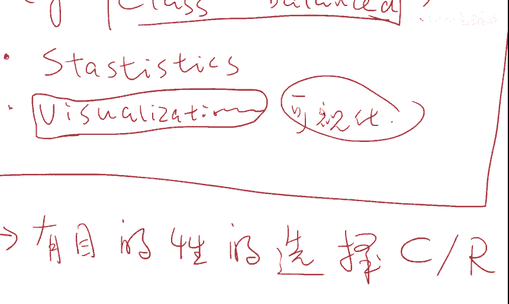

ok。嗯，关于呃关于这个作业，大家啊我再说一点。再再说一点哈。呃。啊，先啊我还是先不说了吧。关于这个作业，大家有什么问题没有？😊，对，就是说嗯用我给你的数据。

然后你们来真正的在这个数据集上做你能想到的各种机器学习的模型。然后三期开70%的训练集，30%的测试集在测试集上的表现那R方值要在百分之呃0。07以上。有。然后呃一定不要有bug啊，有的同学给我汇报了。

在这个数集上，他做到了0。999啊，你这个不用看就知道是有问题的。也是连续的是连续的，就是你不要把它进行一个shuffle。因为这样的话你就作弊了嗯。

甚至呃你其实只需要给我你做的这个呃就是呃就就像这个我刚才做的这个作业的展示一样，你不用给我具体的这个呃实现结果，你只是只需要做一个汇报式的东西。然后啊根据这个结果呢，我来帮你分析怎么样的呃。

来思考这个工作，然后能做到呃07以上呢，我就嗯咱们能聊的就能更多一些了。关于模型。而目前这一步我能给大家的建议就是啊先把模型这个做细啊，然后咱们再看嗯。啊，如果是指数的这个那肯定是要高的。

刚才那个同学指数做的还是相当高的。嗯，在0。9以上。但这个数据你就不要想了嗯嗯。那么呃。那么是这样，就是说是呃再说一点，在关于这个呃提feature啊。T feature。这步其实也很有意思。

而且很多的金融机构，其实这一步他们是知识产权，是保密的。我只能给大家说一些嗯指导思想。OK对于每一个时刻T哈，我们要有这么几组的东西啊。一组是所谓的长线的。一些长线的一些feature。

包括了如果你对个股来说的话，你能爬到的基本面的数据也应该放进去。然后是一些这个短线的一些feature啊。和你自己定义的一些你自己的一些啊，就是这两个呢其实每一个做量化的大家大差不差都知道放进去。

然后你自己的一些feature呢，这个是啊一些比较好玩的一些东西嗯。这些东西可以包括很多啊，比如说比如说这一列呢可以是。比如说如果如果比如说这个股票是比如说是招行的吧。

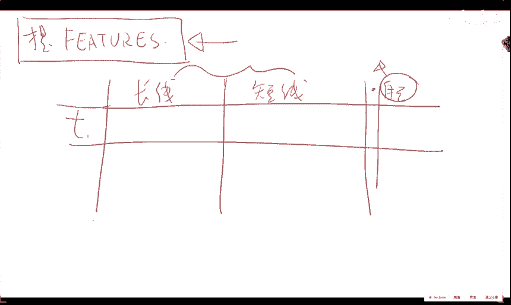

如果这个股票是招行的时间序列的这个。这个数据。然后我们要提的是呃这个这只股票的每一个时刻，它所对应的这个feature啊，你把它的长长线的这些放进去了，短线也放进去了，你还可以放什么呢？

首先你可以放LRP的数据。比如说跟在这个时刻，在这在这个时间区域内，比如说今天今天跟招行出现的所有的这些新闻。

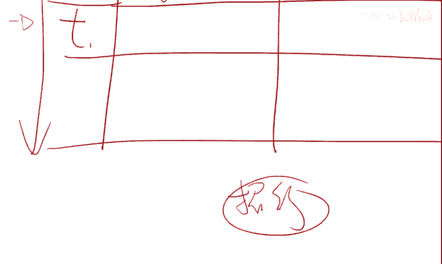

的一个你的一些呃你这个新闻的这么一个feature。比如说你这个新闻的这个啊情感指标啊，就比如就是说它的这个senttiment可以0到1的一个数啊等等的一些你定义的一些。你在任何一个书跟论文中。

你灵感告诉你，你应该放进去的一些东西啊，长短线。

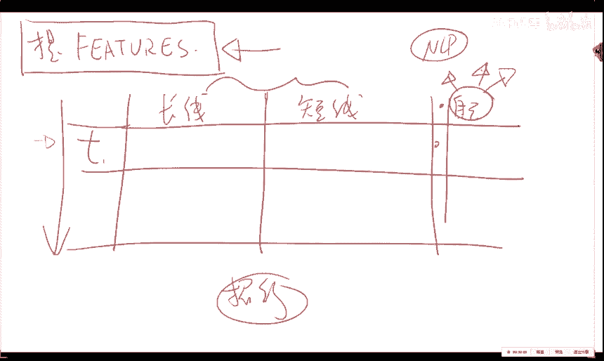

不拘啊，那么就就是说大概呢大致分这么三类啊，长线短线基本上任何一本金融学的书都会交给你。而自己的呢，这个就是啊跟这个建模一样，是各显神通的一个事情。你可以放进去，你认为任何认为有意义的一些一些东西啊。

嗯，那么其实就是这个features，它也是嗯一个好的feature，其实也是非常重要的。有的人他的岗位职责就是什么事不干，专门干这个事儿。

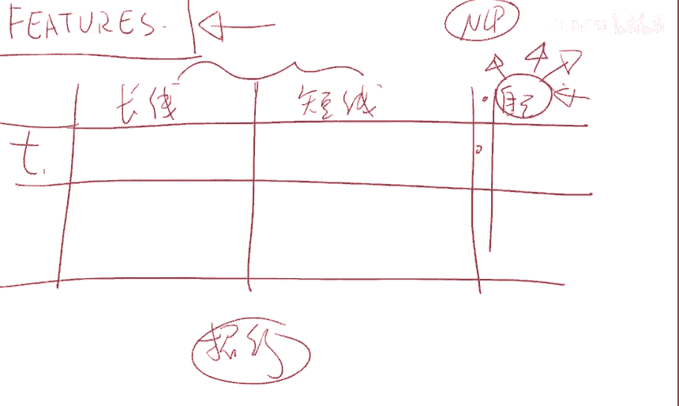

还有问题没有？长线短线主要feature我上次好像全都说到了，在我给大家举了有8个例子，然后还给了大家了一个链接啊。然后还有一本书叫主动投资。那个里头也提到了。

就是你就任何的这个跟技术分析有关的这个嗯这个书里头，他都会会给你各种各样的一些一些东西。最后留两分钟，大家关于作业啊，所以说今天的今天的作业，这周的作业跟上周作业的数据集是一样的，任务也是一样的。

但是希望大家啊嗯来来来来来把它做的做的详细一点。为什么我给你这数据，因为我现在也不指望你们提一个好的feature出来，我给你提好，然后你们来你们来做。因为因为其实你的大部分的在做量化啊。

交易过程中的时间都在这个建模这一块是最最重要的。所以说我希望大家把这一块再再再多练一下，嗯嗯嗯。那如果没有什么其他问题的话。哦啊，英文书呃，课后给啊嗯。好，那么其实今天呢我要跟大家讲的是是这么一个事情。

喂，能有声音吗？好，其实今天要跟大家讲讲的一个主题是关于啊一个。嗯，也是每一个做经济学习。量化的人，他所需要具备的一个东西就是什么呢？是这这个东西。集中学习。这个我把它叫做这个。

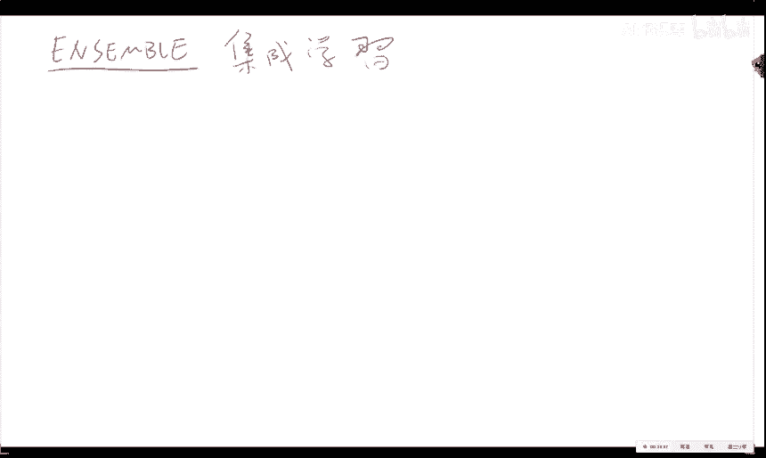

我起的名字啊叫as saving method，就是说呃as saving就是呃就是说嗯呃。嗯，就是。啊，怎么翻译呢？就叫应该你可以你可以想着就是说啊。救命的神器啊。有声音吗？喂喂。喂。嗯，好好好。好。

好，OKOKOK好好，就是说这个方法呢是救你命的啊。😊，什么意思呢？就是比如说你说哎我实在是不好意思呀，我这个模型还是或者一个是你觉得你模型不行，另外一个是你觉得我还想做的更好怎么办啊？😡。

我把这模型已经做到极致了，怎么办？

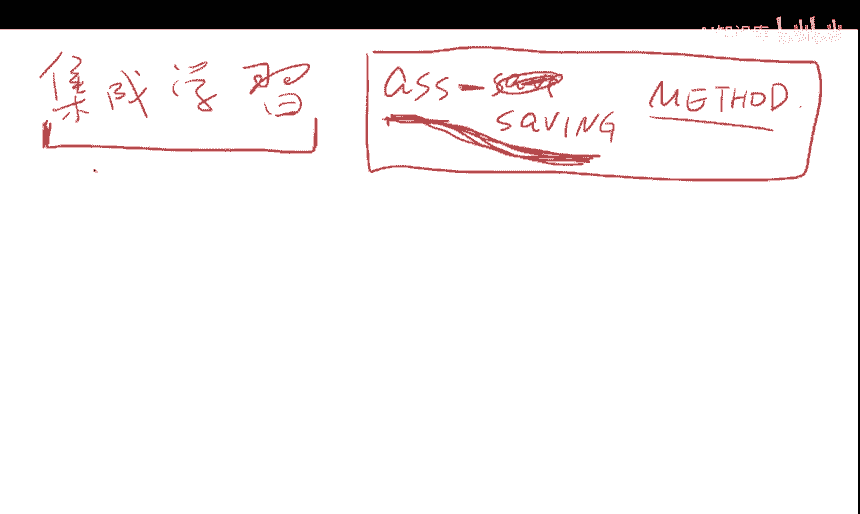

或者说我你就嗯。这不是三步嘛？第一步是。第一步是选特征啊，选这个第一步啊feature。Exstruction。这是你要干的事。第一步。第二步是建模。冇到你。这个model里你有可能建立了一系列的模型。

比如说是这个model one modelel two，一直你建立了10个模型。你第三步，一定要在任何的严肃的工业界生产中，你一定要干的是一件事情是什么呢？是这个unsemble。

就是说把你原有的这些model，你能不能有以一种比较聪明的方式，好赖都不说，只要他比如说对二分类任务，只要比50%强，他都是个都是个事儿，对不对？总比扔硬就是只要他比扔硬币强。

那就说明你学到你这个模型学到了一点点知识。当你有几几千个这种东西的时候，你有没有一种可能性。你把这些模型集成起来，你给他变一个好的啊，就是说嗯中国的俗话就是啊三个臭皮匠顶个诸葛亮。

就是说你现在是有很多臭皮匠，你怎么样的能造出来一个啊比较不费力的，能够造出来一个呃很好的一个模型。啊，这个是我今天想教给大家的。因为其实大家做量化。比如说之前的这个数据的存储啊什么的啊。首先第一。

你可以找别人干啊。第二呢也有各种各样的网上这种开源的在线的这个平台啊，你可以直接拿来用啊。如果你的你你你你想要的feature不是那么呃非常。独特的话，比如说非得要文本，然后再再再再怎么样的话。

目前一些主流的开源的这个在线的平台已经能给你干了。就比如说前面你说老师哎，不好意思，这个买q我就是不会啊，就是存不起来，那没关系啊，你存不起来数据没关系，有各种各样的一些平台你能用。你拿到这个平台之后。

你要干你自己要干的事情，就是你这个事情是你怎么躲，你也躲不过的事情，至少有这三步和后面的这个呃第四步就是strrategy，就是说当我们有一个呃性能是70%正准确率。

你是95%信心知信度的这么一个模型之后，我们怎么样把钱放进去，就是这个事情呢是所谓的这个策略开发，这个是我们下一步要讲的事情。先不管这个就是光这个关于策略的呃，关于这个建模的这个pi啊。

emble一定是你要所停留的最后一站。

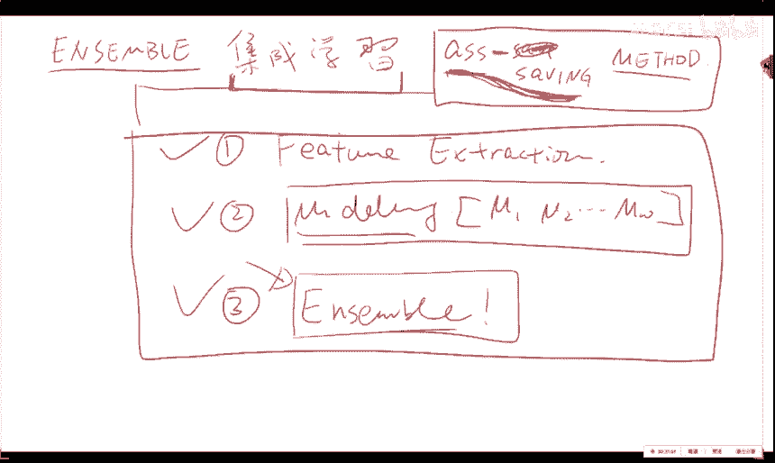

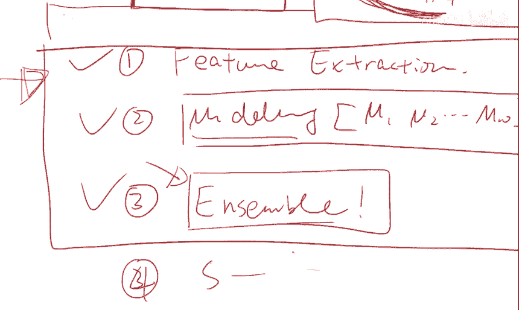

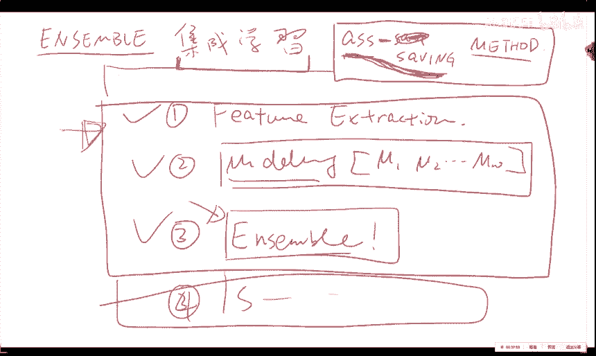

而且是一定要做的最后一章。ok。呃，所以说今天我一定要交给大家，OK我们有了那么多烂的分类器，我怎么样呢？我不会吹灰之力，我往上至少提一个点嘛啊，用unemble的方法啊。

这个是我们今天啊主要要讲那个事情啊，大家有问题没有？

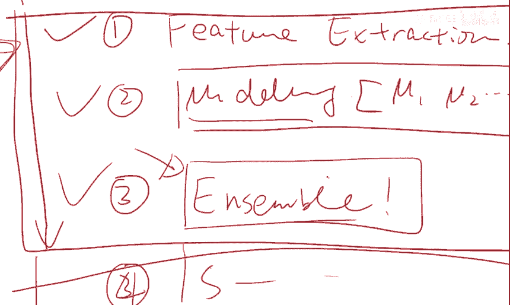

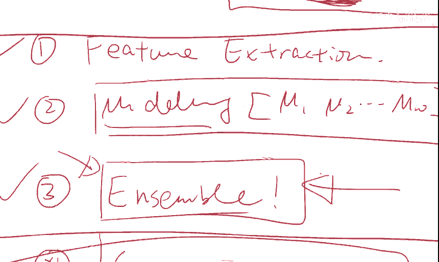

好，没有问题没有问题。我我说今天主要讲这么几个，一个是讲这个stacking啊。

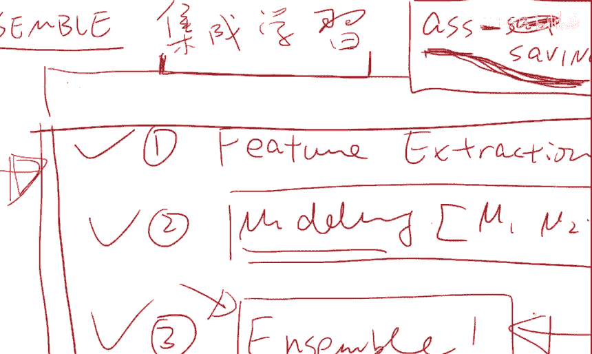

Blening。和这个vootting啊。这其实是一大类，而且比较简单啊，特别好实现啊。Easy。但是important。第二类呢要跟大家介绍一下啊，这也是每个人都都应该有的一个知识。

就是这个 boost。这个算法这个算法呢，如果你们看一些，如果你们之前没学过，你们自己看一些书的话，就很容易头大啊，我用啊。诶。最简洁的一个方式啊，给大家做一个介绍。

因为啊这个目前我也同样没有看到任何把阿达布斯的精髓讲到的。啊，教材因为这个这个是纯理论的那帮人搞出来，就完纯粹是基于啊统计学习的理论，然后推出来的一个模型。这跟神经网络有本质的不同。

就是这阿拉布斯特它其实跟SVM内那一挂的模型很像，它是就是数学家，你就做做做下之后，纯推应从零就推出来的这么一类啊很牛的一个模型。而且它有理论保证。它的保证是。啊啊他的这个他他这个错错误的这个界。

当我们这个模型足够多的时候，它能无穷趋近于0啊，这个很厉害的一个一个东西。这个也是希望大家必备的一个。就是在你的这个技能术里头，你一定要有的这么一个东西。

然后还有这个ting blend也是啊非常简单而高效有效的能够让你几个模型能变好的一种方式啊啊，今天讲这两件事情。我现在要讲stacking blending跟voting是啥？好，那我们现在啊上车啊。

好，那么先看看。今天因为对这些事情实在太熟了，我就给大家现推了啊。今天我们就是说我们一个一个最基本的一个任务是什么呢？比如说我的这个你有这么一个分类器一啊，classifier一啊，我把它叫做H吧。

比如说我们有这个H1，它是一个分类器啊。比如说我们现在考虑。正负分类就是说我可以是正一就是涨，负一就是跌。

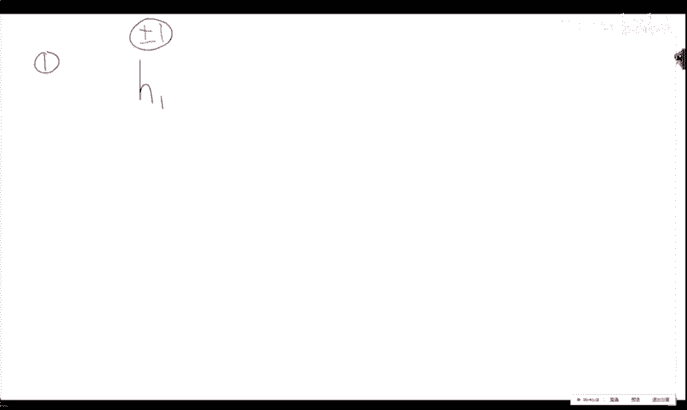

那么我有一些H1，然后有1个H2啊，有H3啊，点点点，有比如说你有H10。比如说这个H1是一个，比如说SVMH2，大概比如说是一个这个随机森林啊。

H3大概比如说是一个这个logistic啊regress啊等等。你就是你有很多的这些分类器啊，大概比如说你训练了10个分类器。

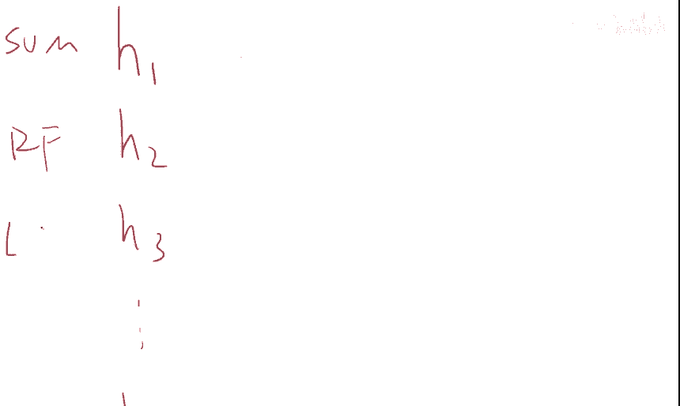

没有问题吧，你有10个分裂器呢啊比如说呃然后现在新来了一个X啊，H1说它应该是正一啊，H2说啊它应该是正一啊，H3说它应该是个负一啊，H10说它应该是个啊正义啊。😊，如果你有这10个结果。

那么最简单的一个方式呢，就是所谓的一个vootting的一个机制啊。

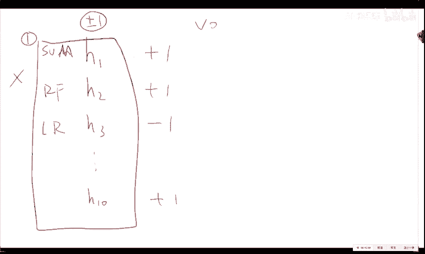

就是说啊我把这些所有的结果，我做一个vote啊，就是说其实vote它这个数学上就是说我求一个sine。把这些东西全加起来，对吧？samation ofHI。就是说我正一负一啊，我全加起来啊。

看它大于0啊，我就预测为正一，小于0，我就预测为负一。这是最简单的一个方法，这不是随机森林，不是随意森林。就是说我现在有啊啊随机森林的最后一步也用了vooting。嗯，但是呢其实随机森林你们仔细想一想。

随意森林是不是有很多很很很傻逼的决策数构成的那我们能不能让这些决策数是其他的模型呢没有问题啊，不着急不着急，权重这些不着急啊啊，最简这个叫做hi的voting啊，硬投票啊。😊。

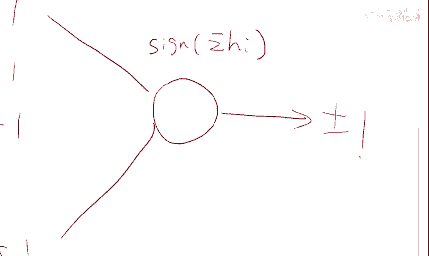

硬投强行投票啊。です。对吧那么我们现在就是说呃我们呃就是呃对这个比如说你有10个啊别人给你的不错的分类器，你谁也信不过啊，而且觉得大概都挺可信。比如说它的正确率是70%，它大概是67%啊。

它是它低一点6呃63啊，他这个稍微高一点73啊，你觉得啊反正大差不差的，你就投吧啊，投完之后呢，你根据这些的就这个呃预测结果，你做一个分类啊，这个是你就是我能给你的最简单的一种集中学益的方法啊。

叫做啊硬投票啊，那当然这周这个硬投票肯定有不少很不好的一个问题啊，就是说你没有考虑到你。

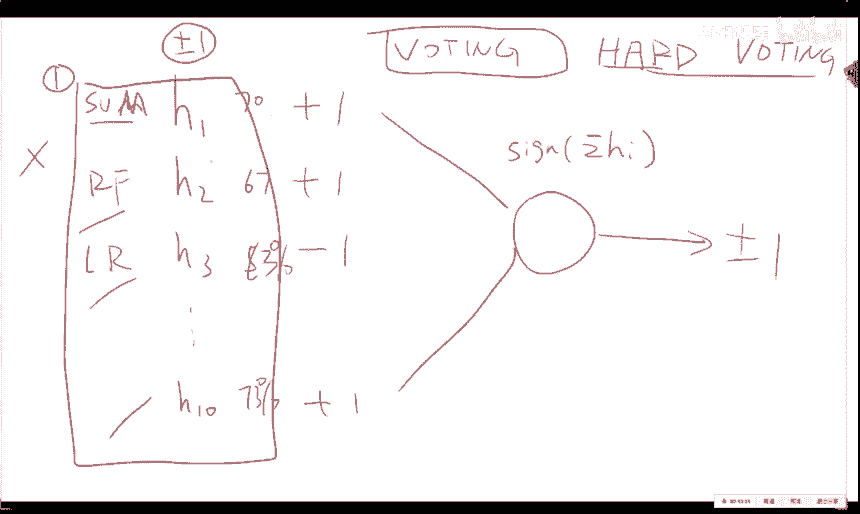

比较牛的人的预测，你把比较牛的人跟比较不牛的人，你把每个人的这个这个权重放成一样的。就跟这个刚才这个啊同学说的一样，就是说这个每一个的他这个位都是一样的。每一个每一个分类器的这个moat呃。

它的这个这个这个权重都是一样的那这个不行，这个太民主了啊，你这一人一票你不好使啊，你一定比如说你们你要抄作业，你也你你至少你也要抄你班里学的比较好的那个同学的，以他的为主吧，对吧？

那么呢下一个基于这个方法呢。

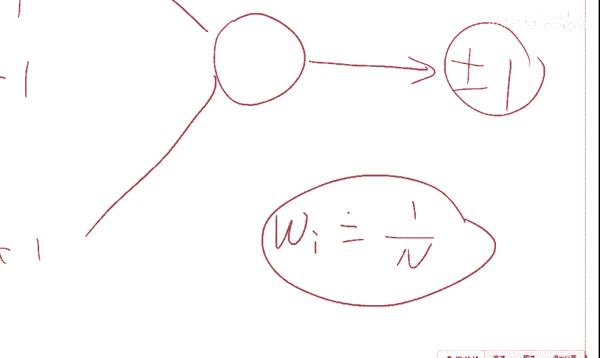

立马就有人提出来了，我们能不能这样做？

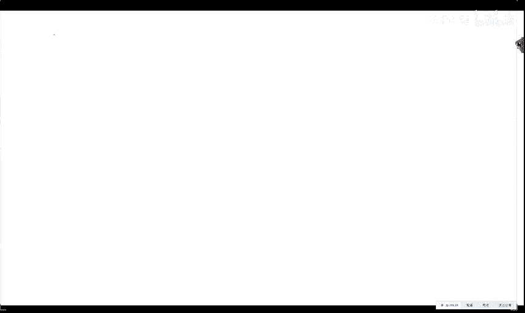

我们这个大分类器呢，它应该是比如说H1的一个啊阿尔法一倍啊，加上这个H2的这个阿尔法2倍啊，加上这个H，比如说N的这个阿尔法N倍，我给它来一个权重。

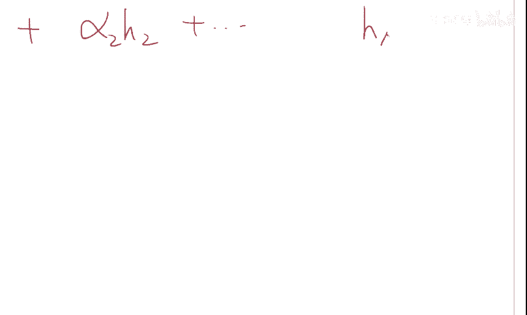

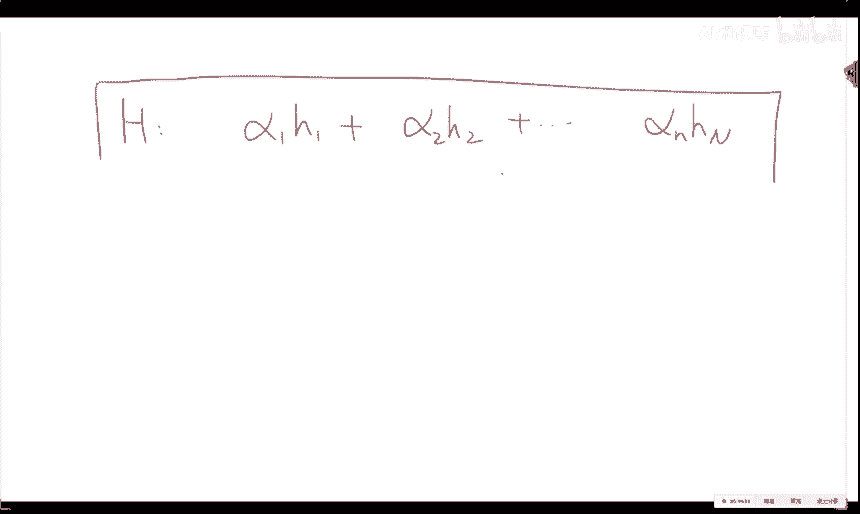

这个是blending。的一个核心思想。就是说比如说如果比如说H1是1个SVM。

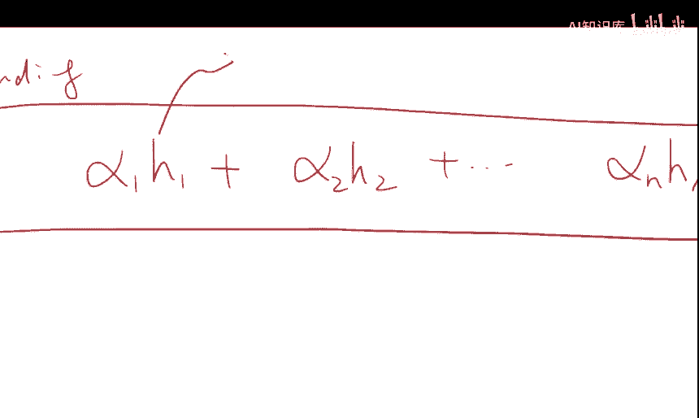

H2比如说是一个这个随机森林。HN比如说是一个这个logistic啊regress。那么我发现哎这个SVM比较牛逼啊，我给他的权重最好是比如说0。7啊，给他是低1点0。4啊，给他是比如说是0。3啊。

那么现在就有一个很直接的一个问题。操，权重怎么来？是由你拍脑袋决定呢，还是怎么定义，这个是一个很好的问题。那么现在的问题就是。How to define。怎么样定义这个。这些权重。

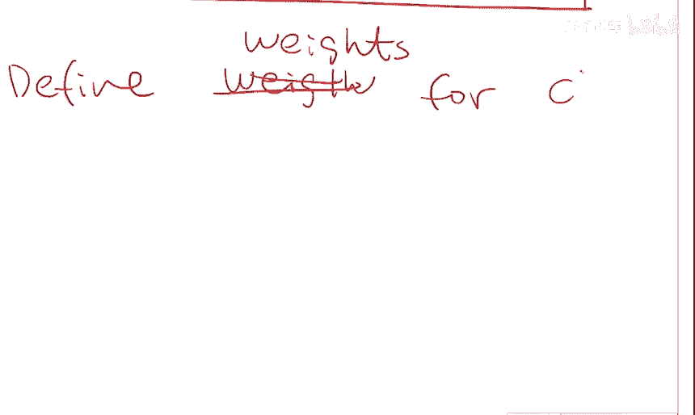

怎么样定义这个分类器的这些权重啊？大家我建议大家现在。做的这个呃。电脑前面你们自己想一想啊，如果你。😡，如果比如说你老板给你这个问题啊，你该怎么回答？😡，嗯，很好。

那么一个那么第一个方法就是说我来定义啊。😊，定义法。就说我操啊。谁预测的牛逼，我我信谁呀，对吧？谁挣钱，我信谁呀啊，对吧？那么就是说第一类呢，就那么最简单的这么一类定义权重的方法，比如说是SVM。

它的准确率是70%，对不对？这个这个log regression，它的它的这个它的这个叫什么它的这个准确率，这个 accuracy，它这个准确率比如说是663啊，那我们它的这个权重肯定就应该大一点。

它这个权重肯定就应该小一点。那么这个权重呢就应该是比如说你可以定义为它的 accuracycur除以这个你给它nmalize一下所有的这个。😊。

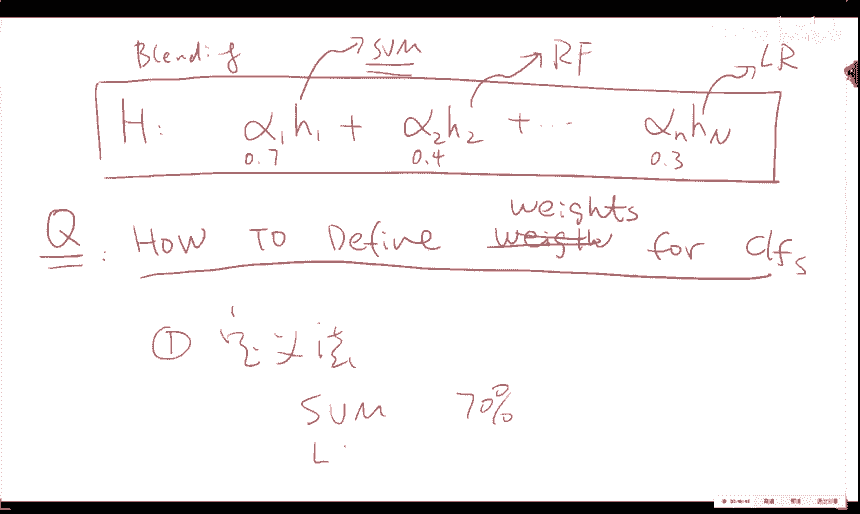

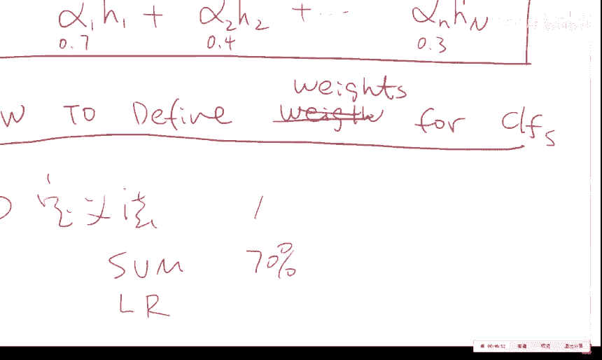

Icur。之和这样的话呢就是啊你做的牛逼的，你的权重大一点，你做的比较傻逼，你权重小一点。对不对？这是一个啊任何人都能想，这是一个。这种方法呢叫做成员方法啊，就是咱也没学过什么机忆学习。

反正这个事情也很显而易见啊，谁预测的准，我让谁做呗。哦。也行啊，这不并不是不行啊，没有任何问题啊，可以，你可以这么做嗯。呃，我不建议用实盘表现，因为咱们现在在做的事情都是还没到实盘。

就说我们放食我们在实盘里跑的模型，最好是一个集成的结果啊，所以是个集成诞诞诞生机的一个问题。就是假如说你还没实盘，你兜里就10块钱，你就舍不得花呢，你还不敢实盘呢啊。😊，啊。当然，实盘表现也完全可以。

我同意啊。哦。在就是说这个思想是一种红方法，甚至可以是比如说H一是什么呢？哎H1是这个基金的一个表现，H2是什么？H2是另外一个基金的表现啊，你现在其实想比如说你想分配一种权重啊，关系啊，你怎么弄啊？

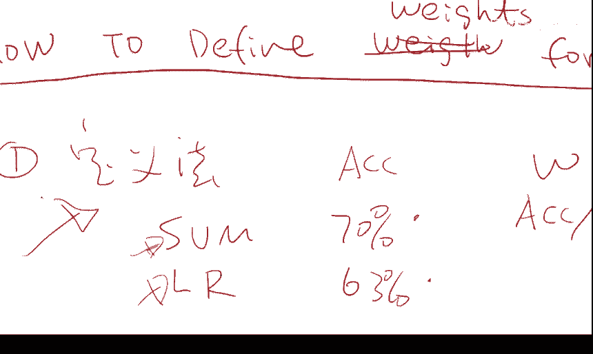

那么呃再回到这个股股票的这个问题上，那么这个bing是怎么做的呢？不leing做的方法是他用机器学习的方法来做。他是用机器学习的方法来做。

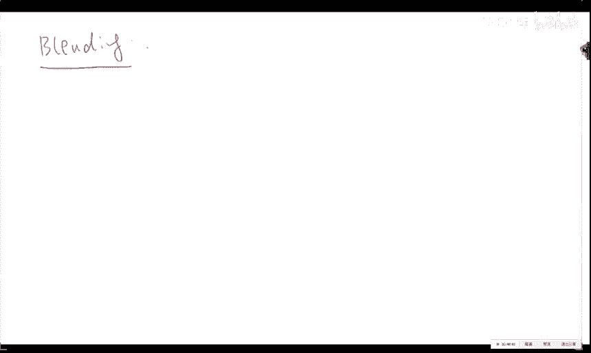

他是怎么做的呢？嗯，我给大家，如果就是因为嗯。就是说其实这些方法，只要你只要我把问题提给你了。因为我们在做量化的时候，其实提出一个问题的意义比解决这个问题更重要。因为解决问题的方法。

只要你受过比较好的训练，你都能想出来。但是问题本身比问题还重要。假如说你现在不许媒体百科啊，如果你是。啊，就是说如果你现在听到了这个问题。我说请用机器学习方法来做，你该怎么做？我只给大家两分钟的时间嗯。

来思考一下OK。啊，是这样是这样。这。大家想的有点呃，已经想到技术性细节了。其实我是想让大家想的是呃什么方向方向是这样OK方向是这样。放是比如说呃我们在测试集上啊，他干的这个事情是这样。嗯。

比如说呃就是其实他的这个想法非常简单，是对预测做回归，在预测上再做一个监督学习的任务，什么意思呢？这样比如说你看哈这是啊classifier一啊，比如说咱们做一个回归任务吧。

比如说是这个regress一啊，这是regression2，这是regression3，这是真实的Y值，real值。他说是0。3，他说是0。2，他就对于一个X来了一个X哈，来了一个新的X。他说是0。

3到是0。2，他说是0。15。

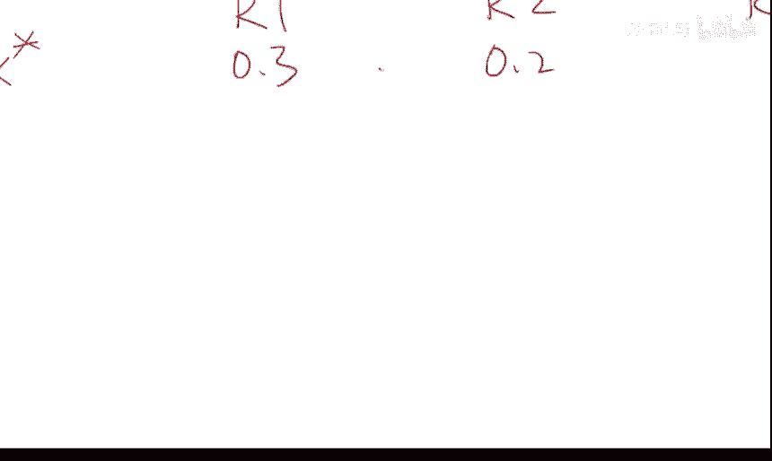

真实值多少？真实值是0。27。我怎么样学出来呢？那我们我们就在我们的这个validation set上。我们对这个数据对它预测的这个结果，我们再跑任何一个监督学习的一个分类器就行。不需要是线性。

最简单的方法是线性。就是说这块你可以是一个线性的呃组合，也可以是一个线性组合之后的一个非行性变化，没有问题。

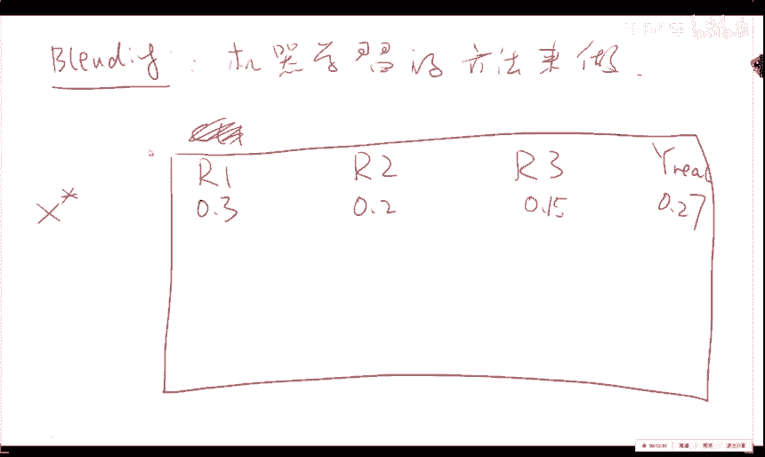

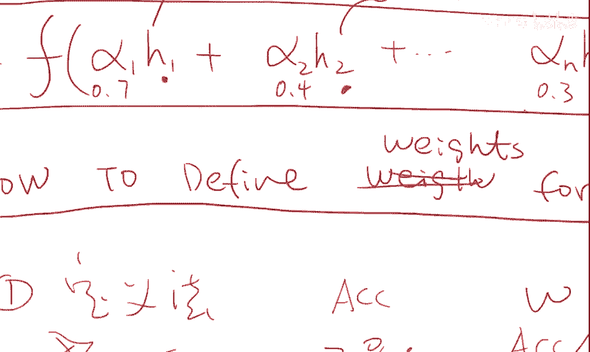

那么在这这个里头就是说比如如果是线性，那么我们是不是建立了一个新的训练集，这些新的训练集的X是你的Y的这些prection。而它的对应的呃呃这个Y值是是真正的Y值。

就是说你在prediction上又做了一层的这个啊监督学习的任务。这个观点非常重要啊，大家一定要掌握。因为今天后面所有事儿都是基于基于这个来的。

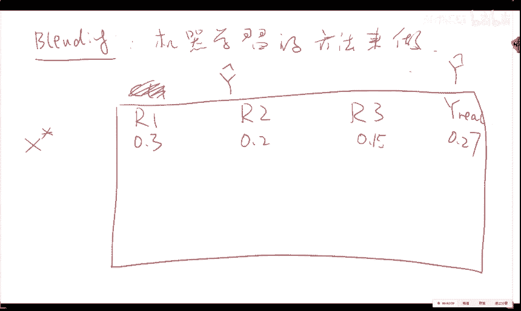

什么意思呢？我们又建立了一种一个新的训练集。这个训练集的输入是你的这些模型的呃预测值，输出是真实的值。那么我们有了输入，有了输出，是不是就会自动学出来一个权权重0。3乘以它啊，0。1乘以它啊，比如说0。

8乘以它。也就是说我们的这个我们本来有一个X。我这个X特征重表示为。比如说你有N个分类器，就特征重表示为一个N维的一个一个东西。这个东西呢是pre of啊一。

prediction of二就第二个分类去给你跟prediction of。嗯，然后你在这个上面，你再做一个。这个预测的这个这个分类器。你把这些的权权重你再学一遍，它有点像RBF啊，但是啊也也不像。

就是说它是对它是对什么呢？它是对你预测结果的一个权重的一个再学习。因为这个问题就是啊这个是我一再强调的哈，我们在遇到一个新的问题的时候，我们一定要心里想我们想得到什么？我们想得到这些权重。我们会什么？

我们只会监督学习里的分类跟回归。那么我们要把从我们想干的事情跟我们会干的事情中硬凑出一条桥来。而我们这而我们这个桥就是说okK我。😊。

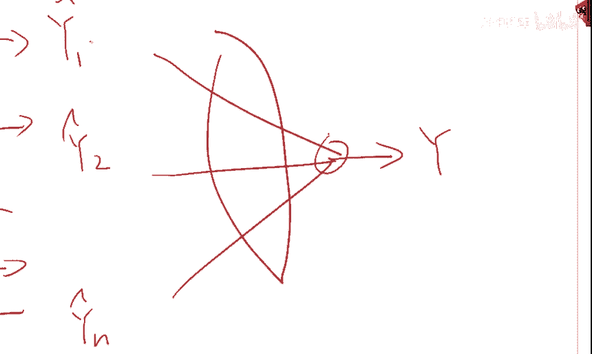

从这个角度来思考这个监督学习的问题，我同样可以把这个参数学出来。但是问但是在于它跟神经网络不同的地方在于什么？神经网络的每一个节点是一个非常简单的logistic regression。

而我们这个里头的东西，它背后可以是一个极其复杂的一个模型。比如说它这个SVM。😊，它这个什么呢？它是一个它它就是一个深层的montilayer perception，它是一个神经网络。它这个什么呢？

它它可以是一个更生层的一个神经网络啊，那么就是说我们的这个这个积分类器可以是任何事情，而并不居于神经网络的那些啊神经元。

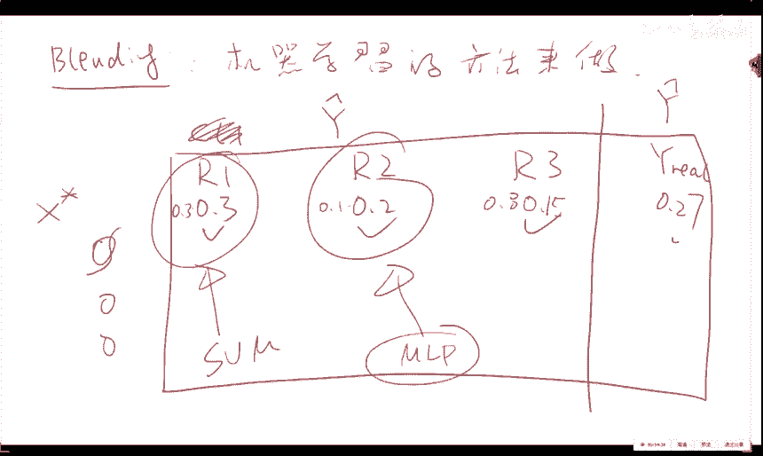

有问题没有？这就是bending啊。什么意思呢？就是说啊如果再用一个比较好的一个图表示来说，这个是我们的分类器一的一个结果。这个是我们的分类器二的一个结果。这个是我们分类器三的一个结果。

你最好有那么比如说10个分类器啊，1010个结果，你把这十0个结果呢，你再做一个。

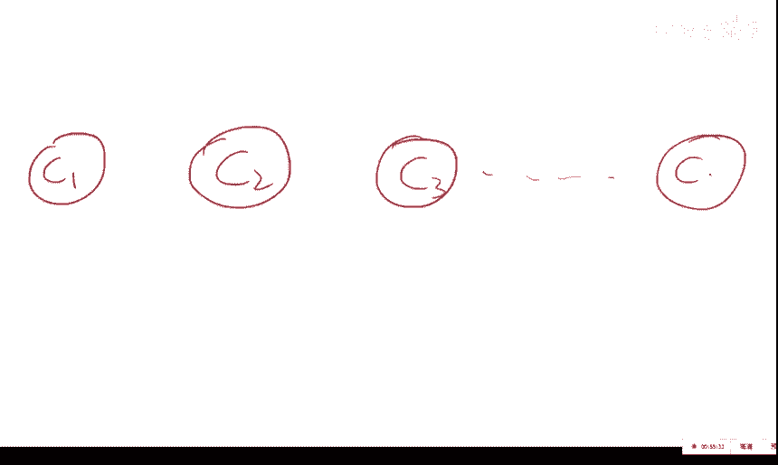

你再做一个这个集成，就是说你在这个上面，你再做一个新的一个分类器。asseemble的这个分离器。

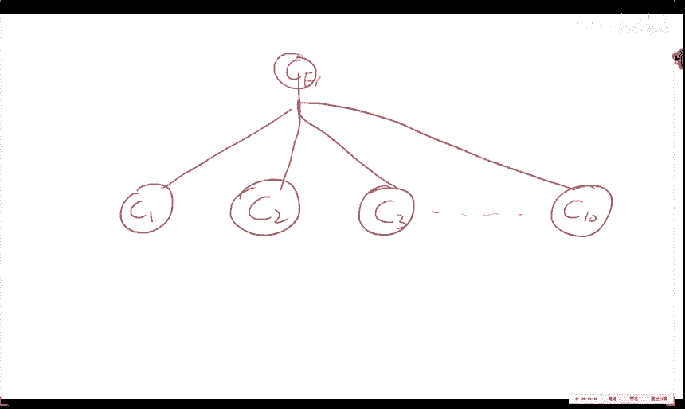

这个semble可以是任何的模型。可以。这个semble本身是个SVM。因为它的维度已经比较低了，对不对？你这个这个东西也可以是一个线性回归的一个一个一个linear的一个model啊。

也可以是一个神经网络啊，NN没有问题，也可以是一个这个随机森林啊，run forest。都可以。

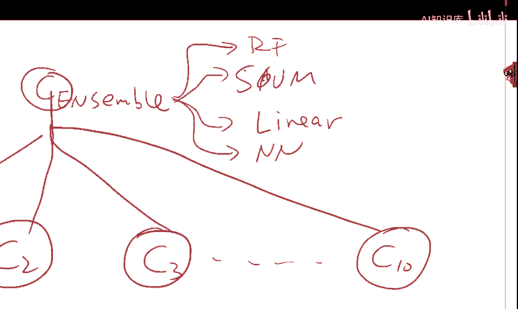

那么这个是这个这个牛牛就牛在了，它的这个性能提升是白给了，白送给你的。你自己兜里已经装了10个分类器了。你这么一搞，它只好不坏啊，它它不可能坏啊嗯嗯。那么立马就如果你足够聪明的话，你立马就会说哈。哎。

你这么做，我能不能我能不能呃给他再复杂一下？

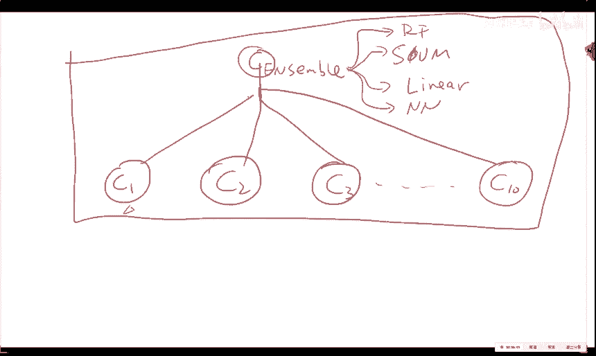

再复杂一下怎么来这么旺class fair一。class fire2，比如它是SVM，它比如说是一个随意森林啊，它比如说是一个这个rdom forest。啊，比如说他是一个啊这个。

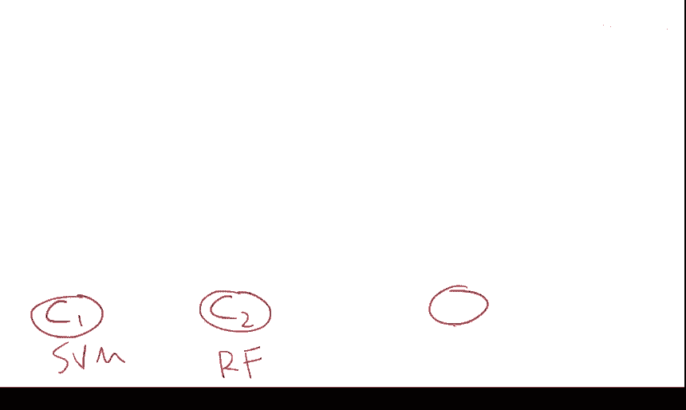

啊。啊，什么呢？啊，这个比如说这个啊啊啊XG boost啊。然后他比如说是1个ANN啊，你有这你你有这么这么东西。那么你是不是现在要学出来一个集成学习的一个方法？

用比如说你用了一个这个s ensemble，这个unsemble，比如说是你又用了1个SVM把这些预测的权权重出来了。但是呢你同时会觉得我操我用SVM能集成，我能不能再用一个随机森林？

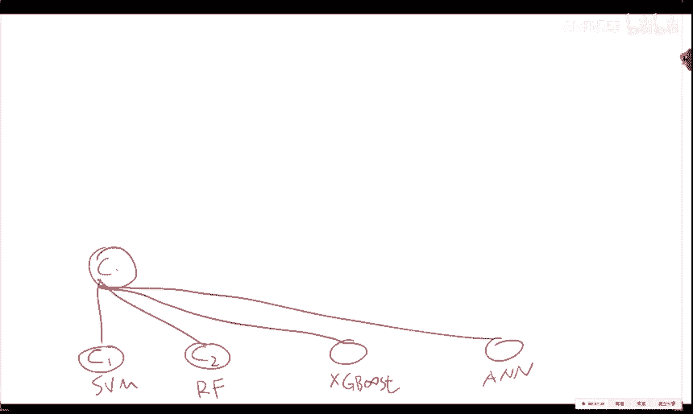

用一个随机森林来把他们集成的没有问题啊。因为因为这是个监督学习任务，你想用什么都行。然后你再用一个什么呢？你比如说你又用了一个这个ANN啊。😡。

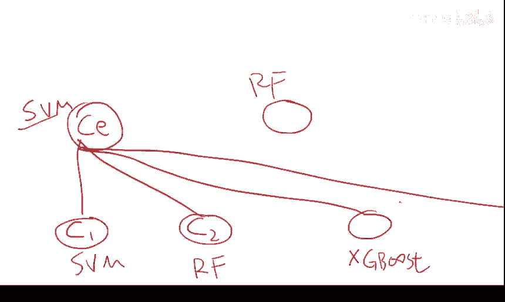

你再把他们在一集成。Yes。然后你把集成的集成呢，你再做一个线性分类器，就你能一直往下做下去。比如说你在你你你到最上面这一层了，你用个linear的东西就行。😡，你就能一直就往下走就行啊。这个东西呢。

也是很棒的啊，在实战效效果中也是蛮好啊。

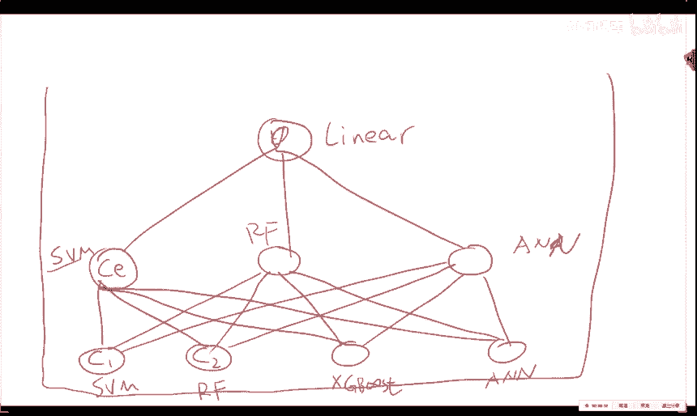

啊呃，不一定啊。而且。如果大家在集中学习中做了过拟合了，一个很一个很很有可能的问题是什么呢？You。不一定不一定不一定不一定。一个很很有可能的问题是你做的这个东西是就是说是什么？

你做的这个Y值的这个这个就是说你的这个Y值的这个一跟Y值的这个2。

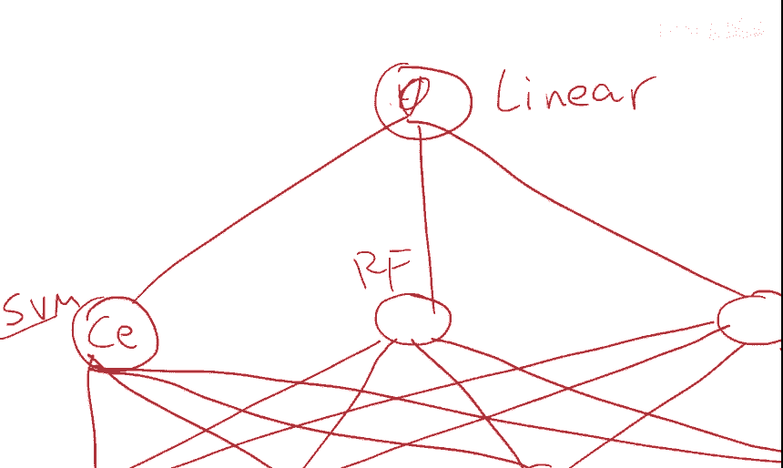

Y值的这个N跟我真实的这个YY值，你做的这个训练集是是在你的这个训练集上做的，这个做法是错的。就是说这样做是一个很常见的一个不对的一个方法。

如果你你是在这个training training data上做的话，应该怎么做呢？应该做这个你在validation set上做，就是什么意思呢？

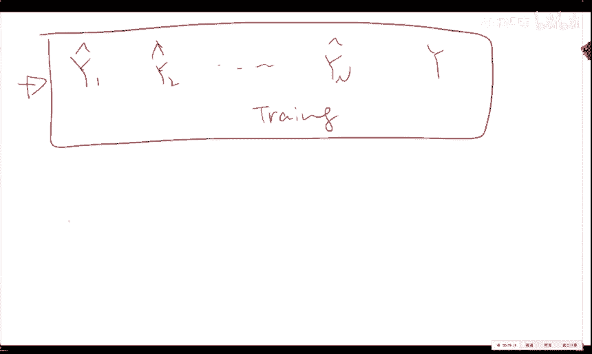

这是我整个是我的这个X train。我在X train上，我训练一个模型，训练这个Cclassifier一。然后我对classifier一，我在它的另版，比如说在这个valation set上。

我做一个呸。

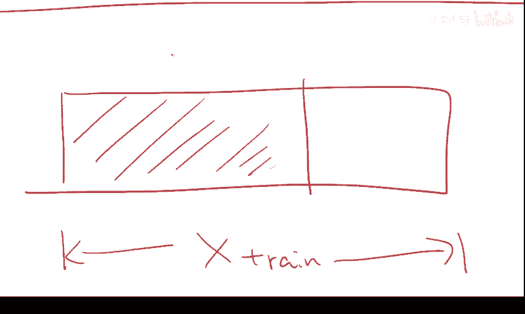

做一个预测，我得到了class fair一的这个。啊，预测结果。然后cos呃因为这个是训练结，果对应的是有这个Y值真实值的。然后你拿它把这个东西拿出来，当做你的这个监督学习的这个东西。然后呢，你再在。

然后你再在这半了训练你的classifier一。然后你在这个部分上预测你的classifier一的这个这个预测机，你再把它再再给它贴成一个完整的这个训练集。

就是说一定不能在classifier一上训练了，把classifier一训练集上这个预测结果。

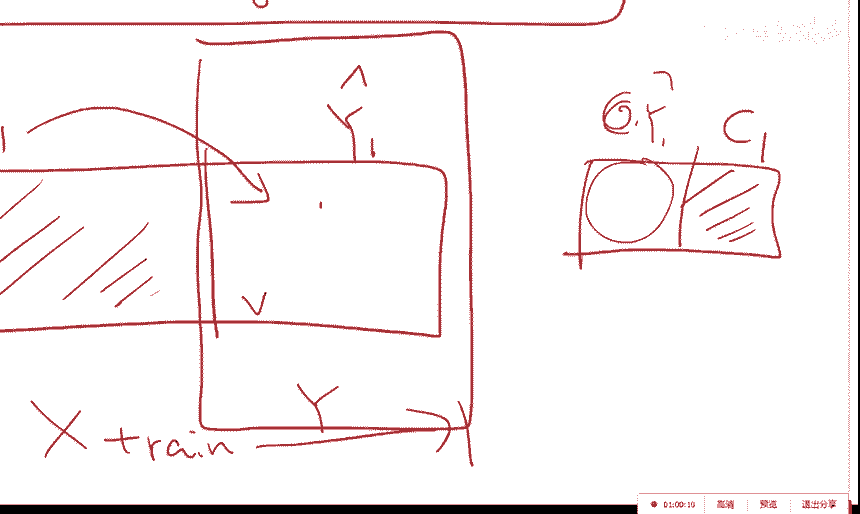

做这个啊集成学啊，做这个不能啊。呃，给大家呃3分钟的时间来啊来呃，是两两边都要做给大家给大家33分钟的时间来提一些问题，我去拿杯水啊。好，我我回来了，我看一下大家的这个这个问题啊。

那最后用什么数据做测试？啊啊你在你的validation set上再做。然后你测试集到你你不完了，你才能测测试集，你只能看一次测试集，你看两次，这你这事就。就麻烦哦。这还没到呃，har ratio呢。

因为sha ratio是取决于你的return，而你的这个回报呢是取决于你的这个策略，而你的策略呢是取决于你这个这个这个你的这个这个这个啊啊啊啊这个凯利的这个这个这个raio啊，这这这还没没弄完。

She。啊，不一定是非要50%50%啊，最好是K呃最好是呃所谓的K折交叉验证啊啊。嗯，好吧，看来大家还是有些疑问的，我再给大家。再再讲一下哈。是这样。OK我们现在不是有这么一个数据集吗？😊。

我们现在有这么一个数据集，这是我们的这个X train。这个是我们的X test。没有问题吧。在这个里头呢在这个里头，我们的X test一直不用啊一直不用。一直别一直别一一直先先别用啊。

我们在这个寸在这个训练集上呢，我们做一个K折的这个交叉呃一个K折的一个划分啊。比如说5折啊啊5折吧啊，四折好了。OK我们画一个四折的这个交叉验证OK然后我们在这个数据在这一部分上呢，我做一个SVM。

没有问题吧。我在这个数据上做1个SVM，比如说我们把它叫classifier一。我们这cs一，我们是不是能在这个上面我们做一个预测？Oh。然后呢，我们再在。就是说。然后我们同样的四折交叉验证，对吧？

我们在这三这三个块块上，我们再训练1个SVM。然后我们把这一块的这个它还是classifier一，我们把它的这个Y一值拿出来。

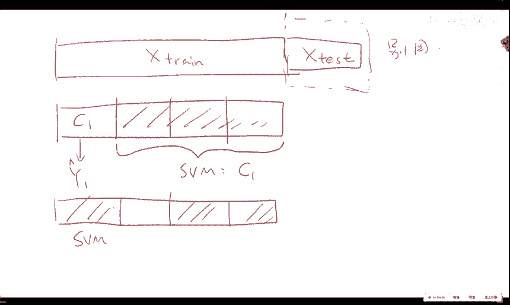

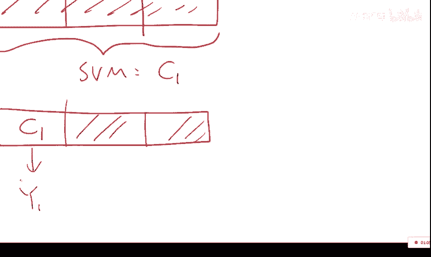

同样的，我们通过这种方法，我们走四遍，我们就会有一个真正的一个YE。这个YE呢是在整个的X上都有的一个。Y1，而这个Y1呢是我们C一所预测出来的Y1。这个是我们的唯一。这个才是我们的唯一，对吧？

有了Y一之后，我们呃我们要干的事情，我们有了Y一了，我们还得有Y2，对不对？😊，我们还得有Y3，对不对？我们对Y1Y2Y3，我们再做一个监督训练Y值在训练集上，全部这些都在训练集上玩的。

我们用阿尔法一、阿尔法2、阿尔法3。如果我们这个。这个模型是一个线性回归模型的话。四个怎么怎么会变成有一个的Y值啊，是这样，你看哈。

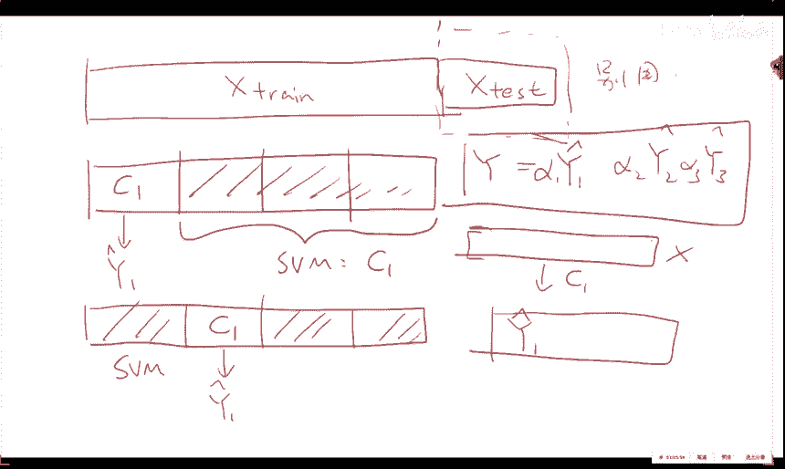

我们每一个X值不是对应一个Y值吗？每一个X值每一个X值我对应的。

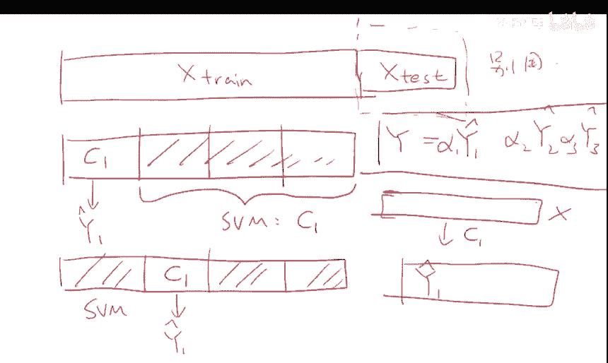

这比如说这个就是一个X，这是一个X，这是一个X，我们一共有1万个X，每1万个每一个X都对应一个Y的真实值，真实值就是re值，对不对？这个re值就比如说是涨或者跌正一或者负一，这个就是我们要做回归的对象。

而Y一Y一上面有一个小帽帽，Y一t是什么呢？是我第一个分类器所预测的这个Y一，比如说真实值是Y一，我我这个这个臭皮匠，他说是负一。然后然后他在这个数据点，他说是负一在这个数据点，他说正一。

就是说这些YY一的t是我SVM就这个臭皮匠所预测的东西。第二个Y2呢是我另外一个臭皮匠所预测的东西。比如说它是SVM训练的东西，这个呢是什么呢？这个是一个神经网络做的一个结果。😊。

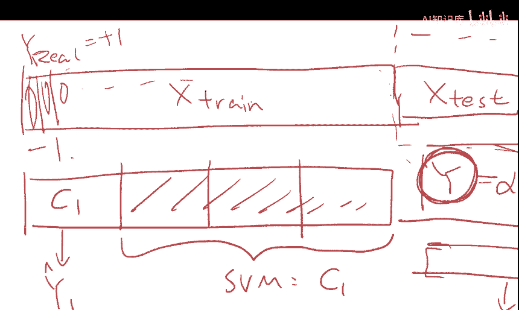

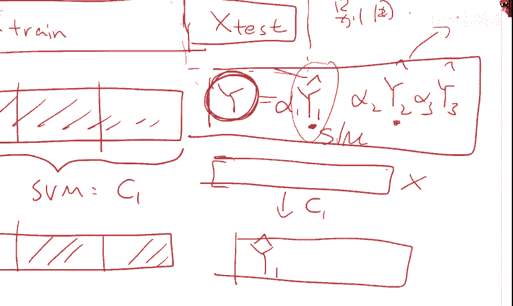

你可以有政策啊。啊，一般是1者。现在大家还有问题没有？四折以后不用选四折之后，你就把你看你不是有一个训练集嘛？训练集上我在这一折上，我预测的这个结果，我只占了25%的数据。我要把其他的也都预测一下。

我做一个比较大的一个训练集，试用了4次嗯嗯。左边的四个Y一层啊。啊。那对于某一个分类去做cch还是要还要做不不用做vooting了嗯嗯。给大家讲一个简化版本吧，简化版本你这样你就别别费神了啊。

比如说你你训练集中，你拿出70%做训练，你训练1个SVM。你在这啊你用这个SVM，你在这个30%的这个测试集上，整个这些都是这个X training啊。这都是act training。

你用70%的SVM训练了，在30%上你做一个预测Y1这个Y一它是有多少行？比如说你共你一共有有1万个点，那么它就有3000行，它有多少列呢？它这个列数就是5X这个dimenion的这个这个维度。

这是你的Y1，它那么它对应一个真实的Y，对不对？真实的Y也是啊3000行啊，它它它它对应的是这呃多少列啊，是在这个啊。

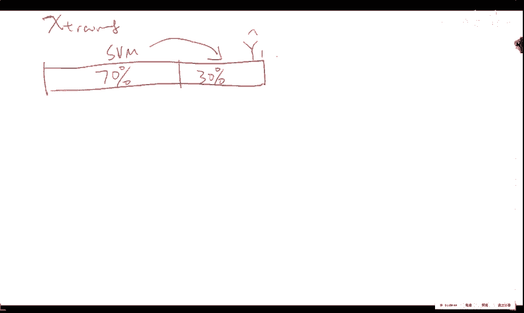

玩不应该是。呃，不应不应该是D，Y是一，就是它有3000行啊，你Y值如果是一个回归任务的话，它是一维的。那么你这个真实值其实也是300行啊，真实是一维的。那么这个是I。

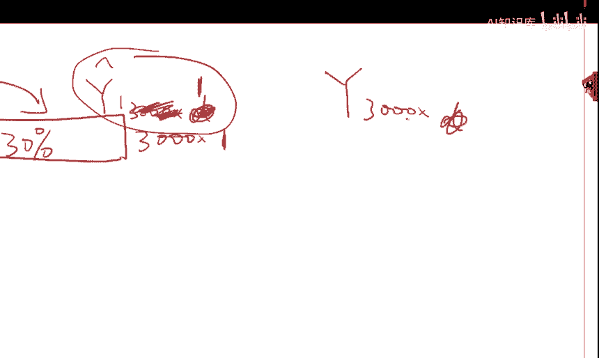

SVM。然后你再训练一个随机森林啊，它占70%的这个数据。你在它训练上了，你在这个validation set上，你做另外一个预测Y2。它也是3000乘以1的这么一个东西啊，然后你再做一个。

比如说ANN啊。你同样会生成一个Y啊，K啊，它是3000乘以1的。然后你现在要干的事情是，你想知道这些这些个分类器或者回归器它们的权重是多少，你怎么办呢？你把他们的预测跟真实的这个结果。

你做一个监督学习就行。

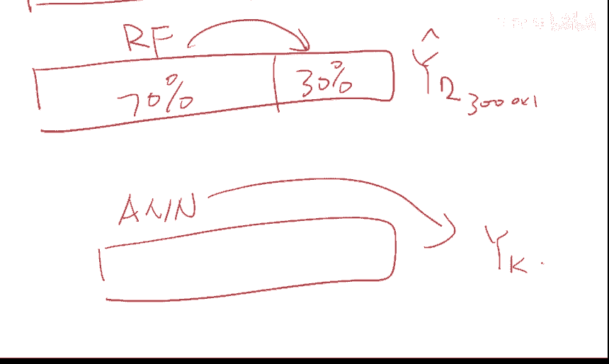

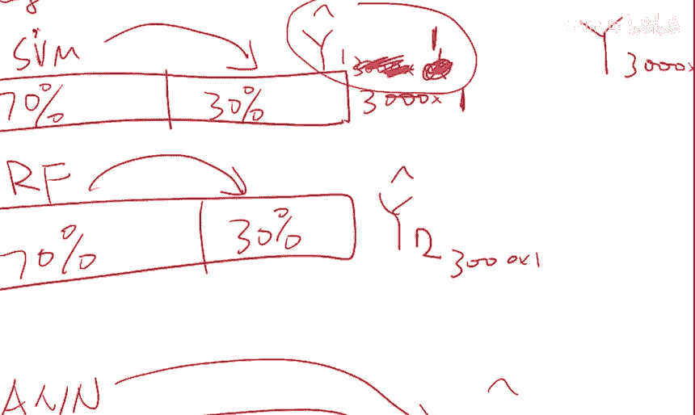

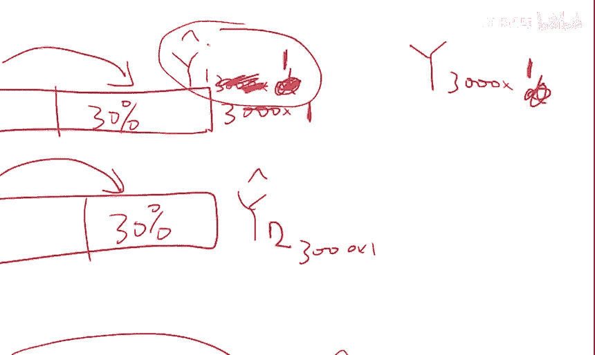

所以说我最后就想干出来，就是Y值，它应该等于阿尔法一的Y1，加上阿尔法2的Y2。加上阿尔法对对对，加上阿尔法N的YN。

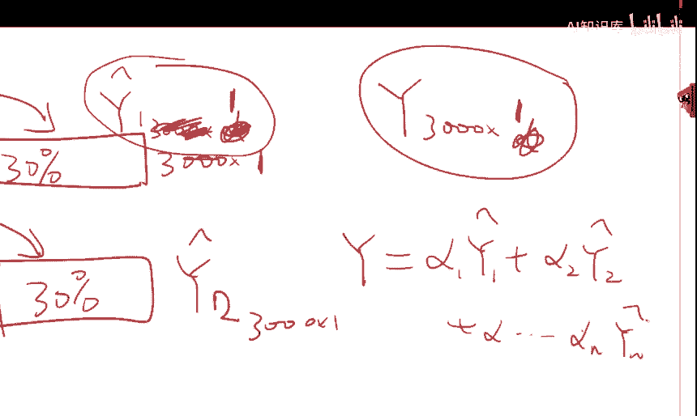

She。我们这个事情不要voting啊，我们这个事情就用监督学习就行了。我这对吧？😡，怎么合并？这个合并的方法就是你认这是个监督学习任务呀。Y一值你有了输入是Y1Y2Y3Y4。

输入是这4个臭皮匠所预测的0。20。8。😡，0。9和1。1真实值是什么？真实值是1。2，这这个值你知道吧？这四个值是你训练过的东西所预测的一个结果。你怎么样把怎么样把这个这个对应关关关系确定呢？

你做一个监督学习让，你再训练一个任何一个呃随机森利也好啊，SVM也好啊，先性回归也好，你就能学出来这么一个对应关系。Yes。我认为大概大家。啊。基本上都听懂了吧，听懂的点点头嗯。那么现在就就。

就是说你这么能做一个你用另外一个呃这个这个这个这个tacker啊或者bnder，你也能做一个。你再做一个，就是你能做这么两层，最后再用一个力啊一个线性的再把啊啊集成的集成再一学啊就完了。好。

那么接下来呢我再跟大家讲这个集中学习中的另外一个啊终极大杀器啊这个。这些东西没有什么很难的地方啊，会把算法听明白了，你自己就手撸了。但是阿拉布斯的很麻烦。阿拉布斯的你如果不知道原理应用的话呢。

呃是很很危险的一件事情。而这个原理呢又在大部分的书上又写的太数学了。所以说我我今天给大家讲一下这个传说中的这个。😊，Other post。它这个叫自适应的boosting的一个方法啊。

adaptive boosting啊。好呃。行，那大家这个课后再讨论，或者说你课后再看我看我这个视频，你再这个staing planning啊，你就会明白。那么我我现在希望大家呃别着急啊。

呃你们现在就就就就就就就听这个adada boost嗯，因为这个事情是一个比较独立的另外一个事情啊，大家要专心，别这块也也。挺麻烦的，所以嗯。大家准备好了吗？啊。好，那么我们现在讲这个阿大布事的哈。

超酷这个玩意儿超酷。哎，这玩意太酷了。嗯，好。啊，我想想啊，OK我现在假设你不认定没听懂啊，但是你听看完视频就会懂，但是你现在又不懂。好，咱们从头说哈，稍微稍微复习一下刚才说的东西啊。

其实我们现在就有很多叫所谓的这个弱分类器啊，比如说我们现在就分两类正一或者负一。

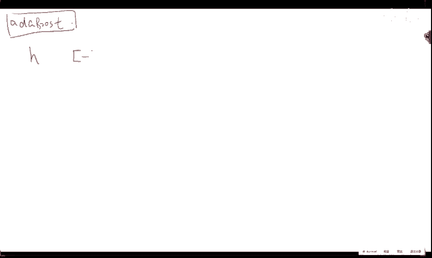

二分类问题没有问题吧。那么二分类问题呢，你会有一个你这个分类器。这个臭皮匠它会有一个准确率，对不对？0。是最牛逼的啊。从来没做对过啊，百分之百分之百啊，这是真正最最牛逼的啊，次次都做对。

什么叫弱分类器呢？弱分类器就是说它比50%能稍微好那么一点点，大概在这儿。这个是我们的嗯一个叫所谓的弱分类器的一个定义。阿拉布斯要干的事情是我们怎么样呢有很多的弱分类器。

我们能给它变成一个非常强的一个强分力。而且些理论上能证明呃。在理想状态下，他能无钱无无无无无无穷逼近于百分之百，这是我们要干的事情啊，很疯狂的一个事情。好，那么我们要干的事情。

其实就是我们要有这么一个啊集中学习的这么一个啊集中学习的这个分类器。这个分类器是什么呢？它应该是一个。这些弱分类器。

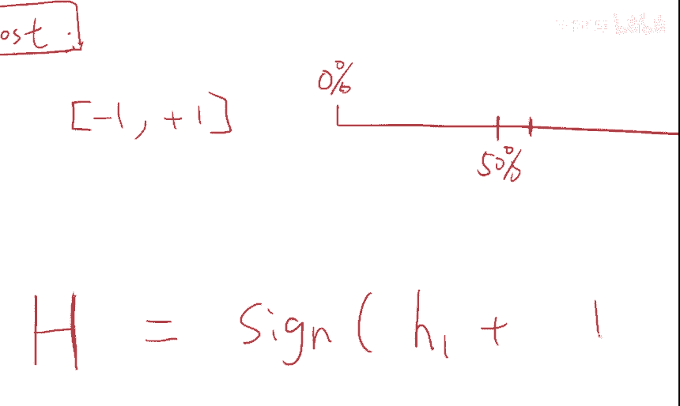

的一个投票啊，等于。然后呢，我们现在要干的事情最好它是应该是一个加权的一个投票，对不对？投完之后呢，我希望这个H越好，越牛越好。每一个小H希望这个大H越牛越好，每一个小H就是一个独立的一个弱分离器啊。

可以是一个呃线性回归，也可以是一个这个呃SVM，也可以是个神经网络，也可以是个随机分林。没有问题。那么他背后的思想是什么？他背后的这个假设，比如说这个是我们真正的这个啊。

这个所谓的solution space。如果我们的H1在这一块做错了。我们在这是H一在这块做错了。如果我们的H2在这块做错了。如果我们的H3在这一块做做错了。

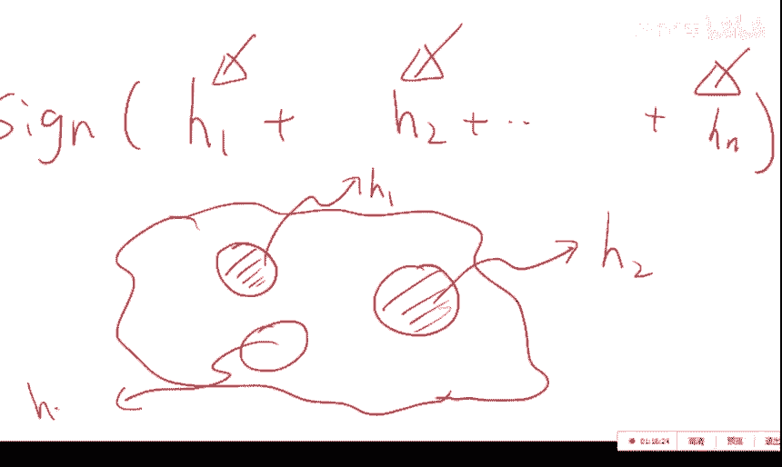

那么我们让这H1H2H3，他们进行一种。投票的话，这个H就能百分之百做对了。对不对？

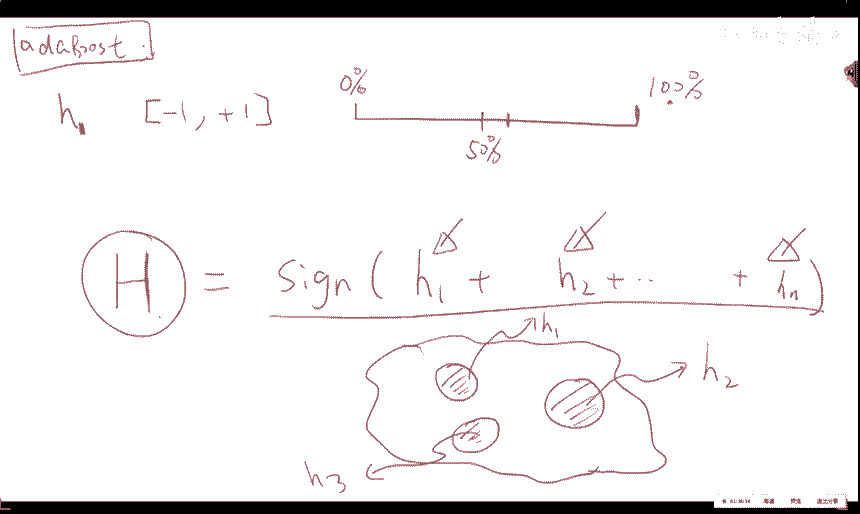

就比如说啊。你同桌啊这选选择题第一题做错了，你做前面的那个人选择题，第二题做错了，你做后面那个人选择题第三题做错了。但是你要抄这三个人作业的时候，你让这三个人作业每一题进行一个投票的话啊。

这嗯这个H1做错的这个地方就会被H2跟H3，他们做对这个就被投下去了。这样的话呢，就会让你你你你抄作业的这个人呢每道题都做的比每个人做的都好。这个是我们的一个理想状态。

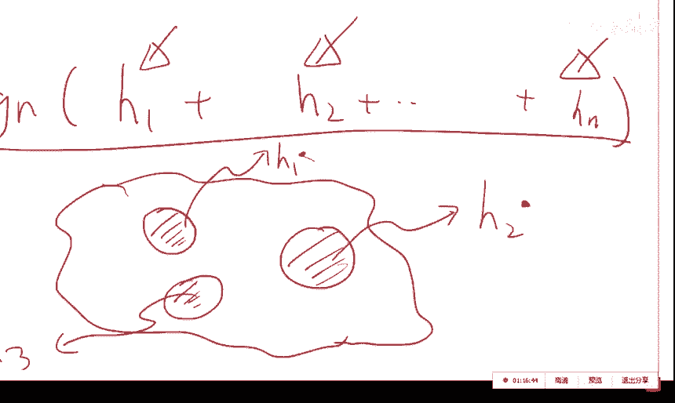

但是现实是什么呢？现实是很有可能很多情况下是H一在这儿做错了。

H2在这块做做错了。H3在这块做错了。就是说比如说有某一题是一个很难的一个题，这三个人都不会啊。这三个都不会你抄作业的，你抄完之后，你你用这种投票的方式呢。也有问题，对不对？那么我们现在这个。

想干的事情就说我们怎么样解决在这种情况下对这个数据进行一些处理。好，那我么我们要干的第一件事就是什么呢？第一件事是这样，我们的。

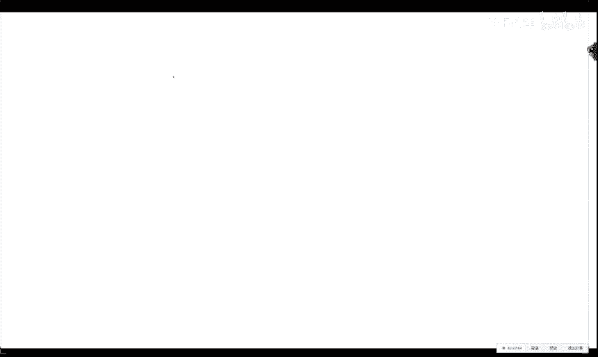

第一个关键的假设是对。样本加权不是对分类器了啊，对样本加权。对样本加权是什么意思呢？比如说我们以前的这个lo函数是不是等于N分之1的。

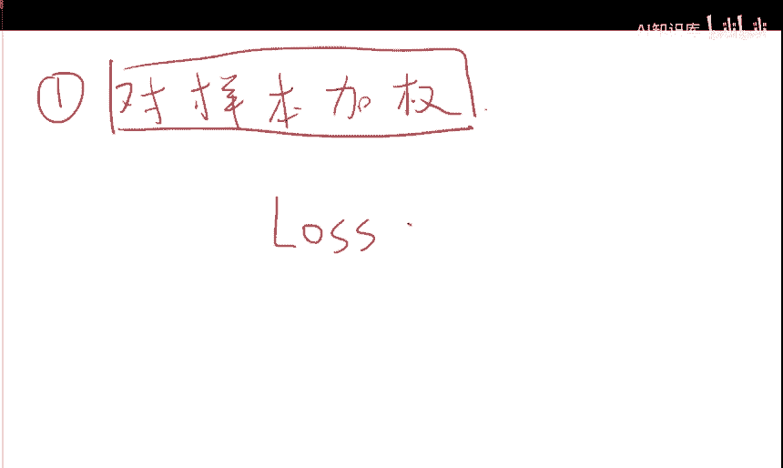

你的Y的这个预测值减去Y的这个真实值的平方。我们要干的事情就是说我们要minize这个lo。而这个lo呢，它是Y的这个预测值是你这个模型西塔的一个函数，那么就是minise。

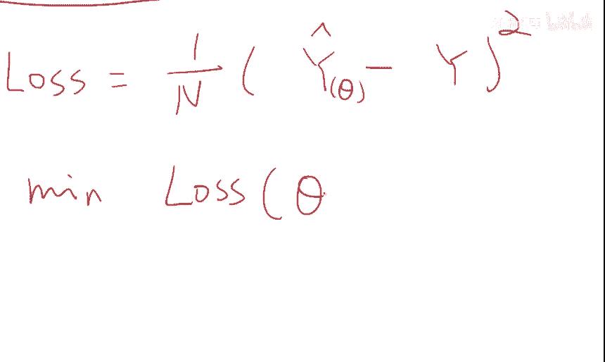

这个los它是对。嗯，这个西塔的一个函数。而在这个log函数里头，我们的每一个样本，它的这个权重是一样的。那么我们要干的事情，如果它的这个权重不一样的话，那么比如说有些样本的权重比较大。

有些样本的权重比较小，如果要求某些样本很重要，你不能分错了。你比如说你某一个样本，第I个样本，它极端重要，它这个VIP你要分错了，我让我会让你的los变得特别大。那么我们怎么实现这个事儿呢？

我们就对样本加一个权重。😡，真实真实减预测的平方等于预测减真实的平方。好，那么就是说我们要对样本加一个权重，我们要求某些样本，请你给我权重变大。如果他做错了，我要惩罚惩罚的更多。

那么我们当有了对样本的这个权重之后，我们再学习一去训再训练一个呃分类器的时候啊，这个分类器就会对某一些样本格外的小心。那么就会对某一些题啊，他就会格外的就会让他往对那边走一走。这个是第一个核心假设。

那么写出来它的这个流程是什么呢？那么就是说我们要干的事情是这样，就是说我们原有的这个数据。我们要就是说这个阿拉阿拉布斯他要怎么干呢？他是说我对于原来的这个训练集，我先训练出来1个H1。没有问题吧。

然后呢，我在训练出来的这这些H1，我有一些点做对了，有一些点做错了。然后呢，我对这些data。对于H1做错的地方。

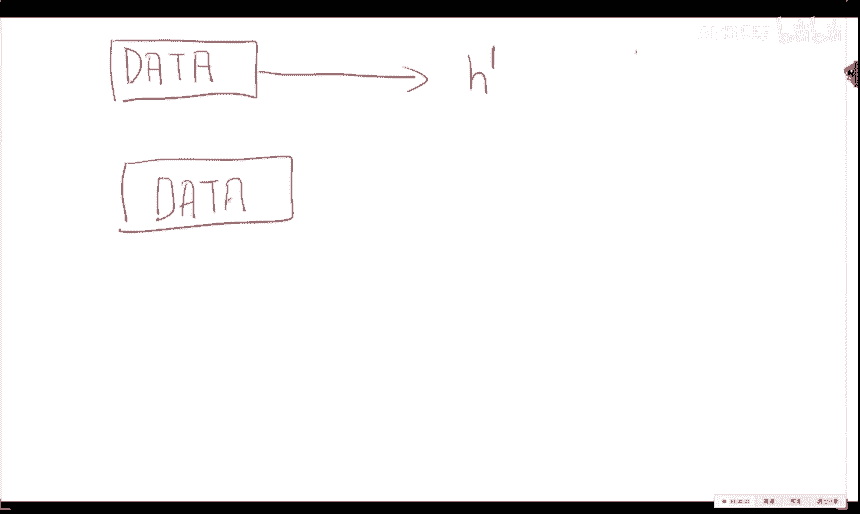

做错的地方。进行一个基。进行一个加权强化。对，做错的这些样本，对做错的这些样本X进行一个加权强化，变了一个带权重的一个新的数据集。我再训练1个H2。没有问题吧。那么我们再在这个原来的这个样本上。

我们再看看H2在哪些题上做错了。我们再把H1跟H2做的不一样的地方，我们再再对这一部分的数据集再做一个加权强化。我们训练出来一个H3。然后我们在唉H呢，我们再对H1H2。😊。

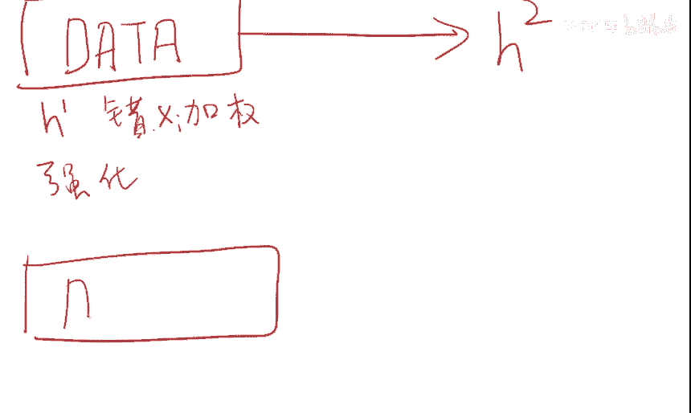

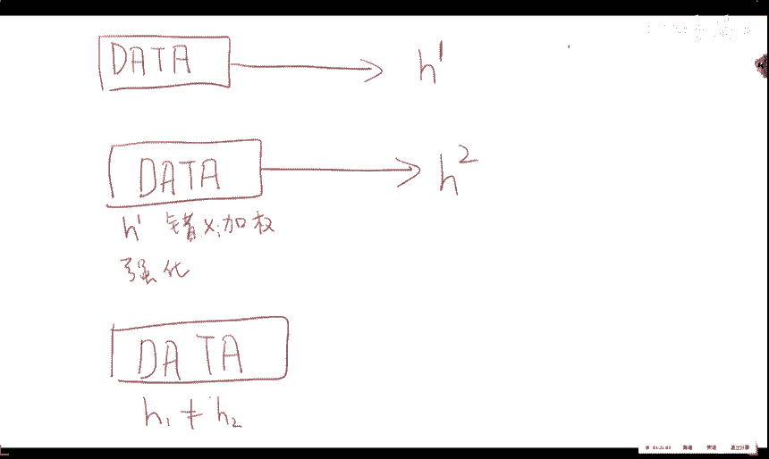

H3，然后我们再做一个加权。那么现在的关键就是我这个权重怎么来？

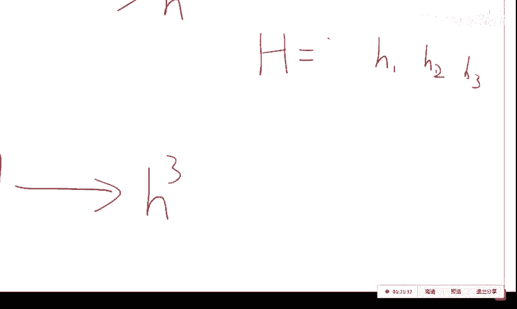

好很好，权重怎么来？就是真正阿拉 boostting啊，它值得一个啊。获得这个歌德尔奖的一个一个方法啊，是费尔嗯，他现在在普林斯顿大学，这个可是机济学习历史上为为数不多的几个大新闻，加怎么怎么加权。

这这个事情我的我马上就会说这是。

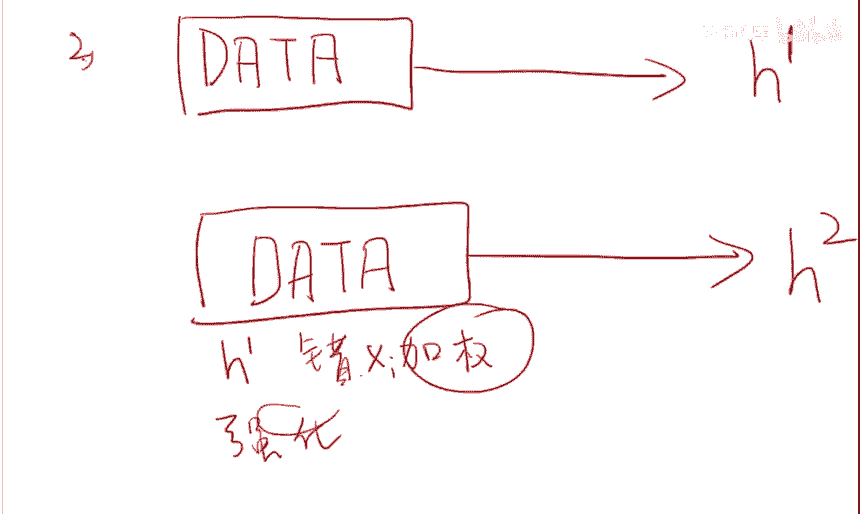

这前面是第一个关键点，那么这块还是第一个关键点，就说我我们是需要加权强化的，怎么加权？马上会说，别着急。那么第二个关关键点是什么呢？第二个关键点是其实我这个H啊，我能够H1H2。H3对他就是。

其实我现在还没说这个阿拉布斯的里头，对这些就是一个是对数据加权，另外一个是对分类器加权。阿拉布斯里头对分类器加权跟刚才那个呃bing的加权方法完全不一样。我待会会说第二个关键的思想呢。

就是说我其实可以递归的这么看。我每一个弱分类器，其实你还可以再分成啊，三个小的弱弱分类器的一个加权，对不对？😊。

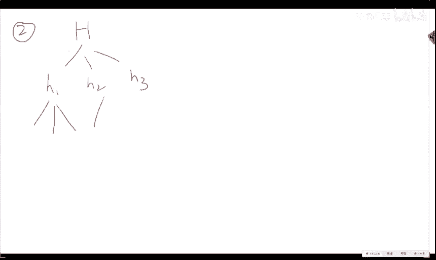

就你能一直迭代的这么。它是一个迭代的一个过程，它能一直往下走。没有问题吧。就是说我们想就是一定发现一个方法之后，立马就可以扩展。可以你其实可以把真正的最后这个方法能看成啊一些方法的加权。

带一些方法的加权，带一些方法的加权，这是阿拉布斯特的第二个核心假设。

没有问题吧啊。没有问题吧。那么第三个核心假设是什么呢？就是说嗯嗯。

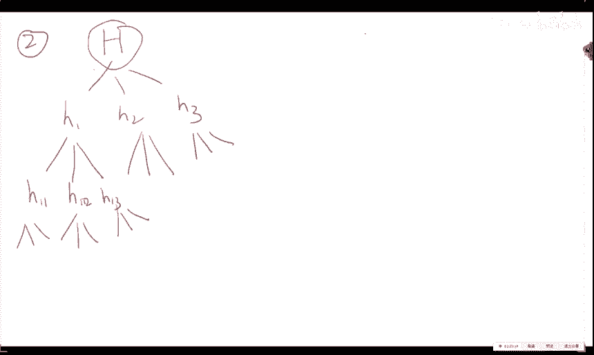

呃，想想啊，就是说第三个核心假设就是说我们的阿巴boos里头，我们的每一个小H，其实我们可以选最简单的叫做这个树桩啊。因为弱分类器里头没有比树桩更弱的分类器，就是说只有一层的决策数啊。

只有一层的这些决策数，它是什么呢？它就是在我这个X这个空间里头只切一刀啊，这边的是正样本，这边的副样本，用很多树桩来做这个事情。那么用很多树桩来做这个事情。

我的以前的这个呃所谓的这个airrate其实它是不是就是等于sation of你做错的这个地方。

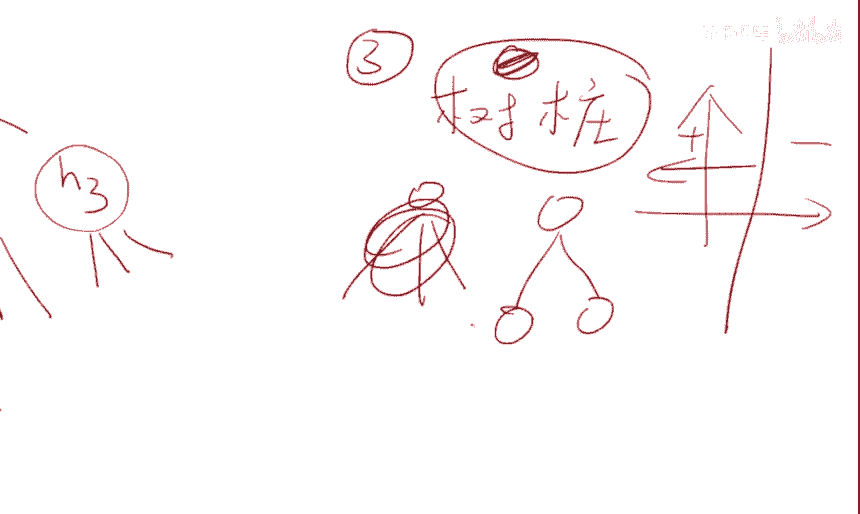

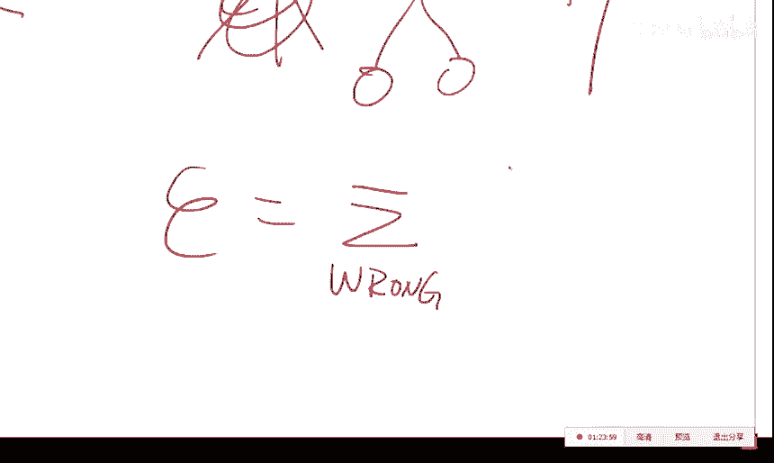

就是你对这些做错的地方，你求一个和，然后你算一下，那么这样其实就属于嗯对每一个样本没有加权，或者说它每一个权重是一样的，对不对？那么嗯好，那么其实我们现在那么就可以真正的来讲我们怎么样的。

比如说我们现在有很多树桩了啊，H1啊有H2啊，有。

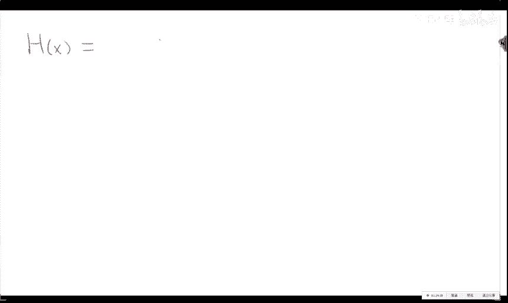

有HN啊，我们想对他做一个。如果是要分类的话，我们。做一个这个啊啊啊啊啊。如果是正一正负一的分类的话，我们对它的一个啊一个集成，其实就是把它们全加起来，看看它大于零还是小于0，对不对？

那么其实现在的关键就是我们一个要判断这个呃对这个呃呃数据加权，另外一个是什么呢？另外一个是对这个就是说对对这个啊分类器加权啊啊。

一知到阿尔法现在的关键就是关键就是怎么样选择W怎么样选择W和怎么样选择阿尔法，这个是我们的关键。

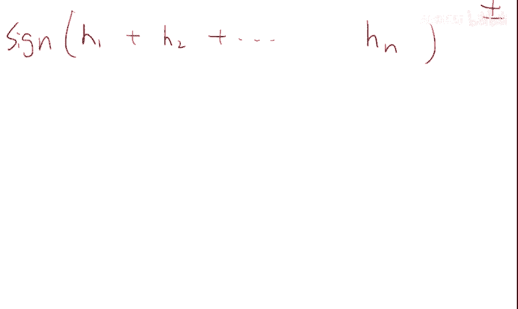

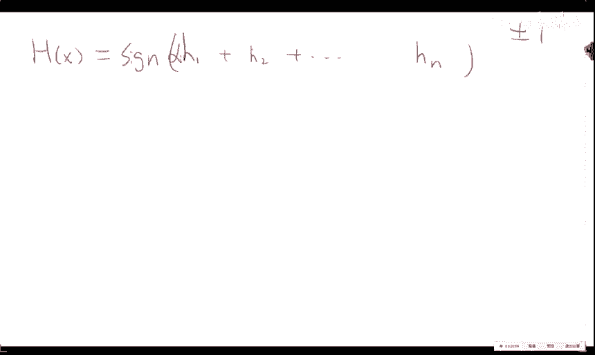

嗯。好，你就先假设你不知道树桩那个事儿，比如说这些树桩都是SVM没有问题。其实我们的关键问题就是怎么样确定W，这个W是对于训练级来呃，对于训练我们来说的，这个 alpha法是对于什么？

对于class菲来说的。

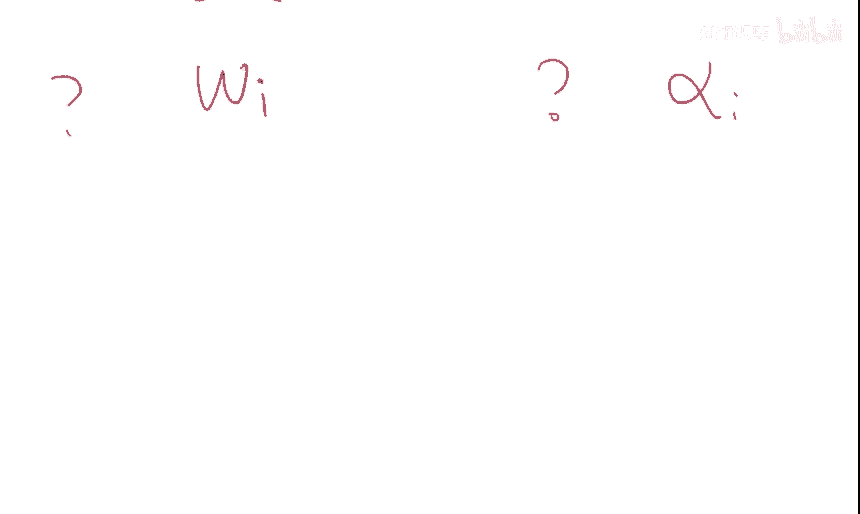

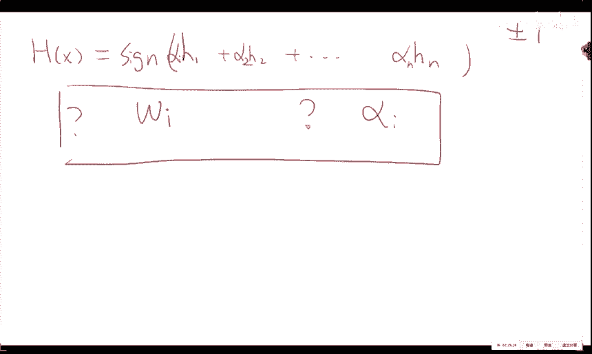

这个这个大家有问题没有？😡，这块大家有问题没有？没有问题好嗯。没有问题的，请举手啊。梳装别着急，先不管梳妆嗯嗯好。好。好好。啊，那么我们的阿拉 boost，假如说假如说比如说现在你知道这个东西。

阿拉bu斯的算法其实就能写出来了，它是什么呢？它是这样。第一步啊第一步我们就让这个WI啊，每一个数据的这个样本啊等于在初先初始化啊，每一个数据的这个样本。权重都一样，没有问题吧。这是第一步。

然后我们基于这个权重一样的这个训练样本，我们是不是能训练一堆的。能训练一堆的分类器。在原在最初的阿拉布里头，他就他就训比如他训练了1000个去决策树桩啊，就是随机的训练了1000个很简单的决策数。

然后呢我们就选我们就选出p。The best。HT。对不对？让他minize。它的air rate在DT轮的时候，这个air rate就是加过权之后的这个eror，就是我刚才说的这个。

air of T其实就等于los。啊，这个lo函数在T在DT轮的这个lolo函数。因为每一轮我们的这个这个权重是要不断更新的，对不对？那么我们有了，然后基于。

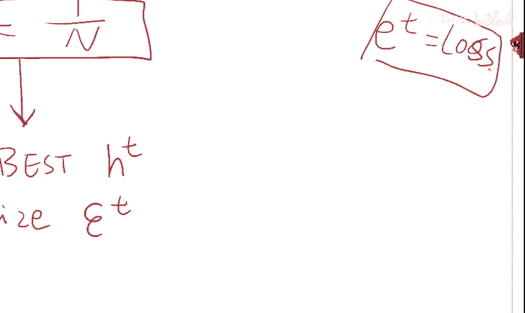

这个东西我们会决定这个。这个弱分类器它的这个权重应该是多少？它们它这个权重应该是阿尔法T啊。没有问题吧。那么如果我基于这个啊我们有了这个这个弱分类器，我们就根据这个弱分类器就能计算出来。

就能计算出来啊啊啊这个啊啊这个应该叫做啊calculate啊。这个W啊WT。下一轮的这个需要更新的这个WT，然后我们。不断的迭代。

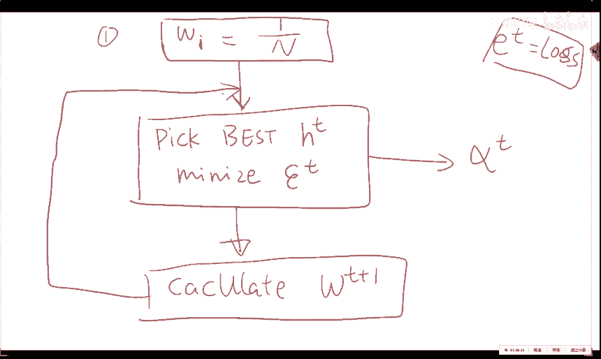

再来一遍哈。😊，这是第二步啊，这是第三步。阿拉布斯的就是这么一个不断迭代的一个过程。咱们再再看一遍哈。我们首先对所有的训练集的这个每一个X，让它的权重都一样。在这个权重都一样的情况下，我们挑选出来。

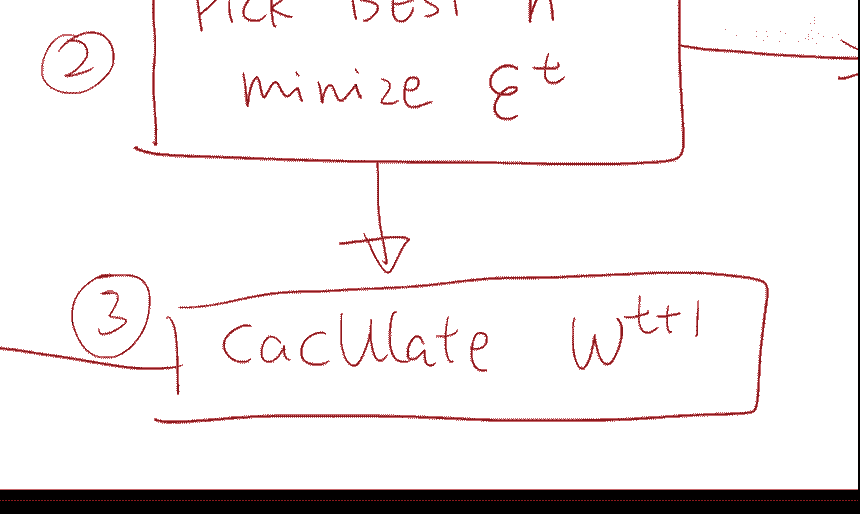

你这个所有的分类器中让这个。错误率最小的那个分类器，并且决定了这个分类器它所对应的权重。待会儿我告诉你怎怎么计算啊，这个是不知道的啊，这个是我还没讲的地方。然后呢，再基于你这个分类器，再计算一下。

我们它哪儿做错了，我们把哪块让它就是相当于强化啊，怎么强化，你现在也不知道。😊，但是它这个路是这样，就是说用一个公式就能计算出来一个新的W这个新的W我再选出一个这个这个弱弱分类器，然后再用这个弱分类器。

再选一个新的W，然后再再强化强化了强化这一系列的H之后呢，我就有一个大H就等于啊这个阿尔法IHI。😊，三微信。加一个3。阿拉布斯其实他的这个红方法就是这样的。

那么现在咱们看怎么样计算这个啊我刚才说的这个两个阿尔法跟这个W啊，好好好。有问题没有？做错了，就是你在就是你不是有了HT吗？你有了HT之后，你让HT预测一下，再跟真实值比较一下，看谁做错了啊。😊。

决定权重，我马上要讲，这不是打了个问号呢啊。😡，做错了，就是我们有X1，它对应了个Y1，我有个X2，对应了个Y2，我有个XN，我对应了个YN。然后我的分类器X1，我预测的是Y呃，我预测的是Y。

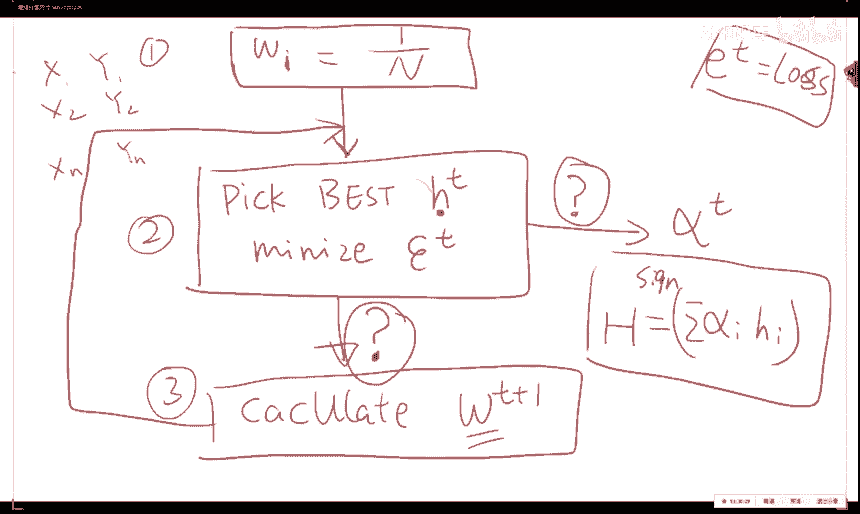

一的hatX2预测的是Y2的hat，我两个比一下啊，你就你就你就知道了嗯。

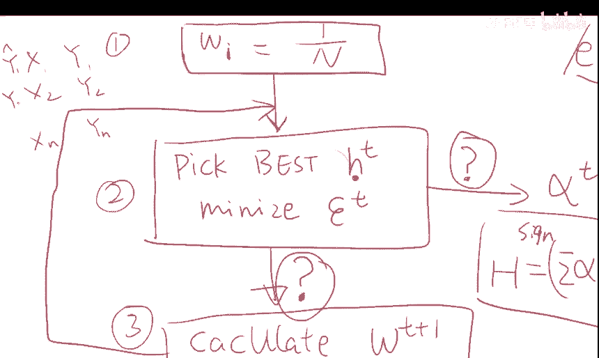

因为我们现在有很多分类器啊，好。然后那么我们现在看这个W。这个W啊这个WI它在T加一时刻啊，就是他我怎么样更新这个这个这个东西。

怎么样更新它呢？他啊他这个东西应该等于什么呢？应该等于2分之1的啊。W爱。T啊T时刻啊，就是上一轮这个W乘以什么呢？乘以E啊，注意啊，不要投大啊，负的啊。这个啊阿尔法啊啊再乘以这个嗯。啊。

这个应该是我这个预测这个H啊X啊再乘以这个正式的Y。

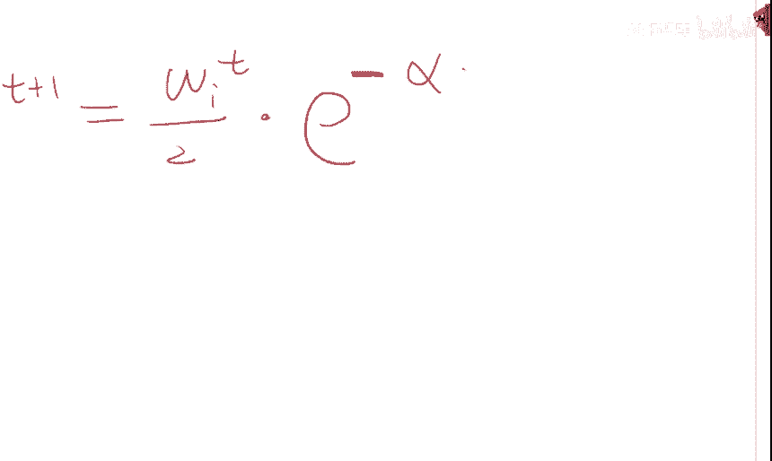

很可怕啊。看上去操怎么E都出来了。这个是啊今天我们的这个奇迹之一啊。应该是啊。如果是这也是T啊。

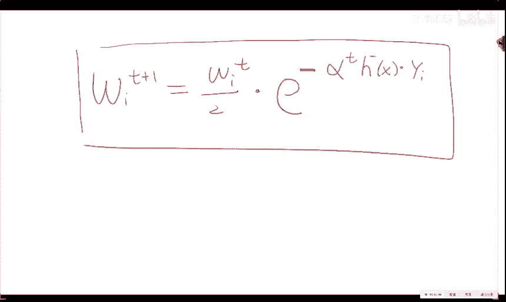

首先这个公式能看懂不？知道这个公式，就是说看阿拉布斯刚开始的时候容易看晕，这个公式知道在哪用不？啊，我操这个纯理论，这纯理论推出来，这个是最牛逼的一个地方嗯。

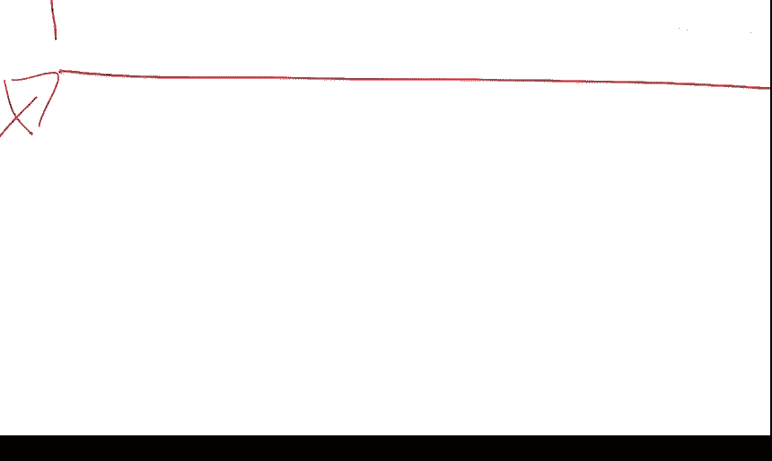

这个不是拍脑袋，这个你改任何一个地方，整个理论就就崩塌了啊。就是说我们这个更新是在这儿更新，我们每一轮的这个WT加一的每一个轮次，这个轮在这儿啊。好，意义是什么呢？意义就是说首先看字面上的意义啊。

我们这不是训练集中有很多样本，X啊一个点，每个点都是一个X哈。比如说X是两维的，X1跟X2，每一个X它会对应一个权重啊。

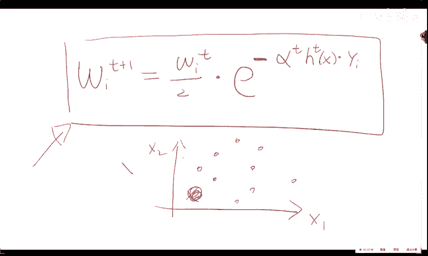

这个权重决定了我们权重会决定我们训练训练模型的这个结果啊。这个权重这个这个W每一次会被更新，这个更新是取决于我的这个首先取决于这个模型的置信度的。嗯，就是因为这个阿尔法，你可以看成它的一个置信度啊。

就是这个模型的牛逼程度啊，这个模型的牛逼程度跟这个这个其实它有个行话叫做marin。但是你不要管啊，这个是什么呢？

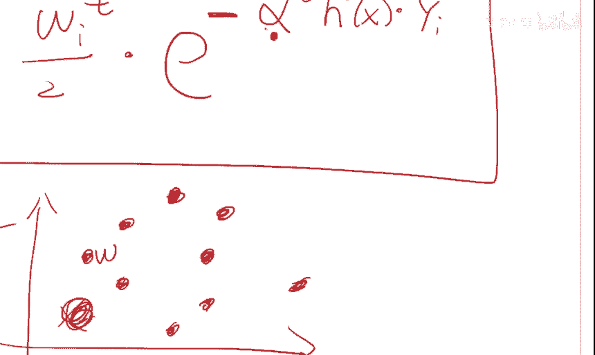

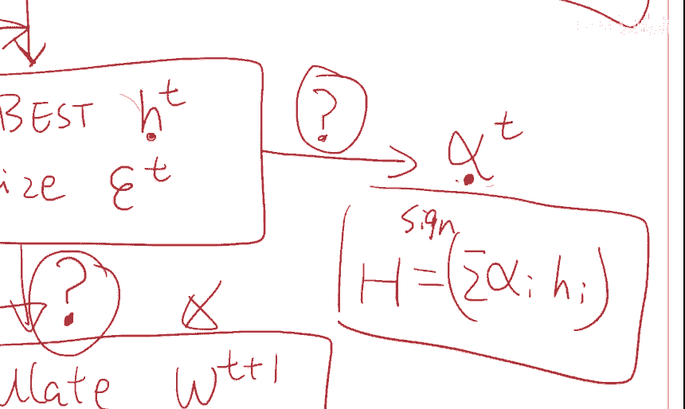

如果它是正的，说明什么？真实值跟预测值两个亿成是正的，说明预测对了。

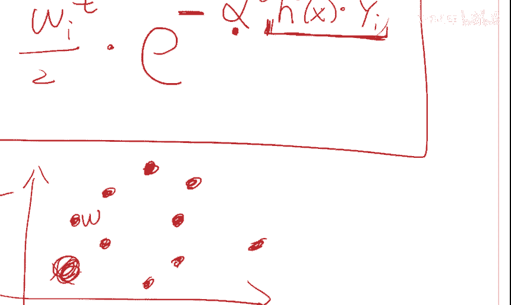

对不对？就是说如果是正正负一的分类问题，如果YI等于正一，我HA它是大于零的。所以而两个正正一乘它是啊正的。那就说明我是预测对了，如果YI是负一，而他预测的是正的一个数，他们一成就是他们的乘积。

如果是正的，就说明在这个点上，我这个分类器预测正确了。如果他的这个乘积是负的，就说明在这个点上，我的预测跟真实值是不一样啊，那么呃这个是怎么来的呢？这个背后其实是有一个理论解释的。

就说如当我们把这个lo函数定义为刚才的那个呃加过权的这个权值之后啊，我我我们是能硬推出来这个结果的，具体的推我就不推了。但是呢这个并不是大家想的这么吹view的一件事情。因为当时这个发明人。

他说他为了想这个公式差不多想了一年啊，就是什么也不干，而且他把这个他把这个。公式叫做婚姻拯救公式。因为他每个周末都在想这个事情，他老老婆差点跟他离啊，后来就想想了一年之后，他终于啊想出来了。然后老。

就就就就就跟老婆就就周末又又又又能过这个夫妻生活了啊。这不是我编的啊，这是真的，你们可以去啊。算了，我就不说谁谁告诉我的。那么就是说啊这个事情呢就是说啊就就就很棒啊，那么他老子也就又又理他了。

而这个事情呢给给机器学习界留下了一个巨大的遗产，就是嗯。

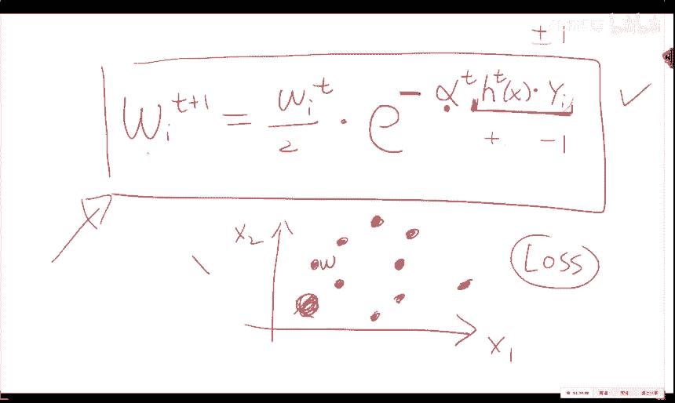

它的这个背后的非常美妙的这个啊理论的这这么一个结结果。那么我们啊就可以证明啊，当我们有这个W之后呢，理论就能证明就能证明什么呢？就能证明我的阿尔法啊，就能证明当我的阿尔法。

那么我的阿尔法如果是2分之1的这个自然对数的一减我的这个啊er rate啊。

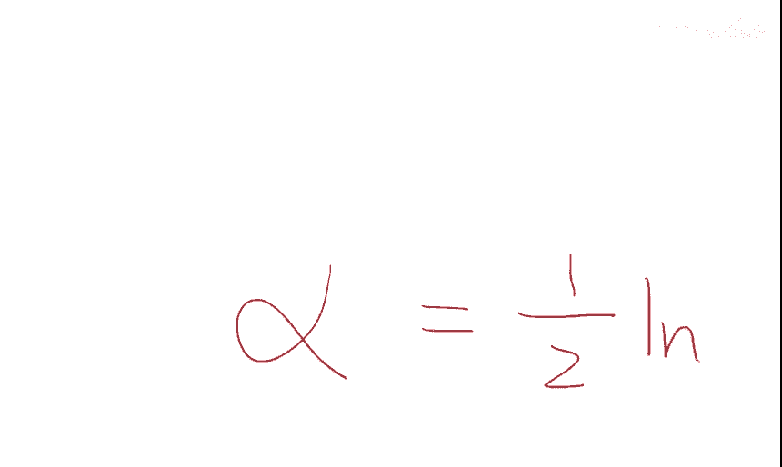

这都是T哈除以这个r rate ofT我尔法的更新公式用这个来。

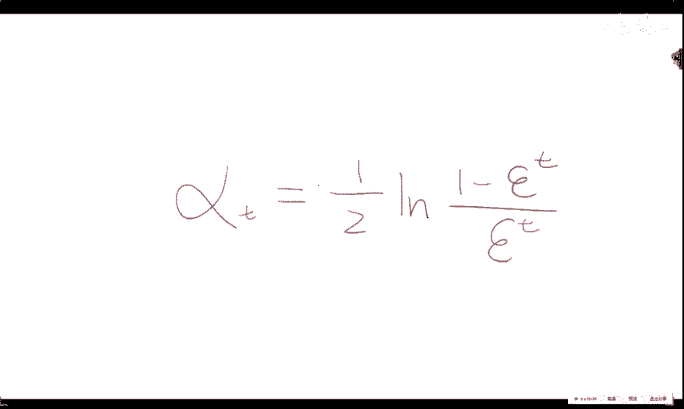

如果阿尔法的更新公式用这个来的话，理论上就能证明我的这个错误的这个er。它是以指数形式衰减为零的。什么意思呢？就是说明。就是说明我们阿拉布斯的这个结果呢，会以指数的形式啊趋近于啊百分之百正确。

有问题没有？有问题没有？呃，这个里头还没有sigma。

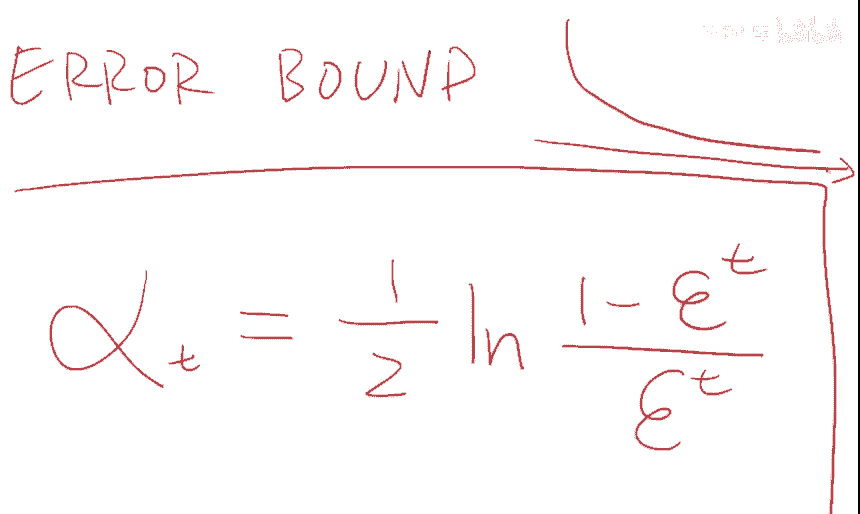

什么是sigma啊，这个阿尔法是吧？你是想问的是这个东西是吧？😊，还是这个东西。啊，EE是你的错误率啊，在这一轮迭代上，你这个弱分类器做错的地方，就相当于你这个lo。有听懂的没有？😡，不会过你河啊。

这个是更牛的一个地方啊。然完了嗯，这个我待会儿会说他他他神奇在哪？先说关于我你看现在你会算每一轮这个LRT会算了吧。

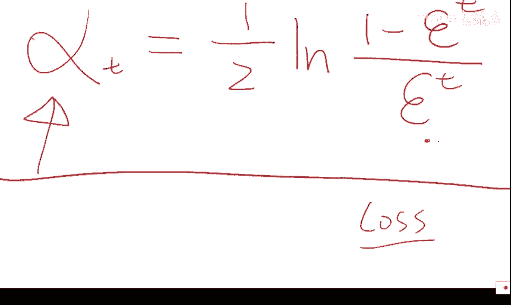

每一轮这个WT会算了吧？再看这个这个流程。WI会算嘛，第一步初初始会算了，然后选一个最好的，让它最小。当你有lever rate之后，你根据这个al rate，你算出这个阿尔法。

然后再根据这个再根据这个阿尔法，你就能算出这个这个W。

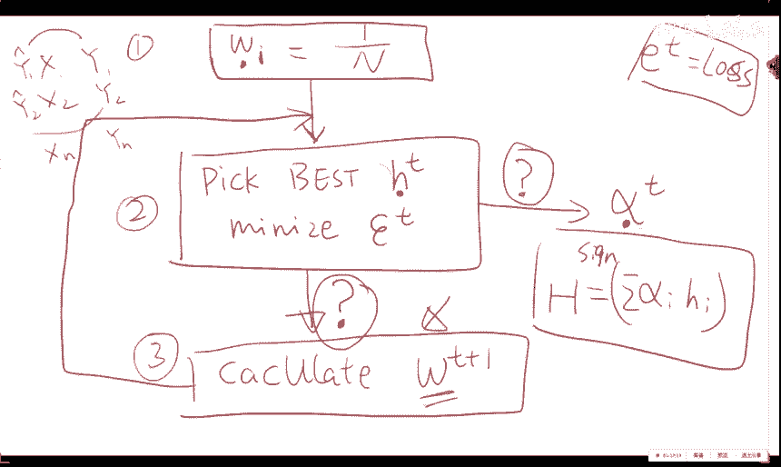

对。😡，大家再再看一遍，看看。比如说你现在要做这个阿拉bos的。每步。都是能实现的嘛，就是你你这数你都知道怎么算了吧。好，再说一个更神奇的一个地方啊。嗯嗯，再说两个更厉害的一个地方。

两个更厉害的地方是这样嗯。我们这个其实我们要算这个你们注意哈。当我们足够仔细，你真正要去实现这个的东西的时候，你你你就会你就会。开始想这个事情啊。啊啊。啊。哦。

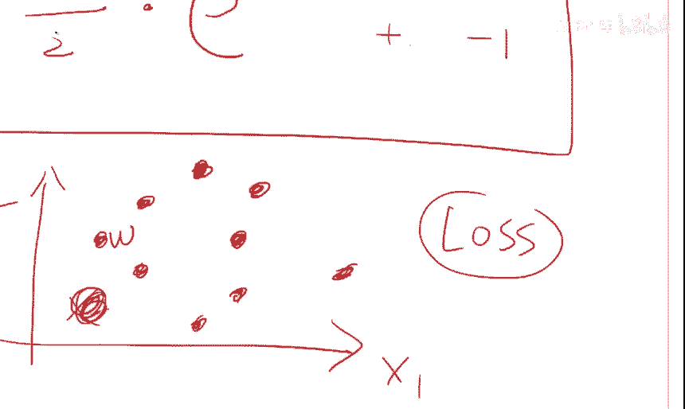

这个不上，这个是Z，抱歉哈，这个Z就Z是一个什么？Z是一个相当于呃一个一个normalization的一个factor啊。😊。

就是让这些W这这些权重加起来能为一啊啊嗯就是说我每一个训练样本这个权重加起来要要为一啊。那么我们仔细看一下，我们能不能减少这个计算量。怎么样优化这个计算哈？我那么我这个W它其实要干的事情是什么呢？

它其实就是说我的呃它其实是等于这个啊W啊啊这个WI啊。哦。它其实是什么呢？它其实是根号下啊，E的T啊除以这个E的啊一减这个。

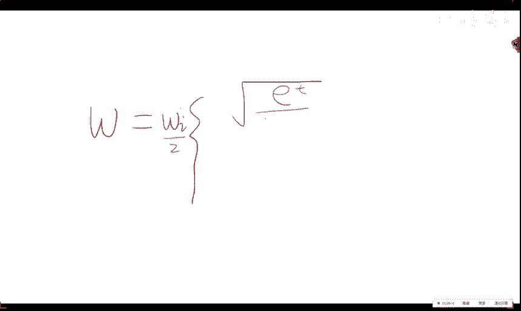

Iate啊。当他做对的时候。如果他做错的时候呢，他就是一。abil除以这个。Absoluteent。就是说呃这个是当他做错的时候，你把这这个W你带回去啊，你就会呃有这么一个结果，没有问题吧。啊。

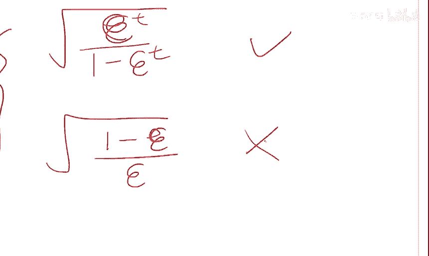

那么我们看看这个Z，就这个Z，它其实等于什么呢？Z它其实应该应该等于这两项之和，对不对？就是说我做对了所有的权重，加上我所有做错的这个权重。那么Z就应该等于啊你把这个提呃提到提到前面来，就是说根号下。

epilonT除以这个一减abilon的T乘以这个呃呃。这个。

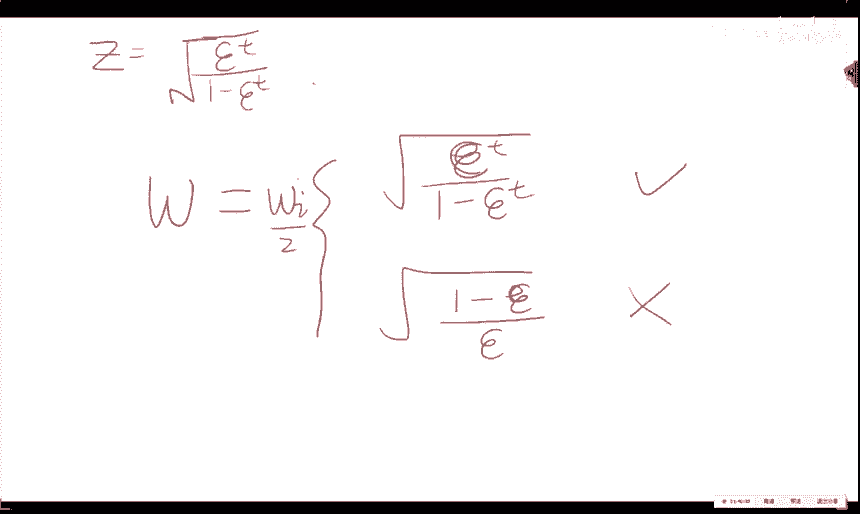

呃，sation啊 of这个。啊， of这个啊。啊，WI啊，嗯么他是做对的。做对的挺好。做 correct。加上这个根号下E减。这个FC7龙除以，你把它带进来sation ofW哎他做错了。没有问题吧。

啊。那么那么大家注意这个东西是什么？😡，这个东西其实就是我们的air rate呀。

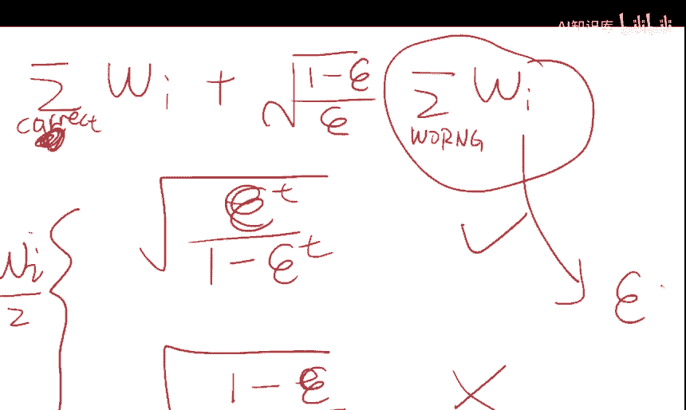

这个东西是什么？这个东西其实就就是我们的一减el rate。😡，啊，Z是这个这个所谓的nmalization啊 factor啊，就是这个我们在公式里呢。这个东西。这个东西。啊。

那么那么这样立马就能我们就能做这个呃做这个简化计算。那么其实这个Z呢。

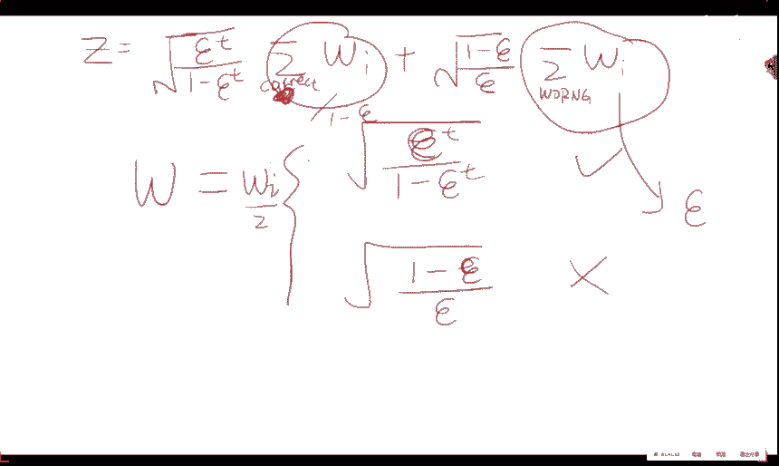

它其实是什么呢？它其实我们在具体编程时候，它其实就是两倍的这个eppsilon乘以意见on。T。因为。你把它展开带进去啊就行。对不对？好。有问题没有？到。那么这样做呢。

就能够让我们的这个整个的计算呢做的非常简单。然后更进一步的呢。

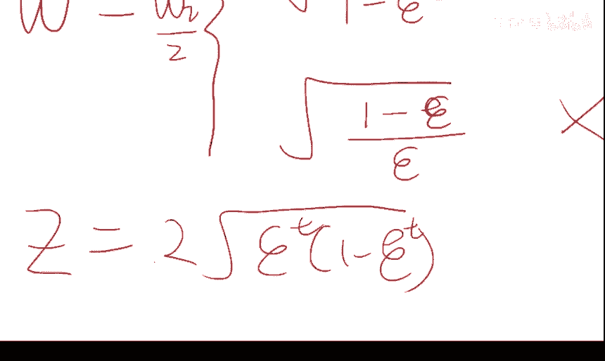

当我们这个。哎，这个T加一，它不是等于这个啊。X。他吗啊那么呃这个是当当这个呃当这个当这个X是呃呃正确的时候，那么呃当X错误的时候呢，它不是。重要啊。已减F7了，这是X错误的时候，对不对？

那么我们如果是嗯把这个嗯。把这个呃把这些全加起来的话呢，就是就就变成了2分之1的这个一减一减FC龙。然后你这个全加起来WT，这是他做correct地方。

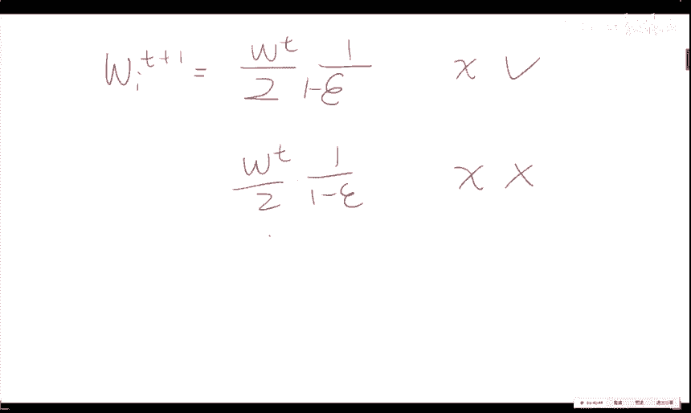

然后呢，那么我们看一下这个东西是什么？这个东西刚才不是说说过了，它应该是一减epilon嘛，它跟它一乘等于了2分之1啊。

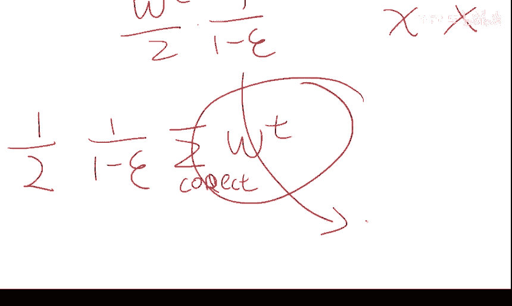

这个是今天的一个啊更神奇的一个地方。

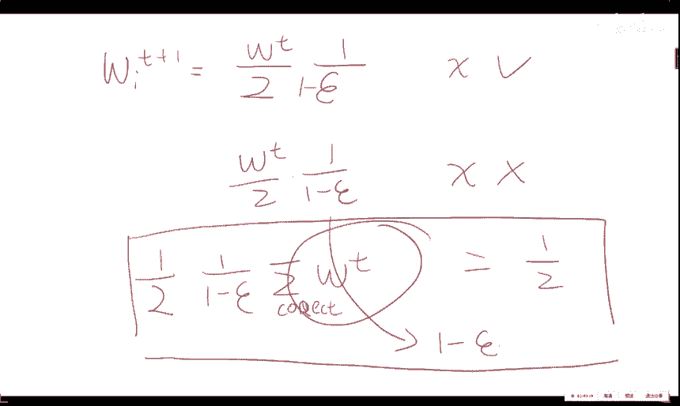

什么意思呢？就是说在每一轮迭代的时候，我的做correct地方。那我们做错的地方呢。也等于2分之1，什么意思呢？什么意思呢？听结论。什么意思呢？我们在每一次更新权重的时候，其实就是让我们对做错对的地方。

这是理论推出来的一个结果。

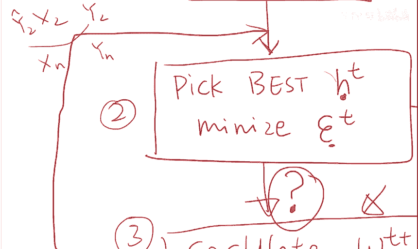

就是说其实我们每一次做更新权重的时候，就是把这些训练集中的这些样本做对的地方给它重新让他们变到2%50%的权重，做错的地方给它扩展到50%的权重。然后对于做做对的这些地方的。

50%的每一个人是均匀的一个权权重。比如说我有我有呃比如说我训练集有100个训练集，这是100个训练集。比如说我有80个X是做对的，有20个X是做错的。下轮迭代的时候，我怎么办呢？我们把这80个X。

他们总共的权重是占50%的。这20个就占了50%。

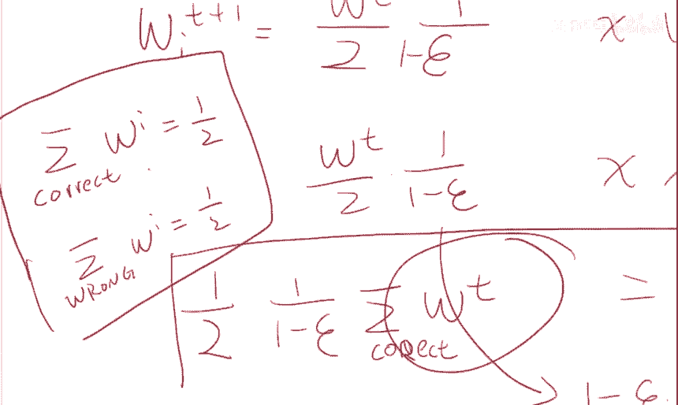

然后这80个总共占50%，每一个占多少呢？每一个占。160分之1就是对于每1个XI做对的XI它占2乘以80分之1。而对于这做错的20个呢，对于这做错的20个，每一个占的是2分之1乘以20分之1。

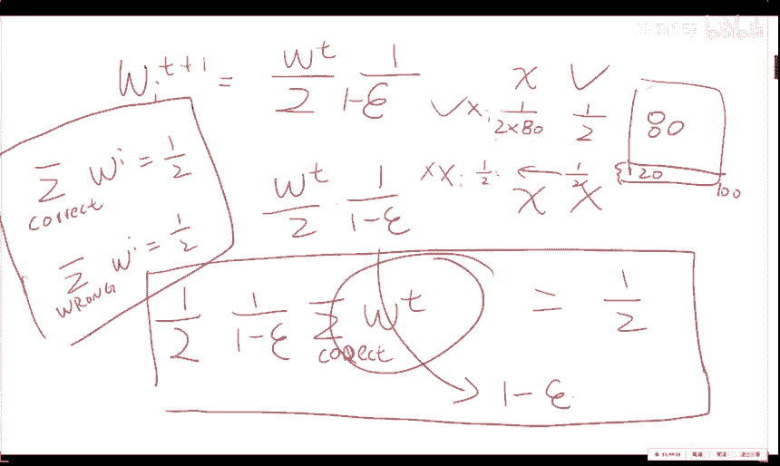

这是真正的阿拉布斯特的权重更新公式。这样就会让你的计算一下就。就就就快的啊啊啊飞起了，有问题没有？这个叫什么呢？这个叫做啊。😡，这个叫做这个这个有个名字啊，这个叫做。

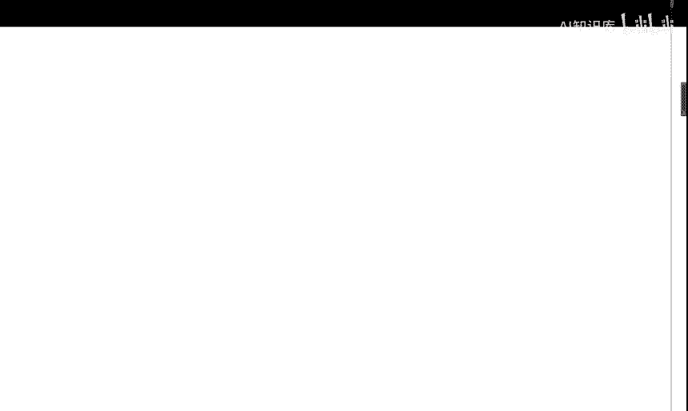

就有三个告的。啊。Yes。Stone。感谢上帝的石头，什么意思呢？就是其实我们在比如说你在攀岩过程中啊。😊，这个悬崖峭壁很陡，你只能往上不能往下。就是说是你只能往前走，不能往后退的一个东西。

在很多情况下，你发现你怎么也上不去了，马上掉下去的时候，你突然发现悬崖峭壁上有这么一个小小特别小的一个石头，你会不顾一切的把脚压到那个石头上，让自己往上走。😡。

那么能够让刚才那么复杂的计算化简到只需要计算这么2分之1个啊跟2分之1个这件事情是让阿拉布斯特享誉全球跟在整个业界有巨牛逼的一个地位的一个关键所在。就是说你这个模型它就能玩起来了啊。

那么这个就是阿拉布斯坦的这个算法的救命时啊。

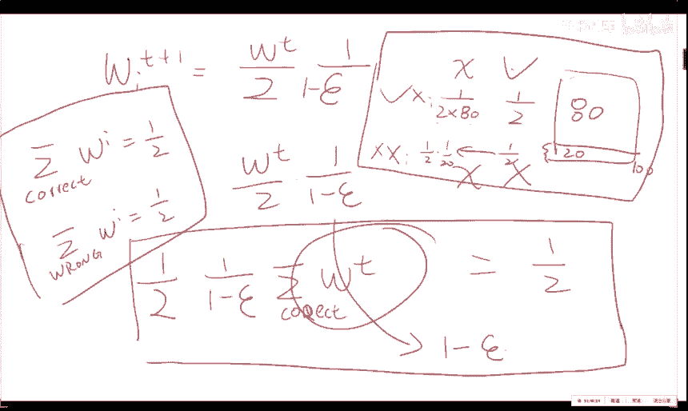

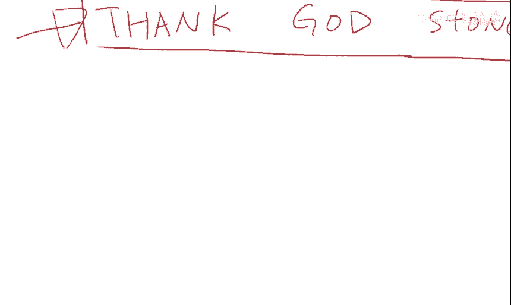

啊，它的关键是这样，它的关键就利用了这么一个小的一个计算的一个trick。计算这个trick是什么呢？就是说我sation ofWT。你把这个看的足够时间长，就是你盯着这个公式。

你这个式子你盯着足足够长，你就会会发现它其实等于一减L rate。你把它带入到之前的所有W跟阿尔法的这个这个这个公公式里头，你就能推出来。啊。

这个全职更全职更新公式里头的这个sation of WTI等于2分之1。好。这个你回去再看一遍，我的推导你就明白了。那么他这个事情现在理论计算机界现在一直还没有解决的一个问题是什么呢？

一个问题是当我们这个迭代的次数多的时候，我们这个测试的 error是指向，就是说它永远不会过你河啊。这个是很神奇的一个地方。就说阿达布嗯，你轮数越来越多的时候啊，它这个错误率会一直往下降。

但是也不能解释，没有一个很好的一个解释，这个是一个还是一个所谓的open problem啊。

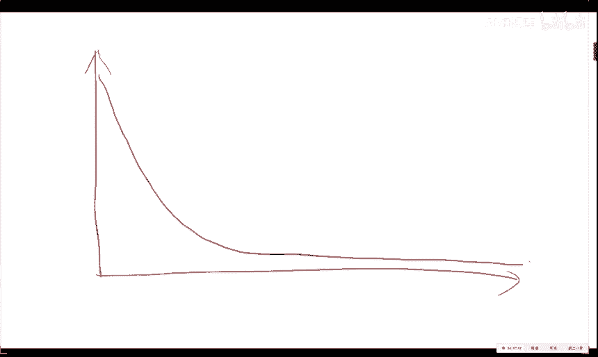

啊，有一些有一些这个部分的解释，但是没有完全的把这个事情啊解释明白啊嗯嗯。这个取决于任务本身。然后再给大家说一个你们的这个。i saving。是啊好消息啊，news啊。你甚至刚才那个2分之1都不用写啊。

SK learn里头有啊。SK learn里头有addaus的这个红方法，你能够定义你的贝斯 e。Eimate。就你能定义你每一轮这些小H是什么。如果你不定义的话。

SK learn会给你实现一个角色树桩。但是我强烈不建议你用角色树桩哈。那么你要就是说你听了这个阿拉布斯这个原理之后，你就你就会明白角色树桩并不是你的唯一选择，它其实是一个红方法。嗯嗯。😊。

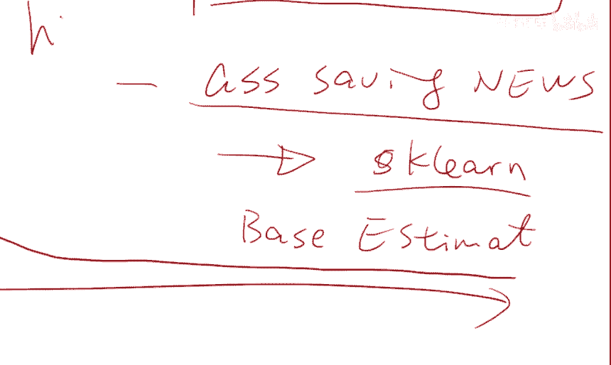

哦。它也不会到顶，它就会基本上就是也很平滑，它也不它也不反弹，反正就有点像随机森林的那种感觉啊。当你随机森林从2000棵树干到1万棵的时候，你的错误率倒也没降啊，就是倒也没有over废啊。

你很少有人听说过，谁把随机森林给干的over废。没有。但是你要说性能提升呢，你2000棵升到1万棵的时候，你性能也提升了不了多少，反正就是这么这么一个相当于渐进渐进的这么一个可以理解为一个渐进收敛嘛。

😊，嗯。好，现在是提问时间。而今天的建议是什么呢？今天建议是大家做这个上周的这个作业的时候，啊，用ting呃或者这个ad boost的方法，把你的这个呃分类器再往上走一下。然后嗯如果没往上走。

大概说明你大概做错了啊啊。简化之后怎么做呢？哦。简化之后，这个阿尔法计算阿尔法还是按照刚才那个公式算啊，根据你这个air rate你算啊。啊。呃，你计算权重呢。计算权重，其实你就每一次更新完之后。

你把你每一个对就是你把所有做正确的这些样本。他的这个权重。总体变为50%，对做错的总体变为50%。然后。就用这个简单的公式进行更新就行。其实你这个。嗯嗯嗯。也有也有点小技巧，但是我就先不说了。嗯。嗯。

相当有代码实力。因为我跟大家说了，SK learn已经把这个函数给你写好了，你只需要你只需要阿拉 boost点fa就行啊。啊，是这样是这样，这是两件事情两件事情，深度学习也可以阿达 boostos的。

啊，就是比如说我训练了一个神经网络了，然后我又我又阿达 boostos一下啊，肯定会再往上走一点。而你看因呃EV之net的很多比赛经常是呃十几个啊这深度卷积神经网络的一个集成啊，肯定会再往上走一点。

招 out不是阿达 boosts的啊，因为你看啊阿达 boost是一个迭迭代的串行的一个方法。而招out呢，它其实是一个并行的一个简单的一个加权平均，它是相当于。招报的是什么呢？招报的是他的这个方法。

是我们刚开始讲的最简单的这个东西。一个 hard voting啊。哇。你们要写的事情就是说你们要实现你们要做做要做作业，在那个数据集上把那个R方值干到0。07以上啊。

而作为这个你要做一个纯数据科学的一个预测任务的时候。在你计算力允许的前提下，能做集成一定要做啊。这个是我今天给大家的一个最重要的一个一个信息和一个啊。啊，一个目的。集成算法和提升算法是同一类东西吧。啊。

我不知道提升算法是什么。是什么意思？今天讲的这个stackking啊voting啊，bling啊嗯阿达布它都叫做都归集中村呃，都归集中学习比呃，都归集成学习管，都是集中学习。嗯。啊。

其实staing跟bl blending这两个词用的很模糊啊。这个就算一种ting啊或者bing啊。这个呃因为在90年代的时候，大家在混叫啊，bing其实是什么？

bling其实是当时他们这个呃一个数据科学比赛叫做netflix的一个。啊，百万美元的一个数据比赛上啊这个这个团队他用了一种啊。我刚才说的这种呃taking的方法，他们把它叫做bending啊。

这这无所谓。这两个词现在呃基本上在业内是在胡用啊，在混用啊。有一些些许的不一样，但是基本思路。都是都是这样，bagging是这样。bagging是我们对这个数据集。

就是我们这个bidding是随意森林干的事情，就是随意森林。你们记不记得我们随意森林训练1000棵树的训练集是哪来的？你1000棵树，你每棵树的训练集最好不一样。

bagging就是我有放回的采样硬干出来这么1000个新的训练集嗯。这是随机森林所运用到的其中集中学习的方法是用了一个bagging，加了一个号的 votingoting，什么意思呢？

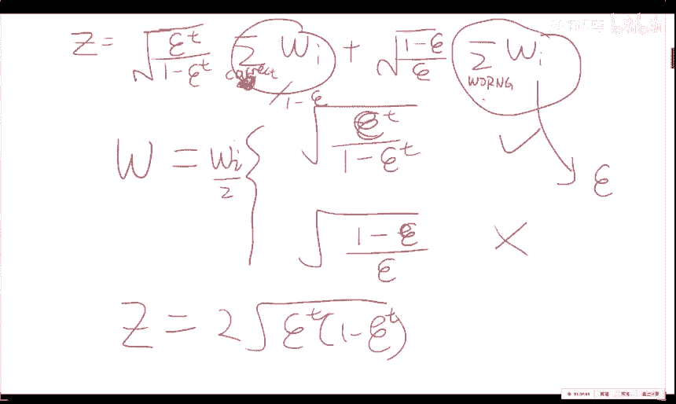

我再说一下啊。就是说我这不是我有一个原始的训练机是X，我有放回的采样，我生成了个X1，有放回的采样生成了个X2。

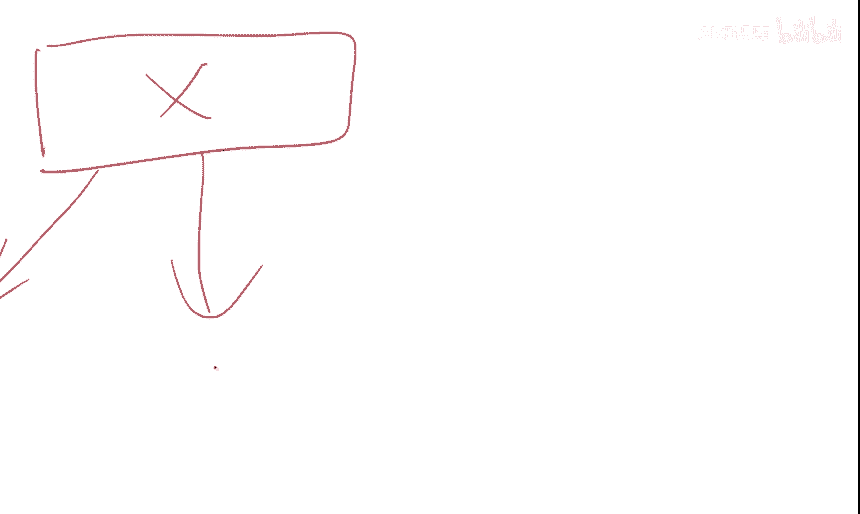

训练一个决色术DC啊。训练一1个DC entryry啊。啊。这些底森菌粹的一个集合叫做随机森林。所以说随机森林它用了第一个呃集中学习的方法是dgging啊，这块是。这款是白gging啊。

所以这你用到的第二个随机的地方是在于我每一个deecion tree，我在长这个数的时候，我只随机的选取啊部分的维度啊进行一个啊切割，而不是对所有的维度做一个暴力的搜索。

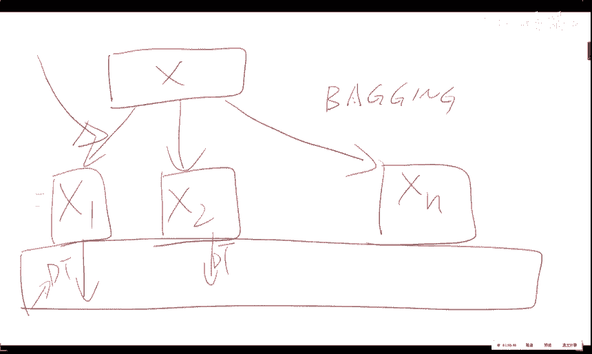

所以森林就这么简单，两两件事情嗯。呃，能推荐就是你们去看SK learn的阿da boost的API它里头有差不多七八个啊非常好的样例啊。去看SK learn里头这个asseemble。

这个页面里头这个阿拉 boost。的这个API和啊user guide。

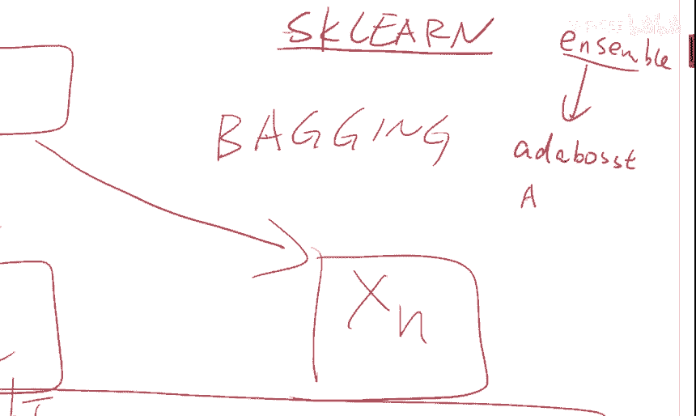

它这个里头会link到一个link到四五个啊。link到四五个这个example。告诉你嗯，阿ad boost的各种的用法啊。嗯。有样力的bugging在SK learn里头也是有的。

如果你在HI里混入了一些分类器，正确率小于50%的分类器。小于5%的分类器。如果是二分类的问题的话。就说明你把这个分类器取个负号，它就大于50%了。这是第一嗯第二的话呢。嗯。我感觉他会学出来这个符号。

比如说嗯对比如说有一个分类器，它永远给你完全错误的这个这个这个这个返回的话，你通过监督学习的方式是能把这个符号学出来的。他就会发现哎这个。这个小伙他永远唱反调，那么我永远给他倒着来，那么就就能学出来了。

啊，这个。是这样嗯，bugging这个词就源于bostr啊，他它的意思就是说我基于bo strap的这种呃agggregation的一种方法，就是基于bo strap的集成的这种方法叫做bagging。

所以再总结一下，我接下来想跟大家说的这个再跟大家总结一下我想说的话。

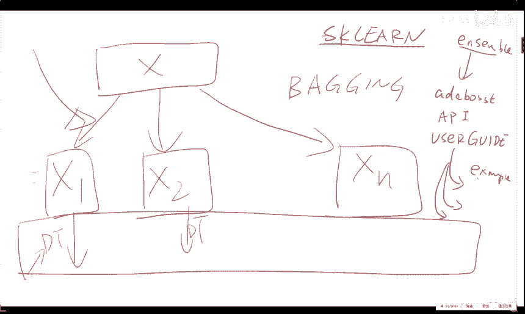

今天想说的话。就是这个啊，抱歉。

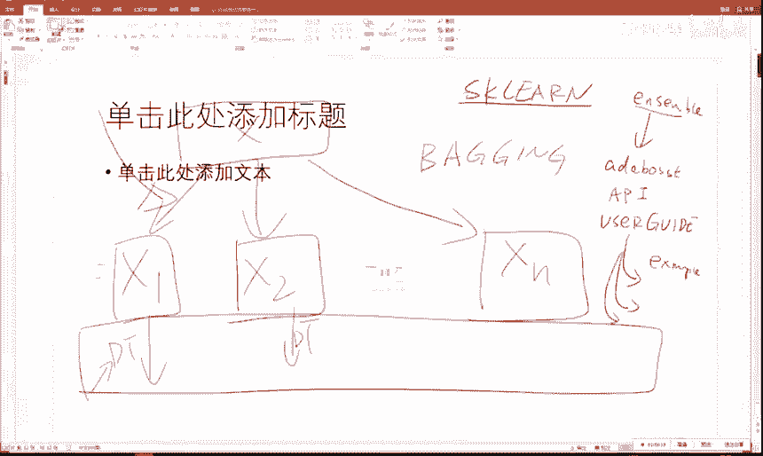

就是说我们在哪？我们其实这门课走到现在，我们回答了这么几个问题啊，以及第一个是数据哪来啊？

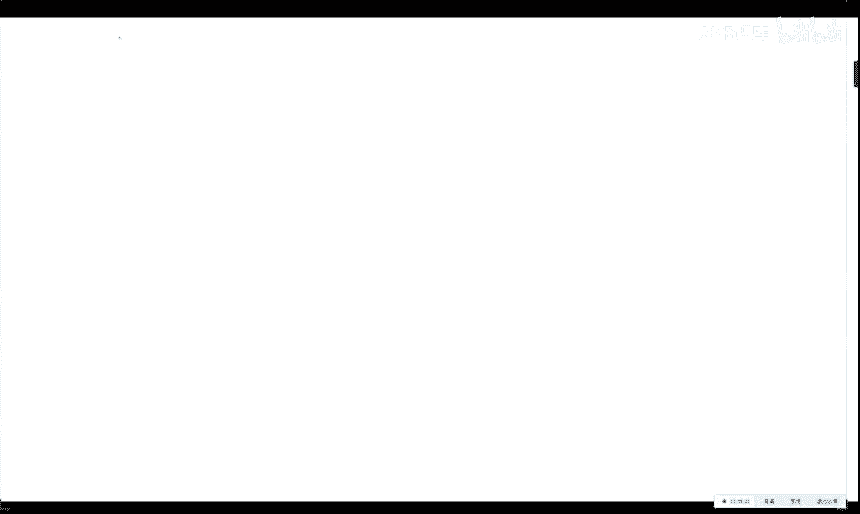

啊，网上获取自己存啊，怎么存啊怎么存。

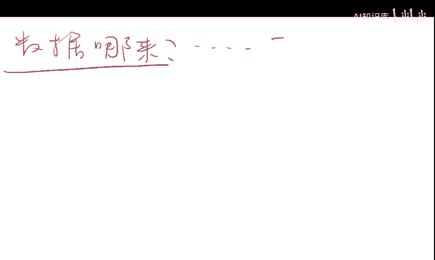

这一步如果你你给呃做失败了，你就直接用这个比如说contop品或者这个优况网的这些东西你自己做啊。第二步是数据怎么表示啊？

怎么重表示啊？表示。这个意思就是说我们怎么样的提取feature。啊，这步很重要啊，今天的指导思想就是说基于我上次。

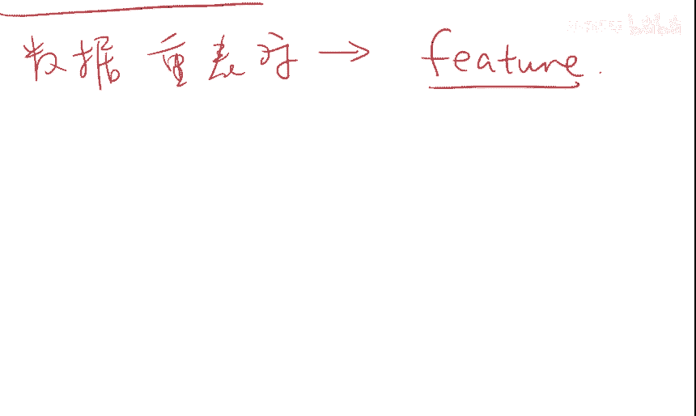

说的这些indicator大家要做一些，比如说这个long term的跟s term的跟一些其他的这这种各种的指标。第三个就是所谓的modeling怎 modeling啊，怎 modelel啊。

那么就有各种各样的啊积极学习的各种的方法，要学会用coursese validation的方法，挑出来一些比较好的。第四个呢是un symbolemble啊。这个之前我们要干的是所有事情都是一个根基啊。

嗯，其实主要是从这儿到这儿吧，这数这个数据的获取其实啊。从这儿到这儿是根基啊，拿到feature跟怎么样的做一个你最后交给你老板一个非常好的一个model，这两个事情很重要，但是这块还跟钱没关系啊。

接下来我们就会说啊，大概接下来我会说三件事。第一件事。你有一个模型了。别人告诉你啊，这个模型嗯。他大概在80%的情况下预测的都是对的。然后我的信心大概是之呃95%。然后你现在有100万啊。

你怎么投这个钱进去啊，比如说你有三个模型啊。你要不要杠杆？你如果要有杠杆，你要放多少啊，这些东西呢其实都属于风控。和真正的这个啊啊对就这个strrategy啊。就是你的这个trategy。

你的这个策略其实取决于两件事情。第一件事情是你对未来的预测能力。第二件事情是你基于你对未来的预测，你怎么样的让你的利益最大化。就这两件事情其实是两个独立的事情。我再说一遍。

第一件事情是你对未来的一个预测。这个事情是数据科学的事情，就是这个事情是数学的问题。你第二件事情是你基于你对未来的一种预测，你怎么样的让这个预测。使得你的利益最大化。这个是纯金融的一个问题。

这是我接下来三节课里头要讲的第一件事儿。第二件事儿是。我会把所有的东西放到一块儿，教给大家怎么样建立起一个这个自动交易的这么一个engG啊。

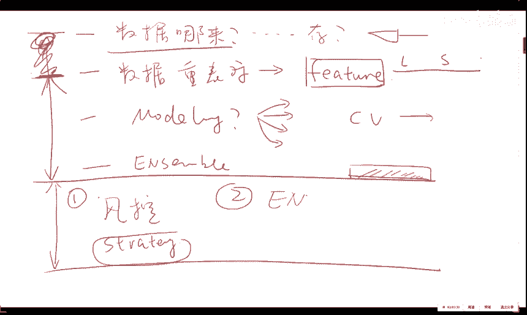

怎么样做一个这个自动交易的整个的系统，用呃这个基于呃呃呃基于事件驱动的这个方法来做一个。所有事情连一块的这么一个引擎啊。第三件事情就是我给大给大家大概分析啊10篇左右的这个真正的这个做量化的这个案例啊。

给大家真正的。

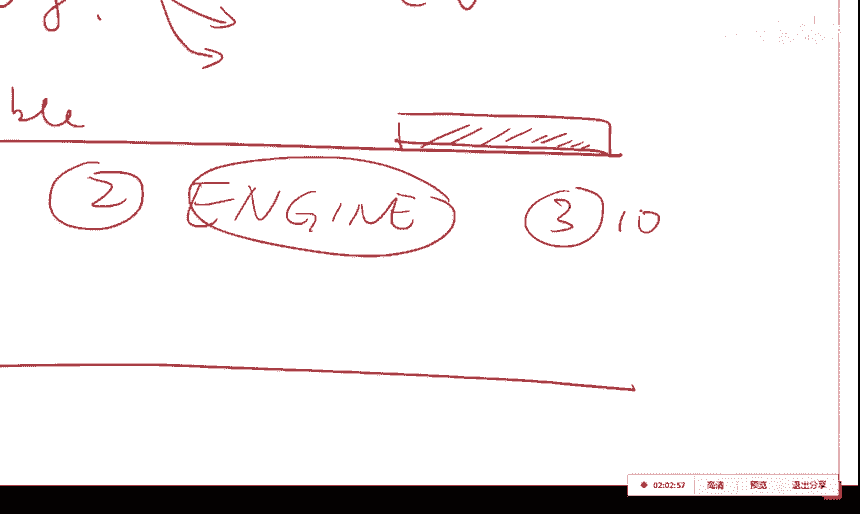

呃，在这一步啊这一步跟这一步里头找各种的灵感。因为在平时做量化真正要做的时候，每天要干的事情其实就是啊看看别人怎么做的。然后找找灵感，看看这个灵感是让我多了一个feature呢，还让我改了一个模型呢。

还是怎怎么的，实际上就基本上你们结课之后啊，数据有了，基本上啊。

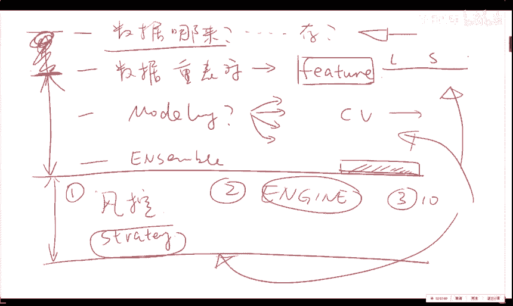

也就不会再再做了，你就天天你就更新啊，维护就行啊。风控这块呢嗯其实也比较固定啊。

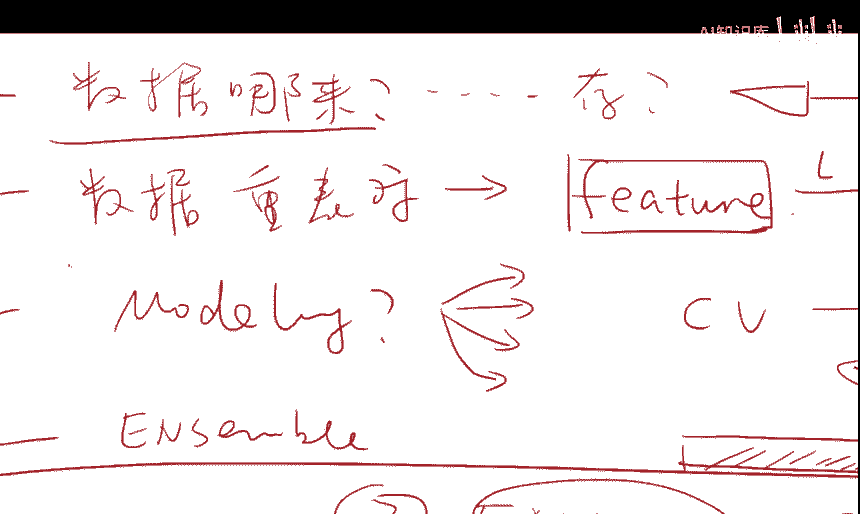

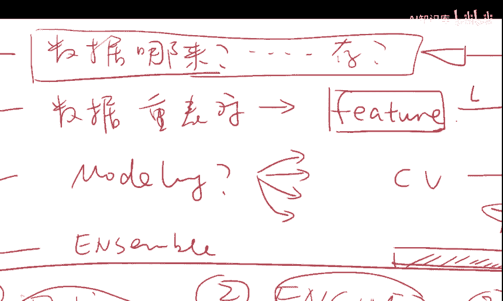

嗯，大差不差的，因为这个东西这个东西它其实是呃已经非常成熟了啊，你只要按部就班的来就行。你以后的这些工作呢，都是你基于有一个引擎了，这引擎不管是你自己的，还是你拿优矿在优矿上做做做实验。

你以后的结课之后的大部分工作都是在。

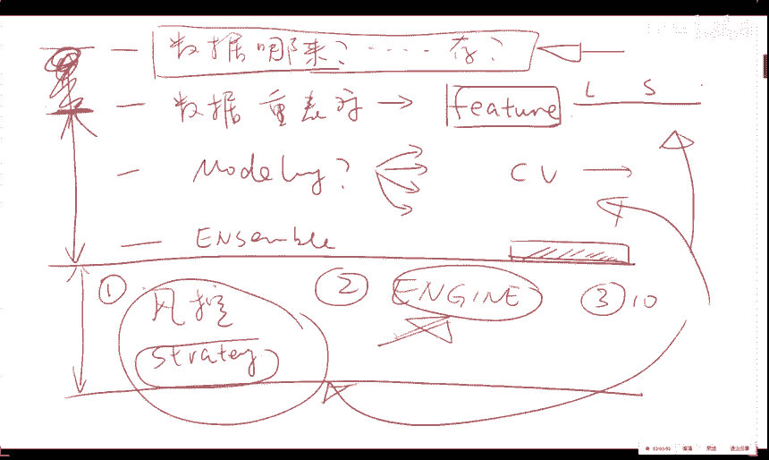

挑选一些新的feature跟开发一些新的模型。而这两件事情会占据呃大家呃今后的呃大部分的这些时间啊。其实我给你的，我上就是刚刚才有同学问数据，我们的这个这个。上一次的这个作业三，我给你这个数据。

就已经非常好了，这个就是我说的那个。那个数据。还有问题没有？最后呃4分钟时间留给大家提问。好呃，怎么怎么挽救，还停留在数据分析的措施。就是说呃OK嗯叫做嗯。就说比比如说呃不会爬数据，这这块黄了啊。

那你们就去用这个通联啊，啊，不是啊，是叫通联吗？或者优况啊，你就用别人给你的数据，有啥做做啥就行。嗯，刚才要说什么来着？嗯。对，那么就是说呃对底线就是大家以后哈。😊，比如说引擎也不会写啊。

这个数据也不会爬，那你就用别人开源那些些一些东西。但是这三件事儿啊，你是必须得会的。如果你的model里实在不行啊，你就把你的assesemble做好啊嗯。

就会让你的mod嗯这个model这个过程能稍微容易一点，这个是吧对。

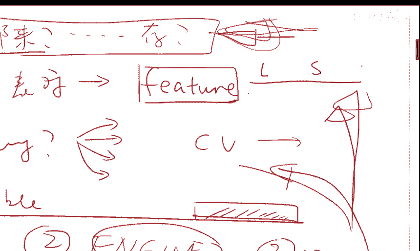

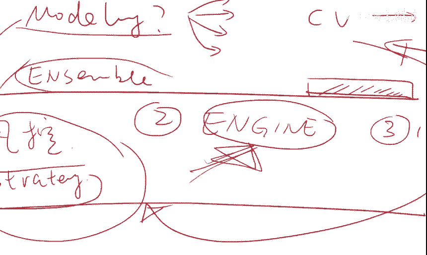

这是我想说的一个事情。啊，关于这个数据质量这个问题啊，你们往前看，这个我在课堂上都说过了。嗯。嗯，这个同学大概是后来进来的，所以问了很多啊，头两节课咱们说的一个一个一个一个事情。啊，调参数没有方向感。

怎么破啊，多调啊啊。呃，就是说没有方向感，我感觉嗯这个问题大概呃大概是在于是不是你还没有调过这个参数，你先扎扎实实的调几遍coursese validation啊啊嗯这个是我能给你的一个建议。

就是啊不是扎扎实实做一遍这个。所谓的这个可点搜索啊。嗯。还有问题吗？呃，那位同学的作业我需要跟那位同学进行呃，商量之后，然后来进行一个判断嗯。格点搜索就是说我们就是就暴力CV。刚才这个同学总结的很对。

有含代码的书，嗯，上次推荐那个ernnest什么陈，他写的是基于m web的。然后我每节课也给了大家很多的代码，我不知道你要什么样的代码。啊，格点搜索太慢呃，唯一的方法就是啊并行化啊。

这个python的变行还是很容易的。啊，给我红包啊嗯。啊，对他那个关于呃遗传算法的书，我会呃呃马上给大家。这节课有很多代码，因为这个新来的同学，你看这个群里头的附件里头，你慢慢找啊。对。

遗传算法的代码也会给大家。好，那如果没有什么问题的话呢，大家记住啊，从下次开始我们就开始啊离开机器学习的世界啊，走向另外一个天地。然后最后呢，在最后一节课上，我们又会回来。

我给大家做一些比较好的一些案例分析，跟大家看看啊，一些别人做的一些结果。啊。天地就是怎么样的当一个小马农啊，来写一个引擎啊。好，那么今天就。呃，今天就到这里，今天是第七次啊，还有第八次、9次、十次。

还有三次课。

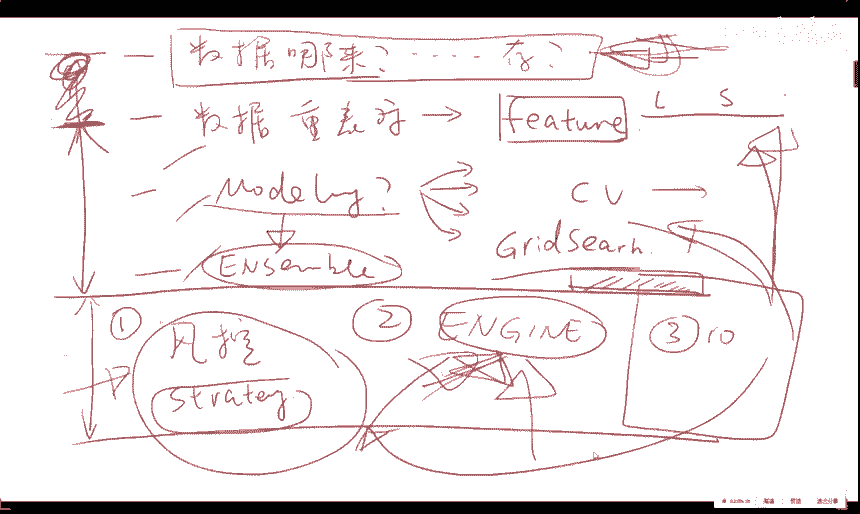

啊。ok呃。