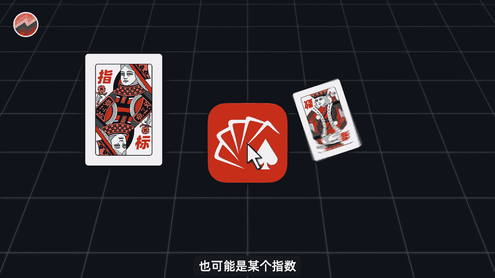
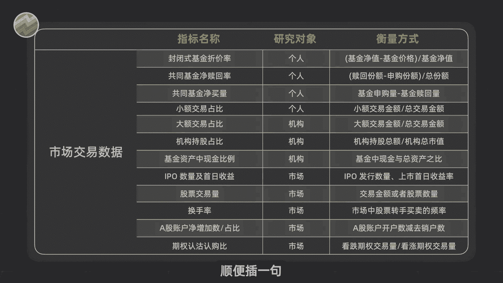
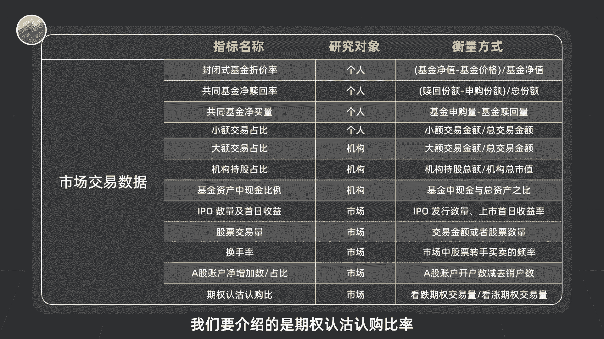
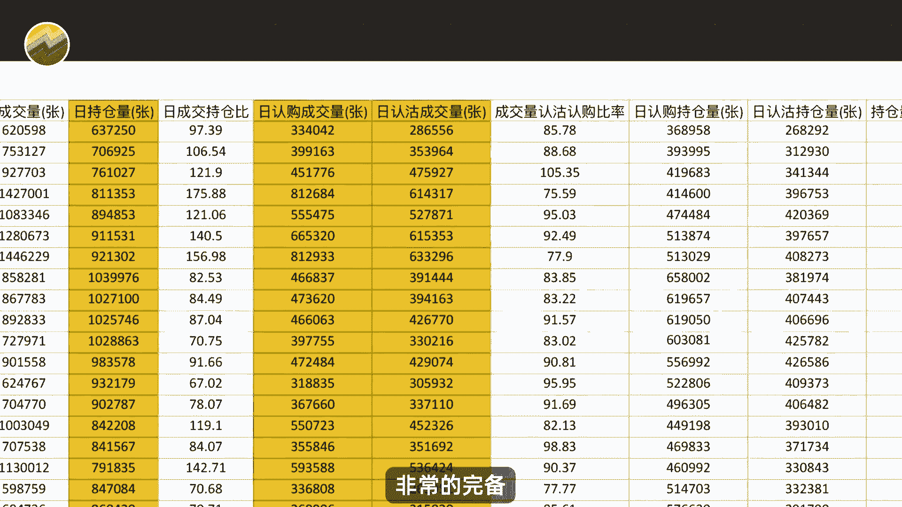
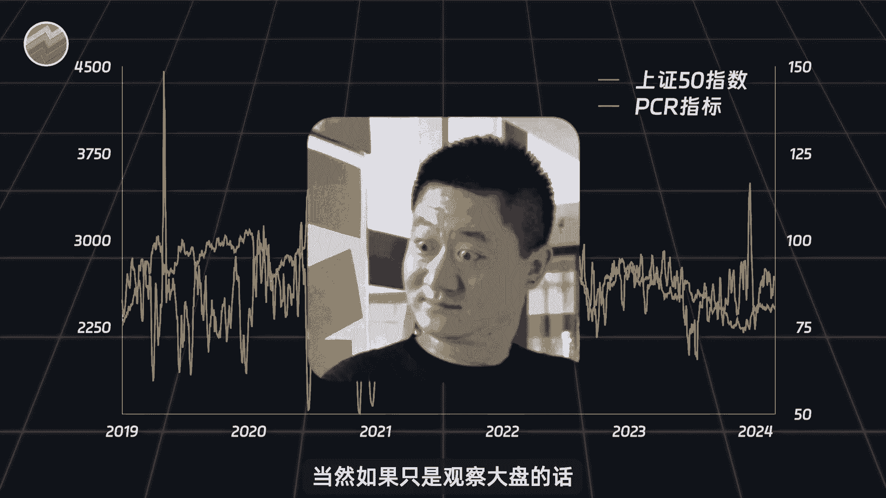
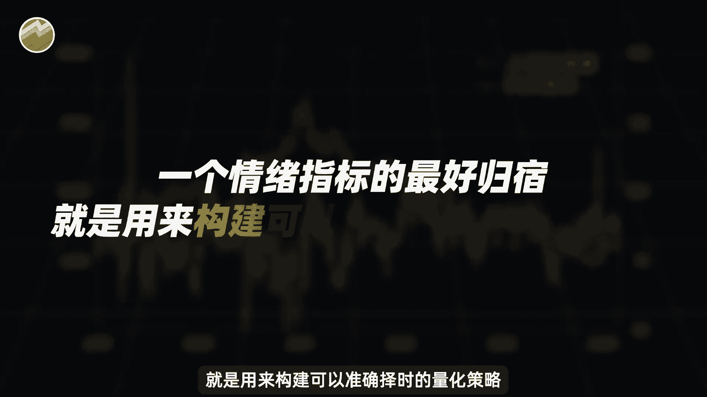

# 逆向交易5年3倍 ｜ Python量化期权成交量【量化交易邢不行啊】 - P1 - 量化交易邢不行啊 - BV1P4421U7jm

大家好。

我是专注于量化投资的，行不行，关注我科学投资，不盲目，有一定交易经验的朋友，应该都有一套自己衡量市场情绪和热度的方法。

这些方法呢可能是某个指标，也可能是某个指数。

甚至是对炒股论坛中帖子的情绪的解读，我这里呢大概列了一些常用的，度量交易情绪的指标，感兴趣的同学可以自己去研究一下，顺便插一句啊。

如果大家想看，如何构建一些衡量投资者情绪的指标呢，那么就请多多三连支持。

后续我们会出一期相关的视频来聊一下，然后呢在这么多的市场情绪指标中，我们要介绍的是期权认沽认购比率。

这个指标又叫做PCR指标，是由期权的认沽成交量除以认认购成交量所得，按照我们自己的经验啊，一般会用最近五个交易日的期权认沽成交量，除以认购成交量来构建这个指标。

从指标看呢，PCR指标越大，看跌的投资者就越多，市场情绪应该越悲观，反之啊，PCR指标越小，投资者情绪就越乐观，但是如果我是我们的老观众。

应该记得我们有很多期视频都告诉了大家，金融学第一定律就是大热必死，那放在PCR指标这里，其实也同样适用，当大家一致看好，甚至在游戏值直播间的弹幕都在聊炒股的时候，可能就是到顶的时候呢。

所以在大家一致悲观的时候去抄底，一是乐观的时候去逃顶，或许反而会有更好的收益呢，当然啊说了这么多，其实也都是经验之谈，我们做量化交易的，还是要借助全部的期权数据和Python代码。

帮我们去计算出历史上所有的PCR指标，看看这个指标和大盘后续的走势有什么关联，相应的数据呢，我们也帮大家准备好了，里面包含了上证501天F上市以来，每天的收盘价，持仓量。

认购和认沽的成交量等等非常的完备，有眼光的同学应该能发现。

这份数据是比较珍贵的，毕竟研究过期权都知道历史数据是很难获取的，大家可以在评论区留言，也都是可以直接发给大家的，之后呢，我们就借助Python代码，帮我们计算出每天的PCR指标，我们运行一下程序。

让他帮我们做图，就可以得到如下结果，图中蓝色曲线就是我们的上证五零指数，橙色曲线则是PCR指标，我们随便挑几个时间点观察就可以发现，当PCR指标很高的时候，基本都是在市场的底部，此时是情绪最低迷的时候。

反而大部分是较好的入场时机，同样的PCR指标很低的时候，就是市场上涨情绪高涨的时候，事后看确实有一些可以逃顶的机会，所以大家平时可以关注一下这个指标，辅助你去判断大盘到底目前处于什么状态，当然了。

如果只是观察大盘的话。

那就太浪费这个指标，一个情绪指标最好的归宿，就是用来构建可以准确择时的量化策略。

我是行不行，关注我。