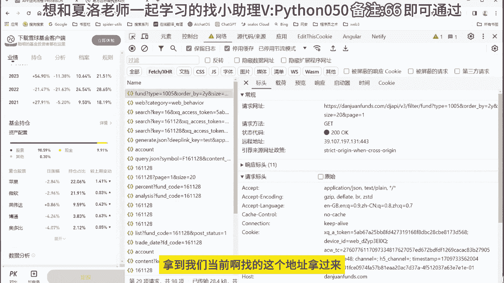
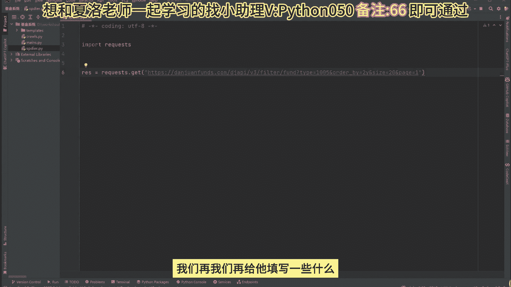
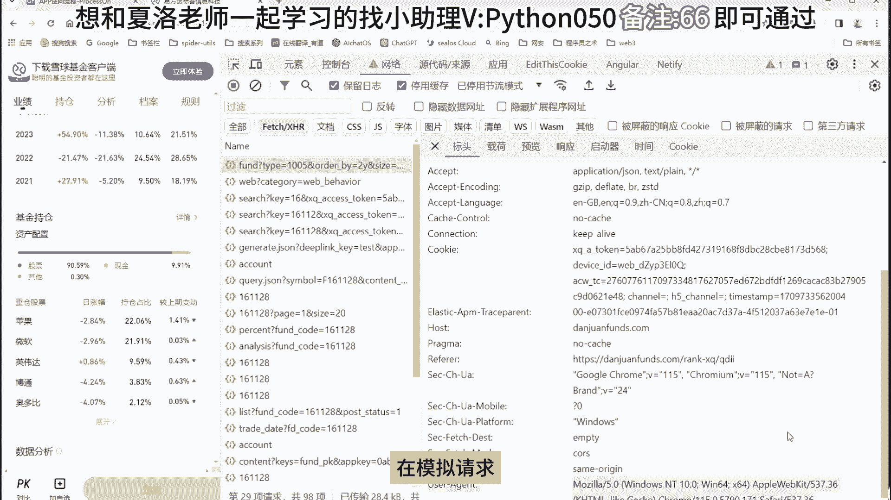
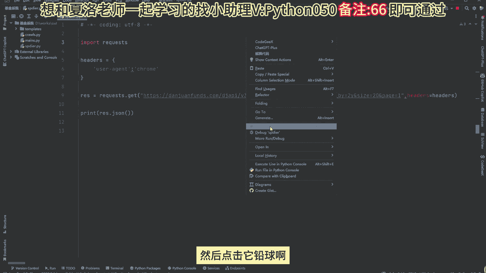
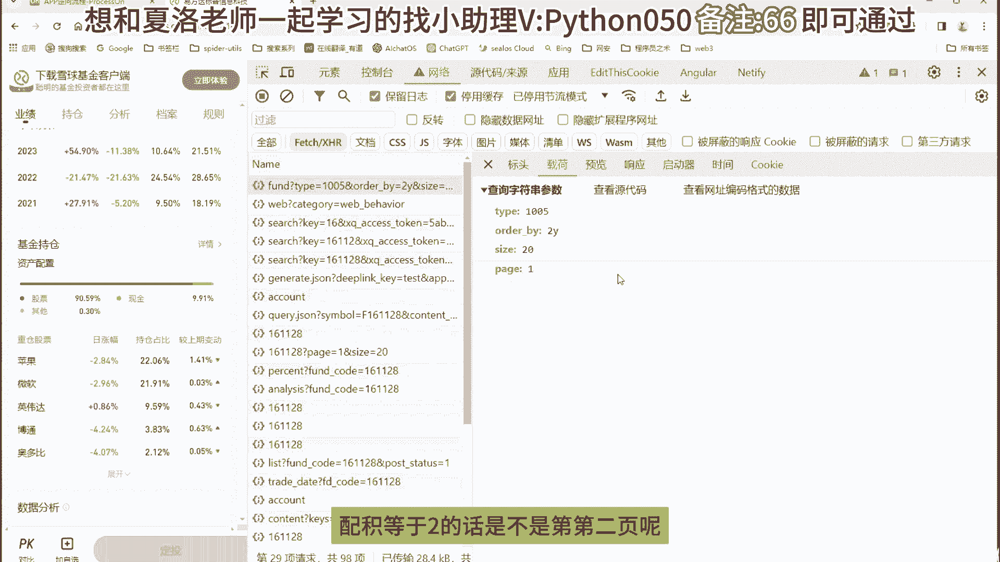
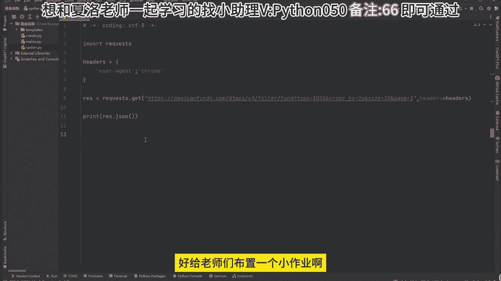
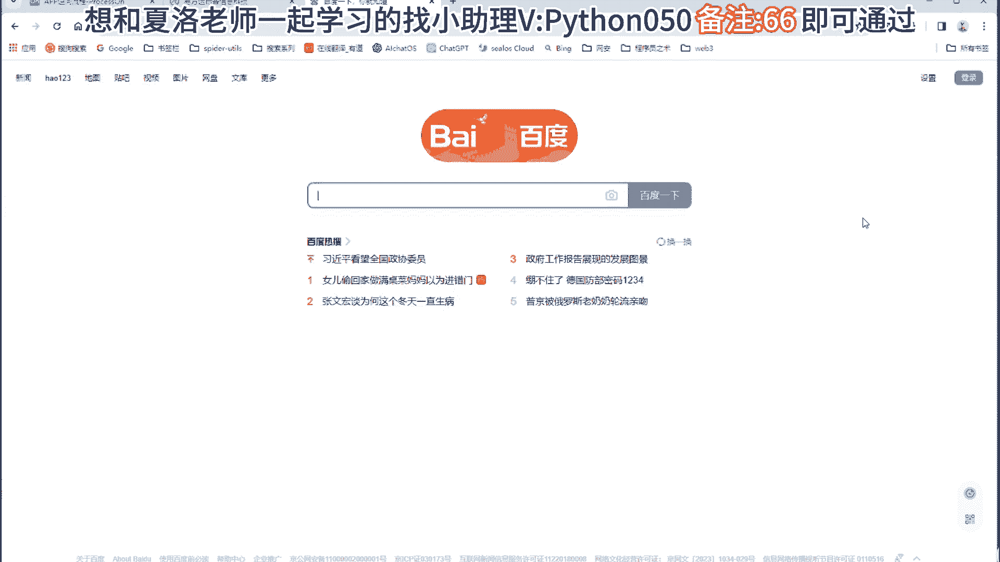
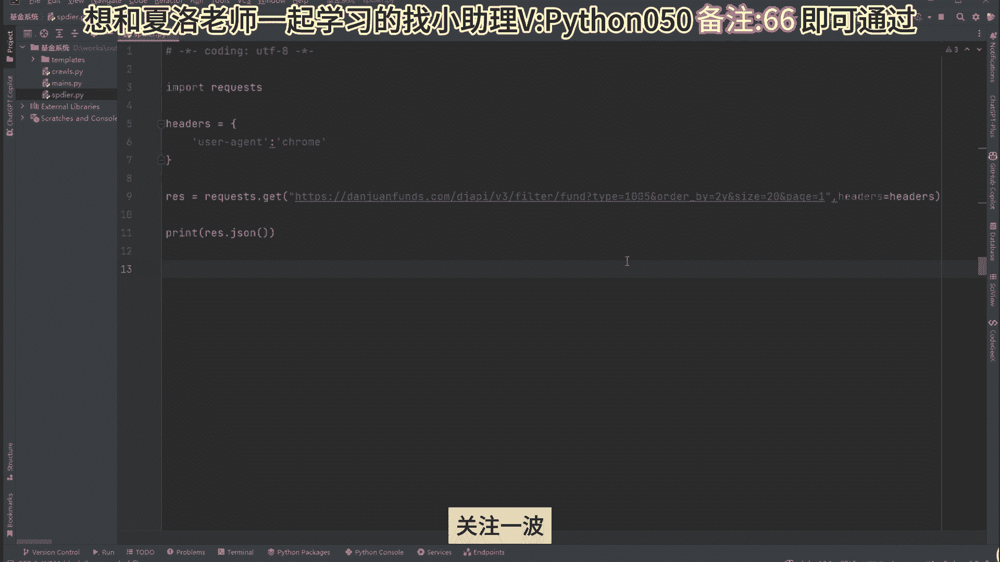

# 逆向分析金融监控系统｜金融分析与量化交易一节课学会Python爬虫 - P1 - 图灵夏洛 - BV1wK42147uy

好同学们在本节课程里面啊，给同学们来讲解怎么设计一个爬虫架构对吧，首先我们在设计爬虫架构之前啊，现在来了解一下咱们的爬虫啊，它到底是干什么的，为什么说啊他这么流行对吧，尤其是啊在大数据行业啊对吧。

在风口浪尖上啊，爬虫它是起到one就是top one的一个层次，就爬虫而言，一个基本的爬虫它包含了三大组件啊，请求解析入库，但是不要小看这三个组件啊，他们里面可大有学问的，就拿咱们请求来说啊，请求啊。

如果说基本的请求你们发个包就可以了，但是对于高级的一些有反爬虫的网站啊，你这个请求啊你都发不过去，你都无法触及对方的服务器，你信吗，唐氏必须的啊，因为涉及到很多的一些安全公司产品对吧。

他们在你爬虫与网站服务器之间，给你竖了一个洞对吧，他这个动能够识别啊，你是机器人啊，还是正常用户，所以呢就单拿一个请求来说啊，这里面的话给你们讲个七八节课都是可行的，OK啊。

然后第二部就是咱们的一个解析啊，解析的话其实也有很学问，第一个就是正常的数据对吧，就是有规律性的数据啊，怎么解释起来可能比较轻松一点，但是对于那些没有规律性的数据啊，那里的解析啊就特别特别有烦恼。

OK啊，所以之前就有人说，一个x pass写的好的一个工程师，他的薪资能够达到8000左右吧，就在公司里面只写x pass好，其次就是咱们的一个入库了，同学们，你们觉得入库难吗。

或者有没有人觉得他很简单的，如果有啊，咱们在公屏扣三个六啊，证明你很牛逼好，那我再给你们科普一下入库，其实他也非常有学问，真的他这里面涉及到很多的技术啊，如果说你们单纯只是一个练习的情况下对吧。

那我们就把就通过爬虫采集，然后把它保存到MYSQLREDISMONGODB就可以了，是不是对吧，然后你再往往中间讲一点啊，你们在保存数据的时候，你是边采集边存储，还是采集到某一定数量。

然后一次写入到数据库里面去了，同学们有没有想过这个问题，我告诉你们，他们对于时效啊，或者对你服务器的性能啊，对你爬虫的一个效率还是有很大的一个区分的，其次你再往上面走一点啊。

那假设你们公司给你安排一个活，那你一天采集50万的数据或者100万的数据，同学们，请告诉我，你该你该怎么存，我告诉你们啊，一台电脑根本存不了怎么办，或者你写单线程单进程对吧，存不下去。

你写多进程你也存不了，因为数据库的话它跟不上你的一个多进程节奏，因为你使用多进程的话，你去写爬虫，那你的数据量是很大，但数据库的话，它接受不了你那么大的一个数数据的冲击，能理解吗对吧。

所以你看目前的话有一种行业很流行啊，叫大数据对吧，他们给你建立一个数据仓库，对不对，然后里边进行一个分布式存储，好吧好，我也不讲很多啊，这里边的话龙叔要咱们要放大的讲的，放大的讲啊。

至少给你们讲个七八十节课，不是那么简单，兄弟们就单从这三个技能啊，里面的学问很多，行，那我们怎么来分析网站和找借口呢，同志们，这里面的话也是很大很大，有学问的对吧，正常一个网站对吧，你们给点点就可以了。

但是对于比较复杂的网站啊，它的接口你都找不到，行，那我们就先从入门开始，给同学们讲解怎么设计一个爬虫架构请求，从入门的时候，我们一般会学习request库对吧，使用它来进行一个请求啊，咱们来看一下。

这里给同学们准备了一些网站啊，叫雪球基金，举个例子，比如说我想采集到当前整张页面的一个信息，那我该怎么写代码呢，同学们第一步先打开F12，然后在这个位置啊，点击你需要的一个包啊进行触发，那你触发完之后。

他会向他的就是服务器发送一个请求，然后呢服务器啊借助它是一个请求之后返给你，返回对应的信息啊，会在这里边进行一个展示，如果说啊，嗯当你还不知道它是动态还是静态的前提下啊，你们可以勾选全部假设啊。

我猜它是动态数据的情况下对吧，那我就勾选插件就可以了，查出来，因为全部的话，那么它会展示啊，右边啊全部的内容能理解吗，就很多你不好分析来点击一下啊，你看啊，什么叫查询呢，就是它是动态加载的啊。

是整个就是整个页面它不刷新啊，进行一个局部啊刷新，就当前的这个数据进行一个刷新啊，简称叫阿贾克斯对吧，查询类型，然后点开点开看一下啊，这里边是不是有对应返回的信息，同学们还挺多吧，看到没什么。

易方达好帮他们的一个基金名称，然后禁止啊都有OK行，这就是我们怎么来去找数据啊，然后，找完之后呢，假设我想进行进行一个搜索类爬虫，我该怎么做呢，很简单啊，也是在这边填写对应的一个ID就可以了啊。

来给同学们看一下啊，比如说我搜索易方达161128，然后往这边拉，然后点击你看啊，你看到我们点完之后，是不是给你发了很多的信息，然后可以来看一下这里这边啊都是啊，都是对他们的一些，基金相关的信息啊。

然后你看包含它的一个涨跌好像都有啊，等一会我们处理完之后，还需要还需要对他的数据来进行一个处理对吧，才能达到啊，好我们需要的这个功能啊，就是这一块功能对吧，包括他的日期啊，还有他今天的一个涨是涨还是跌。

对不对，因为你往上的话就是涨嘛，往下就是跌啊，功能OK行好，那我们先来学习学习一下爬虫啊，好吧，学爬虫的时候，我们先找第一条API地址，就它啊，这里是他返回的信息，OK好往这边看啊。

这里就是我们分析了一些什么接口之类吧，很简单啊，因为对他的网站是不是很难好，也没有给同学们讲解比较难的网站啊，然后怎么来设计普通架构，我们先从请求开始拿到我们当前找的这个地址。

拿过来，拿过来之后，然后呢打开咱们的一个网，从这里新建一个Python文件啊，选择Python，同志们，然后我写一个spider爬虫好，第一步先导一个包叫requests啊。

我们要使用它来进行一个网络请求，好打完之后请求库，然后呢我们再写个RES等于quest点get，把咱们那个地址给他发了一边去就可以了啊，嗯实在不行，我们再给他填写一些什么。

一些头部相关的信息啊，头部的话正常像他这个网站填写，用这个就可以了啊，表示你是一台浏览器啊，在模拟请求。

所以呢我们可以在这里写上啊，好或者你就写写写一个谷歌也可以啊，OK那好带上，拉完之后啊，就是我们在当前这个位置啊，把请求已经发送到对方的一个服务器了，我们只等待对方的服务器给我。

给咱们返回一些信息就可以了，然后可以打印一下，点TAST可以取文本，然后也能够使用点JSON来获取后台返回的一组JASON，可视信息来，然后点击它请求啊。

看一下同志们，你这个时候我们数据是不是就已经给你返回了，相关的一些信息，好一个基本的爬虫，咱们就给它已经完成了啊，那咱们怎么进行一个翻页呢，你看这个位置啊，他是不是有一些参数给大家看一下。

点赞和page等于一啊，表示第一页，对不对，那我们page等于二的话，是不是第二页呢。

我们可以来测试一下啊，来写个二，你看我第一条是易方达请求，看一下同学们是不是已经变了，但是有一个问题啊，他好像没有第二页相关的信息，所以给你返回一个空对吧，好了，我们写个一就可以了，走你可行，OK啊。

行啊这个是我们的一个基本的爬虫啊，好吧，就基本的爬虫你们掌握了这些步骤就可以了，就是导包啊，第一步就是找一个request库啊，使用它来进行一个请求啊，第二部构造对应的一个头部信息。

第三步进行请求啊对吧，然后填充地址啊，带头部带参数就OK了，第四步就是拿到对应的响应啊，兄弟们就可以了啊，好给同学们布置一个小作业啊。

等一会呢你们可以打开一个网站啊，就打开百度，好，把咱们百度首页进行一个下载，使用爬虫requests库进行请求，注意啊，要解决解决它对应的一个编码问题，好OK啊。

那咱们今天就到此结束啊。

