# 通达信条件预警对接券商自动交易，轻松上手，无需懂python编程 - P1 - SameQuant量化 - BV1nz421D7HU

大家好，我是simple，矿车的量化也是打板哥，这期为大家分享通达信预警，如何轻松对接券商k mt自动交易啊，这个呢是不需要懂Python编程的，会通达信条件预警选股就可以实现。

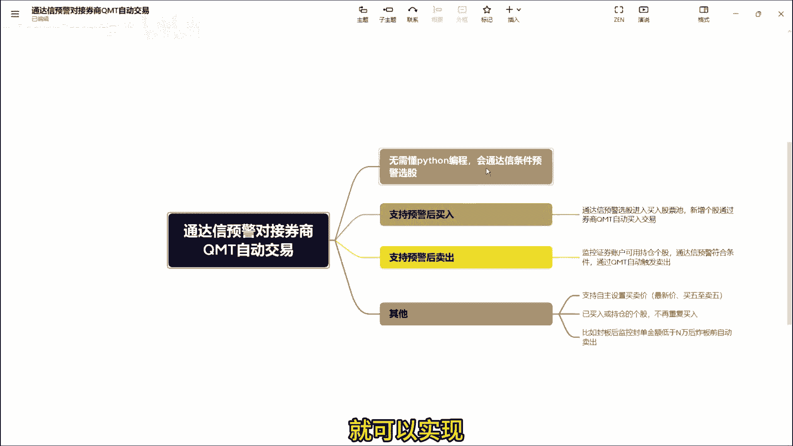

首先呢先准备好，第一这是一个通达信的一个软件啊，第二呢这是一个券商的这个QMT策略终端，在这个通达信这个自定义板块里面，你先自定义三个板块，一个叫买入股票池，一个叫卖出股票池啊。

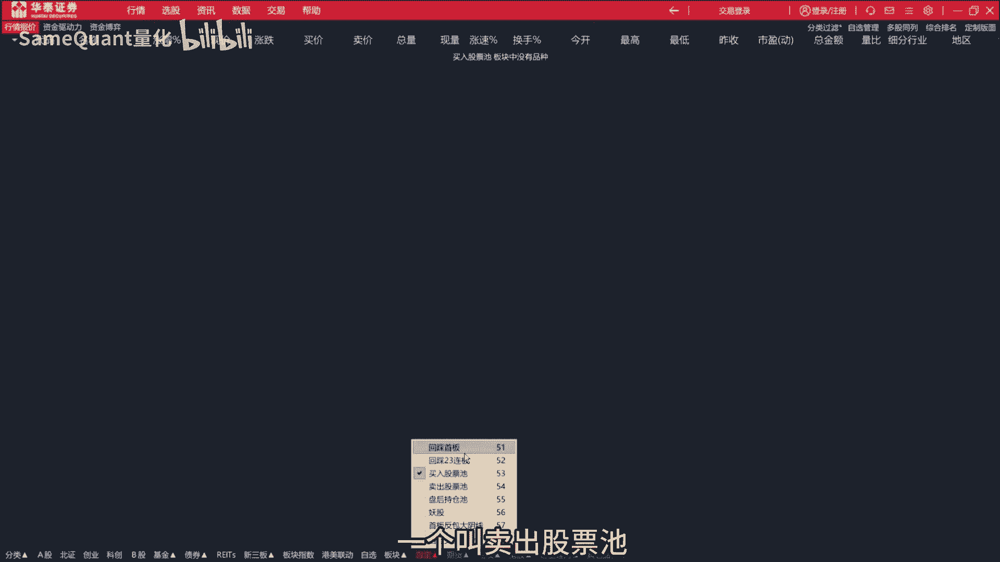

一个叫盘后持仓持，接着我们在QMT里面啊，我们先把我们的这个策略程序运行起来好，你可以看到这个KMT已经监控到了，我们的账户的持仓和资金的一个情况，同时我们已经监控到通达信的这几个板块里面。

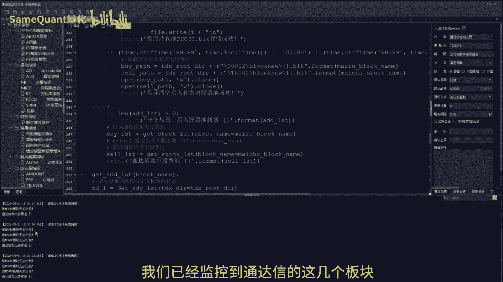

目前没有成分股哈，接下来我们把这个条件预警开启，开启之后呢，这是买入的条件，预计买入开启之后，这个条符合条件的个股会加入到哪呢，会加入到这个买入股票池里面来，会加入到这个买入股票时。

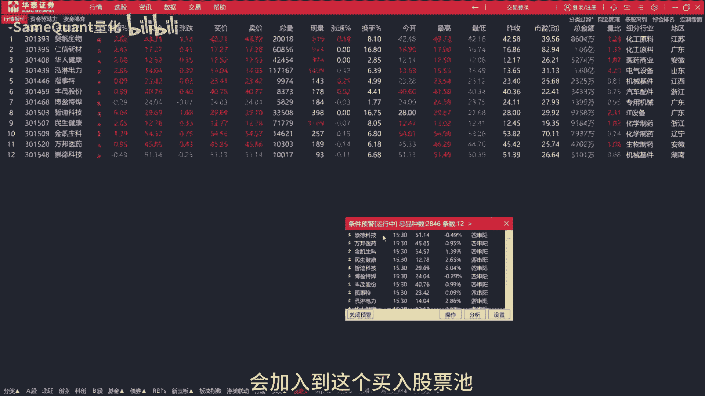

大家可以看买入股票是会加入，同时我们可以看到买入股票池，通达信那边加入之后，你看这边就自动的啊，这边一直在加入，只要有新增，这边就立即加入，你看到没立即监控啊，你看通达信只要这边在一直在增加啊。

这边就是自动的增加，只要有新增，它就会买入，如果同时他会去去除啊，已经买入了，他就不会重新买入，会去从，如果卖出的也是一样。

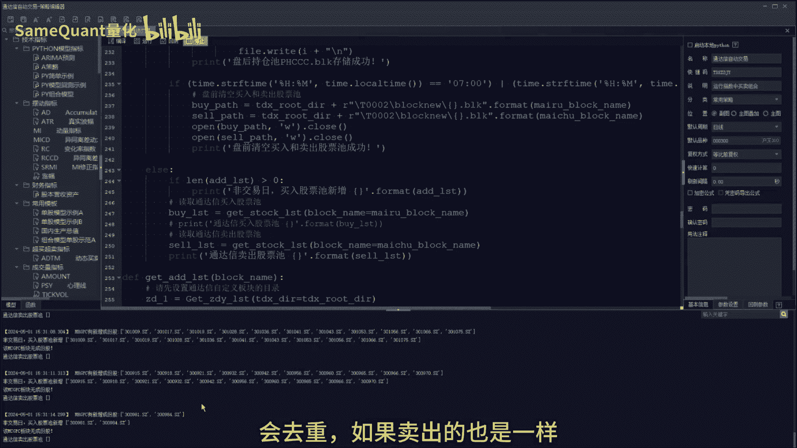

卖出的逻辑是一样嗯，卖出的话他监控的是一个好，我们先把这买入的预警给关闭掉哈，他卖出的逻辑呢是这样的，首先呢卖出的时候，他首先他监控的是你证券账户的可用持仓个股。

那你通达性预警条件的一个监控的一个股票池，你就设置为这个板块里面的股票池，也就是我们这个盘后持仓的股票池。

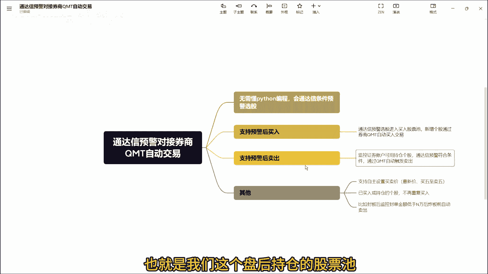

它会监控这个它根据你的条件，它符合预警通达信预警卖出条件之后，他就会加入到一个什么呢，就会加入到这个卖出板块里面来加。

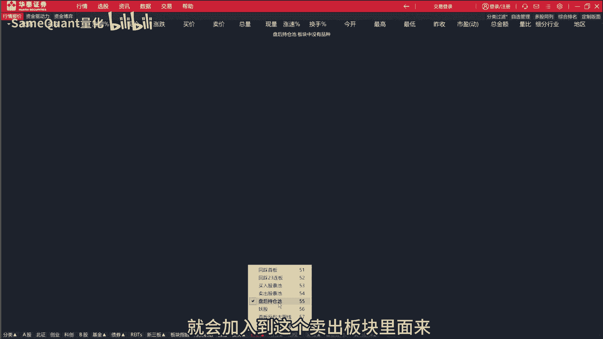

同时呢我们这边QMT里面就会触发卖出。

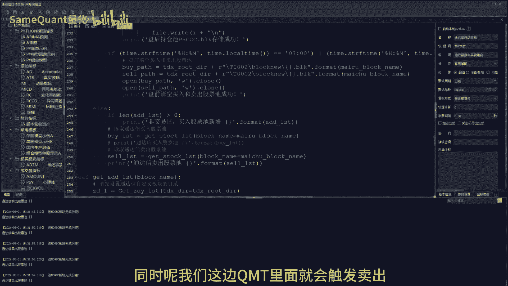

这样一一买一卖啊，这个完整的流程就闭环了，同时呢还支持其他的一个功能，什么功能，你比如说这是我卖出的时候，我按什么价格买入，目前支持是最少，支持的是这种有11种价格，第一个是最新价。

另外是买一到卖五的价格都是支持的啊，买卖买入的时候，卖出来也是都支持这些价格，另外说如果说你已经买入的个股，或者是持仓的个股，如果说再触发了买入信号，它就是不会再重复买入的啊，这个也是很关键。

在实盘中很重要，另外呢还有其他的一些功能，比如说啊我持仓的个股，它盘中它涨停了，但是呢我可能上班对吧，没有那么多时间实时的看着他涨停，他随时可能炸板，那这个时候我就想，他希望在他在炸板前果断卖出。

这个时候我们就支支持设置，你自己设置一个金额，比如说是3000万或2000万，当你这个持仓的个股，它的封单金额低于3000万的时候。

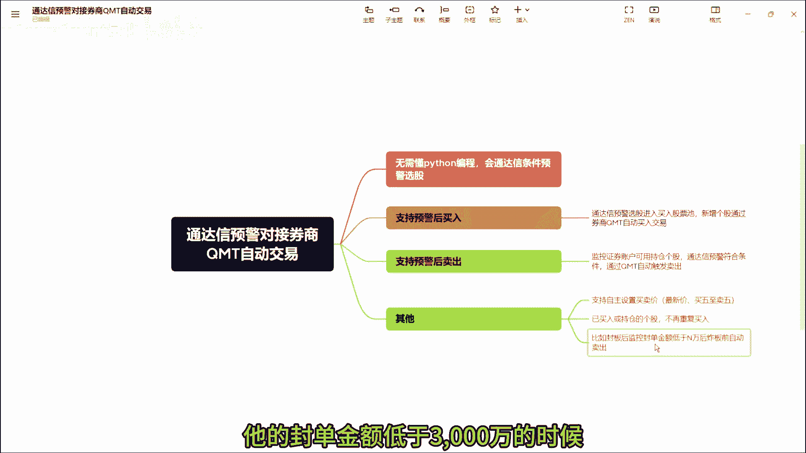

我们就会程序会这里的啊，这KMT程序就会自动触发卖出，同样这个卖出的价格，你可以设置啊买一到买五的一个价格。

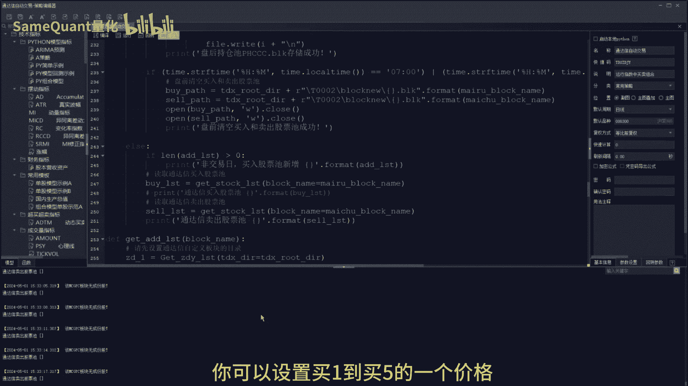

这样的话一个完整的逻辑就啊，清晰的讲解出来了，这个是你不需要懂Python编程的，你只需要有会这个通达信预警。

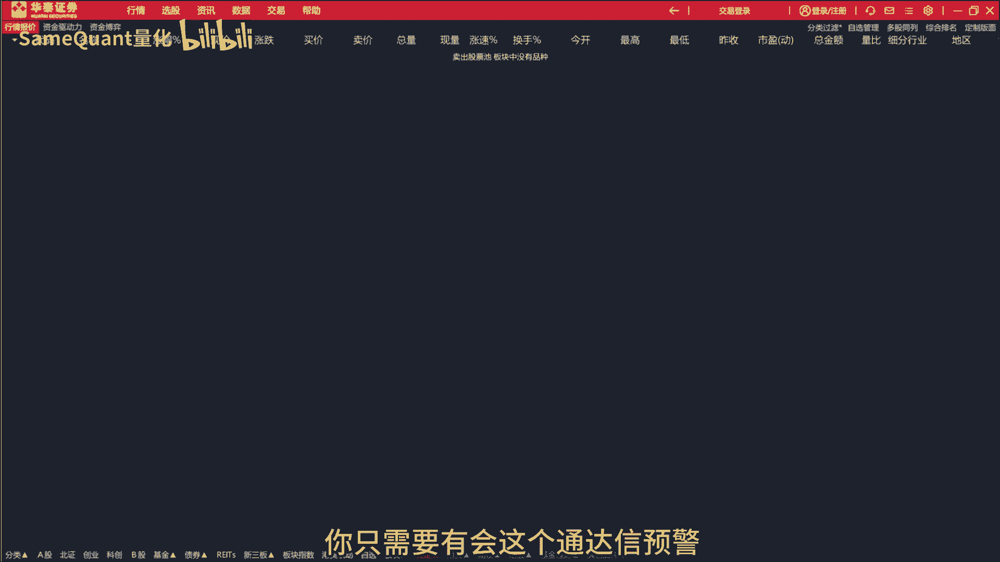

全条件选股就行了好了，本期的分享就到这里，如果有什么疑问，欢迎在评论区留言。

