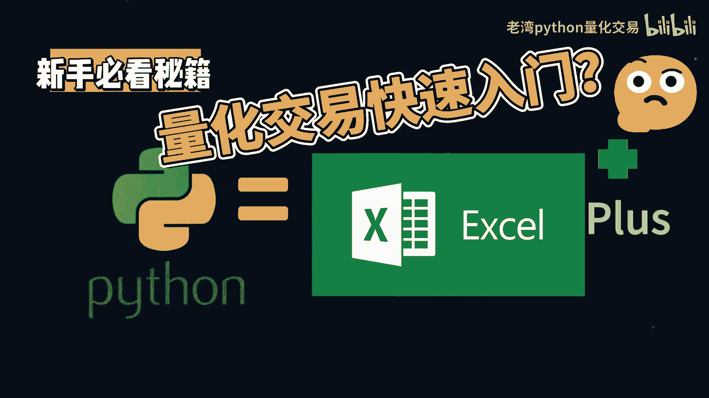
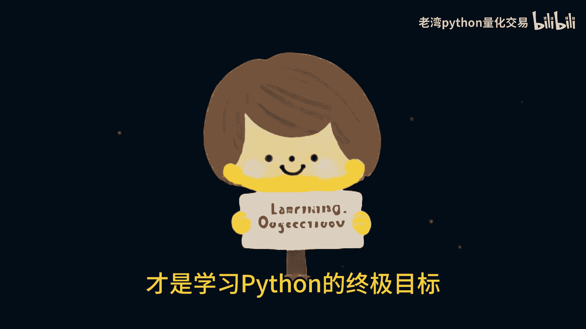
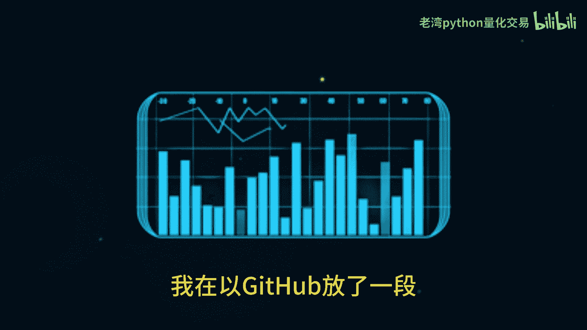
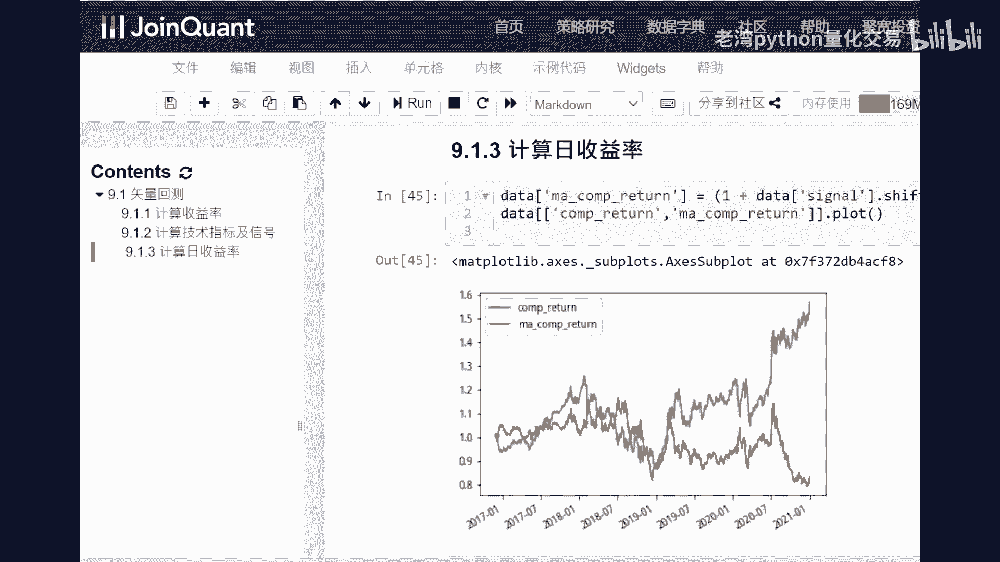
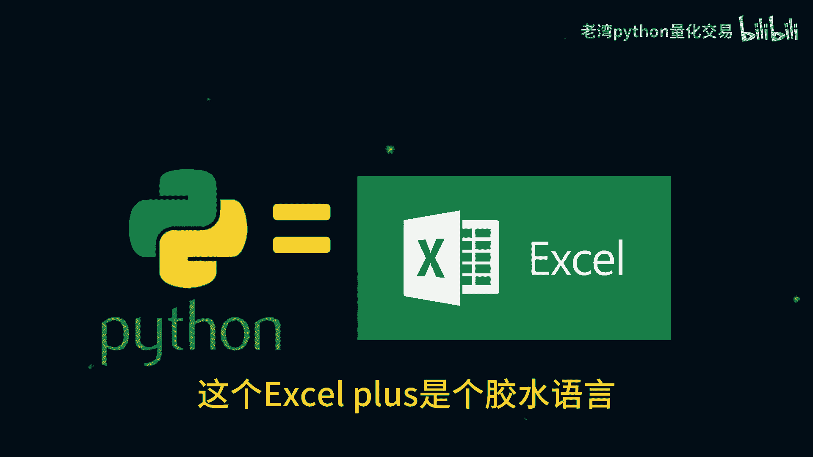
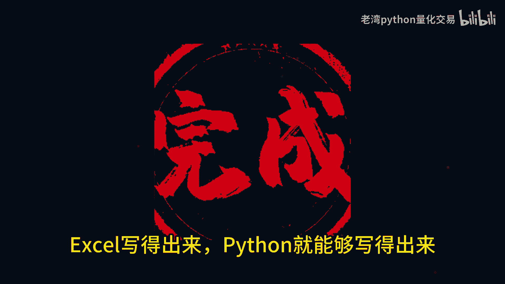

# 量化交易入门 Python = Excel Plus？ - P1 - 老湾python量化交易 - BV1Xx4y1a7Z8

各位同学大家好，视频开始之前呢，先来个灵魂拷问，新手学习Python量化交易，只是为了做量化交易而已吗，请同学把答案打在公屏上。

对于新手同学来说，特别是没有接触过Python的新手同学。

建议同学把学习Python量化交易的格局放大一点，量化交易是学习情境，在交易，在职场还有学习的道路上，能善用Python还是学习Python的终极目标。

同学肯定会用excel的excel的一些功能或者是快捷键，我想大部分同学用的比我还溜。

Python能做量化交易，excel一样也行，我再g hub放了一段。

现在excel实现策略的向量回撤，再迁移到Python实现的代码，有兴趣的同学可以下载Python代码。

是在聚宽的量化交易平台上面运行，同学不用部署Python环境，不用另外接入数据源。

能开网页就能够学习Python，同学有兴趣的话可以观看讲解视频，新手同学通常呢只要有人提点一下，过了那道门槛，开了思路，Python量化交易学习的道路就一路平坦，Python量化交易没有那么神秘。

这种同学可以把Python当做excel plus来理解，这个excel plus是个胶水语言。

能排序和筛选，能写逻辑规则，能细化量化交易策略。

能爬虫，能搞大数据，还能发送企业微信信息。

还能做网页，做UI，还能做机器学习AI算法，还有大把大神开发过的Python开源的代码。

能够白嫖Python对于新手同学来说。

主打的就是一个语法简单工具包，多学习曲线平衡，亲手用excel的基础来学习Python是最快速。

最容易理解上手的，而且投效比是最大的，用excel思考，用excel解决问题，再转换到Python。

就跟做个excel一样，只要有想法有思路，Python编程实现就容易多了。

Python量化交易没有那么高大上，先有解题思路，写出个框架再求优化。

excel有收入，Python就能有思路，excel写的出来，Python就能写得出来。

excel写不出来的，excel plus能够帮你实现快手量化交易的范围，包括但不限于股票期货期权，可转债大饼，你想得到的都行，只要同学的交易规则相似，策略就能够复制到其他交易的品种。

只要换个交易平台，换个行情接口和下单接口，不能上策略，前提是你愿不愿意动手开始写策略。

有些策略在一些交易品种上面不合适，换个交易品种。

说不定策略就行了呢，不用一开始刚认识一个新的交易品种，就直接领证去弄个一生一世啊。

多看看，多接触学习，在理财和交易的赛道上，很多底层的交易逻辑是相通的。

那今天的视频先到这边，记得点赞关注，下期见喽。

