# 量化交易入门到精通10-python基础语法字符编码 - P1 - 大佬量化 - BV1C7pgeDER5

Hello，大家好，本节课学习python3的基本语法，我是专注量化交易的速度，想用python3玩转我们美股量化，那首先看整个的语法包括哪些，现在直接上我们的真正的课程。

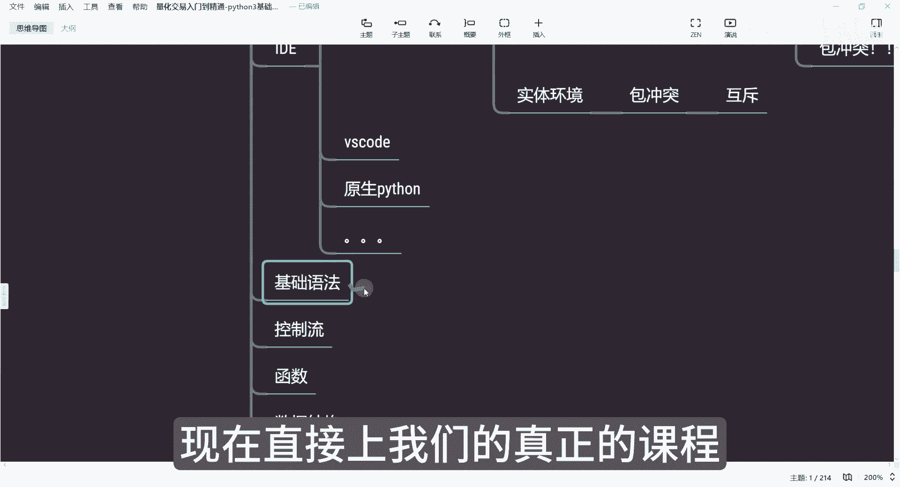

那今天开始我会在Python里面来演示，大家跟我在这个工程上点右键点击Python的软件包。

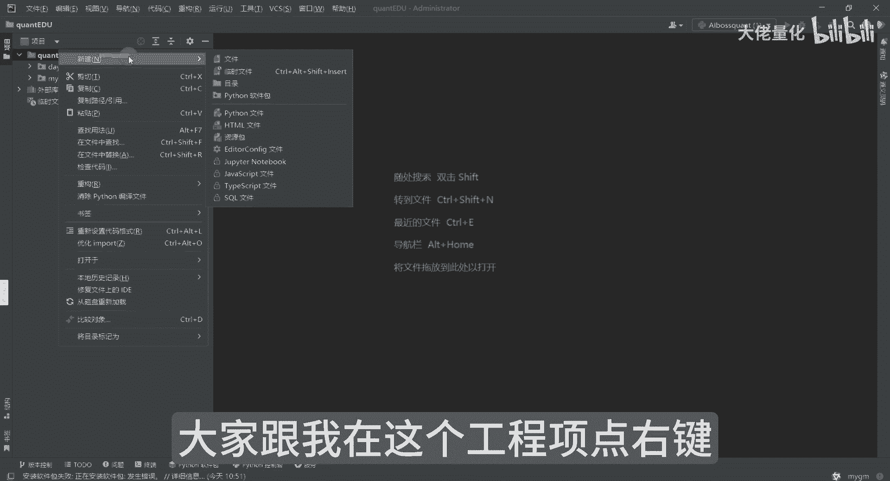

点新建选择Python软件包。

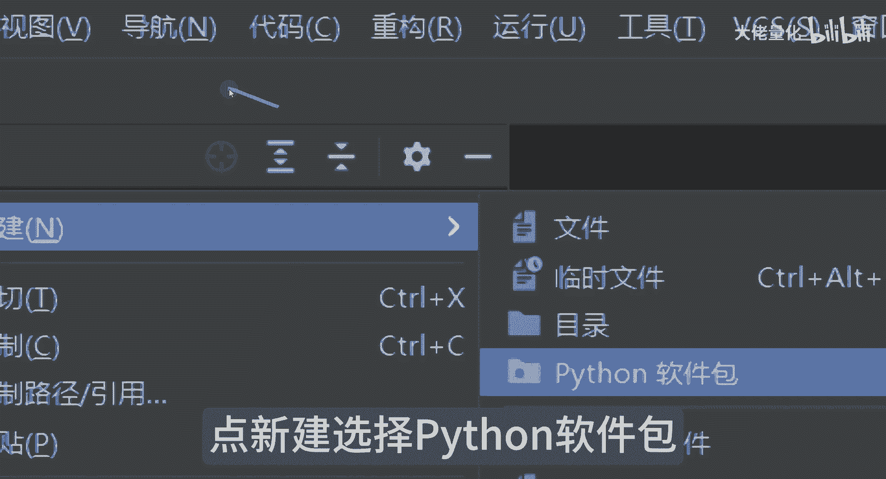

点完之后它会提醒我们创建名字，按创建名字来讲，今天我们以课程内容基础语法，我把它回车，回车之后，在这个位置上就会有为我们基础语法。

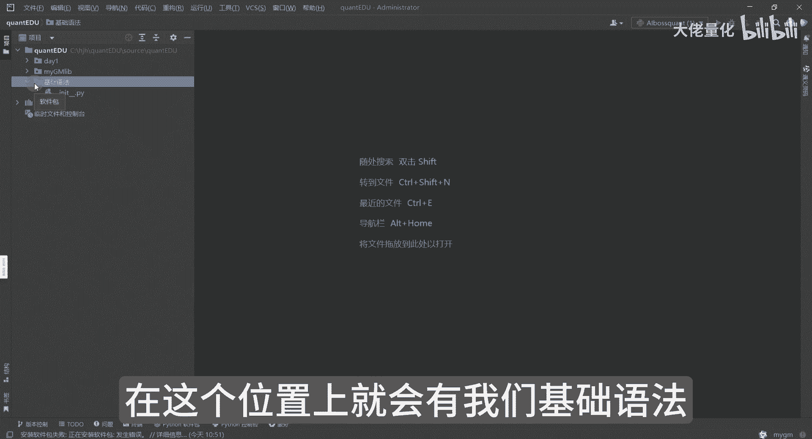

那在这个位置上，大家可以看到你发现这个文件夹下面有个点点。

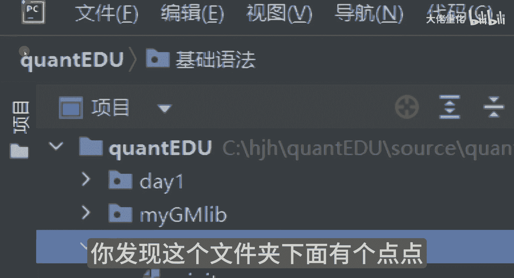

我在可以再新建一个普通的一个文件，大家可以看一下，比如这里边我不选择这个Python的软件包，我选择目录的时候，你会发现这个位置上面会有些不同。

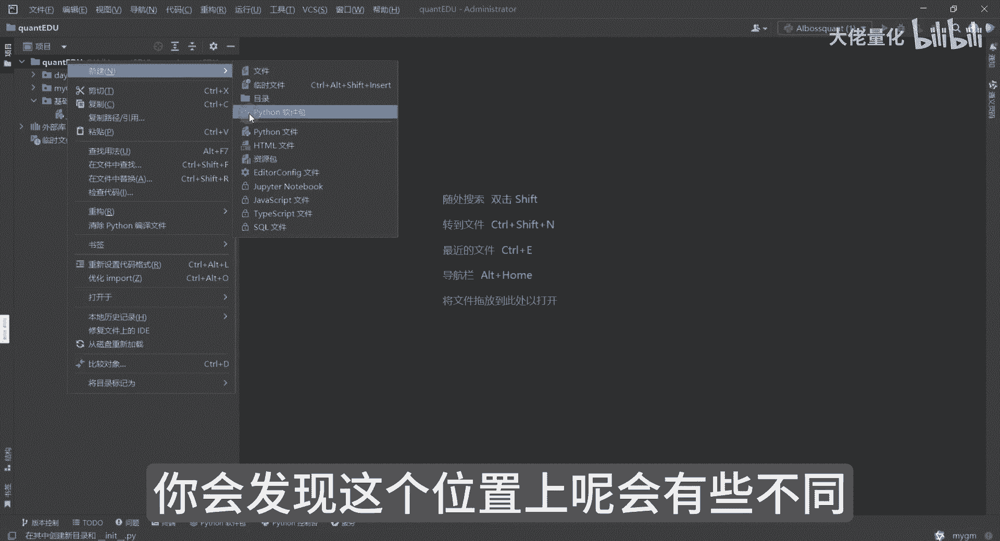

软件包来讲是后面有一点点，如果是普通文件夹目录，就是这样的一个标识好。

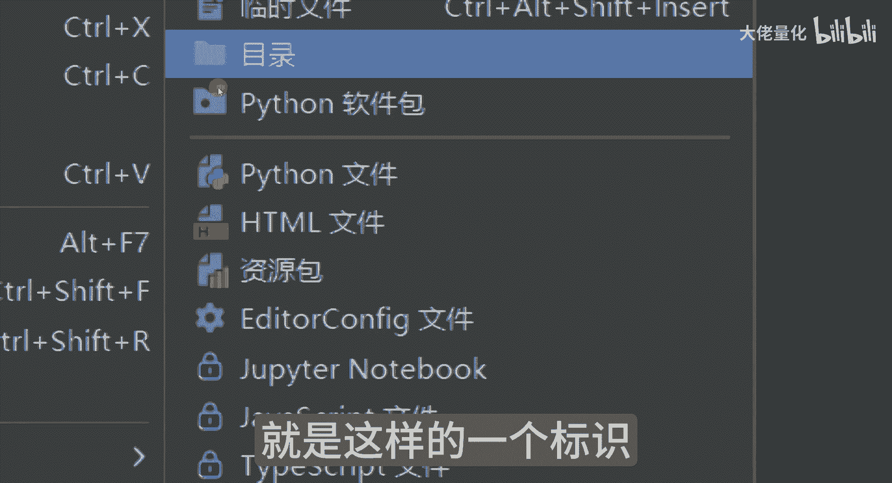

那我们在这里边每次创建包之后，它会默认的有个叫做innate的一个nationalize，这样的一个PY文件，当然它是空的，是默认创建的，因为包来讲一个pack值，默认加载程序的时候。

它会有初始化的一个动作。

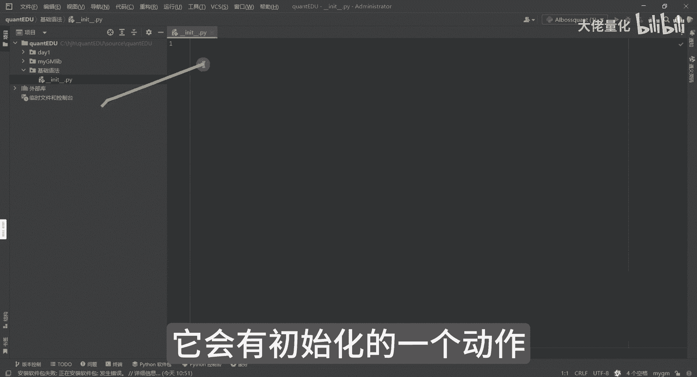

这边就先不扩展展开，后面再讲解，那首先来讲呢，我们第一个演示，在这里面选的就不是Python的软件包，这里面选择是Python文件，那可以看到有很多个这个我之前说这个叫主peter。

这个notebook，notebook是没有解释的，其实notebook呢相当于也是一个可视化的一个页面，它和拍charm有点像，就像记事本一样，可以实时看到里面的内容。

包括你可以看到一些相应的图片什么的，绘图都可以看到，我们现在是先创建一个Python文件。

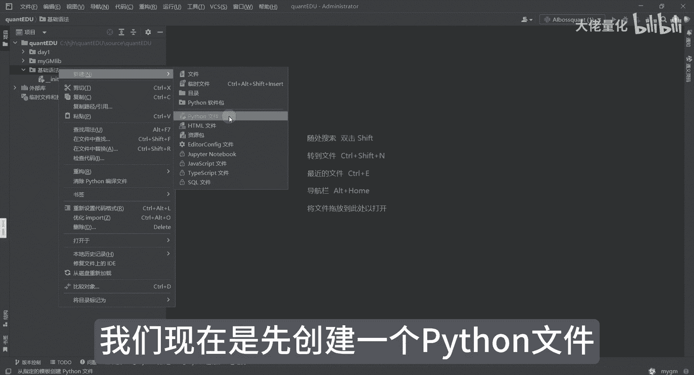

在这个位置，第一个文件呢就是字符编码。

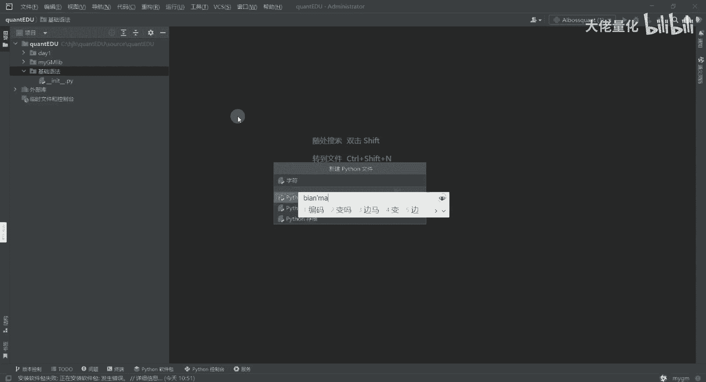

字符编码来讲，大家可能听起来比较陌生，我们可以看一下啊，比如说在这里边print这变量，等一下刚才你有没有发现一个问题。

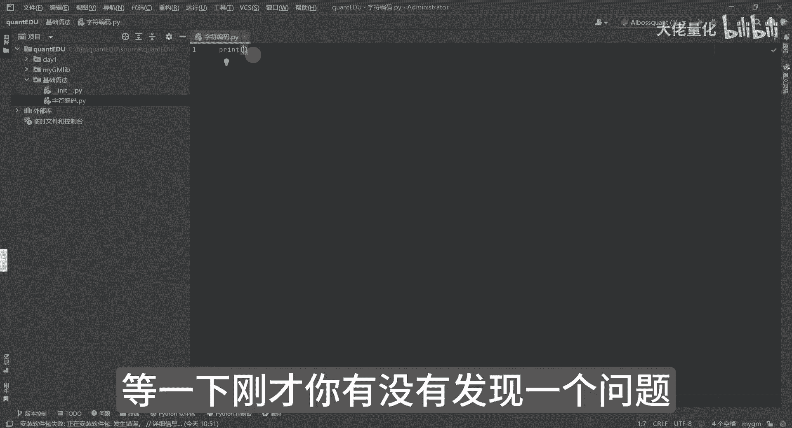

因为在这个位置上可以看到这个东西，通用零码，首先前提是我是对这个代码相对比较熟悉，所以说我是用的通用零码的AI，这是阿里巴巴那款AI还是非常好用的。

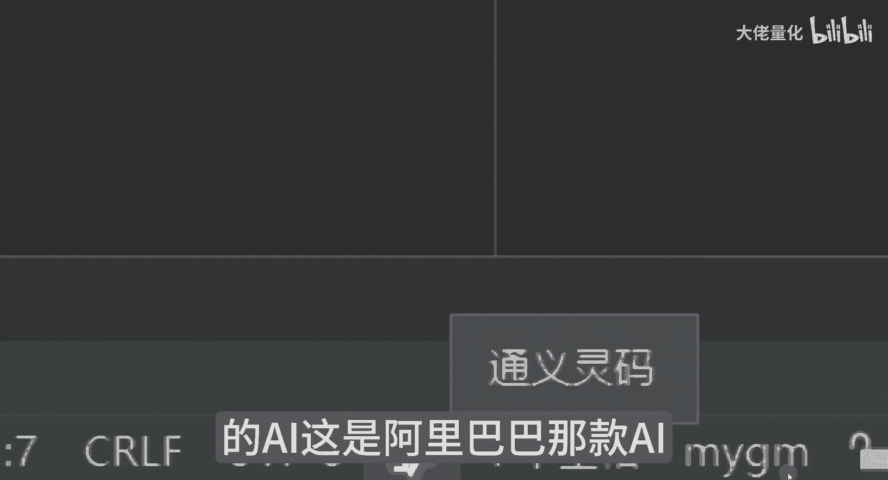

大家会发现在使用过程中呢，他会给我一些提醒，我们先看一下效果，你看啊，比如说我现在说了hello word，他有的时候他会提醒我的哈，那我这里边呢就是print，就是打印的意思，那这个一个单引号。

那这里面是我需要输出的内容，然后在这个空白区任何一个位置点击右键，点击运行这字符编码，其实就是文件名，然后点击的时候你会发现它下面有个弹框，弹框呢其实就是这个位置运行。

那这里边呢就会输出我们的这个hello world，Hello world，其实就是我们这边来输出的，那这里面来讲，那好我们再输入另外一个，就是说我们觉得再做下人肉翻译和法事件好，我们现在执行。

而执行之后呢，你会发现好你好，世界这边也打印出来，但有一点你会发现我们在解析文件的时候，比如说中文特别多的时候，他有可能会有乱码的情况，那我们就需要有这样一句话。

但这句话也明显是那个AI来给我提示出来的，他就知道说我用这个UTF8，那这样来讲呢，我可以把我的编码转成UTF8，按这个来讲呢，UTL8是个字符集，同时支持英文的阿斯玛就支持英文。

那同时又支持我们的中国的叫JBK，那你现在再点击运行，发现没有任何区别，这个我们后面有具体案例的时候。

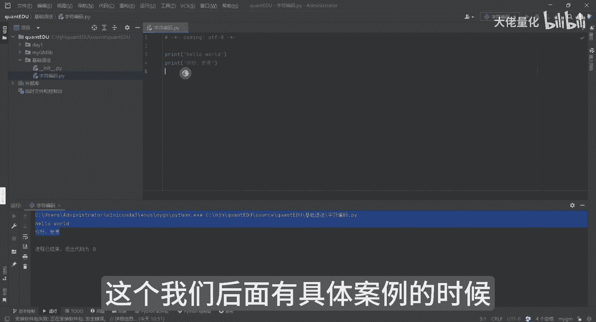