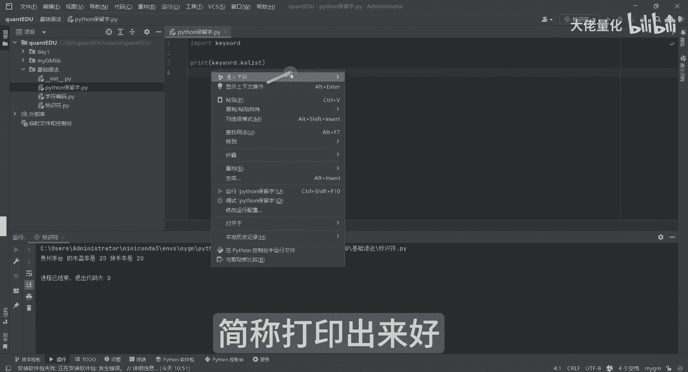
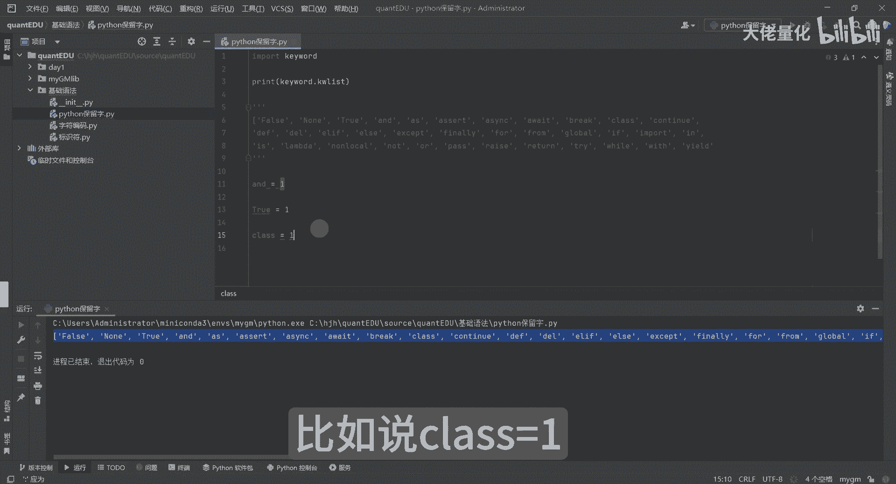
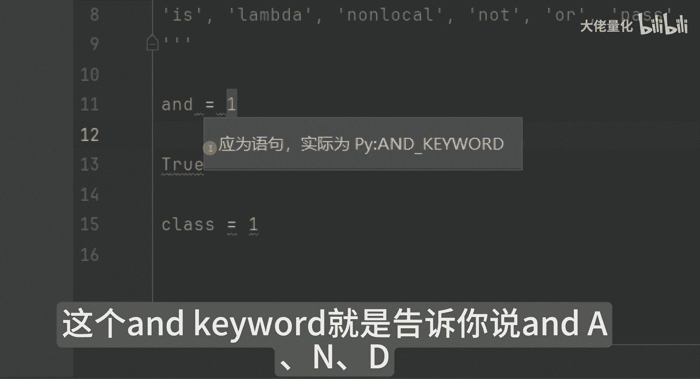
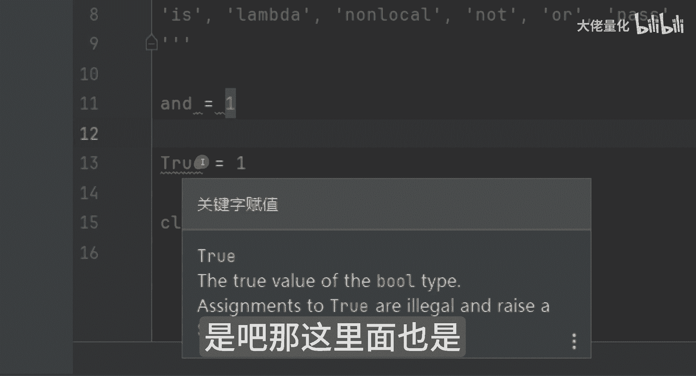
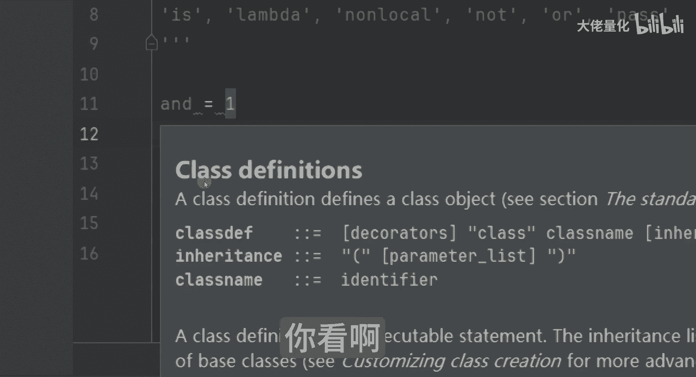
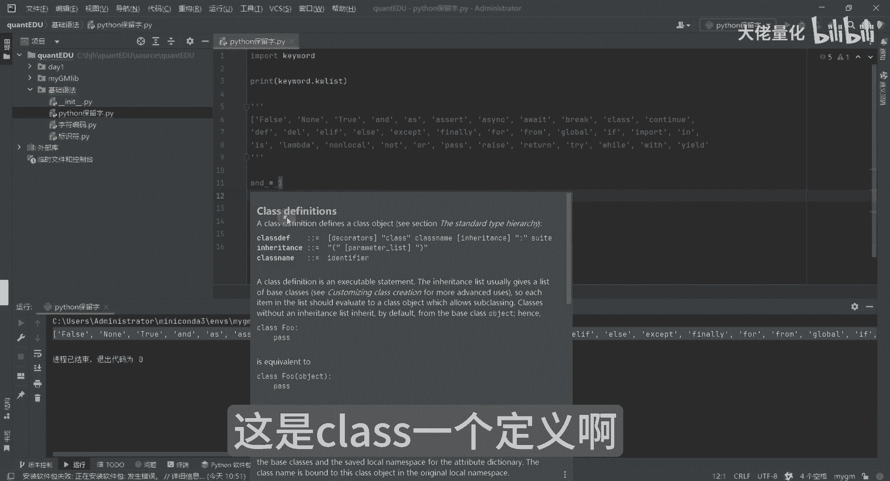
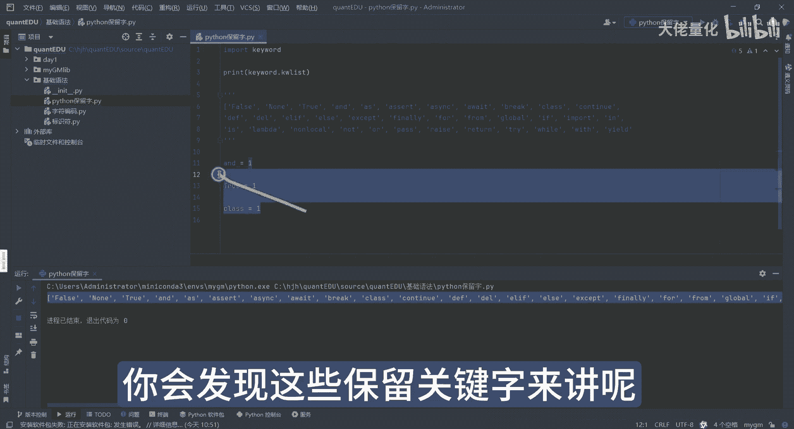

# 量化交易入门到精通12-python基础语法保留字 - P1 - 大佬量化 - BV1UjHQezELE

我和大家分享的就是Python的保留字，Python的保留字来讲呢，大家可以看一下，比如说import keyword，不懂没关系，后面都会讲到这里面来讲呢。

这个key word叫key word list，简称，打印出来好。

注意我们控制台的变化，那会发现是这样的，这里面显长，我把它复制一下到这边来，打印完之后是这样的，我把它换行会看的更清楚一点，大家看一下，这里面保留字还是蛮多的，那这里面保留字是干嘛的。

比如说我们在定义变量的时候，我刚才举个例子，你甭管是说XYZABC这种名字都可以，比如说我现在就用一个保留字，我用这个and我用and来做一个变量，那这些呢其实是不建议的，会产生歧义。

你看啊我定义成and等于一，我再定义另外一个，比如true等于一这个true，然后是and我再找一个，比如说class等于一好。

我随便写的哈，大家会看到一个问题，你看这里面报错，要报错是什么呢，报错你会发现和刚才报错是一样的是吧，英文语句实际为PY，这个and keyword就是告诉你说and a n d。

它是一个关键词处来讲呢，你看到了报错，你看没有，他告诉你是说哦，他告诉说哦，他是一个布尔值是吧。

那这里面也是他会告诉你也是有问题的，而class来讲呢，你看啊他这里面报的错误信息就更多了。

他告诉你说这是class一个定义啊。

怎么怎么怎么样，这里面你会发现这些保留关键字来讲呢。

是不建议使用的啊。