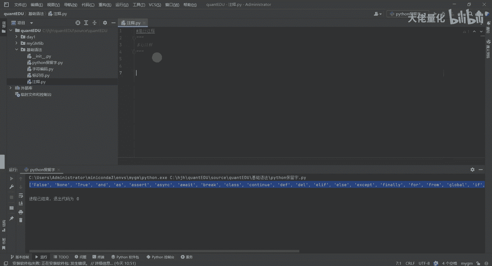
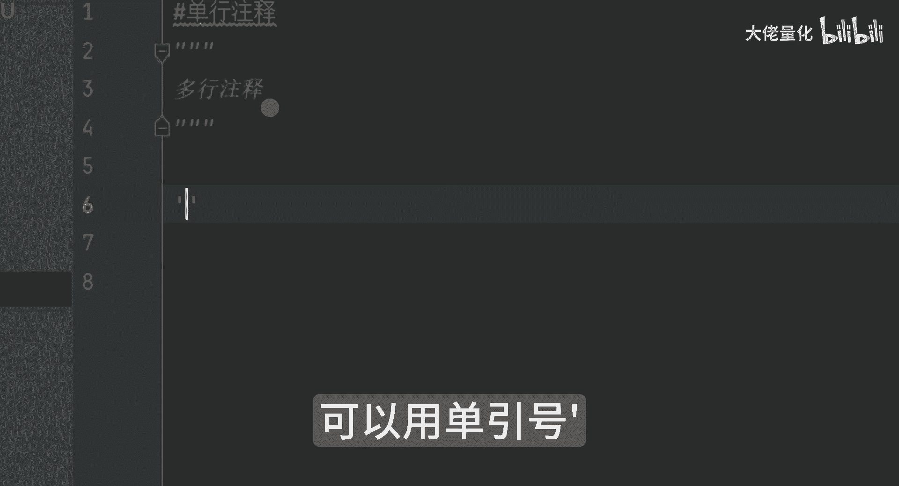
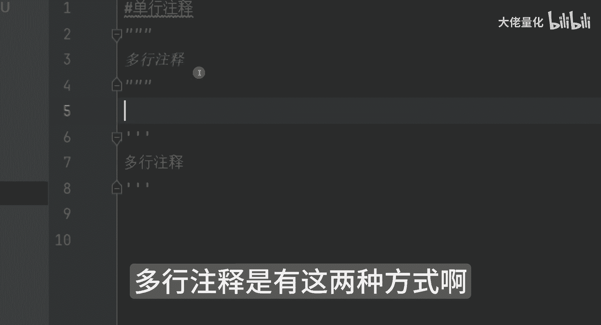
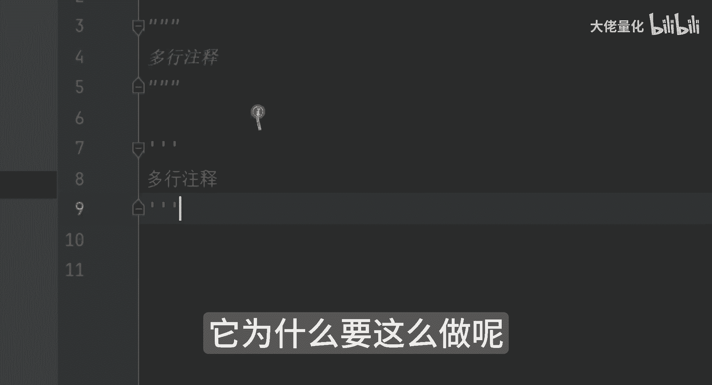
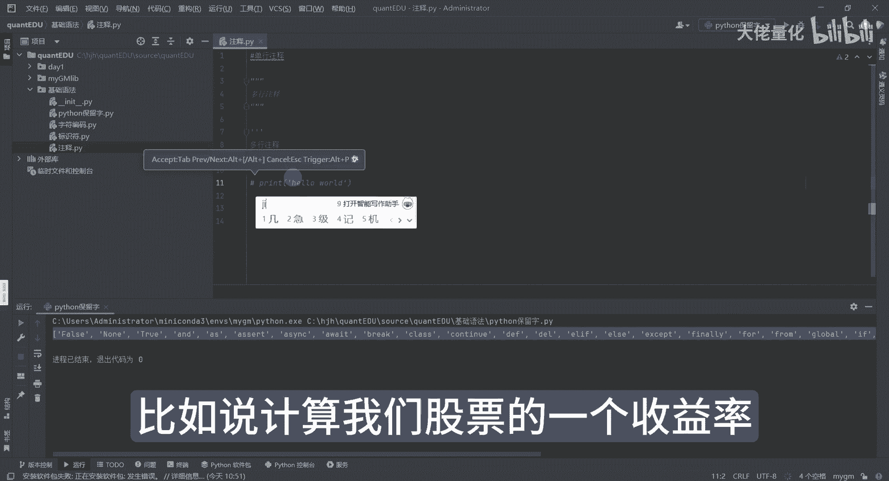
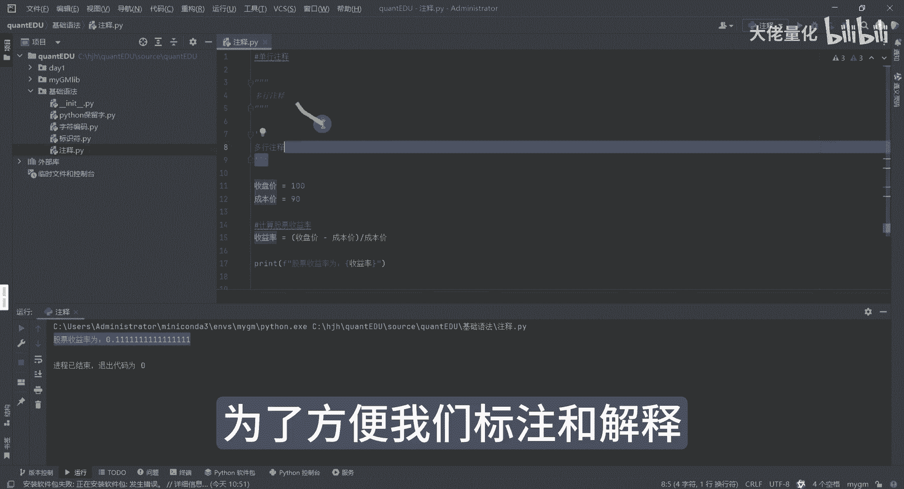

# 量化交易入门到精通13-python基础语法注释 - P1 - 大佬量化 - BV1yMpLeAE3a

我们的注释注释的种类有几种啊，一种叫单行注释，那我写一个代码啊，我想做这些标识啊，那这样来讲呢，我们可以用井号开头啊，那还有一种是多行注释，就是我们那个三个竖线哈。

三个竖线来进行的一个多行的注释，还有一种写法呢，就是说不用双引号了，可以用单引号。

这个也是个多行注释，方注释有这两种方式哈。

好那多行注释，单行注释还有什么好处呢，他为什么要这么做呢。

其实就是为了方便让其他人更好理解，我们的代码，比如计算我们股票的一个收益率。

计算股票收益率等于我们的一个啊，这是英文的括号，一定要英文的括号啊，对于我们的收盘价，然后呢减去我们的成本价之后，再除以我们的一个成本价，我就假设这么写，我们可以看一下处理逻辑之后呢。

这里面股票收益率呢我们就是这样子啊，收益率好，OK你看啊，现在他已经是报错了，报错原因是告诉说未解析的引用收盘价，这里面要给他写一下定义啊，比如收盘价我等于假设啊100吧，去听AI的哈，那我的成本价呢。

成本价等于多少呢，AI告诉我们啊，90好，涨停了好，看来AI也比较喜欢涨停啊，好那我们现在运行，它会告诉你说我们的收益率是这么多啊，这有打印出来的，这个就是我们的单行注释，多行注释的一个核心的目的。

就是说为了方便我们标注和解释。

