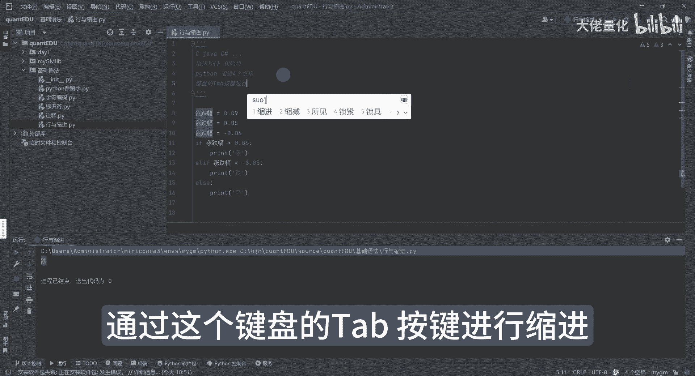

# 量化交易入门到精通14-python基础语法行与缩进 - P1 - 大佬量化 - BV1UWpEeUE1z

行缩进哈，行与缩进是什么意思呢，如果大家是学过或者是了解过一些其他语言，比如C语言，java语言，c#语言啊，C加加呀啊等等，一系列有很多种语言哈，你会发现大家比较喜欢用那种大括号的方式。

来表示我们的一个代码块，那而Python来讲呢，大家是比较喜欢缩进啊，一般用四个空格会多一些，当然那样也有两个空格啊，来展示我们的一个代码块或者是功能块啊，那这里面来讲我也举一个例子啊。

比如像电F等于009，然后我我打印一下，我这里面会做一些判断，AI的帮我生成了假设涨跌幅是大于0。05的，也就大于5%的，那就判断当前的股票是涨的，那如果是小于等于负的0。05，我们认为是跌的。

如果是等于0。05呢，就认为是平的，那我们现在运行一下这些代码，目前我的涨跌幅是0。09，看它属于是哪个区间呢，好这里面这个位置啊，它是打印的，是涨了，对吧好，那我们现在利用我们的一个单行注释。

现在把它写成0。00。05哈，那0。05呢它不符合大于0。05，也不小于负的0。05，那看来正常我们的预期结果是个平，看看效果好，果然是平，那第三种情况呢就是说属于我们的一个负的好，是跌的啊。

其实就会发现哦，哦这个这个这三行哈，你会发现都有个这样的空格，我比如说我把这个删掉，看到没，这报错了，报错原因是什么啊，我把鼠标悬停上来了，他还告诉你中文那样，他告诉你鹰缩进啊，好我现在哈，我敲空格一。

你看我敲了一次，他他没报错啊，二没报错，三没报错，四没报错，并且他那个提示也没有了，这个就是缩进的一个示范啊，假设这样子哈，这样代码哈，你看着有没有感觉很头疼，是不是感觉很混乱对吧，所以说我们来讲呢。

一般在这个IDE里面不会说手动来敲空格，12341231212那种方式，而是按下tab键，taa b tab键来进行缩进，通过这个键盘的tab按键进行缩进。

这个是我们缩进的一个好规范。

