# 量化交易入门到精通15-python基础语法多行语句 - P1 - 大佬量化 - BV1tLpWe8EsW

我们看一下多行语句啊，多行语句是什么哈，那其实你会发现这个像记事本或者word文档一样，它后面也是有长度的，如果说我们一行代码特别长，看着眼花缭乱啊，怎么办呢，可以演示一下，假设它是一个数组，好很强。

AI这点很棒。

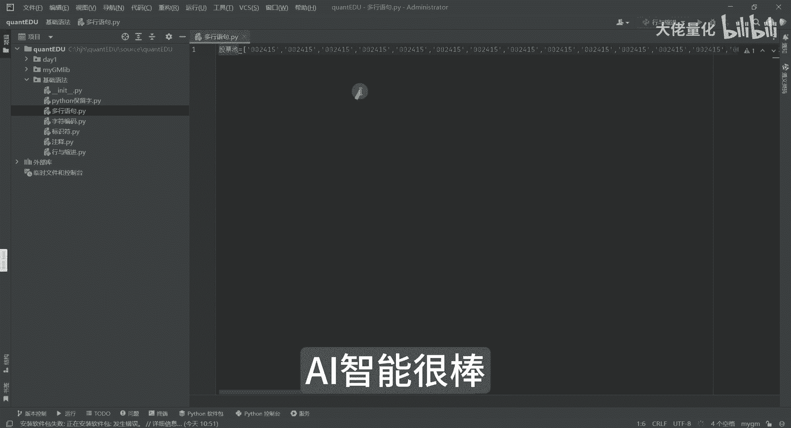

它帮我们生成了这么多，你他发现非常非常长，我现在最起码肉眼也看不到了。

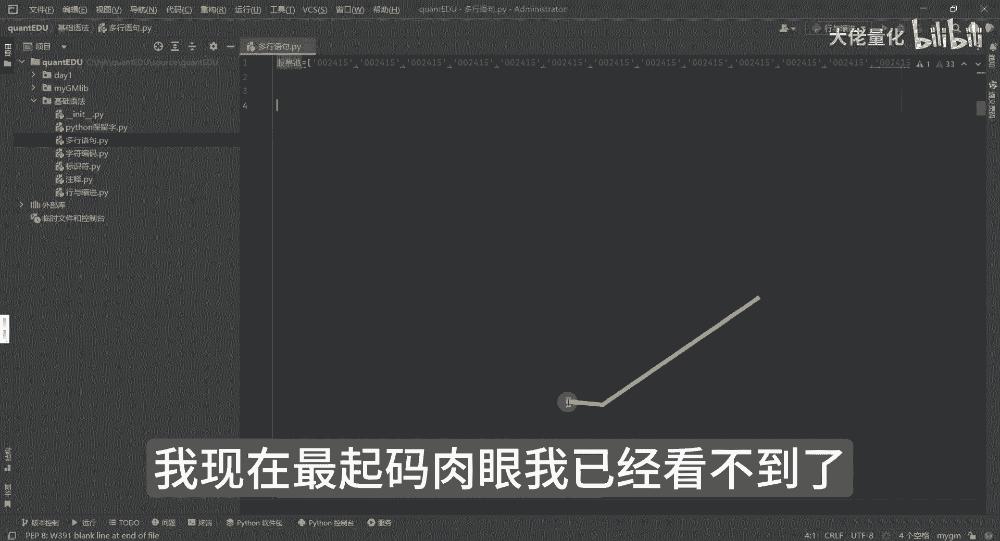

必须拉这个滚动条才能看那么多对吧，那这时候怎么办呢。

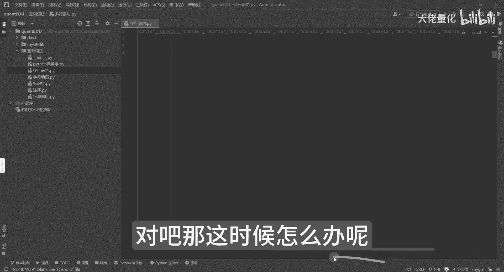

因为经看乱了，那这时候我就需要通过这个反斜杠，直接去那个大括号旁边那个那个按键啊。

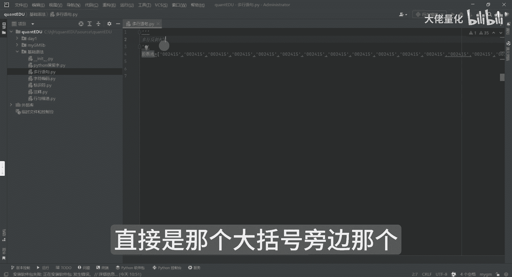

那个符号我打印一下图标是我先运行。

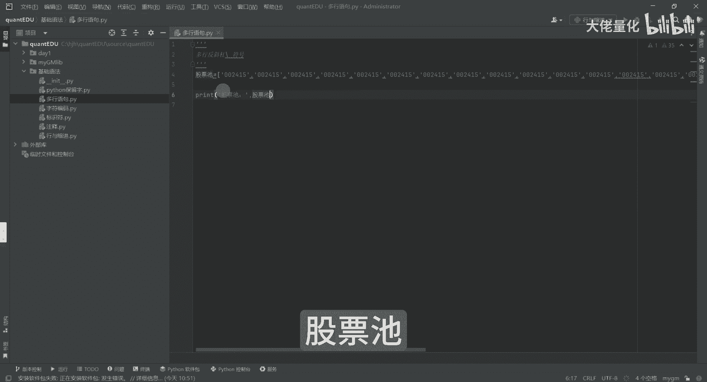

大家可以看到啊，下面这个位置也有这么多，是那我现在为了让代码看起来更加的清楚。

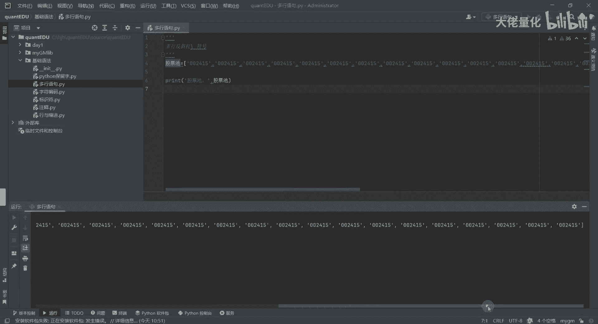

可以加个反切啊，好啊好好。

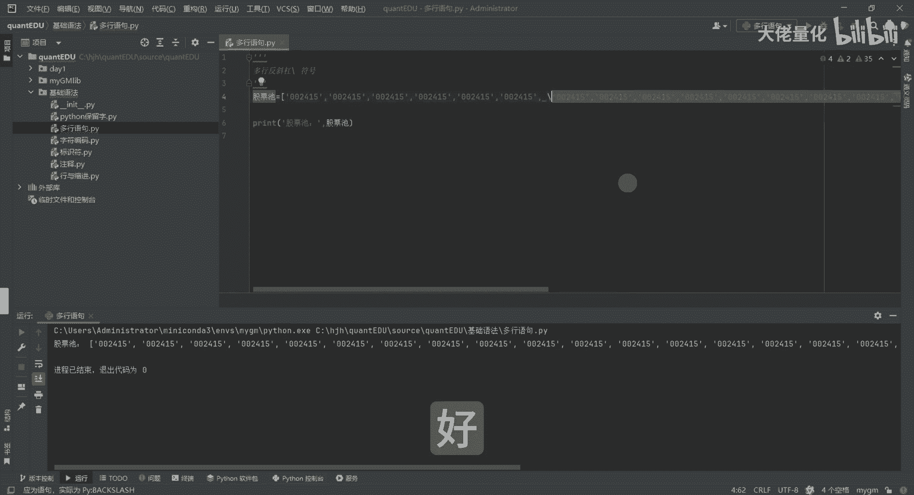

我在这位置上再加个换反极杠。

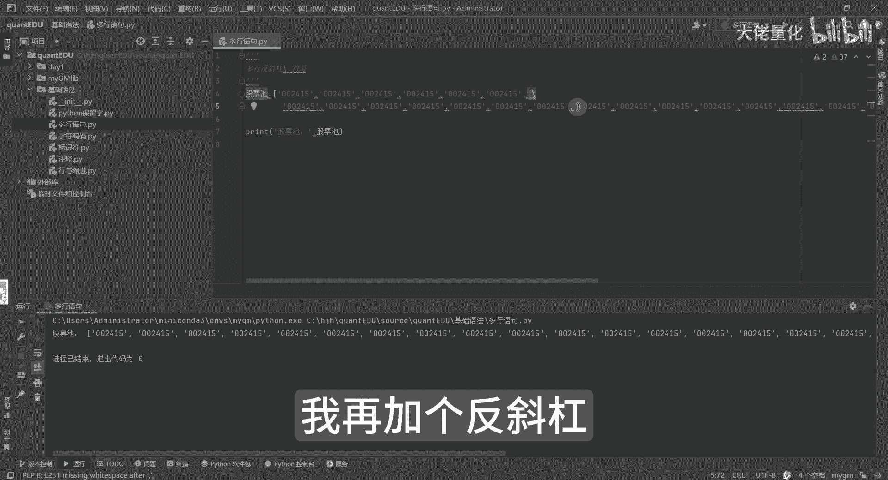

我就很好，我再加个反斜杠，我换好好，这个位置加完之后。

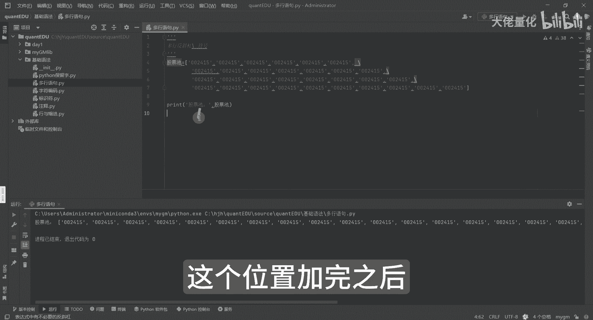

我现在再输出一次啊，大家可以看到股票值是没有变的，仍然还是这些。

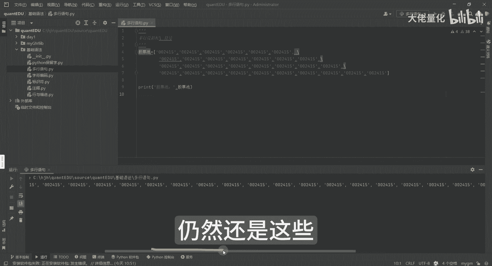

但是你从视觉上的感受是完全不一样的，看起来会更清晰一点对吧。

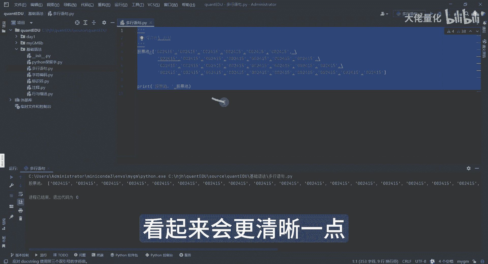

好的，这个就是多行语句。

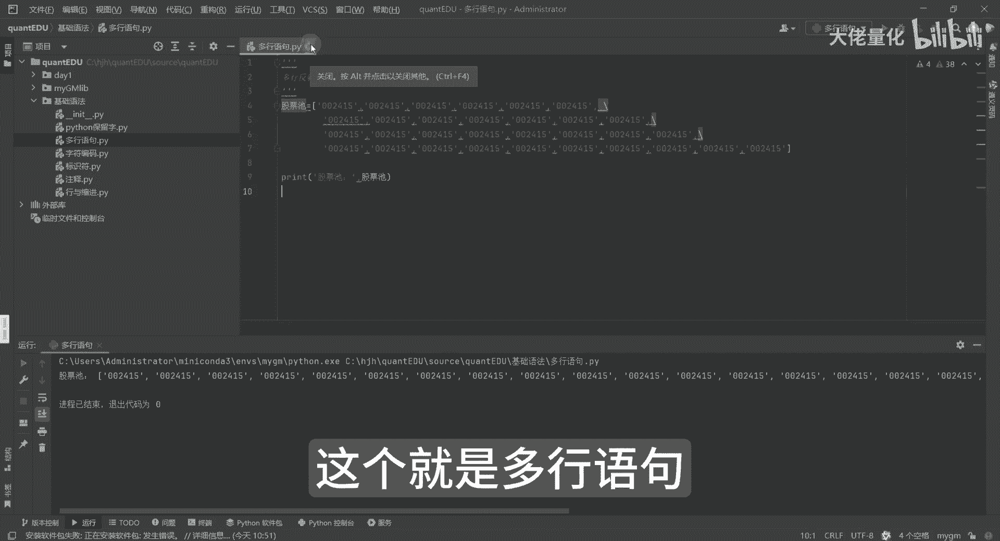

我们也是演示完了。