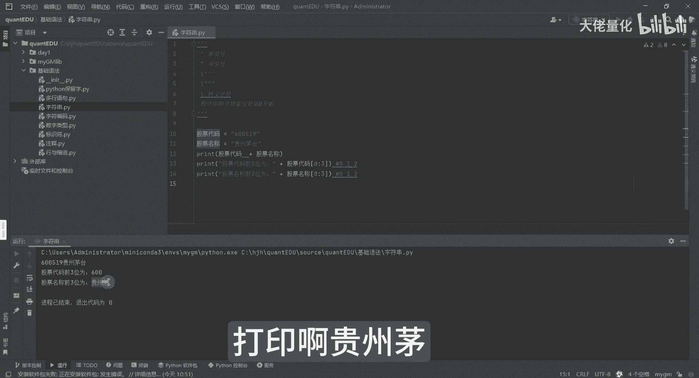

# 量化交易入门到精通17-python基础语法字符串 - P1 - 大佬量化 - BV1sa4peeEdN

我们的一个字符串，我们其实刚才也看到了，比如说单引号，还有个双引号，然后这种单引号，还有一个是像这种就是有这样的，我要让他能展示出来，否则它会报错，斜线是个保留关键字哈，我是完全为了能打印出这三个的。

进行这个转移哈，现在是我为了输出这个三个三个点，而不是说为了这个多行注释的这三个字里边，我再写一下啊，这是一个转义字，就相当于告诉你说我只是个转业，这里面我再举几个例子哈。

比如说股票代码等于我们的这个双引号，600519，然后股票名称股票名称是谁呢，贵州茅台，你看AI还是很强大的哈，他就告诉你这是QU，是贵州茅台，然后那个紧接着就看说啊，这是我们的股票代码是什么。

这个刚才我用F除除此以外呢，还有我们这种想加的方式也是可以的，也是可以把我们的股票代码，股票名称来进行打印的好，然后呢我们先运行一下，运行完之后呢可以看到啊，600519是贵州茅台，那另外一种呢。

比如说我现在想输出他的股票代码的一部分，比如前三位，那上面来讲呢，我们就可以这么做，把代码，然后这个符号啊，括号呢从零开始到三啊，是从零开始的，我这边也可以写一下程序中的字符索引，是从零开始。

这和我们现实生活中从一开始会有些不一样，这个大家可能也需要适应一下，从0~3，它事实上他是012这三位啊，那我们的股票代码012呢，实际上代表的是600，那我们现在打印一下。

你看这里边股票代码的前三位就是600，当然来讲呢我们不打印股票代码，我们打印股票名称，然后看前三位是什么哈，我们看一下打印，看贵州茅。

这个就是我们的字符串。

