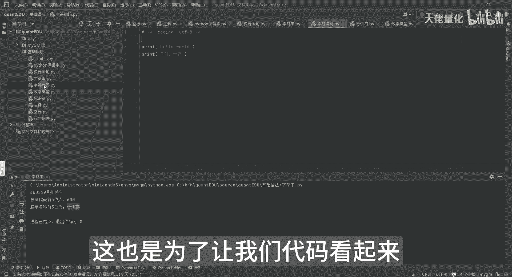
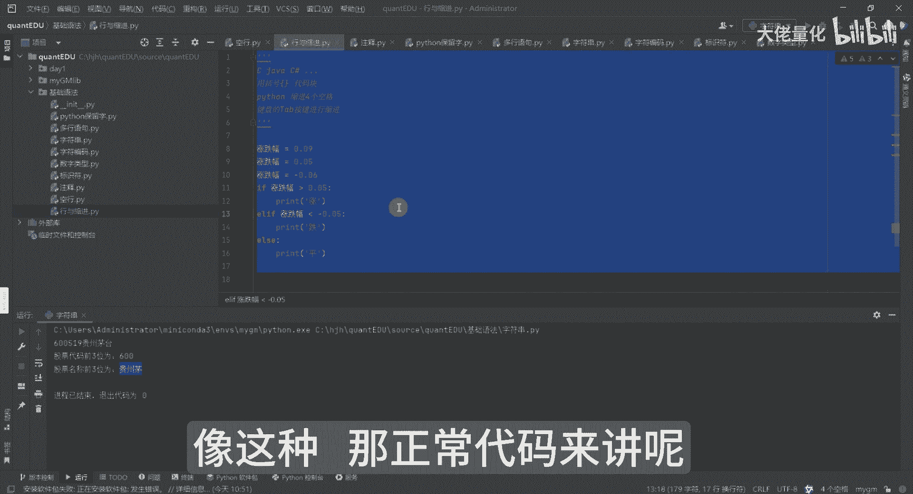
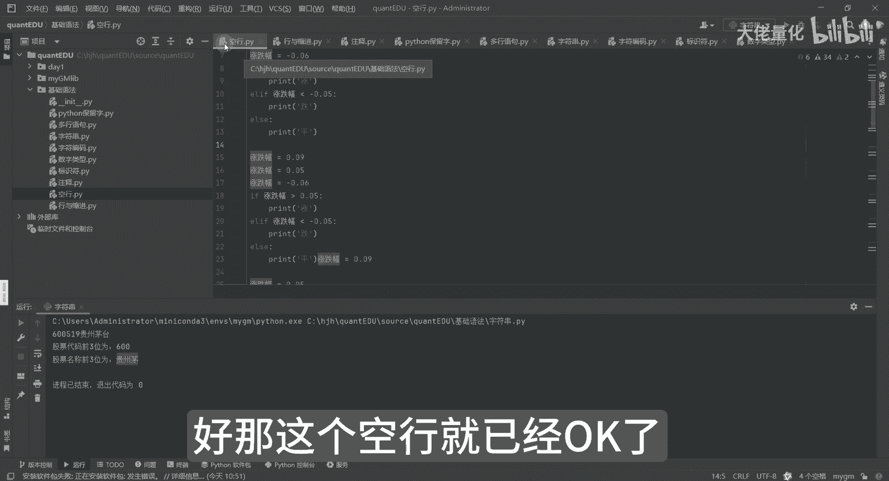

# 量化交易入门到精通18-python基础语法空行 - P1 - 大佬量化 - BV1XW44exEfj

我们再看一个叫空行哈，那空行是什么意思呢，其实代码和代码之间啊，有的时候会有意的会加一些空行，但是不加空行呢也无所谓，这个其实完全是为了让我们看的更舒服，我拿我们刚才写的一些代码来看一下。

你看我的代码里边很多我都是有空行的，我都会有这种空行的，这也是为了让我们代码看起来更整洁一些。

稍等啊，我找一像我们的刚才有判断的对，像这种按正常代码来讲呢。

我是有这样的，就是空行的来演示，那我一连串的这样是没有问题的，但是代码来讲，你想过一个问题没有，如果代码特别特别多的时候是什么感受啊，你可以看一下，就特别的混乱，就是你的文档结构就没有那么清晰了。

对所以这里面来讲呢，我们一般呢会把这些会加一个空行，然后会加个空号在这个位置上，这样来讲的话，你整个代码的结构上，看起来就是阅读理解上会容易的多，对不对，我就可以知道我从上往下翻的时候就知道哦。

这里是一个代码块，这里面呢是一个代码块，它的功能来讲也是比较明确的好，那这个空行就已经OK了。

