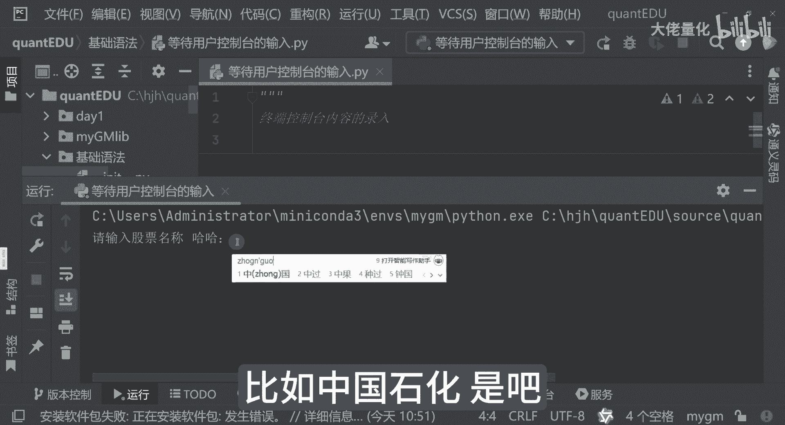

# 量化交易入门到精通19-python基础语法等待用户输入 - P1 - 大佬量化 - BV1MftweJEPk

我们接下来看另外一个知识点，就是等待我们的用户的一个控制台的输入，在这个时候我们需要哪些场景，终端控制台内容的输入，然后那个可以看一下啊，用股票代码哎呦，他竟然知道我要干嘛，我不要代码是吧。

好现在点运行啊，那点运行来讲，请输入股票代码，我们选择贵州茅台，这里面就是输入我们的贵州茅台，那个比如说我们写工商银行好，OK它显示的就是工商银行，这个就是根据我们输入的内容，来进行的一个输出哈。

哦不对，我要输，我要再名，正好一点点名称，那这里边来讲呢，只是在输出的时候，主要的核心点是在于我们这个input input，实际上是我们Python的一个内置的一个方法啊，这里面是我们输出的内容。

告诉你请输入什么什么，这里边比如说请输入不要代码哈哈，假设啊输入完之后，你看这里面就请输入股票名称哈哈，这里面的两个比如宠物石化是吧。

哎宠物石化就是用法就是这样的。

