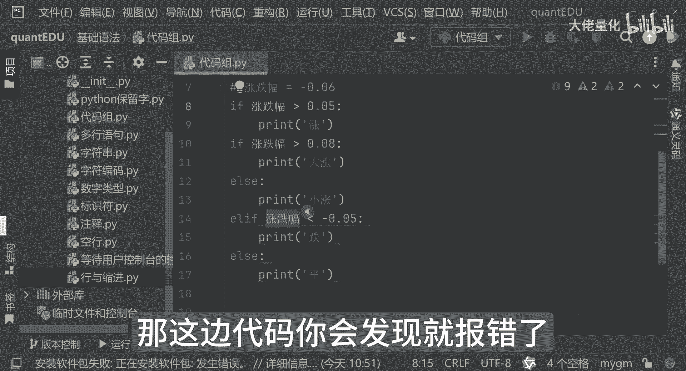

# 量化交易入门到精通20-python基础语法代码组 - P1 - 大佬量化 - BV18a4SeJEJf

这个功能代码组代码组，刚才我们在这个案例里边，已经有了这样的一个代码组的演示，代码组是干嘛的呢，现在是我们缩进相同的多条语句，然后构成了这样的一个代码组，因为这里面有一个条件语句。

if else while for等等一些列循环，这里边有一些复合语句，相对讲呢形成我们比较清晰的一个逻辑，这里边我也写一下，比如说if for语句语句，主谓语句这种循环语句，判断语句这边都可以用这种。

这是我们所谓的代码组一块啊，当然来讲呢这里面还可以进行嵌套啊，我举个例子，比如说他这里边是涨幅是大于0。05，那我判断它是涨是吧，那我现在输入的内容是0。09，现在涨，那我判断它是大涨还是小涨呢对吧。

那这里面我还可以再加一个判断，if涨跌幅假设大于这个，那我认为说涨得快，这个就要大涨，如果不属于这个来讲呢，我就可以走另外一个分支了啊，小涨好吧，那我现在运行，因为现在录入的是一个涨幅9%。

那好我告诉你说第一步它是涨的对吧，在输入终端里面输入涨，那他认为他是个大涨，这就是我们这个代码块，但如果说我们的缩进不是这么缩进的，我们是这么缩进的，那这边代的你会发现就报错了。

所以说这里面就是说个代码组的概念。

