# 量化交易入门到精通21-python基础语法print输出 - P1 - 大佬量化 - BV1dwtsedEss

接下来再看下一个概念，就是pin的输出，其实我刚才也给大家已经演示了很多种形式，比如说名称等于注，注意这符号一定是英文的。

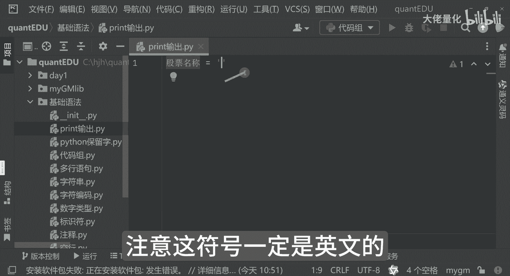

中文它是报错的，按不按名称来讲呢，贵州茅台标代码600519。

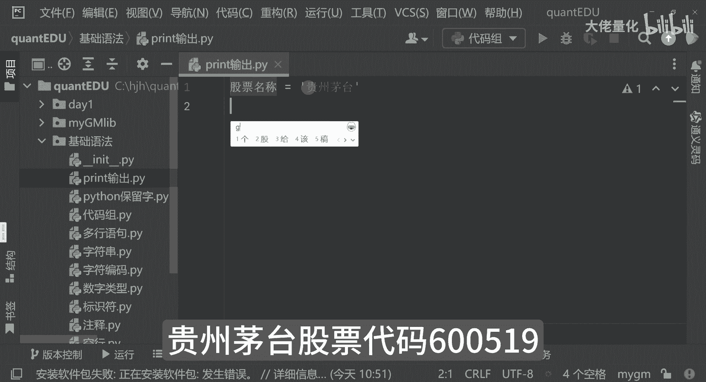

在print的时候，其实输出方式有多种。

或直接输出这种模式，那这里边来讲呢，股票名称，股票名称，股票代码。

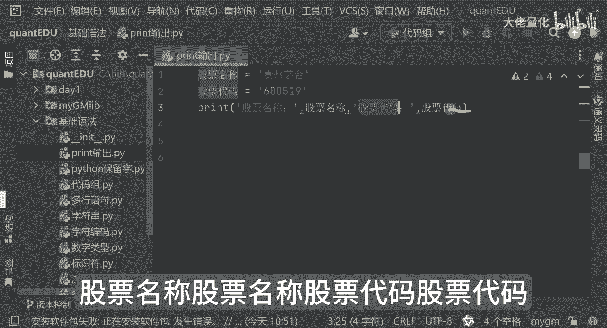

股票代码，这是一种输出形式啊，股票名称，股票代码谁谁谁。

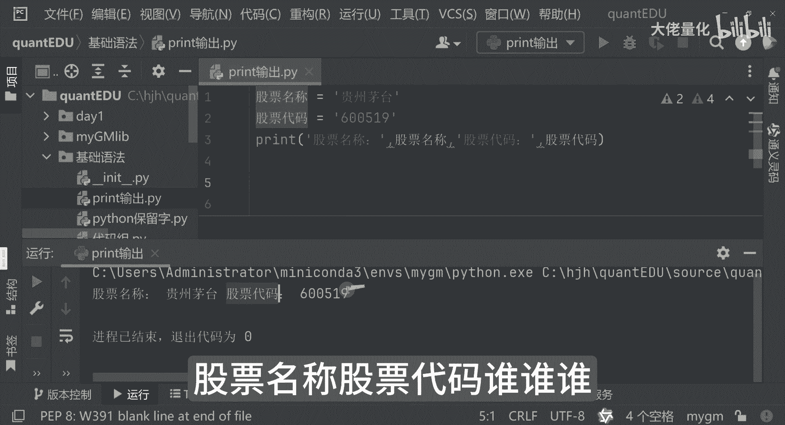

那另外一种输出方式来讲呢，我也可以这么写，print f带个F和MIT好。

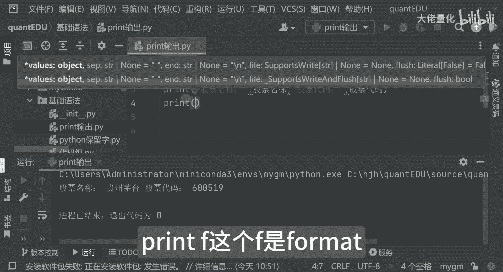

那这边来讲，现在我在输出的时候。

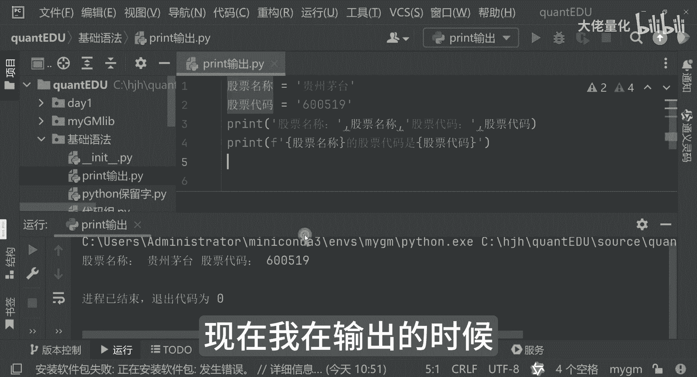

它变成了股票名称，不是就是茅台，那这里边这个相当于一个占位符。

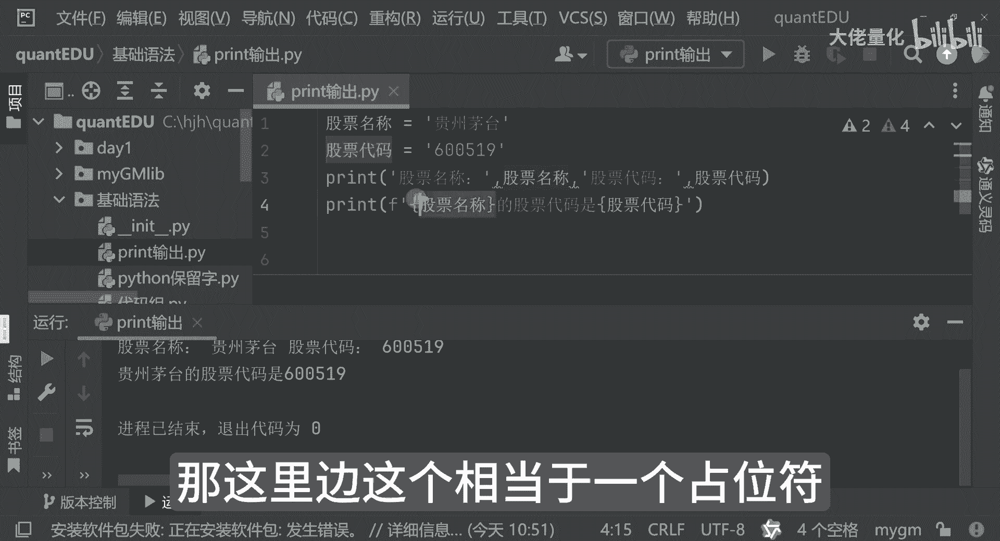

我写一下占位符，那相当于是说我这个通过大括号加变量。

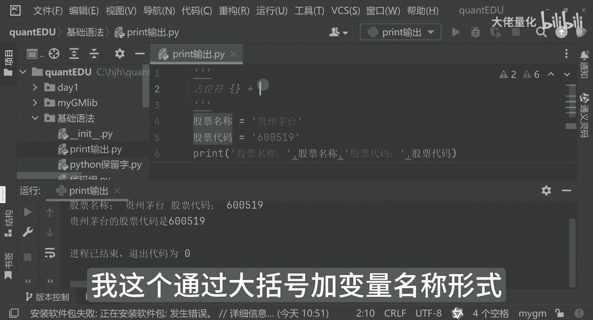

名称形式，第二行输出，就是说F股票名称是我们的贵州茅台。

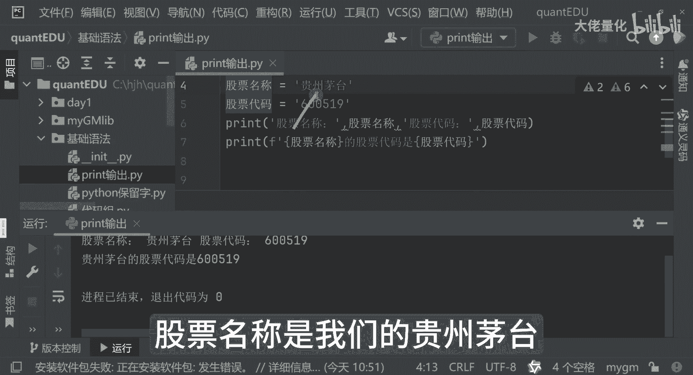

股票代码是这个，为了方便让大家看的更清楚点。

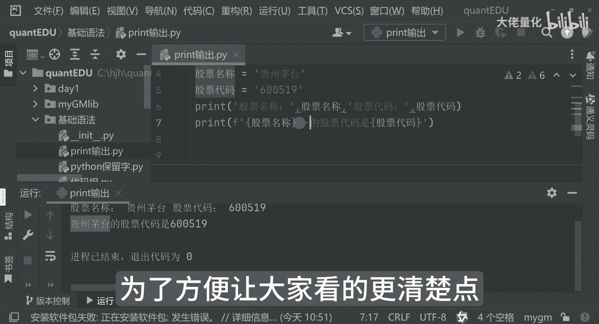

我在前后都加一个横线，看这块的变化，这里的变化输出好。

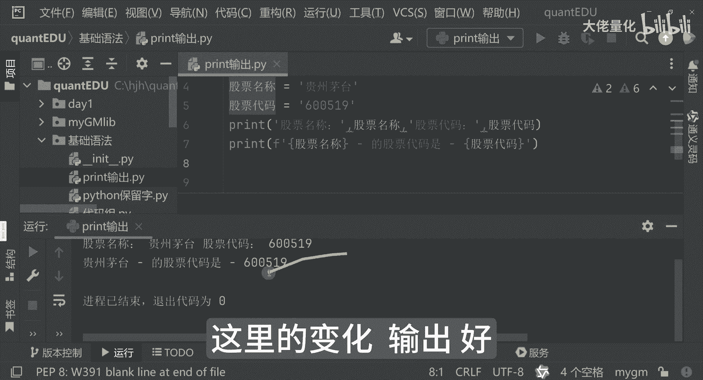

这里边贵州茅台这个股票代码，这个好，这个就是我们的print输出。

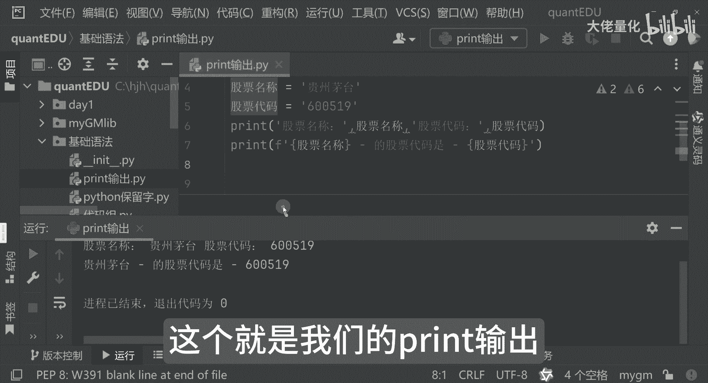