# 量化交易入门到精通22-python基础语法import - P1 - 大佬量化 - BV1vytVetEmZ

接下来再看另外一个知识点，那就是report和from，那这里面是什么意思呢，在Python里面，那Python真的强大之处，在于说高手们或者是这个相应的团队，把这个开源精神，把很多非常优秀的一些包。

已经在Python里边来进行一个打包，这个所谓package，但打包来讲呢，我们也分为两种，这个也并不是所有的大神都是给你免费开源的，叫open source，开源的，那有一些其实是必然的。

los source实际上是不提供源代码的，但是你是可以用，当然开源来讲也是有各种开源协议有很多种，比如说常见的啊协议发起协议，还有很多种协议，很不好意思，这里面有很多商用的是收费的。

然后呢我们在这个引入的时候，除了引入第三方的包，第三方的库还可以引入我们自己的库，接下来我为大家演示一下啊。

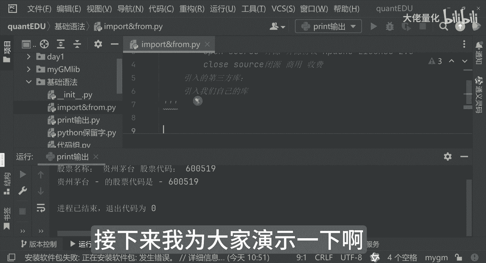

比如说我们之前算了一下，5日均线的一个程序哈，Import。

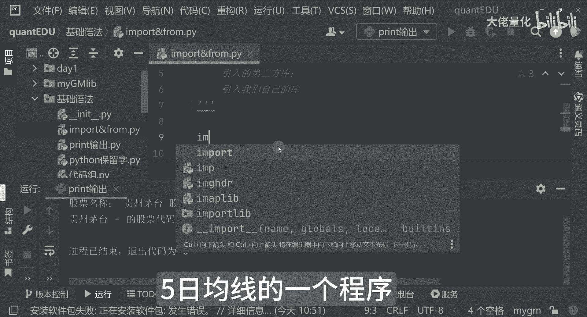

首先这是关键字import anders，然后as s p d这个名字其实无所谓的，就是我叫pd或者是叫做my pandas都可以，都无所谓，然后我们刚才引用了我的t lab tlab import。

比如说我们SMA，你很好奇，那我怎么知道它里边就是一个from这个t lab包，里边他就是个ISMA呢这么一个东西，那我们用多了自然就知道了，当然还要查些官网资料哈。

那第一种形式受到ROM indesport and co，酷酷酷好嘞，然后这里边呢处理我们的一些相应的A股数据，是完全可以用它搞得定的，处理数据这块是非常擅长的，然后ta lab来讲呢。

这里边它是一个通用的计算呃技术指标的库，那这里面SMA是用来计算我们的一个计算，平均移动的一个均线啊，这是他的最核心的价值，我们现在做一个示例哈，比如说my pandas。

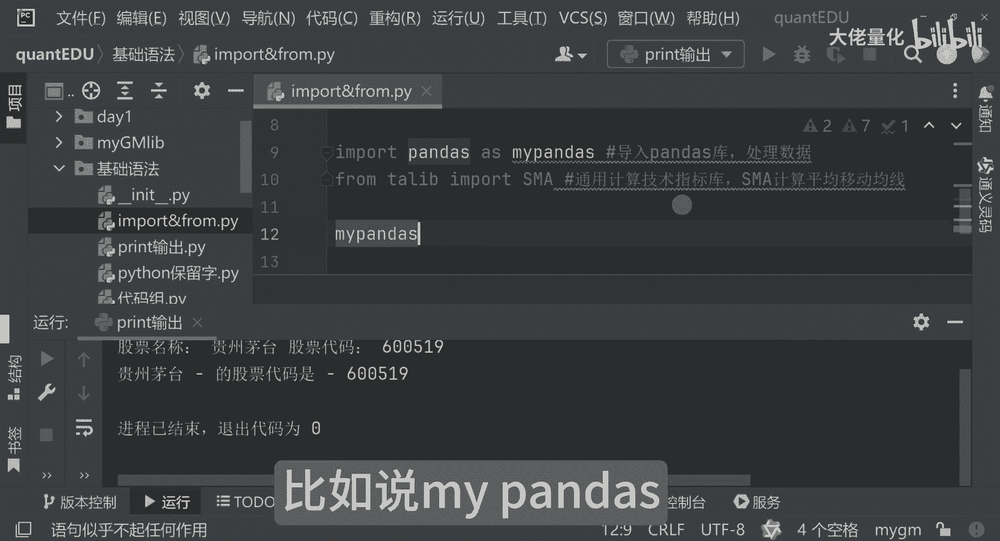

my pandas点，那其实就是我们pandas这块啊，那导入我们pandas，那pandas里面有很多的包，比如读取我们的excel的F呢，代表的是function，这里边还有很多啊。

包下面你看那进度条你就知道了，它下面有很多我们pandas来讲的。

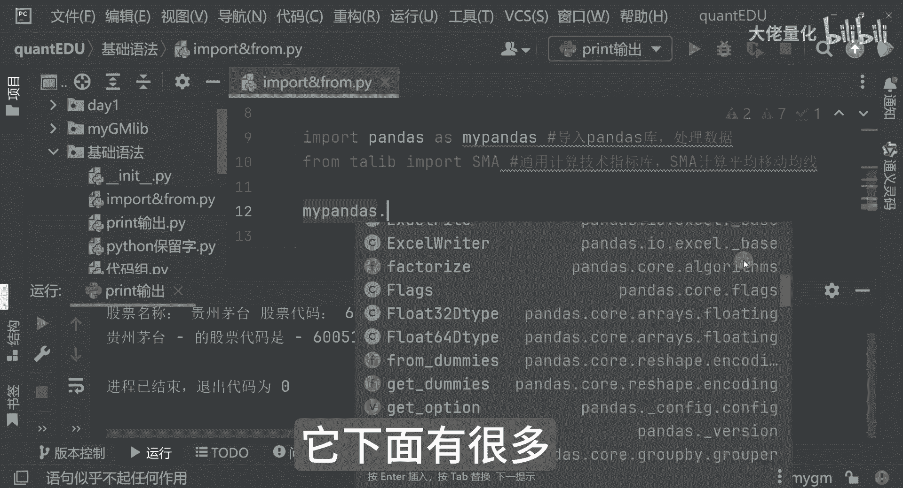

比如说data frame，这里边你可以看到这个是专门处理，生成我们的data frame里，这里面随机写一写，比如说这样子我不需要这么多，我不需要两层，我需要一层就够了，现在是收盘价close。

比如说写了十块，12块，13块，15块，14块，11块，假设是这么写了，那这里边它就会生成一个就是data frame，就是DNF是data frame一个缩写，那我们看一下现在的DF是什么内容啊。

看一下现在DF是这样的一个形式，你看close就相当于我们excel里面，你可以把它想成excel，就是它的一个列名的close，然后它里边一行一行的哎，我说这是程序里面都是从零开始哈。

那第一个就是十块，第二个就是12块，第三个呢就是这个什么呢，就往下排哈，刚好这里面有六组数据啊，那我们现在要做的是什么啊，计算的一个ma5。

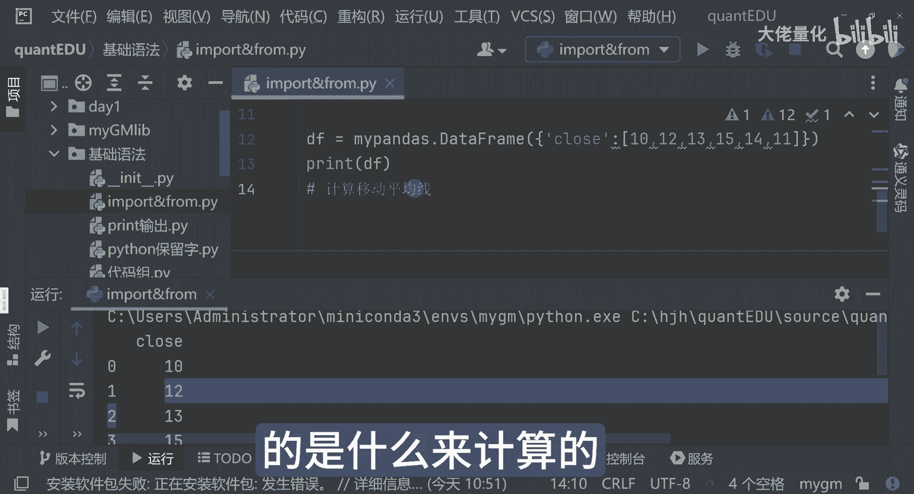

我们就看一下，在里边这AI真是不得了。

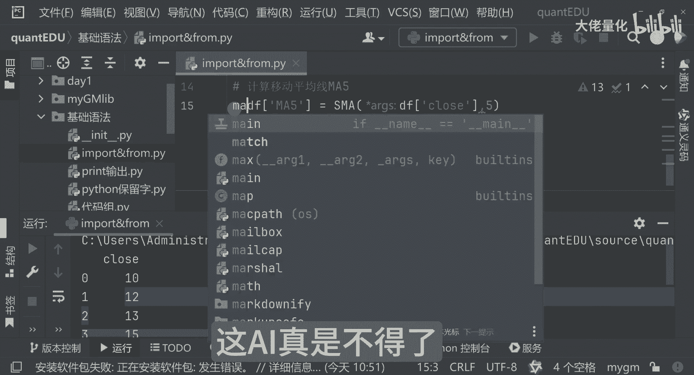

我就说这个以后吧，程序员迟早要失业了，你看见没，他是完全精准的，知道我想干嘛，我数数出来啊，mu5好，他只输出了一个float类型，我看一下啊，他其实已经把内容上输出出来了，我把这个完整的信息拿出来。

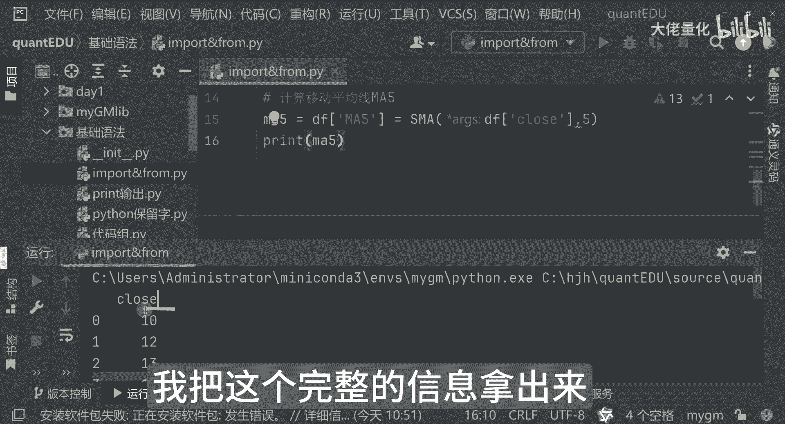

这是我们执行后的结果，大家看一下，双击这个文件啊，会全屏啊，你可以看一下，我们是到这里把这里边内容都打印出来，那我们执行完这个计算ma5的程序之后。

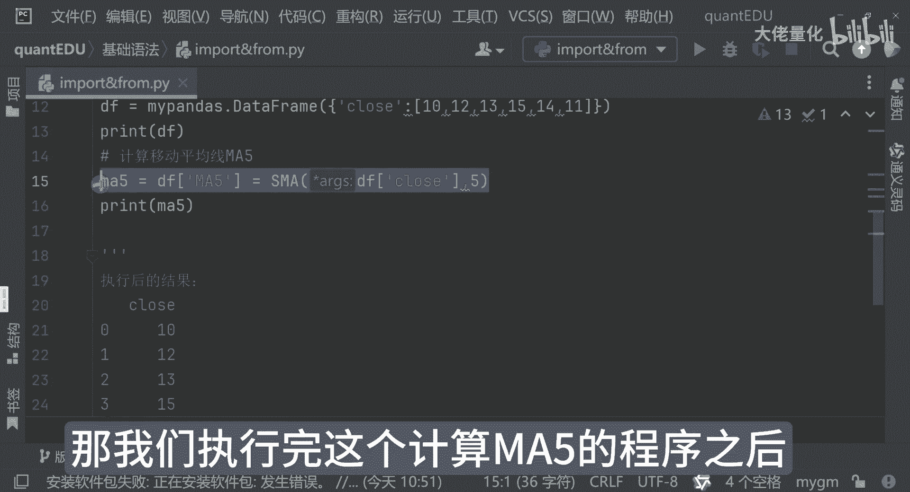

也就是from t lab import，我们的SMA这个包。

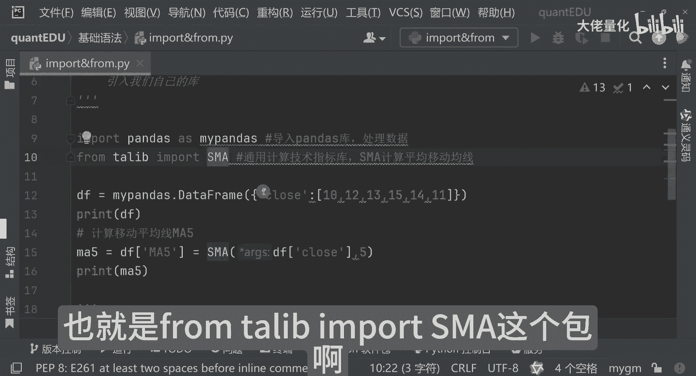

大家可以看一下啊，他就把01234他就算出来，第一个MV5的移动平均线就是12。8，12。8，怎么计算出来的。

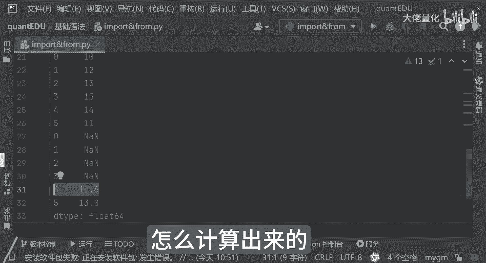

我们可以看一下计算踏实实算的前五天啊，我们先算一下啊，这是10+12加上13+15，然后再加上幺四，算出这个64，那我们再除以52。8和这个12。8，就是完全能对应上，那他后面的13是怎么算出来的呢。

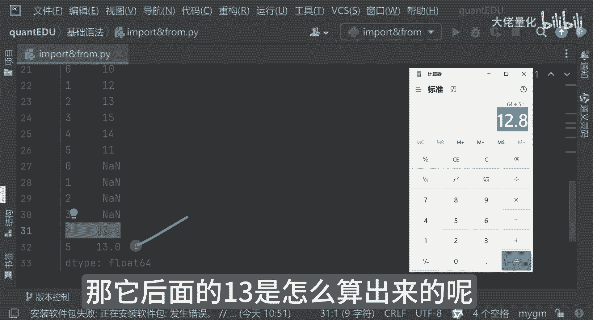

13实际上它是从从十二十三，十五十四十一，把这几个数加在一起之后，他算出来13，但这些来讲呢。

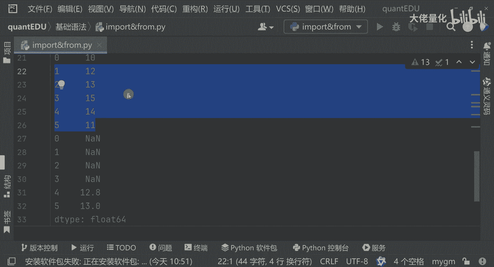

我们用程序写当然是可以的，是没有问题的，但是呢这里面最大的好处就是说。

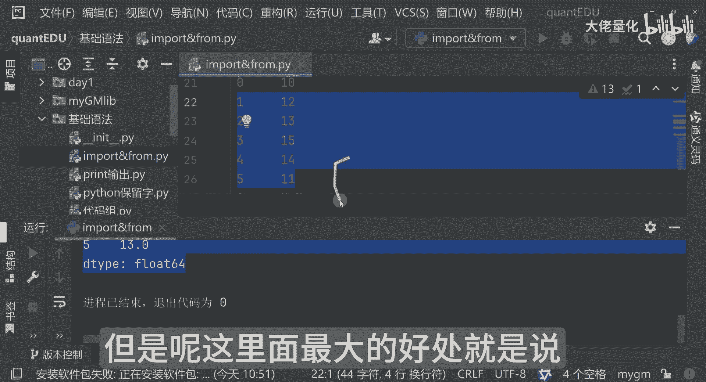

因为通过这个包之后，它可以很快速的帮你直接算出这样的一个程序。

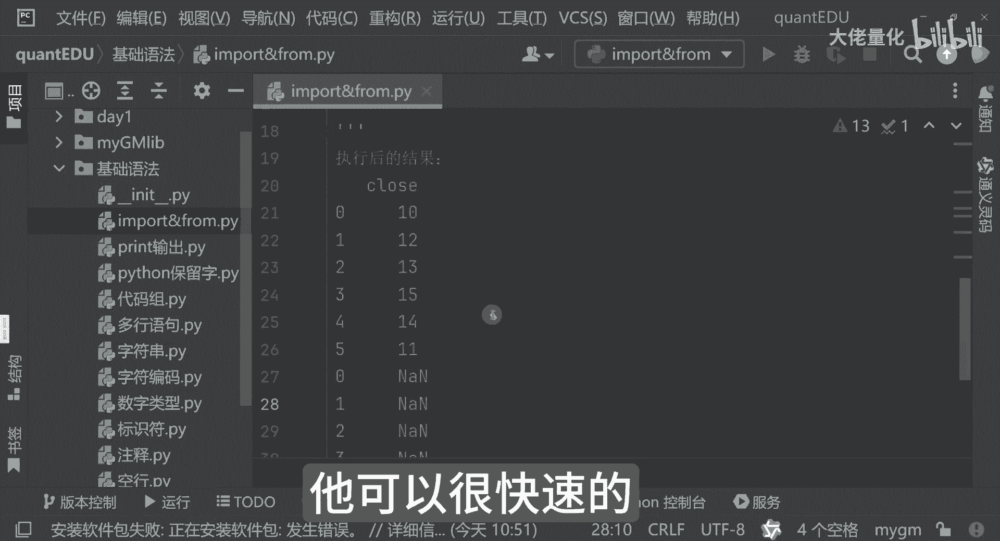

而导致了你最终的一个呃非常好的结果。

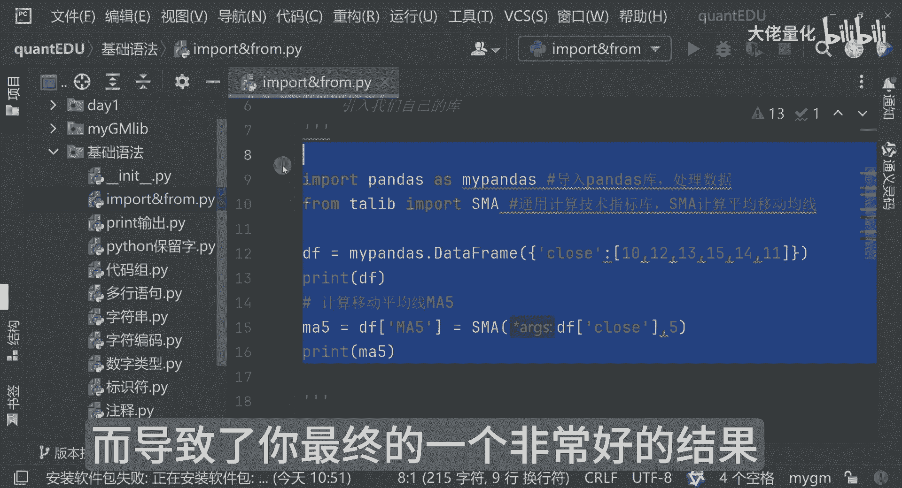

就是让你的代码是非常的清晰，非常的精简，比如说我现在把它再随便复制一点点啊，可以看一下这里边好，我现在不想算MA5了，我现在想算我的这个ma10是吧，那其实同样的代码在这边，我只需要改个参数而已。

我只要把五改成十就可以看最终的结果。

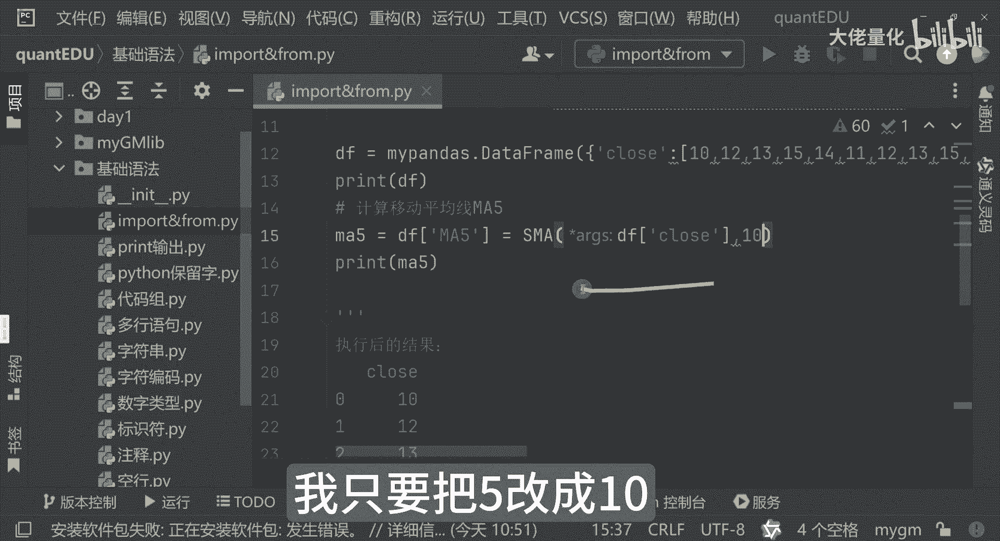

这里面他把最终结果也打印出来了，你看到这边他告诉你说前十天就是12块，九毛啊，13块等等一系列网络算。

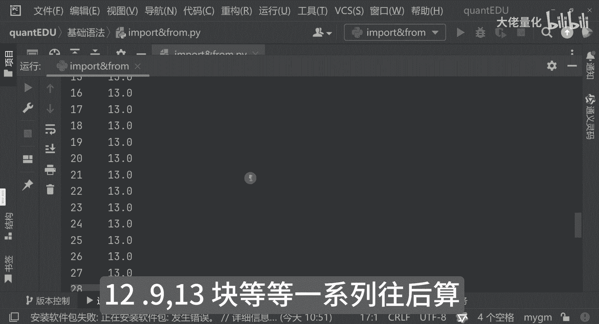

其实这里边来讲呢，就是说我们可以借助前人的一些经验。

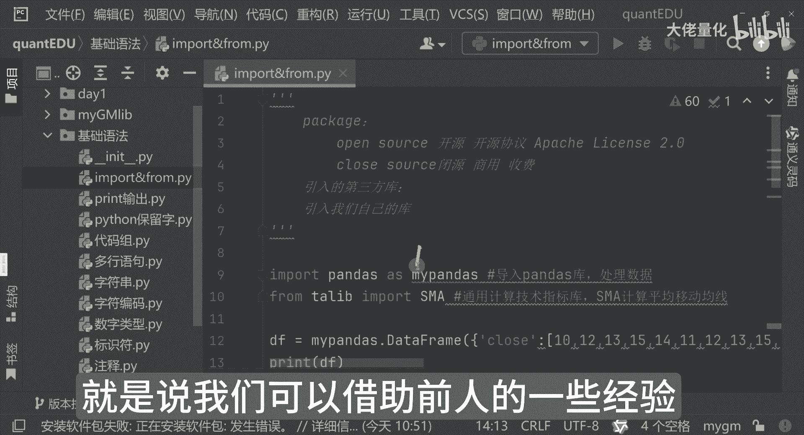

那完成我们的先人的功能啊，这是我们这个大的目标哈。

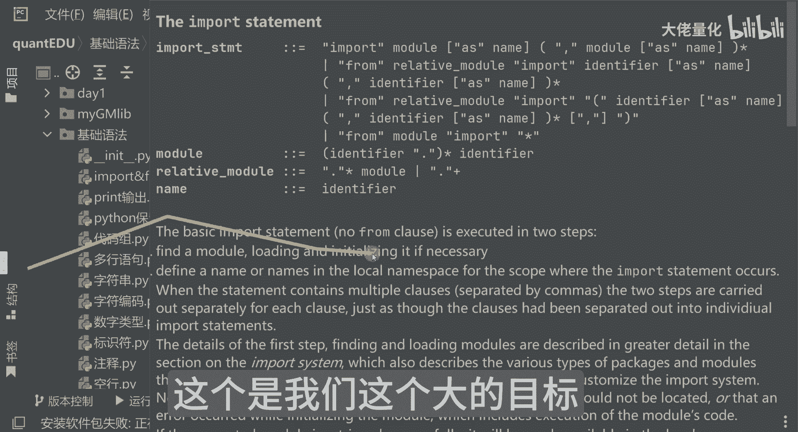

那这个就是我们import和from import的一些用法。

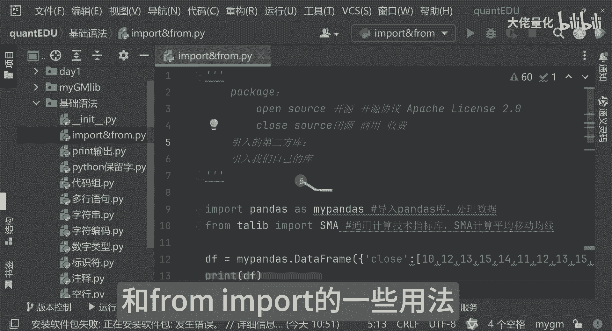