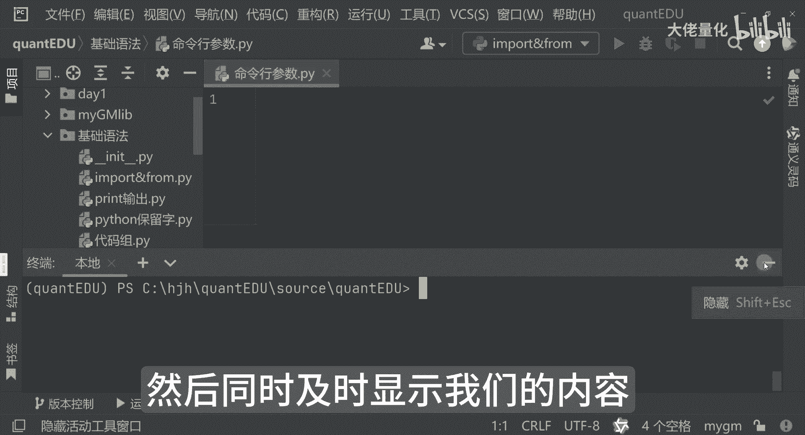
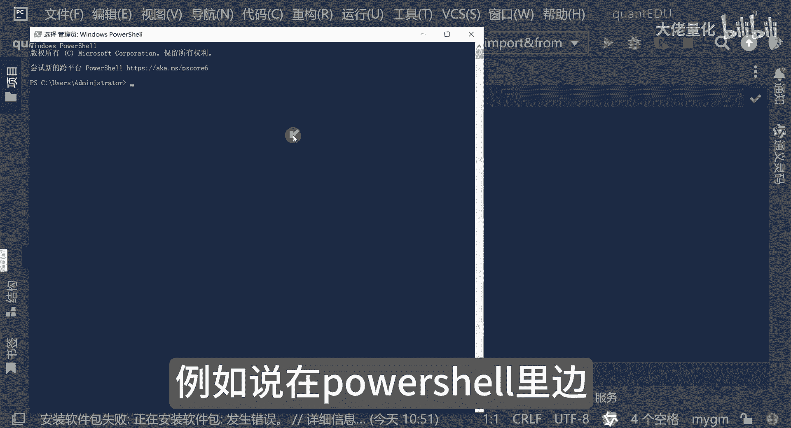
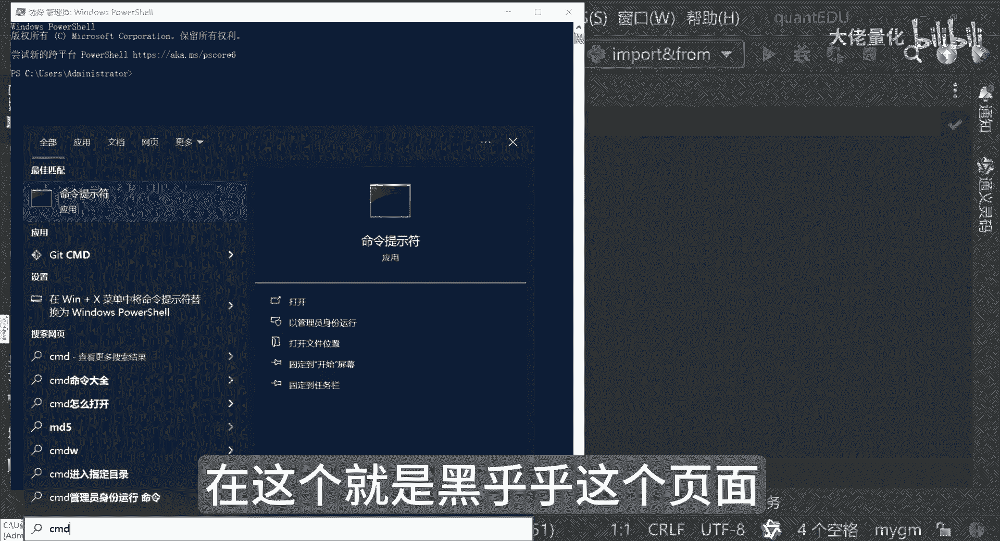
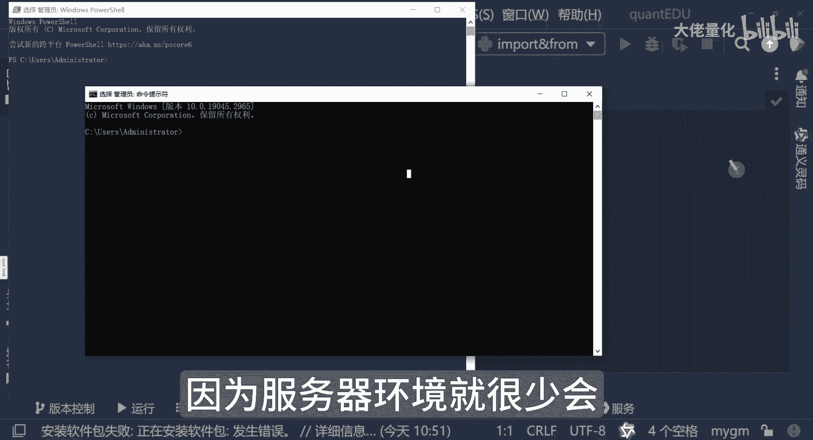
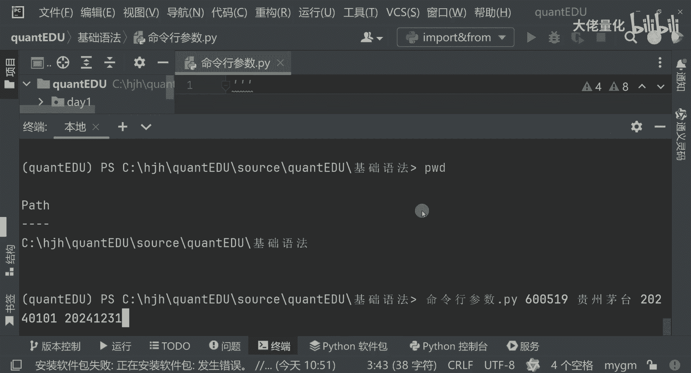
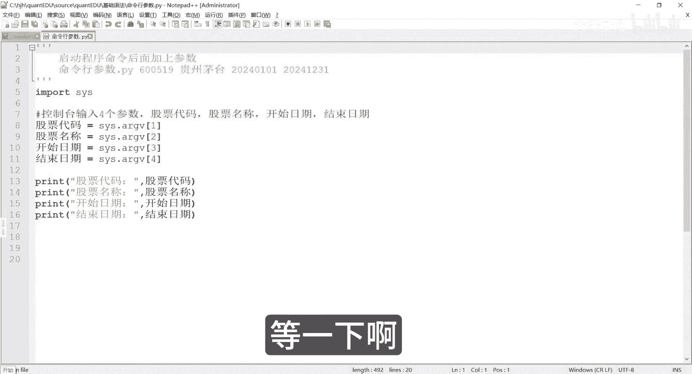
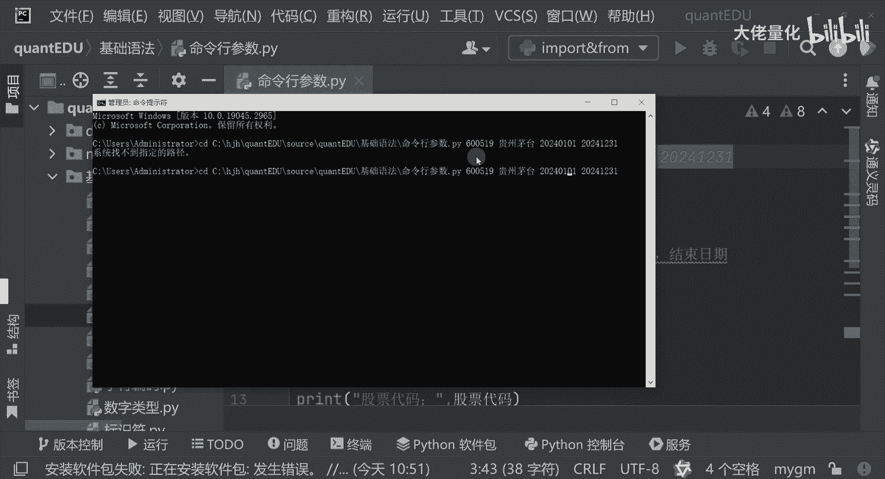
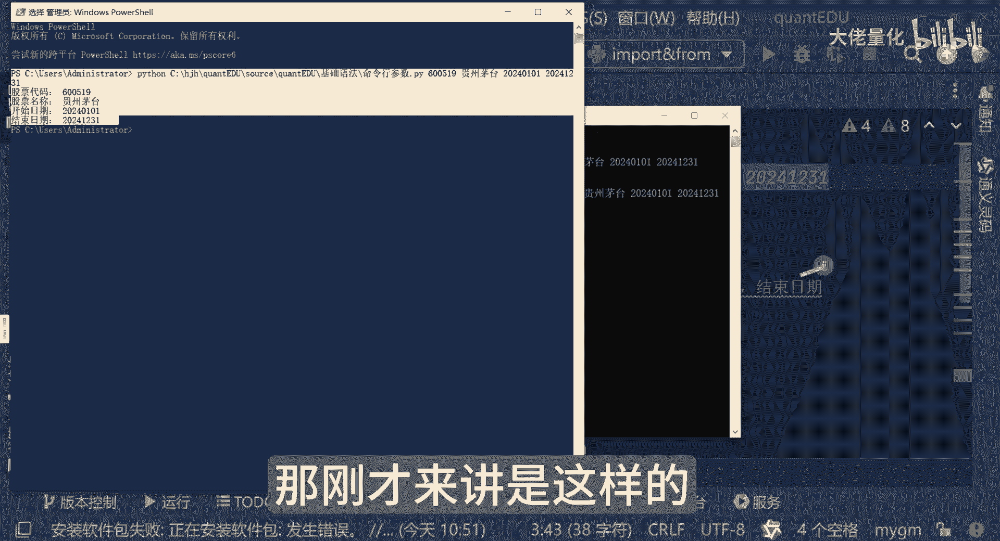
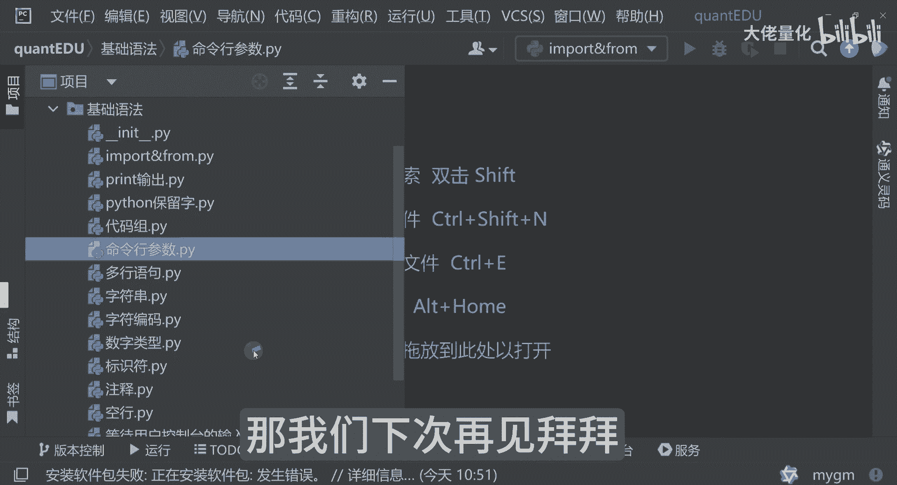

# 量化交易入门到精通23-python基础语法命令行参数 - P1 - 大佬量化 - BV1SvtWe5EYo

我们再看下一个功能，这个也是相对比较常用的，就是我们的一个命令行参数，那命令行参数是什么呢，实际上就是在我们的这个排插里边，有这样的一个终端，那通过clear命令可以清空这个终端。

那这里边可以实现代码和人的一个交互，就像我input啊，可以看到我们输入的内容，然后同时及时使显示我们的内容。

那除此之外呢，其实还有很多种方式，例如说在HOSHELL里面。

不一定是在我们的IDE里面或CMD里面，在这个就是黑乎乎。

这个页面都可以进行一个交互，尤其在服务器环境下，因为服务器环境就很少会会装装排叉这种工具。

排刹主要是在本地的一个开发环境进行和运作，运行的时候，一般不会有那个排插这种能力啊，那我们可以看一下，就是我们写好一个策略之后，我们想执行一些参数，我们原来的止损来讲可能是5%，止盈来讲呢，10%。

后来来讲呢，我通过一个风险偏好，或者是行情的一个判断进行修改，这样来讲我不按程序的情况下，或者是我不停程序的情况下，我直接输入参数就可以了，我们举个例子，我通过命令哈，我现在输入了多少个参数。

比如说我输入的参数都是什么，我其实不止可以输入一个参数的，我刚才只是举了一个例子，其实我也同时输入多个一个参数的，比如说控制台输入四个参数，我们分别代表什么股票代码呀，名称开始日期。

然后结束日期这样一个功能哈，就是程序上来讲呢，我可以这么写哈，通过这个soy s这个包，import这个包，然后那通过我的启动这个函数的参数里边，我就可以知道这些，比如说我第一个参数是我的股票的名称。

那第二个来讲呢是我们的股票的股票代码，股票名称以及我们的开始日期，以及我们的一个结束日期，然后呢我们在最终打印的时候，可以把这些都可以打印出来，再搞一些过程名称，再打印开始日期，我可以用AI。

大家目前阶段千万不要用AI，因为这个用AI对大家没有任何好处，八家目前阶段千万不要偷懒，那这里边你会翻译问题，这里边我怎么传进去呢，是吧，刚才我讲的是这个input和这个概念不一样。

input来讲呢是你在运行的时候来传入参数，这个实际上是想启动程序命令，然后是后面加上这个参数，我当前的这个程序啊，就这个位置叫命令行参数，命令行参数点PY，这是一个Python程序，那后面来讲呢。

我根据是什么呢，比如说贵州茅台的股票代码600519，然后是贵州茅台啊，好我这里写2024年0101，或者是2024年12311号，到我们的年末是这样的一个程序，那我们这个程序该如何启动它。

然后并且让他展示这些内容呢，哈我可以把这句话复制一下，然后放到我们终端中，那这里边呢，我们要首先要先跳转到我们的一个基础语法，这里，我们现在就进入到我这个里边了哈，可以看到我们现在有这么多。

现在看到了这个命令行参数，这PY这个程序就在当前的我这个目录里面，去WD下可以看一下这个，然后我把我刚才复制的那条命令我粘贴进来，也就是命令行参数，再加上这个参数，有四个参数，那我看现在有什么回车。

哦有问题等一下啊。

这样子我现在把它粘过来，我CD一下就是change directory，现在是把我的文件夹切换一下，然后把这句话再粘过来啊，试一下啊，啊不好意思，这前面是需要Python。

这就可以了，大家看到了，然后同样代码呢复制一下，把它放到power shell里面，Python来讲呢就是Python的这个命令，那下面后面来讲呢是我们的Python代码名称。

后面这四个是跟着我的一个参数，也就股票代码，表盘名称以及开始日期和结束日期，那我先点回车好，这也可以输出了，那刚才来讲是这样的。

这里边是点击我们的终端的时候，因为我直接敲的是这个虽然是在这个目录，但事实上我是少了一个Python的命令，我这里面应该敲个Python，他才知道用Python来解释这个命令，否则来讲呢。

你看他实际上他用这个记事本，把这个代码打开了，也就是把我们那个代码打开了，好我现在用了Python之后，点回车，这里面就可以实现我们的目的，好整个Python基础的部分相当于给大家过了一下。

那python3来讲，大家不知道是不是觉得很简单啊，这个呢大家一定要记得，一定要多多练习，多多实践哈，那量化大门呢也正在向大家逐渐打开啊，也欢迎大家来转发评论关注哈，谢谢大家的鼓励，那我们下次再见拜拜。

