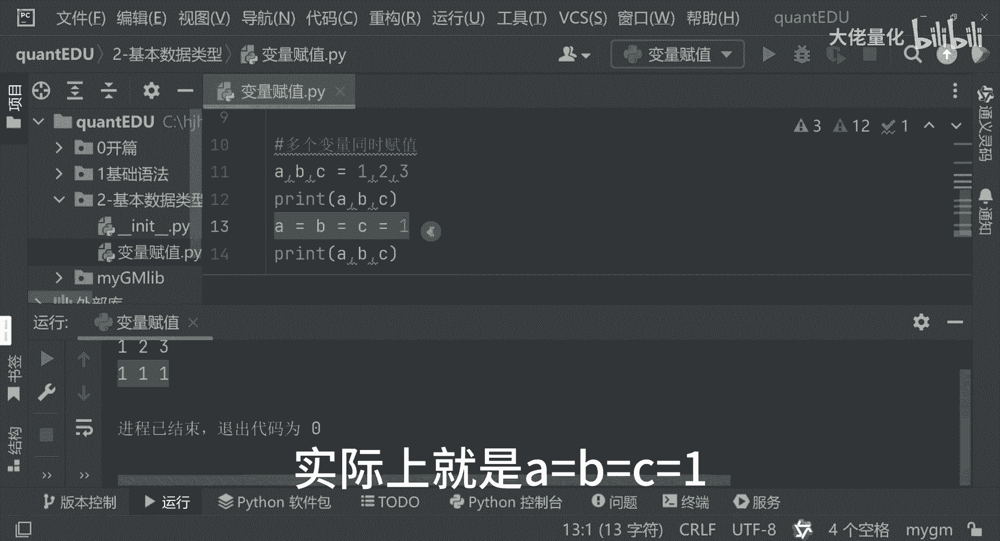

# 量化交易入门到精通24-python基本数据类型-变量赋值 - P1 - 大佬量化 - BV1Y3tfemEMK

哈喽小伙伴们大家好，今天要和大家分享的是基本数据类型，我新建一个包，老规矩叫做基本数据类型，那首先我要和大家介绍的第一个就是变量赋值，变量赋值的方法可以看一下哈，比如说我们的counter等于100。

我们中文大概可能好理解一些，计数器等于100啊，米等于1000。0米，然后呢我们的名字大佬莲花boss cha，那计数器呢就是我们100米就是1000。012，然后名字呢就是我们的大佬量化。

那这三个代码分三个变量，那分别储存我们的整数浮点数，以及我们的一个字符串类型，这是个字符串，然后还有一种写法，就是多个变量的赋值，多个变量同时复制，你比如说A等于B等于123，那这种是种方法。

那同时来讲呢我们可以这么写，A等于B等于C啊，等于C，那等于什么呢，我等于一，这这几种方式是都可以的，那我们去把它打印出来，我打印一下哈，那ABC分别等于什么，然后我再把这边再打印一下，ABC等于什么。

直接输出了，第一个来讲，其实就是我们ABC分别等于123，直接复制的，第二行呢是我们的三个E，那实际上就是A等于B等于C等于一哈。

这样把三个变量都给赋值了，这是一种连续的一个赋值。

