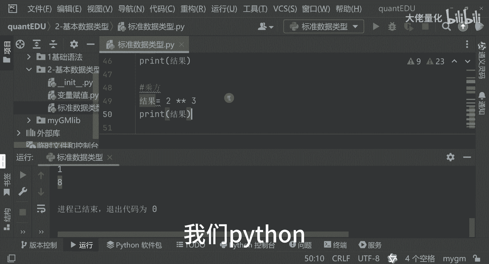
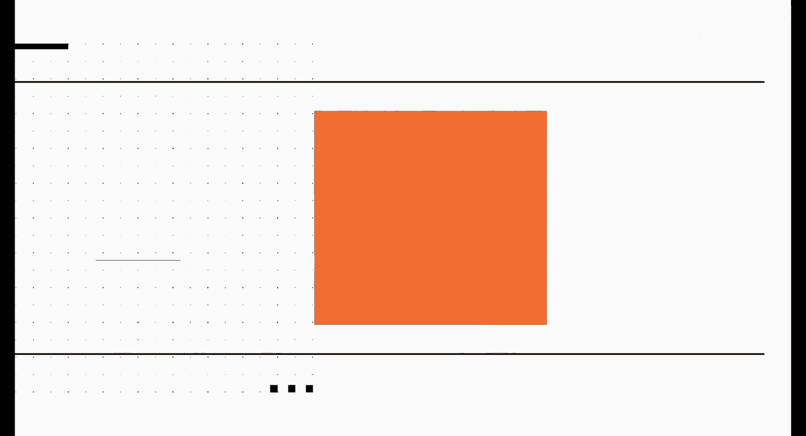

# 量化交易入门到精通26-python基本数据类型数值运算 - P1 - 大佬量化 - BV1dKtSeFEdn

我们再看一下数值运算，那数值运算来讲，就好像我们一个计算器或者是excel一样，你比如说我RES啊，result结果吧我都用中文，那比如说1+1等于几啊，那我打印一下好，51+1等于几。

那这个其实很简单，我直接看是什么呢，是二对吧，是二，我再把这个分隔符拿过来区分一下好，1+1=2好，我再判断一下啊，减法把它复制过来，这是加减乘的话，我就改成别的啊，比如2×3哈，加减乘除除的话。

比如说10÷2，大家看一个结果，大家可以看到这里边就是说那1+1，还有一个是1-1=0，还有一个2×3，这里面等于六，然后加减乘除写错了，这是除除呢，你会发现这个是等于5。0，这几种都是比较常见的。

加减乘除好，我们再看一种，就是这种写法，我备注一下哈，除法二伯是可以这么写的，写两个竖线哈，那我们看一下啊，刚才输出的是5。0吗，你会发现我再次输入的时候，你会发现它变成了五，那除法一来讲呢。

它的输出结果呢是个浮点数法，那除法二呢他这种输入写法它是个整数啊，然后还有一种写法呢，我们其实不太常见的一种写法呢，就是我们的这种取余啊，你看一下我们的十对二取余呢，发现是等于零，那好那我现在10÷3。

10÷3，那它取余会等于多少呢，我们看一下这里面等于一对吧，是这样的，这是我们数学常见的一个区域的那个公式哈，然后下面来讲呢我还要再演示一下，就是我们的一个就乘方，其实就是一个幂运算哈。

我还是拿这个结果为例啊，我把这个代码复制过来，然后这里边来讲呢，我我算个小一点的值，大家容易计算，口算可以算出来，你比如说二星星二，你看大家看看这个结果是什么好，这是四是吧。

哎大家感觉说二星星二和二星二没什么区别嘛，对不对，那好那我现在把它改成三了，这是星星，大家可以看一下，等于八对吧，其实他就是二的三次方，就是2×2乘二乘，我们Python哈就是有多种运算方式啊。

大家可以看到哈。

