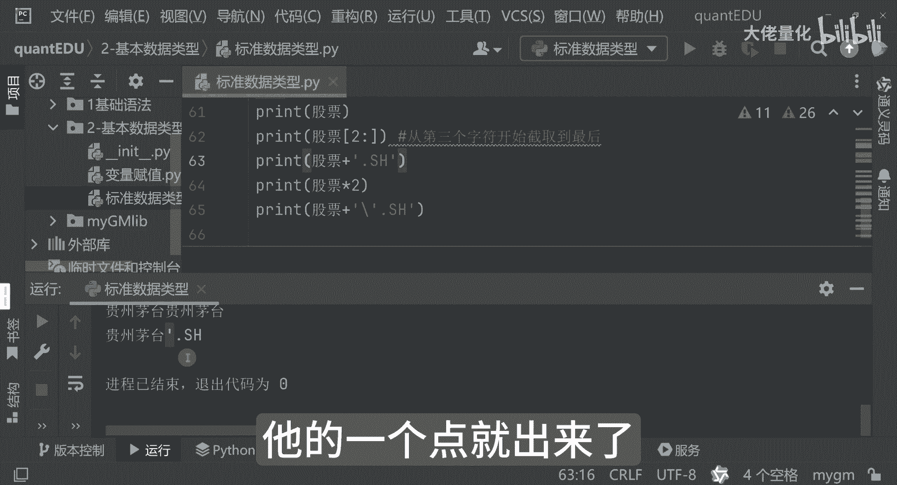

# 量化交易入门到精通27-python基本数据类型字符串 - P1 - 大佬量化 - BV1rZsDeYEvb

再往下看就是我们的一个字符串，其实字符串来讲呢，我们在演示过程中已经见过很多次了，那Python中的字符串，那就像DA中的一个票一样，那之前我也举过例子，你比如说我们的贵州茅台工商银行。

那这里边呢是用单引号或者双引号，是反斜线啊，这样呢就是进行我们的一个转译啊，大家可以看一下啊，你比如说我这个贵州茅台吧，好吧，贵州茅台，那贵州茅台我们先打印一下，我再把它复制一份。

这两种写法你会发现应该是出现两次的，贵州茅台，其实这个单引号和双引号的，那这里边是差不多的，然后我们可以再演示另外一个功能，是我们还是以它为例，那这里面来讲呢，我们可以展示我们的一个就是取多少位的啊。

你比如说以二这样为例，那这样来讲呢，看我们对这句话，贵州茅台二它之后，那可以看到，其实这块来讲是从我们的第三个字符开始，截取最后面的内容哈，就是这个切片从第三个字符开始截取到最后。

然后我们看一下它里面会输出什么内容，哎茅台对吧，这就是最终的一个结果，然后再往下来讲呢，我们再看下一个功能，就是我们的字符串里面也是很常用的一个，拼接的功能哈，那好你比如说我们的一个加号贵州茅台。

比如说这么写吧，好跟追加一个结尾点SH哈，好OK这个是可以追加上去的，相当于是说字符串来讲呢是可以string类型，可以用加的方式可以加上去，那刚才来讲呢，我上面也有演示哈。

我现在是刚才成了一个星乘以30嘛是吧，那我现在来讲呢用这个贵州茅台，我乘以二，大家可以看一下输出什么，你看贵州茅台，贵州茅台，那相当于是说乘二呢代表是输出两次了，然后另外来讲呢。

这里边其实还有一个是反斜杠，反斜杠呢可以代表的是我们的一个转移字符串，那这里边来讲呢，你比如说我现在我是想我还是以它为例哈，转移字符哈，那我现在呢我就想拼的是一个逗号，我不想输出那个哈。

我想再输入这个号，你发现报错了已经对吧，他告诉你说哎我后面应该是有个括号的对吧，那事实上来讲呢，我是加上一个反斜线之后，你发现就不报错了，那不报错呢，这个就作为一个正常的一个字符串，一个点了哈。

好那我们看一个输出结果哈，看输出结果会是什么，好NFYYY这个点就出来了，对不对，他的一个点就出来了。

这是这样的。

