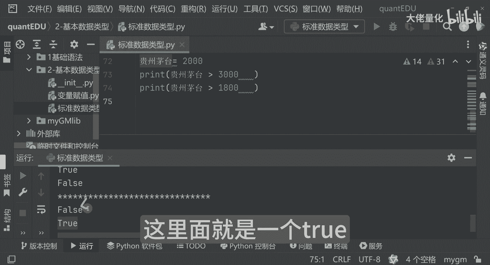

# 量化交易入门到精通28-python基本数据类型布尔类型 - P1 - 大佬量化 - BV1ENsheMECp

看一下啊，就是我们的一个布尔类型，那这里面其实刚才我也有演示啊，呃比如说真的假的，然后这里边来讲呢，比如说我们看一下，那真的假的真的我我再来一个啊，假的好，OK那我们现在看一下。

他最终真的假的会输出什么，大家可以看到啊，那真的就是true，那假的呢就是false，这个就是我们常见的一个布尔类型，然后这些来讲呢，你比如说我们常见的来讲呢，你比如说哎我贵州茅台现在多少钱了是吧。

那我们可以看一下哈，假设哈我们定一个变量啊，然贵州茅台假设他现在等于2000，然后这里边来讲呢，你比如说这么写吧哈贵州茅台那是否大于3000，我这里边再打印一下，这个看一下贵州茅台是2000吗。

是否大于3000呢，我们可以看看结果，这里边呢是false就是假的哈，好那好，我们再把你复制一份打一下，那告诉你贵州茅台是否大于，比如说1800呢，那我们看一下这里面就是一个true啊。

这就是true和false哈。

