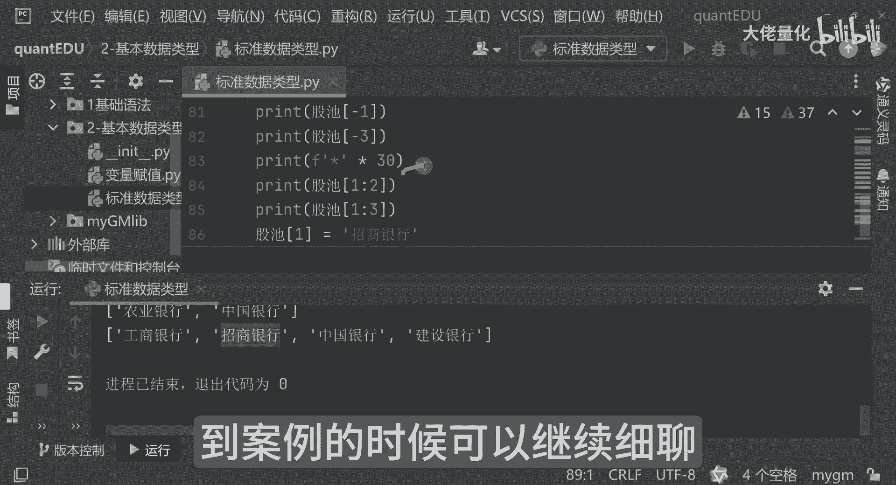

# 量化交易入门到精通29-python基本数据类型列表 - P1 - 大佬量化 - BV1wTsqecEsX

这个就是列表哈，列表呢其实就是我们的一个list啊，我们可以看一下list，其实也是我们非常常见的，比如说我这么写吧，大家可以清楚哈，你比如说我现在写工商银行，农业银行，中国银行，然后建设银行。

记得这个符号是一定要用英文的哈，用中文点它会报错的哈，你比如说我的股市，就是呃这个大A中的一个票池，就这些哈，然后就可以把它打印出来，那这里面可以看到我运行一下哦，它报错了哈，报错不可怕。

其实这里面写的是非常详细的哈，他已经告诉你了，78行报错了，然后他报的是什么错呢，他告诉你是无效字符，那为什么会无效字符呢，其实这里面是因为你的括号写的是不对的啊，好大家可以看一下，再运行一次。

这就这样打印出来了是吧，所以报错你记得永远是看报错第一行啊，你就可以知道是报错的原因是什么，这里面来讲呢，就可以把这个票池就可以打印出来了，就不能中间，然后那个我们可以再往下一看啊，就这么打印来讲呢。

是把所有的都打印出来了啊，那好比如说只想取票中的一个值，这是0123啊，我们现在比如打印是零，那他呢就是工商银行是吧，那我们现在想打印这个中国银行，那就是012，因为在程序里面来讲是从零开始哈。

二呢代表是中国银行了哈，可以看一下好，OK你看工商银行和中国银行就打印出来了，那还有另一种方式就是一啊，这种方式你觉得很奇怪哈，那为什么会有一呢，那一来讲，它实际上是倒着来的，你看看他是建设银行。

那好那我现在想打印农业银行，那我就直接打印一个二呃，不是一负二负三哈，那三嘛，好功能中介哈，你看大家就可以打印出来了哈，就方式有很多种哈，然后下面呢还有一种一个取它的一个方式哈，那就是说我们截取哈。

截取一部分哈，那你比如说我现在想截取啊，1~2的吧，好吧，1~2的我就打印一下，我我再来个分隔符，代码一多了之后呢，大家看起来就没有那么方便了，好我们先打印哈，反应你看1~2来讲呢。

它实际上截取的是什么呀，你看反应哦，012它实际上是一个左开闭和右开闭一样，这里面取的是农业银行，那你比如说，我现在想取的是农业银行和工商银行，那我要怎么写呢，把它改成三就可以了，好啊。

这里面只取农业银行和我们的中国银行哈，这里面是这样的好，OK然后这里面来讲呢，你比如说我们现在想把比如招商银行引入进来，好吧，我们现在把某家银行给替换掉，那我们想替换呢。

比如说想把这个农业银行换成这个招商银行，好吧，不是真替换啊，只是演示而已哈，然后那个好招商银行，然后看012，那农业银行，那我们就选一吧好吧，那我现在重新输出一下哈，好OK看一下这里面会有什么这里边哈。

那农业银行就变成了招商银行了，就这样的哈，这个就是我们的一个list的一个常用的用法，那list的来讲呢，就相当于是说你可以通过它来管理，持仓的一个组合一样哈，那可以添加，当然也可以删除啊。

这个我们后面可以到案例的时候，可以继续细聊啊。

