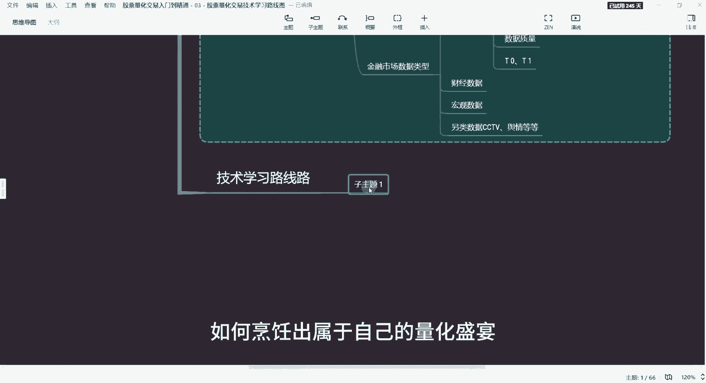
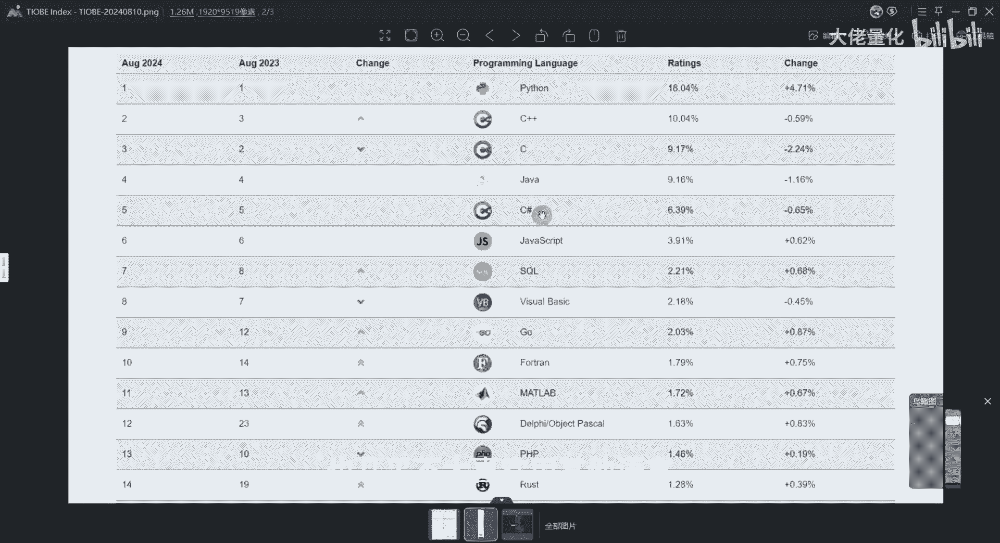
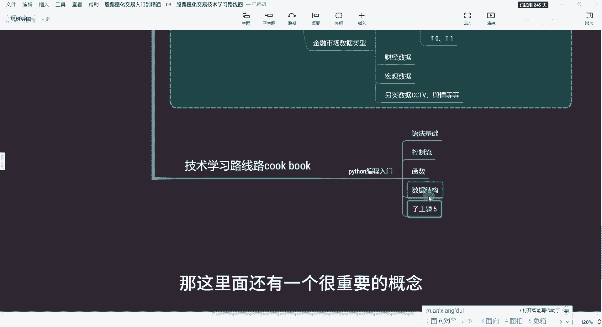
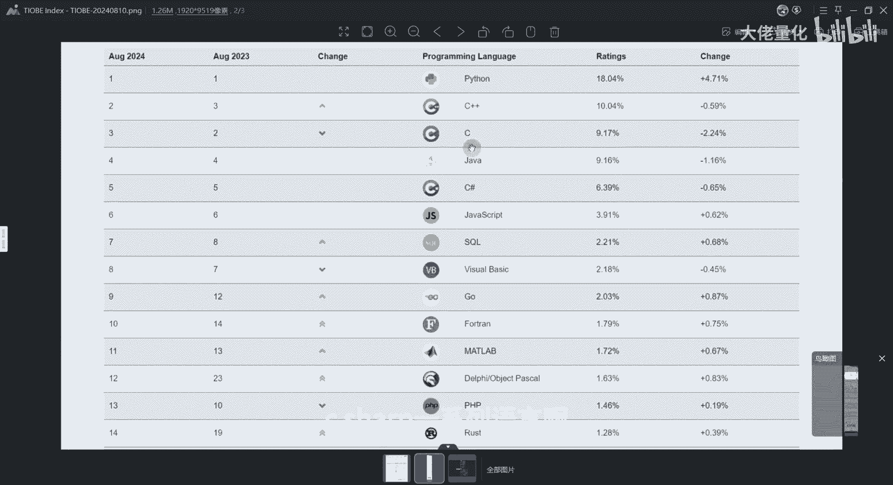
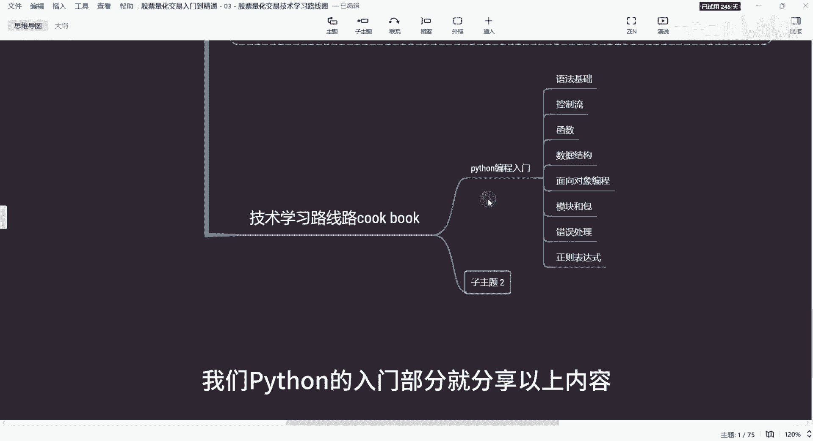

# 量化交易入门到精通3 - P1：3 - 编程基础 & 数据处理 - python编程入门 - 大佬量化 - BV1GyYJenEJZ

大家好，欢迎来到量化交易从入门到精通的课程，我是专注量化交易的速度，关注我，量化交易不迷路，之前我们讲了两节课程，一个是讲量化的基础概念，第二个金融的基础知识，本节课开始继续我们的量化交易。

从入门到精通的课程的第三课，今天我要和大家分享的内容是，股票量化到呃入门到精通的技术学习路线，我知道现在坐在屏幕前的各位，可能是对量化交易充满了好奇的个人投资者，金融从业者。

或许还有些朋友正在处于人生的迷茫期，想要突破和改变，寻找新的方向，不管你是谁啊，只要你对量化交易感兴趣，想要学习如何对Python编程程序，来实现自己的交易策略，那么你就来对地方了，很多同学问我哈。

小白如何从入门学习量化，应该学习哪些知识，从哪里开始呢，那我们今天就聊一聊这个话题啊，我将化身为你的量化大厨，手把手带着大家学习，如何烹饪出属于自己的量化盛宴。

首先我们看一下我们的第一阶段，那就是爱森生态，这里边有一张图哈，这个就是世界的一个编程语言热度的排行榜，大家可以看到2024年8月份，Python语言的一个指数已达到了10%，8。04啊，第二是C加加。

第三个是C语言啊，第四个是java，我们会发现Python已经牢牢占据了第一的位置，和第二个C加加比起来是整整多了八个百分点，这里更夸张的是在于它的一个称职，达到了4。7亿。

而且他的地位是没有任何改变了，这个和曾经的java c c加加，这三个王者都是非常了不起的一个语言，这里面可以看到编程的指数流线图，那浅蓝色就是我们的Python，我最开始关注Python的时候。

大约是在这个位置，2012年，其实当时身边朋友有用Python进行交易，但从2018年开始，Python基本是一路飙升，自从用了Python语言之后，也几乎是不太喜欢用其他语言。

Python确实有这个魔力哈，俗话说，工欲善其事，必先利其器，这个相当于是我们的扑克扑克，那我也会用比较通俗易懂的方式，来带大家进入我们的量化盛宴，首先作为一个顶级大厨，肯定要有厨具啊。

在量化交易世界里，Python就是我们最有力的厨具啊，这里边Python具有哪些能力啊，PYON的编程入门，这里我会分享几块啊，首先呢就是语法基础，Python是一定要打好这个基础。

就像我们学初的时候啊，要从刀工火候这些基本功学起练起，那学好Python呢，也就从基础语法开始学习，第一部分的Python一定是Python语法，那Python语法来讲，例如变量，数据类型。

运算符表达式，这些就好比一些食材构成美味佳肴的基础，这部分后续我会给详细的展，今天我所分享的只让大家有个初步印象，后续所有的知识点我都会详细的展开的，并且有实例代码啊，第二部分就是控制流语句。

常见的比如说if else else，If if，包括循环语句，For a while，就像我们掌握好火候才能喷出，给个加油哦，如果是没有编程基础的，讲到这里大家可能有些听不懂，如果有编程基础的。

我想这些大家应该是能听得懂的哈，那好我们继续往下，除了语法基础控制流以外，还有函数，那函数来讲呢，例如define定义啊，调用啊，包括参数传递返回值，Return。

这些都是我们学习那Python编程基础来讲，还有我们知识是数据结构，例如我们常见的数组list，元组字典集合呀，这些就像我们整个厨房里的各种容器一样，用来存放不同的食材，方便使用啊。

那这里面还有一个很重要的概念。

就是当面向对象编程了，这里边面向对象变成圆了，比Python c加加java c sharp1系列语言啊。

面向对象语言来讲呢，这里面很重要的几个概念呢，就是类class，然后对象object包括继承多态这些，就好比我们这个烹饪过程中的新法，那领悟了它呢就能创造出别具一格的一个菜肴。

接下来很重要的一个功能叫模块和包导入import，使用其他大数据，避免某些重复的工作，这个真的是非常重要的，Python真正的强大球和这个模块有很大关系，世界上有一些开源爱好者。

为我们的Python贡献了很多优质的包，包括科学学生包等等，再往下一个分享的概念就是错误处理机制，例如异常处理，包括try catch exception，异常类型捕捉和处理异常等。

这些处理将来是厨房里的突发状况，例如炒菜过程中着火了，包括燃气泄漏了，气点突发情况，避免翻车情况，那叫错误的处理机制，这里边还有一块很重要的就是正则表达式了，提到这个表达式呢，就是大家对称的表达式。

真是又爱又恨啊，恨呢是恨在他的一个语法上确实是比较反人类，而且是比较晦涩难懂哈，那爱他呢，喜欢他呢是因为正则表达式一旦掌握之后，你会发现这是掌握了要领一样，这里正则表达式，例如模式的匹配，文本的提取。

可以很快速的提取关键的信息。

