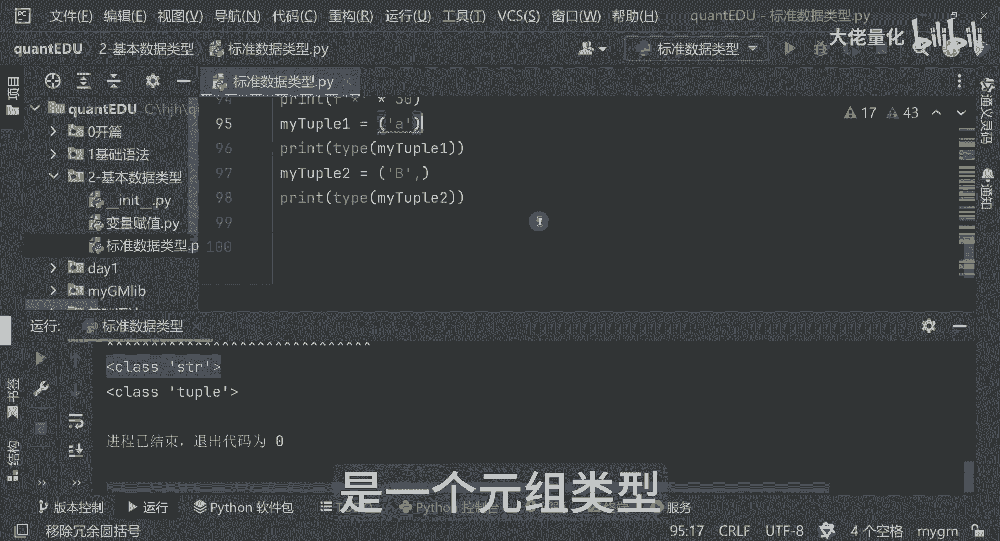

# 量化交易入门到精通30-python基本数据类型元组 - P1 - 大佬量化 - BV1FJxLeiEqs

哈喽小伙伴们，这节课我们就学习元组，那元组就好像你设定了一个止损线，一旦创建就不能修改了，人家例如我们的一个古池tap，那现在呢，我对我们的股值这个变量来进行一个修改，那根据我们的一个索引。

大家注意这是一个英文，那我们想把我们的工商银行，改成我们的招商银行，把第一个工商银行改成我们的招商银行好，然后这时候呢我们在打印，在打印我们的这个估值，淘宝这预期呢有可能会报错，大家可以看一下运行啊。

好果然报错了，那这里边呢我先把我的屏幕放大一点，看到我们的top啊，这个位置呢可以看到最后一行，就是我想把工商银行替换成招商银行，你发现说他这里面说啊，type error就告诉我们类型错误啊。

那top对象是不支持这样的一个操作，所以说这里边你看这里面，报错信息是非常详细的，他已经告诉你这是92行有报错，所以说这里面其实就是说明了，一个TP的一个特性，那就是一旦被创建是不能被修改的。

我这边写下，一旦被创建，也就不能修改，这是table的一个特性哈，这里面我先把它给注释掉好，这里面TOUBLE呢是用括号来进行，我们表示，那并且每个元素是用我们的英文，逗号来进行分割的。

那第二个特性呢就是我们的元素不能被修改啊，第三个来讲呢，就创建只有一个元素的元组，是需要在元组后面是加一个逗号的，这里边我们可以举个例子啊，比如说我们的一个买double，我现在只想建一个，你看啊。

它这里面其实是有个提示的，冗余的括号，这里面来讲的话，我现在把它加个逗号，你看这里面就没有了，那好，我们先来看一下这两种方式会有什么不同啊，我会用top1和top2，让我们先打印一下啊，好我们打印这个。

然后同样的我们把这个top2已打印出来，我们看一下运行结果哈，最后两行，等一下老规矩哈，我再加一个冲隔符好，可以看到哈，这里边看他告诉你都是TOUBLE，那如果说我把你看这里面两个对应的A和B啊。

那我现在把第一个的逗号去掉了，那好那这里面就有提示了啊，移除冗余的一个圆括号啊，那好我们现在打印看这是什么，这时候它就不是一个TP类型了，他就是个string类型了。

所以说这里面加了逗号呢是一个元组类型，那好啊。

那小伙伴们，那本节课的一个元祖就介绍就好了。

