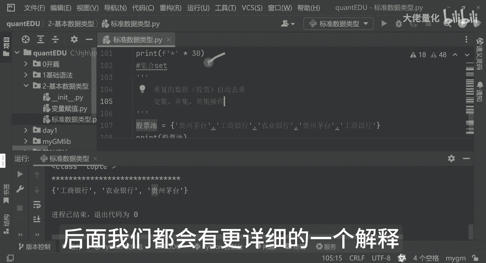

# 量化交易入门到精通31-python基本数据类型集合 - P1 - 大佬量化 - BV1BusderE25

欢迎小伙伴们回来，那我们接下来学习是set集合，那set集合来讲呢，那我们现在有一个股票池，那我们要贵州茅台，工商银行，然后是个农业银行，其他的都可以删掉了啊，不需要这么多好，我们可以看到哈。

先打印一下，我们看下效果哈，这个是我们的股票池哈，先打印一下好，我把这个分隔符加过来，是让大家看的更清楚一点啊，好可以看到啊，农业银行，贵州茅台和工商银行都有了，那好那我在我们的这个自定义列表里边哈。

再加一个贵州茅台，再加一个工商银行好，这里边我是有两个贵州茅台，两个工商银行，那我现在执行的时候会出现什么效果呢，接下来就要看一下我们set的集合的一个特性了，好你会发现依然还是我们的工商银行。

农业银行和贵州茅台，虽然我们的一个集合里面定义是有这么多的，那这里边呢我可以写一下哈，set集合的一个特性了，要重复的股票中的数据，那本例来讲呢，就是我们的个股票名称了啊，都会动驱虫的。

然后呢集合这边呢还可以进行我们的一个交集，并集差集这样的一个操作哈，后面我们都会有更详细的一个解释。

