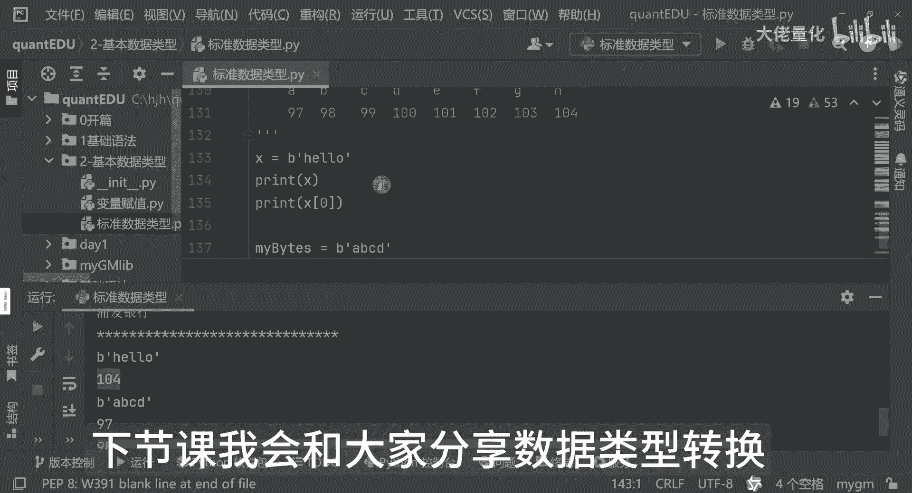
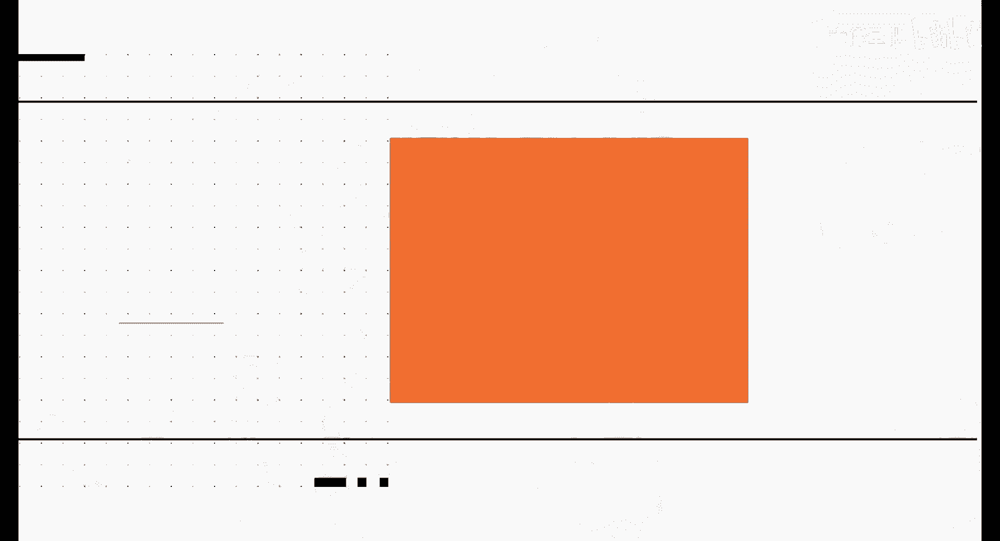

# 量化交易入门到精通33-python基本数据类型bytes - P1 - 大佬量化 - BV19LxNetEpk

小伙伴们欢迎回来，那我们这节课分享的是二进制序列，也就是我们的一个BATIS2进制，照例我们再打印一个分隔符号，那BT32进制，就像我们的一个股票交易的一个底层数据哈，这里边是不可变的。

一个二进制的一个序列，那例如来讲呢我们可以看到啊，那这里边我就可以用一个变量哈，比如说X好，那我现在X等于b hello，那我现在打印几个X，那同时打印我们这个，我们可以看一下这两个值会有什么不同哈。

我们可以看一下哈，四来讲呢，这里边是一个B其实是一个二进制类型啊，你发现发现它打印出来X呢，它是这样的一个类型啊，那打印成X0的时候呢，它实际上是104，而这里面二进制来讲呢，它主要的目的是什么。

这里边呢，其实你比如说我们从网站上下载的一些图片啊，音频啊啊视频啊这等等一系列文字啊，其实都可以转换成二进制的，包括我们的字符串啊，那这里边我们可以看一下啊，我不用，hello哈。

我比如说用我们的ABCD哈，好这是我们的一个my bad，好，让我们看一下这里边这个变量是ABCD，那好我们现在打印，我们可以看这是什么，你会发现嗯就是97了对吧，H对应的是104啊，A呢对应的是97。

也就是这个哈，那好同理来讲，那我们再把这几个值同样的打印出来哈，啊看一下，那对应的我们也知道哈，那程序里边呢是从零开始，零是对应的，A1呢比对应的B2呢，对应的C3呢对应的D好。

那我们依次把0123打印出来，我们看一下这个值会有什么不同哈，看大家有没有发现一个规律哈，九十七九十八九十九一百，对不对，那好那我们会发现一个特性哈，这个是ABCDEFBH好。

OK你会发现我们97对应的是A是不是，那98呢对应的是BC呢对应的是99，D呢对应的是100，E呢对应的是100，1F呢对应的是我们的102，好，G呢对应的是我们的103，H呢对应的是我们的104哈。

大家看到了吧，那第一次来讲呢我打的是hello哈，那这里边来讲呢你会发现哦，我打印的是104，那对应的是这个哈，那其实这里边呢这个by BIS来讲呢，这里边其实他打的二进制呢就是阿斯克码，这是一个编码。

后面我们会有详细介绍的，好第我们这节课的二进制就和大家分享，完了下节课我会和大家分享数据类型转换好的。

那我们下次再见。

