# 量化交易入门到精通34-python数据类型转换 - P1 - 大佬量化 - BV1TJxyeFEmj

各位小伙伴们，这节课呢，我们要和大家分享的是我们的一个数据类型。

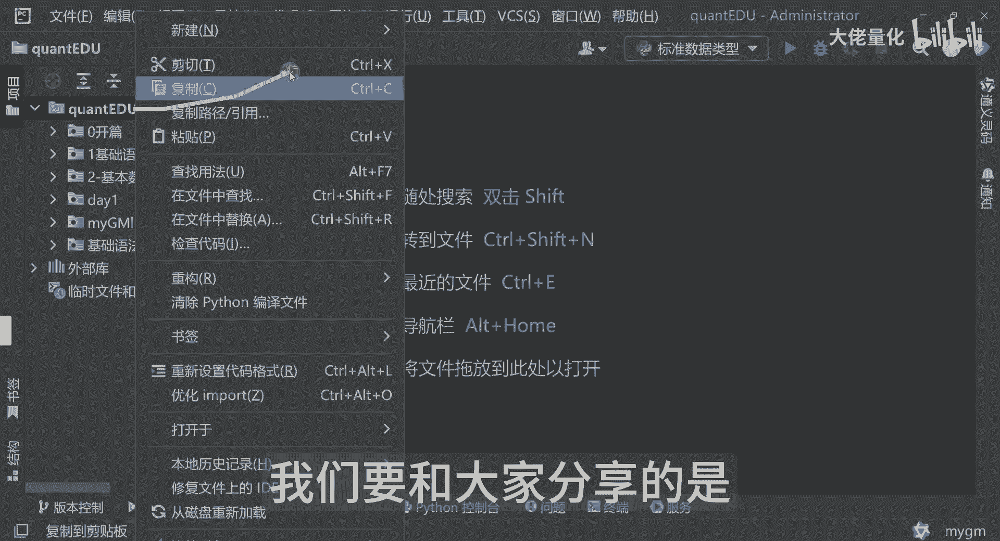

三数据类型转换，那首先来讲呢我们要知道数据类型转换是什么，就是我们每一个数据类型，它的作用和和意义是不一样的，那有的时候Python呢就像一个贴心的小助手一样，那自动的帮你完成一个数据类型的转换啊。

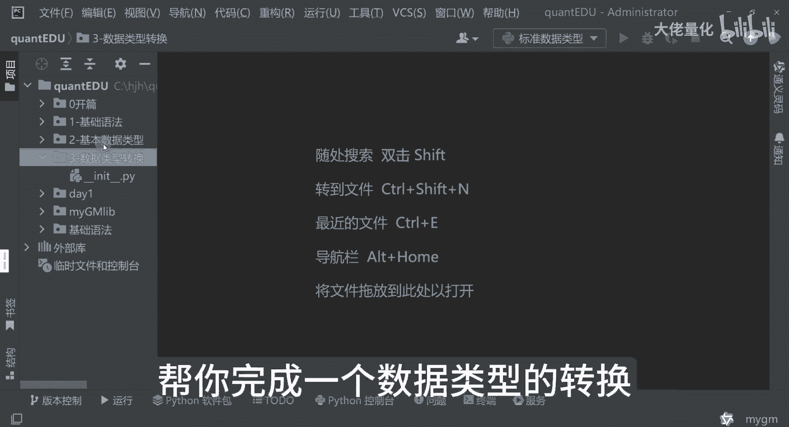

这就是我们的隐式转换，我现在新建一个文件类型。

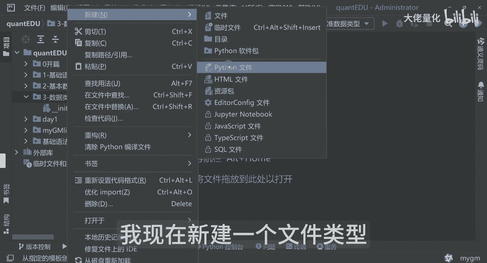

这里边呢是我们的隐式类型转换，那影视类型转换来讲呢，我们可以先看一个例子啊，我现在还用中文变量好吧，那个到后面来讲呢，我们还采用这种英文变量的方式，比如说整数类型等于我们的123啊。

这里边的一个浮点类型呢等于我们的1。23，这里边可以看到这是一个新的类型，就是等于我们的整数类型，加上我们的一个浮点类型，打印一下我们的新的类型，看是什么哈，那这里面来讲我们要除了打印我们的一个值。

还要把我们的一个类型打印出来，之前我们也讲过哈，用tab的方式可以看到，那这个呢是我们的整数类型，这个是我们的浮点类型，那整数类型加浮点类型，看下面输出会变成什么类型。

这里面可以看到它是一个float类型，那现在也很奇怪啊，就是我们的整数类型的123，加上我们的浮点类型的1。23，这时候呢我们的一个新类型，就变成了一个float类型。

那相当于是一个类型的一个自动的一个转变好，这里边我在加了个注释，那加法运算来讲呢，浮点数其实和整数来讲呢还是有些不同的哈，那浮点数来讲呢，它的精度其实会更高的，可以避免我们数据类型的一个丢失。

精度丢失就是浮点数精度更高好。

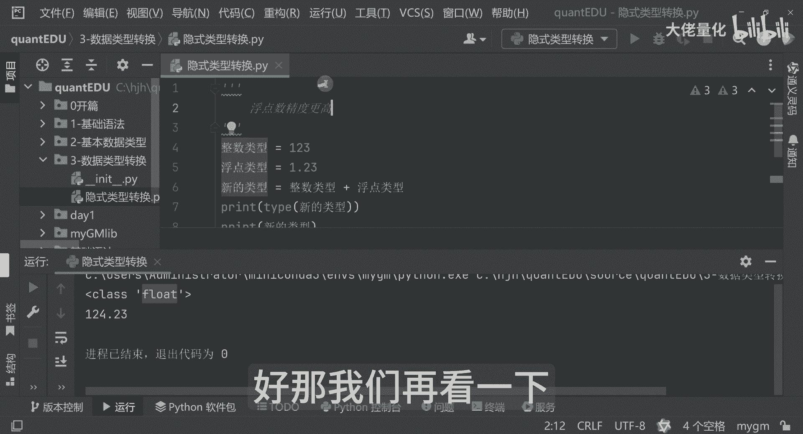

那我们再看一下哈，我把它改个名字吧，这里边还是不是叫隐式类型转换。

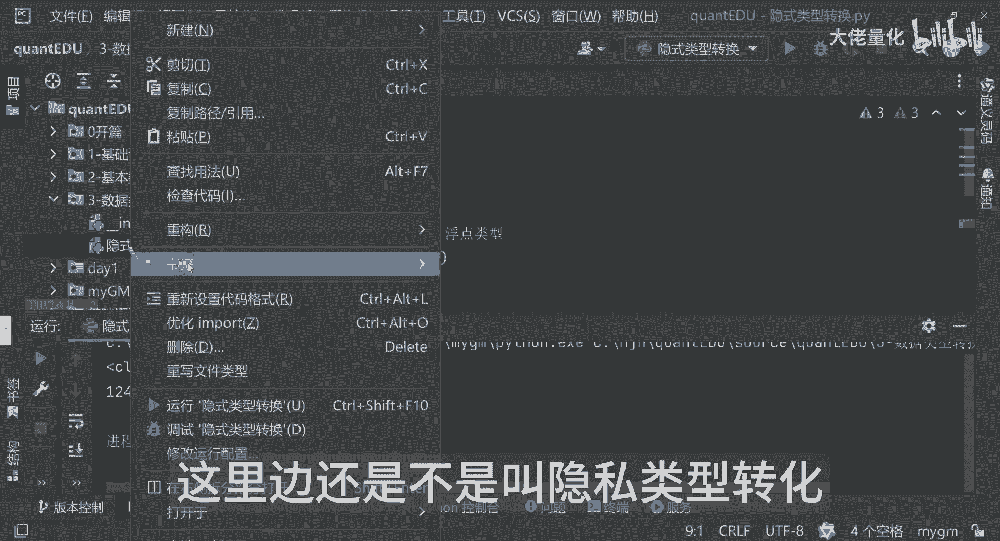

这里面就是数据类型转换，这里边我再加个注释，这是一个数据类型转换好，那我们再看下一个整数类型，我还等于123字符串类型的，有一个AABC，这里边再把这两个值进行相加，新的类型。

那就是个整数类型加字符串类型。

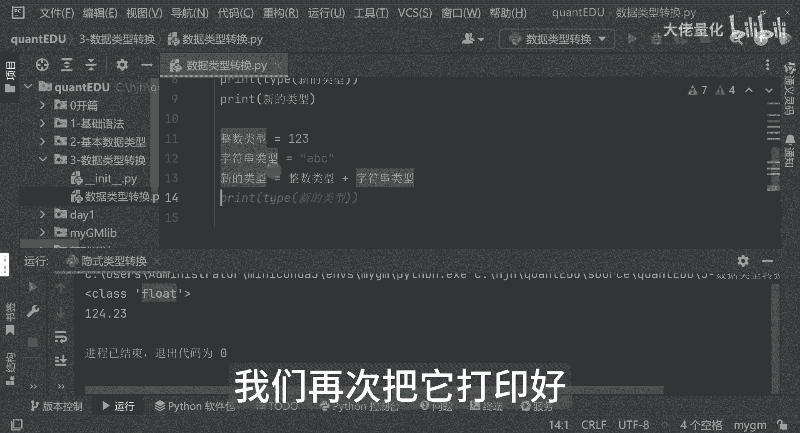

我们再次把它打印好，那我们再打印出一个类型，我们看这次的值是什么啊。

你看他现在已经报错了，这里面告诉我们就是说不支持的一个操作类型，在int和这个string类型这里面会报错了啊，就是不支持的类型转换会报错的哈，这里我先把它给先注释掉啊，否则这块会报错的。

这里边呢你会发现诶，我们的一个显示类型不起作用了，演示了一下啊，那这里边我们就要使用我们的一个，显示类型转换，然后这里边呢显示类型转换呢，Python呢其实给我们提供了一些内置的一个。

显示类型转换的一个方法，例如说我们的一个int int带括号呢是一个方法，后面我们也会有详细的一个介绍啊，还有LIFLOAT，然后还有我们的STR这样的。

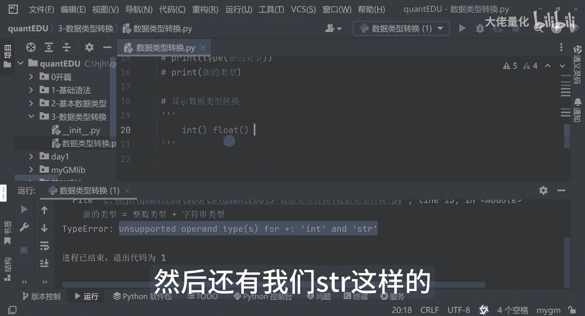

那这里边呢我们可以再看一下哈，比如说X用X了啊，我们现在就不用中文了，x x int类型Y呢等于我们的一个int2。8。

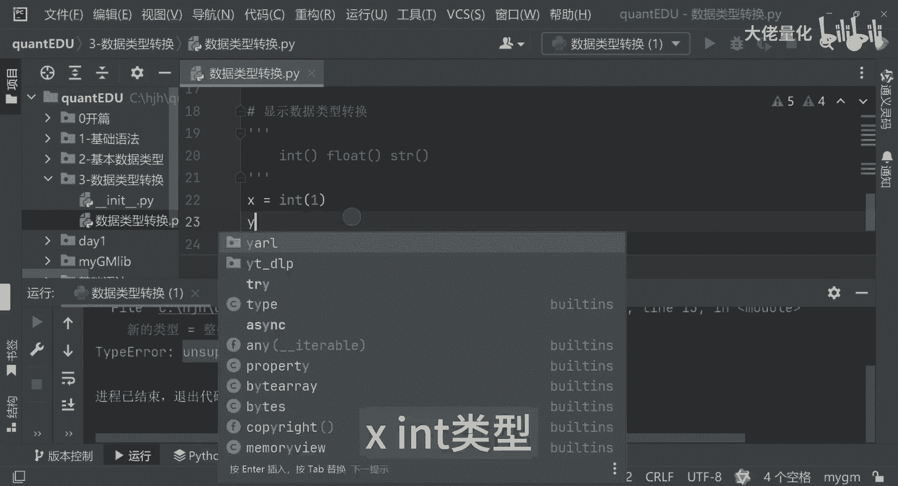

然后那个ZZ等于M的int，比如说三，那这时候呢我们把我们的XYZ打印出来，我为了让大家看的更清晰一点啊，那就是用我们的这种方式来打印，那个等于它这X然后等于它。

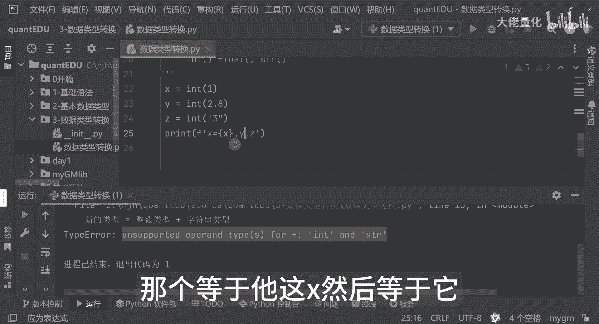

然后YZ等于它等于Z号。

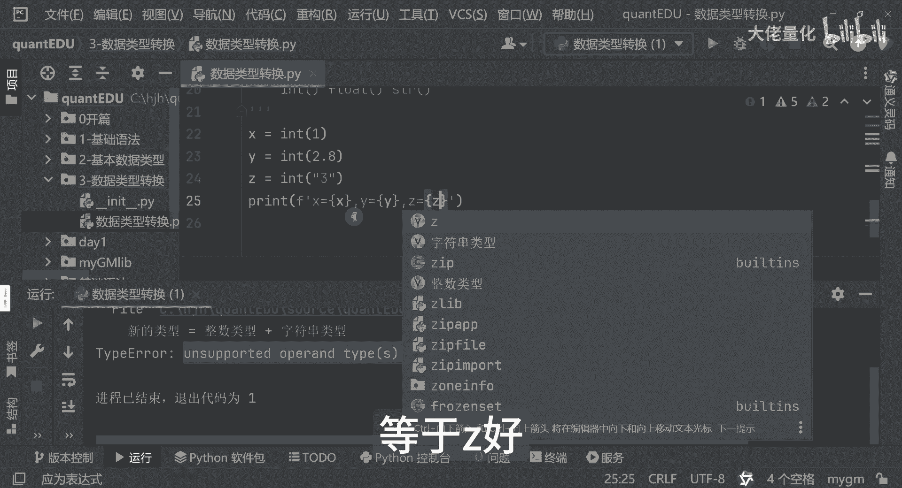

我们看下面那个输入框，看下面的命令行输出啊，可以看到X等于一，你会发现这个YL明明我们输入的是2。8，怎么到这变成了二呢，其实int来讲呢是一个integer的一个啊，就是单词啊。

就是integer一个缩写哈，那这里边它会把2。8呢变成一个整数，变成了二，那三来讲呢，它是一个字符串，用了int这个显示类型转换之后呢，它会变成一个整数三，这个是我们整数类型转换一个演示。

那接下来呢我们要学习下float类型，也就是我们的浮点类型的一个转换啊，那我们可以看一下示例哈，你比如说我们的一个XYZ来讲呢，Z等于FLOD等于三啊，W等于我们的一个FLOS点二。

那这里面我们可以看一下，把这些值打印出来哈，那同时呢把我们的一个类型啊类也打印出来。

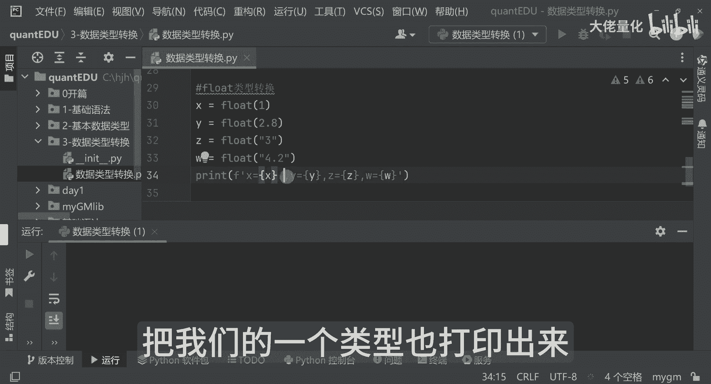

比如说我们的type x然后把它粘一下。

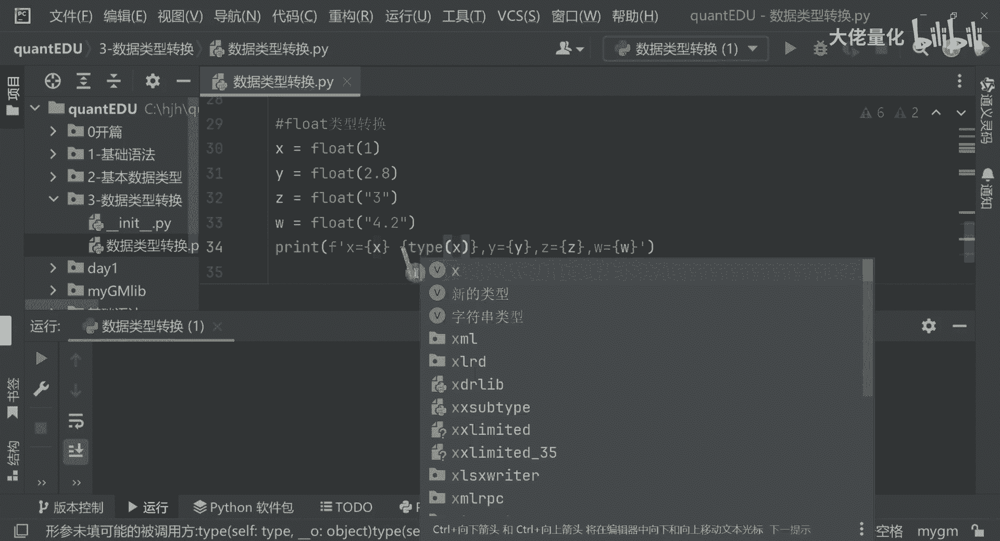

加空格啊，好这里边是我们的YZ靠Y啊，少了一个Z好，我们先打印一下，看一下啊，这里面可以看到啊，他们现在呢都是浮点类型，X等于1。0，我们输入的虽然是一个一，那Y呢是2。8，它类型也是float类型。

三呢虽然是个字符串双引号引起的哈，那这里边呢其实Z呢它是三啊，3。0哈，那W来讲呢，4。2呢，它这里面哈也是放了一行这个W4。2哈，那好那float类型的转换呢，我们就是介绍到这里。

我们看一下我们的一个string类型的型转换，那string类型来讲呢，我们可以看一下，还是以XYZ这样为例，那同样的我们把我们的值打印出来，我加一个分隔符好，可以看到这是边那个四等于XS1。

那类型呢是四串类型，然后Y传入的二整数类型，那这里边呢看的是个四川零一，然后Z呢也是4string类型啊，是3。0，那这里边呢就是已经完成了我们的这个string类型。

接下来呢我们要看一下一个实战的案例，那假如我们从财经网上，从财经数据中获取到了某只A股的股票，的一个数据和价格数据，但这个数据是字符串类型，那我们如何做，比如说我们的一个price s t r。

这是我们的价格，等于123块四毛五，这是我们的一个股票价格，那这时候我们需要怎么转换呢，实际上是通过我们的一个float类型啊，price string把它转成我们的一个浮点数类型。

那同时来讲呢再把我们的一个价格打印出来。

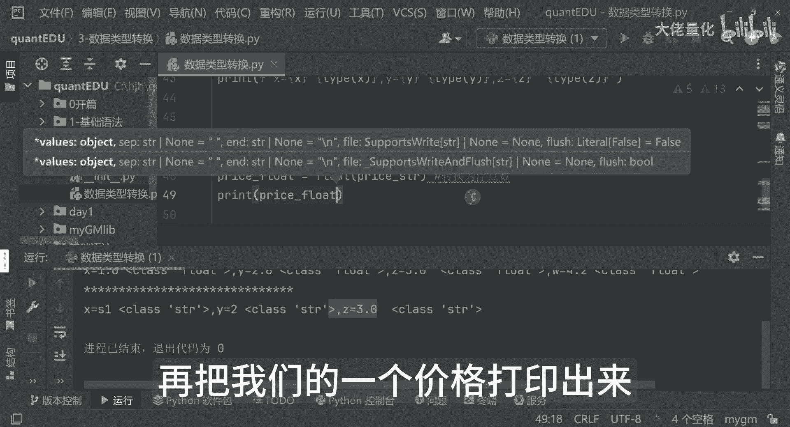

大家可以看到价格是我们的120，三块四毛五，那同时来讲呢，再把我们的一个文件类型打印出来，price string把我们的原始类型打印出来，那再把我们转译后的一个price float打印出来。

我们可以看一下效果，这里没看到原来是string类型，转完后呢就是我们的float类型好，其实除了我们刚才所演示的int string等等，还有很多那个转其他类型的函数啊，比如说我们的list啊。

list刚才我有介绍啊，比如说我们的TP，比如说我们的site等等等等，其实有很多很多还有八进制，16进制啊，这样转换其实有很多种方式啊，那这里边来讲我们要注意啊，数据类型转换并不是万能的啊。

有些数据类型之间是无法进行转换的哈，这主要取决于我们原数据是否包含，足够多的信息来进行一个目标类型的转换，那例如哈我们可以讲我们的一个整数类型哈啊，例如把我们的字符串123。

转成我们的整数型的一个123，也可以进行互转整形转那个字符串类型，因为每一个对应的字符串呢是有一个对应的值，可以进行表示哈，那那有些时候来讲，比如说你好，你要把它转成一个浮点类型。

这个其实是明显是有问题的，因为它不包含任何一个数字信息，所以说这里面我们要灵活的运用，我们的一个数据类型转换，那数据类型转换是我们Python编程，非常重要的一个概念，掌握了这个数据类型转换。

就像掌握了数据处理的一个魔法一样。

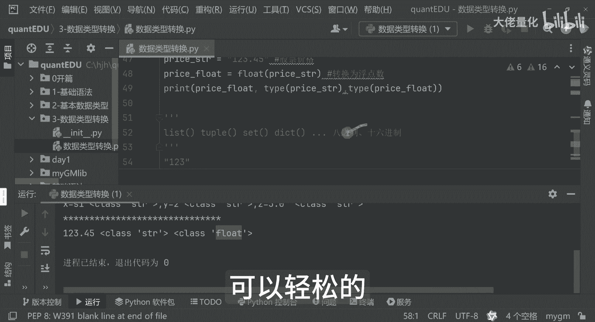

可以轻松的让我们处理更多的数据类型啊，我们可以做一个小结哈。

那在基础语法部分，我们学习了我们的import，然后那个打印print，然后还有是我们这个代码组命令行注释啊，字符串啊等等，这其实有很多等待用户输入，这个也是用的也是比较多的。

我们也讲到了一个是行与缩进，这些就是我们的一个语法规范了哈，那再往下来讲，这里面又讲到了我们一个变量赋值，然后同时呢还有我们的一个数据类型的转换啊，这些就是我们的一个基本的语法部分，其实还有很多。

这里面的我就不一一的列举出来了。

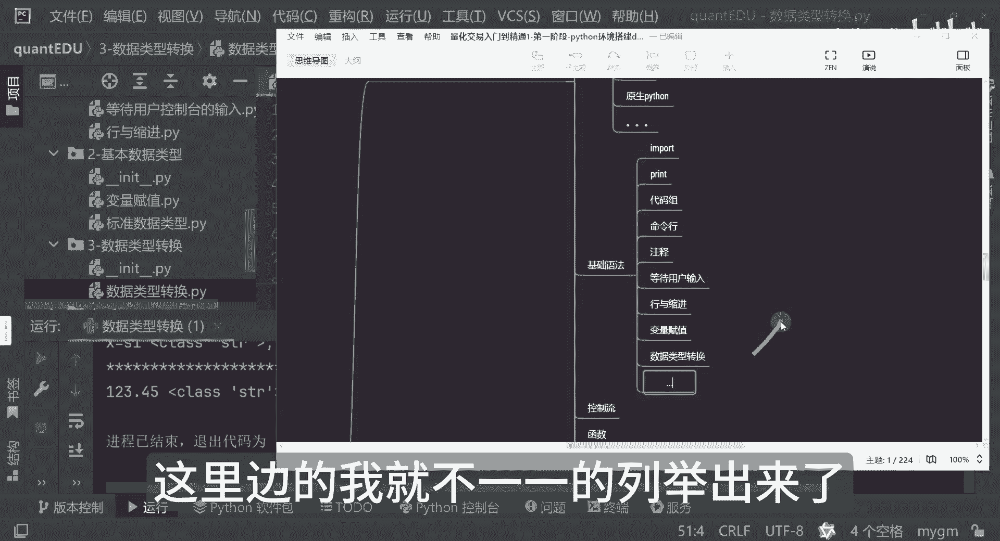

主要的来讲应该就这些应该也足够哈，下节课呢我会大家分享控制流的这部分。

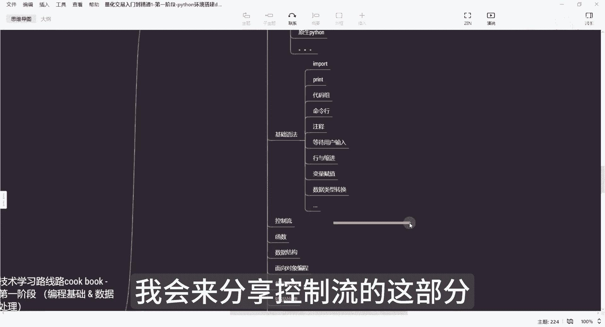